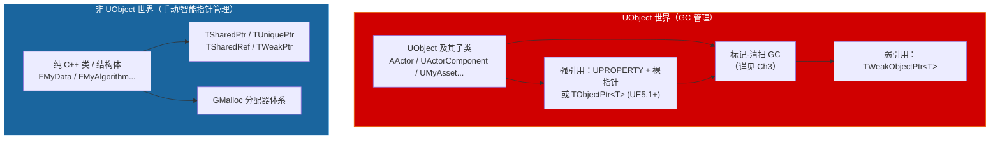

# 第五章 智能指针与内存分配：从 `std::shared_ptr` 到 `TSharedPtr`，从 `new` 到 `GMalloc`

> **一句话理解**：UE 有两套完全独立的内存管理机制——**UObject 走 GC**，**非 UObject 走智能指针 + GMalloc**。它们之间有一道不可逾越的边界：UObject 绝对不能用 `TSharedPtr`，非 UObject 也绝对没有 GC。选错 = 崩溃或泄漏。

---

## 5.1 概念直觉 —— UE 内存管理的"两个世界"

### 5.1.1 一道边界，两种规则



> 💡 **判断法则**：看一眼类名前缀——**`U` 和 `A` 开头的走 GC，`F` 开头的走智能指针**。这是 UE C++ 最重要的类型直觉。

### 5.1.2 为什么 UObject 不能用 TSharedPtr？

```cpp
// 这是 UE C++ 中最常见的"不要把两套体系混在一起"的场景

// ✗ 绝不这样做：
UCLASS()
class UMyComponent : public UActorComponent { /* ... */ };

TSharedPtr<UMyComponent> CompPtr = MakeShared<UMyComponent>();
// ↑ 编译可能通过，但后果严重：
//   1. UMyComponent 是 UObject，必须由 GC 管理（NewObject / CreateDefaultSubobject）
//   2. TSharedPtr 的引用计数和 GC 的标记-清扫是完全独立的两套系统
//   3. GC 不知道 TSharedPtr 持有这个 UObject 的引用 → 可能 GC 误回收
//   4. TSharedPtr 析构时会尝试 delete → UObject 的析构必须走 GC 路径
//      → 直接 delete UObject 是 UB / 崩溃

// ✓ UObject 正确方式：
UPROPERTY()
UMyComponent* Comp;  // GC 通过 UPROPERTY 追踪引用
// 或
TWeakObjectPtr<UMyComponent> WeakComp;  // 弱引用，不阻止 GC

// ✓ 非 UObject 正确方式：
struct FMyData
{
    int32 Value;
    TArray<float> Buffer;
};
TSharedPtr<FMyData> Data = MakeShared<FMyData>();  // OK，FMyData 不是 UObject
```

---

## 5.2 TSharedPtr —— UE 的 shared_ptr

### 5.2.1 API 对照

```cpp
// ===== 创建 =====
// std
auto sp1 = std::make_shared<MyClass>(arg1, arg2);

// UE — 推荐：MakeShared（等价 make_shared）
TSharedPtr<FMyData> SP1 = MakeShared<FMyData>(Arg1, Arg2);

// UE — 不推荐：从裸指针构造（需要引用控制器，May导致双重释放）
FMyData* Raw = new FMyData();
TSharedPtr<FMyData> SP2 = MakeShareable(Raw);
//   ↑ MakeShareable 包裹已有的裸指针。注意——一旦交给 TSharedPtr，
//     不要再通过裸指针手动 delete！

// ===== 引用计数 =====
int32 Count = SP1.GetSharedReferenceCount();  // ≈ use_count()
bool bUnique = SP1.IsUnique();                // 引用计数 == 1 ?

// ===== 解引用 =====
SP1->Value = 42;                     // 和 std::shared_ptr 一样
(*SP1).Value = 42;
FMyData& Ref = *SP1;

// ===== 获取裸指针 =====
FMyData* Raw = SP1.Get();            // = get()

// ===== 重置 =====
SP1.Reset();                         // 释放所有权，引用计数 -1
SP1 = nullptr;                       // 同上

// ===== 比较 =====
if (SP1 == SP2) { /* 比较内部裸指针 */ }
if (SP1.IsValid()) { /* 等价于 SP1.Get() != nullptr */ }
// ⚠️ IsValid() 只检查是否为 nullptr，不涉及 GC！（区别于 UObject 的 IsValid）

// ===== 转换为 TSharedRef =====
TSharedRef<FMyData> Ref = SP1.ToSharedRef();  // ⚠️ SP1 为 null 时会 断言崩溃
```

### 5.2.2 线程安全模式 —— 默认非线程安全，跨线程须显式声明

```cpp
// ⚠️ 关键：TSharedPtr 默认不是线程安全的！

// UE 的 TSharedPtr 提供两种模式（ESPMode 枚举中只有这两个值）：
// ESPMode::NotThreadSafe  — **默认值**。引用计数使用普通整数操作（非原子）
// ESPMode::ThreadSafe     — 显式线程安全（引用计数使用原子操作）

// ==== 默认行为：NotThreadSafe ====
TSharedPtr<FMyData> DefaultPtr = MakeShared<FMyData>();
// ↑ 默认使用 ESPMode::NotThreadSafe！
//   引用计数使用普通整数加减，不是原子操作
//   仅在 GameThread 使用是安全的，跨线程传递会导致引用计数竞争 → 崩溃或泄漏
//   这是为了 GameThread 上处理海量无并发需求数据时的终极性能

// ==== 跨线程共享时，必须显式声明 ThreadSafe ====
TSharedPtr<FMyData, ESPMode::ThreadSafe> ThreadSafePtr = MakeShared<FMyData>();
// ↑ 引用计数使用原子操作，可安全跨线程传递
//   和 std::shared_ptr 行为一致（std::shared_ptr 的引用计数始终是原子的）

// ==== 对比 std::shared_ptr ====
// std::shared_ptr 的引用计数始终使用原子操作，无需用户选择
// TSharedPtr 把选择权交给开发者——默认非原子以获得 GameThread 最佳性能，
// 跨线程时再显式开启原子操作。这是 UE 对游戏引擎性能极致追求的体现

### 5.2.3 MakeShared vs MakeShareable —— 内存布局与分配次数

```cpp
// ==== MakeShared<T>(Args...) —— 一次分配（推荐）====
TSharedPtr<FMyData> P1 = MakeShared<FMyData>(Arg1, Arg2);

// 内存布局（一次 Malloc）：
// ┌──────────────────────────────────────┐
// │  FSharedReferencer (控制块)          │ ← 引用计数 + 弱引用计数
// │  FMyData (对象本身)                  │ ← 构造在此连续内存中
// └──────────────────────────────────────┘
// 优势：一次分配、连续内存（缓存友好）、无需额外对齐

// ==== MakeShareable(RawPtr) —— 两次分配（不推荐）====
FMyData* Existing = GetSomeExistingObject();
TSharedPtr<FMyData> P2 = MakeShareable(Existing);

// 内存布局（两次 Malloc）：
// ┌──────────────────┐    ┌──────────────────────┐
// │  FMyData (堆上)   │    │  FSharedReferencer    │ ← 独立分配的引用控制块
// │  (用户手动 new)   │    │  (MakeShareable 内部分配) │
// └──────────────────┘    └──────────────────────┘
// 劣势：两次分配 + 内存碎片 + 两次解引用（性能更差）

// ⚠️ 前提：Existing 的生命周期尚未被任何其他机制管理
// ⚠️ 一旦交给 TSharedPtr，永远不要再手动 delete

// ==== ⚠️ 致命陷阱：同一个裸指针被 MakeShareable 包裹两次 ====
FMyData* Raw = new FMyData();
TSharedPtr<FMyData> PtrA = MakeShareable(Raw);  // 控制块 A，引用计数 = 1
TSharedPtr<FMyData> PtrB = MakeShareable(Raw);  // 控制块 B，引用计数 = 1
// ✗ 工业界致命 "屠夫代码"！
// 原因：PtrA 和 PtrB 各自创建了完全独立的引用计数控制块。
// 当 PtrA 引用计数归零 → 释放 Raw → PtrB 变成野指针！
// 当 PtrB 引用计数也归零 → 再次 Free 同一块内存 → Double Free → 闪退！
//
// 解决：永远只包裹同一个裸指针一次。如果需要共享，拷贝已有的 TSharedPtr：
TSharedPtr<FMyData> PtrB_Safe = PtrA;  // 共享同一个控制块，引用计数正确 +1

// MakeShareable + Deleter —— 自定义析构行为
FILE* FileHandle = fopen("data.bin", "rb");
TSharedPtr<FILE> FilePtr = MakeShareable(FileHandle, [](FILE* f) {
    if (f) fclose(f);  // 引用计数归零时自动 fclose
});
```

---

## 5.3 TSharedRef —— 永不空的共享引用

```cpp
// TSharedRef = 保证非空的 TSharedPtr
// C++ 标准库中没有等价物（C++26 在讨论 std::shared_ref）

// ===== 创建 =====
TSharedRef<FMyData> Ref = MakeShared<FMyData>(Args...);
//   ↑ 不能从 nullptr 创建——TSharedRef 必须始终指向有效对象

// ===== 从 TSharedPtr 转换 =====
TSharedPtr<FMyData> Ptr = MakeShared<FMyData>();
TSharedRef<FMyData> Ref = Ptr.ToSharedRef();  // ⚠️ Ptr 为 null → 断言崩溃

// ===== 使用 =====
Ref->Value = 42;                     // 不需要判空——一定有效
FMyData& RawRef = Ref.Get();        // 返回引用而非指针

// ===== 适用场景 =====
// 函数参数：语义明确——调用者必须保证传入有效对象
void ProcessData(const TSharedRef<FMyData>& Data);
// 对比 void ProcessData(const TSharedPtr<FMyData>& Data);
// → TSharedRef 版本声明了"Data 绝不能为空"，避免调用方传 nullptr

// ===== TSharedRef ↔ TSharedPtr 的类型转换规则 =====
// TSharedRef → TSharedPtr：隐式自动转换（安全）
TSharedRef<FMyData> Ref = MakeShared<FMyData>();
TSharedPtr<FMyData> Ptr = Ref;  // ✓ 隐式转换，无需显式调用
// 原因：非空对象一定可以安全地变成可空指针

// TSharedPtr → TSharedRef：必须显式调用（可能崩溃）
TSharedPtr<FMyData> MaybeNull = GetMaybeNull();
TSharedRef<FMyData> Ref2 = MaybeNull.ToSharedRef();  // ⚠️ MaybeNull 为空 → 断言崩溃
// 原因：这个转换携带了"我保证非空"的语义，需要用 .ToSharedRef() 显式承担风险
```

---

## 5.4 TUniquePtr —— UE 的 unique_ptr

```cpp
// ===== 创建 =====
TUniquePtr<FMyData> UP = MakeUnique<FMyData>(Args...);

// ===== 所有权转移 =====
TUniquePtr<FMyData> UP2 = MoveTemp(UP);  // = std::move，UP 变为 nullptr
//   ↑ 注意：UE 用 MoveTemp() 而不是 std::move()
//   底层等价——MoveTemp 内部就是 std::move 的包装
//   但 Epic 编码规范强制使用 MoveTemp：直接写 std::move 会被 UE 的静态
//   代码检查工具拦截或报 Warning（详见 Ch20 编码规范）

// ===== 释放 =====
FMyData* Raw = UP.Release();         // 放弃所有权，返回裸指针
// 之后你需要手动 delete 或交给其他管理器

// ===== 重置 =====
UP.Reset();                          // 立即 delete 对象
UP = nullptr;                        // 同上

// ===== 适用场景 =====
// 1. 工厂函数返回（调用者获得独占所有权）
TUniquePtr<FMyAlgorithm> CreateAlgorithm()
{
    return MakeUnique<FMyAlgorithm>();
}

// 2. 类内部的独占资源
class FMySystem
{
    TUniquePtr<FInternalState> State;  // 独占，不共享
};
```

---

## 5.5 TWeakPtr —— 不参与引用计数的旁观者

```cpp
// TWeakPtr = std::weak_ptr
// 持有对 TSharedPtr 管理的对象的"旁观引用"，不阻止对象释放

TSharedPtr<FMyData> StrongRef = MakeShared<FMyData>();
TWeakPtr<FMyData> WeakRef = StrongRef;     // 不增加引用计数

// ===== 使用前必须 Pin() =====
if (TSharedPtr<FMyData> Pinned = WeakRef.Pin())
{
    // Pin() 返回一个临时的 TSharedPtr——在此期间对象不会被释放
    Pinned->DoSomething();
}
// Pin() 返回的 TSharedPtr 析构后，对象又可以正常释放了

// ===== 典型场景：打破循环引用 =====
struct FTreeNode
{
    TSharedPtr<FTreeNode> Child;      // 强引用——拥有子节点
    TWeakPtr<FTreeNode> Parent;       // 弱引用——不阻止父节点释放
    // 如果没有 TWeakPtr，父子互引 → 永远无法释放 → 内存泄漏
};
```

---

## 5.6 UObject 侧的弱引用 —— TWeakObjectPtr / FObjectPtr

> 这部分在 Ch3 已经详细讲过（3.7），这里从"智能指针全景"的角度做速查对照。

```cpp
// TWeakObjectPtr —— 指向 UObject 的弱引用，不阻止 GC 回收
TWeakObjectPtr<AActor> WeakActor = SomeActor;

// 检查——三种方式：
if (WeakActor.IsValid())             // Stale + Garbage 标记检查
if (WeakActor.IsStale())             // 仅检查对象索引是否已失效
if (AActor* Ptr = WeakActor.Get())  // 获取裸指针（可能为 nullptr 或野指针）

// 使用（双重保险）：
if (AActor* Actor = WeakActor.Get())
{
    if (IsValid(Actor))              // 排除 Garbage 标记
    {
        Actor->DoSomething();
    }
}

// FObjectPtr (UE5.1+) —— 替代裸 UObject* 的增强型强引用
UPROPERTY()
TObjectPtr<AActor> TargetActor;
// Editor：安全包装 + 懒加载 + 非法访问截获
// Shipping：编译期展开为裸 AActor*，零运行时开销

// ===== 三指针对比 =====
// TSharedPtr<T>          → 非 UObject，引用计数管理
// TWeakPtr<T>            → 非 UObject，不影响引用计数，Pin() 访问
// TWeakObjectPtr<T>      → UObject，不影响 GC，Get() + IsValid() 访问
// TObjectPtr<T> (UE5.1+) → UObject 强引用替代裸指针，Shipping 中零开销
```

---

## 5.7 自定义 Deleter —— 智能指针的"析构钩子"

```cpp
// 场景：管理非标准资源（文件句柄、平台对象、第三方库资源）

// ==== 管理文件句柄 ====
TUniquePtr<FILE, TFunction<void(FILE*)>> FileGuard(
    fopen("save.dat", "rb"),
    [](FILE* f) { if (f) fclose(f); }
);

// ==== 管理平台内存（用非 GMalloc 的分配器释放）====
void* ExternalMem = FMemory::MallocExternal(1024, 16);
TSharedPtr<void> ExternalGuard = MakeShareable(ExternalMem,
    [](void* Ptr) { FMemory::FreeExternal(Ptr); }
);

// ==== 使用 TUniquePtr 管理需要特殊清理的资源 ====
struct FVulkanResource
{
    VkBuffer Buffer;
    VkDeviceMemory Memory;

    void Destroy()
    {
        vkDestroyBuffer(Device, Buffer, nullptr);
        vkFreeMemory(Device, Memory, nullptr);
    }
};

// ⚠️ UE 的 TUniquePtr 构造函数只接受裸指针——不能像 std::unique_ptr 那样传 Deleter 实例！
// 自定义 Deleter 必须是一个可默认构造的结构体/类：
struct FVulkanResourceDeleter
{
    void operator()(FVulkanResource* R) const { if (R) R->Destroy(); }
};
TUniquePtr<FVulkanResource, FVulkanResourceDeleter> VulkanRes(new FVulkanResource());
```

---

## 5.8 内存分配器 —— GMalloc 与分配策略

### 5.8.1 GMalloc —— UE 的全局分配器

```cpp
// UE 所有内存分配最终经过 GMalloc（全局分配器单例）
// 等价于 C 的 malloc/free，但增加了 UE 的追踪和调试层

// ===== 基础分配 =====
void* Ptr = FMemory::Malloc(1024);            // 等价 malloc(1024)
void* Ptr2 = FMemory::Malloc(1024, 16);      // 指定 16 字节对齐
FMemory::Free(Ptr);                           // 等价 free(Ptr)

void* Ptr3 = FMemory::Realloc(Ptr2, 2048);   // 等价 realloc
int32 Size = FMemory::GetAllocSize(Ptr3);     // 查询分配的字节数

// ===== GMalloc 不是固定的——不同平台有不同实现 =====
// Windows (UE5.3+): FMallocMimalloc（微软 Mimalloc，EPIC 官方默认，替代了 Binned2/Binned3）
// Console: FMallocBinned3 或平台特定实现
// Mobile: FMallocBinned3（低碎片分级分配器，适合内存受限环境）
// 编辑器: 大厂生产线默认启用 Mimalloc 或 TBB 以获得更好的多线程分配性能

// 你可以通过命令行参数切换：
// -Malloc=Ansi     → 标准 malloc（调试用）
// -Malloc=Binned3  → 分级分配器（适合移动端/内存受限平台）
// -Malloc=Stomp    → 内存越界检测分配器（开发用，每个分配加哨兵）
// -Malloc=Mimalloc → 微软 mimalloc（Windows 默认，高性能多线程分配）
```

### 5.8.2 帧分配器 —— FMemMark 驱动的栈式内存

```cpp
// 帧分配器的核心思想：线性栈分配 + RAII 标记回退
// → 无碎片、极快、无锁

// ===== 底层机制：FMemMark（不是"帧结束"这么简单）=====
// FMemStack 的内存不是按帧自动回收的——它的生命周期由 FMemMark 控制。
// FMemMark 是一个 RAII 对象：构造时记录当前栈顶位置，析构时回退到该位置。

void SomeGameSystemUpdate()
{
    FMemMark Mark(FMemStack::Get());  // ← 记录当前栈顶
    //    ↑ RAII 标记：离开作用域时自动 Pop()

    // 在此作用域内的所有 TMemStackAllocator 分配都在帧栈上进行：
    {
        TArray<int32, TMemStackAllocator<>> TempIndices;
        TempIndices.Add(42);
        // TempIndices 的内存来自 FMemStack 的当前栈位置
    }  // ← TempIndices 析构，但内存 没有立即释放！

    // ... 更多帧栈分配 ...

}  // ← 离开 FMemMark 作用域 → Mark 析构 → 栈顶回退
   //    FMemStack 的栈指针直接回到 Mark 记录的位置
   //    上面所有 TMemStackAllocator 分配的内存"瞬间"失效

// ⚠️ 致命陷阱：跨 FMemMark 持有引用
// 如果 TArray<T, TMemStackAllocator<>> 离开了声明它的 FMemMark 作用域，
// 其内部指针指向的内存已经被后续分配覆盖 → 内存踩踏！
// → TMemStackAllocator 的容器绝不能作为返回值或存储到成员变量中。

// ===== 在引擎中的实际应用 =====
// 引擎在每个 Tick 的最外层放置了 FMemMark
// → 所以你看到的"帧内临时数据自动回收"是 FMemMark 在 Tick 外层的效果
// → 本质上不是"帧"回收了内存，而是 FMemMark::Pop() 回退了栈顶

// ===== 分配器选择指南 =====
// 默认堆分配      → 生命周期超过当前帧的对象
// TInlineAllocator → 小数组优化（见 Ch4 4.2.3）
// TMemStackAllocator → 当前 FMemMark 作用域内的临时数据（最快但最受限）
```

### 5.8.3 对象池 —— 高频创建/销毁的救星

```cpp
// 场景：子弹、粒子、UI 元素——每帧大量创建和销毁
// 解决方案：对象池（Object Pool），复用而非重新分配

// UE 的 Core/Containers 模块中没有名为 TObjectPool 的通用公共容器。
// 引擎内部针对特定场景（如 TGraphTask、渲染命令）使用固定大小分配器，
// 但对非 UObject 结构体的通用对象池，通常自行实现：

// ==== 轻量级对象池（基于 TArray + 预分配）====
template<typename T>
struct FObjectPool
{
    TArray<T> Pool;
    TArray<bool> InUse;
    int32 Capacity;

    FObjectPool(int32 InCapacity) : Capacity(InCapacity)
    {
        Pool.SetNum(Capacity);
        InUse.SetNumZeroed(Capacity);
    }

    T* Allocate()
    {
        for (int32 i = 0; i < Capacity; ++i)
        {
            if (!InUse[i])
            {
                InUse[i] = true;
                Pool[i] = T{};  // 重置状态
                return &Pool[i];
            }
        }
        return nullptr;  // 池耗尽——扩容或等待
    }

    void Free(T* Ptr)
    {
        int32 Idx = static_cast<int32>(Ptr - Pool.GetData());
        if (Idx >= 0 && Idx < Capacity) { InUse[Idx] = false; }
    }
};

// 使用：
FObjectPool<FMyProjectileData> ProjectilePool(100);

FMyProjectileData* SpawnProjectile()
{
    FMyProjectileData* Data = ProjectilePool.Allocate();
    return Data;  // 从预分配的池中获取，零 new/delete
}

void DeSpawnProjectile(FMyProjectileData* Data)
{
    ProjectilePool.Free(Data);  // 归还池中，不释放内存
}

// ==== 更高效：TFixedSizeAllocator（引擎内部固定大小分配器）====
// 引擎在 TGraphTask、渲染命令等高频分配场景中使用 TFixedSizeAllocator，
// 它是基于单链表空闲链的固定大小对象池，远比通用 malloc 快。
// 对于日常业务开发，上面基于 TArray 的轻量池已足够覆盖绝大多数场景。

// 对于 UObject，不能直接用对象池（因为 GC 干扰），
// 但可以用类似的"标记为不活跃 + 重新初始化"的模式。
// UObject 的对象池通常通过 UActorComponent 的子对象缓存实现。
```

---

## 5.9 内存调试与泄漏检测

### 5.9.1 基础工具

```cpp
// ===== 控制台命令 =====
// stat memory        → 实时内存统计
// memreport -full    → 完整内存报告（输出到 Saved/Profiling/）
// obj list           → 列出所有 UObject（按类分组）
// obj refs Name=XXX  → 查看某个对象的引用链

// ===== 代码级内存追踪 =====
// 标记一个分配用于追踪：
void* Ptr = FMemory::Malloc(1024, 16);
FMemory::RegisterFreeCallback([](void* Ptr, uint64 Size) {
    UE_LOG(LogTemp, Log, TEXT("Freed %llu bytes at %p"), Size, Ptr);
});

// ===== MallocStomp —— 内存越界检测 =====
// 启动参数：-Malloc=Stomp
// 在每个分配的尾部放置哨兵值，释放时检查是否被破坏
// → 如果你的代码写越界了，Stomp 会在 free 时断言崩溃，精确定位
```

### 5.9.2 常见内存问题排查方法

```cpp
// 问题 1：UObject 泄漏
// 症状：关卡切换后，UObject 数量只增不减
// 排查：
//   - obj list 看哪个类数量异常多
//   - obj refs 查看是谁在持有引用
//   - 检查是否有对象 AddToRoot() 后忘了 RemoveFromRoot()
//   - 检查是否有 UPROPERTY 循环引用阻止了 GC

// 问题 2：非 UObject 泄漏
// 症状：进程内存持续增长，但 obj list 正常
// 排查：
//   - 搜索代码中所有 FMemory::Malloc 没有对应 Free 的地方
//   - 搜索代码中所有 TSharedPtr / TUniquePtr 的使用
//   - 注意：TSharedRef 的循环引用和 TSharedPtr 一样会泄漏

// 问题 3：野指针访问（UObject 被 GC 回收后仍被访问）
// 症状：随机崩溃，崩溃栈和崩溃场景毫无关联
// 排查：
//   - 搜索所有不加 UPROPERTY 的 UObject* 成员变量
//   - 对可疑引用改用 TWeakObjectPtr，配合 IsValid() 断言
//   - 开启 GC 日志：-LogGarbage 启动参数
```

---

## 5.10 30 秒速答

> **面试被问："UObject 能用 TSharedPtr 吗？为什么？"**

**绝对不能。** UE 有两套完全独立的内存管理机制——UObject 走 GC，非 UObject 走智能指针 + GMalloc。两者不能混用。

三个原因：
1. GC 不知道 TSharedPtr 的引用——即使 TSharedPtr 持有 UObject，GC 也可能在标记阶段将其判定为不可达而回收，导致 TSharedPtr 变成野指针。
2. TSharedPtr 析构时会调用 `delete`，而 UObject 的析构必须通过 GC 的路径（`BeginDestroy` → `FinishDestroy`），直接 `delete` 是未定义行为。
3. UObject 的创建必须通过 `NewObject`/`SpawnActor`/`CreateDefaultSubobject`，不能通过 `MakeShared` 或 `new` 分配。

**选择决策**：`U`/`A` 前缀 → UPROPERTY + 裸指针（或 TObjectPtr）；`F` 前缀 → TSharedPtr/TUniquePtr；弱引用 UObject → TWeakObjectPtr。

> **面试追问："TSharedPtr 和 std::shared_ptr 有什么不同？"**

最大的不同是两个。一是 **默认线程安全模式不同**：`TSharedPtr` 在未指定第二个模板参数时，**默认是 `ESPMode::NotThreadSafe`**（引用计数使用非原子的普通整数操作），这是为了 GameThread 处理海量无并发需求数据时的极致性能。而 `std::shared_ptr` 的引用计数始终是原子操作。跨线程共享 `TSharedPtr` 时，必须显式声明 `TSharedPtr<T, ESPMode::ThreadSafe>`。二是 **生态集成**：`TSharedPtr` 可以配合 UE 的 `MakeShareable` + 自定义 Deleter 更好地与 UE 内存系统集成。

---

> 📚 **下一章**：[Ch6 委托与事件系统](../06_delegates/) — 单播/多播/动态委托的选择矩阵，与 `std::function` 的性能对比，蓝图事件绑定。

> 💡 **回归本系列的底层基础**：
> - C++ 智能指针的引用计数和所有权模型 → 见 [C++ 第二章：智能指针](../../cpp_deep_dive/02_pointers_and_smart_pointers/)
> - UObject GC 全流程 → 见 [本系列 Ch3：UObject 与 GC](../03_uobject_gc/)
