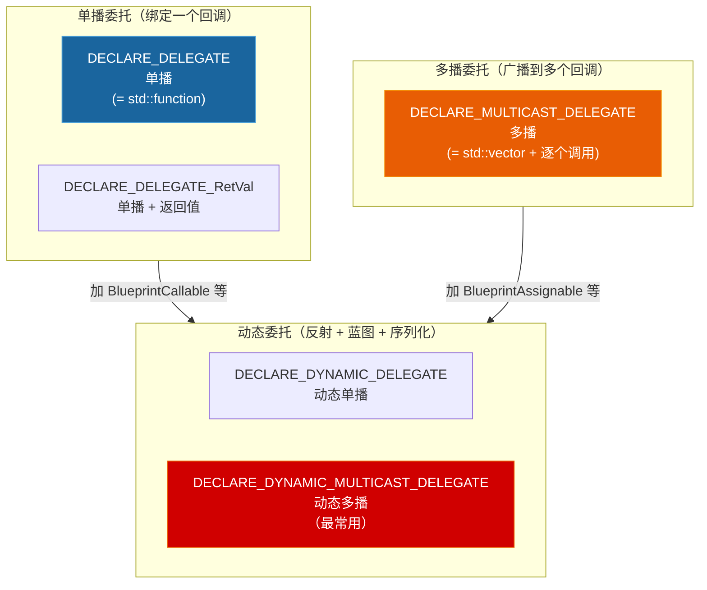

# 第六章 委托与事件：从 `std::function` 到 `DECLARE_DELEGATE`

> **一句话理解**：UE 的委托不是 `std::function` 的包装——它是 Epic 在编译期通过宏生成的**强类型回调系统**，在性能、类型安全、蓝图互操作和序列化方面远超 `std::function` 的能力边界。

---

## 6.1 概念直觉 —— 为什么不用 std::function？

### 6.1.1 先看 std::function 在游戏中的局限

```cpp
// std::function 是类型擦除的回调包装器——灵活但为灵活性付出了代价：
std::function<void(int)> Callback;

// 1. 堆分配：std::function 可能为捕获 Lambda 分配堆内存
// 2. 类型擦除：编译期无法知道具体绑定了什么——内联优化困难
// 3. 无多播：一个 std::function 只能绑一个回调
//    → 需要广播到多个监听者？自己写 std::vector<std::function>
// 4. 无蓝图互操作：蓝图中无法绑定 std::function
// 5. 无序列化：std::function 不能保存/加载
```

### 6.1.2 UE 委托的分类总览



---

## 6.2 单播委托 —— 最接近 std::function

### 6.2.1 声明、绑定与执行

```cpp
// ===== 声明（通常在类的顶部，函数体外）=====
DECLARE_DELEGATE(FMySimpleDelegate);                              // 无参数
DECLARE_DELEGATE_OneParam(FMyDelegate, int32);                    // 1 个参数
DECLARE_DELEGATE_TwoParams(FMyDelegate, int32, FString);          // 2 个参数
DECLARE_DELEGATE_RetVal(bool, FMyDelegate);                      // 返回值 + 无参数
DECLARE_DELEGATE_RetVal_OneParam(bool, FMyDelegate, int32);     // 返回值 + 1 个参数
//                        ↑ 返回值类型在最前面；带参数必须加 _OneParam/_TwoParams 后缀

// ===== 绑定 =====
class AMyActor : public AActor
{
    FMyDelegate OnSomethingHappened;

    void SetupDelegates()
    {
        // 绑定到 UObject 的成员函数（最常用）
        OnSomethingHappened.BindUObject(this, &AMyActor::MyHandler);

        // 绑定到 Lambda
        OnSomethingHappened.BindLambda([this](int32 Val) {
            UE_LOG(LogTemp, Log, TEXT("Lambda got: %d"), Val);
        });

        // 绑定到静态/全局函数
        OnSomethingHappened.BindStatic(&GlobalHandler);

        // 绑定到非 UObject 的 C++ 对象（通过 TSharedPtr 保证生命周期）
        TSharedPtr<FMyAlgorithm> Algo = MakeShared<FMyAlgorithm>();
        OnSomethingHappened.BindSP(Algo, &FMyAlgorithm::Process);
        //   ↑ BindSP = BindSharedPtr，委托持有 TSharedPtr 防止对象提前析构

        // 绑定到裸指针（危险：不保证生命周期！）
        FMyAlgorithm* RawAlgo = new FMyAlgorithm();
        OnSomethingHappened.BindRaw(RawAlgo, &FMyAlgorithm::Process);
        //   ↑ 如果 RawAlgo 在委托调用前被 delete → 崩溃！
        //     只用在你完全掌控生命周期、且委托生命周期短于被绑定对象的场景
    }

    void MyHandler(int32 Value)
    {
        // 处理事件
    }
};

// ===== 执行 =====
// 先检查是否已绑定，再执行
OnSomethingHappened.ExecuteIfBound(42);

// 不检查直接执行（未绑定时断言崩溃）
OnSomethingHappened.Execute(42);

// 检查是否已绑定
if (OnSomethingHappened.IsBound())
{
    OnSomethingHappened.Execute(42);
}

// 解绑
OnSomethingHappened.Unbind();
```

### 6.2.2 带返回值的单播委托

```cpp
DECLARE_DELEGATE_RetVal_OneParam(bool, FValidateDelegate, int32);
//   ↑ 带返回值 + 有参数 → 必须带 _OneParam / _TwoParams 等后缀

FValidateDelegate Validator;
Validator.BindLambda([](int32 Val) -> bool {
    return Val > 0 && Val < 100;
});

bool bValid = Validator.Execute(42);  // true

// ExecuteIfBound 对 RetVal 委托无效——返回值类型必须要有绑定
// 引擎没有 ExecuteIfBound_RetVal 的变体，你自己用 IsBound() 检查
```

---

## 6.3 多播委托 —— 一对多广播

### 6.3.1 声明与使用

```cpp
// ===== 声明 =====
DECLARE_MULTICAST_DELEGATE(FMyEvent);                                 // 无参
DECLARE_MULTICAST_DELEGATE_OneParam(FMyEvent, int32);                 // 1 参
DECLARE_MULTICAST_DELEGATE_TwoParams(FMyEvent, int32, FString);       // 2 参
// 注意：多播委托 不能有返回值！广播到 N 个监听者，返回哪一个？

// ===== 使用 =====
class UMyComponent : public UActorComponent
{
public:
    // 事件声明
    FMyEvent OnDamage;

    void TakeDamage(int32 Amount)
    {
        // Broadcast 向所有绑定的监听者广播
        // 等价于：遍历所有绑定 → 逐个调用
        OnDamage.Broadcast(Amount);
    }
};

// 绑定：
class UMyComponent : public UActorComponent
{
public:
    FMyEvent OnDamage;

    // 缓存 Handle 以便后续精确移除
    FDelegateHandle DamageHandle;

    void Initialize()
    {
        // AddUObject 返回 FDelegateHandle——缓存它！
        DamageHandle = OnDamage.AddUObject(this, &UMyComponent::HandleDamage);

        // AddLambda 也返回 FDelegateHandle
        FDelegateHandle LambdaHandle = OnDamage.AddLambda([](int32 Amount) {
            UE_LOG(LogTemp, Log, TEXT("Damage: %d"), Amount);
        });
    }

    void HandleDamage(int32 Amount) { /* ... */ }
};

// 移除：
void UMyComponent::Cleanup()
{
    // 精准移除单个绑定（通过 Handle）
    OnDamage.Remove(DamageHandle);

    // 或移除该对象的所有绑定（最常用）
    OnDamage.RemoveAll(this);
}

// ⚠️ 重要：只有动态多播委托（DYNAMIC_MULTICAST）才支持
// Remove(this, TEXT("FunctionName")) 这种按函数名字符串移除的语法（内部走反射查找）。
// 普通多播委托也有 Remove(FDelegateHandle)，但不是走字符串反射——必须持有 Handle。
// 最常用的批量清理：RemoveAll(this) —— 普通多播和动态多播都支持。
```

### 6.3.2 ⚠️ 多播委托执行顺序的陷阱

```cpp
// 多播委托的 Broadcast 按 Add 的顺序同步调用每一个监听者
// 意味着：如果监听者 B 在回调中修改了监听者 A 已读取的数据 → 顺序依赖 bug

DECLARE_MULTICAST_DELEGATE(FOnTick);

FOnTick OnTick;

// A 先绑定
OnTick.AddLambda([]() {
    // A: 读取 SharedData → 期望读到旧值
});

// B 后绑定
OnTick.AddLambda([]() {
    // B: 修改 SharedData → A 读到的其实是 B 修改后的值？
    // 实际上 A 先执行，B 后执行。所以 A 读到旧值，没问题。
    // 但如果 B 通过其他途径先于 A 影响了 SharedData → 隐蔽的 bug
});

// 结论：如果需要严格的回调顺序控制，不要依赖多播委托的 Add 顺序
// 改用显式的函数调用链或分阶段的多组委托
```

---

## 6.4 动态委托 —— 蓝图可绑定的委托

### 6.4.1 为什么需要动态委托？

普通（非动态）委托是纯 C++ 类型——蓝图看不见、不能绑定、不能序列化。动态委托通过反射系统暴露给蓝图：

```cpp
// ===== 动态单播 =====
DECLARE_DYNAMIC_DELEGATE(FMyDynamicDelegate);                       // 无参
DECLARE_DYNAMIC_DELEGATE_OneParam(FMyDynamicDelegate, int32, Value);
//    委托类型名                   参数类型   参数名（蓝图中的显示名）

// ===== 动态多播 —— 最常用的蓝图事件类型 =====
DECLARE_DYNAMIC_MULTICAST_DELEGATE(FMyEvent);
DECLARE_DYNAMIC_MULTICAST_DELEGATE_TwoParams(FMyDamageEvent, AActor*, DamagedActor, float, Damage);
DECLARE_DYNAMIC_MULTICAST_DELEGATE_TwoParams(FMyEvent, int32, A, FString, B);

// ===== 使用 =====
UCLASS(BlueprintType)
class AMyCharacter : public ACharacter
{
    GENERATED_BODY()

public:
    // BlueprintAssignable → 蓝图中可以绑定到此事件
    UPROPERTY(BlueprintAssignable, Category = "Events")
    FMyDamageEvent OnDamaged;

    void TakeDamage(AActor* Instigator, float Amount)
    {
        Health -= Amount;
        // 广播——所有绑定的蓝图和 C++ 都会收到通知
        OnDamaged.Broadcast(this, Amount);
    }
};

// 蓝图中的操作：
// 1. 在 Event Graph 中拖入 AMyCharacter 的 OnDamaged 节点
// 2. 选择 "Bind Event to OnDamaged"
// 3. 连接自定义逻辑 → 当 C++ 中 TakeDamage 调用 Broadcast 时触发
```

### 6.4.2 动态委托的限制

```cpp
// 1. 动态委托的参数类型必须是反射兼容的（不能是 std::string、裸 struct 等）
//    ✓ AActor*, FString, int32, float, bool, UObject* ...
//    ✗ std::vector<int>, FMyNonUStruct*, TSharedPtr<T> ...

// 2. 动态委托不能有返回值（和多播一样）

// 3. 动态委托的性能略差于非动态委托（需要过反射系统序列化参数）
//    但在事件驱动的 Gameplay 代码中，这个差异可以忽略不计

// 4. ⚠️ 所有动态委托（单播和多播）的参数都必须在宏中显式命名！
//    这不是可选的——UHT 需要参数名字符串来生成反射元数据，
//    以便在蓝图节点上渲染正确的引脚名称。不命名 → 编译报错。
DECLARE_DYNAMIC_MULTICAST_DELEGATE_TwoParams(FMyEvent, int32, Score, FString, PlayerName);
//                                                       参数类型 参数名   参数类型   参数名
```

### 6.4.3 动态委托的底层本质 —— 大厂面试连环追问

> ⚠️ **面试必考**：「动态委托在底层到底存了什么？为什么它可以被序列化？」

动态委托不存储 C++ 函数指针。它的内部只存了两样东西：

```cpp
// 动态委托的简化内部结构（概念）：
struct FDynamicDelegate
{
    TWeakObjectPtr<UObject> Object;   // ① 对象的弱引用（存储 GUObjectArray 索引）
    FName FunctionName;                // ② 函数的字符串标识（FName）
};

// 执行流程：
// 1. 检查 Object 是否有效（弱引用 + Garbage 标记）
// 2. 通过反射在 Object 上查找 FunctionName 对应的 UFunction
// 3. 调用 UObject::ProcessEvent(UFunction*, Params)
//    → ProcessEvent 是蓝图虚拟机的入口（参见 Ch2 2.8.2）
//    → 将参数压入 VM 栈帧，执行字节码或桥接到 C++

// 这解释了动态委托的全部特性：
// ✓ 可序列化     → FName + TWeakObjectPtr 都是可序列化的基本类型
// ✓ 蓝图可绑定   → 通过 FName 查找 UFunction，不依赖 C++ 函数指针
// ✓ 对象安全     → TWeakObjectPtr 架构，即使 GC Sweep 释放内存也能安全检测
//                   （比常规委托 BindUObject 的裸指针 + Garbage 标记检查更彻底）
// ✗ 性能较慢     → 每次执行都要走反射 + ProcessEvent（而非直接函数调用）
// ✗ 不支持 Payload → 参数走 VM 栈，没有空间夹带额外数据
```

---


## 6.5 绑定策略全景

### 6.5.1 五种绑定方法对比

```cpp
DECLARE_DELEGATE_OneParam(FMyDelegate, int32);
FMyDelegate Delegate;

// 1. BindUObject —— 绑定到 UObject 成员函数（★ GC 安全）
//    底层机制：内部使用 FWeakObjectPtr（弱引用）追踪 UObject 生命周期。
//    执行 ExecuteIfBound 时，委托内部通过 FWeakObjectPtr::Get() 检查对象有效性。
//    → 对象被标记为 Garbage（PendingKill 已废弃）：弱引用检测到 → IsBound() 返回 false
//    → 对象被 GC Sweep 彻底释放：弱引用自动失效 → Get() 返回 nullptr → 安全跳过
//    ★ 结论：BindUObject 在 GC 全生命周期都是安全的——不会野指针闪退
//
//    ⚠️ 唯一的例外：BindRaw —— 绑定非 UObject 的 C++ 对象（裸指针无弱引用保护）
//    对象销毁后裸指针变野指针 → ExecuteIfBound() 时 Access Violation 闪退！
//    BindRaw 的正确使用前提：调用方必须保证被绑定对象在委托执行时仍然存活。
//    正确用法：在对象析构前主动 Unbind() 或 RemoveAll(this)；
//    需要跨越 GC 清扫周期的绝对安全 → 使用动态委托（存 TWeakObjectPtr 架构）
Delegate.BindUObject(MyActor, &AMyActor::Handler);

// 2. BindSP —— 绑定到 TSharedPtr 管理的对象
//    生命周期：Strong——委托持有一个 TSharedPtr，保证对象不会提前析构
TSharedPtr<FMyAlgo> Algo = MakeShared<FMyAlgo>();
Delegate.BindSP(Algo, &FMyAlgo::Process);

// 3. BindLambda —— 绑定 Lambda
//    生命周期：随 Lambda 捕获的变量而定
Delegate.BindLambda([this](int32 Val) { /* ... */ });

// 4. BindStatic —— 绑定到静态/全局函数
//    生命周期：永远有效（静态函数不在对象上）
Delegate.BindStatic(&MyGlobalFunction);

// 5. BindRaw —— 绑定到裸 C++ 指针
//    生命周期：无保护——你全权负责保证被绑定对象的生命周期
//    ⚠️ 最容易出问题的绑定方式
FMyAlgo* Raw = new FMyAlgo();
Delegate.BindRaw(Raw, &FMyAlgo::Process);
```

### 6.5.2 ⚠️ 绑定生命周期的事故现场

```cpp
// ⚠️ 场景 1：BindUObject + 对象被 GC 标记为垃圾 → 暂时安全
UCLASS()
class UMyComponent : public UActorComponent
{
public:
    void BindCallback(AActor* SomeActor)
    {
        OnEvent.BindUObject(SomeActor, &AActor::TakeDamage);
        // ★ BindUObject 内部使用 FWeakObjectPtr 追踪 SomeActor：
        // SomeActor 被 Destroy() → 标记为 Garbage → 弱引用检测到 → IsBound() 返回 false
        // SomeActor 被 GC Sweep 彻底释放 → 弱引用自动失效 → Get() 返回 nullptr → 安全跳过
        // 结论：BindUObject 跨越 GC 全生命周期绝对安全——无需 Unbind！
        //
        // ⚠️ 真正的危险：BindRaw（绑定非 UObject 的裸 C++ 指针——无弱引用保护）
        // 对象销毁后裸指针变野指针 → ExecuteIfBound() 时 Access Violation 闪退
        // BindRaw 必须在对象销毁前手动 Unbind()
    }
};
// BindUObject = FWeakObjectPtr 架构 → GC 全生命周期安全
// BindRaw = 裸指针，无 GC 保护 → 对象销毁前必须 Unbind()

// ✗ 场景 2：BindRaw + 对象析构 → 必定崩溃
FMyAlgo* Algo = new FMyAlgo();
Delegate.BindRaw(Algo, &FMyAlgo::Process);
delete Algo;              // ← 委托不知道 Algo 已经没了（裸指针，无追踪机制）
Delegate.ExecuteIfBound(42);  // ← 崩溃！无任何安全防护

// 解决：用 BindSP 替代 BindRaw，让 TSharedPtr 管理生命周期

// 场景 3：Lambda 捕获 this + Actor Destroy → 崩溃（和 Ch3 的异步陷阱一样）
void UMyComponent::SetupTimer()
{
    GetWorld()->GetTimerManager().SetTimer(TimerHandle,
        [this]() {  // ← this 可能在定时器触发前被 Destroy
            DoSomething();
        }, 1.0f, false);
}
// 解决：用 TWeakObjectPtr 捕获 + IsValid() 检查（参见 Ch3 3.9.3）
```

---

## 6.6 委托与事件的性能对比

### 6.6.1 为什么 UE 的委托比 std::function 快？

```cpp
// 需要澄清一个常见误解：UE 委托并非"没有虚函数调用"。
// 它的底层同样使用了多态——IDelegateInstance 接口 + 各子类（如
// TBaseUObjectMethodDelegateInstance）——因此依然存在 vtable 间接寻址。

// UE 委托真正胜出的原因是 内联分配器（Inline Allocator）的疯狂优化：

// UE 委托内部预留了一块连续的栈空间缓冲区（TAlignedBytes）：
DECLARE_DELEGATE_OneParam(FMyDelegate, int32);
FMyDelegate D;
D.BindLambda([x, y, z](int32 Val) { /* 捕获了 3 个变量 */ });
// ↑ 如果 Lambda 捕获的数据 + Payload 小于预设的内部缓冲区阈值，
//   委托 完全不会触发堆分配！零 Malloc！
//   而对于 std::function，捕获超过小对象优化（SOO）阈值时，
//   大概率会触发一次全局堆分配。

// 性能差异总结：
// - UE 委托：内联分配器 → 小回调零堆分配 → 缓存友好
// - std::function：类型擦除 + 可能堆分配 → 更不可预测的开销
// 对于每帧高频创建/销毁委托的场景（如 UI 事件绑定），差异显著

// 此外，UE 委托是编译期强类型的——不像 std::function 需要运行时
// 类型擦除带来的额外间接层，这也是性能优势的一部分。
```

### 6.6.2 动态委托 vs 非动态委托的开销

```cpp
// 非动态委托：纯 C++ 调用，无反射开销
FMyMulticastDelegate NonDynamic;
NonDynamic.Broadcast(42);  // 直接函数调用

// 动态委托：通过反射序列化参数，再调用
FMyDynamicMulticastDelegate Dynamic;
Dynamic.Broadcast(42);  // 额外开销：参数打包 + 反射查找 + 解包

// 选择策略：
// - 高频调用（每帧）→ 非动态多播
// - 需要蓝图绑定      → 动态多播
// - 事件驱动（偶尔）  → 动态多播（开销可忽略）
```

---

## 6.7 委托声明宏速查

```cpp
// ===== 无参数 =====
DECLARE_DELEGATE(FDelegateName);
DECLARE_MULTICAST_DELEGATE(FDelegateName);
DECLARE_DYNAMIC_DELEGATE(FDelegateName);
DECLARE_DYNAMIC_MULTICAST_DELEGATE(FDelegateName);

// ===== 1 个参数 =====
DECLARE_DELEGATE_OneParam(FDelegateName, Param1Type);
DECLARE_DELEGATE_RetVal_OneParam(RetType, FDelegateName, Param1Type);
DECLARE_MULTICAST_DELEGATE_OneParam(FDelegateName, Param1Type);
DECLARE_DYNAMIC_DELEGATE_OneParam(FDelegateName, Param1Type, Param1Name);
DECLARE_DYNAMIC_MULTICAST_DELEGATE_OneParam(FDelegateName, Param1Type, Param1Name);

// ===== 2 个参数 =====
DECLARE_DELEGATE_TwoParams(FDelegateName, Param1Type, Param2Type);
DECLARE_DELEGATE_RetVal_TwoParams(RetType, FDelegateName, Param1Type, Param2Type);
DECLARE_MULTICAST_DELEGATE_TwoParams(FDelegateName, Param1Type, Param2Type);
DECLARE_DYNAMIC_DELEGATE_TwoParams(FDelegateName, Param1Type, Param1Name, Param2Type, Param2Name);
DECLARE_DYNAMIC_MULTICAST_DELEGATE_TwoParams(FDelegateName, Param1Type, Param1Name, Param2Type, Param2Name);

// ===== 3 个参数（最大支持 9 个，但建议超过 4 个时用结构体封装）=====
DECLARE_DELEGATE_ThreeParams(FDelegateName, T1, T2, T3);

// ===== 带 Payload 的委托（在绑定时夹带额外数据）=====
// ⚠️ Payload 是纯 C++ 委托（非动态委托）的独占特权！
// 动态委托（DYNAMIC）由于走虚拟机参数栈（ProcessEvent），
// 完全不支持在绑定时夹带任何 Payload 变量。
// 如果试图对动态委托使用 Payload → 编译报错。

DECLARE_DELEGATE_OneParam(FOnDamage, int32);  // 注意：不是 DYNAMIC！
// 绑定 Payload：
OnDamage.BindUObject(this, &AMyActor::HandleDamage, ExtraData);
// 调用时，HandleDamage 收到的参数：广播参数 + Payload 拼接
```

---

## 6.8 实战：用委托搭建一个事件驱动的受伤系统

```cpp
// ===== DamageSystem.h =====
#pragma once
#include "CoreMinimal.h"
#include "DamageSystem.generated.h"

// 委托声明（不放在类内部——宏展开为全局类型）
DECLARE_DYNAMIC_MULTICAST_DELEGATE_TwoParams(
    FOnHealthChanged, int32, NewHealth, int32, Delta);

DECLARE_DYNAMIC_MULTICAST_DELEGATE_OneParam(
    FOnDeath, AActor*, KilledActor);

DECLARE_DYNAMIC_DELEGATE_RetVal_TwoParams(
    bool, FOnDamageFilter, AActor*, Instigator, float, Damage);
//    ↑ 返回 bool：返回 true 表示"阻止此次伤害"

UCLASS(BlueprintType, Blueprintable)
class UHealthComponent : public UActorComponent
{
    GENERATED_BODY()

public:
    // ==== 属性 ====
    UPROPERTY(EditAnywhere, BlueprintReadWrite, Category = "Health")
    int32 MaxHealth = 100;

    UPROPERTY(EditAnywhere, BlueprintReadWrite, Category = "Health",
              meta = (ClampMin = 0))
    int32 CurrentHealth;

    // ==== 事件（蓝图可绑定）====
    UPROPERTY(BlueprintAssignable, Category = "Events")
    FOnHealthChanged OnHealthChanged;

    UPROPERTY(BlueprintAssignable, Category = "Events")
    FOnDeath OnDeath;

    // ==== 伤害过滤器（蓝图可覆写）====
    // ⚠️ 动态单播委托必须加 UPROPERTY 才能在蓝图中可见并赋值！
    UPROPERTY(BlueprintReadWrite, Category = "Health")
    FOnDamageFilter DamageFilter;

    // ==== 函数 ====
    UFUNCTION(BlueprintCallable, Category = "Health")
    void TakeDamage(AActor* Instigator, float Damage);

    UFUNCTION(BlueprintPure, Category = "Health")
    float GetHealthPercent() const { return (float)CurrentHealth / MaxHealth; }
};

// ===== DamageSystem.cpp =====
#include "DamageSystem.h"

void UHealthComponent::TakeDamage(AActor* Instigator, float Damage)
{
    if (CurrentHealth <= 0) return;

    // 1. 伤害过滤——如果任何过滤器返回 true，阻止伤害
    if (DamageFilter.IsBound() && DamageFilter.Execute(Instigator, Damage))
    {
        return;  // 伤害被阻止（例如无敌状态、护盾）
    }

    // 2. 计算伤害
    int32 OldHealth = CurrentHealth;
    CurrentHealth = FMath::Clamp(CurrentHealth - (int32)Damage, 0, MaxHealth);
    int32 Delta = CurrentHealth - OldHealth;  // 负数

    // 3. 广播血量变化——UI、音效、动画... 所有监听者收到通知
    OnHealthChanged.Broadcast(CurrentHealth, Delta);

    // 4. 广播死亡事件
    if (CurrentHealth <= 0)
    {
        OnDeath.Broadcast(GetOwner());
    }
}
```

---

## 6.9 30 秒速答

> **面试被问："UE 的委托和 std::function 有什么区别？"**

UE 的委托是通过**宏在编译期生成的强类型回调系统**，`std::function` 是运行时类型擦除的通用回调包装器。四个核心差异：

1. **多播能力**：UE 的多播委托（`DECLARE_MULTICAST_DELEGATE`）原生支持一对多广播，`std::function` 只能绑一个回调。
2. **蓝图互操作**：动态委托（`DECLARE_DYNAMIC_MULTICAST_DELEGATE`）通过反射系统暴露给蓝图，蓝图可直接绑定和触发。
3. **性能**：UE 委托编译期确定类型，可内联优化；`std::function` 通过虚函数调用，且可能触发堆分配。
4. **生命周期绑定**：`BindUObject`/`BindSP`/`BindRaw` 提供了不同级别的生命周期安全保障——例如 `BindSP` 持有一个 `TSharedPtr` 保证被绑定对象不被提前析构。

> **面试追问："什么时候用动态委托，什么时候用非动态委托？"**

需要蓝图绑定 → 动态委托。纯 C++ 内部回调且高频调用 → 非动态委托。实际项目中，事件驱动型（OnDamage、OnDeath）大部分用动态多播，因为策划和美术需要在蓝图中响应这些事件。

---

> 📚 **下一章**：[Ch7 多线程与异步](../07_concurrency/) — GameThread 铁律、FRunnable/AsyncTask/ParallelFor、TaskGraph 系统——第一部收官。

> 💡 **回归本系列的底层基础**：
> - `std::function` 实现原理 → 见 [C++ 第八章：现代 C++](../../cpp_deep_dive/08_modern_cpp/)
> - GC 与 UObject 生命周期 → 见 [本系列 Ch3：UObject 与 GC](../03_uobject_gc/)
