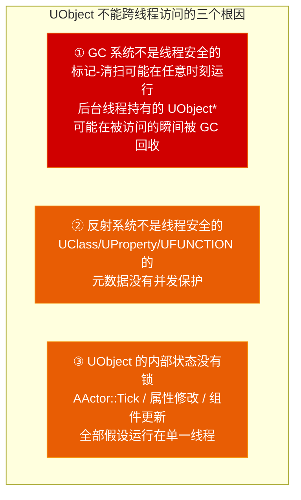

# 第七章 多线程与异步：GameThread 铁律下的并发之道

> **一句话理解**：在 UE 中写多线程代码，你首先要学的不是"怎么开线程"，而是"为什么 99% 的 UObject 操作必须在 GameThread 上"——理解这条铁律之后，剩下的就是选合适的工具（FRunnable / AsyncTask / ParallelFor）并保证不越界。

---

## 7.1 概念直觉 —— 为什么 GameThread 是铁律？

### 7.1.1 一个崩溃和它的根因

```cpp
// 这是 UE C++ 中最常见的多线程错误：
void UMyComponent::LoadAssetAsync()
{
    // ✗ 错误示范——后台线程直接修改 UObject
    AsyncTask(ENamedThreads::AnyBackgroundThreadNormalTask, [this]() {
        // 后台线程中！
        this->Health -= 10;  // ← 崩溃！或数据损坏！
        // UObject 的 Health 属性在后台线程被修改了，
        // 而 GameThread 可能正在同时读取它。
    });
}
```

### 7.1.2 为什么 UObject 不是线程安全的？



```cpp
// 具体到代码层面：
UCLASS()
class UMyObject : public UObject
{
public:
    UPROPERTY()
    int32 Value;  // ← 没有任何 mutex 保护！

    void Modify()
    {
        Value++;  // ← 这不是原子操作！
        // 在多线程下：读 → 加 1 → 写，三步之间可能被其他线程打断
    }
};

// GameThread 的严格约束是 Epic 做的一个 工程权衡：
// 单线程假设 → 代码更简单 → 更容易维护千万行引擎代码
// 代价 → 你需要学会如何把非 UObject 的工作分发到其他线程

// ==== 引擎如何在底层强制拦截跨线程访问？====
// 1. check(IsInGameThread()) —— 散布在核心逻辑（物理更新、组件注册、
//    Actor 生成等）中的断言大闸。如果你在后台线程触发了这些代码，
//    Development 构建中直接断言崩溃，精确定位违规位置。
// ★ Shipping 警告：check() 在 SHIPPING=1 时被完全抽离（Compile Out）——
//    跨线程非法篡改 UObject 在 Shipping 中不会断言崩溃，而是直接引发
//    随机内存损坏（Memory Corruption）或间歇性闪退，极难排查！
// 2. checkNoReentry —— 防重入保护，防止同一函数在同一线程上递归调用
//    导致的栈溢出或逻辑混乱。
// 3. 渲染线程侧：ENQUEUE_RENDER_COMMAND 内部不仅不能碰 UObject，
//    如果涉及图形硬件交互，必须确保 GDynamicRHI 已初始化完毕。
//    （在引擎启动的早期阶段，GDynamicRHI 可能为 nullptr）
```

---

## 7.2 FRunnable —— 自定义线程（最接近 std::thread）

### 7.2.1 创建与管理

```cpp
// ===== 定义工作线程 =====
class FMyWorker : public FRunnable
{
public:
    FMyWorker()
        : bShouldStop(false)
    {
        // 创建事件用于线程间信号——默认非信号态，手动重置
        WorkReadyEvent = FPlatformProcess::CreateSynchEvent(false);

        Thread = FRunnableThread::Create(
            this,                      // FRunnable 实例
            TEXT("MyWorkerThread"),    // 线程名（调试器可见）
            0,                         // 栈大小（0 = 默认）
            TPri_Normal                // 优先级
        );
    }

    virtual ~FMyWorker()
    {
        // 析构前必须确保线程已停止
        Stop();
        if (Thread)
        {
            Thread->WaitForCompletion();  // 等待线程结束
            delete Thread;
        }
        // 删除事件，释放内核资源
        if (WorkReadyEvent)
        {
            FPlatformProcess::DeleteSynchEvent(WorkReadyEvent);
            WorkReadyEvent = nullptr;
        }
    }

    // 线程启动时调用一次——做初始化
    virtual bool Init() override
    {
        return true;  // 返回 true = 初始化成功，线程继续
                      // 返回 false = 线程中止
    }

    // 线程的主循环——事件驱动，不轮询
    virtual uint32 Run() override
    {
        while (!bShouldStop)
        {
            // ✗ 业余写法：FPlatformProcess::Sleep(0.01f);
            //    固定 Sleep 10ms → 数据响应延迟高达 10ms！
            //    在高频传感器、网络 I/O 等场景中不可接受

            // ✓ 工业级写法：事件驱动——通过 FEvent 阻塞等待
            WorkReadyEvent->Wait();  // 无开销的阻塞挂起
            //   ↑ 主线程调用 WorkReadyEvent->Trigger() 时瞬间唤醒

            // 处理工作...
            DoWork();
        }
        return 0;
    }

    // 只有在无法挂起的极少数高频死循环中，才允许：
    // FPlatformProcess::Sleep(0.0f);  // 仅让出当前 CPU 时间片

    // 请求停止——通常在析构时调用
    virtual void Stop() override
    {
        bShouldStop = true;
        // 触发事件唤醒线程——否则线程可能挂在 Wait() 上永远不出来
        if (WorkReadyEvent)
        {
            WorkReadyEvent->Trigger();
        }
    }

private:
    FRunnableThread* Thread = nullptr;
    FThreadSafeBool bShouldStop;     // 用 FThreadSafeBool，不是普通 bool！
    FEvent* WorkReadyEvent = nullptr; // 事件——用于线程间唤醒
};

// ===== 使用 =====
FMyWorker* Worker = new FMyWorker();
// Worker 在后台运行...
// 不再需要时：
delete Worker;  // 析构函数中调用了 Stop() + WaitForCompletion()
```

### 7.2.2 FRunnable vs std::thread

| | FRunnable | std::thread |
|---|---|---|
| 线程命名 | ✅ 调试器可见的名字 | ❌ 需要平台特定 API |
| 停止机制 | ✅ `bShouldStop` + `FThreadSafeBool` | ❌ 需自己实现 |
| 优先级控制 | ✅ `TPri_Normal` 等引擎枚举 | ❌ 平台特定 |
| UE 集成 | ✅ 与引擎统计、调试工具集成 | ❌ 完全外部的线程 |
| API 风格 | 面向对象（Init/Run/Stop） | 函数式（传入 callable） |
| 使用建议 | 长期运行的后台线程 | 与第三方库集成时的临时线程 |

---

## 7.3 现代 Tasks 系统 —— UE5 异步编程的首选入口

> ⚠️ **UE5 时代的重要变更**：基于 `Async.h` 的旧版 `AsyncTask` 已被 Epic 列为不推荐（Discouraged）API。现代 UE5 项目的异步编程首选 **`UE::Tasks` 命名空间**（`#include "Tasks/Task.h"`）——它拥有更低的调度开销、更先进的 Work-Stealing 算法以及更优雅的依赖拓扑构建能力。`AsyncTask` 仅用于维护老旧代码。

### 7.3.1 基本用法：`UE::Tasks::Launch`

```cpp
#include "Tasks/Task.h"

// ===== 提交一个任务到后台线程 =====
UE::Tasks::Launch(TEXT("MyHeavyComputation"), []() {
    // 在这里做纯计算——不要碰 UObject！
    TArray<FVector> Results;
    for (int i = 0; i < 100000; i++)
    {
        Results.Add(HeavyComputation(i));
    }

    // ✓ 计算完成后，回到 GameThread 安全地更新 UObject：
    AsyncTask(ENamedThreads::GameThread, [Results = MoveTemp(Results)]() {
        // 注意：回到 GameThread 的跳转仍可用 AsyncTask（这是它唯一合理的场景）
        for (AActor* Actor : SomeActors)
        {
            Actor->SetActorLocation(Results[0]);  // ✓ 安全！
        }
    });
});

// ===== 带依赖关系的任务链 =====
UE::Tasks::FTask TaskA = UE::Tasks::Launch(TEXT("StepA"), []() {
    // 第一步计算
    return LoadRawData();
});

UE::Tasks::FTask TaskB = UE::Tasks::Launch(TEXT("StepB"), []() {
    // 第二步计算（依赖 TaskA 的结果）
}, UE::Tasks::Prerequisites(TaskA));  // ← TaskB 在 TaskA 完成后才执行

// ===== 等待所有任务完成 =====
TArray<UE::Tasks::FTask> Tasks;
for (int i = 0; i < 100; i++)
{
    Tasks.Add(UE::Tasks::Launch(TEXT("BatchTask"), [i]() {
        ProcessBatch(i);
    }));
}
UE::Tasks::Wait(Tasks);  // 阻塞直到所有任务完成
```

### 7.3.2 命名线程速查

```cpp
// ===== 任务线程类型（ENamedThreads::Type）=====

// GameThread — 主线程，唯一可以操作 UObject 的线程
ENamedThreads::GameThread

// 渲染线程 — 处理渲染命令（不要直接在上面做游戏逻辑）
ENamedThreads::ActualRenderingThread  // ★ 注意：不是 RendererThread！

// RHI 线程 — 图形 API 调用（DirectX/Vulkan），比渲染线程更底层
ENamedThreads::RHIThread

// 后台线程池 — 通用后台工作
ENamedThreads::AnyBackgroundThreadNormalTask   // 普通优先级
ENamedThreads::AnyBackgroundHiPriTask          // 高优先级

// 你通常只关心两个：
// → GameThread（回到主线程更新 UObject）
// → AnyBackgroundThreadNormalTask（分发纯计算到后台）
```

### 7.3.3 传统 AsyncTask（仅用于维护旧代码）

```cpp
// 如果你在维护 UE4 升级上来的老项目，可能还会看到：
#include "Async/Async.h"

// 旧版用法——不推荐在新代码中使用：
AsyncTask(ENamedThreads::AnyBackgroundThreadNormalTask, []() {
    DoWork();
});

// 旧版 Async(TFuture) 的返回值处理：
TFuture<int32> Future = Async(EAsyncExecution::ThreadPool, []() -> int32 {
    return HeavyComputation();
});
int32 Result = Future.Get();  // ⚠️ 阻塞调用线程！不要在 GameThread 上做

// 新代码请改用 UE::Tasks::Launch
```

### 7.3.4 ⚠️ Lambda 捕获 this 的线程安全铁律

```cpp
UCLASS()
class UMyComponent : public UActorComponent
{
    void DoAsync()
    {
        // ✗ 危险！this 可能在 Lambda 执行前被 Destroy
        UE::Tasks::Launch(TEXT("BadTask"), [this]() {
            // this 指向的 UMyComponent 可能已经被 GC 回收了！
        });

        // ✓ 安全方式：用 TWeakObjectPtr
        TWeakObjectPtr<UMyComponent> WeakThis(this);
        UE::Tasks::Launch(TEXT("GoodTask"), [WeakThis]() {
            // 后台线程中 不能 调用 WeakThis.IsValid()！
            // IsValid() 内部查 GUObjectArray，有线程冲突风险
            // → 后台只做纯计算，不接触 UObject 和 IsValid()
            int32 Result = Compute();

            // 回到 GameThread 后 才能 安全调用 IsValid()：
            AsyncTask(ENamedThreads::GameThread, [WeakThis, Result]() {
                if (WeakThis.IsValid())  // ← 只在 GameThread 上调用！
                {
                    WeakThis->ApplyResult(Result);  // ✓ 安全
                }
            });
        });
    }
};
```

### 7.3.5 工具选择指南

```
简单后台计算 + 回到 GameThread → UE::Tasks::Launch（推荐）或 AsyncTask（旧代码）
数据并行（独立的循环迭代）          → ParallelFor
需要精细控制任务依赖关系             → UE::Tasks::Launch + Prerequisites
长期运行的后台线程                   → FRunnable + FEvent
```

---

## 7.4 ParallelFor —— 数据并行

### 7.4.1 基本用法

```cpp
// ParallelFor：将一个 for 循环的工作自动拆分成多个线程并行执行
// 适用条件：每次迭代是独立的、不依赖其他迭代的结果

TArray<FVector> Vertices;
Vertices.SetNum(100000);  // 先分配好大小！

// ===== 最简形式 =====
ParallelFor(Vertices.Num(), [&](int32 Index) {
    // Index 从 0 到 Vertices.Num() - 1
    // 不同的 Index 可能在不同线程上同时执行！
    Vertices[Index] = ComputeVertex(Index);
});
// ParallelFor 返回时，所有迭代都已完成

// ===== 控制并行粒度 =====
// 标准 ParallelFor 第三参数接受 EParallelForFlags 或 bool，不接受纯 int
ParallelFor(Vertices.Num(), [&](int32 Index) {
    Vertices[Index] = Normalize(Vertices[Index]);
}, EParallelForFlags::None);
// 如需精细控制分块大小，使用 ParallelForWithPreInit 或手动按批次 dispatch

// ===== TArray 的并发写入在逻辑上是安全的 =====
// 因为每个线程写不同的索引位置（无竞争），所以不需要加锁：
ParallelFor(Vertices.Num(), [&](int32 Index) {
    Vertices[Index] = Process(Vertices[Index]);
    // ✓ 逻辑安全：不同 Index 写入不同内存位置，无数据竞争
});

// ⚠️ 但有一个隐藏的性能杀手——伪共享（False Sharing）
// 当多个线程同时写入连续且尺寸较小的元素（如 float、int32）时，
// 如果相邻索引落在同一个 CPU 缓存行（Cache Line，通常 64 字节）内：
//
//   | 线程 A 写 [0] | 线程 B 写 [1] | 线程 C 写 [2] | ...
//   |←—————— 同一个 Cache Line (64B) ——————→|
//
// → 各核心的 L1/L2 缓存频繁发生 Cache Invalidation Bounce
// → CPU 在硬件层面反复拉锯等待
// → ParallelFor 反而比单线程还慢！
//
// 规避方式：
// 1. 手动按批次 dispatch（如每 256 个元素一组），增大每次迭代的工作量
// 2. 用局部变量缓冲计算结果，最后一次性写回
// 3. 处理大尺寸元素（如 FVector/FMatrix）时通常不受影响

### 7.4.2 ⚠️ ParallelFor 内不能做的事

```cpp
ParallelFor(1000, [&](int32 Index) {
    // ✗ 不能访问 UObject！
    // SomeActor->SetActorLocation(...);  // 崩溃！

    // ✗ 不能 Add 到同一个 TArray——这不是线程安全的
    // SharedArray.Add(Index);  // 数据竞争！需要加锁

    // ✗ 不能访问非原子的共享变量
    // SharedCounter++;  // 数据竞争！

    // ✓ 读取不会变的共享数据
    float Val = ReadOnlyConfig[Index];  // 只要 ReadOnlyConfig 不被改变

    // ✓ 写入预分配好的不同索引位置
    PreallocatedArray[Index] = Result;  // 每个线程写不同的位置
});
```

---

## 7.5 线程同步原语

### 7.5.1 FCriticalSection / FScopeLock —— 互斥锁

```cpp
#include "HAL/CriticalSection.h"

class FThreadSafeCounter
{
    FCriticalSection CriticalSection;  // = std::mutex
    int32 Value = 0;

public:
    void Increment()
    {
        FScopeLock Lock(&CriticalSection);  // = std::lock_guard
        // ↑ 构造时自动 Lock()，析构时自动 Unlock()
        //   即使函数中途 return 或抛异常，也会安全释放
        Value++;
    }

    int32 GetValue()
    {
        FScopeLock Lock(&CriticalSection);
        return Value;
    }
};

// ===== 等价的标准 C++ 写法 =====
// FCriticalSection   = std::mutex（UE4 时代的标准锁）
// FScopeLock          = std::lock_guard<std::mutex>
// FScopeTryLock       = std::try_lock

// ===== 现代 UE5 推荐：UE::FMutex（Misc/Mutex.h）=====
// UE::FMutex 是 UE5 引入的现代轻量级互斥锁，建议逐步替代 FCriticalSection：
//
// #include "Misc/Mutex.h"
// UE::FMutex MyMutex;
// {
//     std::lock_guard<UE::FMutex> Lock(MyMutex);  // 兼容 C++ 标准锁接口！
//     SharedValue++;
// }
//
// 优势：与 std::unique_lock / std::lock_guard 原生兼容，开销更低，
//       避免了 FCriticalSection 的平台特化实现差异（Windows 临界区 vs Unix pthread）
```

### 7.5.2 TAtomic —— 原子操作

```cpp
#include "HAL/PlatformAtomics.h"

// TAtomic = std::atomic<T>
// 不需要加锁的线程安全操作，开销远小于 FCriticalSection

TAtomic<int32> Counter(0);

// 原子递增
++Counter;               // 前置递增（原子），返回新值（TAtomic 对齐 std::atomic，用运算符）
int32 Old = Counter++;   // 后置递增（原子），返回旧值

// 原子递减（TAtomic 无 Increment/Decrement 方法，用运算符）
--Counter;               // 前置递减（原子）

// 原子读写
Counter.Store(42);       // 等价于 Counter = 42（原子写入）
int32 Val = Counter.Load();  // 原子读取

// 原子比较交换（CAS，无锁编程的核心原语）：
int32 Expected = 0;
int32 Desired = 1;
if (Counter.CompareExchange(Expected, Desired))
{
    // CAS 成功：Counter 之前是 0，现在被设为 1
}
else
{
    // CAS 失败：Counter 之前不是 0，Expected 被更新为 Counter 的当前值
}

// ===== FThreadSafeBool / FThreadSafeCounter =====
// 引擎的便捷包装，底层用的就是 TAtomic
FThreadSafeBool bIsRunning(true);
FThreadSafeCounter CompletedTaskCount;
```

### 7.5.3 FEvent —— 线程间信号

```cpp
// FEvent = 条件变量 + 事件的 UE 封装
// 用于一个线程等待另一个线程的信号

// 创建事件（RAII 自动管理：构造中 CreateSynchEvent，析构中 DeleteSynchEvent）
FScopedEvent Event;

// 工作线程——等待信号
void WorkerThread(FEvent* Event)
{
    while (true)
    {
        Event->Wait();           // 阻塞，直到被 Trigger
        // 收到信号，处理工作...
        DoWork();
        Event->Reset();          // 清除信号，准备下一次等待
    }
}

// 主线程——发送信号
void MainThread(FEvent* Event)
{
    // 准备数据...
    PrepareWork();
    Event->Trigger();            // 发送信号，唤醒工作线程
}
```

---

## 7.6 底层调度：TaskGraph 与 UE::Tasks 的关系

> 💡 本节帮助你理解引擎并发系统的架构演进，日常开发中你直接使用 7.3 的 `UE::Tasks::Launch` 即可。

### 7.6.1 两套系统的关系

```cpp
// UE4 时代的 TaskGraph（传统，臃肿）：
// 需要手写 TGraphTask，定义嵌套的 FTask 类，语法极度繁琐
FGraphEventRef Event = TGraphTask<FMyComplexTask>::CreateTask(
    Prerequisites, ENamedThreads::AnyThread
).ConstructAndDispatchWhenReady(Args...);

// UE5 的 UE::Tasks 系统（现代，轻量）：
// 语法简洁，自动管理依赖拓扑，底层接管并优化了 TaskGraph 的线程池
UE::Tasks::Launch(TEXT("MyTask"), []() { DoWork(); });

// 关系总结：
// UE::Tasks 是现代 UE5 的上层建筑——它把传统 TaskGraph 的线程池
// 和 Work-Stealing 调度器作为底层引擎复用，但提供了全新的轻量级 API。
// 你不需要直接写 TGraphTask——UE::Tasks::Launch 是最佳入口。
```

### 7.6.2 最终选择速查

```
简单后台计算 + 回到 GameThread → UE::Tasks::Launch（推荐）
                               AsyncTask（仅维护 UE4 旧代码时用）
数据并行（独立的循环迭代）        → ParallelFor
精细任务依赖链                   → UE::Tasks::Launch + Prerequisites
长期运行的后台线程                → FRunnable + FEvent
```

---

## 7.7 渲染线程交互 —— 跨越 GameThread 的边界

### 7.7.1 FRenderCommand —— 向渲染线程发送指令

```cpp
#include "RenderingThread.h"

// 渲染线程是独立于 GameThread 的——你不能直接在 GameThread 上
// 操作渲染资源（纹理、网格缓冲等），必须通过渲染命令：

// ===== 发送一个命令到渲染线程 =====
ENQUEUE_RENDER_COMMAND(FMyRenderCommand)(
    [](FRHICommandListImmediate& RHICmdList)
    {
        // 这段代码在渲染线程中执行
        // 可以安全地操作渲染资源
        // 不能访问 UObject（除了特别允许的渲染相关类型）
    }
);
// ENQUEUE_RENDER_COMMAND 立即返回，Lambda 稍后在渲染线程执行
```

### 7.7.2 进阶延伸：RDG 与 Niagara 数据传递

> 📘 **进阶方向**（面向高级渲染岗位）：UE5 引入了 **RDG（Render Dependency Graph，渲染依赖图）**——它将渲染 Pass 声明为有依赖关系的任务图，系统自动管理资源屏障和生命周期。如果你需要向 Niagara 传递 C++ 数据（如自定义粒子属性、Spawn 逻辑），通过 Niagara Data Interface 的 C++ 实现将数据从 GameThread → RenderThread 传递。这部分属于渲染管线专精内容，超出本章范围，但了解这个方向足以应对面试中的"你接触过渲染线程吗？"追问。

---

## 7.8 实战：异步加载 + 并行计算 + 安全回调

```cpp
UCLASS()
class UMyWorldSubsystem : public UWorldSubsystem
{
    GENERATED_BODY()

public:
    // 场景：关卡加载后需要分析大量地形数据
    // 流程：异步加载数据源 → 后台并行计算 → 回到 GameThread 应用结果

    void AnalyzeTerrainAsync()
    {
        // 第一步：在 GameThread 上发起异步加载
        TWeakObjectPtr<UMyWorldSubsystem> WeakThis(this);

        AsyncTask(ENamedThreads::AnyBackgroundThreadNormalTask, [WeakThis]() {
            // ==== 后台线程：加载原始数据 ====
            // （实际项目中这里会用 StreamableManager::RequestAsyncLoad，
            //   但为了简化演示，这里用同步加载模拟）
            TArray<FVector> RawPoints = LoadRawTerrainData();

            // ==== 后台线程：ParallelFor 并行处理 ====
            RawPoints.SetNum(100000);  // 预分配
            ParallelFor(RawPoints.Num(), [&RawPoints](int32 Index) {
                RawPoints[Index] = ProcessVertex(RawPoints[Index]);
            });

            // ==== 回到 GameThread：应用结果 ====
            AsyncTask(ENamedThreads::GameThread, [WeakThis, RawPoints = MoveTemp(RawPoints)]() {
                if (!WeakThis.IsValid()) return;

                // ✓ 安全：在 GameThread 上操作 UObject
                WeakThis->ApplyTerrainResults(RawPoints);
            });
        });
    }

private:
    void ApplyTerrainResults(const TArray<FVector>& Points)
    {
        // 在 GameThread 上更新地形组件
        for (const FVector& Point : Points)
        {
            // 生成地形块、更新导航网格等...
        }
    }

    static TArray<FVector> LoadRawTerrainData()
    {
        TArray<FVector> Data;
        // 从文件加载...
        return Data;
    }

    static FVector ProcessVertex(const FVector& V)
    {
        // 纯计算，不涉及 UObject
        return FVector(V.X * 2.0f, V.Y * 2.0f, FMath::Clamp(V.Z, 0.0f, 1000.0f));
    }
};
```

---

## 7.9 30 秒速答

> **面试被问："为什么 UE 的 UObject 只能在 GameThread 访问？"**

三个根因：GC 不是线程安全的——后台线程持有的 UObject 可能在访问瞬间被 GC 回收；反射系统不是线程安全的——UClass/UProperty 的元数据没有并发保护；UObject 内部状态没有锁——AActor::Tick、属性修改全部假设单线程运行。

这是 Epic 的工程权衡：单线程假设 → 代码更简单 → 千万行引擎代码可维护。代价是需要把纯计算分发到后台线程，结果回到 GameThread 再操作 UObject。

> **面试追问："AsyncTask、ParallelFor、FRunnable 怎么选？"**

- **AsyncTask**：简单后台计算，需要回到 GameThread 操作 UObject → 最常用
- **ParallelFor**：大数据量并行处理，每次迭代独立 → 零锁、极致 CPU 利用率
- **FRunnable**：长期运行的后台线程（如网络 IO、文件监控）→ 需要自己管理生命周期
- **UE::Tasks::Launch**：需要精细控制任务依赖关系 → 现代 UE5 推荐

---

> 📚 **第一部完结。** 这是 UE C++ 语言体系（Ch1-Ch7）的最后一章。接下来进入第二部——引擎核心框架。

> 💡 **回归本系列的底层基础**：
> - C++ 并发基础（std::thread、std::mutex、std::atomic）→ 见 [C++ 第七章：并发与多线程](../../cpp_deep_dive/07_concurrency/)
> - GC 系统的工作原理 → 见 [本系列 Ch3：UObject 与 GC](../03_uobject_gc/)
