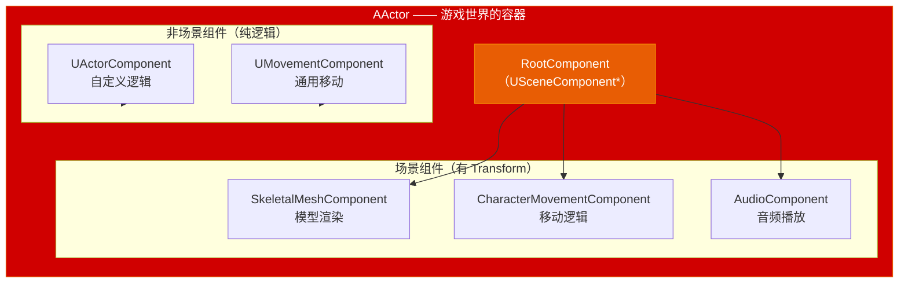
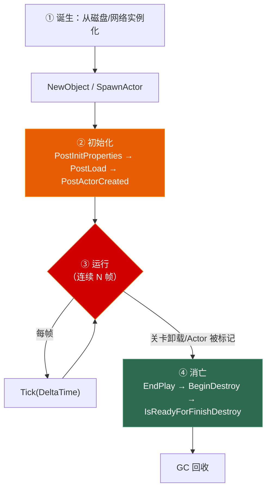
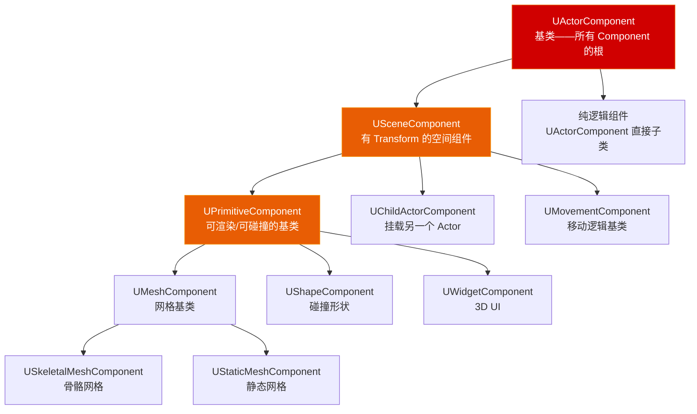

# 第八章 Actor 与 Component 模型：游戏世界的骨架

> **一句话理解**：Actor 不是"游戏对象"——它是一个**可挂载 Component 的容器**。UE 的设计哲学是"用组合替代继承"：你几乎永远不应该写一个"大而全的 Actor 子类"，而应该创建一个个小 Component，把它们装进一个 Actor。理解这条原则，你就理解了整个 UE 游戏架构的骨架。

---

## 8.1 概念直觉 —— AActor 到底是什么？

### 8.1.1 一句话讲清 Actor 与 Component 的关系

```cpp
// Actor 本身几乎没有功能。它只是一个"锚点"——提供了：
// - 一个世界中的位置（Transform）
// - 一个生命周期（BeginPlay/Tick/EndPlay）
// - 一个组件容器（把自己拆成零件）

// Component 才是真正做事的东西：
// - USkeletalMeshComponent 渲染角色模型
// - UCharacterMovementComponent 控制移动逻辑
// - UAudioComponent 播放声音
// - UWidgetComponent 显示 UI

// 这就是为什么 Epic 把 UE 定位为一个 "Component-Based 引擎" 而不是
// "深层继承式引擎"（如早期的 Torque、Gamebryo）。
```



### 8.1.2 AActor vs UObject —— 什么时候用什么？

```cpp
// ===== UObject —— 不需要"存在在世界上"的东西 =====
// 数据对象、配置、资产、子系统——它们不需要 Transform
UCLASS()
class UWeaponData : public UDataAsset  // ← 数据，不在世界中有位置
{
    UPROPERTY(EditDefaultsOnly)
    float Damage;
};

UCLASS()
class UMyGameInstanceSubsystem : public UGameInstanceSubsystem  // ← 逻辑管理，没有位置
{
    // 纯逻辑，管理全局状态
};

// ===== AActor —— 需要"在关卡中有个位置"的东西 =====
// 玩家、敌人、道具、门、触发器——它们在 3D 世界中有坐标
UCLASS()
class AMyCharacter : public ACharacter  // ← 在世界中有位置，有 Transform
{
    // 可以被放置到关卡中
};

// 判断是否应该继承 AActor 的唯一标准：
// "这个东西需要在世界中有个 Transform 吗？"
// 是 → AActor（或 ACharacter、APawn 等子类）
// 否 → UObject
```

---

## 8.2 Actor 生命周期 —— 从诞生到消亡的四个阶段

### 8.2.1 生命周期全景图



### 8.2.2 阶段一：诞生 —— SpawnActor vs NewObject

```cpp
// ===== SpawnActor：在游戏世界中创建一个 Actor =====
// 这是创建 Actor 的唯一正确方式——它不仅仅 new 了一个对象，
// 还完成了注册到世界、分配 NetGUID、初始化 Component 等一系列工作

UCLASS()
class AMyProjectile : public AActor
{
    GENERATED_BODY()

public:
    AMyProjectile()
    {
        // ⚠️ 构造函数中只做三件事：
        // 1. 创建 DefaultSubobject
        // 2. 设置成员默认值
        // 3. 设置 Component 的 Attachment

        MeshComponent = CreateDefaultSubobject<UStaticMeshComponent>(TEXT("Mesh"));
        RootComponent = MeshComponent;  // 设置 RootComponent

        InitialLifeSpan = 5.0f;  // 5 秒后自动销毁
    }
    UPROPERTY(VisibleAnywhere)
    UStaticMeshComponent* MeshComponent;
};

// ===== 在游戏代码中生成 Actor =====
void AMyGameMode::SpawnProjectile(FVector Location, FRotator Rotation)
{
    UWorld* World = GetWorld();

    // FActorSpawnParameters 控制生成行为
    FActorSpawnParameters SpawnParams;
    SpawnParams.Owner = this;                          // 所属者
    SpawnParams.Instigator = GetInstigator();           // 发起者（伤害来源）
    SpawnParams.SpawnCollisionHandlingOverride =
        ESpawnActorCollisionHandlingMethod::AdjustIfPossibleButAlwaysSpawn;
    // ↑ 常用选项：
    //   AlwaysSpawn — 无论如何都生成（穿透碰撞）
    //   AdjustIfPossibleButAlwaysSpawn — 尝试找空位，找不到也生成
    //   AdjustIfPossibleButDontSpawnIfColliding — 找不到空位就不生成
    //   DontSpawnIfColliding — 与任何物体碰撞就不生成

    AMyProjectile* Projectile = World->SpawnActor<AMyProjectile>(
        AMyProjectile::StaticClass(),  // 类型
        Location,                       // 位置
        Rotation,                       // 旋转
        SpawnParams                     // 参数
    );

    if (Projectile)
    {
        // 生成成功！Actor 已完成 PostActorCreated 和 BeginPlay
    }
}

// ===== SpawnActorDeferred：延迟生成 —— 在 BeginPlay 之前塞入初始化参数 =====
// 大厂高频考点：普通 SpawnActor 返回时 BeginPlay 已经执行完毕，
// 如果你需要在 Actor 诞生前修改属性（如子弹伤害加成），怎么办？
// → 用 SpawnActorDeferred 创造一个"空档期"

AMyProjectile* Bullet = World->SpawnActorDeferred<AMyProjectile>(
    AMyProjectile::StaticClass(),
    Transform,
    Owner,
    Instigator
);
// ↑ 此时构造函数和 PostActorCreated 已执行完毕，
//   但 BeginPlay 和 Construction Script 尚未触发——这是一个完美的初始化空档！

if (Bullet)
{
    // 在这个空档期内安全地修改属性：
    Bullet->DamageMultiplier = 2.5f;
    Bullet->TeamId = 1;

    // 手动完成最终生成——只有现在才触发 Construction Script 和 BeginPlay
    Bullet->FinishSpawning(Transform);
}

// ===== NewObject：创建不需要在世界上存在的 UObject =====
// NewObject 不涉及关卡、不分配 Transform、不注册 Component
UWeaponData* DataAsset = NewObject<UWeaponData>();
// 只用于 UObject，不能用于 Actor！
```

### 8.2.3 阶段二：初始化 —— 关键生命周期函数的调用顺序

```cpp
// Actor 从 SpawnActor 到 BeginPlay 的完整调用链：

// 1. AActor::AActor()                          — 构造函数，创建 DefaultSubobject
// 2. PostInitProperties()                      — 所有 UPROPERTY 初始化后
// 3. PostLoad()                                — 从磁盘序列化恢复数据后（仅加载时）
// 4. PostActorCreated()                        — Actor 已在世界中注册完成
//     ↑ 这里可以访问 World、GameMode、其他 Actor
//     ↑ Component 已经注册到世界
//     ↑ 蓝图 Construction Script 在这之后执行
// 5. PreInitializeComponents()                — Component 初始化前
// 6. InitializeComponents()                   — 所有 Component 初始化
// 7. PostInitializeComponents()               — Component 初始化完成
// 8. BeginPlay()                              — 游戏开始！（最重要的函数）
//     ↑ 这是你写游戏逻辑的"起点"

// ===== 典型用法 =====
UCLASS()
class AMyActor : public AActor
{
    GENERATED_BODY()

public:
    AMyActor()
    {
        // ✓ 只做：创建 Component、设置默认值
        Mesh = CreateDefaultSubobject<UStaticMeshComponent>(TEXT("Mesh"));
        RootComponent = Mesh;
        Health = 100;
    }

    virtual void PostActorCreated() override
    {
        Super::PostActorCreated();
        // ✓ 此时 World 已可用，可以访问其他 Actor
        // ✓ 常用于：SpawnActor 生成后立即做特殊初始化
        UE_LOG(LogTemp, Log, TEXT("Actor 已在世界中创建完毕"));
    }

    virtual void PostInitializeComponents() override
    {
        Super::PostInitializeComponents();
        // ✓ Component 全部初始化完毕，可以设置 Component 初始状态
        // ⚠️ 此时其他 Actor 的 BeginPlay 可能还没调用
    }

    virtual void BeginPlay() override
    {
        Super::BeginPlay();
        // ✓✓✓ 游戏逻辑的起点！
        // ✓ 所有 Component 的就绪
        // ✓ 网络复制已经开始
        // ✓ 可以安全地调用蓝图重写函数
        // ✓ 可以访问 GameMode、PlayerController 等
        SetupWeaponSystem();
    }

private:
    UPROPERTY()
    UStaticMeshComponent* Mesh;

    UPROPERTY()
    int32 Health;
};
```

### 8.2.4 Construction Script（蓝图构造脚本）vs C++ 构造函数

```cpp
// 蓝图有一个"构造脚本"——在编辑器中每当你移动 Actor 或修改属性时都会执行
// C++ 没有构造脚本，但有 OnConstruction 函数：

virtual void OnConstruction(const FTransform& Transform) override
{
    Super::OnConstruction(Transform);

    // 等价于蓝图的 Construction Script
    // 在编辑器中修改属性、拖动 Actor 时都会触发
    // ⚠️ 编辑器中也会执行！不要在这里写只在游戏运行时的逻辑
    // ✓ 适合：根据属性动态构建视觉效果（如根据长度拉伸网格）

    if (PillarMesh)
    {
        // 根据 Height 属性拉伸柱子
        PillarMesh->SetWorldScale3D(FVector(1.0f, 1.0f, PillarHeight / 100.0f));
    }
}

// 区分记忆法：
// 构造函数 — 编辑器打开时执行一次（设置 CDO）
// OnConstruction — 编辑器中每次修改属性都执行（动态预览）
// BeginPlay — 仅游戏运行时执行（游戏逻辑）
```

### 8.2.5 阶段三：运行 —— Tick 与性能考量

```cpp
UCLASS()
class AMyActor : public AActor
{
    GENERATED_BODY()

public:
    AMyActor()
    {
        // ✓ 默认关闭 Tick —— 除非你真的需要它
        PrimaryActorTick.bCanEverTick = false;  // ← 默认应该是 false！
    }

    // 当你确实需要 Tick 时：
    virtual void Tick(float DeltaTime) override
    {
        Super::Tick(DeltaTime);

        // ⚠️ Tick 中只做必须每帧更新的工作
        // ✗ 不要在 Tick 中 FindActor / GetAllActorsOfClass
        // ✗ 不要在 Tick 中动态构造 UObject
        // ✓ 缓存在 BeginPlay 中获取的引用
        // ✓ 用 Timer 替代低频 Tick

        // 如果你只需要每 N 秒更新一次，用 Timer：
        // GetWorldTimerManager().SetTimer(...)
    }
};

// ===== Tick 组 —— 控制 Actor Tick 的执行顺序 =====
// PrimaryActorTick.TickGroup 决定了何时执行 Tick：
// TG_PrePhysics      — 物理模拟前（适合设置输入、准备物理状态）
// TG_DuringPhysics   — 物理模拟中（适合物理响应逻辑）
// TG_PostPhysics     — 物理模拟后（适合基于物理结果的逻辑）
// TG_PostUpdateWork  — 所有物理和动画更新完成后

// ===== Tick 间隔 —— 不一定要每帧 Tick =====
PrimaryActorTick.TickInterval = 0.5f;  // 每 0.5 秒 Tick 一次
// 适合：低频状态检查（如 AI 感知刷新、区域检测）
```

### 8.2.6 阶段四：消亡 —— Actor 的销毁

```cpp
// ===== 条件销毁 =====
void AMyActor::TakeDamage(float Damage)
{
    Health -= Damage;
    if (Health <= 0)
    {
        Destroy();  // 标记为待销毁，不会立即删除
    }
}

// Destroy() 在当前帧、当前调用栈内同步执行完所有清理逻辑后才返回
// 实际的销毁流程（全同步，无延迟）：
// 1. Destroy() 被调用
// 2. 立即同步执行：Component 注销 → EndPlay() 回调 → 所有监听者收到通知
// 3. 标记 Garbage 标记位（EInternalObjectFlags::Garbage），
//    加入待 GC 回收队列（UE5 中 RF_PendingKill 已被彻底从源码中删除）
// 4. Destroy() 返回——此时 EndPlay 已经执行完毕！
// 5. 后续某一帧 GC 触发清扫 → 彻底释放堆内存

// ===== EndPlay —— Actor 的"遗言" =====
virtual void EndPlay(const EEndPlayReason::Type EndPlayReason) override
{
    Super::EndPlay(EndPlayReason);

    switch (EndPlayReason)
    {
    case EEndPlayReason::Destroyed:
        // 手动调用 Destroy()
        CleanupOwnedResources();
        break;
    case EEndPlayReason::LevelTransition:
        // 关卡切换——Actor 可能在下一关还有用
        break;
    case EEndPlayReason::EndPlayInEditor:
        // 在编辑器中停止 PIE
        break;
    case EEndPlayReason::RemovedFromWorld:
        // 从关卡中被移除（Streaming 卸载）
        break;
    }
}

// ===== 定时自毁 =====
// 在构造函数中设置：
InitialLifeSpan = 10.0f;  // 10 秒后自动 Destroy()

// 或在运行时：
SetLifeSpan(5.0f);

// ⚠️ Destroy() 后不要使用 Actor 指针！
AActor* Actor = GetOwner();
Actor->Destroy();  // EndPlay 已同步执行完毕，Garbage 标记已设置
// 此时堆内存仍在（GC 尚未 Sweep），但 Actor 已从世界注销、组件已卸载、
// IsActorBeingDestroyed() 返回 true，IsValid() 返回 false
// Actor->GetActorLocation();  // ⚠️ 仍能读到残留数据，但逻辑上已非法
// 真正的崩溃延迟到 GC Sweep 彻底释放堆内存之后
```

---

## 8.3 Component 体系 —— 三大家族

### 8.3.1 Component 类型速查



```cpp
// ===== 三个核心层次 =====

// ① UActorComponent —— 最基础，无 Transform
UCLASS()
class UHealthComponent : public UActorComponent
{
    GENERATED_BODY()
    // 纯逻辑：管理血量、伤害、死亡
    // 没有世界位置——它只是一个挂在 Actor 上的逻辑模块
};

// ② USceneComponent —— 有 Transform，但不渲染
class UCameraComponent : public USceneComponent
{
    // 有位置（Transform），但没有视觉
    // SceneComponent 用于需要位置但不渲染的东西
};

// ③ UPrimitiveComponent —— 有 Transform，且可渲染/可碰撞
class UStaticMeshComponent : public UPrimitiveComponent
{
    // 有位置、有网格、有碰撞——完整的"游戏物体"
};
```

### 8.3.2 UActorComponent vs USceneComponent —— 什么时候选谁？

| | UActorComponent | USceneComponent |
|---|---|---|
| 有 Transform | ❌ 没有 | ✅ 有（相对位置/旋转/缩放） |
| 可以渲染 | ❌ | 子类可以（UPrimitiveComponent） |
| 典型用途 | 逻辑模块（血条、背包、技能） | 空间组件（摄像机、音频、骨架） |
| 攻击系统 | `UCombatComponent` —— 纯逻辑 | `USphereComponent` —— 攻击判定范围 |
| 能否子组件 | ❌ | ✅ 可以挂子级组件 |

```cpp
// ===== 决策树 =====
// 问自己："这个 Component 需要在世界中有一个位置吗？"
// 不需要 → UActorComponent
// 需要，但不渲染 → USceneComponent
// 需要，且渲染 → UPrimitiveComponent 子类
// 需要，且是另一个 Actor → UChildActorComponent
```

### 8.3.3 RootComponent —— Actor 的"主心骨"

```cpp
UCLASS()
class AMyActor : public AActor
{
    GENERATED_BODY()

public:
    AMyActor()
    {
        // 每个 Actor 必须有一个 RootComponent
        // RootComponent 决定了 Actor 的整体位置、旋转、缩放

        // 方式一：用一个 Mesh 作为 Root
        Mesh = CreateDefaultSubobject<UStaticMeshComponent>(TEXT("Mesh"));
        RootComponent = Mesh;  // Mesh 就是 Root

        // 方式二：用一个空的 SceneComponent 作为根节点
        // （当你有多个并列的子组件时更推荐）
        SceneRoot = CreateDefaultSubobject<USceneComponent>(TEXT("SceneRoot"));
        RootComponent = SceneRoot;

        // 然后把其他组件挂在 Root 下面
        Camera = CreateDefaultSubobject<UCameraComponent>(TEXT("Camera"));
        Camera->SetupAttachment(RootComponent);  // ← 挂到 Root 上
    }

    UPROPERTY(VisibleAnywhere)
    UStaticMeshComponent* Mesh;

    UPROPERTY(VisibleAnywhere)
    USceneComponent* SceneRoot;

    UPROPERTY(VisibleAnywhere)
    UCameraComponent* Camera;
};

// ⚠️ 常见疏忽：忘记设置 RootComponent
// Actor 允许不拥有 RootComponent——它仍能被正常 Spawn 并 Tick，
// 但此时 GetActorLocation() 永远返回 FVector::ZeroVector，
// 且无法挂载任何 USceneComponent 子组件（没有根节点供附着）。
// 这个 Actor 在 3D 世界中"隐形"了——失去了空间和物理属性。
```

### 8.3.4 组件附着与层级 —— SetupAttachment 的一切

```cpp
// ===== 基本附着 =====
void UMyActor::SetupComponents()
{
    // 创建层级：Root → Body → Head → Helmet
    USceneComponent* Root = CreateDefaultSubobject<USceneComponent>(TEXT("Root"));
    RootComponent = Root;

    UStaticMeshComponent* Body = CreateDefaultSubobject<UStaticMeshComponent>(TEXT("Body"));
    Body->SetupAttachment(Root);           // Body 相对 Root

    UStaticMeshComponent* Head = CreateDefaultSubobject<UStaticMeshComponent>(TEXT("Head"));
    Head->SetupAttachment(Body, TEXT("HeadSocket"));  // Head 挂到 Body 的 Socket 上

    UStaticMeshComponent* Helmet = CreateDefaultSubobject<UStaticMeshComponent>(TEXT("Helmet"));
    Helmet->SetupAttachment(Head);         // Helmet 挂到 Head
    // ↑ 移动 Root → Body、Head、Helmet 全部跟随
    // ↑ 移动 Head  → Helmet 跟随，Body 不动
}

// ===== Attachment 变换规则 =====
// 有三个关键的 Transform：
FTransform WorldTransform = Component->GetComponentTransform();     // 世界空间
FTransform RelativeTransform = Component->GetRelativeTransform();   // 相对父级
FTransform SocketTransform = Component->GetSocketTransform(NAME_None); // Socket

// ===== 运行时动态附着（现代 UE5 推荐写法）=====
void AttachWeaponToHand(USceneComponent* Weapon, USkeletalMeshComponent* Character)
{
    // ✓ 现代 UE5 C++ 规范：通过目标组件的 GetMesh() 等访问器获取精确附着点，
    //    使用标准 C++ 接口 AttachToComponent（K2_ 前缀仅供蓝图 VM 使用，C++ 中禁用）

    // 方式一：附加到 Socket
    Weapon->AttachToComponent(
        Character->GetMesh(),  // ← 明确指定目标组件，而不是整个 Actor
        FAttachmentTransformRules::SnapToTargetNotIncludingScale,
        TEXT("WeaponSocket")
    );

    // 方式二：保持当前相对位置
    Weapon->AttachToComponent(
        Character->GetMesh(),
        FAttachmentTransformRules::KeepRelativeTransform,
        NAME_None  // 不绑定 Socket，直接附着到组件原点
    );

    // 方式三：保持世界位置不变
    Weapon->AttachToComponent(
        Character->GetMesh(),
        FAttachmentTransformRules::KeepWorldTransform,
        NAME_None
    );

    // ⚠️ 务必确保父组件已注册——未注册的组件上调用附着会静默失败！
    //    check(Character->GetMesh()->IsRegistered());
}

// ===== FAttachmentTransformRules 选项 =====
// SnapToTargetNotIncludingScale — 贴到目标位置/旋转，保留自身 Scale
// SnapToTargetIncludingScale     — 贴到目标位置/旋转，使用目标 Scale
// KeepRelativeTransform          — 保持当前的相对 Transform
// KeepWorldTransform             — 保持当前的世界位置
// KeepRelativeOffset             — 保持世界位置不变但计算新的相对偏移
```

### 8.3.5 UChildActorComponent —— 把一个 Actor 嵌入另一个 Actor

```cpp
// UChildActorComponent 允许你在一个 Actor 内部生成并管理另一个 Actor
// 典型场景：
// - 武器 Actor 嵌入角色 Actor
// - 粒子特效 Actor 嵌入触发器 Actor
// - 门 Actor 中嵌入一个交互提示 Actor

UCLASS()
class AWeaponActor : public AActor
{
    GENERATED_BODY()
public:
    void Fire() { /* ... */ }
};

UCLASS()
class AMyCharacter : public ACharacter
{
    GENERATED_BODY()

public:
    AMyCharacter()
    {
        WeaponChild = CreateDefaultSubobject<UChildActorComponent>(TEXT("WeaponChild"));
        WeaponChild->SetupAttachment(GetMesh(), TEXT("WeaponSocket"));

        // 在蓝图中设置 ChildActorClass，或者在 C++ 中：
        // WeaponChild->SetChildActorClass(AWeaponActor::StaticClass());
    }

    UPROPERTY(VisibleAnywhere)
    UChildActorComponent* WeaponChild;

    void FireWeapon()
    {
        if (AActor* WeaponActor = WeaponChild->GetChildActor())
        {
            Cast<AWeaponActor>(WeaponActor)->Fire();
        }
    }
};

// ⚠️ UChildActorComponent 的性能注意事项：
// - 每个 ChildActorComponent 会在内部 Spawn 一个完整的 Actor
// - 内部 Actor 有自己的 Tick、自己的 Component 层级
// - 大量使用会导致性能下降
// - 如果不需移动/独立逻辑，考虑直接用 USceneComponent + 静态网格代替
```

---

## 8.4 Component 的注册与运行时创建

### 8.4.1 CreateDefaultSubobject vs NewObject —— 什么时候用哪个？

```cpp
// ===== CreateDefaultSubobject —— 构造函数中创建 =====
// 只在构造函数中使用！它创建的 Component 会随 Actor 一起序列化
// 和复制，属于 Actor 的"永久零件"。

AMyActor::AMyActor()
{
    // ✓ 构造函数中用 CreateDefaultSubobject
    Mesh = CreateDefaultSubobject<UStaticMeshComponent>(TEXT("Mesh"));
    // ↑ 这个 Component 会参与序列化、网络复制、蓝图可见
}

// ===== NewObject —— 运行时动态创建 =====
// 在 BeginPlay 或之后使用。创建的 Component 需要手动注册，
// 不会被序列化保存。

void AMyActor::SpawnDynamicComponent()
{
    if (!GetWorld()) return;

    UStaticMeshComponent* DynamicMesh = NewObject<UStaticMeshComponent>(
        this,                        // Outer —— 防止 GC 回收！
        TEXT("DynamicMesh")          // Name（FName 参数）
    );

    // ⚠️ 必须手动注册！否则 Component 不会工作
    // ⚠️ RegisterComponent() 只能在 GameThread（主线程）调用！
    //    其底层会将网格数据、光源数据注册进渲染器场景（FScene::AddPrimitive），
    //    如果在异步回调或 ParallelFor 中误触动态注册，
    //    会导致 RHI 线程与渲染线程死锁崩溃
    //
    // ★ 关键顺序：先 Attach（确定相对变换），后 Register（带着正确的变换注册进世界）
    //    如果先 Register 再 Attach → 组件先以世界原点(0,0,0)注册进渲染/物理场景，
    //    随后的 Attach 迫使渲染和物理代理销毁并重新注册 → 性能浪费 + 潜在闪烁
    DynamicMesh->AttachToComponent(
        RootComponent,
        FAttachmentTransformRules::KeepRelativeTransform
    );
    DynamicMesh->RegisterComponent();  // ← 此时带着正确的相对变换一步到位注册

    // ✓ 现在 DynamicMesh 可以正常渲染和 Tick
}

// ===== 移除动态创建的 Component =====
void AMyActor::RemoveDynamicComponent(UActorComponent* Comp)
{
    if (Comp)
    {
        Comp->DestroyComponent();  // 从世界中注销 + 标记待 GC
        // 或
        Comp->UnregisterComponent();  // 仅注销，不销毁
    }
}
```

### 8.4.2 ⚠️ Component 注册的常见陷阱

```cpp
// 陷阱 1：忘记 RegisterComponent
USceneComponent* Comp = NewObject<USceneComponent>(this);
Comp->AttachToComponent(RootComponent, FAttachmentTransformRules::KeepRelativeTransform);
// ✗ Component 没有注册！不会渲染，不会 Tick，GetWorld() 返回 nullptr
// ✓ 必须调用 Comp->RegisterComponent();

// 陷阱 2：在 Component 注册前访问世界
USceneComponent* Comp = NewObject<USceneComponent>(this);
UWorld* World = Comp->GetWorld();  // ✗ nullptr！还没注册
Comp->RegisterComponent();
World = Comp->GetWorld();          // ✓ 现在有了

// 陷阱 3：CreateDefaultSubobject 的名称冲突
AMyActor::AMyActor()
{
    auto* Mesh1 = CreateDefaultSubobject<UStaticMeshComponent>(TEXT("Mesh"));
    auto* Mesh2 = CreateDefaultSubobject<UStaticMeshComponent>(TEXT("Mesh"));
    // ✗ 两个 Component 同名！引擎会修正，但可能导致引用混乱
}

    // 陷阱 4：销毁的 Component 仍被引用 —— GC Sweep 后变野指针
void SomeFunction()
{
    UStaticMeshComponent* Comp = GetComponentByClass<UStaticMeshComponent>();
    Comp->DestroyComponent();
    // DestroyComponent 内部会立刻触发 UnregisterComponent() 并解除附着，
    // 将组件从渲染、物理、Tick 系统中彻底卸载，不再可见/不再有物理响应。
    // 但堆上的 C++ 内存此刻仍然是 100% 完整的——绝非"底层内存结构已残废"！
    //
    // Comp->GetComponentLocation();  // ✓ 当前仍可安全读取（内存在 GC Sweep 前完好）
    // Comp->GetWorld();              // 返回 nullptr——已从世界注销
    //
    // 真正危险的时刻：GC 触发的下一次清扫（Sweep）彻底释放堆内存后，
    // Comp 才变成真正的野指针 → 此时任何解引用都 Access Violation 闪退
    //
    // ✓ DestroyComponent() 后立即置 nullptr，防止 GC 清扫后误用：
    Comp = nullptr;
}
```

---

## 8.5 ECS 思想在 UE 中的体现

### 8.5.1 UE 的 Component 模型 ≠ 纯 ECS，但思想同源

```cpp
// 纯 ECS（如 Unity DOTS、EnTT）：
// Entity 只是一个 ID 数字，Component 是纯数据 struct，System 遍历所有 Entity
// 
// UE 的 Actor-Component 模型（一种"混合 ECS"）：
// - Actor ≈ Entity（有 ID、有 Transform）
// - Component ≈ Component（数据和逻辑的混合体，不是纯数据）
// - System 被分散到了多个地方（World、GameMode、Subsystem、Tick）

// ===== 对比表 =====
//              | 纯 ECS             | UE Actor-Component
// ------------ | ------------------ | -------------------------
// Entity       | 只是一个整数 ID     | AActor——是一个类，有生命周期
// Component    | 纯数据 struct       | UActorComponent——封装数据 + 逻辑
// System       | 独立的查询+处理逻辑  | Tick / GameMode / Subsystem
// 数据分布     | 按 Component 类型连续 | 按 Actor 分散存储
// 内存友好度   | ★★★★★（缓存行友好）  | ★★★☆☆（对象分散在堆上）
// 继承支持     | ❌ 无（通过组合）     | ✅ 支持（但 Epic 不鼓励深层继承）
// C++ 复杂度  | ★★★☆☆               | ★★☆☆☆（更接近传统 OOP）
// 蓝图友好     | ❌                    | ★★★★★（可视化、拖拽式编程）
```

### 8.5.2 UE 中的"ECS 思维" —— 用 Component 组合替代继承

```cpp
// ===== ✗ 传统继承思维 —— 容易导致恐怖的深层继承链 =====
class AEntity : public AActor {};
class APawn : public AEntity {};
class AFighter : public APawn {};
class AArcher : public AFighter {};
class AFireArcher : public AArcher {};
class AIceArcher : public AArcher {};
// 需求变了："我要一个会射箭的战士，但他不会魔法"
// → 继承链爆炸！无法灵活组合

// ===== ✓ UE Component 思维 —— 用 Component 描述能力 =====
UCLASS()
class AModularCharacter : public ACharacter
{
    GENERATED_BODY()
public:
    // 能力 = Component 的组合
    UPROPERTY(VisibleAnywhere)
    UHealthComponent* Health;

    UPROPERTY(VisibleAnywhere)
    UInventoryComponent* Inventory;

    UPROPERTY(VisibleAnywhere)
    UCombatComponent* Combat;  // 可以挂载武器

    // 如果你想让他会魔法？加一个 MagicComponent
    // 如果你想让他会飞行？加一个 FlightComponent
    // 如果你想让他会游泳？加一个 SwimComponent
    // 不需要继承！不需要改类！直接在编辑器中添加/移除 Component！

    // 运行时检查能力：
    bool CanFly() const { return FindComponentByClass<UFlightComponent>() != nullptr; }
    bool CanCastMagic() const { return FindComponentByClass<UMagicComponent>() != nullptr; }
};
```

### 8.5.3 UE5 Mass Entity —— 真正的 ECS（大世界海量实体）

```cpp
// UE5 引入了 Mass Entity 系统——这才是"纯 ECS"
// 用于处理成千上万个同质实体（城市人群、鸟群、车辆交通）

// 但 Mass Entity 和传统的 Actor-Component 是两个不同的系统：
// - Actor-Component：用于玩家、Boss、交互物——几十到几百个
// - Mass Entity：用于背景 NPC、鸟群、车流——几千到几万个
// 两者在同一个世界中并存，各司其职

// 面试中关于这个话题的标准回答：
// "UE 不是纯 ECS——Actor-Component 是面向对象 + 组合模式的混合体。
//  但对于海量实体场景，UE5 的 Mass Entity 提供了纯 ECS 实现。
//  日常开发中，用 Component 组合思想组织代码，避免深层继承。
//  如果面试官问的是 DOTS/ECS 对比，说明你理解两者的本质区别。"
```

---

## 8.6 实战：构建一个模块化角色系统

```cpp
// ===== 场景：构建一个 RPG 角色系统，支持任意能力组合 =====
// 目标：同一个 ACharacter 子类可以组合成"战士"、"法师"、"盗贼"或"战法"

// ---------- Component 1：健康系统 ----------
UCLASS(ClassGroup=(Custom), meta=(BlueprintSpawnableComponent))
class UHealthComponent : public UActorComponent
{
    GENERATED_BODY()

public:
    UHealthComponent()
    {
        PrimaryComponentTick.bCanEverTick = false;  // 不需要 Tick
    }

    UPROPERTY(EditAnywhere, BlueprintReadOnly, Category = "Health")
    float MaxHealth = 100.0f;

    UPROPERTY(EditAnywhere, BlueprintReadOnly, Category = "Health")
    float CurrentHealth = 100.0f;

    // 委托声明 —— 前置声明，便于 UHT 展开和蓝图绑定
    DECLARE_DYNAMIC_MULTICAST_DELEGATE_TwoParams(FOnHealthChanged, float, Current, float, Max);
    UPROPERTY(BlueprintAssignable, Category = "Health")
    FOnHealthChanged OnHealthChanged;

    DECLARE_DYNAMIC_MULTICAST_DELEGATE(FOnDeath);
    UPROPERTY(BlueprintAssignable, Category = "Health")
    FOnDeath OnDeath;

    UFUNCTION(BlueprintCallable, Category = "Health")
    void TakeDamage(float Damage)
    {
        CurrentHealth = FMath::Max(0.0f, CurrentHealth - Damage);
        OnHealthChanged.Broadcast(CurrentHealth, MaxHealth);

        if (CurrentHealth <= 0.0f)
        {
            OnDeath.Broadcast();
        }
    }

    UFUNCTION(BlueprintCallable, Category = "Health")
    void Heal(float Amount)
    {
        CurrentHealth = FMath::Min(MaxHealth, CurrentHealth + Amount);
        OnHealthChanged.Broadcast(CurrentHealth, MaxHealth);
    }
};

// ---------- Component 2：战斗系统 ----------
UCLASS(ClassGroup=(Custom), meta=(BlueprintSpawnableComponent))
class UCombatComponent : public UActorComponent
{
    GENERATED_BODY()

public:
    UPROPERTY(EditAnywhere, BlueprintReadWrite, Category = "Combat")
    float CurrentWeaponDamage = 10.0f;

    // 委托声明 —— 前置声明，便于 UHT 展开和蓝图绑定
    DECLARE_DYNAMIC_MULTICAST_DELEGATE_TwoParams(FOnAttackPerformed, AActor*, Target, float, Damage);
    UPROPERTY(BlueprintAssignable, Category = "Combat")
    FOnAttackPerformed OnAttackPerformed;

    UFUNCTION(BlueprintCallable, Category = "Combat")
    void Attack(AActor* Target)
    {
        if (!Target) return;

        // 通过 Component 查询目标是否有健康组件
        if (UHealthComponent* TargetHealth = Target->FindComponentByClass<UHealthComponent>())
        {
            TargetHealth->TakeDamage(CurrentWeaponDamage);
            OnAttackPerformed.Broadcast(Target, CurrentWeaponDamage);
        }
    }
};

// ---------- Component 3：魔法系统 ----------
UCLASS(ClassGroup=(Custom), meta=(BlueprintSpawnableComponent))
class UMagicComponent : public UActorComponent
{
    GENERATED_BODY()

public:
    UPROPERTY(EditAnywhere, BlueprintReadWrite, Category = "Magic")
    float CurrentMana = 50.0f;

    UPROPERTY(EditAnywhere, BlueprintReadWrite, Category = "Magic")
    float MaxMana = 50.0f;

    UPROPERTY(EditAnywhere, BlueprintReadWrite, Category = "Magic")
    float SpellDamage = 25.0f;

    UPROPERTY(EditAnywhere, BlueprintReadWrite, Category = "Magic")
    float ManaCost = 10.0f;

    // 委托声明 —— 前置声明，便于 UHT 展开和蓝图绑定
    DECLARE_DYNAMIC_MULTICAST_DELEGATE_OneParam(FOnSpellCast, FName, SpellName);
    UPROPERTY(BlueprintAssignable, Category = "Magic")
    FOnSpellCast OnSpellCast;

    DECLARE_DYNAMIC_MULTICAST_DELEGATE_OneParam(FOnManaInsufficient, FName, SpellName);
    UPROPERTY(BlueprintAssignable, Category = "Magic")
    FOnManaInsufficient OnManaInsufficient;

    UFUNCTION(BlueprintCallable, Category = "Magic")
    void CastSpell(FName SpellName, AActor* Target)
    {
        if (CurrentMana < ManaCost)
        {
            OnManaInsufficient.Broadcast(SpellName);
            return;
        }

        CurrentMana -= ManaCost;

        if (UHealthComponent* TargetHealth = Target->FindComponentByClass<UHealthComponent>())
        {
            TargetHealth->TakeDamage(SpellDamage);
        }

        OnSpellCast.Broadcast(SpellName);
    }
};

// ---------- 角色基类：组装 Component ----------
UCLASS()
class ARPGCharacter : public ACharacter
{
    GENERATED_BODY()

public:
    ARPGCharacter()
    {
        // 所有角色都有健康系统
        HealthComponent = CreateDefaultSubobject<UHealthComponent>(TEXT("Health"));
    }

    // 初始化和绑定
    virtual void BeginPlay() override
    {
        Super::BeginPlay();

        // 绑定死亡事件
        if (HealthComponent)
        {
            HealthComponent->OnDeath.AddDynamic(this, &ARPGCharacter::HandleDeath);
        }
    }

    // 按能力查询——这就是 Component 思维的核心优势
    bool CanAttack() const { return FindComponentByClass<UCombatComponent>() != nullptr; }
    bool CanCastMagic() const { return FindComponentByClass<UMagicComponent>() != nullptr; }

    UFUNCTION(BlueprintCallable)
    void PerformAttack(AActor* Target)
    {
        if (UCombatComponent* Combat = FindComponentByClass<UCombatComponent>())
        {
            Combat->Attack(Target);
        }
    }

    UFUNCTION(BlueprintCallable)
    void CastSpell(FName SpellName, AActor* Target)
    {
        if (UMagicComponent* Magic = FindComponentByClass<UMagicComponent>())
        {
            Magic->CastSpell(SpellName, Target);
        }
    }

protected:
    UPROPERTY(VisibleAnywhere, BlueprintReadOnly)
    UHealthComponent* HealthComponent;

    UFUNCTION()
    void HandleDeath()
    {
        // 播放死亡动画、禁用输入、延迟销毁...
        GetMesh()->SetSimulatePhysics(true);
        GetController()->DisableInput(nullptr);
        SetLifeSpan(5.0f);
    }
};

// ===== 使用方式：在编辑器中3秒创建新职业！=====
// 战士：ARPGCharacter + HealthComponent + CombatComponent
// 法师：ARPGCharacter + HealthComponent + MagicComponent
// 战斗法师：ARPGCharacter + HealthComponent + CombatComponent + MagicComponent
// 盗贼：ARPGCharacter + HealthComponent + CombatComponent（加个隐身Buff）
// 
// 你不需要写一行新代码，不需要创建任何新类！
// 这就是 Actor-Component 模型的威力。
```

---

## 8.7 常见陷阱与调试

### 8.7.1 Actor 与 Component 的性能关键指标

```
调试命令速查（运行时在控制台输入）：

stat game         — 游戏线程各系统耗时（Tick/Physics/Animation）
stat scenerendering — 场景渲染耗时（Draw Call、三角形数）
stat memory       — 内存分布（特别是 Actor/Component 数量）
stat levels       — 关卡中 Actor 数量

常见性能警告：
- Actor 数量 > 1000 → 考虑 LOD、Streaming、对象池
- Component 数量 > 5000 → 考虑合并 Component、使用 Mass Entity
- Tick 开销 > 3ms → 关闭不需要的 Tick，用 Timer 替代
- 每个 Actor  100+ Component → 架构设计有问题
```

### 8.7.2 TOP 5 常见崩溃与排查

```cpp
// 崩溃 #1：访问已销毁的 Actor
AActor* Actor = GetOwner();
Actor->Destroy();
Actor->GetActorLocation();  // ⚠️ 不可靠：内存在 GC Sweep 后才真正释放
// ✓ 解决方案：始终在访问前检查 IsValid()
if (IsValid(Actor))
{
    Actor->GetActorLocation();
}

// 崩溃 #2：没有 RootComponent 的 Actor —— 不会崩溃，但会残废
AMyActor::AMyActor()
{
    // 忘记了 RootComponent = xxx;
    // → Actor 仍能被正常 Spawn 并在世界中 Tick，但：
    //   · GetActorLocation() 永远返回 FVector::ZeroVector
    //   · 无法挂载任何 USceneComponent 子组件（没有根节点供附着）
    //   · 失去了空间和物理属性——在 3D 世界中"隐形"
}
// ✓ 检查：每个需要空间存在的 Actor 必须有一个 RootComponent

// 崩溃 #3：在 Component 注册前使用
USceneComponent* Comp = NewObject<USceneComponent>(this);
Comp->AttachToComponent(RootComponent, ...);
Comp->GetComponentLocation();  // ✗ 没注册，Transform 未初始化！
// ✓ 先 RegisterComponent()

// 崩溃 #4：后台线程访问 Component（回顾第7章的 GameThread 铁律）
AsyncTask(ENamedThreads::AnyBackgroundThreadNormalTask, [this]() {
    MeshComponent->SetMaterial(0, NewMaterial);  // ✗ 后台线程！
});

// 崩溃 #5：重复注册同名 Component
void BadFunction()
{
    auto* C1 = NewObject<UStaticMeshComponent>(this, TEXT("SameName"));
    auto* C2 = NewObject<UStaticMeshComponent>(this, TEXT("SameName"));
    C1->RegisterComponent();
    C2->RegisterComponent();  // ← 可能因名称冲突导致不可预测的行为
}
```

---

## 8.8 30 秒速答

> **面试被问："Actor 和 Component 的关系是什么？为什么 UE 用 Component 而不是深层继承？"**

Actor 是一个可挂载 Component 的容器——它只提供世界中的位置、生命周期和组件管理。Component 才是真正做事的：渲染用 MeshComponent，移动用 MovementComponent，逻辑用自定义 ActorComponent。UE 选择基于 Component 的组合模式而非深层继承，因为组合可以在编辑器中自由搭配各种能力而不需要写新类——同一个 Character 子类加上不同的 Component 就能变成战士、法师或盗贼。

> **面试追问："什么时候用 UActorComponent，什么时候用 USceneComponent？"**

UActorComponent 用于纯逻辑（如 HealthComponent、InventoryComponent）——它没有 Transform。USceneComponent 用于需要在空间中有位置的组件（如 CameraComponent、AudioComponent）——它有 Transform，可以挂子组件。简单判断：这个组件需要在世界中有坐标吗？不需要 → UActorComponent，需要但不渲染 → USceneComponent，需要且渲染 → UPrimitiveComponent 子类。

> **面试追问："一个 Actor 销毁后你怎么安全地判断它是否还有效？"**

在 UE5 中用 `IsValid(Actor)` ——它会检查指针是否为空、对象是否正在被销毁（IsBeingDestroyed）、以及是否已被 GC 标记回收。不要只用 `!= nullptr`，因为 Destroy() 后指针可能不是 nullptr 但对象已经不可用。

---

> 📚 **第二部开始。** 这是引擎核心框架的第一章。Actor-Component 模型是理解后续所有章节（GameFramework、输入、网络复制、GAS）的基础。接下来进入 Ch9：Game Framework 与 Subsystem 体系——理解 GameMode/GameState/PlayerController 的职责划分。

> 💡 **前置依赖提醒**：
> - Actor 生命周期中的 GC 回收细节 → 见 [Ch3：UObject 与 GC](../03_uobject_gc/)
> - Component 间的事件绑定 → 见 [Ch6：委托与事件系统](../06_delegates/)
> - 不要在后台线程操作 Component → 见 [Ch7：多线程与异步](../07_concurrency/)
