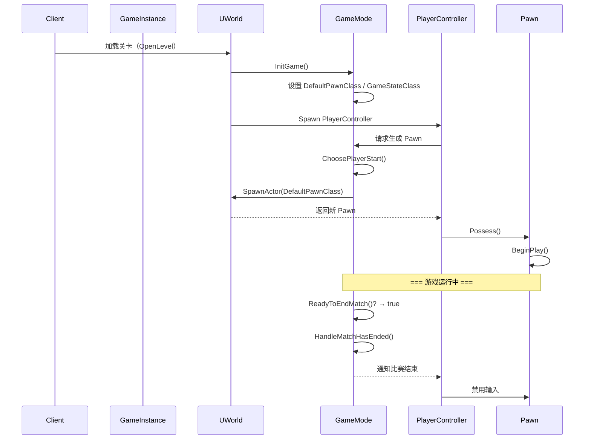
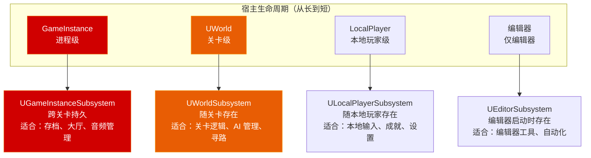

# 第九章 Game Framework 与 Subsystem 体系：掌控游戏世界的运转

> **一句话理解**：UE 的游戏框架是一套**职责分明的七件套**（GameInstance → GameMode → GameState → PlayerController → Pawn → PlayerState → HUD），每个类只做一件事。但 UE5 之后，你的游戏逻辑不应该全塞进 GameMode——**Subsystem 是从 GameMode 中"解耦出来的逻辑切片"**，它不依赖关卡、不依赖 Actor，只跟随其 Owner 的生命周期。理解这两层，你就真正理解了"UE 游戏怎么跑起来的"。

---

## 9.1 概念直觉 —— 一个请求从"进入游戏"到"角色生成"走了哪些类？

### 9.1.1 全景：七件套职责地图

```mermaid
flowchart TD
    GI["GameInstance\n👑 进程级单例\n跨关卡持久存在"]

    subgraph 关卡内 ["关卡生命周期（一个 World）"]
        GM["GameMode\n📜 服务器端规则\n谁赢？怎么生？"]
        GS["GameState\n📊 服务器→客户端广播\n比分、计时、天气"]
        PC["PlayerController\n🎮 玩家"大脑"\n输入→处理→UI"]
        subgraph 玩家端 ["每个玩家拥有"]
            PS["PlayerState\n📋 玩家数据\n名字、击杀数、延迟"]
            Pawn["Pawn / Character\n🏃 玩家在世界的'身体'\n移动、动画、碰撞"]
            HUD["HUD / UMG\n🖥️ 屏幕显示\n血条、准星、小地图"]
        end
    end

    GI --> GM
    GM --> GS
    GM --> PC
    PC --> Pawn
    PC --> HUD
    PC --> PS
    GS --> PS

    style GI fill:#d00000,stroke:#e85d04,color:white
    style GM fill:#d00000,stroke:#e85d04,color:white
    style PC fill:#e85d04,stroke:#f48c06,color:white
    style GS fill:#e85d04,stroke:#f48c06,color:white
```

### 9.1.2 一张表记住"谁在谁上面"

```cpp
// ===== Game Framework 七件套 · 存在范围速查 =====
//
// GameInstance           ← 进程启动→退出（最持久，跨关卡唯一）
//   └─ UWorld           ← 关卡加载→卸载
//        ├─ GameMode    ← 服务器端，关卡存在期间（切换关卡会销毁重建）
//        ├─ GameState   ← 服务器+客户端都复制，关卡存在期间
//        │                  ⚠️ 切换关卡时随 World 销毁！不能跨关卡保留！
//        ├─ PlayerController ← 玩家加入→退出
//        │    │              Seamless Travel 时保留，普通 Travel 销毁
//        │    ├─ Pawn   ← 玩家 Possess→UnPossess（可换，切换关卡销毁）
//        │    ├─ PlayerState ← 玩家加入→退出
//        │    │              Seamless Travel 时保留，普通 Travel 销毁
//        │    └─ HUD    ← 玩家拥有时（蓝图中常见）
//        └─ LevelScriptActor ← 关卡存在期间（每个关卡一个）

// ===== 网络角色速查（后续 Ch12 会详细展开）=====
// GameMode    — 只存在于服务器！客户端没有！
// GameState   — 服务器有权威，自动复制到所有客户端
// PlayerController — 每个连接的玩家各有一个，只在"自己的客户端"有权威
// Pawn        — 服务器有权威，客户端有"模拟代理"
// PlayerState — 服务器有权威，自动复制到所有客户端
```

---

## 9.2 Game Framework 七件套 —— 逐一拆解

### 9.2.1 GameInstance —— 跨关卡的"进程级管家"

```cpp
// GameInstance 从游戏启动到退出一直存在，不随关卡切换而销毁。
// 这是你存放"整个游戏会话"级别数据的地方。

UCLASS()
class UMyGameInstance : public UGameInstance
{
    GENERATED_BODY()

public:
    // ✓ 适合放在 GameInstance 的数据：
    // - 全局配置（难度、画质、音量）
    // - 玩家登录信息
    // - 跨关卡背包/存档数据
    // - 多人大厅连接信息

    UPROPERTY(BlueprintReadOnly)
    FString PlayerNickname;

    UPROPERTY(BlueprintReadOnly)
    TMap<FName, int32> GlobalInventory;  // 跨关卡的背包！

    // ✗ 不适合：
    // - 关卡相关的状态（放 GameState）
    // - 具体角色的属性（放 PlayerState 或 Pawn 身上）

    virtual void Init() override
    {
        Super::Init();
        // GameInstance 的初始化——此时还没有 World，不能访问关卡
    }

    virtual void Shutdown() override
    {
        // 游戏退出时清理
        Super::Shutdown();
    }
};

// ⚠️ GameInstance 不参与网络复制！所有客户端各自有一套 GameInstance
// 如果你是 DS（Dedicated Server），GameInstance 只在服务器进程存在
// 客户端的数据通过 GameState / PlayerState 的 UPROPERTY(Replicated) 同步
```

### 9.2.2 GameMode —— 服务器端的"游戏规则书"

```cpp
// GameMode 只存在于服务器！客户端根本不知道 GameMode 的存在。
// 它定义了游戏的规则：怎么开局、怎么算赢、怎么生成玩家。

UCLASS()
class AMyGameMode : public AGameModeBase
{
    GENERATED_BODY()

public:
    AMyGameMode()
    {
        // 设置默认的 Pawn 类型——当玩家加入时自动生成
        DefaultPawnClass = AMyCharacter::StaticClass();

        // 设置 PlayerController 类型
        PlayerControllerClass = AMyPlayerController::StaticClass();

        // 设置 GameState 类型
        GameStateClass = AMyGameState::StaticClass();

        // 设置 PlayerState 类型
        PlayerStateClass = AMyPlayerState::StaticClass();

        // 设置 HUD 类型
        HUDClass = AMyHUD::StaticClass();
    }

    // ===== GameMode 的核心虚函数——你重写它们来定义游戏规则 =====

    // 玩家加入时——决定 Spawn 位置
    virtual AActor* ChoosePlayerStart_Implementation(AController* Player) override
    {
        // 从所有 PlayerStart Actor 中选一个
        // 默认按"最不拥挤"原则分配
        return Super::ChoosePlayerStart_Implementation(Player);
    }

    // 玩家死后——决定何时重生、在哪重生
    virtual void RestartPlayer(AController* NewPlayer) override
    {
        Super::RestartPlayer(NewPlayer);
        // 默认行为：在 ChoosePlayerStart 返回的位置 Spawn DefaultPawnClass
    }

    // 比赛是否应该结束？
    virtual bool ReadyToEndMatch_Implementation() override
    {
        // 你的胜负条件在这里判断
        return false;
    }

    // 比赛结束时调用
    virtual void HandleMatchHasEnded() override
    {
        Super::HandleMatchHasEnded();
        // 显示结算界面、冻结操作……
    }

    // 玩家登录时——可以在此拒绝连接
    virtual void PreLogin(const FString& Options, const FString& Address,
                          const FUniqueNetIdRepl& UniqueId, FString& ErrorMessage) override
    {
        Super::PreLogin(Options, Address, UniqueId, ErrorMessage);
        // 如果设了 ErrorMessage = "房间已满"，此玩家会被拒绝
    }

    // ⚠️ 不要在 GameMode 中放 UI 逻辑！
    // GameMode 只在服务器——客户端看不到它
    // UI 逻辑放 PlayerController 或 HUD
};

// ===== AGameMode vs AGameModeBase =====
// AGameModeBase — 最简模式（单人/合作游戏）
// AGameMode     — 完整模式（继承 GameModeBase，加了匹配状态机：
//                 等待玩家→准备→比赛中→赛后→结算）
```

### 9.2.3 GameState —— 所有人都在看的"记分板"

```cpp
// GameState 存在于服务器，并自动复制到所有客户端。
// 它是 Game Framework 中唯一"服务器权威、所有人可见"的状态容器。

UCLASS()
class AMyGameState : public AGameStateBase
{
    GENERATED_BODY()

public:
    // ★ 关键：用 Replicated 让属性自动同步到所有客户端
    UPROPERTY(Replicated, BlueprintReadOnly, Category = "Game")
    int32 TeamAScore;

    UPROPERTY(Replicated, BlueprintReadOnly, Category = "Game")
    int32 TeamBScore;

    UPROPERTY(Replicated, BlueprintReadOnly, Category = "Game")
    float RemainingTime;

    UPROPERTY(Replicated, BlueprintReadOnly, Category = "Game")
    FName CurrentWeather;  // ← 例子：天气系统状态

    // ===== 网络复制规则（GetLifetimeReplicatedProps）=====
    virtual void GetLifetimeReplicatedProps(TArray<FLifetimeProperty>& OutLifetimeProps) const override
    {
        Super::GetLifetimeReplicatedProps(OutLifetimeProps);

        // 对所有客户端复制（默认）
        DOREPLIFETIME(AMyGameState, TeamAScore);
        DOREPLIFETIME(AMyGameState, TeamBScore);

        // 条件复制示例：RemainingTime 跳过主控端（本地有预测），只同步给模拟端
        DOREPLIFETIME_CONDITION(AMyGameState, RemainingTime, COND_SkipOwner);

        // 如果确实需要"除 Owner 外所有人"的条件复制，使用：
        // DOREPLIFETIME_CONDITION(AMyGameState, RemainingTime, COND_SkipOwner);
        // ↑ COND_SkipOwner = 对除 Owner 外的所有客户端复制
    }

    // ✓ 适合放 GameState：
    // - 比分、计时、比赛阶段（所有人需要知道）
    // - 天气、全局事件
    // - 所有在线玩家列表（PlayerArray 已经内建）
    //   → GameState->PlayerArray 存放了所有 PlayerState 引用

    UFUNCTION(BlueprintCallable, Category = "Game")
    void AddScore(int32 TeamId, int32 Points)
    {
        // 这段代码只在服务器执行（GameMode 中调用）
        if (TeamId == 0) TeamAScore += Points;
        else TeamBScore += Points;
        // ★ 修改会自动复制到所有客户端！
    }
};

// ===== GameState 的 PlayerArray =====
// GameState 内部维护了 PlayerArray（TArray<APlayerState*>），
// 每个连接的玩家都有一个对应的 PlayerState
void AMyPlayerController::GetAllPlayerNames()
{
    if (AGameStateBase* GS = GetWorld()->GetGameState())
    {
        for (APlayerState* PS : GS->PlayerArray)
        {
            UE_LOG(LogTemp, Log, TEXT("玩家：%s，击杀：%d"), *PS->GetPlayerName(), PS->GetScore());
        }
    }
}
```

### 9.2.4 PlayerController —— 玩家的"大脑"

```cpp
// PlayerController 是玩家和游戏世界之间的"桥梁"
// 它接收输入 → 控制 Pawn → 管理 UI → 处理网络 RPC

UCLASS()
class AMyPlayerController : public APlayerController
{
    GENERATED_BODY()

public:
    virtual void BeginPlay() override
    {
        Super::BeginPlay();

        // 设置输入模式——决定输入流向
        // 方式一：纯 UI（菜单、登录界面）
        // SetInputMode(FInputModeUIOnly());

        // 方式二：纯游戏（没有 UI 交互）
        // SetInputMode(FInputModeGameOnly());

        // 方式三：混合模式（游戏+UI，最常用）
        FInputModeGameAndUI InputMode;
        InputMode.SetLockMouseToViewportBehavior(EMouseLockMode::LockAlways);
        InputMode.SetHideCursorDuringCapture(true);
        SetInputMode(InputMode);

        // 显示鼠标光标
        bShowMouseCursor = false;  // FPS 游戏通常关闭
    }

    // ===== Possess / UnPossess —— 控制 Pawn =====
    virtual void OnPossess(APawn* InPawn) override
    {
        Super::OnPossess(InPawn);
        // 此时"附身"了一个 Pawn——可以开始控制它
        UE_LOG(LogTemp, Log, TEXT("现在控制：%s"), *InPawn->GetName());
    }

    virtual void OnUnPossess() override
    {
        Super::OnUnPossess();
        // Pawn 被夺走（死亡、换角色……）
    }

    // ===== Server RPC —— 从客户端调用，在服务器执行 =====
    UFUNCTION(Server, Reliable)
    void ServerRequestRespawn();

    void ServerRequestRespawn_Implementation()
    {
        // 这段代码在服务器上执行！
        // 客户端请求重生 → 服务器处理
        if (AGameModeBase* GM = GetWorld()->GetAuthGameMode())
        {
            GM->RestartPlayer(this);
        }
    }

    // ===== Client RPC —— 从服务器调用，在"拥有此控制器的客户端"上执行 =====
    UFUNCTION(Client, Reliable)
    void ClientShowGameOverMessage(const FString& Message);

    void ClientShowGameOverMessage_Implementation(const FString& Message)
    {
        // 这段代码只在这个玩家的客户端上执行！
        // 用于显示个人消息（你死了/你赢了/你获得了成就……）
        if (GEngine)
        {
            GEngine->AddOnScreenDebugMessage(-1, 5.0f, FColor::Red, Message);
        }
    }

    // ✓ PlayerController 适合做的事：
    // - 输入处理（绑定 InputAction）
    // - 控制 Pawn 移动/视角
    // - 管理 UI（创建 Widget、切换界面）
    // - RPC 通信（Server/Client 函数）
    // - 摄像机管理

    // ✗ PlayerController 不适合做的事：
    // - 游戏规则判断（放 GameMode）
    // - 持久化状态（放 PlayerState 或 GameState）
    // - 全局逻辑（放 Subsystem）
};

// ⚠️ 核心区分：PlayerController vs PlayerState
//
// PlayerController — 玩家的"输入输出装置"
//   · 属于"拥有者客户端"——每个客户端有自己的独立版本
//   · 换关卡时可能销毁重建
//   · 放：输入、UI、摄像机、RPC
//
// PlayerState — 玩家的"档案数据"
//   · 从服务器复制到所有客户端（所有人能看到你的击杀数）
//   · Seamless Travel 时保留，普通 Travel 时销毁
//   · 放：名字、分数、击杀数、Ping、队伍 ID
```

### 9.2.5 Pawn / Character —— 玩家在世界的"身体"

```cpp
// APawn — 最基础的"可控实体"
// ACharacter — APawn + 胶囊碰撞体 + 骨骼网格 + 移动组件（最常用）

UCLASS()
class AMyCharacter : public ACharacter
{
    GENERATED_BODY()

public:
    AMyCharacter()
    {
        // ACharacter 默认创建了：
        // - UCapsuleComponent（碰撞）
        // - USkeletalMeshComponent（模型）
        // - UCharacterMovementComponent（移动）
        // 你只需要加自己的 Component

        HealthComponent = CreateDefaultSubobject<UHealthComponent>(TEXT("Health"));
        InventoryComponent = CreateDefaultSubobject<UInventoryComponent>(TEXT("Inventory"));
    }

    virtual void BeginPlay() override
    {
        Super::BeginPlay();

        // 检查是否由玩家控制
        if (IsPlayerControlled())
        {
            // 初始化玩家专属逻辑
        }
        else
        {
            // AI 控制的角色——初始化行为树
            if (AAIController* AI = Cast<AAIController>(GetController()))
            {
                // 启动 AI 行为树
            }
        }
    }

    // ===== 获取控制者 =====
    APlayerController* GetMyPlayerController() const
    {
        return Cast<APlayerController>(GetController());
    }

    // ===== 获取 PlayerState =====
    AMyPlayerState* GetMyPlayerState() const
    {
        return GetPlayerState<AMyPlayerState>();
    }

protected:
    UPROPERTY(VisibleAnywhere)
    UHealthComponent* HealthComponent;

    UPROPERTY(VisibleAnywhere)
    UInventoryComponent* InventoryComponent;
};

// ===== Pawn vs Character —— 什么时候用 Pawn？=====
// 用 APawn（而不是 ACharacter）的场景：
// - 无人机、飞行摄像机——不需要胶囊体和行走动画
// - VR 手部表示——不需要角色移动逻辑
// - 载具内部视角——载具本身是 Pawn
// - 弹幕射击中的子弹观察者
//
// 核心判断：
// "这个实体需要双足行走、骨骼动画、胶囊碰撞、行走移动？"
//  → 是：ACharacter
//  → 否：APawn（更轻量）
```

### 9.2.6 PlayerState —— 玩家的"档案袋"

```cpp
// PlayerState 是玩家的"永久数据"——随玩家连接存在，换关卡不丢。
// 从服务器复制到所有客户端（所有人都能看到别人的 PlayerState）。

UCLASS()
class AMyPlayerState : public APlayerState
{
    GENERATED_BODY()

public:
    // ★ 这些属性自动复制到所有客户端
    UPROPERTY(Replicated, BlueprintReadOnly)
    int32 KillCount;

    UPROPERTY(Replicated, BlueprintReadOnly)
    int32 DeathCount;

    UPROPERTY(Replicated, BlueprintReadOnly)
    int32 TeamId;

    UPROPERTY(Replicated, BlueprintReadOnly)
    bool bIsReady;  // 大厅中是否准备就绪

    virtual void GetLifetimeReplicatedProps(TArray<FLifetimeProperty>& OutLifetimeProps) const override
    {
        Super::GetLifetimeReplicatedProps(OutLifetimeProps);
        DOREPLIFETIME(AMyPlayerState, KillCount);
        DOREPLIFETIME(AMyPlayerState, DeathCount);
        DOREPLIFETIME(AMyPlayerState, TeamId);
        DOREPLIFETIME(AMyPlayerState, bIsReady);
    }

    UFUNCTION()
    void AddKill()
    {
        KillCount++;
        // 服务器修改后自动同步到所有客户端
    }

    // ===== PlayerState 内部的便利方法 =====
    // GetPlayerName()  — 玩家名字（内建复制）
    // GetScore()       — 内建的分数系统
    // GetUniqueId()    — 玩家网络唯一 ID
    // GetPing()        — 玩家延迟（毫秒）

    // ✓ 适合放 PlayerState：
    // - 名字、分数、击杀/死亡（所有人需要知道）
    // - 队伍 ID、角色职业选择
    // - 玩家延迟
    // - 大厅准备状态
    //
    // ✗ 不适合：
    // - UI 状态（放 PlayerController）
    // - 角色具体属性如 HP（放 Pawn 或 Component）
    // - 输入绑定（放 PlayerController）
};

// ⚠️ PlayerState 与 Pawn 的区别——面试最常见考点：
//
// PlayerState — 跟着"玩家连接"存在于 PlayerController 上
//   · 换关卡、换 Pawn（重生）都不销毁
//   · 自动复制到所有客户端
//   · 放：名字、击杀数、队伍
//
// Pawn — 跟着"游戏世界中的身体"存在
//   · 重生 = 销毁旧 Pawn + Spawn 新 Pawn（PlayerState 中的击杀数保留）
//   · 只有自己有权威
//   · 放：HP、当前位置、动画状态
```

### 9.2.7 HUD —— 屏幕上的"画布"

```cpp
// HUD 是最古老的 UI 方案——直接用 Canvas 绘制。
// 现代 UE5 项目中，大多数团队用 UMG Widget 替代 HUD，
// 但 HUD 仍然在轻量级 Debug 绘制和快速原型中常见。

UCLASS()
class AMyHUD : public AHUD
{
    GENERATED_BODY()

public:
    virtual void DrawHUD() override
    {
        Super::DrawHUD();

        // 每帧调用——用 Canvas 直接画
        // 绘制准星
        float CenterX = Canvas->ClipX * 0.5f;
        float CenterY = Canvas->ClipY * 0.5f;

        DrawLine(CenterX - 10, CenterY, CenterX + 10, CenterY, FLinearColor::Green, 2.0f);
        DrawLine(CenterX, CenterY - 10, CenterX, CenterY + 10, FLinearColor::Green, 2.0f);

        // 绘制 Debug 文字
        DrawText(TEXT("Press F1 for Debug Menu"), FVector2D(10, 10),
                 nullptr, 1.0f, FLinearColor::Yellow);
    }
};

// ===== 现代 UE5 推荐：用 UMG 替代 HUD =====
// HUD 适合：Debug 绘制、极简 UI
// UMG 适合：正式的游戏 UI、菜单、HUD
// 在 PlayerController 中创建 UMG Widget：
//
// void AMyPlayerController::BeginPlay()
// {
//     if (IsLocalPlayerController())  // 只在本地客户端创建
//     {
//         if (UMyMainWidget* Widget = CreateWidget<UMyMainWidget>(this, MainWidgetClass))
//         {
//             Widget->AddToViewport();
//         }
//     }
// }
```

---

## 9.3 游戏流程控制 —— 从"登录"到"比赛结束"的完整时序

### 9.3.1 单人/合作游戏流程



### 9.3.1.1 多人网络下的玩家登录三部曲（大厂面试高频）

```cpp
// ===== Dedicated Server 处理新玩家连接的严格时序 =====
// 面试中经常被要求口述这个流程：

// 第一部：PreLogin —— 预登录校验（在此可拒绝连接）
void AMyGameMode::PreLogin(const FString& Options, const FString& Address,
                           const FUniqueNetIdRepl& UniqueId, FString& ErrorMessage)
{
    Super::PreLogin(Options, Address, UniqueId, ErrorMessage);

    // 从 Options 字符串中解析登录参数
    // 例：Open 127.0.0.1?Password=1234?TeamId=1
    // Options = "?Password=1234?TeamId=1"

    if (!ValidatePassword(UGameplayStatics::ParseOption(Options, TEXT("Password"))))
    {
        ErrorMessage = TEXT("密码错误");  // 玩家被拒绝连接
    }
    // 此时还没有 PlayerController —— 只有网络连接
}

// 第二部：Login —— 正式创建 PlayerController
// PlayerController* AMyGameMode::Login(
//     UPlayer* NewPlayer, ENetRole InRemoteRole,
//     const FString& Portal, const FString& Options,
//     const FUniqueNetIdRepl& UniqueId, FString& ErrorMessage)
// {
//     // 引擎内部调用 SpawnPlayerController，创建专属 PC
//     return Super::Login(NewPlayer, InRemoteRole, Portal, Options, UniqueId, ErrorMessage);
// }

// 第三部：PostLogin —— PC 已创建，开始同步和 Spawn Pawn
void AMyGameMode::PostLogin(APlayerController* NewPlayer)
{
    Super::PostLogin(NewPlayer);
    // ✓ 此时 PlayerController 已完全创建，可以安全地进行 RPC 通知
    // ✓ 默认会在此处调用 RestartPlayer(NewPlayer) 生成 Pawn
    // ✓ 这是你"欢迎新玩家、同步初始状态"的标准入口

    // 例：广播新玩家加入
    if (AMyGameState* GS = GetGameState<AMyGameState>())
    {
        // 通过 GameState 通知所有客户端"有新人加入"
    }
}

// 时序口诀：PreLogin（校验→拒绝/通过）→ Login（创建PC）→ PostLogin（开始RPC+生成Pawn）
```

### 9.3.2 Seamless Travel（无缝切换关卡）

```cpp
// ===== Seamless Travel vs 普通 OpenLevel =====
//
// 普通 OpenLevel：
//   1. 卸载当前关卡 → 所有 Actor 销毁 → PlayerController/PlayerState 也销毁
//   2. 加载新关卡 → 重新创建一切
//   3. 玩家看到加载画面
//
// Seamless Travel：
//   1. 当前关卡保留
//   2. 新关卡在"后台"加载
//   3. 加载完成后，保留 PlayerController 和 PlayerState，
//      只销毁"关卡相关的 Actor"
//   4. 在新关卡中重新 Spawn Pawn
//   5. 玩家几乎感知不到切换

// ===== 启用 Seamless Travel =====
// 在 GameMode 构造函数中：
AMyGameMode::AMyGameMode()
{
    bUseSeamlessTravel = true;
}

// ===== 切换到新关卡 =====
void AMyGameMode::TransitionToNextLevel()
{
    // 普通方式——玩家看到加载画面
    // GetWorld()->ServerTravel("/Game/Maps/NextLevel");

    // Seamless——前提是 GameMode 中 bUseSeamlessTravel = true
    GetWorld()->SeamlessTravel("/Game/Maps/NextLevel");
}

// ===== Seamless Travel 中 Actor 的"去留规则" =====
// 场景 Actors —— 全部销毁
// GameMode —— 销毁（新关卡使用新的 GameMode，在 WorldSettings 中配置）
// GameState —— 销毁！⚠️ GameState 绑定在 UWorld 上，切换 World 时必然销毁
//             → 如需跨关卡传递全局状态，必须通过：
//               ① GameMode::GetSeamlessTravelActorList() 显式注册保留的 Actor
//               ② GameInstance（进程级单例，天然跨关卡）
// PlayerController —— 保留（引擎自动处理）
// PlayerState —— 保留（引擎自动处理）
// GameInstance —— 保留（本来就不随关卡销毁）

// ===== Actor 如何处理 Seamless Travel =====
UCLASS()
class AMyActor : public AActor
{
    // 如果你的 Actor 需要在 Seamless Travel 中保留：
    virtual void GetLifetimeReplicatedProps(TArray<FLifetimeProperty>& OutLifetimeProps) const override
    {
        Super::GetLifetimeReplicatedProps(OutLifetimeProps);
        // bNetLoadOnClient = true 的 Actor 可以跨关卡传递
    }
};

// ⚠️ Seamless Travel 只对"服务器发起的"切换有效
// 客户端调用 ClientTravel 是非无缝的
```

---

## 9.4 Subsystem 体系 —— UE5 的"全局逻辑切片"

> **为什么需要 Subsystem？** 在 UE4 时代，所有游戏逻辑都堆在 GameMode 里。一个中大型项目，GameMode 动辄几千行，极难维护。UE5 引入了 Subsystem——它不依赖 Actor、不依赖关卡、自动跟随宿主生命周期，让你把全局逻辑切成小块。

### 9.4.1 四种 Subsystem 与它们的"宿主"



### 9.4.2 UGameInstanceSubsystem —— 跨关卡全局逻辑

```cpp
// 最常用的 Subsystem 类型——跟随 GameInstance 存在，进程级单例。

UCLASS()
class UAudioManagerSubsystem : public UGameInstanceSubsystem
{
    GENERATED_BODY()

public:
    // ===== 生命周期 =====
    virtual void Initialize(FSubsystemCollectionBase& Collection) override
    {
        Super::Initialize(Collection);
        // GameInstance 初始化时调用——此时还没有 World
        UE_LOG(LogTemp, Log, TEXT("音频管理器初始化"));
    }

    virtual void Deinitialize() override
    {
        // 游戏退出时调用——在此清理资源
        UE_LOG(LogTemp, Log, TEXT("音频管理器关闭"));
        Super::Deinitialize();
    }

    // 业务逻辑
    UFUNCTION(BlueprintCallable)
    void PlayBGM(USoundBase* Music)
    {
        if (CurrentBGM != Music)
        {
            CurrentBGM = Music;
            // 实际播放逻辑...
        }
    }

    UFUNCTION(BlueprintCallable)
    void SetMasterVolume(float Volume)
    {
        MasterVolume = FMath::Clamp(Volume, 0.0f, 1.0f);
        // 应用到所有音频...
    }

    float GetMasterVolume() const { return MasterVolume; }

private:
    UPROPERTY()
    USoundBase* CurrentBGM;

    float MasterVolume = 1.0f;
};

// ===== 在任何地方获取 Subsystem =====
void AMyActor::AdjustVolume()
{
    // 获取 GameInstance → 获取 Subsystem
    UGameInstance* GI = GetGameInstance();
    if (UAudioManagerSubsystem* AudioMgr = GI->GetSubsystem<UAudioManagerSubsystem>())
    {
        AudioMgr->SetMasterVolume(0.5f);
    }
}
```

### 9.4.3 UWorldSubsystem —— 关卡级逻辑解耦

```cpp
// 随关卡加载/卸载自动创建和销毁——把原来塞在 GameMode 里的逻辑抽出来

UCLASS()
class UEnemySpawnManager : public UTickableWorldSubsystem
{
    GENERATED_BODY()

public:
    virtual void Initialize(FSubsystemCollectionBase& Collection) override
    {
        Super::Initialize(Collection);
        // 关卡加载后调用
    }

    virtual void Deinitialize() override
    {
        // 关卡卸载前调用
        CleanupAllEnemies();
        Super::Deinitialize();
    }

    // ★ 继承 UTickableWorldSubsystem 即可自动获得 Tick（基类 UWorldSubsystem 没有 Tick！）
    virtual void Tick(float DeltaTime) override
    {
        Super::Tick(DeltaTime);
        // 每帧调用——不需要注册到任何地方！
    }

    virtual TStatId GetStatId() const override
    {
        RETURN_QUICK_DECLARE_CYCLE_STAT(UEnemySpawnManager, STATGROUP_Tickables);
    }

    UFUNCTION(BlueprintCallable)
    void SpawnEnemyWave(int32 Count)
    {
        UWorld* World = GetWorld();
        if (!World) return;

        for (int32 i = 0; i < Count; i++)
        {
            FVector SpawnLoc = GetRandomSpawnLocation();
            FActorSpawnParameters Params;
            Params.SpawnCollisionHandlingOverride =
                ESpawnActorCollisionHandlingMethod::AdjustIfPossibleButAlwaysSpawn;

            AEnemyCharacter* Enemy = World->SpawnActor<AEnemyCharacter>(
                EnemyClass, SpawnLoc, FRotator::ZeroRotator, Params);

            if (Enemy)
            {
                ActiveEnemies.Add(Enemy);
            }
        }
    }

    UFUNCTION(BlueprintCallable)
    int32 GetAliveEnemyCount()
    {
        // ★ RemoveAll 搭配 Lambda 清理无效引用，同时统计活着的敌人
        ActiveEnemies.RemoveAll([](const AEnemyCharacter* Enemy)
        {
            return !IsValid(Enemy);
        });
        return ActiveEnemies.Num();
    }
    }

    // ✓ WorldSubsystem 还拥有的能力：
    // - DoesSupportWorldType() —— 限制只在特定 World 类型创建
    //    例如：只在 PIE 游戏中创建，不在编辑器中创建
    virtual bool DoesSupportWorldType(const EWorldType::Type WorldType) const override
    {
        return WorldType == EWorldType::Game || WorldType == EWorldType::PIE;
    }

    // - PostInitialize() —— 所有 Subsystem 都初始化完后调用
    //    此时可以安全地访问"依赖的其他 Subsystem"

private:
    UPROPERTY()
    TArray<AEnemyCharacter*> ActiveEnemies;

    UPROPERTY(EditDefaultsOnly)
    TSubclassOf<AEnemyCharacter> EnemyClass;

    FVector GetRandomSpawnLocation() const
    {
        // 在关卡中随机寻找生成点...
        return FVector::ZeroVector;
    }

    void CleanupAllEnemies()
    {
        for (AEnemyCharacter* Enemy : ActiveEnemies)
        {
            if (IsValid(Enemy))
            {
                Enemy->Destroy();
            }
        }
        ActiveEnemies.Empty();
    }

    // ⚠️ 性能优化：敌人管理池不要求顺序时，可用 RemoveSwap 逐个移除（O(1) 交换删除），
    //    TArray 没有 RemoveAllSwap 批量接口——条件批量删除请用 RemoveAll：

    // ===== ⚠️ WorldSubsystem 与 Level Streaming（流关卡）的关系 =====
    // 面试高频陷阱题：
    // "主关卡（Persistent Level）动态加载子关卡 A 时，WorldSubsystem 会重建吗？"
    //
    // 答案：不会！WorldSubsystem 绑定的是整个 UWorld 实例，而不是某个 ULevel。
    // 只要主关卡（Persistent Level）不销毁，无论加载/卸载多少子流关卡，
    // WorldSubsystem 都只有全局唯一的一个实例，Tick 也完全不受影响。
    //
    // 这是 WorldSubsystem 相对 Level Blueprint / Level Script Actor 的巨大优势——
    // 后者只存在于特定子关卡中，流关卡卸载时随之销毁。
};
```

### 9.4.4 ULocalPlayerSubsystem —— 本地玩家专属逻辑

```cpp
// 每个"本地玩家"拥有一个实例——适合单人/分屏场景

UCLASS()
class UAchievementSubsystem : public ULocalPlayerSubsystem
{
    GENERATED_BODY()

public:
    virtual void Initialize(FSubsystemCollectionBase& Collection) override
    {
        Super::Initialize(Collection);
        LoadAchievements();
    }

    UFUNCTION(BlueprintCallable)
    void UnlockAchievement(FName AchievementId)
    {
        if (!UnlockedAchievements.Contains(AchievementId))
        {
            UnlockedAchievements.Add(AchievementId);
            OnAchievementUnlocked.Broadcast(AchievementId);
            SaveAchievements();
        }
    }

    UFUNCTION(BlueprintPure)
    bool IsAchievementUnlocked(FName AchievementId) const
    {
        return UnlockedAchievements.Contains(AchievementId);
    }

    DECLARE_DYNAMIC_MULTICAST_DELEGATE_OneParam(FOnAchievementUnlocked, FName, AchievementId);
    UPROPERTY(BlueprintAssignable)
    FOnAchievementUnlocked OnAchievementUnlocked;

private:
    TSet<FName> UnlockedAchievements;

    void LoadAchievements() { /* 从存档加载 */ }
    void SaveAchievements() { /* 保存到存档 */ }
};

// ===== 获取 LocalPlayerSubsystem =====
void AMyPlayerController::UnlockSomething()
{
    if (ULocalPlayer* LP = GetLocalPlayer())
    {
        if (UAchievementSubsystem* Achievements = LP->GetSubsystem<UAchievementSubsystem>())
        {
            Achievements->UnlockAchievement(TEXT("FirstBlood"));
        }
    }
}

// ===== ⚠️ 致命陷阱：ULocalPlayerSubsystem 在 Dedicated Server 上不存在！=====
// ULocalPlayerSubsystem 依赖于 ULocalPlayer，而 ULocalPlayer 是本地客户端的
// 概念——它代表"坐在屏幕前拿着手柄的那个玩家"。
//
// Dedicated Server（DS）上没有 ULocalPlayer！服务器上只有网络连接端的
// APlayerController，不存在"本地玩家"的概念。因此：
//
// ✗ ULocalPlayerSubsystem 在 DS 上永远不会被创建
// ✗ 不要把多人对战的伤害奖励、全局游戏逻辑放进 ULocalPlayerSubsystem
// ✓ 多人全局逻辑 → UWorldSubsystem 或 UGameInstanceSubsystem
// ✓ 单人/分屏/本地逻辑 → ULocalPlayerSubsystem（此时安全）
//
// 判断口诀：你的逻辑如果需要在 DS 上运行 → 不能用 LocalPlayerSubsystem
```

### 9.4.5 UEditorSubsystem —— 编辑器工具逻辑

```cpp
// 只在编辑器中存在——PIE 时也会存在（取决于实现）

UCLASS()
class UMyLevelValidatorSubsystem : public UEditorSubsystem
{
    GENERATED_BODY()

public:
    virtual void Initialize(FSubsystemCollectionBase& Collection) override
    {
        Super::Initialize(Collection);
        // 编辑器启动时调用
        UE_LOG(LogTemp, Log, TEXT("关卡验证器已启动"));
    }

    // 检查当前关卡中是否所有 NavMesh 都正确覆盖
    UFUNCTION(BlueprintCallable)
    bool ValidateNavMeshCoverage()
    {
        // 只在编辑器中运行的逻辑
        // 遍历关卡中的 NavMeshBoundsVolume...
        return true;
    }
};
```

### 9.4.6 Subsystem 依赖链与初始化顺序

```cpp
// Subsystem 之间的依赖关系通过 FSubsystemCollectionBase 声明

UCLASS()
class UMyGameSubsystem : public UGameInstanceSubsystem
{
    GENERATED_BODY()

public:
    // ★ 声明依赖：MyGameSubsystem 必须在 OtherSubsystem 之后初始化
    virtual void Initialize(FSubsystemCollectionBase& Collection) override
    {
        // 显式声明依赖——引擎保证 OtherSubsystem 先于本类完成 Initialize()
        Collection.InitializeDependency<UOtherSubsystem>();

        Super::Initialize(Collection);

        // 现在可以安全地获取依赖的 Subsystem
        UOtherSubsystem* Other = GetGameInstance()->GetSubsystem<UOtherSubsystem>();
        // Other 已经完成初始化！
    }
};

// ===== Subsystem 初始化顺序规则 =====
// 1. 先按"声明依赖"排序——被依赖的先初始化
// 2. 同优先级的按"类的自然顺序"
// 3. PostInitialize() 在所有 Subsystem 的 Initialize() 完毕后批量调用
//    → 不需要声明依赖——PostInitialize 中一定可以访问所有同级的 Subsystem

// ===== Subsystem 与 GameMode 的初始化时序 =====
// GameInstance::Init()
//   └→ 所有 UGameInstanceSubsystem::Initialize()
//       └→ 所有 UGameInstanceSubsystem::PostInitialize()
//
// UWorld::BeginPlay()（关卡加载后）
//   └→ 所有 UWorldSubsystem::Initialize()
//       └→ 所有 UWorldSubsystem::PostInitialize()
//           └→ GameMode::InitGame()
//               └→ Actor::BeginPlay()
```

---

## 9.5 Subsystem vs GameMode —— 解耦实战

### 9.5.1 重构前：所有逻辑堆在 GameMode

```cpp
// ===== ✗ 重构前的 GameMode——典型的"上帝类" =====
UCLASS()
class ABadGameMode : public AGameModeBase
{
    GENERATED_BODY()

public:
    // 这个 GameMode 做了太多事：
    // 音频、敌人管理、天气、计分、成就……全都塞在这一个类里！

    void PlayBGM(USoundBase* Music) { /* ... */ }
    void SpawnEnemyWave() { /* ... */ }
    void ChangeWeather(FName Weather) { /* ... */ }
    void AddScore(int32 Team, int32 Points) { /* ... */ }
    void UnlockAchievement(FName Id) { /* ... */ }

    // 几千行代码混杂在一起……
};
```

### 9.5.2 重构后：用 Subsystem 解耦

```cpp
// ===== ✓ 重构后：每个关注点一个 Subsystem =====

// 音频 → UGameInstanceSubsystem（跨关卡）
// 已在 9.4.2 中定义：UAudioManagerSubsystem

// 敌人管理 → UWorldSubsystem（随关卡）
// 已在 9.4.3 中定义：UEnemySpawnManager

// 天气系统 → UWorldSubsystem
UCLASS()
class UWeatherSubsystem : public UTickableWorldSubsystem
{
    GENERATED_BODY()

public:
    virtual void Tick(float DeltaTime) override
    {
        Super::Tick(DeltaTime);
        // 天气渐变逻辑……
    }

    virtual TStatId GetStatId() const override
    {
        RETURN_QUICK_DECLARE_CYCLE_STAT(UWeatherSubsystem, STATGROUP_Tickables);
    }

    UFUNCTION(BlueprintCallable)
    void ChangeWeather(FName NewWeather)
    {
        CurrentWeather = NewWeather;
        OnWeatherChanged.Broadcast(NewWeather);
    }

    UPROPERTY(BlueprintReadOnly)
    FName CurrentWeather;

    DECLARE_DYNAMIC_MULTICAST_DELEGATE_OneParam(FOnWeatherChanged, FName, NewWeather);
    UPROPERTY(BlueprintAssignable)
    FOnWeatherChanged OnWeatherChanged;
};

// 成就系统 → ULocalPlayerSubsystem（每个玩家独立）
// 已在 9.4.4 中定义：UAchievementSubsystem

// ===== 重构后的 GameMode——极度精简 =====
UCLASS()
class AGoodGameMode : public AGameModeBase
{
    GENERATED_BODY()

public:
    AGoodGameMode()
    {
        DefaultPawnClass = AMyCharacter::StaticClass();
        PlayerControllerClass = AMyPlayerController::StaticClass();
        GameStateClass = AMyGameState::StaticClass();
        PlayerStateClass = AMyPlayerState::StaticClass();
    }

    // GameMode 只做"只有 GameMode 才能做"的事：
    // 1. 决定怎么生玩家、生在哪
    // 2. 决定胜负条件
    // 3. 处理玩家登录/离开

    virtual void RestartPlayer(AController* NewPlayer) override
    {
        Super::RestartPlayer(NewPlayer);
        // 重生后通知天气系统（如果需要）
    }

    virtual bool ReadyToEndMatch_Implementation() override
    {
        // 胜负判断
        return false;
    }

    // 这就是全部！其他逻辑全部在 Subsystem 中
};
```

---

## 9.6 实战：一个完整的多人射击游戏框架

```cpp
// ===== 场景：构建一个多人射击游戏的基础框架 =====
// 需求：
// - 玩家加入大厅 → 选择队伍 → 等待开始
// - 比赛开始 → 计分 → 计时结束 → 显示结果
// - 玩家数据跨关卡保留（击杀/死亡）
// - 全局音频管理

// ---------- 1. GameInstance + Subsystem 组合 ----------
UCLASS()
class UShooterGameInstance : public UGameInstance
{
    GENERATED_BODY()

public:
    virtual void Init() override
    {
        Super::Init();
        // Subsystem 会自动初始化，不需要手动创建
    }

    // 跨关卡数据
    UPROPERTY()
    TMap<FString, int32> PlayerLifetimeStats;  // 玩家累积数据
};

// ---------- 2. GameMode ----------
UCLASS()
class AShooterGameMode : public AGameModeBase
{
    GENERATED_BODY()

public:
    AShooterGameMode()
    {
        bUseSeamlessTravel = true;  // 无缝切换关卡

        DefaultPawnClass = AShooterCharacter::StaticClass();
        PlayerControllerClass = AShooterPlayerController::StaticClass();
        GameStateClass = AShooterGameState::StaticClass();
        PlayerStateClass = AShooterPlayerState::StaticClass();
    }

    virtual void HandleSeamlessTravelPlayer(AController*& C) override
    {
        Super::HandleSeamlessTravelPlayer(C);
        // Seamless Travel 时把 PlayerController 传给新关卡
    }

    virtual AActor* ChoosePlayerStart_Implementation(AController* Player) override
    {
        // 按队伍分配出生点
        if (APlayerState* PS = Player->GetPlayerState<APlayerState>())
        {
            // 根据队伍选择对应的 PlayerStart
        }
        return Super::ChoosePlayerStart_Implementation(Player);
    }
};

// ---------- 3. GameState ----------
UCLASS()
class AShooterGameState : public AGameStateBase
{
    GENERATED_BODY()

public:
    UPROPERTY(Replicated, BlueprintReadOnly)
    int32 MatchTimeRemaining = 300;  // 5 分钟

    UPROPERTY(Replicated, BlueprintReadOnly)
    bool bMatchInProgress = false;

    UPROPERTY(Replicated, BlueprintReadOnly)
    EGamePhase CurrentPhase = EGamePhase::WaitingForPlayers;

    virtual void GetLifetimeReplicatedProps(TArray<FLifetimeProperty>& OutLifetimeProps) const override
    {
        Super::GetLifetimeReplicatedProps(OutLifetimeProps);
        DOREPLIFETIME(AShooterGameState, MatchTimeRemaining);
        DOREPLIFETIME(AShooterGameState, bMatchInProgress);
        DOREPLIFETIME(AShooterGameState, CurrentPhase);
    }

    UFUNCTION()
    void OnRep_MatchTimeRemaining()
    {
        // 客户端收到计时更新——更新 UI
        OnMatchTimerUpdated.Broadcast(MatchTimeRemaining);
    }

    DECLARE_DYNAMIC_MULTICAST_DELEGATE_OneParam(FOnMatchTimerUpdated, int32, TimeRemaining);
    UPROPERTY(BlueprintAssignable)
    FOnMatchTimerUpdated OnMatchTimerUpdated;
};

UENUM(BlueprintType)
enum class EGamePhase : uint8
{
    WaitingForPlayers,
    PreMatch,
    InProgress,
    PostMatch,
    EndOfMatch
};

// ---------- 4. PlayerController ----------
UCLASS()
class AShooterPlayerController : public APlayerController
{
    GENERATED_BODY()

public:
    virtual void BeginPlay() override
    {
        Super::BeginPlay();

        if (IsLocalPlayerController())
        {
            // 只在本地玩家的客户端创建 UI
            if (UMainHUDWidget* HUD = CreateWidget<UMainHUDWidget>(this, MainHUDClass))
            {
                HUD->AddToViewport();
            }
        }
    }

    // Server RPC：请求切换队伍
    UFUNCTION(Server, Reliable)
    void ServerSwitchTeam(int32 NewTeamId);

    void ServerSwitchTeam_Implementation(int32 NewTeamId)
    {
        if (AShooterPlayerState* PS = GetPlayerState<AShooterPlayerState>())
        {
            if (AShooterGameState* GS = GetWorld()->GetGameState<AShooterGameState>())
            {
                if (GS->CurrentPhase == EGamePhase::WaitingForPlayers)
                {
                    PS->TeamId = NewTeamId;  // 只在等待阶段允许换队
                }
            }
        }
    }

    // Client RPC：显示击杀提示
    UFUNCTION(Client, Reliable)
    void ClientNotifyKill(const FString& VictimName);

    void ClientNotifyKill_Implementation(const FString& VictimName)
    {
        // 在本地显示"你击杀了 xxx"
        if (GEngine)
        {
            GEngine->AddOnScreenDebugMessage(-1, 3.0f, FColor::Red,
                FString::Printf(TEXT("你击杀了 %s"), *VictimName));
        }
    }

protected:
    UPROPERTY(EditDefaultsOnly)
    TSubclassOf<UMainHUDWidget> MainHUDClass;
};

// ---------- 5. PlayerState ----------
UCLASS()
class AShooterPlayerState : public APlayerState
{
    GENERATED_BODY()

public:
    UPROPERTY(Replicated, BlueprintReadOnly)
    int32 Kills;

    UPROPERTY(Replicated, BlueprintReadOnly)
    int32 Deaths;

    UPROPERTY(Replicated, BlueprintReadOnly)
    int32 TeamId;

    virtual void GetLifetimeReplicatedProps(TArray<FLifetimeProperty>& OutLifetimeProps) const override
    {
        Super::GetLifetimeReplicatedProps(OutLifetimeProps);
        DOREPLIFETIME(AShooterPlayerState, Kills);
        DOREPLIFETIME(AShooterPlayerState, Deaths);
        DOREPLIFETIME(AShooterPlayerState, TeamId);
    }
};

// ---------- 6. Pawn ----------
UCLASS()
class AShooterCharacter : public ACharacter
{
    GENERATED_BODY()

public:
    AShooterCharacter()
    {
        HealthComp = CreateDefaultSubobject<UHealthComponent>(TEXT("Health"));
    }

    virtual void BeginPlay() override
    {
        Super::BeginPlay();

        if (HasAuthority())  // 服务器端
        {
            HealthComp->OnDeath.AddDynamic(this, &AShooterCharacter::OnDeath);
        }
    }

    UFUNCTION()
    void OnDeath()
    {
        // 服务器处理死亡
        if (AShooterPlayerController* PC = Cast<AShooterPlayerController>(GetController()))
        {
            if (AShooterPlayerState* PS = PC->GetPlayerState<AShooterPlayerState>())
            {
                PS->Deaths++;
            }

            // 通知客户端
            PC->ClientNotifyKill(TEXT("你被击杀了"));

            // N 秒后重生
            // ⚠️ 必须用 TWeakObjectPtr 捕获！如果玩家在这 3 秒内断线，
            //    PC 被 GC 回收，裸指针直接 Access Violation 崩溃服务器
            FTimerHandle TimerHandle;
            TWeakObjectPtr<AShooterPlayerController> WeakPC(PC);
            GetWorld()->GetTimerManager().SetTimer(TimerHandle, [WeakPC]() {
                if (AShooterPlayerController* SafePC = WeakPC.Get())
                {
                    if (AGameModeBase* GM = SafePC->GetWorld()->GetAuthGameMode())
                    {
                        GM->RestartPlayer(SafePC);
                    }
                }
            }, 3.0f, false);
        }
    }

private:
    UPROPERTY()
    UHealthComponent* HealthComp;
};

// ===== 完整流程：玩家从登录到对战 =====
//
// 1. 玩家连接 → GameMode::PreLogin() → 通过
// 2. GameMode::Login() → 创建 PlayerController
// 3. PlayerController 初始化 → 自动创建 PlayerState
// 4. GameMode::RestartPlayer() → Spawn Pawn
// 5. PlayerController::Possess(Pawn) → 玩家可以操作
// 6. 比赛进行中 → GameState 广播计时/比分到所有客户端
// 7. 玩家死亡 → Pawn 销毁 → N 秒后 RestartPlayer → 新 Pawn
//     → PlayerState 中的 Kills/Deaths 不丢失！
// 8. 比赛结束 → GameMode::HandleMatchHasEnded()
// 9. Seamless Travel 到下一关 → PlayerState 和 PlayerController 保留
```

---

## 9.7 常见陷阱与面试深度追问

### 9.7.1 Game Framework 常见错误 TOP 5

```cpp
// 陷阱 #1：客户端访问 GameMode
void AMyCharacter::BadFunction()
{
    // ✗ 客户端上没有 GameMode！GetAuthGameMode() 返回 nullptr
    // AGameModeBase* GM = GetWorld()->GetAuthGameMode();
    // if (GM) { ... }  // 客户端上永远为 false

    // ✓ 正确方式：用 GameState 或 PlayerController
    if (HasAuthority())  // 只在服务器执行
    {
        // 可以安全访问 GameMode
    }

    // ✓ 或者：把需要在客户端执行的数据放在 GameState 中
    // GameState 会自动复制到客户端
}

// 陷阱 #2：在 GameMode 中操作 UI
void ABadGameMode::BadFunction()
{
    // ✗ GameMode 只在服务器！不能在服务器上创建 UI
    // CreateWidget<UMyWidget>(...);  // 毫无意义——只存在于服务器内存
}

// 陷阱 #3：混淆 PlayerState 和 Pawn
void OnPlayerRespawn()
{
    // ✓ PlayerState 中的 KillCount 跨重生保留
    // ✓ Pawn 上的 Health 每次重生都是新的
    // ✗ 不要在 Pawn 上放"跨生命"的数据
}

// 陷阱 #4：Seamless Travel 忘记保留关键 Actor
// ✗ 在普通 Actor 的关卡引用会在 Seamless Travel 中失效
// ✓ 把跨关卡数据放 GameInstance 或 PlayerState

// 陷阱 #5：Subsystem 初始化顺序问题
UCLASS()
class UMyBadSubsystem : public UGameInstanceSubsystem
{
    virtual void Initialize(FSubsystemCollectionBase& Collection) override
    {
        // ✗ 此时访问另一个 Subsystem，它可能还没初始化！
        // auto* Other = GetGameInstance()->GetSubsystem<UOtherSubsystem>();

        Super::Initialize(Collection);

        // ✓ 使用 PostInitialize() 访问其他 Subsystem
    }

    virtual void PostInitialize() override
    {
        Super::PostInitialize();
        // ✓ 这里所有同级 Subsystem 一定已初始化完毕
        auto* Other = GetGameInstance()->GetSubsystem<UOtherSubsystem>();
        // 安全！
    }
};
```

### 9.7.2 Subsystem 使用决策树

```
你的逻辑需要跨关卡存在吗？
├── 是 → UGameInstanceSubsystem
│       例：音频管理、大厅系统、全局配置、成就解锁缓存
│
├── 否 → 跟关卡有关？
│        ├── 是 → UWorldSubsystem
│        │       例：敌人管理器、天气系统、寻路缓存、关卡事件调度
│        │
│        └── 否 → 跟特定玩家有关？
│                 ├── 是 → ULocalPlayerSubsystem
│                 │       例：输入配置、成就通知、本地存档
│                 │
│                 └── 否 → 只是工具/辅助逻辑？
│                          用普通 UObject 即可，不需要 Subsystem
│
└── 只在编辑器中使用？
    └── UEditorSubsystem
        例：关卡验证、自动化处理、编辑器菜单
```

### 9.7.3 面试时怎么回答"Subsystem 解决了什么问题？"

```
经典三段式回答：

1. 解耦 GameMode：
   "在 UE4 时代，GameMode 承载了太多职责——音频、AI 管理、天气、
    计分……全都塞在一个类里。UE5 的 Subsystem 让你把每个关注点
    拆成一个独立的类。"

2. 自动生命周期：
   "Subsystem 自动跟随宿主（GameInstance/World/LocalPlayer/Editor）
    的生命周期，不需要手动管理。继承 UTickableWorldSubsystem
    即可获得 Tick 支持——不需要注册到任何 Manager。"

3. 不需要 Actor：
   "Subsystem 是纯 UObject——不需要放在关卡里、不占用 Transform、
    不参与渲染。对于纯逻辑管理来说，比 Actor 轻量得多。"
```

---

## 9.8 30 秒速答

> **面试被问："GameMode 和 GameState 的区别是什么？为什么不能把所有数据都放 GameMode？"**

GameMode 只存在于服务器——客户端根本看不到它。GameState 从服务器自动复制到所有客户端。所以：游戏规则（怎么赢、怎么生）放 GameMode；所有人都需要看到的状态（比分、计时、玩家列表）放 GameState。如果你把比分放在 GameMode 里，客户端根本读不到。

> **面试追问："PlayerState 和 Pawn 的区别？为什么击杀数放 PlayerState 不放 Pawn？"**

Pawn 会死——角色死亡时 Pawn 被销毁，重生时 Spawn 新 Pawn。PlayerState 跟随玩家连接存在，换关卡、换 Pawn 都不销毁。所以"跨生命"的数据（击杀数、死亡数、队伍 ID、玩家名字）放 PlayerState；"当前生命"的数据（HP、位置、弹药）放 Pawn 或其 Component。

> **面试追问："什么时候用 Subsystem 而不是 GameMode？"**

Subsystem 是为了把 GameMode 中"不应该是 GameMode 管"的逻辑抽出来。举例：全局音频管理不需要知道游戏规则——它只需要跟随 GameInstance 存在，用 UGameInstanceSubsystem。关卡中的敌人刷新逻辑也不属于 GameMode——用 UTickableWorldSubsystem，它甚至可以自己 Tick。一句话：GameMode 只做"只有 GameMode 才能做"的事（胜负判定、玩家登录/离开、Pawn 生成策略），其他全部给 Subsystem。

> **面试追问："Seamless Travel 中哪些对象保留？哪些重建？"**

保留：GameInstance（进程级单例，天然跨关卡）、PlayerController（引擎自动保留）、PlayerState（引擎自动保留）。销毁重建：GameMode（新关卡使用新配置）、GameState（绑定在 UWorld 上但随关卡重置）、关卡中的 Actor（包括 Pawn）、**★ UWorldSubsystem（Seamless Travel 中旧 World 的 Subsystem 触发 Deinitialize() 并销毁——新 World 重新实例化并调用 Initialize()，内部动态状态彻底丢失。如需跨关卡保留状态，必须使用 UGameInstanceSubsystem）**。

---

> 📚 **第二部核心章节完结。** Game Framework 是 UE 游戏架构的"骨架"，Subsystem 是 UE5 的"肌肉"。理解这两层之后，接下来的输入系统（Ch10）、UI（Ch11）、网络复制（Ch12）和数据驱动（Ch13）都是在这副骨架上挂载的具体模块。

> 💡 **前置依赖提醒**：
> - Actor 生命周期与本节的 Pawn/PlayerController 关系 → 见 [Ch8：Actor 与 Component](../08_actor_component/)
> - UObject 与 GC（Subsystem 本质是 UObject）→ 见 [Ch3：UObject 与 GC](../03_uobject_gc/)
> - 网络复制基础（Replicated/RPC 更多细节）→ 见 [Ch12：序列化与网络复制](../12_serialization_replication/)
