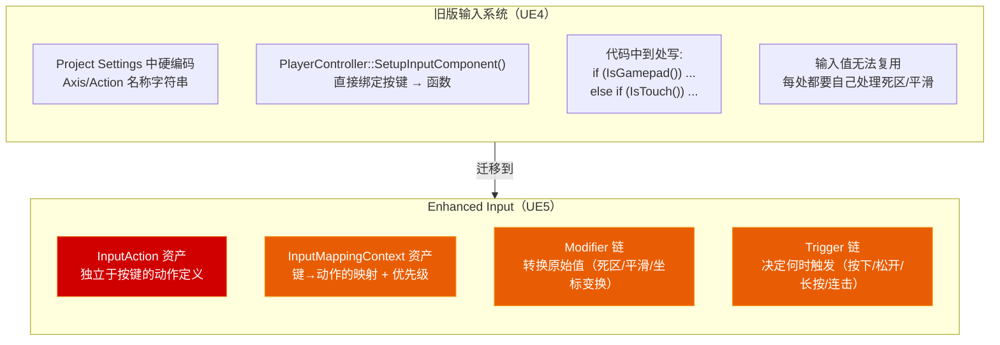
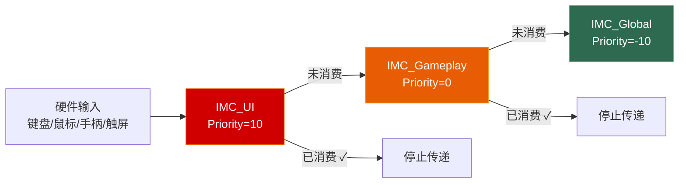

# 第十章 输入系统：Enhanced Input 的触发器与修饰器之道

> **一句话理解**：UE5 的 Enhanced Input 系统彻底重写了旧的 Axis/Action 输入模型——它把"按下什么键"（InputAction）、"怎么按键"（InputMappingContext，键→动作的映射）、"按键原始值怎么处理"（Modifier，值修饰器）和"什么时候真正触发"（Trigger，触发条件）四个关注点**彻底解耦**。理解这四层模型，你就理解了为什么 Enhanced Input 能同时优雅地处理键盘、鼠标、手柄和触屏——而不需要写一堆 `if (IsGamepad())` 分支。

---

## 10.1 概念直觉 —— 为什么需要 Enhanced Input？

### 10.1.1 旧系统 vs 新系统：一眼看穿架构差异



### 10.1.2 一次输入请求的完整流转路径

```cpp
// 玩家按下键盘 "A" 键 → 角色向左移动的完整路径：

// ① 硬件输入 → 操作系统 → UE 消息循环
//       ↓
// ② InputMappingContext 查询：FKey("A") 绑定了哪个 InputAction？
//       ↓  发现绑定到 IA_Move（InputAction 资产）
// ③ Modifier 链：对原始值 (1.0, 0.0) 进行变换
//       ↓  SwizzleInputAxis 修饰器 → 将 X 轴映射为 Y 轴
// ④ Trigger 链：判断是否满足触发条件
//       ↓  Down Trigger → 按下即触发
// ⑤ UEnhancedInputComponent 将处理后的值分发给回调
//       ↓  C++ Bound Function: MovementInput(FVector2D(1.0, 0.0))
// ⑥ PlayerController → Pawn → UCharacterMovementComponent
//       ↓  实际移动角色

// 核心优势：这个流程中，InputAction 只有一个（IA_Move），
// 但键盘 / 手柄 / 触屏都可以通过各自的 MappingContext 映射到它——
// C++ 回调只需绑定一次，完全不关心"按了什么设备"。
```

### 10.1.3 Enhanced Input 的底层 Tick 驱动——UEnhancedPlayerInput

```cpp
// ===== 面试深水区：增强输入系统每帧是怎么运转的？ =====

// 在 APlayerController 诞生时，引擎会创建 UPlayerInput 的子类——
// UEnhancedPlayerInput（它继承并重写了原生 UPlayerInput）。
// 每帧游戏线程执行 APlayerController::PlayerTick 时，底层调用链为：

// PlayerTick() → PlayerInput->TickInput(DeltaTime) → 增强输入接管流程：
//   ① 捕获硬件 FKey 的物理状态（键盘扫描码、手柄摇杆值、触屏坐标）
//   ② 按优先级降序遍历当前激活的 InputMappingContext 链表
//   ③ 匹配到 InputAction 后，对其原始值依次应用 UInputModifier 管道变换
//      （死区 → 平滑 → 缩放 → 坐标变换 → 曲线映射……）
//   ④ 将变换后的值送入 UInputTrigger 状态机，判定 ETriggerState
//   ⑤ 根据状态转移结果，通过 UEnhancedInputComponent 内部注册的委托
//      将 FInputActionValue 分发到 C++ / 蓝图的回调函数

// 关键点总结：
// - UEnhancedPlayerInput 是 UPlayerInput 的子类，不是替代品——旧版 Axis 仍可用
// - 整个管道在 GameThread 上同步执行，没有异步开销
// - Tick 开销与当前激活的 IMC 数量和绑定的 Action 数量成正比
//   （通常 < 0.1ms，除非挂了几十个 IMC 同时轮询）
```

---

## 10.2 InputAction —— 动作的"语义定义"

### 10.2.1 概念与值类型

```cpp
// InputAction 是一个 UDataAsset，在编辑器中创建。
// 它不包含任何按键信息——只定义"这是一个什么动作"和"它产生什么类型的值"。

// ===== InputAction 的值类型（ValueType）=====
// EInputActionValueType 枚举决定了回调函数接收的参数类型：

// Digital (bool)  — 只有按下/松开两个状态
//   例：跳跃、射击、交互
//   回调签名：void(const FInputActionValue& Value)
//   bool bPressed = Value.Get<bool>();

// Axis1D (float)  — 单轴数值（0.0 ~ 1.0）
//   例：油门、扳机键
//   回调签名：void(const FInputActionValue& Value)
//   float AxisValue = Value.Get<float>();

// Axis2D (FVector2D) — 二维轴（±1.0）
//   例：WASD 移动、鼠标视角
//   回调签名：void(const FInputActionValue& Value)
//   FVector2D Vec = Value.Get<FVector2D>();

// Axis3D (FVector)  — 三维轴
//   例：3D 空间中的移动（如 6-DOF 控制器）
//   回调签名：void(const FInputActionValue& Value)
//   FVector Vec = Value.Get<FVector>();
```

### 10.2.2 在 C++ 中引用 InputAction 资产

```cpp
// InputAction 是资产（UInputAction），不能 new——必须在编辑器中创建，
// 然后在 C++ 中用指针引用，从蓝图中赋值。

UCLASS()
class AMyPlayerController : public APlayerController
{
    GENERATED_BODY()

public:
    // ★ 标准模式：用 TObjectPtr 引用资产，在蓝图中选择
    UPROPERTY(EditDefaultsOnly, BlueprintReadOnly, Category = "Input")
    TObjectPtr<UInputAction> MoveAction;     // 移动

    UPROPERTY(EditDefaultsOnly, BlueprintReadOnly, Category = "Input")
    TObjectPtr<UInputAction> LookAction;     // 视角

    UPROPERTY(EditDefaultsOnly, BlueprintReadOnly, Category = "Input")
    TObjectPtr<UInputAction> JumpAction;     // 跳跃

    UPROPERTY(EditDefaultsOnly, BlueprintReadOnly, Category = "Input")
    TObjectPtr<UInputAction> InteractAction; // 交互
};
// ↑ 蓝图子类中把这些属性指向具体的 InputAction 资产
```

---

## 10.3 InputMappingContext —— 物理按键 → 逻辑动作的映射

### 10.3.1 概念与优先级

```cpp
// InputMappingContext（IMC）决定"在什么场景下，哪些按键触发哪些动作"。
// 同一时刻可以加载多个 IMC，优先级高的先处理。

// ===== IMC 的优先级机制 =====
// 典型场景：你的游戏需要三套输入——
//
// IMC_Default (Priority = 0)
//   WASD → Move, Mouse → Look, Space → Jump
//
// IMC_Vehicle (Priority = 1)  ← 更高优先级，覆盖默认
//   WASD → DriveVehicle, Space → HandBrake
//   （载具中不需要 Look 和 Jump，但 Move 被 Vehicle 覆盖）
//
// IMC_UI (Priority = 2)  ← 最高优先级，覆盖一切
//   MouseClick → UINavigate, Escape → CloseMenu
//   （打开菜单时所有游戏输入被拦截）

// 原理：引擎从高优先级 IMC 开始匹配按键。如果高优先级的 IMC
// 处理了这个按键，默认情况下低优先级的 IMC 就不会再收到。
```

### 10.3.2 在 C++ 中加载/卸载 MappingContext

```cpp
#include "EnhancedInputSubsystems.h"
#include "EnhancedInputComponent.h"

void AMyPlayerController::BeginPlay()
{
    Super::BeginPlay();

    if (ULocalPlayer* LocalPlayer = GetLocalPlayer())
    {
        // 获取 Enhanced Input 子系统
        if (UEnhancedInputLocalPlayerSubsystem* InputSubsystem =
            LocalPlayer->GetSubsystem<UEnhancedInputLocalPlayerSubsystem>())
        {
            // 加载默认 IMC
            InputSubsystem->AddMappingContext(DefaultMappingContext, 0);
            //                                         ↑ Priority = 0

            // 场景切换时：
            // InputSubsystem->RemoveMappingContext(DefaultMappingContext);
            // InputSubsystem->AddMappingContext(VehicleMappingContext, 1);
        }
    }
}

// ===== 动态切换 IMC 的完整模式 =====
void AMyPlayerController::EnterVehicleMode()
{
    if (auto* InputSub = GetLocalPlayer()->GetSubsystem<UEnhancedInputLocalPlayerSubsystem>())
    {
        // 移除默认 IMC，加载载具 IMC
        InputSub->RemoveMappingContext(DefaultMappingContext);
        InputSub->AddMappingContext(VehicleMappingContext, 1);

        // 也可以同时加载多个——引擎按优先级链式处理
    }
}
```

---

## 10.4 Modifier —— 原始值的"变换管道"

### 10.4.1 常用 Modifier 速查

```cpp
// Modifier 在 Trigger 之前执行——先变换原始输入值，再判断是否触发。
// 多个 Modifier 组成一条管道：原始值 → Modifier1 → Modifier2 → ... → 输出值

// ===== 工程中必知的 Modifier =====

// UInputModifierDeadZone —— 死区（摇杆漂移克星）
// 参数：LowerThreshold(0.0~1.0), UpperThreshold(0.0~1.0), Type
// 摇杆在中心位置会有微小抖动（0.001~0.01），死区将这些值归零
// EDeadZoneType::Axial  —— 每个轴独立应用（适合 WASD）
// EDeadZoneType::Radial —— 到圆心的距离（适合摇杆）

// UInputModifierSmooth —— 平滑过渡
// 参数：SmoothingTime（秒）
// 避免 0 → 1 的突变——输入值会在指定时间内平滑渐变

// UInputModifierSwizzleInputAxis —— 坐标轴交换
// 参数：Order（如 YXZ、ZYX 等）
// 例：鼠标横移默认是 X 轴，但你可能想让它控制 Y 轴

// UInputModifierNegate —— 取反
// 参数：bX, bY, bZ （每个轴是否取反）
// 例：飞机游戏中"拉杆抬头"需要反转 Y 轴

// UInputModifierScalar —— 缩放
// 参数：Scalar（0.0~N）
// 例：Shift 加速 → 在 Modifier 链中加 Scalar(2.0)

// UInputModifierResponseCurveExponential / User —— 曲线映射
// 将线性输入映射为曲线（如 FPS 瞄准时摇杆需要指数响应）
```

### 10.4.2 Modifier 实战组合

```cpp
// 场景：手柄摇杆控制角色移动——需要哪些 Modifier？

// 摇杆原始输入值：
// X: -0.0013  Y: 0.0021  （静止时抖动）
// X: -0.8500  Y: 0.3200  （推摇杆向左上）

// Modifier 管道配置：
// 1. DeadZone(Radial, Lower=0.15) → 消除抖动，X: 0.0  Y: 0.0
// 2. Scalar(600.0)                 → 映射到角色速度量级
// 3. Smooth(0.05s)                 → 消除突变，平滑过渡

// 管道后的输出：
// 静止时：(0.0, 0.0)     → 角色不动
// 推杆时：(510.0, 192.0) → 角色平滑加速到目标方向

// ★ 关键理念：Modifier 配置在 InputAction 资产的编辑器面板中！
// C++ 代码不需要关心这些——它只接收经过管道变换后的最终值。
```

---

## 10.5 Trigger —— "何时触发"的精确定义

### 10.5.1 内置 Trigger 类型

```cpp
// Trigger 决定了 Modifier 管道输出后，"这个值应不应该视为一次动作触发"。

// ===== Engineer 必学的 Trigger =====

// UInputTriggerDown —— 按下触发（最常用）
// 输入值从 0 变为非 0 时触发一次
// 参数：ActuationThreshold（触发阈值，默认 0.5）
// 场景：跳跃、射击、技能

// UInputTriggerPressed —— 按下持续触发
// 按下期间每帧都触发（未经 ActuationThreshold 的原始按压状态）
// 场景：按住 Shift 加速、按住鼠标拖拽

// UInputTriggerReleased —— 松开触发
// 输入值从非 0 变为 0 时触发一次
// 场景：蓄力释放、松开拉弓

// UInputTriggerHold —— 按住 N 秒后触发
// 参数：HoldTimeThreshold
// 场景：长按换弹、长按交互

// UInputTriggerTap —— 快速点击
// 参数：TapReleaseTimeThreshold
// 场景：双击闪避、快速连击

// UInputTriggerChordedAction —— 和弦触发（组合键）
// 必须同时按下另一个 InputAction 才触发
// 参数：ChordAction（另一个 InputAction 资产）
// 场景：Ctrl+C、Shift+Click

// UInputTriggerCombo —— 连招序列
// 需要按顺序在一段时间内触发一组动作
// 参数：ComboActions（InputAction 数组）
// 场景：格斗游戏招式输入（↓↘→ + 攻击）

// UInputTriggerPulse —— 脉冲触发
// 按住期间以固定间隔持续触发
// 参数：TriggerInterval（脉冲间隔秒数）
// 场景：按住连续射击（如 AK47 的自动连发）
```

### 10.5.2 Trigger 链：多个 Trigger 的 AND / OR 语义

```cpp
// 一个 InputAction 可以挂载多个 Trigger——
// 它们之间是 OR 关系（任何一个满足就触发）

// 例：IA_Attack 同时配置了：
//   1. Down Trigger   → 单击攻击
//   2. Hold Trigger (0.5s) → 长按蓄力攻击
//
// ★ Enhanced Input 提供两种回调签名选择：
//    ① void(const FInputActionValue& Value)  → 只拿输入值，每个 Trigger 事件各自绑定
//    ② void(const FInputActionInstance& Instance) → 可透过 Instance.GetTriggerEvent()
//       在一个回调里拿到 Started/Triggered/Completed 等全部 ETriggerEvent + 激活时长等上下文

// ✓ 方案 A：每个 Trigger 事件单独绑定（推荐——逻辑清晰、易调试）
void SetupPlayerInputComponent(UInputComponent* PlayerInputComponent) override
{
    // ...
    // 单击 → 普通攻击
    EnhancedInput->BindAction(AttackAction, ETriggerEvent::Triggered,  this, &AMyCharacter::OnNormalAttack);
    // 长按开始 → 开始蓄力
    EnhancedInput->BindAction(AttackAction, ETriggerEvent::Started,    this, &AMyCharacter::OnChargeStart);
    // 长按释放 → 发射蓄力攻击
    EnhancedInput->BindAction(AttackAction, ETriggerEvent::Completed,  this, &AMyCharacter::OnChargeFire);
    // ⚠️ 必须绑定 Canceled——防御蓄力被中断
    EnhancedInput->BindAction(AttackAction, ETriggerEvent::Canceled,   this, &AMyCharacter::OnChargeCanceled);
}

void OnNormalAttack(const FInputActionValue& Value)  { /* 单击 */ }
void OnChargeStart(const FInputActionValue& Value)   { bIsCharging = true; }
void OnChargeFire(const FInputActionValue& Value)    { FireChargedAttack(); bIsCharging = false; }
void OnChargeCanceled(const FInputActionValue& Value) { bIsCharging = false; }

// ✓ 方案 B：单回调 + FInputActionInstance（适合需要上下文信息的场景）
void SetupSingleCallback()
{
    // 不再需要写 4 个绑定——一个 FInputActionInstance 回调搞定所有 Trigger
    EnhancedInput->BindAction(AttackAction, ETriggerEvent::Triggered, this,
        [](const FInputActionInstance& Instance)
        {
            ETriggerEvent Event = Instance.GetTriggerEvent();
            float HeldDuration = Instance.GetElapsedTime();

            if (Event == ETriggerEvent::Started)
            {
                // 开始蓄力
            }
            else if (Event == ETriggerEvent::Completed)
            {
                // 发射蓄力攻击（伤害由 HeldDuration 决定）
            }
        });
}
```

### 10.5.3 ETriggerEvent 枚举速查

```cpp
// 回调函数的 TriggerEvent 参数取值：

// Started    — 动作刚开始（按下瞬间，不管任何 Trigger）
// Ongoing    — 动作持续中（按下期间每帧，不管任何 Trigger）
// Triggered  — 动作通过 Trigger 条件！这是你最常用的
// Completed  — 动作结束（松开瞬间）
// Canceled   — 动作被取消（如 MappingContext 被卸载、输入被消费）

// 绝大多数游戏逻辑只关心两个：
// → Triggered（动作确实触发了）
// → Completed（需要知道"松开"时，如蓄力）
```

### 10.5.4 Trigger 底层状态机：ETriggerState 与时间片运转

```cpp
// ===== 面试深水区：Trigger 在底层到底怎么判断"该触发了"？ =====

// 每一个 UInputTrigger 资产在底层都是一个微型时间片状态机。
// 引擎每帧调用其 UpdateState()，返回 ETriggerState：

// ETriggerState 枚举：
//   None       — 没有输入，状态机空闲
//   Ongoing    — 输入持续中，但尚未满足 Trigger 条件
//   Triggered  — 满足 Trigger 条件！C++ 侧收到 ETriggerEvent::Triggered

// ===== 以 Hold Trigger（长按）为例的完整状态转移 =====
// 帧 0：玩家按下 Space → UpdateState() → Ongoing
//         （未达到 HoldTimeThreshold，C++ 收到 Started + Ongoing）
// 帧 1~N：持续按下 → 每帧 Ongoing
// 帧 K：按下时间 ≥ HoldTimeThreshold → UpdateState() → Triggered
//         （C++ 收到 Triggered！）
// 帧 K+1：玩家松开 → UpdateState() → None
//         （C++ 收到 Completed）

// ===== 以 Tap Trigger（快速点击）为例 =====
// 帧 0：按下 → Ongoing
// 帧 1：松开 → 检查按下时长 ≤ TapReleaseTimeThreshold → Triggered
// 帧 2：如果在 TapReleaseTimeThreshold 内再次按下 → Triggered（双击）

// 关键认知：
// - Ongoing 是 Triggered 的"前置等待区"
// - C++ 的 ETriggerEvent::Triggered 对应状态机的 ETriggerState::Triggered
// - C++ 的 Started/Ongoing/Completed/Canceled 是"输入生命周期事件"，
//   独立于 Trigger 条件——即使没有任何 Trigger 配置，Started/Completed 仍会触发
```

---

## 10.6 C++ 绑定 —— 从资产到代码的最后一步

### 10.6.1 SetupPlayerInputComponent 的标准模式

> ⚠️ **关键前提**：`SetupPlayerInputComponent(UInputComponent*)` 是 **`APawn` / `ACharacter`** 的虚函数——不是 `APlayerController` 的！`APlayerController` 的输入初始化函数是 **`SetupInputComponent()`**（无参数）。现代 UE5 的工业共识是将 InputAction 绑定写在 **ACharacter** 中，IMC 的加载写在 **APlayerController** 中。

```cpp
#include "EnhancedInputComponent.h"
#include "EnhancedInputSubsystems.h"
#include "InputActionValue.h"

// ===== 第一步：PlayerController 负责加载 IMC =====
UCLASS()
class AMyPlayerController : public APlayerController
{
    GENERATED_BODY()

public:
    UPROPERTY(EditDefaultsOnly, BlueprintReadOnly, Category = "Input")
    TObjectPtr<UInputMappingContext> DefaultMappingContext;

protected:
    virtual void BeginPlay() override
    {
        Super::BeginPlay();

        if (IsLocalPlayerController())
        {
            if (ULocalPlayer* LocalPlayer = GetLocalPlayer())
            {
                if (UEnhancedInputLocalPlayerSubsystem* InputSub =
                    LocalPlayer->GetSubsystem<UEnhancedInputLocalPlayerSubsystem>())
                {
                    InputSub->AddMappingContext(DefaultMappingContext, 0);
                }
            }
        }
    }
};

// ===== 第二步：Character 负责绑定 InputAction → 回调 =====
UCLASS()
class AMyCharacter : public ACharacter
{
    GENERATED_BODY()

public:
    // InputAction 资产引用
    UPROPERTY(EditDefaultsOnly, BlueprintReadOnly, Category = "Input")
    TObjectPtr<UInputAction> MoveAction;

    UPROPERTY(EditDefaultsOnly, BlueprintReadOnly, Category = "Input")
    TObjectPtr<UInputAction> LookAction;

    UPROPERTY(EditDefaultsOnly, BlueprintReadOnly, Category = "Input")
    TObjectPtr<UInputAction> JumpAction;

protected:
    virtual void SetupPlayerInputComponent(UInputComponent* PlayerInputComponent) override
    {
        Super::SetupPlayerInputComponent(PlayerInputComponent);

        if (UEnhancedInputComponent* EnhancedInput =
            Cast<UEnhancedInputComponent>(PlayerInputComponent))
        {
            // 持续型输入
            EnhancedInput->BindAction(MoveAction, ETriggerEvent::Triggered,
                this, &AMyCharacter::Move);
            EnhancedInput->BindAction(LookAction, ETriggerEvent::Triggered,
                this, &AMyCharacter::Look);

            // 状态型输入（Started + Completed + Canceled 闭环）
            EnhancedInput->BindAction(JumpAction, ETriggerEvent::Started,
                this, &AMyCharacter::JumpStarted);
            EnhancedInput->BindAction(JumpAction, ETriggerEvent::Completed,
                this, &AMyCharacter::JumpEnded);
            // ⚠️ 必须同时绑定 Canceled！否则玩家按住跳跃键时打开菜单/切换关卡
            //    输入生命周期被 Cancel，角色永远卡在"按住跳跃"的状态
            EnhancedInput->BindAction(JumpAction, ETriggerEvent::Canceled,
                this, &AMyCharacter::JumpEnded);
        }
    }

    void Move(const FInputActionValue& Value)
    {
        const FVector2D MovementVector = Value.Get<FVector2D>();

        const FRotator YawRotation(0.0f, GetController()->GetControlRotation().Yaw, 0.0f);
        const FVector Forward = FRotationMatrix(YawRotation).GetScaledAxis(EAxis::X);
        const FVector Right   = FRotationMatrix(YawRotation).GetScaledAxis(EAxis::Y);

        AddMovementInput(Forward, MovementVector.Y);
        AddMovementInput(Right,   MovementVector.X);
    }

    void Look(const FInputActionValue& Value)
    {
        const FVector2D LookAxis = Value.Get<FVector2D>();
        AddControllerYawInput(LookAxis.X);
        AddControllerPitchInput(LookAxis.Y);
    }

    void JumpStarted(const FInputActionValue&)  { Jump(); }
    void JumpEnded(const FInputActionValue&)    { StopJumping(); }
};
```

### 10.6.2 BindAction 的高级用法 —— 绑定到 Lambda

```cpp
void AMyCharacter::SetupPlayerInputComponent(UInputComponent* PlayerInputComponent)
{
    Super::SetupPlayerInputComponent(PlayerInputComponent);

    if (UEnhancedInputComponent* EnhancedInput = Cast<UEnhancedInputComponent>(PlayerInputComponent))
    {
        // 方式一：绑定到成员函数（推荐——可被蓝图重写）
        EnhancedInput->BindAction(MoveAction, ETriggerEvent::Triggered,
            this, &AMyCharacter::Move);

        // 方式二：绑定到 Lambda——必须将 this 作为第三个参数传入
        // ✓ 传入 this 的作用：① 为编译器模板推导提供上下文
        //                    ② 保障 GC 生命周期安全（Lambda 内部走 UObject 弱引用追踪）
        EnhancedInput->BindAction(InteractAction, ETriggerEvent::Triggered,
            this, [](const FInputActionValue& Value)
            {
                bool bPressed = Value.Get<bool>();
                // Lambda 业务逻辑
            });

        // ⚠️ 不传 this 的裸 Lambda 会导致编译器模板推导模糊（Ambiguous template instantiation）
        //    同时失去了 GC 生命周期安全保护
    }
}
```

### 10.6.3 输入注入（Input Injection）—— 自动化测试与回放的王牌

```cpp
// ===== 面试深水区：怎么在测试/回放中注入输入，复用玩家的 InputAction 代码？ =====

// ⚠️ 关键前提：UEnhancedInputLocalPlayerSubsystem 是纯客户端子系统——
//    只存在于本地玩家的客户端进程，Dedicated Server 和 AIController 上完全不存在！
//    因此 AI 绝对不能通过 GetLocalPlayer() 来注入输入。

// ✓ AI 的正确复用方式：直接调用输入触发的 Gameplay 核心函数
//    （如 Attack()、Jump()），这些函数本身就是"输入→行为"的公共接口。
//    AI 不需要"模拟按键"——它直接执行按键产生的逻辑结果。

// ✓ 输入注入的合法使用场景：自动化测试、回放系统、本地教学关卡
//    （仅限本地客户端环境，有 LocalPlayer 存在时）

#include "EnhancedInputSubsystems.h"

// 仅在 LOCAL CLIENT 环境中使用：
void UMyTestHelper::SimulateAttackInput()
{
    // 前提：调用方必须是本地客户端上的 PlayerController
    if (APlayerController* PC = GetWorld()->GetFirstPlayerController())
    {
        if (ULocalPlayer* LP = PC->GetLocalPlayer())
        {
            if (UEnhancedInputLocalPlayerSubsystem* InputSub =
                LP->GetSubsystem<UEnhancedInputLocalPlayerSubsystem>())
            {
                FInputActionValue InjectionValue(true);
                InputSub->InjectInputForAction(
                    AttackAction, InjectionValue, nullptr, nullptr);
            }
        }
    }
}

// ===== Application Scenarios =====
// ① 自动化测试（本地客户端）——不依赖物理输入设备，精确重复测试场景
// ② 回放系统（本地客户端）——录制玩家的输入序列，精确重现
// ③ 教学关卡（本地客户端）——预置的"虚拟输入"引导玩家操作
// ✗ ④ AI Bot（服务器端）——不可用！AI 直接调用 Gameplay 核心函数即可

// ⚠️ InjectInputForAction 同样必须在 GameThread 上调用
//    （它内部会触发完整的 Enhanced Input 管道）
```

---

## 10.7 输入优先级与消费机制

### 10.7.1 输入消费（Input Consumption）

```cpp
// 当一个输入被高优先级的 IMC 处理后，默认会"消费"掉它——
// 低优先级的 IMC 不再收到。

// ⚠️ 关键澄清：输入消费不是"无条件霸占"——它有两层精细控制：

// 第一层：UInputAction 资产上的 bConsumeInput 属性
//   · true（默认）：该 Action 触发后，消费此输入，阻止向后传递
//   · false：该 Action 触发后，输入仍然继续向后传递
//   → 场景：战斗系统响应了左键射击，同时数据埋点系统也需要监听左键点击
//            → 两个 Action 共用同一个按键，埋点系统的 Action 设 bConsumeInput=false

// 第二层：IMC 内特定按键映射的高级设置
//   · 每个键→Action 的映射条目上都有独立的消费开关
//   → 场景：同一个 IMC 内，WASD 移动消费输入（阻止同时触发其他），
//           但 Tab 键不消费（允许计分板同时打开）

// 场景：打开背包菜单时，玩家的移动输入不应该同时控制角色

void AMyPlayerController::OpenInventory()
{
    // 加载 UI 输入上下文（Priority = 10，高于游戏 IMC 的 0）
    if (auto* InputSub = GetLocalPlayer()->GetSubsystem<UEnhancedInputLocalPlayerSubsystem>())
    {
        InputSub->AddMappingContext(UIMappingContext, 10);
        // ↑ 高优先级：UI 操作（bConsumeInput=true）会消费输入，游戏逻辑不再收到
    }

    bShowMouseCursor = true;
    SetInputMode(FInputModeGameAndUI());
}

void AMyPlayerController::CloseInventory()
{
    if (auto* InputSub = GetLocalPlayer()->GetSubsystem<UEnhancedInputLocalPlayerSubsystem>())
    {
        InputSub->RemoveMappingContext(UIMappingContext);
    }

    bShowMouseCursor = false;
    SetInputMode(FInputModeGameOnly());
}

// ===== 消费行为的微调 =====
// UInputMappingContext 上有一个属性：bIgnoreAllPressedKeysUntilRelease
// 设为 true 时，加载该 IMC 的瞬间不会触发任何"当前正按着"的键——
// 直到所有键松开再重新按下。
// 场景：打开菜单的瞬间，不会因为"正按着 W"而让角色移动
```

### 10.7.2 输入优先级链的完整模型



---

## 10.8 旧版 Axis/Action 映射 —— 遗留项目维护速查

### 10.8.1 旧系统的标准模式（仅用于阅读旧代码）

```cpp
// ===== 旧版输入系统 —— 如果你在维护 UE4 迁移项目 =====
// 不推荐在新代码中使用，但面试和遗留项目中很常见

void AOldPlayerController::SetupInputComponent()
{
    Super::SetupInputComponent();

    // 旧版 Axis 绑定——通过 FName 字符串匹配
    InputComponent->BindAxis("MoveForward", this, &AOldPlayerController::MoveForward);
    InputComponent->BindAxis("MoveRight",   this, &AOldPlayerController::MoveRight);
    InputComponent->BindAxis("LookUp",      this, &AOldPlayerController::LookUp);
    InputComponent->BindAxis("Turn",        this, &AOldPlayerController::Turn);

    // 旧版 Action 绑定——通过 FName 字符串匹配
    InputComponent->BindAction("Jump", IE_Pressed,  this, &AOldPlayerController::Jump);
    InputComponent->BindAction("Jump", IE_Released, this, &AOldPlayerController::StopJump);
}

// 旧版的致命缺陷：
// 1. Axis/Action 名称是硬编码字符串——拼写错误编译期无法发现
// 2. 绑定写在 Project Settings → Input 中，团队协作容易冲突
// 3. 手柄/键盘适配需要在代码里写死
// 4. 无法做高级 Trigger（长按/双击/和弦）
// 5. 输入值无法复用——死区/平滑每个绑定都要重写一遍
```

### 10.8.2 新旧对比速查表

| | 旧版 Axis/Action | Enhanced Input |
|---|---|---|
| 动作定义 | Project Settings 中字符串 | `UInputAction` 资产 |
| 按键映射 | `BindAxis("Name", ...)` | `UInputMappingContext` 资产 |
| 值变换 | C++ 中手动处理 | `UInputModifier` 链（编辑器配置） |
| 触发条件 | 仅 Pressed/Released | `UInputTrigger` 链（长按/双击/和弦/脉冲） |
| 手柄适配 | `if (IsGamepad())` 分支 | 添加手柄 IMC 即可——C++ 代码不变 |
| 优先级 | 无 | IMC Priority + 消费机制 |
| 编译检查 | ❌ 字符串匹配 | ✅ 资产引用（类型安全） |
| 蓝图支持 | 弱 | 完整支持（可视化绑定） |

---

## 10.9 跨平台适配 —— 手柄与触屏

### 10.9.1 手柄适配

```cpp
// Enhanced Input 的手柄适配极其简单——在编辑器中完成，不需要写代码：

// 步骤 1：创建手柄专用的 IMC（IMC_Gamepad）
// 步骤 2：在 IMC_Gamepad 中将手柄按键映射到相同的 InputAction
//     LeftThumbstick → IA_Move（Axis2D）
//     RightThumbstick → IA_Look（Axis2D）
//     Gamepad_FaceButton_Bottom → IA_Jump
//
// 步骤 3：在 C++ 中检测连接设备，加载对应 IMC

void AMyPlayerController::OnInputDeviceChanged()
{
    if (auto* InputSub = GetLocalPlayer()->GetSubsystem<UEnhancedInputLocalPlayerSubsystem>())
    {
        if (HasConnectedGamepad())
        {
            InputSub->RemoveMappingContext(KBM_MappingContext);
            InputSub->AddMappingContext(GamepadMappingContext, 0);
        }
        else
        {
            InputSub->RemoveMappingContext(GamepadMappingContext);
            InputSub->AddMappingContext(KBM_MappingContext, 0);
        }
    }
}

// ★ 关键：MoveAction / LookAction / JumpAction 本身不需要任何修改！
// C++ 中的绑定和回调完全不变——只切换 IMC 即可。
// 这就是解耦的真正威力。
```

### 10.9.2 触屏输入

```cpp
// Enhanced Input 原生支持触屏——通过特殊的 InputTrigger

// 触屏常用 Trigger：
// UInputTriggerPressed —— 手指放下
// UInputTriggerReleased —— 手指抬起
// UInputTriggerHold —— 长按
// 配合 Touch 类型的 InputAction ValueType（Axis2D 获得触摸坐标）

// 在 IMC 中绑定：
// Touch 1 → IA_TouchMove（Axis2D，跟踪手指滑动）
// Touch 1 → IA_TouchTap  （Digital，Tap 触发）
//
// C++ 回调示例：
void OnTouchMove(const FInputActionValue& Value)
{
    FVector2D TouchDelta = Value.Get<FVector2D>();
    // TouchDelta：本帧手指移动的像素偏移
    // 可用于旋转视角、拖动物体等
}

void OnTouchTap(const FInputActionValue& Value)
{
    // 点击——获取点击位置
    FVector2D ScreenPosition = Value.Get<FVector2D>();
    // 从屏幕坐标做射线检测……
}
```

---

## 10.10 实战：工业级 FPS 输入系统

### 10.10.1 标准模式：Character 绑定 + Controller 管理 IMC

```cpp
// ===== 场景：构建一个 FPS 角色的完整输入系统 =====
// 需求：WASD+鼠标+跳跃+冲刺+射击+瞄准+换弹+交互+蹲伏+菜单拦截+手柄适配
// 架构：Controller 管 IMC 加载/切换，Character 管 InputAction 绑定

// ---------- 第一步：Controller —— 只负责加载和切换 IMC ----------
UCLASS()
class AFPSPlayerController : public APlayerController
{
    GENERATED_BODY()

public:
    UPROPERTY(EditDefaultsOnly, BlueprintReadOnly, Category = "Input|Mappings")
    TObjectPtr<UInputMappingContext> DefaultMappingContext;

    UPROPERTY(EditDefaultsOnly, BlueprintReadOnly, Category = "Input|Mappings")
    TObjectPtr<UInputMappingContext> UIMappingContext;

protected:
    virtual void BeginPlay() override
    {
        Super::BeginPlay();
        if (IsLocalPlayerController())
        {
            if (auto* InputSub = GetLocalPlayer()->GetSubsystem<UEnhancedInputLocalPlayerSubsystem>())
            {
                InputSub->AddMappingContext(DefaultMappingContext, 0);
            }
        }
    }

public:
    // 菜单切换——IMC 管理层
    void OpenPauseMenu()
    {
        if (auto* InputSub = GetLocalPlayer()->GetSubsystem<UEnhancedInputLocalPlayerSubsystem>())
        {
            InputSub->RemoveMappingContext(DefaultMappingContext);
            InputSub->AddMappingContext(UIMappingContext, 10);
        }
        bShowMouseCursor = true;
        SetInputMode(FInputModeGameAndUI());
    }

    void ClosePauseMenu()
    {
        if (auto* InputSub = GetLocalPlayer()->GetSubsystem<UEnhancedInputLocalPlayerSubsystem>())
        {
            InputSub->RemoveMappingContext(UIMappingContext);
            InputSub->AddMappingContext(DefaultMappingContext, 0);
        }
        bShowMouseCursor = false;
        SetInputMode(FInputModeGameOnly());
    }
};

// ---------- 第二步：Character —— 绑定 InputAction → 回调 ----------
UCLASS()
class AFPSCharacter : public ACharacter
{
    GENERATED_BODY()

public:
    UPROPERTY(EditDefaultsOnly, BlueprintReadOnly, Category = "Input|Actions")
    TObjectPtr<UInputAction> MoveAction, LookAction, JumpAction;
    UPROPERTY(EditDefaultsOnly, BlueprintReadOnly, Category = "Input|Actions")
    TObjectPtr<UInputAction> SprintAction, ShootAction, AimAction;
    UPROPERTY(EditDefaultsOnly, BlueprintReadOnly, Category = "Input|Actions")
    TObjectPtr<UInputAction> ReloadAction, InteractAction, CrouchAction;

protected:
    virtual void SetupPlayerInputComponent(UInputComponent* PlayerInputComponent) override
    {
        Super::SetupPlayerInputComponent(PlayerInputComponent);

        UEnhancedInputComponent* Input = Cast<UEnhancedInputComponent>(PlayerInputComponent);
        if (!Input) return;

        // 持续型（Triggered 每帧）
        Input->BindAction(MoveAction, ETriggerEvent::Triggered, this, &AFPSCharacter::Move);
        Input->BindAction(LookAction, ETriggerEvent::Triggered, this, &AFPSCharacter::Look);

        // 状态型（Started + Completed + Canceled 闭环）
        Input->BindAction(JumpAction,   ETriggerEvent::Started,   this, &AFPSCharacter::JumpStart);
        Input->BindAction(JumpAction,   ETriggerEvent::Completed, this, &AFPSCharacter::JumpEnd);
        Input->BindAction(JumpAction,   ETriggerEvent::Canceled,  this, &AFPSCharacter::JumpEnd);
        Input->BindAction(SprintAction, ETriggerEvent::Started,   this, &AFPSCharacter::SprintStart);
        Input->BindAction(SprintAction, ETriggerEvent::Completed, this, &AFPSCharacter::SprintEnd);
        Input->BindAction(SprintAction, ETriggerEvent::Canceled,  this, &AFPSCharacter::SprintEnd);
        Input->BindAction(AimAction,    ETriggerEvent::Started,   this, &AFPSCharacter::AimStart);
        Input->BindAction(AimAction,    ETriggerEvent::Completed, this, &AFPSCharacter::AimEnd);
        Input->BindAction(AimAction,    ETriggerEvent::Canceled,  this, &AFPSCharacter::AimEnd);

        // 瞬时型（Started 即可）
        Input->BindAction(ShootAction,   ETriggerEvent::Started, this, &AFPSCharacter::Shoot);
        Input->BindAction(ReloadAction,  ETriggerEvent::Started, this, &AFPSCharacter::Reload);
        Input->BindAction(InteractAction,ETriggerEvent::Started, this, &AFPSCharacter::Interact);

        // Toggle 型（Started 切换）
        Input->BindAction(CrouchAction,  ETriggerEvent::Started, this, &AFPSCharacter::CrouchToggle);
    }

    // ===== 输入处理 =====
    void Move(const FInputActionValue& Value)
    {
        FVector2D Vec = Value.Get<FVector2D>();
        const FRotator Yaw(0.0f, GetController()->GetControlRotation().Yaw, 0.0f);
        AddMovementInput(FRotationMatrix(Yaw).GetScaledAxis(EAxis::X), Vec.Y);
        AddMovementInput(FRotationMatrix(Yaw).GetScaledAxis(EAxis::Y), Vec.X);
    }

    void Look(const FInputActionValue& Value)
    {
        FVector2D Vec = Value.Get<FVector2D>();
        AddControllerYawInput(Vec.X);
        AddControllerPitchInput(Vec.Y);
        // ⚠️ Y 轴反转不在 C++ 中硬编码！交由 IMC 中的 UInputModifierNegate 处理——
        //    策划/玩家在存档中配置 Y 轴是否反转，C++ 代码永远只做加法
    }

    void JumpStart(const FInputActionValue&)  { Jump(); }
    void JumpEnd(const FInputActionValue&)    { StopJumping(); }

    void SprintStart(const FInputActionValue&) { bIsSprinting = true; ApplySpeedMod(); }
    void SprintEnd(const FInputActionValue&)   { bIsSprinting = false; ApplySpeedMod(); }

    void AimStart(const FInputActionValue&)    { bIsAiming = true; OnAimStateChanged(); }
    void AimEnd(const FInputActionValue&)      { bIsAiming = false; OnAimStateChanged(); }

    void Shoot(const FInputActionValue&)       { /* → WeaponComponent */ }
    void Reload(const FInputActionValue&)      { /* → WeaponComponent */ }
    void Interact(const FInputActionValue&)    { /* → InteractionSystem */ }

    void CrouchToggle(const FInputActionValue&) { bIsCrouched ? UnCrouch() : Crouch(); }

private:
    bool bIsSprinting = false;
    bool bIsAiming = false;

    void ApplySpeedMod()
    {
        if (auto* MC = GetCharacterMovement())
            MC->MaxWalkSpeed = bIsSprinting ? 1200.0f : 600.0f;
    }
    void OnAimStateChanged() { /* FOV / 准星 / 灵敏度 */ }
};
```

---

### 10.10.2 Lyra 工业模式：Gameplay Tags + InputConfig DataAsset

> ⚠️ **大厂反模式警示**：10.10.1 中在 Character 头文件里硬编码了 9 个 `TObjectPtr<UInputAction>` 成员变量。在大型商业项目中，每增加一个新技能动作就要改 C++ 头文件并重新编译——这违背了"策划可配置、C++ 不感知具体按键"的架构原则。

```cpp
// ===== Lyra 解法：用 DataAsset + GameplayTag 彻底解耦 =====

// ---------- 数据结构定义 ----------
USTRUCT(BlueprintType)
struct FInputActionTagBinding
{
    GENERATED_BODY()

    // GameplayTag —— C++ 只认这个 Tag，不认具体的 InputAction
    // 例：InputTag.Ability.Shoot, InputTag.Move.Forward
    UPROPERTY(EditDefaultsOnly, BlueprintReadOnly)
    FGameplayTag InputTag;

    // InputAction 资产 —— 策划在编辑器中任意更换
    // Tag 不变，换 Action 不影响任何 C++ 代码
    UPROPERTY(EditDefaultsOnly, BlueprintReadOnly)
    TObjectPtr<UInputAction> InputAction;
};

// ---------- InputConfig DataAsset ----------
UCLASS(BlueprintType)
class UInputConfigData : public UDataAsset
{
    GENERATED_BODY()

public:
    // 原生输入动作绑定 —— 移动/视角这类必须硬代码处理
    UPROPERTY(EditDefaultsOnly, BlueprintReadOnly)
    TArray<FInputActionTagBinding> NativeInputActions;

    // 能力输入动作绑定 —— 技能/攻击等由 GAS 驱动的动作
    UPROPERTY(EditDefaultsOnly, BlueprintReadOnly)
    TArray<FInputActionTagBinding> AbilityInputActions;

    // 查找函数
    const UInputAction* FindInputAction(const FGameplayTag& Tag) const
    {
        for (const auto& Binding : NativeInputActions)
            if (Binding.InputTag == Tag) return Binding.InputAction;
        for (const auto& Binding : AbilityInputActions)
            if (Binding.InputTag == Tag) return Binding.InputAction;
        return nullptr;
    }
};

// ---------- 增强的 InputComponent（扩展 BindAction） ----------
UCLASS()
class ULyraInputComponent : public UEnhancedInputComponent
{
    GENERATED_BODY()

public:
    // 用 DataAsset 中的 Tag→Action 映射 + ETriggerEvent 自动绑定
    template<class UserClass>
    void BindTaggedAction(const UInputConfigData* Config, const FGameplayTag& Tag,
                          ETriggerEvent TriggerEvent, UserClass* Object,
                          typename FEnhancedInputActionHandlerValueSignature::template
                              TMethodPtr<UserClass>::Type Func)
    {
        if (const UInputAction* Action = Config->FindInputAction(Tag))
        {
            BindAction(Action, TriggerEvent, Object, Func);
        }
    }
};

// ---------- Character 中的使用 ----------
void AFPSCharacter::SetupPlayerInputComponent(UInputComponent* PlayerInputComponent)
{
    Super::SetupPlayerInputComponent(PlayerInputComponent);

    ULyraInputComponent* Input = Cast<ULyraInputComponent>(PlayerInputComponent);
    if (!Input || !InputConfig) return;

    // C++ 只认 Tag —— 策划在 InputConfig DataAsset 中更换 Action 不需要改代码
    Input->BindTaggedAction(InputConfig, TAG_Input_Move,     ETriggerEvent::Triggered,
                            this, &AFPSCharacter::Move);
    Input->BindTaggedAction(InputConfig, TAG_Input_Jump,     ETriggerEvent::Started,
                            this, &AFPSCharacter::JumpStart);
    Input->BindTaggedAction(InputConfig, TAG_Input_Shoot,    ETriggerEvent::Started,
                            this, &AFPSCharacter::Shoot);
    // ... 所有绑定都通过 Tag，而非直接引用 UInputAction*
}

// ===== 架构收益 =====
// ① 策划在编辑器中增删 InputAction、改变按键映射 → C++ 无需重编译
// ② GameplayTags 天然分层：InputTag.Move / InputTag.Combat.Shoot / InputTag.UI.Pause
// ③ 同一个 InputConfig DataAsset 可被多个 Character 复用
// ④ GAS（Gameplay Ability System）直接通过 Tag 激活对应 Ability——参见 Ch14
```

---

## 10.11 常见陷阱与面试深度追问

### 10.11.1 Enhanced Input 常见错误 TOP 5

```cpp
// 陷阱 #1：忘记 Cast 到 UEnhancedInputComponent
void BadSetup(UInputComponent* PlayerInputComponent)
{
    // ✗ UInputComponent 是基类——没有 BindAction(InputAction*, ...) 方法
    // PlayerInputComponent->BindAction(MoveAction, ...);  // 编译错误！
    
    // ✓ 必须先 Cast
    if (UEnhancedInputComponent* Input = Cast<UEnhancedInputComponent>(PlayerInputComponent))
    {
        Input->BindAction(MoveAction, ETriggerEvent::Triggered, this, &ThisClass::Move);
    }
}

// 陷阱 #2：在 Dedicated Server 上加载 IMC
void AMyPlayerController::BadBeginPlay()
{
    // ✗ DS 上没有 LocalPlayer！GetLocalPlayer() 返回 nullptr
    // ✗ UEnhancedInputLocalPlayerSubsystem 也不存在（参见 Ch9 的 ULocalPlayerSubsystem 警告）
    
    // ✓ 检查是否是本地玩家控制器
    if (IsLocalPlayerController())
    {
        if (ULocalPlayer* LP = GetLocalPlayer())
        {
            // 加载 IMC……
        }
    }
}

// 陷阱 #3：混淆 Triggered 和 Started
EnhancedInput->BindAction(JumpAction, ETriggerEvent::Triggered, this, &ThisClass::Jump);
// ✗ 用 Triggered 绑定跳跃——每帧都触发！角色会连续跳
// ✓ 跳跃应该用 Started（按下瞬间触发一次）

// 陷阱 #4：漏绑 Canceled——"按住不放+打开菜单"导致状态永久卡死
EnhancedInput->BindAction(JumpAction, ETriggerEvent::Started,   this, &ThisClass::JumpStart);
EnhancedInput->BindAction(JumpAction, ETriggerEvent::Completed, this, &ThisClass::JumpEnd);
// ✗ 只绑了 Completed！如果玩家按住跳跃键时打开菜单/切换关卡，
//    输入生命周期被 Cancel，JumpEnd 永远不会触发——角色永远"按住跳跃"
// ✓ 必须同时绑定 Canceled：
EnhancedInput->BindAction(JumpAction, ETriggerEvent::Canceled,  this, &ThisClass::JumpEnd);

// 陷阱 #5：Axis2D 动作绑定了 Digital 回调
// ✗ InputAction 的 ValueType 设为 Axis2D，但回调里用 Value.Get<float>()
// → 获取到的永远是 0.0f——类型不匹配
// ✓ 检查 InputAction 资产的 ValueType，回调中用对应的 Get<T>()

// 陷阱 #6：IMC 优先级冲突导致输入"失灵"
// 两个 IMC 都绑定了 Space 键——高优先级 IMC 消费后，低优先级永远收不到
// ✓ 排查：用 ShowDebug EnhancedInput 控制台命令查看当前活动的 IMC 和绑定

// 陷阱 #7：在 APlayerController 中写 SetupPlayerInputComponent
// ✗ SetupPlayerInputComponent 是 APawn/ACharacter 的虚函数——Controller 没有！
//    APlayerController 的输入初始化函数是 SetupInputComponent()（无参数）
// ✓ 输入绑定写在 Character 中，IMC 管理写在 Controller 中（见 10.10.1）
```

### 10.11.2 调试命令

```
控制台调试命令：

ShowDebug EnhancedInput
  → 显示当前加载的所有 IMC、优先级、每个按键触发了哪个 Action、Trigger 状态

ShowDebug Input
  → 显示当前按下的所有键/按钮（原始输入，未经 Enhanced Input 处理）
```

---

## 10.12 30 秒速答

> **面试被问："Enhanced Input 和旧版输入系统有什么区别？为什么要升级？"**

旧版输入用硬编码字符串绑定，按键映射写在 Project Settings 里，团队协作容易冲突。Enhanced Input 把输入拆成四个独立的资产：InputAction（什么动作）、InputMappingContext（什么按键触发它）、Modifier（值怎么变换）、Trigger（什么时候触发）。好处：一个动作可以绑定键盘/手柄/触屏，C++ 代码只管业务逻辑，完全不碰"哪个键"的问题——策划在编辑器中就能改按键配置。

> **面试追问："Trigger 和 Modifier 的关系是什么？执行顺序？"**

Modifier 先执行——它变换原始输入值（死区、平滑、坐标交换）。Trigger 后执行——它根据变换后的值判断是否满足触发条件（按下、长按、双击）。比喻：Modifier 是"信号处理器"（滤波、放大），Trigger 是"事件判别器"（这个信号算不算一次'攻击'？）

> **面试追问："怎么让打开菜单时角色不会同时移动？"**

用 IMC 的优先级和消费机制。UI 的 IMC 设为高优先级（如 Priority=10），游戏 IMC 低优先级（如 0）。菜单打开时加载 UI IMC——引擎从高优先级开始匹配，UI IMC 处理并消费掉按键，游戏 IMC 永远收不到。关闭菜单时 Remove UI IMC，游戏 IMC 恢复。

> **面试追问："怎么让手柄和键盘共享同一套 C++ 输入代码？"**

这正是 Enhanced Input 的设计初衷。创建不同的 IMC（IMC_KBM、IMC_Gamepad），把各自的按键映射到相同的 InputAction。C++ 中只绑定 InputAction——完全不绑定具体按键。切换设备时只需切换 IMC，代码零改动。旧系统需要在每处 `if (IsGamepad())` 分支，新系统彻底消除了这个问题。

> **面试追问："怎么让 AI 复用玩家的输入系统？`InjectInputForAction` 是什么？"**

AI 的正确复用方式是在 `AAIController` 中**直接调用输入触发的 Gameplay 核心函数**（如 `Attack()`、`Jump()`）——这些函数本身就是"输入→行为"的公共接口，AI 不需要模拟按键。`InjectInputForAction()` 是 `UEnhancedInputLocalPlayerSubsystem` 的方法——这个子系统**只存在于本地客户端**，DS 和 AIController 上完全不存在。它的合法使用场景是本地客户端的自动化测试、回放系统和教学关卡。

> **面试追问："为什么输入绑定放在 Character 而不是 PlayerController？"**

`SetupPlayerInputComponent(UInputComponent*)` 是 `APawn`/`ACharacter` 的虚函数——`APlayerController` 根本没有这个重写点（Controller 用的是 `SetupInputComponent()`）。架构上，Character 是"身体"——它负责接收输入并移动/跳跃/射击；PlayerController 是"大脑"——它负责决定加载哪个 IMC、管理 UI 输入模式。这种分离让同一个 Controller 可以控制不同的 Character，每个 Character 可以有自己的输入绑定。工业标准是：Controller 管 IMC 的加载/卸载和菜单切换，Character 管 InputAction→回调的绑定。

---

> 📚 **第二部第四章完结。** Enhanced Input 是 UE5 对旧输入系统的一次彻底清洗——它把策划、程序和美术的输入职责在编辑器层面分开了。接下来进入 Ch11：Slate & UMG——理解 UE 的 UI 渲染管线。

> 💡 **前置依赖提醒**：
> - Enhanced Input 子系统是 ULocalPlayerSubsystem → 见 [Ch9：Game Framework & Subsystem](../09_game_framework_subsystem/) 中关于 DS 上不存在的警告
> - 输入回调中修改 Component 属性是安全的（在 GameThread 上）→ 见 [Ch7：多线程与异步](../07_concurrency/)
> - PlayerController 的职责与本节的输入处理关系 → 见 [Ch9：Game Framework](../09_game_framework_subsystem/)
