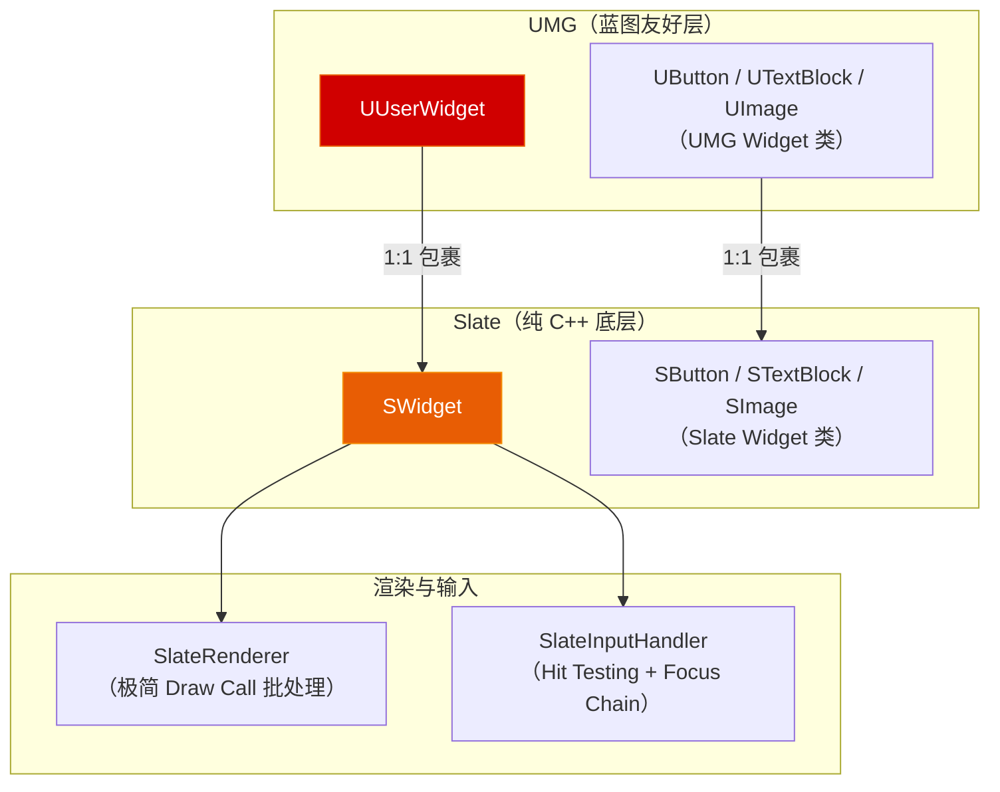

# 第十一章 Slate 与 UMG 体系：从声明式底层到数据驱动 UI

> **一句话理解**：UE 有两层 UI 系统——**Slate** 是纯 C++ 的底层声明式框架（`SNew` / `SLATE_BEGIN_ARGS`），**UMG** 是架在 Slate 之上的蓝图友好层（`UUserWidget`）。你可以把 UMG 理解成 Slate 的"可视化编辑器"——每一个 UMG 按钮底下都有一个 `SButton` 在干活。日常工作用 UMG，写编辑器工具或极端性能场景才直接写 Slate。理解这层关系后，最关键的是掌握 **ListView 数据驱动模式**和 **FText 本地化规范**。

---

## 11.1 概念直觉 —— 为什么有两套 UI？

### 11.1.1 Slate → UMG：一条调用链



```cpp
// ===== Slate vs UMG 的核心区别 =====
//
// Slate（纯 C++ 声明式）：
//   - 直接操作 SWidget / SButton / STextBlock 等底层类型
//   - 构建 UI 用 SNew / SAssignNew + 声明式括号语法
//   - 不依赖 UObject —— 纯 C++ 对象，不能序列化，不可蓝图
//   - 优势：极致的 CPU 性能和内存控制，100% C++ 可控
//   - 场景：编辑器面板、引擎工具、极端性能要求的 HUD
//
// UMG（UObject 包裹层）：
//   - 操作 UUserWidget / UButton / UTextBlock 等反射包装类
//   - 构建 UI 在编辑器中拖拽、或在 C++ 中用 CreateWidget
//   - 完整反射支持 —— 序列化、蓝图、动画、属性绑定
//   - 优势：可视化开发、策划可改、设计师可做动画
//   - 场景：游戏 UI、菜单、HUD、背包、对话框
//
// 99% 的日常开发用 UMG。剩下 1% 是编辑器工具或对 Slate 的深度定制。
```

### 11.1.2 一个最简 Slate 窗口 vs 一个最简 UMG Widget

```cpp
// ===== Slate 版本 —— 纯 C++ 声明式 =====
void OpenMySlateWindow()
{
    // SNew 创建 SWindow，声明式语法嵌套子控件
    TSharedRef<SWindow> Window = SNew(SWindow)
        .Title(FText::FromString(TEXT("Hello Slate")))
        .ClientSize(FVector2D(400, 300))
        [
            SNew(SVerticalBox)
            + SVerticalBox::Slot()
            .AutoHeight()
            [
                SNew(STextBlock)
                .Text(FText::FromString(TEXT("这是一段纯 Slate 文本")))
            ]
            + SVerticalBox::Slot()
            .FillHeight(1.0f)
            [
                SNew(SButton)
                .Text(FText::FromString(TEXT("点我")))
                .OnClicked_Lambda([]() {
                    return FReply::Handled();  // 已消费点击事件
                })
            ]
        ];

    FSlateApplication::Get().AddWindow(Window);
}

// ===== UMG 版本 —— C++ 创建 Widget，蓝图中搭界面 =====
UCLASS()
class UMyUserWidget : public UUserWidget
{
    GENERATED_BODY()

protected:
    // BindWidget —— 由蓝图中的同名控件自动绑定
    UPROPERTY(meta = (BindWidget))
    TObjectPtr<UTextBlock> TitleText;

    UPROPERTY(meta = (BindWidget))
    TObjectPtr<UButton> MyButton;

    virtual void NativeConstruct() override
    {
        Super::NativeConstruct();

        // 绑定按钮点击
        if (MyButton)
        {
            MyButton->OnClicked.AddDynamic(this, &UMyUserWidget::OnButtonClicked);
        }
    }

    UFUNCTION()
    void OnButtonClicked()
    {
        UE_LOG(LogTemp, Log, TEXT("按钮被点击了"));
    }
};

// 在 Controller 中显示：
void AMyPlayerController::ShowMyWidget()
{
    if (UMyUserWidget* Widget = CreateWidget<UMyUserWidget>(this, MyWidgetClass))
    {
        Widget->AddToViewport();
    }
}
```

---

## 11.2 Slate 底层 —— 理解一切 UMG 的"引擎"

### 11.2.1 声明式语法三剑客：SNew / SAssignNew / SLATE_BEGIN_ARGS

```cpp
// ===== 自定义一个 Slate 控件 =====
// Slate 使用一套"声明式构建器（Declarative Builder）"模式

// 第一步：用 SLATE_BEGIN_ARGS / SLATE_END_ARGS 定义参数
// 第二步：用 Construct() 函数根据参数构建子控件
// 第三步：用 SNew(MyWidget).Param1(x).Param2(y) 实例化

class SMyCompoundWidget : public SCompoundWidget
{
public:
    // ★ SLATE_BEGIN_ARGS —— 定义这个控件的"构造函数参数"
    SLATE_BEGIN_ARGS(SMyCompoundWidget)
        // SLATE_ARGUMENT —— 一次性传入，之后不动态更新
        SLATE_ARGUMENT(FString, Title)
        SLATE_ARGUMENT(int32, MaxItems)

        // SLATE_ATTRIBUTE —— 可动态绑定的属性（每次 Tick 重新求值）
        SLATE_ATTRIBUTE(int32, CurrentCount)

        // SLATE_EVENT —— 事件/委托（通常是 Lambda 或 UFUNCTION）
        SLATE_EVENT(FOnClicked, OnItemSelected)
    SLATE_END_ARGS()

    // 构建函数 —— 用传入的 Args 创建子控件
    void Construct(const FArguments& InArgs)
    {
        // 读取参数
        FString TitleString = InArgs._Title;
        int32 Max = InArgs._MaxItems;
        TAttribute<int32> CurrentAttr = InArgs._CurrentCount;
        FOnClicked ClickHandler = InArgs._OnItemSelected;

        ChildSlot
        [
            SNew(SVerticalBox)
            + SVerticalBox::Slot()
            .AutoHeight()
            [
                SNew(STextBlock)
                .Text(FText::FromString(TitleString))
            ]
            + SVerticalBox::Slot()
            .FillHeight(1.0f)
            [
                SNew(SButton)
                .OnClicked(ClickHandler)
                // .OnClicked_Lambda(...)  // 或直接用 Lambda
            ]
        ];
    }
};

// ===== 使用自定义 Slate Widget =====
TSharedRef<SMyCompoundWidget> MyWidget = SNew(SMyCompoundWidget)
    .Title(TEXT("背包"))
    .MaxItems(100)
    .CurrentCount_Lambda([]() { return GetInventoryCount(); })
    .OnItemSelected(FOnClicked::CreateLambda([]() {
        UE_LOG(LogTemp, Log, TEXT("物品被选中"));
        return FReply::Handled();
    }));

// ===== SAssignNew —— 获取 Slate Widget 的共享引用 =====
TSharedPtr<SButton> ButtonPtr;  // 拿到引用，后续可以修改
SAssignNew(ButtonPtr, SButton)
    .Text(FText::FromString(TEXT("动态按钮")));

// ... 之后
ButtonPtr->SetText(FText::FromString(TEXT("文本已修改")));
```

### 11.2.2 Slate 布局系统 —— Slot + Alignment + Padding

```cpp
// ===== Slate 布局核心：Slot 类型 =====
// 不同的父容器提供不同的 Slot 类型——

// SVerticalBox → SVerticalBox::Slot()
//   .AutoHeight()  —— 自动高度（适应内容）
//   .FillHeight(1.0f) —— 弹性填充（等比例分配剩余空间）
//   .MaxHeight(100.0f) —— 最大高度限制
//   .HAlign(HAlign_Left/Center/Right)
//   .VAlign(VAlign_Top/Center/Bottom)
//   .Padding(FMargin(10, 5))

// SHorizontalBox → SHorizontalBox::Slot()
//   .AutoWidth()
//   .FillWidth(1.0f)
//   .HAlign(...) / .VAlign(...)

// SOverlay → SOverlay::Slot()
//   .HAlign(...) / .VAlign(...)
//   .Padding(...)

// SCanvas → SCanvas::Slot()
//   .Position(FVector2D(100, 200))    // 绝对定位
//   .Size(FVector2D(300, 50))         // 绝对尺寸

// ===== 一个完整布局示例 =====
SNew(SVerticalBox)
+ SVerticalBox::Slot()
    .AutoHeight()
    .HAlign(HAlign_Center)
    .Padding(FMargin(0, 10))
    [
        SNew(STextBlock).Text(LOCTEXT("Title", "主菜单"))
    ]
+ SVerticalBox::Slot()
    .FillHeight(0.7f)
    .Padding(FMargin(20, 0))
    [
        SNew(SHorizontalBox)
        + SHorizontalBox::Slot()
        .FillWidth(0.3f)
        .Padding(FMargin(5))
        [
            SNew(SButton).Text(LOCTEXT("NewGame", "新游戏"))
        ]
        + SHorizontalBox::Slot()
        .FillWidth(0.3f)
        .Padding(FMargin(5))
        [
            SNew(SButton).Text(LOCTEXT("Continue", "继续游戏"))
        ]
        + SHorizontalBox::Slot()
        .FillWidth(0.3f)
        .Padding(FMargin(5))
        [
            SNew(SButton).Text(LOCTEXT("Settings", "设置"))
        ]
    ]
+ SVerticalBox::Slot()
    .AutoHeight()
    .HAlign(HAlign_Right)
    .Padding(FMargin(10))
    [
        SNew(STextBlock).Text(LOCTEXT("Version", "v1.0.0"))
    ];
```

### 11.2.3 Slate 的属性绑定（Attribute Binding）—— 比 UMG 的动态绑定更底层

```cpp
// Slate 的 TAttribute<T> 允许你"动态绑定"一个值的获取方式
// ——它本质是一个可调用的函数对象，每次被读取时重新求值。

// ===== 三种属性绑定方式 =====

// ① 静态值（一次设置，永不更新）
TAttribute<FText> StaticText = FText::FromString(TEXT("永不改变"));

// ② Lambda 动态绑定（每次 Get() 都重新执行）
TAttribute<FText> DynamicText = TAttribute<FText>::Create_Lambda([]() {
    return FText::FromString(FString::Printf(TEXT("当前帧: %d"), GFrameCounter));
});

// ③ 绑定到成员变量或函数
TAttribute<FSlateColor> HealthColor = TAttribute<FSlateColor>::Create(
    TAttribute<FSlateColor>::FGetter::CreateUObject(this, &UMyWidget::GetHealthColor));

// ===== 在 Slate 控件中使用属性 =====
SNew(STextBlock)
    .Text(DynamicText)  // ← 每次渲染前自动调用 Lambda 获取最新值
    .ColorAndOpacity(HealthColor);

// ===== UMG 层面的等价物：BindWidget + UPROPERTY 绑定 =====
// UMG 的属性绑定系统（在编辑器中把"Health"绑到"Text"上）
// 底层就是通过 TAttribute 实现的——它们用的是同一套机制。
```

---

## 11.3 UMG Widget 体系 —— 日常工作的核心

### 11.3.1 UUserWidget 生命周期

```cpp
UCLASS()
class UMyHUDWidget : public UUserWidget
{
    GENERATED_BODY()

public:
    // ===== UUserWidget 生命周期（按调用顺序） =====

    // ① NativePreConstruct —— 在编辑器中预览时 / 编译时调用
    virtual void NativePreConstruct() override
    {
        Super::NativePreConstruct();
        // ✗ 这里没有 World！不能访问 GameMode / PlayerController
        // ✓ 适合：根据编辑器预览数据设置控件的初始外观
    }

    // ② NativeConstruct —— Widget 被创建后调用（有 World 了）
    virtual void NativeConstruct() override
    {
        Super::NativeConstruct();
        // ✓✓✓ 初始化入口！等价于 Actor 的 BeginPlay
        // ✓ 可以访问 World、GameMode、PlayerController
        // ✓ 绑定事件、设置初始状态、启动动画
        // ⚠️ 每次 AddToViewport() 都会触发——不仅一次！

        BindDelegates();
        CachePlayerController();
        PlayIntroAnimation();
    }

    // ③ NativeTick —— 每帧调用（需要设置 bCanEverTick = true）
    virtual void NativeTick(const FGeometry& MyGeometry, float InDeltaTime) override
    {
        Super::NativeTick(MyGeometry, InDeltaTime);

        // ⚠️ 只在确实需要时启用！默认关闭
        // ✓ 适合：每帧更新的 HUD（血量条、雷达、计时器）
        // ✗ 不适合：菜单、对话框——用蓝图事件/委托替代
    }

    // ④ NativeDestruct —— 底层 Slate Widget 从 Slate 树中被移除时调用
    //   （如 RemoveFromParent()），不等同于 UObject 被 GC 销毁！
    //    如果再次 AddToViewport()，NativeConstruct 会重新触发
    virtual void NativeDestruct() override
    {
        // ✓ 清理可恢复的状态：解绑委托、取消 Timer
        UnbindDelegates();
        Super::NativeDestruct();
        // ✗ 不要在这里释放"永久资源"——Widget 可能稍后被重新 AddToViewport
    }

    // ===== 设置 Tick =====
    // 在 NativeConstruct 中或蓝图类默认选项中：
    // SetTickableWhenPaused(true);   // 暂停时仍 Tick

    // ===== 蓝图暴露的可重写事件 =====
    // BlueprintNativeEvent  —— C++ 有默认实现，蓝图可重写
    // BlueprintImplementableEvent —— C++ 不实现，蓝图必须实现

    UFUNCTION(BlueprintNativeEvent, Category = "HUD")
    void OnHealthChanged(float Current, float Max);
    void OnHealthChanged_Implementation(float Current, float Max)
    {
        // C++ 默认实现——更新血条
        if (HealthBar)
        {
            HealthBar->SetPercent(Current / Max);
        }
    }

    UFUNCTION(BlueprintImplementableEvent, Category = "HUD")
    void OnPlayerDied();  // 纯蓝图实现——播放死亡动画
};

// ===== NativeConstruct 多次触发的问题 =====
// 场景：一个 Widget 被 RemoveFromParent() 再 AddToViewport()
// → NativeConstruct 会再次调用！
// 如果你的初始化代码不应该重复执行：
void UMyHUDWidget::NativeConstruct()
{
    Super::NativeConstruct();

    if (bIsInitialized) return;  // 防止重复初始化
    bIsInitialized = true;

    // 真正只执行一次的初始化……
}
```

### 11.3.2 BindWidget —— C++ 与蓝图的"命名约定绑定"

```cpp
// BindWidget 是 UMG 最优雅的 C++/蓝图桥接机制——
// 只要 C++ 中成员变量名 == 蓝图中控件名，引擎自动赋值！

UCLASS()
class UMainMenuWidget : public UUserWidget
{
    GENERATED_BODY()

public:
    // ===== BindWidget —— 必须存在，蓝图中的同名控件自动注入 =====
    UPROPERTY(meta = (BindWidget))
    TObjectPtr<UButton> StartGameButton;

    UPROPERTY(meta = (BindWidget))
    TObjectPtr<UButton> QuitButton;

    UPROPERTY(meta = (BindWidget))
    TObjectPtr<UTextBlock> TitleText;

    // ===== BindWidgetOptional —— 可选存在，不存在不报错 =====
    UPROPERTY(meta = (BindWidgetOptional))
    TObjectPtr<UImage> BackgroundImage;  // 不是所有蓝图子类都有背景图

    // ===== BindWidgetAnim —— 自动绑定同名的 UWidgetAnimation =====
    UPROPERTY(meta = (BindWidgetAnim), Transient)
    TObjectPtr<UWidgetAnimation> FadeInAnimation;

    // ===== 不用 meta 的普通成员 —— 需要通过 Editor Properties 手动赋值 =====
    UPROPERTY(EditDefaultsOnly, BlueprintReadOnly)
    TObjectPtr<USoundBase> HoverSound;

protected:
    virtual void NativeConstruct() override
    {
        Super::NativeConstruct();

        // BindWidget 的控件在 NativeConstruct 中已经自动赋值完成
        if (StartGameButton)
        {
            StartGameButton->OnClicked.AddDynamic(this, &UMainMenuWidget::OnStartGame);
        }
        if (QuitButton)
        {
            QuitButton->OnClicked.AddDynamic(this, &UMainMenuWidget::OnQuit);
        }
    }

    UFUNCTION()
    void OnStartGame() { /* ... */ }

    UFUNCTION()
    void OnQuit()
    {
        if (APlayerController* PC = GetOwningPlayer())
        {
            UKismetSystemLibrary::QuitGame(GetWorld(), PC,
                EQuitPreference::Quit, false);
        }
    }
};
// ★ 关键规则：C++ 变量名必须与蓝图中控件的名字完全一致！
//   蓝图中的"StartGameButton" → C++ 中必须是 StartGameButton
//   大小写敏感——它是通过 FName 匹配的，不是字符串搜索
```

### 11.3.3 在 C++ 中动态操作 UMG 控件

```cpp
void UMyHUDWidget::UpdateAmmoDisplay(int32 CurrentAmmo, int32 MaxAmmo)
{
    // ===== UTextBlock —— 设置文本 =====
    if (AmmoText)
    {
        AmmoText->SetText(FText::Format(
            LOCTEXT("AmmoFormat", "{0} / {1}"),
            FText::AsNumber(CurrentAmmo),
            FText::AsNumber(MaxAmmo)
        ));
    }

    // ===== UProgressBar —— 设置百分比 =====
    if (HealthBar)
    {
        HealthBar->SetPercent(static_cast<float>(CurrentAmmo) / MaxAmmo);
    }

    // ===== UImage —— 更换纹理 =====
    if (WeaponIcon)
    {
        WeaponIcon->SetBrushFromTexture(WeaponTexture);
        // 或从材质
        // WeaponIcon->SetBrushFromMaterial(WeaponMaterial);
    }

    // ===== UWidget —— 显示/隐藏 =====
    if (LowAmmoWarning)
    {
        // ESlateVisibility::Visible / Collapsed / Hidden / HitTestInvisible
        LowAmmoWarning->SetVisibility(
            CurrentAmmo <= 5 ? ESlateVisibility::Visible : ESlateVisibility::Collapsed);
        // Collapsed → 不渲染，不占布局空间
        // Hidden    → 不渲染，但占布局空间（保留位置）
    }

    // ===== UBorder —— 设置颜色 =====
    if (DamageBorder)
    {
        DamageBorder->SetBrushColor(
            CurrentAmmo <= 0 ? FLinearColor::Red : FLinearColor::Transparent);
    }

    // ===== UButton —— 设置交互 =====
    if (FireButton)
    {
        FireButton->SetIsEnabled(CurrentAmmo > 0);
    }
}
```

### 11.3.4 创建与销毁 Widget 的标准模式

```cpp
// ===== Controller 中管理 HUD =====
UCLASS()
class AMyPlayerController : public APlayerController
{
    GENERATED_BODY()

public:
    // Widget 类引用——在蓝图中设置
    UPROPERTY(EditDefaultsOnly, BlueprintReadOnly, Category = "UI")
    TSubclassOf<UMyHUDWidget> HUDWidgetClass;

    UPROPERTY(EditDefaultsOnly, BlueprintReadOnly, Category = "UI")
    TSubclassOf<UPauseMenuWidget> PauseMenuClass;

protected:
    virtual void BeginPlay() override
    {
        Super::BeginPlay();

        if (IsLocalPlayerController())
        {
            CreateHUD();
        }
    }

    void CreateHUD()
    {
        if (!HUDWidgetClass) return;

        HUDWidget = CreateWidget<UMyHUDWidget>(this, HUDWidgetClass);
        if (HUDWidget)
        {
            HUDWidget->AddToViewport();
            // AddToViewport(10) —— 参数是 ZOrder，越大越上层
        }
    }

    void TogglePauseMenu()
    {
        if (PauseMenuWidget && PauseMenuWidget->IsInViewport())
        {
            PauseMenuWidget->RemoveFromParent();  // 从视口移除
            // RemoveFromParent() 不销毁 UObject——Widget 仍然存在！
            // 可以稍后 AddToViewport() 重新显示
        }
        else
        {
            if (!PauseMenuWidget)
            {
                PauseMenuWidget = CreateWidget<UPauseMenuWidget>(this, PauseMenuClass);
            }
            PauseMenuWidget->AddToViewport(100);  // ZOrder=100，覆盖一切
        }

        bShowMouseCursor = PauseMenuWidget && PauseMenuWidget->IsInViewport();
        SetInputMode(bShowMouseCursor ?
            FInputModeGameAndUI() : FInputModeGameOnly());
    }

private:
    UPROPERTY()
    TObjectPtr<UMyHUDWidget> HUDWidget;

    UPROPERTY()
    TObjectPtr<UPauseMenuWidget> PauseMenuWidget;
};
```

---

## 11.4 Widget Reflector —— UI 调试之光

### 11.4.1 启动与控制

```
控制台命令：

WidgetReflector
  → 打开 Slate Widget Reflector 窗口

快捷键：Ctrl+Shift+W（默认绑定）

Reflector 功能：
  ① Hit Test Grid —— 点击任意 UI 元素，在 Reflector 中高亮其 Slate 层级
  ② Draw Pick —— 鼠标悬停显示控件边界、名称、源文件
  ③ Visualizers —— 绘制每个控件的边界框、Padding 区域、HitTest 区域
  ④ Snapshot —— 截取当前 UI 树，导出为文本分析
  ⑤ Focus Debugging —— 查看当前焦点路径（哪个控件有键盘焦点？为什么？）
  ⑥ Performance —— 每个控件的绘制成本（Draw Cost）和 Invalidation 状态

WidgetReflector 本质是一个 Slate Widget 自身——它工作在整个 Slate 应用层的顶部。
```

### 11.4.2 从 Reflector 信息逆向 C++ 源码

```cpp
// Reflector 中看到：
//   SOverlay
//     └─ SVerticalBox
//          ├─ STextBlock("主菜单")    ← Source: UMG_Generated::MainMenu_C
//          ├─ SButton("新游戏")       ← Source: UMG_Generated::MainMenu_C
//          └─ SButton("退出")         ← Source: UMG_Generated::MainMenu_C
//
// → 这是一个 UUserWidget 的蓝图子类（MainMenu_C）
// → 顶层是 SOverlay（对应 UMG 的 Canvas Panel）
// → VerticalBox 中有三个子控件
//
// 这告诉你：如果你看到某个 UI 元素行为不对——
// ① 在 Reflector 中 Pick 它
// ② 看它的 HitTest 是否被父控件拦截（Draw Pick 红色边框 = HitTestable）
// ③ 看它的 Visibility（Collapsed 的控件在树中不出现）
// ④ 追踪 Source 字段——反向定位到蓝图 Assets
```

---

## 11.5 ListView / TreeView —— 数据驱动的列表渲染

### 11.5.1 ListView 核心概念：条目池（Entry Pooling）

```cpp
// ListView 不是"为 100 个数据创建 100 个 Widget"——
// 而是"只创建屏幕上可见的几个 Widget，滚动时复用它们"。

// 核心三角：
//   UListView（容器）
//      ├─ 数据对象：实现了 IUserObjectListEntry 的 UObject
//      └─ 条目 Widget：UUserWidget 子类，实现了 IUserObjectListEntry

// ⚠️ 必须理解的前提：
// ListView 的条目数量 ≠ 创建的 Widget 数量
// 条目数量 = 数据对象个数（可能是 10000 个物品）
// Widget 数量 = 屏幕上可见的条目数（可能是 7~8 个）← 通过 Widget Pool 复用
```

### 11.5.2 UListView 数据驱动实战

```cpp
// ===== 第一步：定义数据对象（UObject） =====
UCLASS(BlueprintType)
class UInventoryItemData : public UObject
{
    GENERATED_BODY()

public:
    UPROPERTY(BlueprintReadOnly)
    FText ItemName;

    UPROPERTY(BlueprintReadOnly)
    int32 Quantity;

    UPROPERTY(BlueprintReadOnly)
    TObjectPtr<UTexture2D> Icon;

    UPROPERTY(BlueprintReadOnly)
    int32 ItemId;
};

// ===== 第二步：定义条目 Widget（UUserWidget + IUserObjectListEntry） =====
UCLASS()
class UInventoryItemWidget : public UUserWidget
{
    GENERATED_BODY()

public:
    UPROPERTY(meta = (BindWidget))
    TObjectPtr<UTextBlock> NameText;

    UPROPERTY(meta = (BindWidget))
    TObjectPtr<UTextBlock> QuantityText;

    UPROPERTY(meta = (BindWidget))
    TObjectPtr<UImage> IconImage;

    // IUserObjectListEntry 的核心回调——必须覆写此虚函数，引擎在复用 Widget 时自动调用
    // 对应蓝图事件：OnListItemObjectSet
    virtual void NativeOnListItemObjectSet(UObject* ListItemObject) override
    {
        IUserObjectListEntry::NativeOnListItemObjectSet(ListItemObject);

        UInventoryItemData* ItemData = Cast<UInventoryItemData>(ListItemObject);
        if (!ItemData) return;

        NameText->SetText(ItemData->ItemName);
        QuantityText->SetText(FText::AsNumber(ItemData->Quantity));
        IconImage->SetBrushFromTexture(ItemData->Icon);
    }
};

// ===== 第三步：在 C++ 中使用 UListView =====
UCLASS()
class UInventoryWidget : public UUserWidget
{
    GENERATED_BODY()

public:
    UPROPERTY(meta = (BindWidget))
    TObjectPtr<UListView> ItemListView;

    virtual void NativeConstruct() override
    {
        Super::NativeConstruct();

        // 方式一：直接灌入数据对象数组
        TArray<UInventoryItemData*> Items;
        for (int32 i = 0; i < 100; i++)
        {
            UInventoryItemData* Item = NewObject<UInventoryItemData>(this);
            Item->ItemName = FText::Format(LOCTEXT("ItemFmt", "物品 {0}"), FText::AsNumber(i));
            Item->Quantity = FMath::RandRange(1, 99);
            Item->ItemId = i;
            Items.Add(Item);
        }
        ItemListView->SetListItems(Items);  // ← 只创建可见的 Widget，其余在池中

        // 监听选择变化
        ItemListView->OnItemSelectionChanged().AddUObject(
            this, &UInventoryWidget::OnItemSelected);
    }

    void OnItemSelected(UObject* SelectedItem)
    {
        if (UInventoryItemData* Item = Cast<UInventoryItemData>(SelectedItem))
        {
            UE_LOG(LogTemp, Log, TEXT("选中了物品: %s (ID: %d)"),
                *Item->ItemName.ToString(), Item->ItemId);
        }
    }
};

// ===== ListView 的条目复用生命周期 =====
// 当一个条目滚出屏幕：
//   1. NativeOnListItemObjectSet(nullptr) —— 通知条数据已清空
//   2. Widget 回到 Entry Widget Pool 中
// 当一个条目滚入屏幕：
//   1. 从 Pool 取出一个空闲 Widget（或创建新的）
//   2. NativeOnListItemObjectSet(NewData)  —— 设置新数据
//   3. NativeOnEntryReleased()  —— 条目已就绪并显示
```

### 11.5.3 UTreeView —— 层级数据的终极方案

```cpp
// TreeView 在 ListView 的基础上增加了"展开/折叠"层级结构

UCLASS(BlueprintType)
class UInventoryCategory : public UObject
{
    GENERATED_BODY()

public:
    UPROPERTY(BlueprintReadOnly)
    FText CategoryName;

    UPROPERTY(BlueprintReadOnly)
    TArray<UInventoryCategory*> Children;  // ← 子级数据

    UPROPERTY(BlueprintReadOnly)
    TArray<UInventoryItemData*> Items;      // ← 该分类下的物品
};

// ===== TreeView 的条目 Widget 需要实现 OnGetChildren =====
// 蓝图步骤：
// 1. 设置 TreeView 的 ListItems（根节点数据）
// 2. 在蓝图条目 Widget 中重写 OnGetChildren 事件——
//    引擎调用它来获取"这个条目有没有子节点？子节点数据是什么？"
// 3. TreeView 自动管理展开/折叠动画和子节点的可见性

// C++ 核心：设置 TreeView 条目类
// TreeView->SetItemClass(UMyTreeItemWidget::StaticClass());
// 条目的 NativeOnListItemObjectSet 与 ListView 完全一样

// ⚠️ TreeView 的性能注意事项：
// - 展开一个节点 = 一次性创建其所有直接子节点的 Widget（如果它们在屏幕内）
// - 深层嵌套（>5 层）+ 大量子节点 → 考虑 VR（Virtualized Rendering / 延迟加载）
// - 每个条目本质仍是 Slate Widget——不要在一个节点下挂 10000 个子节点
```

---

## 11.6 UI 动画与材质

### 11.6.1 UWidgetAnimation —— 在 C++ 中控制动画

```cpp
UCLASS()
class UAnimatedWidget : public UUserWidget
{
    GENERATED_BODY()

public:
    // BindWidgetAnim —— 自动绑定蓝图中的同名动画
    UPROPERTY(meta = (BindWidgetAnim), Transient)
    TObjectPtr<UWidgetAnimation> FadeIn;

    UPROPERTY(meta = (BindWidgetAnim), Transient)
    TObjectPtr<UWidgetAnimation> ShakeEffect;

    virtual void NativeConstruct() override
    {
        Super::NativeConstruct();

        if (FadeIn)
        {
            // 播放动画（正向播放）
            PlayAnimation(FadeIn);

            // 带回调的播放：
            // PlayAnimationForward(FadeIn);
            // PlayAnimationReverse(FadeIn);
            // PlayAnimationTimeRange(FadeIn, 0.0f, 1.0f, 1, EUMGSequencePlayMode::Forward);
        }
    }

    void PlayDamageShake()
    {
        if (ShakeEffect)
        {
            // 循环播放 3 次
            PlayAnimation(ShakeEffect, 0.0f, 3, EUMGSequencePlayMode::PingPong);
        }
    }

    void StopShake()
    {
        if (ShakeEffect && IsAnimationPlaying(ShakeEffect))
        {
            StopAnimation(ShakeEffect);
        }
    }
};

// ===== 监听动画事件 =====
// UWidgetAnimation 没有直接的 OnFinished 委托绑定——
// 使用 FWidgetAnimationDynamicEvent（UE5.1+）：
//
// FWidgetAnimationDynamicEvent FinishedDelegate;
// FinishedDelegate.BindDynamic(this, &UAnimatedWidget::OnFadeInFinished);
// BindToAnimationFinished(FadeIn, FinishedDelegate);

// 或在蓝图中绑定 Animation Finished 事件（更常用）
```

### 11.6.2 UI 材质 —— 让 UMG 拥有"材质之力"

```cpp
// UImage 可以设置一个 Material Instance ——
// 这个材质的输入是 UI 纹理，但可以叠加材质节点的效果：
//    · 圆形遮罩（Radial Mask）→ 技能冷却转圈
//    · 溶解（Dissolve）→ 过渡动画
//    · 模糊（Blur）→ 背景虚化
//    · 变色（Hue Shift）→ 受击闪红

void UMyHUDWidget::UpdateSkillCooldown(float Percent)
{
    if (CooldownMaterialInstance)
    {
        // 设置 Material Instance 的 Scalar Parameter
        CooldownMaterialInstance->SetScalarParameterValue(
            TEXT("CooldownPercent"), Percent);
        // ↑ UI 材质中的 RadialMask 读取这个参数，画出冷却转圈效果

        // 设置 Vector Parameter
        CooldownMaterialInstance->SetVectorParameterValue(
            TEXT("TintColor"), FLinearColor::Red);
    }
}

// ===== 创建 UI 材质实例 =====
void UMyHUDWidget::NativeConstruct()
{
    Super::NativeConstruct();

    if (CooldownImage)
    {
        // 从基础 Material 创建动态实例
        if (UMaterialInterface* BaseMat = LoadObject<UMaterialInterface>(
            nullptr, TEXT("/Game/UI/Materials/M_UICooldown")))
        {
            CooldownMaterialInstance = CooldownImage->GetDynamicMaterial();
            if (!CooldownMaterialInstance)
            {
                CooldownMaterialInstance = UMaterialInstanceDynamic::Create(
                    BaseMat, this);
                CooldownImage->SetBrushFromMaterial(CooldownMaterialInstance);
            }
        }
    }
}
```

---

## 11.7 本地化 —— FText 与 StringTable

### 11.7.1 FText vs FString vs FName —— UI 文本的正确选择

```cpp
// ===== UI 文本的黄金规则 =====
//
// 任何最终显示在屏幕上的文本 → FText
// 任何内部处理、调试、日志的文本 → FString
// 任何用作标识符/哈希键的文本     → FName

// ✗ 常见错误：
FString Name = TEXT("玩家名称");
UTextBlock->SetText(FText::FromString(Name));  // ← 不允许本地化！
// 这个"玩家名称"在中文版显示"玩家名称"，但英文版也会显示"玩家名称"——无法翻译

// ✓ 正确写法：
// 方式一：LOCTEXT —— 编码时指定源语言和翻译
UTextBlock->SetText(LOCTEXT("PlayerNameLabel", "Player Name"));
// 编译后生成 .po 文件 → 翻译团队翻译 → 打包时合并 → 运行时根据区域显示翻译

// 方式二：NSLOCTEXT —— 带命名空间的版本（推荐大型项目）
UTextBlock->SetText(NSLOCTEXT("HUD", "PlayerNameLabel", "Player Name"));
//       命名空间 ↑          键 ↑             源文本 ↑

// 方式三：FText::Format —— 带参数的动态文本
int32 Score = 1000;
UTextBlock->SetText(FText::Format(
    LOCTEXT("ScoreFormat", "Score: {0}"),
    FText::AsNumber(Score)
));
// 输出：中文"得分：1000"，英文"Score: 1000"
```

### 11.7.2 StringTable —— 策划友好的文本管理

```cpp
// StringTable 是一个 CSV 或 JSON 文件，存储 Key → 多语言文本的映射
// 策划/翻译团队可以直接编辑 CSV，不需要打开 UE

// ===== StringTable 的使用流程 =====
//
// ① 创建 StringTable 资产（CSV 格式）：
//    Key,                SourceString,       zh-Hans,            ja
//    "Game_Title",       "Dragon Slayer",    "屠龙勇士",         "ドラゴンスレイヤー"
//    "Btn_Start",        "Start Game",       "开始游戏",         "ゲーム開始"
//    "Tip_NoAmmo",       "No Ammo!",         "没子弹了！",       "弾切れ！"
//
// ② 在 C++ 中从 StringTable 获取文本：

void UMyHUDWidget::LocalizeUI()
{
    // FText::FromStringTable —— 从 StringTable 中读取
    // 参数①：FName TableId（注册表中的表名，非磁盘路径！）
    // 参数②：FName Key（CSV 中的 Key 列）
    if (TitleText)
    {
        TitleText->SetText(FText::FromStringTable(
            FName(TEXT("/Game/StringTables/ST_UI")), TEXT("Game_Title")));
    }
    if (StartButtonText)
    {
        StartButtonText->SetText(FText::FromStringTable(
            FName(TEXT("/Game/StringTables/ST_UI")), TEXT("Btn_Start")));
    }
    // ⚠️ 第一参数是 StringTable 注册 ID（FName）。
    //    如果你是在 Content Browser 中右键创建的 StringTable **资产**（.uasset），
    //    引擎默认自动生成的注册 ID 就是其**磁盘全量长路径**！
    //    例如：FName(TEXT("/Game/StringTables/ST_UI"))
    //    传入短名 FName(TEXT("ST_UI")) 反而会查无此名导致本地化文本全线崩溃！
    //    只有在 C++ 中通过 LOCTEXT_FROM_STRING_TABLE 显式手动注册，
    //    或通过 CSV 硬编码注册时，ID 才是你指定的纯短名。
}

// ③ 在编辑器中切换预览语言：
//    编辑器右上角 → Editor Preferences → Region & Language →
//    Preview Game Language → 选择日语 → 所有 FText 立即切换到日语

// ===== StringTable 的工程优势 =====
// - CSV 可直接在 Excel / Google Sheets 中编辑
// - 本地化团队不需要安装 UE
// - 支持增量更新（只改一行，不影响其他）
// - 多个 Widget 共享同一个 Key → 修改一处，全局生效
```

### 11.7.3 本地化的底层运作

```cpp
// ===== UE 本地化的编译管线 =====
//
// ① 编译 C++ → UHT 发现所有 LOCTEXT/NSLOCTEXT 宏
// ② 生成 .manifest 文件 —— 列出所有需要翻译的文本
// ③ Gather 命令 → 合并已有翻译到 .po（Portable Object）文件
//    每个语言一个 .po 文件：
//      zh-Hans/Game.po, ja/Game.po, fr/Game.po ...
// ④ 翻译团队编辑 .po 文件
// ⑤ Compile 命令 → 将 .po 编译为 .locres 二进制文件
// ⑥ 打包时 .locres 被包含在构建中
// ⑦ 运行时：引擎根据当前 Culture 加载对应的 .locres

// ===== FInternationalization —— 运行时切换语言 =====
#include "Internationalization/Internationalization.h"

void SwitchToJapanese()
{
    FInternationalization::Get().SetCurrentCulture(TEXT("ja"));
}

void SwitchToChineseSimplified()
{
    FInternationalization::Get().SetCurrentCulture(TEXT("zh-Hans"));
}

// ⚠️ 切换语言后，之前已 SetText 的 FText 不会自动更新！
//   → 需要关闭并重新打开所有 Widget，或者手动重新 SetText
//   引擎内建的 UTextBlock / STextBlock 在语言切换时会自动刷新——
//   前提是你用的是 FText（不是 FString！）
```

---

## 11.8 实战：完整主菜单 + HUD 系统

```cpp
// ===== 场景：构建一套覆盖"主菜单 → 游戏 HUD → 暂停菜单"的 UI =====

// ---------- 1. 主菜单 Widget ----------
UCLASS()
class UMainMenuWidget : public UUserWidget
{
    GENERATED_BODY()

public:
    UPROPERTY(meta = (BindWidget))
    TObjectPtr<UButton> StartButton;

    UPROPERTY(meta = (BindWidget))
    TObjectPtr<UButton> SettingsButton;

    UPROPERTY(meta = (BindWidget))
    TObjectPtr<UButton> QuitButton;

    UPROPERTY(meta = (BindWidget))
    TObjectPtr<UTextBlock> VersionText;

    UPROPERTY(meta = (BindWidgetAnim), Transient)
    TObjectPtr<UWidgetAnimation> FadeInAnim;

protected:
    virtual void NativeConstruct() override
    {
        Super::NativeConstruct();

        StartButton->OnClicked.AddDynamic(this, &UMainMenuWidget::OnStartGame);
        SettingsButton->OnClicked.AddDynamic(this, &UMainMenuWidget::OnOpenSettings);
        QuitButton->OnClicked.AddDynamic(this, &UMainMenuWidget::OnQuitGame);

        // 动态版本号
        VersionText->SetText(FText::Format(
            LOCTEXT("VersionFmt", "Version {0}"),
            FText::FromString(TEXT("1.0.0"))));

        if (FadeInAnim) PlayAnimation(FadeInAnim);
    }

    UFUNCTION()
    void OnStartGame()
    {
        if (APlayerController* PC = GetOwningPlayer())
        {
            RemoveFromParent();
            // 通知 GameMode 开始游戏
            if (AShooterGameMode* GM = GetWorld()->GetAuthGameMode())
            {
                GM->StartMatch();
            }
        }
    }

    UFUNCTION()
    void OnOpenSettings() { /* 打开设置菜单 */ }

    UFUNCTION()
    void OnQuitGame()
    {
        if (APlayerController* PC = GetOwningPlayer())
        {
            UKismetSystemLibrary::QuitGame(GetWorld(), PC,
                EQuitPreference::Quit, false);
        }
    }
};

// ---------- 2. 游戏 HUD Widget ----------
UCLASS()
class UGameHUDWidget : public UUserWidget
{
    GENERATED_BODY()

public:
    UPROPERTY(meta = (BindWidget))
    TObjectPtr<UProgressBar> HealthBar;

    UPROPERTY(meta = (BindWidget))
    TObjectPtr<UTextBlock> AmmoText;

    UPROPERTY(meta = (BindWidget))
    TObjectPtr<UTextBlock> ScoreText;

    UPROPERTY(meta = (BindWidget))
    TObjectPtr<UImage> HitIndicator;  // 受击方向指示

    UPROPERTY(meta = (BindWidgetAnim), Transient)
    TObjectPtr<UWidgetAnimation> HitFlash;

    virtual void NativeConstruct() override
    {
        Super::NativeConstruct();

        // 隐藏受击指示
        HitIndicator->SetVisibility(ESlateVisibility::Collapsed);

        // 订阅 GameState 的分数变化
        if (AShooterGameState* GS = GetWorld()->GetGameState<AShooterGameState>())
        {
            GS->OnScoreChanged.AddDynamic(this, &UGameHUDWidget::OnScoreUpdate);
        }
    }

    // 外部调用——更新血量
    UFUNCTION(BlueprintCallable)
    void UpdateHealth(float Current, float Max)
    {
        HealthBar->SetPercent(Current / Max);

        if (Current <= Max * 0.25f)  // 低于 25% 闪红
        {
            HealthBar->SetFillColorAndOpacity(FLinearColor::Red);
        }
        else
        {
            HealthBar->SetFillColorAndOpacity(FLinearColor::Green);
        }
    }

    // 外部调用——更新弹药
    void UpdateAmmo(int32 Current, int32 Max)
    {
        AmmoText->SetText(FText::Format(
            LOCTEXT("AmmoFmt", "{0} / {1}"),
            FText::AsNumber(Current),
            FText::AsNumber(Max)));
    }

    // 外部调用——受击反馈
    void OnTakeDamage(FVector DamageOrigin)
    {
        if (HitFlash) PlayAnimation(HitFlash);

        // 计算受击方向指示
        if (APlayerController* PC = GetOwningPlayer())
        {
            if (APawn* Pawn = PC->GetPawn())
            {
                FVector Dir = (DamageOrigin - Pawn->GetActorLocation()).GetSafeNormal();
                // 更新 HitIndicator 的角度...
                HitIndicator->SetVisibility(ESlateVisibility::HitTestInvisible);
            }
        }
    }

    UFUNCTION()
    void OnScoreUpdate(int32 NewScore)
    {
        ScoreText->SetText(FText::Format(
            LOCTEXT("ScoreFmt", "Score: {0}"),
            FText::AsNumber(NewScore)));
    }
};

// ---------- 3. PlayerController —— 统一 UI 管理 ==========
UCLASS()
class AMyPlayerController : public APlayerController
{
    GENERATED_BODY()

public:
    UPROPERTY(EditDefaultsOnly, Category = "UI")
    TSubclassOf<UMainMenuWidget> MainMenuClass;

    UPROPERTY(EditDefaultsOnly, Category = "UI")
    TSubclassOf<UGameHUDWidget> HUDClass;

    UPROPERTY(EditDefaultsOnly, Category = "UI")
    TSubclassOf<UPauseMenuWidget> PauseMenuClass;

protected:
    virtual void BeginPlay() override
    {
        Super::BeginPlay();

        if (IsLocalPlayerController())
        {
            // 根据游戏状态显示不同 UI
            if (GetWorld()->GetAuthGameMode())
            {
                ShowMainMenu();  // 服务器端，先显示主菜单
            }
        }
    }

public:
    void ShowMainMenu()
    {
        HideAllUI();
        MainMenu = CreateWidget<UMainMenuWidget>(this, MainMenuClass);
        if (MainMenu)
        {
            MainMenu->AddToViewport(0);
            bShowMouseCursor = true;
            SetInputMode(FInputModeUIOnly());
        }
    }

    void ShowGameHUD()
    {
        // 不移除主菜单——主菜单应该在 ShowMainMenu 中已处理
        HUDWidget = CreateWidget<UGameHUDWidget>(this, HUDClass);
        if (HUDWidget)
        {
            HUDWidget->AddToViewport(0);
            bShowMouseCursor = false;
            SetInputMode(FInputModeGameOnly());
        }
    }

    void TogglePauseMenu()
    {
        if (PauseMenu && PauseMenu->IsInViewport())
        {
            PauseMenu->RemoveFromParent();
            bShowMouseCursor = false;
            SetInputMode(FInputModeGameOnly());
        }
        else
        {
            if (!PauseMenu)
            {
                PauseMenu = CreateWidget<UPauseMenuWidget>(this, PauseMenuClass);
            }
            PauseMenu->AddToViewport(100);
            bShowMouseCursor = true;
            SetInputMode(FInputModeGameAndUI());
        }
    }

    // 提供 HUD 引用供外部调用
    UGameHUDWidget* GetHUD() const { return HUDWidget; }

private:
    UPROPERTY()
    TObjectPtr<UMainMenuWidget> MainMenu;

    UPROPERTY()
    TObjectPtr<UGameHUDWidget> HUDWidget;

    UPROPERTY()
    TObjectPtr<UPauseMenuWidget> PauseMenu;

    void HideAllUI()
    {
        if (MainMenu) { MainMenu->RemoveFromParent(); }
        if (HUDWidget) { HUDWidget->RemoveFromParent(); }
        if (PauseMenu) { PauseMenu->RemoveFromParent(); }
    }
};
```

---

## 11.9 常见陷阱与面试深度追问

### 11.9.1 UMG 常见错误 TOP 5

```cpp
// 陷阱 #1：用 FString 做 UI 文本——语言切换永远不生效
UTextBlock->SetText(FText::FromString(MyString));
// ✗ MyString 是写死的英文——切换语言后仍然是英文
// ✓ 用 LOCTEXT / NSLOCTEXT / FText::FromStringTable

// 陷阱 #2：AddToViewport 多次调用导致多个副本
void BadFunction()
{
    CreateWidget<UMyWidget>(this, MyClass)->AddToViewport();
    // ✗ 每次调用都创建一个新的 Widget 副本——越来越卡！
    // ✓ 缓存 Widget 指针，RemoveFromParent() 而不是直接 Destroy
}

// 陷阱 #3：在 NativePreConstruct 中访问 World
void UMyWidget::NativePreConstruct()
{
    // ✗ GetWorld() 在编辑器中可能返回 nullptr（预览模式）
    // ✗ GetOwningPlayer() 同样为空
    // ✓ 只在 NativeConstruct 中访问 World 级别的对象
}

// 陷阱 #4：误解 bIsVolatile（易变性标记）的作用
// bIsVolatile 控制的是 Invalidation Box 的顶点缓冲（VBO）缓存行为，
// 与 Widget 的"构造/析构/重建"**完全没有关系**：
//
// - bIsVolatile = true  → "我的内容每帧都在变，别把我缓存进 VBO，每帧直接重绘"
//                         适合：实时倒计时、血条、雷达等持续变化的控件
// - bIsVolatile = false → "我的内容是静态的，可以安全地缓存进 VBO"
//                         适合：图标、标签、背景等不常变化的控件
//
// ⚠️ 如果对高频变动的控件设置 bIsVolatile = false，每次刷新都会刺破整个
//    Invalidation Box 的缓存 → 全局清空 + 重绘（Invalidation Flood）
//    → CPU 渲染线程瞬间卡死！
// ListView 的条目复用完全依赖 Entry Widget Pool + NativeOnListItemObjectSet，
// 与 bIsVolatile 无关

// 陷阱 #5：直接解引用 BindWidgetOptional 而不判空
void UMyWidget::NativeConstruct()
{
    Super::NativeConstruct();
    // ✗ 如果蓝图子类没有这个控件，OptionalImage = nullptr
    OptionalImage->SetBrushFromTexture(SomeTexture);  // ← 崩溃！
    // ✓
    if (OptionalImage) OptionalImage->SetBrushFromTexture(SomeTexture);
}
```

### 11.9.2 Slate vs UMG 性能对比

```
性能基准测试（100 个带有纹理和文字的控件）：
  UMG Widget（UButton + UTextBlock）  ~2.5ms  创建/帧
  Slate Widget（SButton + STextBlock） ~1.1ms 创建/帧
  → Slate 比 UMG 快约 2.3 倍（无反射开销、无 UObject GC 扫描）

渲染开销（每帧）：
  SlateRenderer → 单 Draw Call 批处理所有 Slate 元素
  策略：每个"不同的材质/纹理组合"一个 Draw Call
  → 保持相同 Atlas → 减少 Draw Call

决策口诀：
  游戏 UI（菜单/HUD/背包）     → UMG（开发效率优先）
  编辑器面板/工具栏            → Slate（无蓝图依赖 + 轻量）
  极端性能 HUD（VR/手机端）   → Slate（极致控制）
  ListView 大量数据             → UListView + Entry Pooling（已优化好）
```

### 11.9.3 面试速记三连

```
Q: "Slate 和 UMG 是什么关系？"
A: Slate 是纯 C++ 的底层声明式 UI 框架（SNew/SCompoundWidget），
   UMG 是 Slate 的 UObject 包裹层（UUserWidget/蓝图可视化编辑）。
   每个 UMG 控件内部都有一个对应 Slate 控件的实例。

Q: "为什么 UButton 的 OnClicked 不是纯虚函数而是委托？"
A: UE 的委托系统支持多播（多个监听者）+ 蓝图绑定 + 序列化。
   如果用一个虚函数 OnClicked()，只能重写一次，不支持多个监听者。
   委托让一个按钮点击可以被 C++、蓝图、动画系统同时监听。

Q: "ListView 为什么比手动创建 N 个 Widget 快？"
A: ListView 使用 Entry Widget Pool——只创建屏幕上可见的 Widget（约 7~8 个），
   滚动时复用：离屏 Widget 重置数据后给新条目用。
   如果你手动 SNew 100 个 SButton，Slate 要管理 100 个子控件 + 100 个布局计算，
   内存和 CPU 开销远大于 8 个复用的 Widget。
```

---

## 11.10 30 秒速答

> **面试被问："Slate 和 UMG 的区别？什么时候直接写 Slate？"**

Slate 是纯 C++ 的声明式 UI 底层，没有 UObject 反射开销，构建用 `SNew(SButton).Text(...)` 语法。UMG 是 Slate 的蓝图包装——每个 UButton 底下都是 SButton。日常游戏 UI 用 UMG（开发效率高），编辑器工具/面板用 Slate（不需要蓝图、更轻量），极端性能场景也直接写 Slate 避开 GC 和反射。

> **面试追问："FText 和 FString 在 UI 中的区别？为什么不能用 FString？"**

FString 是纯 Unicode 字符串——没有本地化能力。FText 内置了本地化管道：编译时从 LOCTEXT 宏抽取文本到 .po 文件，运行时根据当前语言加载对应翻译。任何显示在屏幕上的文本都必须用 FText，否则你的游戏永远只有一种语言。

> **面试追问："ListView 的条目怎么高效复用？原理是什么？"**

ListView 内部维护一个 Entry Widget Pool。滚动时，离屏的条目 Widget 不销毁——它被清空数据后放回池中。新滚入的条目从池中取一个闲置 Widget，调用 `NativeOnListItemObjectSet(NewData)` 灌入新数据。10000 条数据可能只有 7 个 Widget 实例在循环服役。这个模式叫 Widget Recycling（控件回收），是数据驱动 UI 的核心性能手段。

> **面试追问："UMG 的 NativeConstruct 和 NativePreConstruct 有什么区别？"**

`NativePreConstruct` 在编辑器预览时和运行时构造前都会调用——这里没有 World，不能访问 GameMode/PlayerController，只能根据预览数据设置控件外观。`NativeConstruct` 只在运行时 Widget 被创建后调用——有 World，可以绑定事件、访问 GameState、播放动画。一句话：PreConstruct 是"设计师预览"，Construct 是"游戏开始"。

> **面试追问："StringTable 比 LOCTEXT 好在哪里？"**

LOCTEXT 把翻译文本硬编码在 C++ 源码中——翻译团队需要改代码。StringTable 是独立的 CSV 文件——翻译团队用 Excel 就能编辑，不需要安装 UE，也不需要接触 C++ 代码。大型项目（>1000 个可翻译字符串）几乎一律用 StringTable。

---

> 📚 **第二部第五章完结。** UMG 是你的日常操作界面——但理解 Slate 底层、ListView 数据驱动和 FText 本地化规范，才是面试和工业级项目的分水岭。接下来进入 Ch12：序列化与网络复制——理解 UE 的数据持久化和多人同步体系。

> 💡 **前置依赖提醒**：
> - Widget 创建/销毁中的 GC 引用 → 见 [Ch3：UObject 与 GC](../03_uobject_gc/)
> - PlayerController 与 UI 管理的职责划分 → 见 [Ch9：Game Framework & Subsystem](../09_game_framework_subsystem/)
> - Enhanced Input 与 UI 输入模式的切换 → 见 [Ch10：输入系统](../10_input_system/)
