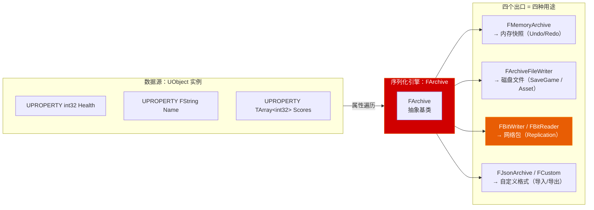
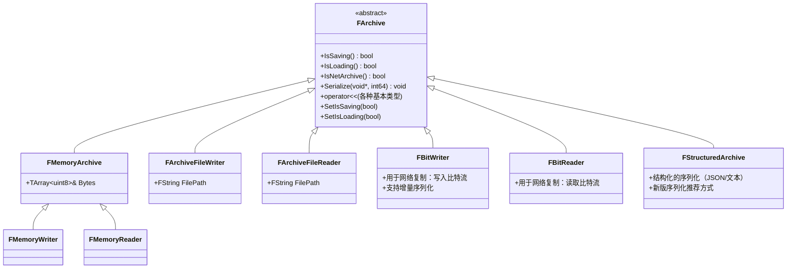
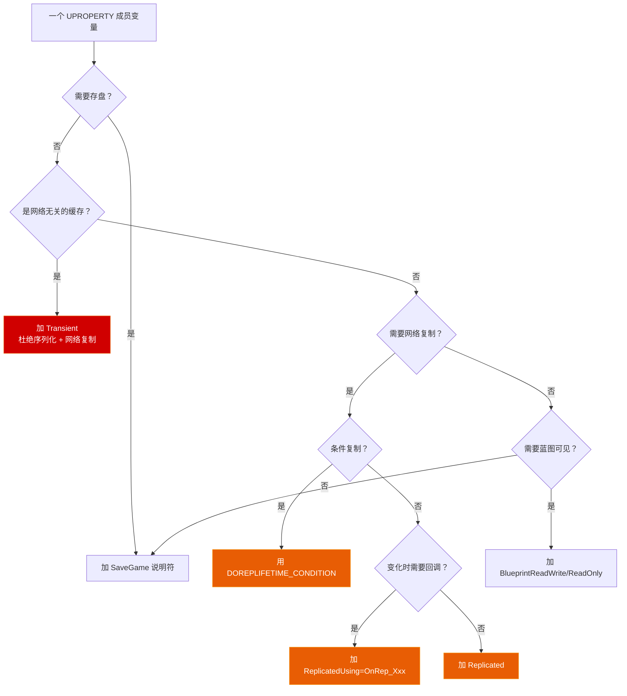
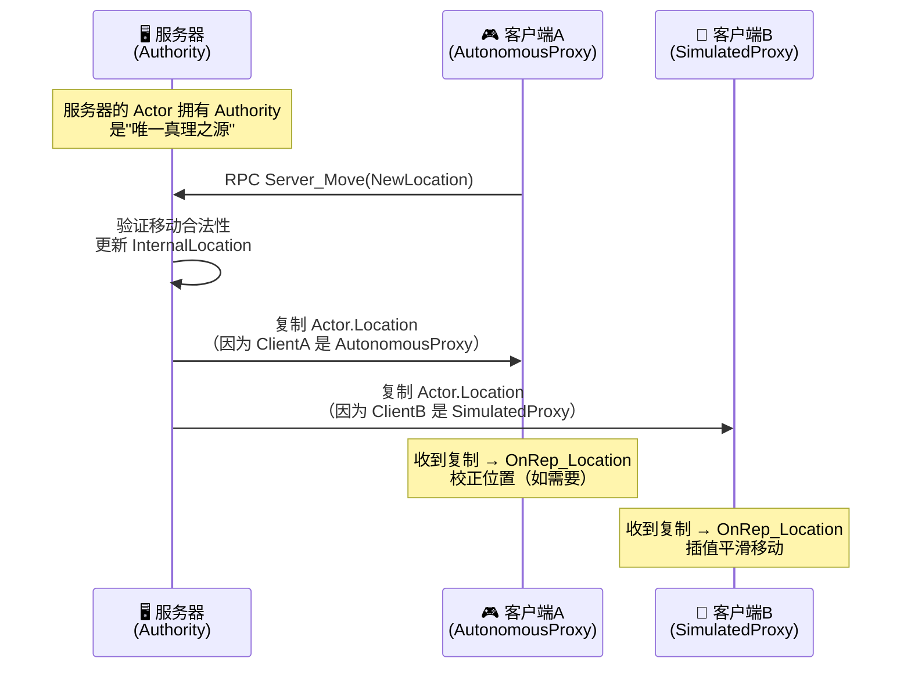
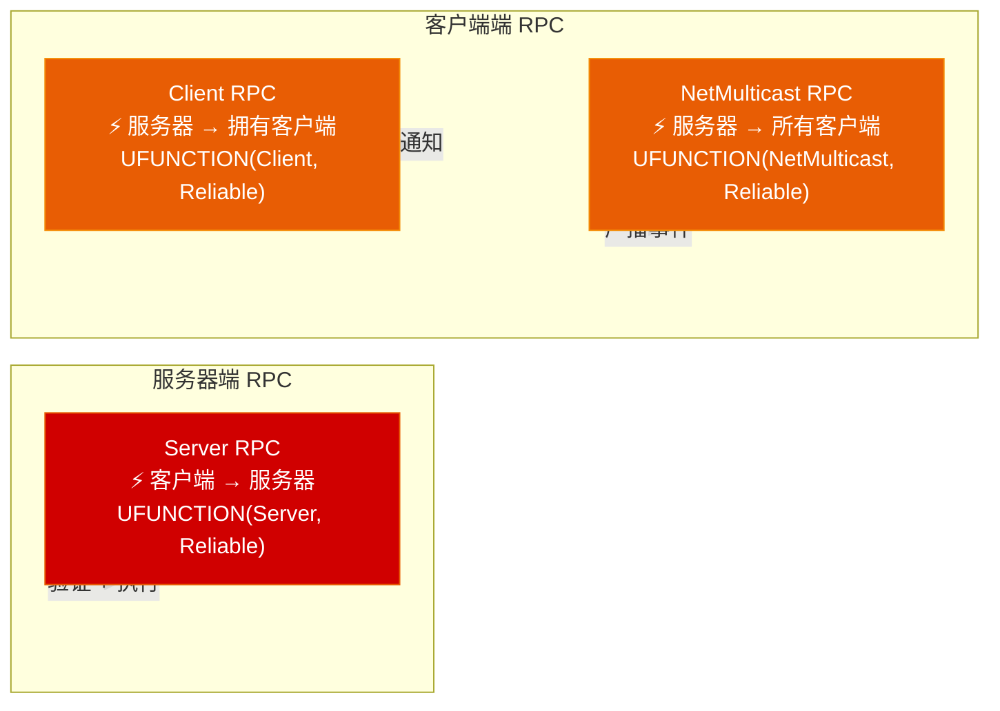

# 第十二章 序列化与网络复制：从 FArchive 到多人同步体系

> **一句话理解**：UE 的序列化和网络复制本质上是**同一枚硬币的两面**——它们共用 `FArchive` 作为底层序列化引擎。序列化是"把内存中的 UObject 变成字节流"，网络复制是"把字节流从服务器搬到客户端然后再变回 UObject"。理解 `FArchive` 是如何遍历 UObject 的属性树，就同时理解了 SaveGame 为什么能存、网络为什么能同步。这一章从底层 FArchive 写到上层 RPC，最后落到多人游戏的实战架构——**面试中网络相关的所有问题，答案都在这里**。

---

## 12.1 概念直觉 —— 序列化与网络复制的统一模型

### 12.1.1 同一引擎，两个出口



```cpp
// ===== 序列化与网络复制的本质关系 =====
//
// 序列化（Serialization）：
//   UObject → FArchive → 字节流 → 磁盘 / 内存 / 网络包
//   核心问题："怎么把 C++ 对象的数据保存下来，再完整还原？"
//
// 网络复制（Replication）：
//   服务器 UObject → FBitWriter → 网络包 → 客户端 FBitReader → 客户端 UObject
//   核心问题："怎么让客户端看到服务器上的最新状态？"
//
// 两个问题的底层 100% 复用 FArchive 体系。
// 区别仅在于：
//   - 序列化：一次性全量写入/读出（SaveGame 存盘）
//   - 网络复制：增量、有选择地写入（只同步变化了的属性）
//
// 面试金句：
// "UE 网络复制的本质是 FArchive 对 UPROPERTY 的增量序列化 + UDP 传输。"
```

### 12.1.2 一个最简单的序列化示例

```cpp
// ===== 最简序列化：把 UObject 的属性写入内存 =====
void BasicSerializeExample()
{
    // 创建一个对象
    UMyObject* MyObj = NewObject<UMyObject>();
    MyObj->Health = 100;
    MyObj->Name = TEXT("Hero");

    // ---- 序列化到内存 ----
    TArray<uint8> RawBytes;
    {
        // FMemoryWriter 是 FArchive 的子类
        FMemoryWriter Writer(RawBytes);
        MyObj->Serialize(Writer);  // ← 核心：UObject::Serialize(FArchive&)
    }  // Writer 析构时 flush 到 RawBytes
    // RawBytes 现在包含了 Health 和 Name 的二进制表示

    // ---- 从内存反序列化 ----
    UMyObject* NewObj = NewObject<UMyObject>();
    {
        FMemoryReader Reader(RawBytes);
        NewObj->Serialize(Reader);
    }  // NewObj->Health == 100, NewObj->Name == TEXT("Hero")
}
```

---

## 12.2 FArchive 序列化体系 —— 一切的引擎

### 12.2.1 FArchive 的类型谱系



```cpp
// ===== FArchive 核心 API 速查 =====

// 1. 基本类型序列化（已内建 operator<<）
FArchive& operator<<(FArchive& Ar, uint8& Value);
FArchive& operator<<(FArchive& Ar, int32& Value);
FArchive& operator<<(FArchive& Ar, float& Value);
FArchive& operator<<(FArchive& Ar, FString& Value);
FArchive& operator<<(FArchive& Ar, FName& Value);
FArchive& operator<<(FArchive& Ar, FText& Value);
FArchive& operator<<(FArchive& Ar, FVector& Value);
FArchive& operator<<(FArchive& Ar, FRotator& Value);

// 2. 判断归档方向
void SerializeExample(FArchive& Ar)
{
    if (Ar.IsSaving())    // 正在保存（写入）
    {
        // 写入数据
    }
    else if (Ar.IsLoading()) // 正在加载（读取）
    {
        // 读取数据
    }
}

// 3. 判断是否为网络归档
if (Ar.IsNetArchive())
{
    // 这是网络复制的序列化，不是存盘！
}

// 4. 自定义版本的序列化 —— 处理版本兼容
// Ar.UEVer() / Ar.CustomVer(GUID) —— 见 12.2.3
```

### 12.2.2 operator<< 与 Serialize() 的双轨制

```cpp
// ===== 双重序列化接口：operator<< vs Serialize() =====
//
// UE 有两个序列化入口，但它们最终走到同一个地方：
//
// 1. friend FArchive& operator<<(FArchive& Ar, UObject*& Obj)
//    → 引擎自动生成的代码，遍历所有 UPROPERTY
//    → 你通常不需要重写这个
//
// 2. virtual void Serialize(FArchive& Ar)
//    → 你可以重写的虚函数，添加自定义序列化逻辑
//    → 必须调用 Super::Serialize(Ar)

UCLASS()
class UMyDataObject : public UObject
{
    GENERATED_BODY()

public:
    // ---- 标准 UPROPERTY —— 自动序列化 ----
    UPROPERTY()
    int32 Health;

    UPROPERTY()
    FString Name;

    // ---- 非 UPROPERTY —— 需要手动序列化 ----
    int32 CachedHash;          // 未被 UPROPERTY 标记，不会自动序列化
    TMap<int32, float> CacheMap; // 同上

    virtual void Serialize(FArchive& Ar) override
    {
        Super::Serialize(Ar);  // ← 必须先调用 Super！这会序列化所有 UPROPERTY

        // ---- 手动序列化非 UPROPERTY 成员 ----
        Ar << CachedHash;       // operator<<(FArchive&, int32&)

        // 容器的序列化
        if (Ar.IsSaving())
        {
            int32 Num = CacheMap.Num();
            Ar << Num;
            for (auto& Pair : CacheMap)
            {
                Ar << const_cast<int32&>(Pair.Key);
                Ar << Pair.Value;
            }
        }
        else if (Ar.IsLoading())
        {
            CacheMap.Empty();
            int32 Num = 0;
            Ar << Num;
            for (int32 i = 0; i < Num; ++i)
            {
                int32 Key;
                float Value;
                Ar << Key;
                Ar << Value;
                CacheMap.Add(Key, Value);
            }
        }
    }
};

// ===== 最常见错误：忘记调用 Super::Serialize(Ar) =====
// 症状：所有 UPROPERTY 都不会被序列化——存盘后加载全是默认值！
// 原因：UPROPERTY 的序列化是在 Super::Serialize 中由引擎自动完成的
// 修复：永远在第一行写 Super::Serialize(Ar)
```

### 12.2.3 版本兼容：UEVer 与 CustomVersion

```cpp
// ===== 版本管理系统 —— 处理游戏更新后的旧存档 =====

// 场景：你的游戏 v1.0 存了 Health，v2.0 想加一个 MaxHealth
// 问题：旧存档没有 MaxHealth 数据 → 加载旧档不能崩溃

// 方案 1：用引擎版本号
virtual void Serialize(FArchive& Ar) override
{
    Super::Serialize(Ar);

    // 只在引擎版本 >= VER_UE4_SOMETHING 时才序列化
    if (Ar.UEVer() >= VER_UE4_SOME_ENGINE_VERSION)
    {
        Ar << MaxHealth;
    }
    else
    {
        MaxHealth = 100;  // 旧存档的默认值
    }
}

// 方案 2：自定义版本 GUID（推荐——更精确）
// 步骤 1：在项目的 Version.h 中定义一个 GUID
// const FGuid GAME_SAVE_VERSION_MAXHEALTH(0x12345678, 0x9ABC, ...);

// 步骤 2：在 Serialize 中使用
virtual void Serialize(FArchive& Ar) override
{
    Super::Serialize(Ar);

    Ar.UsingCustomVersion(GAME_SAVE_VERSION_MAXHEALTH);

    if (Ar.CustomVer(GAME_SAVE_VERSION_MAXHEALTH) >= 1)
    {
        Ar << MaxHealth;
    }
    else
    {
        MaxHealth = 100;
    }
}

// 步骤 3：保存时设置版本号
// FArchiveFileWriter::SetCustomVersion(GUID, Version, FriendlyName);

// ===== 实际项目中更推荐的做法 =====
// 不要在 Serialize 里堆积版本判断——用 PostSerialize / PostLoad 修正数据：

virtual void PostLoad() override
{
    Super::PostLoad();

    // PostLoad 在所有属性加载完成后被调用
    // 在这里做"旧数据→新数据"的迁移
    if (MaxHealth == 0)  // 旧存档没有这个值
    {
        MaxHealth = 100;
    }
}
```

### 12.2.4 序列化 vs 序列化：FStructuredArchive（新版）

```cpp
// ===== FStructuredArchive —— UE4.25+ 推荐的结构化序列化 =====
//
// FArchive 是扁平的二进制流（"第3个字节是Health"），
// FStructuredArchive 是结构化的键值对（"Health: 100"）。
//
// 优势：更适合 JSON/文本格式，可读性更强，支持版本迁移

void Serialize(FStructuredArchive::FRecord Record)
{
    Super::Serialize(Record);

    // 老风格（FArchive）：
    // Ar << Health;

    // 新风格（FStructuredArchive）：
    FStructuredArchive::FSlot HealthSlot = Record.EnterField(SA_FIELD_NAME(TEXT("Health")));
    HealthSlot << Health;  // 带名字的字段！

    // 支持嵌套结构
    {
        FStructuredArchive::FRecord SubRecord = Record.EnterRecord(TEXT("SubData"));
        SubRecord.EnterField(TEXT("MaxHealth")) << MaxHealth;
    }
}

// 面试信息：大多数 UE5 项目仍使用传统 FArchive::Serialize。
// FStructuredArchive 主要用于引擎内部的 Asset Registry 和 JSON 导出。
```

---

## 12.3 UPROPERTY 序列化控制 —— 谁该被序列化？

### 12.3.1 序列化/复制说明符决策树



```cpp
// ===== UPROPERTY 序列化控制三大说明符 =====

// ① Transient —— "这个属性永远不要被序列化，也不要网络复制"
UPROPERTY(Transient)
int32 CachedDerivedValue;  // 运行时计算出的值，存盘没意义
// 适用：缓存、计时器、运行时的中间结果、指向其他 UObject 的临时引用

// ② SaveGame —— "允许这个属性出现在 SaveGame 对象中"
UPROPERTY(SaveGame)
int32 PlayerScore;  // 需要被存进存档
// 注意：不加 SaveGame 的 UPROPERTY 在 SaveGame 对象中会被跳过！

// ③ 手动跳过序列化 —— "需要反射但不希望被引擎自动序列化写入"
//    没有单独的"SkipSerialization"说明符——那个东西不存在！
//    ✓ 标准做法：重写 Serialize(FArchive& Ar)，Super::Serialize 之后
//       手动处理——直接在 Ar 流中跳过该字段的写入/读取
//    另一种场景：编辑器专用数据 → 用 #if WITH_EDITORONLY_DATA 包裹
#if WITH_EDITORONLY_DATA
UPROPERTY()
int32 EditorOnlyValue;  // 只在编辑器构建中存在，烘焙后彻底消失
#endif

// ===== 标准组合模式 =====
UPROPERTY()                         int32 DefaultValue;  // 普通属性，会序列化
UPROPERTY(Transient)                int32 NonSerialized; // 完全不序列化
UPROPERTY(SaveGame)                 int32 SaveData;      // 存盘属性
UPROPERTY(Transient, SaveGame)      int32 SaveOnly;      // 不普通序列化但存档
UPROPERTY(Replicated)               int32 Health;        // 网络复制
UPROPERTY(ReplicatedUsing=OnRep_Health) int32 HealthWithCallback; // 复制+回调
```

### 12.3.2 序列化深度对比表

```cpp
// ===== 不同 UPROPERTY 修饰对序列化的影响 =====
//
// ┌─────────────────┬──────────┬──────────┬──────────┬──────────┐
// │ 说明符           │ 磁盘序列化│ 网络复制  │ SaveGame │ CDO 差异 │
// ├─────────────────┼──────────┼──────────┼──────────┼──────────┤
// │ (无)             │    ✓     │    ✗     │    ✗     │    ✓     │
// │ Transient        │    ✗     │    ✗     │    ✗     │    ✗     │
// │ SaveGame         │    ✓     │    ✗     │    ✓     │    ✗     │
// │ Replicated       │    ✓     │    ✓     │    ✗     │    ✓     │
// │ 手动跳过(Serialize中)│ 取决于实现 │    ✗     │    ✗     │    ✗     │
// │ Replicated+SaveGame│  ✓     │    ✓     │    ✓     │    ✓     │
// └─────────────────┴──────────┴──────────┴──────────┴──────────┘
//
// "CDO 差异" = 此属性是否参与 CDO（Class Default Object）的 delta 序列化
// 网络复制的基础机制：只发送"当前值与 CDO 值不同"的属性
```

---

## 12.4 SaveGame 实战 —— 存档系统从零到一

### 12.4.1 核心类型：USaveGame

```cpp
// ===== 存档对象的最小定义 =====
UCLASS()
class USaveGameData : public USaveGame
{
    GENERATED_BODY()

public:
    UPROPERTY(SaveGame)                    // ← 每个存盘字段必须加 SaveGame！
    FString PlayerName;

    UPROPERTY(SaveGame)
    int32 PlayerLevel;

    UPROPERTY(SaveGame)
    float Health;

    UPROPERTY(SaveGame)
    FVector LastCheckpointLocation;

    UPROPERTY(SaveGame)
    TArray<FString> CompletedQuests;

    UPROPERTY(SaveGame)
    TMap<FString, int32> Inventory;        // 物品ID → 数量
};
```

### 12.4.2 异步存档 API —— 永远用异步！

```cpp
// ===== 完整的存档管理器 =====
UCLASS()
class UMySaveManager : public UGameInstanceSubsystem
{
    GENERATED_BODY()

public:
    // ---------- 存档 ----------
    void SaveGame(const FString& SlotName, int32 UserIndex = 0)
    {
        // 1. 创建 SaveGame 对象
        USaveGameData* SaveData = Cast<USaveGameData>(
            UGameplayStatics::CreateSaveGameObject(USaveGameData::StaticClass()));

        // 2. 填充数据
        SaveData->PlayerName = CurrentPlayerName;
        SaveData->PlayerLevel = CurrentLevel;
        SaveData->LastCheckpointLocation = LastCheckpoint;
        SaveData->CompletedQuests = CompletedQuestIDs;
        SaveData->Inventory = CurrentInventory;

        // 3. 异步写入磁盘 —— 永远别用同步 SaveGame！
        FAsyncSaveGameToSlotDelegate SaveDelegate;
        SaveDelegate.BindUObject(this, &UMySaveManager::OnSaveComplete);

        UGameplayStatics::AsyncSaveGameToSlot(
            SaveData,           // SaveGame 对象
            SlotName,           // 存档槽名称
            UserIndex,          // 用户索引（本地多人）
            SaveDelegate        // 完成回调
        );
    }

    UFUNCTION()
    void OnSaveComplete(const FString& SlotName, const int32 UserIndex,
                        bool bSuccess)
    {
        if (bSuccess)
        {
            UE_LOG(LogSave, Log, TEXT("存档成功: %s"), *SlotName);
        }
        else
        {
            UE_LOG(LogSave, Error, TEXT("存档失败: %s"), *SlotName);
            // 常见失败原因：
            // - 磁盘空间不足
            // - 权限不足（主机平台）
            // - 存档数据过大
            // - 平台存储服务不可用（Xbox/PSN 云端）
        }
    }

    // ---------- 读档 ----------
    void LoadGame(const FString& SlotName, int32 UserIndex = 0)
    {
        FAsyncLoadGameFromSlotDelegate LoadDelegate;
        LoadDelegate.BindUObject(this, &UMySaveManager::OnLoadComplete);

        UGameplayStatics::AsyncLoadGameFromSlot(
            SlotName,
            UserIndex,
            LoadDelegate
        );
    }

    UFUNCTION()
    void OnLoadComplete(const FString& SlotName, const int32 UserIndex,
                        USaveGame* LoadedData)
    {
        USaveGameData* SaveData = Cast<USaveGameData>(LoadedData);
        if (!SaveData)
        {
            UE_LOG(LogSave, Warning, TEXT("没有找到存档或无数据: %s"), *SlotName);
            return;
        }

        // 恢复数据
        CurrentPlayerName = SaveData->PlayerName;
        CurrentLevel = SaveData->PlayerLevel;
        LastCheckpoint = SaveData->LastCheckpointLocation;
        CompletedQuestIDs = SaveData->CompletedQuests;
        CurrentInventory = SaveData->Inventory;

        // 触发游戏世界的数据恢复
        OnGameLoadedDelegate.Broadcast();
    }

    // ---------- 检查存档是否存在 ----------
    bool DoesSaveExist(const FString& SlotName, int32 UserIndex = 0) const
    {
        return UGameplayStatics::DoesSaveGameExist(SlotName, UserIndex);
    }

    // ---------- 删除存档 ----------
    bool DeleteSave(const FString& SlotName, int32 UserIndex = 0)
    {
        return UGameplayStatics::DeleteGameInSlot(SlotName, UserIndex);
    }

    // ---------- 获取所有存档槽 ----------
    void GetAllSaveSlots(TArray<FString>& OutSlots)
    {
        // 获取存档目录中的 .sav 文件列表
        const FString SaveDir = FPaths::ProjectSavedDir() / TEXT("SaveGames");
        IFileManager::Get().FindFiles(OutSlots, *(SaveDir / TEXT("*.sav")), true, false);
    }

    // 事件：通知游戏世界恢复数据
    DECLARE_MULTICAST_DELEGATE(FOnGameLoaded);
    FOnGameLoaded OnGameLoadedDelegate;

private:
    FString CurrentPlayerName;
    int32 CurrentLevel = 1;
    FVector LastCheckpoint;
    TArray<FString> CompletedQuestIDs;
    TMap<FString, int32> CurrentInventory;
};
```

### 12.4.3 SaveGame 的结构化实践

```cpp
// ===== 推荐：拆分存档为多个 USaveGame 对象 =====
//
// 不要把整个游戏状态塞进一个 USaveGame！
// 好的实践是按功能域拆分：

UCLASS()
class USaveGame_Progress : public USaveGame
{
    GENERATED_BODY()
public:
    UPROPERTY(SaveGame) FString CurrentLevelName;
    UPROPERTY(SaveGame) TArray<FString> CompletedLevels;
    UPROPERTY(SaveGame) FVector CheckpointLocation;
};

UCLASS()
class USaveGame_Inventory : public USaveGame
{
    GENERATED_BODY()
public:
    UPROPERTY(SaveGame) TMap<FName, int32> Items;       // 物品ID → 数量
    UPROPERTY(SaveGame) TArray<FName> EquippedWeapons;  // 装备中的武器
    UPROPERTY(SaveGame) int32 Gold;
};

UCLASS()
class USaveGame_Settings : public USaveGame
{
    GENERATED_BODY()
public:
    UPROPERTY(SaveGame) float MasterVolume;
    UPROPERTY(SaveGame) float MouseSensitivity;
    UPROPERTY(SaveGame) bool bInvertYAxis;
    UPROPERTY(SaveGame) FString LanguagePreference;
};

// 存档时分别调用：
// AsyncSaveGameToSlot(ProgressData, SlotName + "_Progress");
// AsyncSaveGameToSlot(InventoryData, SlotName + "_Inventory");
// AsyncSaveGameToSlot(SettingsData, SlotName + "_Settings");

// 优势：
// 1. 单个文件小，读写快
// 2. 一个文件损坏不影响其他数据
// 3. 设置可以跨存档共享
// 4. 方便做"云存档"的增量上传（只上传变了的部分）
```

### 12.4.4 SaveGame 常见陷阱

```cpp
// ===== SaveGame 常见错误 TOP 5 =====

// 陷阱 #1：忘记给属性加 SaveGame 说明符
UCLASS()
class UBadSaveData : public USaveGame
{
public:
    UPROPERTY()          // ✗ 没有 SaveGame！加载后这个值永远是 0！
    int32 PlayerScore;   //    引擎日志不会报错，数据悄悄丢了
};
// ✓ 修复：
UPROPERTY(SaveGame)
int32 PlayerScore;

// 陷阱 #2：存了 UObject 指针
UCLASS()
class UBadSaveData : public USaveGame
{
public:
    UPROPERTY(SaveGame)
    TObjectPtr<AActor> ReferencedActor;  // ✗ 绝对不要这么做！
    // 存盘时只存了这个指针的内存地址（一个数字），
    // 加载后这个地址指向的 Actor 早就不存在了！
    //
    // ✓ 正确做法：存 Actor 的 FName / FGuid / FString 标识符，
    //    加载后通过标识符查找对应的 Actor
    UPROPERTY(SaveGame)
    FName ReferencedActorTag;  // 存 Actor 的标签
};

// 陷阱 #3：同步 SaveGame（卡主线程）
void BadSaveFunction()
{
    // ✗ 同步 SaveGame 可能在写入大文件时阻塞主线程数百毫秒！
    UGameplayStatics::SaveGameToSlot(SaveData, SlotName, 0);
    // 玩家会感觉"卡了一下"——体验极差
}
// ✓ 永远用 AsyncSaveGameToSlot

// 陷阱 #4：跨版本加载时崩溃
// 场景：v1.0 存了 TArray<int32> Scores，v2.0 改成了 TArray<float> Scores
// 结果：加载旧存档时 FArchive 反序列化崩溃！
//
// ✓ 解决方案：
//   a) 保持旧字段，新增新字段（数据迁移在 PostLoad 中做）
//   b) 用 CustomVersion 分支逻辑——序列化前先检查归档版本，走不同分支
//   c) 在 Serialize 中反序列化前，用 Ar.TotalSize() 和 Ar.Tell() 做边界校验：
//      if (Ar.Tell() + ExpectedSize <= Ar.TotalSize()) { /* 安全读取 */ }
//
// ⚠️ 绝对不要写 try-catch 来兜反序列化崩溃！
//    ① UE 默认编译禁用了 C++ 异常（/EHsc-），try/catch 关键字直接编译报错
//    ② 即使强行开启异常，反序列化越界是内存访问违例（SEH/Signal），
//       标准 C++ try-catch 根本捕获不到——游戏照样闪退

// 陷阱 #5：在 USaveGame 中存了大量 TSubclassOf
// ✗ TSubclassOf 存的是类引用路径（FSoftObjectPath），
//    如果类被重命名或删除了，加载就会失败。
// ✓ 尽量存枚举或基本类型标识符，而不是类引用。
```

---

## 12.5 网络复制基础 —— 从零理解多人同步

### 12.5.1 客户端-服务器模型（Client-Server Model）



```cpp
// ===== 网络基础概念速查 =====
//
// 服务器（Server）：
//   - 唯一拥有 Authority 的实例
//   - 所有游戏逻辑的最终裁决者
//   - 负责将状态"复制"给所有客户端
//
// 客户端（Client）：
//   - 没有 Authority——只是"镜像"
//   - 可以发起 RPC 请求服务器（如"我要移动"）
//   - 接收服务器的复制数据进行渲染
//
// 关键概念——"服务器是真理之源"（Server is the Source of Truth）：
//   - 伤害计算在服务器
//   - 碰撞检测在服务器
//   - 血量变化在服务器
//   - 客户端永远不应该直接修改"权威数据"
//     客户端只能说："我想开枪"，然后服务器决定是否命中、伤害多少
```

### 12.5.2 让一个 Actor 支持网络复制

```cpp
// ===== 最小可复制的 Actor =====
UCLASS()
class AMyNetworkActor : public AActor
{
    GENERATED_BODY()

public:
    AMyNetworkActor()
    {
        // ---- 步骤 1：启用网络复制 ----
        bReplicates = true;              // Actor 本身参与网络复制
        // bReplicates = false → 这个 Actor 只存在于本地，别人看不到它

        // ---- 步骤 2（可选）：设置网络更新频率 ----
        NetUpdateFrequency = 10.0f;      // 每秒最多复制 10 次
        // 默认值依 Actor 类型不同（一般为 1~100 Hz）

        // ---- 步骤 3（可选）：设置网络优先级 ----
        NetPriority = 1.0f;              // 相对优先级（越大越优先同步）
        // 多个 Actor 需要同步时，带宽优先分给高优先级的
    }

    // ---- 步骤 4：标记需要复制的属性 ----
    UPROPERTY(Replicated)
    float Health;                        // 这个属性会从服务器同步到客户端

    UPROPERTY(ReplicatedUsing = OnRep_PlayerName)
    FString PlayerName;                  // 变化时调用 OnRep_PlayerName

    // ---- 步骤 5：注册复制属性 ----
    virtual void GetLifetimeReplicatedProps(
        TArray<FLifetimeProperty>& OutLifetimeProps) const override
    {
        Super::GetLifetimeReplicatedProps(OutLifetimeProps);

        // 基础复制——任何时候都会同步
        DOREPLIFETIME(AMyNetworkActor, Health);

        // 条件复制——只在特定条件下同步（见 12.8）
        DOREPLIFETIME_CONDITION(AMyNetworkActor, PlayerName,
            COND_InitialOnly);           // 只在 Actor 首次创建时同步一次
    }

    // ---- 步骤 6：复制回调 ----
    UFUNCTION()
    void OnRep_PlayerName()
    {
        // 当 PlayerName 在客户端上被更新时自动调用
        UE_LOG(LogNet, Log, TEXT("客户端收到新的 PlayerName: %s"), *PlayerName);

        // 典型的回调内容：更新 UI、播放音效、更新材质
        OnPlayerNameChangedEvent(PlayerName);
    }
};

// ===== 必不可少的宏 =====
// DOREPLIFETIME(ClassName, PropertyName)
//   → 无条件复制。属性每次变化都会同步给所有相关客户端。
//
// DOREPLIFETIME_CONDITION(ClassName, PropertyName, Condition)
//   → 条件复制。只在满足条件时才同步（见 12.8 详解）。
//
// DOREPLIFETIME_ACTIVE_OVERRIDE(ClassName, PropertyName, bActive)
//   → 动态开关：可以在运行时决定是否复制这个属性。
//
// DOREPLIFETIME_CONDITION_NOTIFY(ClassName, PropertyName, Cond, RepNotifyMode)
//   → 条件复制 + 自定义 RepNotify 时机（总是 / 仅在值变化时 / 从不）
```

### 12.5.3 Replicated vs ReplicatedUsing —— 什么时候用哪个？

```cpp
// ===== 决策矩阵 =====

// 场景 A：纯数值属性，不需要任何回调
UPROPERTY(Replicated)
float Health;  // 客户端不需要知道"Health 变了"——只需要当前值正确
// → 用 Replicated 就够了

// 场景 B：属性变化需要触发逻辑
UPROPERTY(ReplicatedUsing = OnRep_Health)
float Health;
UFUNCTION() void OnRep_Health();  // 客户端收到新值后：
// - 更新血条 UI
// - 播放受伤动画
// - 低于 25% 时屏幕闪红
// → 用 ReplicatedUsing

// 场景 C：结构体或数组
UPROPERTY(ReplicatedUsing = OnRep_Inventory)
TArray<FInventoryItem> Inventory;
UFUNCTION() void OnRep_Inventory();  // 客户端收到完整数组后：
// - 重建背包 UI
// - 更新快捷栏
// → 用 ReplicatedUsing（TArray 的变化检测比较整个数组）

// 场景 D：初始化时设置的、之后不会变的值
UPROPERTY(Replicated)
FString PlayerName;  // 但配合 DOREPLIFETIME_CONDITION(..., COND_InitialOnly)
// → 只在 Actor 首次生成时同步一次，之后不再消耗带宽
```

---

## 12.6 RPC 体系 —— 远程过程调用的三兄弟

### 12.6.1 RPC 类型与调用方向



```cpp
// ===== RPC 三兄弟完整示例 =====
UCLASS()
class AMyNetworkCharacter : public ACharacter
{
    GENERATED_BODY()

public:
    // ============================
    // ① Server RPC —— 客户端请求，服务器执行
    // ============================
    // 调用方：客户端（必须有网络拥有权）
    // 执行方：服务器
    // 用途：客户端发起动作（射击、交互、移动）
    //
    UFUNCTION(Server, Reliable, WithValidation)
    void Server_Shoot(FVector AimLocation);

    // 在客户端调用：
    void OnPlayerPressFire()
    {
        if (IsLocallyControlled())
        {
            FVector AimLoc = GetAimLocation();
            Server_Shoot(AimLoc);  // ← 客户端调用，但实际上在服务器执行！
        }
    }

    // 服务器上的实现：
    void AMyNetworkCharacter::Server_Shoot_Implementation(FVector AimLocation)
    {
        // 这里运行在服务器上——可以安全地修改权威数据
        SpawnProjectile(AimLocation);
        Ammo--;
        Health -= RecoilDamage;
    }

    // 验证函数——在服务器执行 RPC 之前被调用，防止作弊
    bool AMyNetworkCharacter::Server_Shoot_Validate(FVector AimLocation)
    {
        // 检查参数是否合理——客户端发来个 AimLocation=(999999, 999999, 999999)？
        if (AimLocation.Size() > 100000.0f) return false;  // 拒绝！明显是作弊
        if (Ammo <= 0) return false;                       // 拒绝！没子弹了
        return true;  // 通过验证，可以执行 _Implementation
    }

    // ============================
    // ② Client RPC —— 服务器通知特定客户端
    // ============================
    // 调用方：服务器
    // 执行方：拥有此 Actor 的客户端
    // 用途：通知单个玩家（显示消息、播放个人音效）
    //
    UFUNCTION(Client, Reliable)
    void Client_ShowDamage(float Damage, FVector DamageOrigin);

    // 服务器调用（通常在 GameMode 或 PlayerController 中）：
    void OnPlayerDealtDamage(APlayerController* VictimPC, float Damage,
                             FVector Origin)
    {
        if (AMyNetworkCharacter* Victim = Cast<AMyNetworkCharacter>(VictimPC->GetPawn()))
        {
            Victim->Client_ShowDamage(Damage, Origin);
        }
    }

    // 客户端上的实现：
    void AMyNetworkCharacter::Client_ShowDamage_Implementation(
        float Damage, FVector DamageOrigin)
    {
        // 这里运行在受害者自己的客户端上
        // 可以安全地播放 UI、音效、震屏——纯表现层逻辑
        ShowDamageNumber(Damage);
        PlayHitSound();
        ShowDamageDirection(DamageOrigin);

        // 触发手柄振动
        if (APlayerController* PC = Cast<APlayerController>(GetController()))
        {
            PC->PlayHapticEffect(DamageHapticEffect, EControllerHand::RightHand);
        }
    }

    // ============================
    // ③ NetMulticast RPC —— 服务器广播给所有客户端
    // ============================
    // 调用方：服务器
    // 执行方：所有客户端（包括服务器自己）
    // 用途：广播所有人可见的事件（爆炸、开门、Boss 技能）
    //
    UFUNCTION(NetMulticast, Unreliable)
    void Multicast_PlayExplosion(FVector Location, float Radius);

    // 服务器调用（谁触发了爆炸）：
    void TriggerExplosion(FVector Location, float Radius)
    {
        // 伤害逻辑在服务器：
        ApplyExplosionDamage(Location, Radius);

        // 表现效果广播给所有人：
        Multicast_PlayExplosion(Location, Radius);
    }

    // 所有客户端上的实现：
    void AMyNetworkCharacter::Multicast_PlayExplosion_Implementation(
        FVector Location, float Radius)
    {
        // 这里运行在每一个客户端上——包括服务器
        UGameplayStatics::SpawnEmitterAtLocation(GetWorld(), ExplosionVFX, Location);
        UGameplayStatics::PlaySoundAtLocation(GetWorld(), ExplosionSFX, Location);

        // 震屏——只在本地玩家附近才震
        if (APlayerController* PC = UGameplayStatics::GetPlayerController(GetWorld(), 0))
        {
            if (APawn* LocalPawn = PC->GetPawn())
            {
                float Dist = FVector::Dist(LocalPawn->GetActorLocation(), Location);
                if (Dist < Radius)
                {
                    PC->ClientStartCameraShake(ExplosionShake,
                        FMath::GetMappedRangeValueClamped(
                            FVector2D(0, Radius), FVector2D(1.0f, 0.0f), Dist));
                }
            }
        }
    }
};
```

### 12.6.2 Reliable vs Unreliable —— 可靠性选择

```cpp
// ===== Reliable（可靠）vs Unreliable（不可靠）的决策指南 =====
//
// Reliable RPC：
//   - 保证到达：底层 TCP 式重传机制确保对方一定收到
//   - 保证顺序：按发送顺序到达
//   - 代价：延迟、带宽开销、队头阻塞
//   - 适用：关键事件（伤害、死亡、任务完成、物品拾取）
//
// Unreliable RPC：
//   - 不保证到达：网络丢包就直接丢弃
//   - 不保证顺序
//   - 优势：零额外延迟、极低带宽开销
//   - 适用：高频更新的表现效果（脚步声、枪口火焰、表情动画）

// ---- 实战决策树 ----
// Server RPC：Reliable —— 漏掉一个"我开枪了"是不可接受的
UFUNCTION(Server, Reliable, WithValidation)
void Server_Fire();

// Client RPC（关键事件）：Reliable —— 伤害信息必须送达
UFUNCTION(Client, Reliable)
void Client_OnKilled(AActor* Killer);

// Client RPC（高频 UI）：Reliable —— 但要注意频率
UFUNCTION(Client, Reliable)
void Client_UpdateScore(int32 NewScore);  // 每秒最多几次——还可以

// NetMulticast（表现效果）：Unreliable —— 漏一个脚步声无所谓
UFUNCTION(NetMulticast, Unreliable)
void Multicast_PlayFootstep(FVector Location);

// NetMulticast（游戏事件）：Reliable —— 门开了必须所有人都看到
UFUNCTION(NetMulticast, Reliable)
void Multicast_OnDoorOpened();

// ===== 性能经验法则 =====
// 1. 高频 RPC（>10 次/秒）→ Unreliable
// 2. 一次性关键事件 → Reliable
// 3. Server RPC 几乎总是 Reliable
// 4. NetMulticast 效果类 → Unreliable
// 5. NetMulticast 状态类 → Reliable（或者改用属性复制）
```

### 12.6.3 WithValidation —— Server RPC 的安全防线

```cpp
// ===== Server RPC 的验证机制 —— 防作弊的第一道防线 =====

UFUNCTION(Server, Reliable, WithValidation)
void Server_UseItem(int32 ItemSlot, FVector TargetLocation);

// _Validate 函数 —— 在服务器收到 RPC 后、_Implementation 之前被调用
bool AMyPlayerController::Server_UseItem_Validate(int32 ItemSlot,
                                                    FVector TargetLocation)
{
    // 检查 1：参数范围
    if (ItemSlot < 0 || ItemSlot >= MaxInventorySlots)
    {
        UE_LOG(LogNet, Warning, TEXT("作弊嫌疑：无效的物品槽位 %d"), ItemSlot);
        return false;  // ← 返回 false → _Implementation 不会被调用！
    }

    // 检查 2：业务逻辑合理性
    if (!HasItemInSlot(ItemSlot))
    {
        UE_LOG(LogNet, Warning, TEXT("作弊嫌疑：空槽位使用 %d"), ItemSlot);
        return false;
    }

    // 检查 3：数值合理性
    if (TargetLocation.ContainsNaN() ||
        TargetLocation.GetAbsMax() > WorldBoundsMax)
    {
        return false;  // 明显的数据篡改
    }

    // 检查 4：冷却时间
    float TimeSinceLastUse = GetWorld()->GetTimeSeconds() - LastItemUseTime;
    if (TimeSinceLastUse < MinItemUseInterval)
    {
        return false;  // 使用速度太快——可能是加速外挂
    }

    return true;  // 通过！执行 _Implementation
}

// ⚠️ 关键：UHT 生成的函数名是两个独立的虚函数，绝不存在 _Validate_Implementation 这种合并后缀！
//   - bool Server_UseItem_Validate(...)      → 参数验证（返回 false 则 _Implementation 不执行）
//   - void Server_UseItem_Implementation(...) → 核心逻辑
// 如果你漏写了 _Validate 函数，UHT 自动生成一个默认返回 true 的桩——
// 等于没有任何验证！所有 Server RPC 请务必显式实现 _Validate

void AMyPlayerController::Server_UseItem_Implementation(int32 ItemSlot,
                                                          FVector TargetLocation)
{
    // 验证通过后才走到这里——执行核心逻辑
    UseItemInternal(ItemSlot, TargetLocation);
}

// ===== WithValidation 的最佳实践 =====
// 1. 每个 Server RPC 都加 WithValidation
// 2. _Validate 里只做参数检查——不做游戏逻辑
// 3. 返回 false 时日志记录（方便追踪作弊者）
// 4. _Validate 返回 false ≠ 游戏崩溃——只是这次 RPC 被安静丢弃
```

---

## 12.7 网络角色体系 —— 一个 Actor 的三张面孔

### 12.7.1 网络角色（NetRole）完整解读

```cpp
// ===== 网络角色：同一个 Actor 在不同机器上的"身份" =====
//
// 每个 Actor 在每个连接上有不同的 Role：
//
// ROLE_Authority：
//   - Actor 存在于服务器上
//   - 拥有"真理"——可以修改权威数据
//   - 负责向所有客户端复制
//
// ROLE_AutonomousProxy：
//   - Actor 存在于"拥有它的客户端"上
//   - 可以自主预测（如本地移动）——但最终被服务器校正
//   - 接收服务器来的复制数据
//
// ROLE_SimulatedProxy：
//   - Actor 存在于"不拥有它的客户端"上
//   - 只能被动接收复制数据
//   - 不能做任何自主操作——只能插值渲染
//
// ROLE_None：
//   - 不参与网络——纯本地 Actor

// ===== 实战判断：我在哪里？我是什么角色？ =====
void AMyNetworkActor::SomeFunction()
{
    // 判断 1：我在服务器上吗？
    if (HasAuthority())
    {
        // 这里运行在服务器端
        // 可以安全地修改 Health、扣除子弹、应用伤害
        Health -= 10;  // ✓ 安全
    }

    // 判断 2：我是本地玩家控制的 Actor 吗？
    if (IsLocallyControlled())
    {
        // 这里运行在"控制这个 Pawn 的客户端"上
        // 典型用途：显示个人 UI、播放脚步声（只有自己能听到的）
    }

    // 判断 3：获取当前连接上的角色
    ENetRole LocalRole = GetLocalRole();      // 我在自己的机器上是什么角色
    ENetRole RemoteRole = GetRemoteRole();    // 我在对方的机器上是什么角色

    // 在服务器上：LocalRole = Authority, RemoteRole = SimulatedProxy/AutonomousProxy
    // 在客户端A上（自己）：LocalRole = AutonomousProxy, RemoteRole = Authority
    // 在客户端B上（看别人）：LocalRole = SimulatedProxy, RemoteRole = Authority
}
```

### 12.7.2 网络角色与执行流程

```mermaid
flowchart TD
    Start["Actor::SomeFunction() 被调用"]

    Start --> HasAuth{HasAuthority()?}

    HasAuth -->|"是（服务器）"| ServerLogic["执行权威逻辑<br/>修改属性 → 触发复制"]
    HasAuth -->|"否（客户端）"| IsLocal{IsLocallyControlled()?}

    IsLocal -->|"是（自己的角色）"| AutoLogic["① 本地预测（先斩后奏）<br/>② 发起 Server RPC<br/>③ 等待服务器校正"]
    IsLocal -->|"否（别人的角色）"| SimLogic["① 仅渲染<br/>② 插值平滑<br/>③ 不接受任何输入"]

    ServerLogic --> Replicate["属性复制 → 所有客户端"]
    AutoLogic --> ShowUI["显示本地 UI + 表现效果"]
    SimLogic --> SmoothInterp["根据复制数据做平滑插值"]

    style HasAuth fill:#d00000,stroke:#e85d04,color:white
    style ServerLogic fill:#d00000,stroke:#e85d04,color:white
    style AutoLogic fill:#e85d04,stroke:#f48c06,color:white
```

### 12.7.3 客户端预测 vs 服务器校正（Client-Side Prediction）

```cpp
// ===== 客户端预测的经典实现 =====
//
// 问题：客户端按下"前进"键 → 发 Server RPC → 等服务器回复 → 才移动
//        → 100ms+ 延迟的"粘滞感"——无法接受！
//
// 解决：客户端立即移动（预测），同时发 Server RPC，
//       服务器校正位置时平滑修正。

UCLASS()
class AMyPredictedCharacter : public ACharacter
{
    GENERATED_BODY()

public:
    // 客户端调用的移动函数
    void MoveForward(float Value)
    {
        if (!IsLocallyControlled()) return;

        // 步骤 1：本地立即移动（预测）
        AddMovementInput(GetActorForwardVector(), Value);

        // 步骤 2：保存本地移动记录
        FPredictedMove Move;
        Move.Timestamp = GetWorld()->GetTimeSeconds();
        Move.Delta = Value;
        Move.StartLocation = GetActorLocation();
        PendingMoves.Add(Move);

        // 步骤 3：发 Server RPC
        Server_MoveForward(Value, Move.Timestamp);
    }

    UFUNCTION(Server, Reliable, WithValidation)
    void Server_MoveForward(float Value, float Timestamp);

    void Server_MoveForward_Implementation(float Value, float Timestamp)
    {
        // 服务器执行同样的移动
        AddMovementInput(GetActorForwardVector(), Value);

        // 计算服务器位置（权威位置）
        FVector ServerLocation = GetActorLocation();

        // 服务器位置会自动复制回客户端
        // 客户端在 OnRep_Location 中做平滑校正
    }

    // 复制位置 + 回调
    UPROPERTY(ReplicatedUsing = OnRep_ReplicatedLocation)
    FVector ReplicatedLocation;

    UFUNCTION()
    void OnRep_ReplicatedLocation()
    {
        if (!IsLocallyControlled()) return;

        // 找到对应的本地预测移动
        FPredictedMove* Found = PendingMoves.FindByPredicate(
            [&](const FPredictedMove& M) {
                return M.StartLocation.Equals(ReplicatedLocation, 1.0f);
            });

        if (Found)
        {
            // 服务器位置与预测位置一致——清理预测记录
            PendingMoves.RemoveAll(
                [&](const FPredictedMove& M) { return M.Timestamp <= Found->Timestamp; });
        }
        else
        {
            // 服务器位置与预测不同 → 需要校正！
            // 平滑插值到服务器位置（而不是瞬间跳变）
            FVector Correction = ReplicatedLocation - GetActorLocation();
            if (Correction.Size() > MaxCorrectionThreshold)
            {
                // 偏差太大——直接设置（可能是穿墙了）
                SetActorLocation(ReplicatedLocation);
            }
            else
            {
                // 小偏差——平滑校正
                SetActorLocation(FMath::VInterpTo(
                    GetActorLocation(), ReplicatedLocation,
                    GetWorld()->GetDeltaSeconds(), CorrectionSpeed));
            }
        }
    }

private:
    struct FPredictedMove
    {
        float Timestamp;
        float Delta;
        FVector StartLocation;
    };
    TArray<FPredictedMove> PendingMoves;
    float CorrectionSpeed = 10.0f;
    float MaxCorrectionThreshold = 100.0f;
};
```

---

## 12.8 属性复制条件 —— 精细化带宽控制

### 12.8.1 DOREPLIFETIME_CONDITION 完整条件表

```cpp
// ===== 所有复制条件速查 =====

virtual void GetLifetimeReplicatedProps(
    TArray<FLifetimeProperty>& OutLifetimeProps) const override
{
    Super::GetLifetimeReplicatedProps(OutLifetimeProps);

    // ---- 无条件复制 ----
    DOREPLIFETIME(AMyActor, Health);  // 每次变化都同步

    // ---- 条件复制 ----
    // COND_None：无条件（等同于 DOREPLIFETIME）
    DOREPLIFETIME_CONDITION(AMyActor, Health, COND_None);

    // COND_InitialOnly：只在 Actor 首次创建时复制一次
    // 适用：玩家名字、角色外观、初始配置——一旦设置就不再变的
    DOREPLIFETIME_CONDITION(AMyActor, PlayerName, COND_InitialOnly);

    // COND_OwnerOnly：只复制给拥有此 Actor 的客户端
    // 适用：弹药数、背包内容——别人不需要看到你的弹药
    DOREPLIFETIME_CONDITION(AMyActor, Ammo, COND_OwnerOnly);

    // COND_SkipOwner：复制给所有人除了拥有此 Actor 的客户端
    // 适用：其他人的位置——你自己不需要收到"你自己在哪"的复制
    DOREPLIFETIME_CONDITION(AMyActor, VisibleToOthers, COND_SkipOwner);

    // COND_SimulatedOnly：只复制给 SimulatedProxy 的客户端
    // 适用：视觉表现数据——自己不需要看到自己的"被复制版本"
    DOREPLIFETIME_CONDITION(AMyActor, SimulatedTransform, COND_SimulatedOnly);

    // COND_AutonomousOnly：只复制给 AutonomousProxy 的客户端
    // 适用：服务器校验后的状态——只有控制者需要知道
    DOREPLIFETIME_CONDITION(AMyActor, CorrectionData, COND_AutonomousOnly);

    // COND_SimulatedOrPhysics：SimulatedProxy 或物理激活时
    DOREPLIFETIME_CONDITION(AMyActor, PhysicsState, COND_SimulatedOrPhysics);

    // COND_InitialOrOwner：首次复制给所有人 + 之后只复制给拥有者
    // 适用：初始外观（所有人看到一次），后续变化只通知拥有者
    DOREPLIFETIME_CONDITION(AMyActor, SkinIndex, COND_InitialOrOwner);

    // COND_Custom：自定义条件——最灵活
    DOREPLIFETIME_CONDITION(AMyActor, CustomData, COND_Custom);
}

// ---- COND_Custom 的自定义条件实现 ----
// COND_Custom 不是通过重写 ReplicateSubobject 来控制的！
// ReplicateSubobject 是专门用来同步 Actor 身上挂载的非组件 UObject 子对象的，
// 与控制属性复制条件完全是两码事。
//
// ✓ 正确做法：在 PreReplicateProperties() 中调用 DOREPLIFETIME_ACTIVE_OVERRIDE
//   动态决定本轮复制是否发送该属性：

virtual void PreReplication(IRepChangedPropertyTracker& ChangedPropertyTracker) override
{
    Super::PreReplication(ChangedPropertyTracker);

    // 动态开关：只在目标客户端在 100 米内时才复制 CustomData
    // 这里获取当前的连接上下文，根据距离设置 bActive
    DOREPLIFETIME_ACTIVE_OVERRIDE(AMyActor, CustomData, bShouldReplicateCustomData);
}

// 在 Tick 或相关逻辑中更新条件标记：
void AMyActor::Tick(float DeltaTime)
{
    Super::Tick(DeltaTime);
    // 根据实际业务逻辑更新 bShouldReplicateCustomData
    // 例如：检查所有相关客户端的距离
    bShouldReplicateCustomData = IsAnyRelevantClientWithinDistance(10000.0f);
}

// ⚠️ 特别注意：
// DOREPLIFETIME_ACTIVE_OVERRIDE 必须在 PreReplication 或 PreReplicateProperties
// 中调用——这是在网络驱动决定"本轮复制哪些属性"之前的最后一个回调点
```

### 12.8.2 属性复制 vs RPC —— 什么时候用哪个？

```cpp
// ===== 决策矩阵：属性复制 vs RPC =====
//
// ┌──────────────────┬─────────────────────┬──────────────────────┐
// │ 场景              │ 推荐方案             │ 理由                  │
// ├──────────────────┼─────────────────────┼──────────────────────┤
// │ 血量/分数/等级    │ Replicated 属性      │ 持续状态——需要"最新值" │
// │ 位置/旋转         │ Replicated 属性      │ 高频更新——属性更高效   │
// │ 背包内容          │ ReplicatedUsing      │ 变化时重建 UI         │
// │ 开枪              │ Server RPC           │ 一次性事件            │
// │ 显示伤害数字      │ Client RPC           │ 单个客户端的 UI       │
// │ 爆炸特效          │ NetMulticast RPC     │ 纯表现、不修改状态    │
// │ 门开了            │ 属性 + NetMulticast  │ 状态用属性，效果用 RPC │
// │ AI 行为切换       │ Replicated 属性      │ 状态机——持续状态      │
// └──────────────────┴─────────────────────┴──────────────────────┘
//
// 核心原则：
//   "如果你需要知道'当前值是什么' → 用属性复制"
//   "如果你需要通知'发生了一件事' → 用 RPC"
//
// 为什么属性复制比高频 RPC 更高效？
//   - 属性复制只在值真正变化时才发送（delta 序列化）
//   - RPC 每次调用都发送——不管参数是否和上次一样
//   - 属性复制可以合并多个属性的变化到一个网络包
```

### 12.8.3 网络更新频率与优先级

```cpp
// ===== NetUpdateFrequency 实战调参 =====

// 不同 Actor 类型的推荐频率：
// - 玩家角色（Pawn）：        100 Hz  (NetUpdateFrequency = 100.0f)
// - NPC / AI 角色：           10~30 Hz
// - 动态道具（门、箱子）：     1~5 Hz
// - 静态场景物体：            0.1~1 Hz  (或只在初始化后不再更新)
// - HUD / UI Widget：         无需网络（用 RPC 通知变化）

UCLASS()
class AMyNPC : public AActor
{
    GENERATED_BODY()

public:
    AMyNPC()
    {
        bReplicates = true;

        // NPC 不需要玩家角色的高频更新
        NetUpdateFrequency = 10.0f;   // 100ms 更新一次——足够了
        MinNetUpdateFrequency = 2.0f; // 即使不重要，最少 500ms 更新一次

        // 优先级低——多个 NPC 时玩家优先
        NetPriority = 0.5f;           // 玩家角色通常是 3.0~5.0
    }
};

// ===== NetPriority 的作用 =====
// 当带宽不足时，引擎按优先级排序 Actor 的复制：
// 高 NetPriority 的 Actor 优先发送 → 玩家总是优先于 NPC
// 这是 UE 内置的"带宽 QoS"机制
```

---

## 12.9 网络相关性（Relevancy）—— 谁需要收到这个 Actor？

### 12.9.1 基础相关性判定

```cpp
// ===== 网络相关性：决定"谁需要知道这个 Actor" =====
//
// 默认规则：Actor 只在"相关"的客户端上被复制
// 如果 Actor 不在玩家的视野中——为什么浪费带宽同步它？

UCLASS()
class AMyRelevantActor : public AActor
{
    GENERATED_BODY()

public:
    AMyRelevantActor()
    {
        bReplicates = true;

        // ---- 方法 1：简单的距离裁剪 ----
        NetCullDistanceSquared = 225000000.0f;  // 15000 单位的平方
        // 超过 150 米的客户端不会收到这个 Actor 的复制！

        // ---- 方法 2：总是相关（谨慎使用） ----
        bAlwaysRelevant = false;  // 默认 false
        // 设为 true 后——无视距离，所有人都收到
        // 适用于：GameState、PlayerState、全局管理器
        // 不适用于：普通 NPC、道具——浪费带宽！
    }

    // ---- 方法 3：完全自定义相关性逻辑 ----
    virtual bool IsNetRelevantFor(const AActor* RealViewer,
                                  const AActor* ViewTarget,
                                  const FVector& SrcLocation) const override
    {
        // 先做父类的距离检查
        if (!Super::IsNetRelevantFor(RealViewer, ViewTarget, SrcLocation))
        {
            return false;
        }

        // 自定义逻辑：只有"同一队伍"的玩家才需要看到
        // ⚠️ RealViewer 在 UNetDriver::ServerReplicateActors 中传入时，
        //    **本身就已经是指向客户端的 APlayerController（网络查看器 Actor）**，
        //    绝对不是 APawn！直接 Cast<APlayerController> 即可：
        const AMyPlayerState* ViewerPS = nullptr;
        if (const APlayerController* ViewerPC = Cast<APlayerController>(RealViewer))
        {
            ViewerPS = Cast<AMyPlayerState>(ViewerPC->PlayerState);
        }

        if (ViewerPS && ViewerPS->TeamID != MyTeamID)
        {
            return false;  // 不是同队——不需要知道我们的存在！
        }

        // 自定义逻辑：隐身检测
        if (bIsInvisible && ViewerPS != OwnerPlayerState)
        {
            return false;  // 别人看不到隐身的我
        }

        return true;
    }

private:
    int32 MyTeamID;
    bool bIsInvisible;
    APlayerState* OwnerPlayerState;
};
```

### 12.9.2 Replication Graph —— 大型多人游戏的网络优化

```cpp
// ===== ReplicationGraph —— UE4.20+ 的复制优化系统 =====
//
// 默认复制系统：每个 Actor 每帧都检查"我应该同步给谁？"
// → 100 个玩家 × 500 个 NPC = 50000 次检查/帧！!
//
// ReplicationGraph：用空间分块（Spatial Grid）预组织 Actor
// → 只有同一空间块内的 Actor 才互相相关
// → 大幅减少相关性检查次数

UCLASS()
class UMyReplicationGraph : public UReplicationGraph
{
    GENERATED_BODY()

public:
    virtual void InitGlobalActorClassSettings() override
    {
        Super::InitGlobalActorClassSettings();

        // 为每种 Actor 类型设置复制策略
        // ① 总是相关（Always Relevant）
        AddClassToAlwaysRelevant(AGameStateBase::StaticClass());
        AddClassToAlwaysRelevant(APlayerState::StaticClass());

        // ② 空间化（Spatialized）—— 只同步给附近的玩家
        AddClassToSpatialGrid(ANPC::StaticClass());
        AddClassToSpatialGrid(AWeaponPickup::StaticClass());

        // ③ 不复制（Never Replicated）
        AddClassToNeverReplicate(ADecalActor::StaticClass());
        // 贴花是纯表现——不需要网络同步
    }
};

// 在 GameMode 中启用：
void AMyGameMode::InitGame(const FString& MapName, const FString& Options,
                           FString& ErrorMessage)
{
    Super::InitGame(MapName, Options, ErrorMessage);

    // 替换默认的复制驱动为 ReplicationGraph
    UReplicationGraph::SetRepGraphGlobalActorChannelTimeout(GetWorld(), 5.0f);
}

// ===== ReplicationGraph 的空间节点类型 =====
// GridNode：2D 网格——把世界分成固定大小的格子
//   - 适用：均匀分布的大规模 NPC/道具
//   - 设置：格子大小 = 视距 / 2（保证最多检查 4 个格子）
//
// AlwaysRelevantNode：全局相关——GameState / PlayerState
//   - 适用：所有玩家都需要知道的对象
//
// DynamicSpatialFrequencyNode：动态频率——远处更新慢
//   - 适用：远处 NPC 可以 1Hz 更新，近处 NPC 100Hz 更新
//
// ConnectionSpecificNode：每连接独立——玩家私有数据
//   - 适用：背包、技能冷却之类只属于一个玩家的数据
```

### 12.9.3 Dormancy —— 让"不动的 Actor"休眠

```cpp
// ===== 网络休眠（Dormancy）：让不动的 Actor 彻底停止复制 =====
//
// 场景：一个放在地上的武器、一个关着的门、一棵树
// 这些 Actor 在初始化后可能很久不会变化——
// 为什么要每帧检查它们是否需要复制？

UCLASS()
class AMyDormantPickup : public AActor
{
    GENERATED_BODY()

public:
    AMyDormantPickup()
    {
        bReplicates = true;

        // 初始状态：休眠
        // - 属性初始化完成后不再发送复制
        // - 如果属性没有变化，完全零带宽消耗
        NetDormancy = ENetDormancy::DORM_Initial;

        // ENetDormancy 的可选值：
        // DORM_Never：      从不休眠——每帧检查（默认，最消耗带宽）
        // DORM_Awake：      当前唤醒——正在复制
        // DORM_DormantAll： 对所有客户端休眠——零带宽
        // DORM_DormantPartial：对部分客户端休眠
        // DORM_Initial：    初始化复制完成后休眠——静态物体首选
    }

    // 当玩家靠近时唤醒：
    void OnPlayerApproach()
    {
        if (HasAuthority())
        {
            // 唤醒——恢复复制
            SetNetDormancy(ENetDormancy::DORM_Awake);

            // 强制立即刷新一次状态给所有客户端
            FlushNetDormancy();
        }
    }

    // 玩家离开后重新休眠：
    void OnPlayerLeave()
    {
        if (HasAuthority())
        {
            SetNetDormancy(ENetDormancy::DORM_DormantAll);
        }
    }
};
```

---

## 12.10 完整实战 —— 多人射击游戏的网络架构

### 12.10.1 武器系统网络化

```cpp
// ===== 多人射击游戏武器系统 —— 完整网络化示例 =====

// ---------- 1. 武器基类 ----------
UCLASS()
class AWeapon : public AActor
{
    GENERATED_BODY()

public:
    AWeapon()
    {
        bReplicates = true;
        NetUpdateFrequency = 100.0f;  // 武器状态变化需要高频
        NetDormancy = ENetDormancy::DORM_Initial;  // 不射击时休眠

        RootComponent = CreateDefaultSubobject<USceneComponent>(TEXT("Root"));
    }

    // ---- 复制属性 ----
    UPROPERTY(ReplicatedUsing = OnRep_Ammo)
    int32 CurrentAmmo;

    UPROPERTY(Replicated)
    bool bIsReloading;

    UPROPERTY(ReplicatedUsing = OnRep_WeaponState)
    EWeaponState WeaponState;  // Idle / Firing / Reloading / Empty

    // ---- RPC ----
    UFUNCTION(Server, Reliable, WithValidation)
    void Server_Fire(FVector AimLocation, FVector AimDirection);

    UFUNCTION(Server, Reliable, WithValidation)
    void Server_Reload();

    UFUNCTION(Client, Reliable)
    void Client_OnHitConfirmed(FVector HitLocation, float Damage,
                                bool bIsHeadshot);

    UFUNCTION(NetMulticast, Unreliable)
    void Multicast_PlayFireEffect(FVector MuzzleLocation,
                                   FRotator MuzzleRotation);

    // ---- 复制回调 ----
    UFUNCTION()
    void OnRep_Ammo()
    {
        // 客户端更新 UI 弹药显示
        OnAmmoChanged.Broadcast(CurrentAmmo);
    }

    UFUNCTION()
    void OnRep_WeaponState()
    {
        // 根据武器状态播放对应动画
        switch (WeaponState)
        {
            case EWeaponState::Firing:
                PlayFireAnimation();
                break;
            case EWeaponState::Reloading:
                PlayReloadAnimation();
                break;
        }
    }

    virtual void GetLifetimeReplicatedProps(
        TArray<FLifetimeProperty>& OutLifetimeProps) const override
    {
        Super::GetLifetimeReplicatedProps(OutLifetimeProps);
        DOREPLIFETIME(AWeapon, CurrentAmmo);
        DOREPLIFETIME(AWeapon, bIsReloading);
        DOREPLIFETIME_CONDITION(AWeapon, WeaponState, COND_SkipOwner);
        // 武器状态自己不需要收到——自己知道自己在做什么
    }

    // 事件委托
    DECLARE_MULTICAST_DELEGATE_OneParam(FOnAmmoChanged, int32);
    FOnAmmoChanged OnAmmoChanged;

protected:
    UPROPERTY(EditDefaultsOnly)
    int32 MaxAmmo = 30;

    UPROPERTY(EditDefaultsOnly)
    float DamagePerShot = 25.0f;

    UPROPERTY(EditDefaultsOnly)
    float FireRate = 0.1f;  // 600 RPM

    float LastFireTime = 0.0f;
};

// ---------- 2. 射击实现 ----------
void AWeapon::Server_Fire_Implementation(FVector AimLocation,
                                           FVector AimDirection)
{
    // ---- 服务器端验证 ----
    // 1. 检查弹药
    if (CurrentAmmo <= 0)
    {
        return;  // 没子弹了——可能是客户端还没收到弹药更新
    }

    // 2. 检查射速（防加速外挂）
    float CurrentTime = GetWorld()->GetTimeSeconds();
    if (CurrentTime - LastFireTime < FireRate * 0.8f)  // 80% 容错
    {
        UE_LOG(LogNet, Warning, TEXT("射击速度异常——可能的加速外挂"));
        return;
    }

    // 3. 消耗弹药
    CurrentAmmo--;  // ← 在服务器上修改权威数据！
    LastFireTime = CurrentTime;

    // 4. 武器状态
    WeaponState = EWeaponState::Firing;

    // 5. 做射线检测（服务器权威的碰撞检测）
    FVector TraceStart = GetMuzzleLocation();
    FVector TraceEnd = TraceStart + AimDirection * 50000.0f;

    FHitResult Hit;
    FCollisionQueryParams Params;
    Params.AddIgnoredActor(this);
    Params.AddIgnoredActor(GetOwner());

    bool bHit = GetWorld()->LineTraceSingleByChannel(
        Hit, TraceStart, TraceEnd, ECC_GameTraceChannel1, Params);

    if (bHit)
    {
        // 6. 服务器权威伤害计算
        bool bIsHeadshot = Hit.BoneName == TEXT("head");
        float FinalDamage = DamagePerShot * (bIsHeadshot ? 2.0f : 1.0f);

        if (AActor* HitActor = Hit.GetActor())
        {
            // 应用伤害（服务器权威）
            UGameplayStatics::ApplyDamage(HitActor, FinalDamage,
                GetInstigatorController(), this, UDamageType::StaticClass());

            // 通知射击者命中
            Client_OnHitConfirmed(Hit.Location, FinalDamage, bIsHeadshot);
        }
    }

    // 7. 广播效果给所有客户端
    Multicast_PlayFireEffect(GetMuzzleLocation(), GetActorRotation());
}

bool AWeapon::Server_Fire_Validate(FVector AimLocation, FVector AimDirection)
{
    // 参数验证
    if (AimLocation.ContainsNaN() || AimDirection.ContainsNaN())
        return false;
    if (!AimDirection.IsNormalized())
        return false;
    if (CurrentAmmo <= 0)
        return false;  // 客户端可能因延迟还不知道没子弹了
    return true;
}

// ---------- 3. 射击效果（所有客户端看到） ----------
void AWeapon::Multicast_PlayFireEffect_Implementation(
    FVector MuzzleLocation, FRotator MuzzleRotation)
{
    // 枪口火焰——所有客户端（包括服务器）都能看到
    UGameplayStatics::SpawnEmitterAtLocation(
        GetWorld(), MuzzleFlashVFX, MuzzleLocation, MuzzleRotation);

    // 枪声音效
    UGameplayStatics::PlaySoundAtLocation(
        GetWorld(), FireSound, MuzzleLocation);

    // 弹壳弹出
    SpawnShellCasing();
}

// ---------- 4. 命中反馈（只有射击者看到） ----------
void AWeapon::Client_OnHitConfirmed_Implementation(
    FVector HitLocation, float Damage, bool bIsHeadshot)
{
    // 命中标记 UI（× 号）
    if (bIsHeadshot)
    {
        ShowHeadshotMarker();  // 爆头特别标记
    }
    else
    {
        ShowHitMarker(HitLocation);
    }

    // 伤害数字
    ShowDamageNumber(HitLocation, Damage, bIsHeadshot);
}
```

### 12.10.2 网络调试工具

```cpp
// ===== UE 网络调试命令速查 =====
//
// 控制台命令（游戏中按 ~ 输入）：
// stat net                       —— 网络统计概览（RPC 数量、丢包率、带宽）
// stat nettraffic                —— 详细的网络流量分解
// stat netdatarate               —— 每秒网络数据速率
// stat xyz                       —— 调试当前的复制 Actor 数量
// stat repgraph                  —— ReplicationGraph 的节点和 Actor 数量
//
// 日志命令：
// Log Net Log                    —— 启用网络日志
// Log NetTraffic Log             —— 启用网络流量日志
// Log RepTraffic Log             —— 启用属性复制日志
// Log PacketHandler Log          —— 网络包处理日志
//
// 实用 C++ 调试宏：
void DebugNetworkInfo()
{
    // 当前的网络角色
    UE_LOG(LogNet, Log, TEXT("LocalRole: %d, RemoteRole: %d"),
        (int32)GetLocalRole(), (int32)GetRemoteRole());

    // 当前连接数
    if (UNetDriver* NetDriver = GetWorld()->GetNetDriver())
    {
        UE_LOG(LogNet, Log, TEXT("ClientConnections: %d"),
            NetDriver->ClientConnections.Num());
    }

    // 是否在服务器上
    UE_LOG(LogNet, Log, TEXT("HasAuthority: %d"), HasAuthority());

    // 当前网络模式
    ENetMode NetMode = GetNetMode();
    // NM_Standalone  → 单机
    // NM_DedicatedServer → 专用服务器
    // NM_ListenServer → 监听服务器（主机+玩家）
    // NM_Client       → 客户端
}
```

---

## 12.11 常见陷阱与面试深度追问

### 12.11.1 网络复制 TOP 10 陷阱

```cpp
// ===== 陷阱 #1：在客户端直接修改 Replicated 属性 =====
void AMyCharacter::TakeDamageClient(float Damage)
{
    Health -= Damage;  // ✗ 客户端修改了 Replicated 属性！
    // 看起来血条掉了，但实际上服务器上的 Health 没变。
    // 下一次服务器复制过来，客户端 Health 又被覆盖回服务器的值。
    // → 血条"闪烁"、"回血"——玩家看到的就是这样。
}
// ✓ 修复：永远通过 Server RPC 请求服务器修改权威数据
void AMyCharacter::TakeDamage(float Damage)
{
    if (HasAuthority())
    {
        Health -= Damage;  // 只在服务器上修改
    }
    else
    {
        Server_TakeDamage(Damage);  // 客户端请求服务器
    }
}

// ===== 陷阱 #2：在 Client RPC 中修改游戏状态 =====
void AMyPlayerController::Client_OnMatchEnded_Implementation()
{
    // ✗ 这个 RPC 运行在客户端——不能修改权威游戏状态
    // GameState->MatchStatus = EMatchStatus::Ended;  // 错误！
    //
    // ✓ Client RPC 只做表现层：UI、音效、震屏
    ShowEndGameUI();     // ✓ UI
    PlayVictoryMusic();  // ✓ 音乐
    // 游戏状态的修改只能在服务器！
}

// ===== 陷阱 #3：忘记在 GetLifetimeReplicatedProps 中注册属性 =====
class ABadActor : public AActor
{
    UPROPERTY(Replicated)
    int32 Score;  // ← 标记了 Replicated，但...

    // ✗ 没有重写 GetLifetimeReplicatedProps！
    // → Score 永远不会被复制——客户端永远是 0
    // → 编译器不报错、运行时不警告——雪藏 Bug
};
// ✓ 修复：
virtual void GetLifetimeReplicatedProps(
    TArray<FLifetimeProperty>& OutLifetimeProps) const override
{
    Super::GetLifetimeReplicatedProps(OutLifetimeProps);
    DOREPLIFETIME(ABadActor, Score);  // ← 必须显式注册！
}

// ===== 陷阱 #4：Server RPC 没有 WithValidation =====
UFUNCTION(Server, Reliable)  // ✗ 没有 WithValidation！
void Server_UseItem(int32 Slot);
// → 黑客可以发送任意参数调用这个 RPC，包括 Slot=-99999
// ✓ 加上 WithValidation + _Validate 实现

// ===== 陷阱 #5：在构造函数中依赖网络相关逻辑 =====
ABadActor::ABadActor()
{
    if (HasAuthority())  // ✗ 构造函数中 HasAuthority() 不确定！
    {
        // Actor 还没被网络系统初始化——此时无法判断 Authority
    }
}
// ✓ 在 BeginPlay 或 PostInitializeComponents 中做网络相关的初始化

// ===== 陷阱 #6：用 TArray 做 Replicated 属性的性能问题 =====
UPROPERTY(Replicated)
TArray<int32> LargeArray;  // 每次数组任何一个元素变化——整个数组重新复制！
// 1000 个元素加一个 → 1001 个元素全量发送 → 带宽爆炸
//
// ✓ 方案：
// a) 用 Fast TArray（TArray + ReplicatedUsing + FFastArraySerializer）
//    → 引擎层面支持增量更新——只同步变化了的元素
// b) 用小数组 + RPC 增量通知
// c) 用 GameState + 分页加载

// ===== 陷阱 #7：Client RPC 从不拥有者的客户端上调用 =====
void ServerFunction()
{
    if (HasAuthority())
    {
        // ✗ Client RPC 只能发给"拥有此 Actor 的客户端"！
        Client_ShowMessage(TEXT("Hello"));  // 如果这个 Actor 不属于目标客户端——RPC 被丢弃
    }
}
// ✓ 先确认 Actor 的 Owner：
if (HasAuthority() && GetOwner() == TargetPC->GetPawn())
{
    Client_ShowMessage(TEXT("Hello"));
}

// ===== 陷阱 #8：RPC 参数中有非 const 引用或指针 =====
UFUNCTION(Server, Reliable)
void Server_PassArray(TArray<int32>& OutArray);  // ✗ RPC 参数不能是非 const 引用！
// → UHT 编译错误：RPC 参数必须是可以序列化的值类型或 const 引用
// ✓ 修复：
UFUNCTION(Server, Reliable)
void Server_PassArray(const TArray<int32>& InArray);  // ✓

// ===== 陷阱 #9：频繁的 NetMulticast 导致带宽爆炸 =====
void ATornado::Tick(float DeltaTime)
{
    // ✗ 每帧 NetMulticast 是带宽灾难！
    Multicast_UpdateTornadoVFX(GetActorLocation());  // 60 次/秒 × N 个客户端！
}
// ✓ 用 Replicated 属性代替高频 NetMulticast
UPROPERTY(Replicated)
FVector TornadoLocation;

// ✓ 或显著降低 NetMulticast 频率：
// 只在每 200ms 一次或者在位置变化超过阈值时发送

// ===== 陷阱 #10：忽略 NetUpdateFrequency 导致"瞬移" =====
// 问题：快速移动的角色在客户端上看起来在"闪现"
// 原因：NetUpdateFrequency=1.0f（每秒 1 次）——位置更新太慢
// 解决：根据移动速度设置合理的 NetUpdateFrequency
//   - 慢速角色：10~30 Hz
//   - 快速角色：60~100 Hz
//   - 配合 bReplicateMovement = true（Character 默认启用）
```

### 12.11.2 网络带宽优化清单

```
带宽优化优先级排序（按收益从高到低）：
 1. ✅ 非必要不复制：bReplicates = false（减少 Actor 数量）
 2. ✅ 距离裁剪：NetCullDistanceSquared（远处不复制）
 3. ✅ 休眠：NetDormancy = DORM_Initial（静态物体零带宽）
 4. ✅ 条件复制：DOREPLIFETIME_CONDITION（选择性同步属性）
 5. ✅ 频率控制：NetUpdateFrequency（不重要的 Actor 降频）
 6. ✅ Unreliable RPC：效果类 RPC 用 Unreliable
 7. ✅ ReplicationGraph：大型多人场景的架构级优化
 8. ✅ Fast TArray：大数组的增量更新
 9. ✅ 合并 RPC：多个小 RPC 合并为一个（减少包头开销）
10. ✅ 压缩：引擎自动对某些类型做编码压缩（FVector → int32）
```

### 12.11.3 面试速记三连

```
Q: "UE 的网络复制是怎么工作的？"
A: 服务器拥有权威的 UObject 状态。当一个 Replicated 属性在服务器上变化时，
   引擎比较当前值与上次同步的值——不同的属性被 FBitWriter 序列化成一个网络包，
   通过 UDP 发送给相关的客户端。客户端收到后，FBitReader 反序列化并更新本地值，
   如果标记了 ReplicatedUsing，还会触发 OnRep 回调。
   整个过程的核心是 FArchive 对 UPROPERTY 的增量序列化。

Q: "Server RPC 和 NetMulticast RPC 的区别？什么时候用哪个？"
A: Server RPC 是"客户端→服务器"的单向请求（我请求开枪），
   NetMulticast 是"服务器→所有客户端"的广播（所有人看到爆炸）。
   关键区别：Server RPC 可以携带验证逻辑（WithValidation）防作弊，
   NetMulticast 用于纯表现——不修改游戏状态。
   如果某件事需要"服务器裁决"（伤害、拾取），用 Server RPC；
   如果只是"大家都看到"（特效、动画），用 NetMulticast Unreliable。

Q: "客户端预测是什么？为什么需要它？"
A: 没有预测时，玩家按下"前进"→ 发 Server RPC → 等待服务器回复 → 移动。
   在 100ms 延迟下，这意味着"按下键 100ms 后才开始走"——无法忍受。
   客户端预测让客户端立即执行移动（预测），同时发 Server RPC。
   服务器也执行同样的移动，然后把权威位置复制回来。
   客户端收到权威位置后，如果与预测位置一致（大多数情况），什么也不发生；
   如果不一致（碰撞、被阻挡），平滑校正到权威位置。
   一句话：先斩后奏，不一致再校正。
```

---

## 12.12 30 秒速答

> **面试被问："UE 的序列化和网络复制是什么关系？"**

它们共用同一套底层引擎——`FArchive`。序列化是"UObject → FArchive → 磁盘/内存"，网络复制是"服务器 UObject → FBitWriter(FArchive 子类) → UDP 包 → 客户端 FBitReader(FArchive 子类) → 客户端 UObject"。区别在于序列化是一次性全量写入，网络复制是增量、有选择地只同步变化了的属性。

> **面试追问："一个属性怎么让它网络同步？需要做哪些步骤？"**

三步：① `Actor::bReplicates = true`；② 属性加 `UPROPERTY(Replicated)`；③ 在 `GetLifetimeReplicatedProps` 中写 `DOREPLIFETIME(ClassName, Property)`。如果属性变化时需要回调（更新 UI），加 `ReplicatedUsing=OnRep_Xxx`。如果只需要初始化一次，加 `DOREPLIFETIME_CONDITION(..., COND_InitialOnly)`。

> **面试追问："如果我想让一个属性有反射能力（蓝图可见）但不想被序列化写入，怎么做？"**

没有单独的"SkipSerialization"说明符——UHT 不认识这个关键字。标准做法：标记 `Transient` 完全跳过序列化；或者重写 `Serialize(FArchive& Ar)` 在其中手动跳过该字段。如果是纯编辑器数据，用 `#if WITH_EDITORONLY_DATA` 包裹——烘焙后字段直接从二进制中消失，连内存都不占。

> **面试追问："怎么防止客户端作弊修改 Server RPC 的参数？"**

加 `WithValidation` 到 Server RPC 宏中，然后实现 `_Validate` 函数——检查参数范围、业务逻辑合理性、冷却时间。`_Validate` 返回 `false` 时 `_Implementation` 不会被调用，RPC 被安静丢弃。但这只是第一道防线——服务器端仍然需要做完整的逻辑校验，因为客户端可以修改任何发送给服务器的数据。

> **面试追问："100 个 NPC 在场景中，怎么优化网络带宽？"**

五步优化：① 距离裁剪——`NetCullDistanceSquared` 让远处 NPC 不复制；② 休眠——`NetDormancy = DORM_Initial` 让静止 NPC 停止复制；③ 降频——`NetUpdateFrequency = 5.0f` 让不重要 NPC 低频更新；④ `NetPriority` 调低——让玩家优先于 NPC；⑤ 大型场景上 `ReplicationGraph`——空间分块替代逐 Actor 相关性检查。

> **面试追问："Reliable 和 Unreliable RPC 怎么选？"**

Reliable：保证到达和顺序，但可能因为重传导致延迟。用于关键事件——伤害、死亡、任务完成、物品拾取。Unreliable：不保证到达，但零额外延迟。用于高频表现效果——脚步声、枪口火焰、表情动画。Server RPC 几乎总是 Reliable；NetMulticast 效果类用 Unreliable；如果某个 RPC 漏一次"玩家看不出来"→ 用 Unreliable。

---

## 12.13 本章自查清单

- [ ] 能画出 FArchive 的类谱系图：FMemoryArchive / FArchiveFileWriter / FBitWriter / FBitReader
- [ ] 能手写 UObject::Serialize(FArchive& Ar) 的自定义实现，包含版本兼容处理
- [ ] 能说清 Transient / SaveGame / Replicated 三种说明符的区别，以及如何手动在 Serialize 中跳过特定字段
- [ ] 能写一个完整的 USaveGame 子类并用 FAsyncSaveGameToSlot 读写
- [ ] 能写一个完成网络复制的最小 Actor：bReplicates + UPROPERTY(Replicated) + GetLifetimeReplicatedProps
- [ ] 能区分 Server RPC / Client RPC / NetMulticast RPC 的调用方和执行方
- [ ] 能解释 Reliable vs Unreliable 的选择标准
- [ ] 能为 Server RPC 写出 _Validate 和 _Implementation 函数
- [ ] 能说清 ROLE_Authority / ROLE_AutonomousProxy / ROLE_SimulatedProxy 的含义
- [ ] 能解释客户端预测的工作原理：预测 → Server RPC → 服务器校正 → OnRep 平滑
- [ ] 知道 DOREPLIFETIME_CONDITION 的至少 5 种条件及其适用场景
- [ ] 知道 NetCullDistanceSquared / NetDormancy / ReplicationGraph 的用途
- [ ] 能说清属性复制 vs RPC 的决策矩阵

---

> 📚 **第二部第六章完结。** 序列化和网络复制是 UE C++ 面试的绝对重点——`FArchive` 体系是你理解一切"数据去哪了"的基础，`Replicated` + RPC 体系是你搭建多人游戏的骨架。接下来进入 Ch13：数据驱动与资源管理——理解 UE 的 DataAsset/DataTable/软引用/AssetManager 体系。

> 💡 **前置依赖提醒**：
> - UPROPERTY 的反射机制 → 见 [Ch2：UHT 反射系统深入](../02_uht_reflection/)
> - UObject 的标记-清扫 GC → 见 [Ch3：UObject 与 GC 机制](../03_uobject_gc/)
> - GameMode / GameState / PlayerController 的职责划分 → 见 [Ch9：Game Framework 与 Subsystem](../09_game_framework_subsystem/)
> - 增强输入系统（与网络输入的关联） → 见 [Ch10：输入系统](../10_input_system/)
