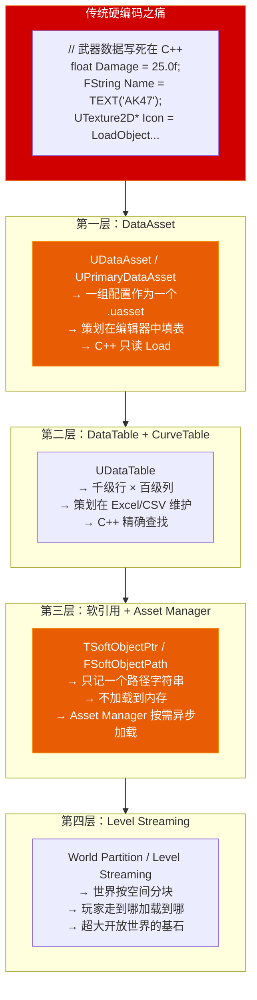
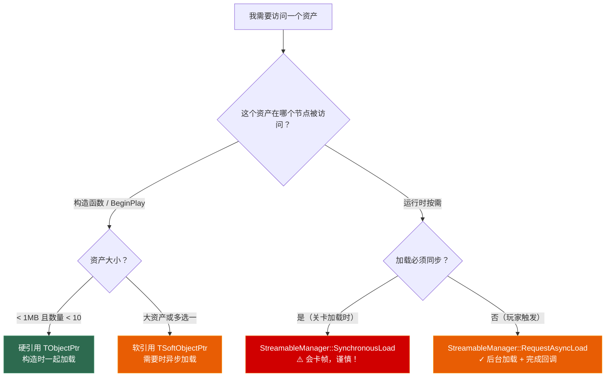

# 第十三章 数据驱动与资源管理：从 DataAsset 到异步加载体系

> **一句话理解**：策划改数值不应该改你的 C++ 代码，美术换资源不应该改你的蓝图连线——这就是数据驱动的核心命题。UE 提供了一套完整的"硬编码 → 数据资产"升级路径：**DataAsset** 管"一组配置"、**DataTable** 管"一堆行数据"、**软引用**管"我不现在加载，只记一个路径"、**Asset Manager** 管"按需异步加载、按策略释放"。这四个工具组合在一起，让你能写出策划在 Excel 里改个数字就能生效的游戏——而不是每次都喊你改代码再打包。

---

## 13.1 概念直觉 —— 数据驱动的四层架构

### 13.1.1 从硬编码到数据资产：一张图看升级路径



```cpp
// ===== 硬编码的末日 vs 数据驱动的黎明 =====
//
// ✗ 硬编码（Hard-Coded）：
//   - 策划说"把 AK47 伤害从 25 改成 26" → 你改 C++ → 编译 20 分钟 → 打包 1 小时
//   - 所有武器数据散落在 50 个 .cpp 文件中
//   - 每次数值调整 = 一次完整的代码变更 + CI 流水线
//
// ✓ 数据驱动（Data-Driven）：
//   - 伤害值存在 DataTable 的 CSV 里 → 策划改个数字 → 编辑器内热更新 → 立刻测试
//   - 武器配置存为 DataAsset → 策划在编辑器中拖拽图标、调整参数
//   - 代码和数据的生命周期彻底解耦——你的 C++ 只定义"结构"，数据由策划维护
//
// 核心原则：
//   "C++ 定义 WHAT（什么结构），数据定义 HOW MUCH（数值多少）"
//   "代码 = 骨架，数据 = 血肉"
```

### 13.1.2 资产加载时机决策树



---

## 13.2 DataAsset 体系 —— 让策划在编辑器中配置一切

### 13.2.1 UDataAsset vs UPrimaryDataAsset

```cpp
// ===== 两种 DataAsset 的选择 =====
//
// UDataAsset：
//   - 轻量级的 UObject 容器——一组 C++ 配置数据存为一个 .uasset 文件
//   - 不参与 Asset Manager 的 Primary Asset 标签体系
//   - 适用：小规模配置（角色属性预设、武器参数、技能定义）
//
// UPrimaryDataAsset：
//   - UDataAsset 的子类，额外支持 Asset Manager 的标签和 Bundle 系统
//   - 可以按 PrimaryAssetId 查找、管理生命周期
//   - 适用：大规模资产集合（所有武器的数据库、所有怪物的配置、所有 UI 皮肤）

// ---------- ① 基础 DataAsset：武器属性 ----------
UCLASS(BlueprintType)
class UWeaponData : public UDataAsset
{
    GENERATED_BODY()

public:
    // ---- 基础信息 ----
    UPROPERTY(EditAnywhere, BlueprintReadOnly, Category = "Info")
    FText DisplayName;

    UPROPERTY(EditAnywhere, BlueprintReadOnly, Category = "Info")
    FText Description;

    UPROPERTY(EditAnywhere, BlueprintReadOnly, Category = "Info")
    TSoftObjectPtr<UTexture2D> Icon;  // 软引用——图标不加载到内存

    // ---- 战斗数值 ----
    UPROPERTY(EditAnywhere, BlueprintReadOnly, Category = "Combat")
    float BaseDamage = 10.0f;

    UPROPERTY(EditAnywhere, BlueprintReadOnly, Category = "Combat")
    float FireRate = 600.0f;  // RPM

    UPROPERTY(EditAnywhere, BlueprintReadOnly, Category = "Combat")
    int32 MagazineSize = 30;

    UPROPERTY(EditAnywhere, BlueprintReadOnly, Category = "Combat")
    float ReloadTime = 2.0f;

    // ---- 表现资源（软引用——运行时按需加载）----
    UPROPERTY(EditAnywhere, BlueprintReadOnly, Category = "Assets")
    TSoftObjectPtr<USkeletalMesh> WeaponMesh;  // 只存路径，不加载网格体

    UPROPERTY(EditAnywhere, BlueprintReadOnly, Category = "Assets")
    TSoftObjectPtr<UAnimMontage> FireMontage;

    UPROPERTY(EditAnywhere, BlueprintReadOnly, Category = "Assets")
    TSoftObjectPtr<USoundCue> FireSound;

    UPROPERTY(EditAnywhere, BlueprintReadOnly, Category = "Assets")
    TSoftObjectPtr<UNiagaraSystem> MuzzleFlashVFX;

    // ---- 工具函数 ----
    float GetDamagePerSecond() const { return BaseDamage * FireRate / 60.0f; }
};

// ---------- ② Primary DataAsset：所有武器的数据库 ----------
UCLASS(BlueprintType)
class UWeaponDatabase : public UPrimaryDataAsset
{
    GENERATED_BODY()

public:
    // Primary DataAsset 必须重写此函数——返回资产的唯一 ID
    virtual FPrimaryAssetId GetPrimaryAssetId() const override
    {
        // 格式：WeaponDatabase:Default —— 这是全局唯一的资产标识
        return FPrimaryAssetId(TEXT("WeaponDatabase"), GetFName());
    }

    UPROPERTY(EditAnywhere, BlueprintReadOnly, Category = "Weapons")
    TMap<FName, TSoftObjectPtr<UWeaponData>> WeaponMap;  // 武器ID → 武器数据（软引用）

    UPROPERTY(EditAnywhere, BlueprintReadOnly, Category = "Defaults")
    TSoftObjectPtr<UWeaponData> DefaultWeapon;

    // 按名称查找武器
    UWeaponData* GetWeaponData(FName WeaponID) const
    {
        if (const TSoftObjectPtr<UWeaponData>* Found = WeaponMap.Find(WeaponID))
        {
            return Found->LoadSynchronous();  // ⚠️ 同步加载——仅用于已被预载的资产
        }
        return nullptr;
    }
};
```

### 13.2.2 DataAsset 编辑器工作流

```cpp
// ===== DataAsset 的创建和使用流程 =====
//
// 步骤 1：C++ 定义 DataAsset 类（如上）
// 步骤 2：编译后，编辑器中右键 → Miscellaneous → Data Asset → 选你的类
// 步骤 3：在编辑器属性面板中填写数值——策划可以操作，不需要 IDE
// 步骤 4：C++ 中获取 DataAsset 实例

// ---------- 在 GameMode 或 Subsystem 中加载 DataAsset ----------
UCLASS()
class UWeaponManager : public UGameInstanceSubsystem
{
    GENERATED_BODY()

public:
    // 硬引用：这个 DataAsset 会在 GameInstance 初始化时被加载到内存
    UPROPERTY(EditDefaultsOnly, Category = "Config")
    TObjectPtr<UWeaponDatabase> WeaponDB;

    // BP 中设置 WeaponDB → 指向 Content/Data/WeaponDB.uasset

    UWeaponData* GetWeaponData(FName WeaponID) const
    {
        if (!WeaponDB) return nullptr;
        return WeaponDB->GetWeaponData(WeaponID);
    }

    // 异步加载武器配置（配合 StreamableManager）
    void LoadWeaponDataAsync(FName WeaponID,
                             TFunction<void(UWeaponData*)> OnLoaded)
    {
        if (!WeaponDB) return;

        // 从 WeaponDB 中找到软引用路径
        const TSoftObjectPtr<UWeaponData>* Found =
            WeaponDB->WeaponMap.Find(WeaponID);
        if (!Found) return;

        // 异步加载
        FStreamableManager& Manager = UAssetManager::GetStreamableManager();
        Manager.RequestAsyncLoad(
            Found->ToSoftObjectPath(),
            FStreamableDelegate::CreateLambda(
                [OnLoaded, WeaponID, this]()
                {
                    UWeaponData* Data = WeaponDB->GetWeaponData(WeaponID);
                    OnLoaded(Data);
                }
            )
        );
    }
};

// ===== DataAsset vs 继承 vs Struct 的选择 =====
//
// DataAsset：
//   ✓ 策划可视化编辑；可作为 .uasset 独立管理；支持软引用
//   ✗ 有 UObject 开销；不适合存每一行数据
//   适用：一组相关的配置（武器预设、角色模板、技能定义、UI 皮肤集）
//
// 继承（子类）：
//   ✓ 行为可重写（虚函数）；编译期类型安全
//   ✗ 一个配置变化 = 一个新的蓝图子类 → 爆炸式增长
//   适用：不仅数据不同，行为也不同（不同武器发射逻辑）
//
// Struct（FTableRowBase）：
//   ✓ 零 UObject 开销；可存数万行
//   ✗ 不能独立存在为 .uasset；策划看不到实时预览
//   适用：表格数据，一行就是一个数据点（道具表、怪物表、经验值表）
```

---

## 13.3 DataTable 体系 —— 千级数据的正确管理方式

### 13.3.1 FTableRowBase：一行数据的结构

```cpp
// ===== DataTable 的完整定义和使用 =====

// ---------- 步骤 1：定义行结构 ----------
USTRUCT(BlueprintType)
struct FMonsterDataRow : public FTableRowBase  // ← 必须继承 FTableRowBase！
{
    GENERATED_BODY()

public:
    UPROPERTY(EditAnywhere, BlueprintReadOnly)
    FText DisplayName;

    UPROPERTY(EditAnywhere, BlueprintReadOnly)
    float Health = 100.0f;

    UPROPERTY(EditAnywhere, BlueprintReadOnly)
    float AttackPower = 10.0f;

    UPROPERTY(EditAnywhere, BlueprintReadOnly)
    float MoveSpeed = 600.0f;

    UPROPERTY(EditAnywhere, BlueprintReadOnly)
    int32 ExperienceReward = 50;

    UPROPERTY(EditAnywhere, BlueprintReadOnly)
    TSoftObjectPtr<USkeletalMesh> Mesh;  // 软引用——不加载模型到内存

    UPROPERTY(EditAnywhere, BlueprintReadOnly)
    TSoftObjectPtr<UBehaviorTree> BehaviorTree;

    UPROPERTY(EditAnywhere, BlueprintReadOnly)
    TArray<FName> DropItemIDs;  // 掉落物品 ID，对应另一个 DataTable

    // FTableRowBase 自带 FName RowName —— 行名即 Key，不需要额外定义
};

// ---------- 步骤 2：CSV 文件格式 ----------
// 文件：MonsterTable.csv
//
// ---,DisplayName,Health,AttackPower,MoveSpeed,ExperienceReward,Mesh,BehaviorTree,DropItemIDs
// Goblin,哥布林,50.0,8.0,400.0,20,/Game/Monsters/Goblin/Mesh.Mesh,/Game/AI/BT_Goblin.BT_Goblin,"(Potion,Sword)"
// Orc,兽人,200.0,25.0,300.0,100,/Game/Monsters/Orc/Mesh.Mesh,/Game/AI/BT_Orc.BT_Orc,"(Axe,Armor)"
// Dragon,龙,1000.0,80.0,500.0,500,/Game/Monsters/Dragon/Mesh.Mesh,/Game/AI/BT_Dragon.BT_Dragon,"(Gold,DragonScale)"
//
// 注意：
// - 第一列是行名（RowName），列头留空或写 "---"
// - FText 字段的 CSV 值是本地化 Key，不是显示文本
// - 数组字段用括号包裹，逗号分隔：(Item1,Item2,Item3)
```

### 13.3.2 DataTable 的 C++ 读写操作

```cpp
// ===== DataTable 核心 API =====
UCLASS()
class UMonsterDataManager : public UGameInstanceSubsystem
{
    GENERATED_BODY()

public:
    // 硬引用 DataTable
    UPROPERTY(EditDefaultsOnly, Category = "Data")
    TObjectPtr<UDataTable> MonsterTable;

    // ---------- 读取操作 ----------

    // ① 按行名精确查找——最常用
    FMonsterDataRow* GetMonsterData(FName MonsterID) const
    {
        if (!MonsterTable) return nullptr;

        return MonsterTable->FindRow<FMonsterDataRow>(
            MonsterID,          // 行名（CSV 第一列）
            TEXT("MonsterLookup") // 上下文字符串——出错时出现在日志中方便定位
        );
    }

    // ② 遍历所有行
    void GetAllMonsters(TArray<FMonsterDataRow>& OutRows) const
    {
        if (!MonsterTable) return;

        // DataTable 内部的 TMap<FName, uint8*> 存储
        const TMap<FName, uint8*>& RowMap = MonsterTable->GetRowMap();
        for (const auto& Pair : RowMap)
        {
            FMonsterDataRow* Row =
                reinterpret_cast<FMonsterDataRow*>(Pair.Value);
            if (Row) OutRows.Add(*Row);
        }
    }

    // ③ 按条件筛选——高等级怪物
    void GetEliteMonsters(float MinHealth,
                          TArray<FMonsterDataRow>& OutRows) const
    {
        TArray<FMonsterDataRow*> AllRows;
        MonsterTable->GetAllRows<FMonsterDataRow>(TEXT("GetElite"), AllRows);

        for (FMonsterDataRow* Row : AllRows)
        {
            if (Row && Row->Health >= MinHealth)
            {
                OutRows.Add(*Row);
            }
        }
    }

    // ---------- 运行时写入（不推荐——仅编辑器工具用） ----------
#if WITH_EDITOR
    void UpdateMonsterHealth(FName MonsterID, float NewHealth)
    {
        if (FMonsterDataRow* Row = GetMonsterData(MonsterID))
        {
            Row->Health = NewHealth;  // 运行时修改——不会自动保存到 CSV
            // 这只是改内存中的副本！重载关卡后会恢复为 CSV 中的值
        }
    }
#endif
};

// ===== FindRow 的注意事项 =====
// FindRow 返回的是 DataTable 内部存储的指针——不要缓存它！
//
// ✓ 正确做法：每次使用时 FindRow（查找是 O(1) 哈希查找，极快）
// ✗ 错误做法：在 BeginPlay 中存一个 Row*，之后一直用——
//    DataTable 可能在特定时机（热重载、编辑器刷新）重新加载，你的指针会悬空！
```

### 13.3.3 Composite DataTable —— 多张表合并

```cpp
// ===== Composite DataTable：模块化配置的叠加 =====
//
// 场景：基础怪物表 + DLC 新怪物表 + 活动限定怪物表
// 问题：三张表分别维护——但我想在运行时"看到所有怪物"
// 解决：Composite DataTable 将多张表逻辑合并为一张虚拟大表

// 设置方式（编辑器中操作，或 C++ 构建）：
UCLASS()
class UMonsterDataManager_Composite : public UGameInstanceSubsystem
{
    GENERATED_BODY()

public:
    // 基础表——所有怪物都在这里
    UPROPERTY(EditDefaultsOnly, Category = "Data")
    TObjectPtr<UDataTable> BaseMonsterTable;

    // DLC 覆盖表——同名 Row 会覆盖基础表中的数据
    UPROPERTY(EditDefaultsOnly, Category = "Data")
    TObjectPtr<UDataTable> DLCOverrideTable;

    // 活动限定表——限时怪物的数据
    UPROPERTY(EditDefaultsOnly, Category = "Data")
    TObjectPtr<UDataTable> EventMonsterTable;

    // 手动实现 Composite 查找逻辑：
    FMonsterDataRow* FindMonster(FName MonsterID) const
    {
        // 优先级：活动表 > DLC 表 > 基础表
        // 活动限定怪会覆盖 DLC 的同名怪，DLC 覆盖基础怪

        if (EventMonsterTable)
        {
            if (auto* Row = EventMonsterTable->FindRow<FMonsterDataRow>(
                    MonsterID, TEXT("Event")))
                return Row;
        }

        if (DLCOverrideTable)
        {
            if (auto* Row = DLCOverrideTable->FindRow<FMonsterDataRow>(
                    MonsterID, TEXT("DLC")))
                return Row;
        }

        if (BaseMonsterTable)
        {
            return BaseMonsterTable->FindRow<FMonsterDataRow>(
                MonsterID, TEXT("Base"));
        }

        return nullptr;
    }
};
```

### 13.3.4 CurveTable —— 曲线驱动的数值

```cpp
// ===== CurveTable：用曲线替代离散数值 =====
//
// 场景：经验值曲线——不是"每级 100 经验"，而是 1级→100 / 2级→250 / 3级→500
// 问题：离散公式难以表达设计师想要的"前快后慢"或"S 形曲线"
// 解决：CurveTable 存一条浮点曲线——X=等级, Y=所需经验

UCLASS()
class UExperienceManager : public UGameInstanceSubsystem
{
    GENERATED_BODY()

public:
    UPROPERTY(EditDefaultsOnly, Category = "Data")
    TObjectPtr<UCurveTable> ExperienceCurve;

    // 获取升到指定等级所需的总经验
    int32 GetExperienceForLevel(int32 Level) const
    {
        if (!ExperienceCurve) return 0;

        // CurveTable 中的曲线以 FName 为 Key
        static const FName CurveName = TEXT("ExpCurve");

        // 获取曲线
        FRealCurve* Curve = ExperienceCurve->FindCurve(
            CurveName,
            TEXT("GetExp"),     // 上下文
            false               // bLogErrors
        );

        if (!Curve) return 0;

        // 在曲线上求值
        return FMath::RoundToInt(Curve->Eval(static_cast<float>(Level)));
    }

    // 批量预计算——将所有等级的经验值缓存到 TArray
    void PreCacheExperienceCurve(int32 MaxLevel)
    {
        CachedExp.Empty(MaxLevel + 1);
        for (int32 Lv = 1; Lv <= MaxLevel; ++Lv)
        {
            CachedExp.Add(GetExperienceForLevel(Lv));
        }
    }

    // 快速查表
    int32 GetCachedExp(int32 Level) const
    {
        return CachedExp.IsValidIndex(Level - 1) ?
               CachedExp[Level - 1] : 0;
    }

private:
    TArray<int32> CachedExp;
};

// ===== CurveTable vs FRichCurve vs 公式 =====
//
// CurveTable：
//   ✓ 设计师在编辑器中可视化拖拽曲线（所见即所得）
//   ✓ 支持多种插值方式（Linear/Cubic/Constant）
//   ✓ 可以导入 CSV 批量编辑
//   ✗ 有 UObject 开销
//   适用：经验曲线、伤害衰减、难度缩放——设计师需要直观感受
//
// FRichCurve（内嵌在 UPROPERTY 中）：
//   ✓ 作为 DataAsset 或 Actor 的成员属性，直接在 Details Panel 中编辑
//   ✓ 零额外 UObject
//   适用：单个对象的简单曲线（飞行器的推力曲线、弹簧阻尼）
//
// 公式（FMath 表达式）：
//   ✓ 最精确、最可预测
//   ✗ 设计师不能拖拽调试
//   适用：物理模拟、数学上严格定义的曲线
```

---

## 13.4 软引用三剑客 —— 不加载资产的资产引用

### 13.4.1 三种引用的内存模型对比

```cpp
// ===== 硬引用 vs 软引用：内存模型对比 =====
//
// 硬引用（TObjectPtr<T> / T*）：
//   LoadObject<UTexture2D>(Path) → 纹理被加载到内存
//   → 指针指向内存中的 UObject → 该纹理和它引用的所有资产全部驻留
//   → 哪怕玩家永远不打开背包——背包图标已经在内存里了！
//   等价于："把这个资产的指针给我，现在就加载它"
//
// 软引用（TSoftObjectPtr<T> / FSoftObjectPath）：
//   TSoftObjectPtr<UTexture2D> Icon;  // 这里存的只是一个 FString 路径
//   → 没有 UObject 被加载！内存占用 = sizeof(FSoftObjectPath) ≈ 几个指针
//   → 需要时异步加载：AssetManager.RequestAsyncLoad(Path, Callback)
//   等价于："记住这个资产在哪，以后需要时再加载"
//
// 硬引用 = 你朋友家的钥匙——你可以直接开门进去
// 软引用 = 你朋友家的地址——你知道在哪，但要去得先约时间（异步加载）

// ---------- 可视化：10,000 个武器的内存占用 ----------
// 硬引用加载全部资产：
//   10,000 × 纹理(2MB) + 10,000 × 模型(5MB) + 10,000 × 音效(0.5MB)
//   = 75GB 内存 → 直接爆炸！
//
// 软引用（只存路径）：
//   10,000 × FSoftObjectPath(≈80 bytes)
//   = 0.8MB 内存 → 约等于零！
```

### 13.4.2 软引用类型速查

```cpp
// ===== 软引用类型选择 =====

// ① TSoftObjectPtr<T> —— 最常用（模板包装，类型安全）
UPROPERTY(EditAnywhere, BlueprintReadOnly)
TSoftObjectPtr<UTexture2D> Icon;

// 访问方式：
UTexture2D* LoadedIcon = Icon.LoadSynchronous();  // 同步（卡帧！仅用于已缓存的资产）
UTexture2D* CachedIcon = Icon.Get();               // 不加载——如果已经加载了返回指针，否则 null
bool bIsLoaded = Icon.IsValid();                   // 判断是否已加载到内存

// ② FSoftObjectPath —— 底层路径字符串（非模板）
UPROPERTY(EditAnywhere, BlueprintReadOnly)
FSoftObjectPath MeshPath;

// 可以指向任意类型的 UObject——不做类型检查
// 适用：运行时动态决定加载什么类型

// ③ TSoftClassPtr<T> —— 软引用蓝图/类
UPROPERTY(EditAnywhere, BlueprintReadOnly)
TSoftClassPtr<AActor> SpawnableActorClass;

// 访问：
UClass* LoadedClass = SpawnableActorClass.LoadSynchronous();
AActor* SpawnedActor = GetWorld()->SpawnActor<AActor>(LoadedClass);

// ④ FSoftObjectPath 与 TSoftObjectPtr 互转
TSoftObjectPtr<UTexture2D> SoftPtr(SomePath);
FSoftObjectPath Path = SoftPtr.ToSoftObjectPath();    // TSoftObjectPtr → FSoftObjectPath

TSoftObjectPtr<UTexture2D> BackToSoftPtr(Path);       // FSoftObjectPath → TSoftObjectPtr
```

### 13.4.3 软引用的完整实战：大规模背包系统

```cpp
// ===== 场景：10,000 种道具的背包系统 =====
// 内存要求：加载所有道具图标和模型 = 不可能
// 解决方案：只存 FSoftObjectPath，按需异步加载

// ---------- 道具定义（DataTable 行结构） ----------
USTRUCT(BlueprintType)
struct FItemRow : public FTableRowBase
{
    GENERATED_BODY()

    UPROPERTY(EditAnywhere, BlueprintReadOnly)
    FText DisplayName;

    UPROPERTY(EditAnywhere, BlueprintReadOnly)
    int32 MaxStackSize = 99;

    UPROPERTY(EditAnywhere, BlueprintReadOnly)
    TSoftObjectPtr<UTexture2D> Icon;        // 图标——打开背包时才加载

    UPROPERTY(EditAnywhere, BlueprintReadOnly)
    TSoftObjectPtr<UStaticMesh> WorldMesh;  // 模型——丢弃到地上时才加载

    UPROPERTY(EditAnywhere, BlueprintReadOnly)
    TSoftObjectPtr<USoundCue> PickupSound;  // 音效——拾取时才加载
};

// ---------- 背包管理器 ----------
UCLASS()
class UInventoryManager : public UGameInstanceSubsystem
{
    GENERATED_BODY()

public:
    UPROPERTY(EditDefaultsOnly)
    TObjectPtr<UDataTable> ItemTable;

    // 玩家的背包——只存 ItemID 和数量，不存任何资产引用
    UPROPERTY(SaveGame, BlueprintReadOnly)
    TMap<FName, int32> Inventory;  // ItemID → 持有数量

    // ---------- 异步加载道具图标（背包 UI 打开时） ----------
    void LoadItemIconAsync(FName ItemID, TFunction<void(UTexture2D*)> OnLoaded)
    {
        FItemRow* Row = ItemTable->FindRow<FItemRow>(ItemID, TEXT("Inventory"));
        if (!Row)
        {
            OnLoaded(nullptr);
            return;
        }

        // 如果已经加载了——直接返回（缓存命中）
        if (UTexture2D* Cached = Row->Icon.Get())
        {
            OnLoaded(Cached);
            return;
        }

        // 否则异步加载
        FStreamableManager& Manager = UAssetManager::GetStreamableManager();
        Manager.RequestAsyncLoad(
            Row->Icon.ToSoftObjectPath(),
            FStreamableDelegate::CreateLambda(
                [Row, OnLoaded]()
                {
                    OnLoaded(Row->Icon.Get());
                }
            )
        );
    }

    // ---------- 批量预加载（预见性加载——玩家打开背包前） ----------
    void PreloadVisibleIcons(const TArray<FName>& VisibleItemIDs)
    {
        TArray<FSoftObjectPath> PathsToLoad;

        for (FName ItemID : VisibleItemIDs)
        {
            if (FItemRow* Row = ItemTable->FindRow<FItemRow>(ItemID, TEXT("Preload")))
            {
                if (!Row->Icon.IsValid())  // 还没加载
                {
                    PathsToLoad.Add(Row->Icon.ToSoftObjectPath());
                }
            }
        }

        if (PathsToLoad.Num() > 0)
        {
            FStreamableManager& Manager = UAssetManager::GetStreamableManager();
            Manager.RequestAsyncLoad(
                PathsToLoad,
                FStreamableDelegate::CreateLambda(
                    [PathsToLoad]()
                    {
                        UE_LOG(LogTemp, Log, TEXT("预加载了 %d 个道具图标"),
                               PathsToLoad.Num());
                    }
                )
            );
        }
    }

    // ---------- 卸载不需要的资产（背包关闭时） ----------
    void UnloadUnusedItemAssets(const TArray<FName>& StillVisibleItemIDs)
    {
        // 构造"仍然需要"的资产路径集合
        TSet<FSoftObjectPath> KeepPaths;
        for (FName ItemID : StillVisibleItemIDs)
        {
            if (FItemRow* Row = ItemTable->FindRow<FItemRow>(ItemID, TEXT("Unload")))
            {
                KeepPaths.Add(Row->Icon.ToSoftObjectPath());
            }
        }

        // 遍历当前已加载的所有图标，不在 Keep 集合中的就卸载
        // ⚠️ 实际项目中通常依赖 Asset Manager 的引用计数 + GC 自动管理
        // 手动卸载资产边界的资产反而容易出悬空指针问题
        // 正确的卸载策略见 13.5.3
    }
};
```

---

## 13.5 Asset Manager —— 资产生命周期管理中枢

### 13.5.1 什么是 Asset Manager？

```cpp
// ===== UAssetManager：全局资产的"索引 + 生命周期管理器" =====
//
// UAssetManager 是 UE 的全局单例（继承自 UObject），负责：
//
// 1. Primary Asset 标签体系
//    → 每种资产类型定义一个 PrimaryAssetType（如 "Weapon", "Monster", "Quest"）
//    → 每个资产实例有一个 PrimaryAssetId（如 "Weapon:AK47"）
//    → 通过标签快速查找、批量操作
//
// 2. StreamableManager —— 异步加载引擎
//    → 按优先级排队加载资产
//    → 支持批量请求 + 完成回调
//    → 支持加载取消
//
// 3. Bundle 系统 —— 分组管理
//    → 一个 Primary Asset 可以有多个 Bundle（如 "Gameplay" / "UI" / "HD"）
//    → 按需加载不同 Bundle 中的子资产
//
// 4. 卸载策略
//    → 引用计数跟踪——不再被引用的资产可以被 GC 回收
//    → 主动 UnloadPrimaryAsset

// ---------- 注册 Primary Asset 类型 ----------
// 通常在 DefaultEngine.ini 或项目的 Asset Manager 子类中配置：
//
// [/Script/Engine.AssetManagerSettings]
// +PrimaryAssetTypesToScan=(PrimaryAssetType="Weapon",...)
// +PrimaryAssetTypesToScan=(PrimaryAssetType="Monster",...)
// +PrimaryAssetTypesToScan=(PrimaryAssetType="Quest",...)

// 或者——创建自定义 Asset Manager 子类（推荐）：
UCLASS()
class UMyAssetManager : public UAssetManager
{
    GENERATED_BODY()

public:
    virtual void StartInitialLoading() override
    {
        Super::StartInitialLoading();

        // 引擎启动时——预扫描所有 Primary Asset
        // 这是"知道游戏里有哪些资产"的步骤，不是加载它们
        ScanPrimaryAssetTypesFromConfig();
    }

    // 在 DefaultGame.ini 中配置 Asset Manager 类：
    // [/Script/Engine.Engine]
    // AssetManagerClassName=/Script/MyGame.MyAssetManager
};
```

### 13.5.2 StreamableManager 异步加载管线

```cpp
// ===== StreamableManager 完整 API =====
UCLASS()
class UAssetLoader : public UGameInstanceSubsystem
{
    GENERATED_BODY()

public:
    // ---------- ① 单个资产异步加载 ----------
    void LoadWeaponAsync(FName WeaponID)
    {
        FSoftObjectPath Path = GetWeaponPath(WeaponID);

        FStreamableManager& Manager = UAssetManager::GetStreamableManager();
        // ⚠️ RequestAsyncLoad 返回 TSharedPtr<FStreamableHandle>——不是裸指针！
        //    这是智能指针包装，用于防止加载句柄悬空和内存泄漏
        TSharedPtr<FStreamableHandle> Handle = Manager.RequestAsyncLoad(
            Path,
            FStreamableDelegate::CreateUObject(this, &UAssetLoader::OnWeaponLoaded)
        );

        // 可以保存 Handle——用于后续取消加载或查询进度
        if (Handle.IsValid())
        {
            ActiveHandles.Add(Handle);
        }
    }

    UFUNCTION()
    void OnWeaponLoaded()
    {
        UE_LOG(LogTemp, Log, TEXT("武器资产加载完成！"));
    }

    // ---------- ② 批量异步加载 ----------
    void LoadMultipleAssets(const TArray<FSoftObjectPath>& Paths)
    {
        FStreamableManager& Manager = UAssetManager::GetStreamableManager();

        TSharedPtr<FStreamableHandle> Handle = Manager.RequestAsyncLoad(
            Paths,
            FStreamableDelegate::CreateLambda(
                [Paths]()
                {
                    UE_LOG(LogTemp, Log, TEXT("%d 个资产加载完成"), Paths.Num());
                }
            )
        );
    }

    // ---------- ③ 同步加载（⚠️ 仅用于极特殊场景） ----------
    void LoadSynchronously_LastResort(FSoftObjectPath Path)
    {
        FStreamableManager& Manager = UAssetManager::GetStreamableManager();

        // SynchronousLoad 会阻塞当前线程直到加载完成——可能卡数百毫秒！
        // 绝对不要在 Tick 或 BeginPlay 中调用！
        // 仅适用于：关卡加载阶段（已经有 Loading 画面了）
        Manager.SynchronousLoad(Path);
    }

    // ---------- ④ 加载进度查询 ----------
    float GetLoadProgress() const
    {
        float TotalProgress = 0.0f;
        int32 Count = 0;

        for (TSharedPtr<FStreamableHandle> Handle : ActiveHandles)
        {
            if (Handle.IsValid())
            {
                TotalProgress += Handle->GetLoadProgress();  // 0.0 ~ 1.0
                Count++;
            }
        }
        return Count > 0 ? TotalProgress / Count : 1.0f;
    }

    // ---------- ⑤ 取消加载 ----------
    void CancelAllLoading()
    {
        for (TSharedPtr<FStreamableHandle> Handle : ActiveHandles)
        {
            if (Handle.IsValid() && Handle->IsActive())
            {
                Handle->CancelHandle();  // 取消——已加载的不回滚，未加载的不再加载
            }
        }
        ActiveHandles.Empty();
    }

    // ---------- ⑥ 预加载——按标签加载一组资产 ----------
    void PreloadWeaponAssets()
    {
        UAssetManager& Manager = UAssetManager::Get();

        // 找出所有 PrimaryAssetType = "Weapon" 的资产 ID
        TArray<FPrimaryAssetId> WeaponIds;
        Manager.GetPrimaryAssetIdList(FPrimaryAssetType(TEXT("Weapon")), WeaponIds);

        // 异步批量预加载——启动时就发出请求
        Manager.LoadPrimaryAssets(
            WeaponIds,
            TArray<FName>(),  // 加载所有 Bundle
            FStreamableDelegate::CreateLambda(
                [WeaponIds]()
                {
                    UE_LOG(LogTemp, Log, TEXT("预加载了 %d 个武器"), WeaponIds.Num());
                }
            )
        );
    }

private:
    TArray<TSharedPtr<FStreamableHandle>> ActiveHandles;

    FSoftObjectPath GetWeaponPath(FName WeaponID) const
    {
        // 从 DataTable 或 Asset Registry 中查到路径
        return FSoftObjectPath(FString::Printf(
            TEXT("/Game/Weapons/%s.%s"), *WeaponID.ToString(), *WeaponID.ToString()));
    }
};
```

### 13.5.3 资产卸载策略

```cpp
// ===== UE 的资产卸载机制 =====
//
// 本质上依赖 GC 的标记-清扫：
//   1. 一个资产（UTexture / UStaticMesh / etc.）是 UObject
//   2. 当没有任何硬引用指向它时 → GC 会回收它
//   3. 软引用（TSoftObjectPtr）不阻止 GC —— 只存路径字符串
//
// 卸载的三种方式：

// ① 被动卸载——最常见的正确方式
void ReleaseAssetReference()
{
    // 将硬引用置空
    MyLoadedTexture = nullptr;

    // 所有指向这个纹理的 TObjectPtr / TStrongObjectPtr 都释放后
    // 下一次 GC 周期会自动回收它——你不需要手动干预
}

// ② 主动卸载——StreamableManager::Unload
void UnloadAsset(FSoftObjectPath Path)
{
    FStreamableManager& Manager = UAssetManager::GetStreamableManager();
    Manager.Unload(Path);  // 减少 StreamableManager 持有的引用计数
    // 下一次 GC 时如果没有其他硬引用，会被回收
}

// ③ Primary Asset 卸载——通过 Asset Manager
void UnloadPrimaryAsset(FPrimaryAssetId AssetId)
{
    UAssetManager& Manager = UAssetManager::Get();
    Manager.UnloadPrimaryAsset(AssetId);
}

// ⚠️ 强制垃圾回收（GC）——谨慎使用！
void ForceGarbageCollection()
{
    // CollectGarbage 会遍历整个 UObject 图——耗时可能几百毫秒！
    // 只在明确的"关卡切换"或"主菜单"等大场景切换时调用
    GEngine->ForceGarbageCollection(true);  // true = 完全清扫

    // 或者用更轻量的增量式 GC（UE5）
    // 增量 GC 自动运行，每帧做一点——不需要手动调用
}

// ===== 常见错误：以为 TSoftObjectPtr::Get() 会"持有"资产 =====
void BadAssetLifecycle()
{
    TSoftObjectPtr<UTexture2D> SoftIcon = GetSoftIcon();

    // 加载资产
    UTexture2D* LoadedIcon = SoftIcon.LoadSynchronous();

    // ✗ 错误想法：SoftIcon 现在"拥有"这个纹理——GC 不会回收
    // ✓ 事实：SoftIcon 只是一条路径——它不对 LoadedIcon 增加任何引用！
    //         如果没有其他硬引用,GC 随时可能回收 LoadedIcon

    // ✓ 正确做法：用 TStrongObjectPtr 持有加载后的资产
    // ⚠️ 局部变量 TObjectPtr 对 GC 无保护作用——GC 只认 UPROPERTY() 标记的成员
    //    函数栈上的局部变量对 UHT/GC 完全不可见，必须用 TStrongObjectPtr
    TStrongObjectPtr<UTexture2D> HeldIcon(LoadedIcon);
    // HeldIcon 存在期间，LoadedIcon 不会被 GC 回收
}
```

---

## 13.6 Level Streaming —— 超大世界的按需加载

### 13.6.1 两种 Streaming 模式

```cpp
// ===== Level Streaming 两种模式 =====
//
// ① World Partition（UE5 新一代）：
//    - 世界被自动划分为 Grid Cell
//    - 每个 Cell 独立成为一个 Streaming 单元
//    - 根据距离自动加载/卸载
//    - 支持 Data Layer（逻辑层——如"烧毁前/烧毁后"）
//    - 适合：大型开放世界（> 4km²）
//
// ② 传统 Level Streaming（UE4 继承）：
//    - 手动划分子关卡（Sub-Level）
//    - C++ 或蓝图控制加载/卸载
//    - 适合：室内场景、地牢、独立的战斗区域

// ---------- 传统 Level Streaming C++ API ----------
UCLASS()
class ULevelStreamingManager : public UWorldSubsystem
{
    GENERATED_BODY()

public:
    // ① 按路径加载子关卡
    void LoadSubLevel(FName LevelName)
    {
        // 构造关卡路径
        FString LevelPath = FString::Printf(
            TEXT("/Game/Maps/SubLevels/%s"), *LevelName.ToString());

        // 异步加载
        UGameplayStatics::LoadStreamLevel(
            GetWorld(),
            FName(*LevelPath),          // 关卡路径
            true,                        // bMakeVisibleAfterLoad——加载完就显示
            false,                       // bShouldBlockOnLoad——不阻塞主线程！
            FLatentActionInfo()          // Latent Action 信息（蓝图用）
        );
    }

    // ② 卸载子关卡
    void UnloadSubLevel(FName LevelName)
    {
        FString LevelPath = FString::Printf(
            TEXT("/Game/Maps/SubLevels/%s"), *LevelName.ToString());

        UGameplayStatics::UnloadStreamLevel(
            GetWorld(),
            FName(*LevelPath),
            FLatentActionInfo(),
            false  // bShouldBlockOnUnload
        );
    }

    // ③ 在玩家位置周围流式加载
    void StreamAroundPlayer()
    {
        if (!GetWorld()) return;

        APlayerController* PC = GetWorld()->GetFirstPlayerController();
        if (!PC) return;

        FVector PlayerLocation = PC->GetPawn() ?
                                 PC->GetPawn()->GetActorLocation() :
                                 FVector::ZeroVector;

        // 遍历所有已注册的 StreamingLevel
        for (ULevelStreaming* StreamingLevel :
             GetWorld()->GetStreamingLevels())
        {
            // 计算关卡包围盒与玩家的距离
            // ⚠️ ULevelStreaming 没有 LevelBounds 成员！关卡包围盒来自关卡内部的
            //    ALevelBounds Actor。如果关卡尚未加载，需通过 World Composition 或
            //    预先配置的 Bounds 数据获取。此处简化：从已加载关卡中查找 ALevelBounds
            FBox LevelBounds(ForceInit);
            if (ULevel* LoadedLevel = StreamingLevel->GetLoadedLevel())
            {
                // ALevelBounds 是引擎自动放置在每个关卡中的包围盒 Actor
                for (AActor* Actor : LoadedLevel->Actors)
                {
                    if (ALevelBounds* Bounds = Cast<ALevelBounds>(Actor))
                    {
                        LevelBounds = Bounds->GetComponentsBoundingBox();
                        break;
                    }
                }
            }

            float DistToPlayer = LevelBounds.IsValid ?
                FMath::Sqrt(LevelBounds.ComputeSquaredDistanceToPoint(PlayerLocation)) :
                StreamingDistance + 1.0f;  // 无包围盒数据时跳过

            if (DistToPlayer < StreamingDistance)
            {
                if (!StreamingLevel->IsLevelLoaded())
                {
                    StreamingLevel->SetShouldBeLoaded(true);
                }
                if (!StreamingLevel->IsLevelVisible())
                {
                    StreamingLevel->SetShouldBeVisible(true);
                }
            }
            else if (DistToPlayer > UnloadDistance)
            {
                StreamingLevel->SetShouldBeLoaded(false);
            }
        }
    }

    // ④ 检测关卡加载状态
    bool IsLevelLoaded(FName LevelName) const
    {
        FString LevelPath = FString::Printf(
            TEXT("/Game/Maps/SubLevels/%s"), *LevelName.ToString());

        ULevelStreaming* Level = UGameplayStatics::GetStreamingLevel(
            GetWorld(), FName(*LevelPath));

        return Level ? Level->IsLevelLoaded() : false;
    }

    UPROPERTY(EditDefaultsOnly)
    float StreamingDistance = 20000.0f;  // 200 米内加载

    UPROPERTY(EditDefaultsOnly)
    float UnloadDistance = 30000.0f;     // 300 米外卸载
};

// ---------- Data Layer（UE5 World Partition 专属） ----------
// Data Layer 不是通过 C++ API 直接控制，而是通过 World Partition 的
// DataLayerManager 在编辑器中配置。C++ 侧的典型用法：

#if WITH_EDITOR
void ConfigureDataLayers()
{
    // 在编辑器中：
    // 1. 创建 Data Layer Asset：Burned / Unburned
    // 2. 将关卡中的 Actor 分配到对应 Data Layer
    // 3. 在 GameMode 或 WorldSubsystem 中动态切换：

    // UE5 运行时通过 UDataLayerManager 切换
    // if (UDataLayerManager* DLManager = UDataLayerManager::Get(GetWorld()))
    // {
    //     DLManager->SetDataLayerState(BurnedLayer,
    //         EDataLayerState::Activated);
    // }
}
#endif
```

### 13.6.2 流式加载中的资产引用注意事项

```cpp
// ===== Level Streaming 中的资产引用陷阱 =====

// 陷阱 1：一个子关卡中硬引用了另一个子关卡的 Actor
UCLASS()
class ASubLevelActor : public AActor
{
public:
    UPROPERTY(EditAnywhere)
    TObjectPtr<AActor> ActorInAnotherLevel;  // ✗ 跨关卡硬引用！
    // 当另一个子关卡被卸载时——这个指针变成悬空指针！
    // 当另一个子关卡被重新加载时——这是另一个不同的 Actor 实例！
};
// ✓ 修复：用 FName 或 FGuid 标识 + 运行时查找
UPROPERTY(EditAnywhere)
FName OtherActorTag;  // 存储标签，运行时通过 TActorRange 查找

// 陷阱 2：子关卡卸载后——其中的 UObject 引用全部失效
// 如果你的背包 UI 引用了子关卡中的某个 Actor——
// 子关卡卸载后，UI 中的 TObjectPtr 变成 nullptr（GC 回收了旧实例）
// 重新加载子关卡后，新实例的地址与旧的不同——你的指针依然是 nullptr！
//
// ✓ 修复：用 Subsystem 或 GameInstance 持有跨关卡数据
//   子关卡卸载前将数据写入 Subsystem，加载后从 Subsystem 恢复
```

---

## 13.7 完整实战 —— 开放世界 RPG 的资源管理架构

### 13.7.1 数据驱动 + 异步加载的完整链路

```cpp
// ===== 场景：开放世界 RPG =====
// - 10,000 种道具 → DataTable 存定义
// - 500 种怪物 → DataTable 存属性，DataAsset 存行为配置
// - 200 个 NPC → DataAsset 存对话配置
// - 地图 16km² → World Partition 自动 Streaming
// - 玩家背包 → 软引用 + 异步加载图标
//
// 目标：任何时候内存中的资产 < 2GB（16GB 可用内存）
// 策略：按需加载 + 离开即卸载 + 预加载可见范围

// ---------- 核心管理器 ----------
UCLASS()
class URPGAssetManager : public UGameInstanceSubsystem
{
    GENERATED_BODY()

public:
    virtual void Initialize(FSubsystemCollectionBase& Collection) override
    {
        Super::Initialize(Collection);

        // 启动时只加载核心数据表（总共几 MB）
        LoadCoreTables();

        // 注册系统范围的预加载策略
        RegisterPreloadZones();
    }

    // ---------- ① 加载核心数据表（启动时——很小） ----------
    void LoadCoreTables()
    {
        // 这些 DataTable 存储的是小结构体——总计几百 KB
        // 使用硬引用——因为它们一直在用
        FStreamableManager& Manager = UAssetManager::GetStreamableManager();

        // 同步加载（启动时卡一下没关系，因为本来就有 Loading 画面）
        Manager.SynchronousLoad(
            FSoftObjectPath(TEXT("/Game/Data/Tables/ItemTable.ItemTable")));
        Manager.SynchronousLoad(
            FSoftObjectPath(TEXT("/Game/Data/Tables/MonsterTable.MonsterTable")));
        Manager.SynchronousLoad(
            FSoftObjectPath(TEXT("/Game/Data/Tables/QuestTable.QuestTable")));

        UE_LOG(LogRPG, Log, TEXT("核心数据表加载完成"));
    }

    // ---------- ② 按区域预加载——玩家进入新区域时 ----------
    void PreloadRegion(FName RegionName)
    {
        if (PreloadedRegions.Contains(RegionName)) return;  // 已预加载
        PreloadedRegions.Add(RegionName);

        // 查询 Asset Registry：找出该区域需要的所有资产
        TArray<FSoftObjectPath> RegionAssets;
        GetAssetsForRegion(RegionName, RegionAssets);

        FStreamableManager& Manager = UAssetManager::GetStreamableManager();
        TSharedPtr<FStreamableHandle> Handle = Manager.RequestAsyncLoad(
            RegionAssets,
            FStreamableDelegate::CreateUObject(
                this, &URPGAssetManager::OnRegionPreloaded, RegionName)
        );

        if (Handle.IsValid())
        {
            PendingRegionHandles.Add(RegionName, Handle);
        }
    }

    void OnRegionPreloaded(FName RegionName)
    {
        UE_LOG(LogRPG, Log, TEXT("区域 %s 预加载完成"), *RegionName.ToString());
        PendingRegionHandles.Remove(RegionName);
    }

    // ---------- ③ 卸载区域——玩家离开后 ----------
    void UnloadRegion(FName RegionName)
    {
        if (!PreloadedRegions.Contains(RegionName)) return;

        // 取消该区域的未完成加载
        if (TSharedPtr<FStreamableHandle>* Handle =
                PendingRegionHandles.Find(RegionName))
        {
            (*Handle)->CancelHandle();
            PendingRegionHandles.Remove(RegionName);
        }

        // 卸载该区域独有的资产
        TArray<FSoftObjectPath> RegionAssets;
        GetAssetsForRegion(RegionName, RegionAssets);

        FStreamableManager& Manager = UAssetManager::GetStreamableManager();
        for (const FSoftObjectPath& Path : RegionAssets)
        {
            Manager.Unload(Path);
        }

        PreloadedRegions.Remove(RegionName);
    }

    // ---------- ④ 单个资产的加载——UI 需要时 ----------
    void LoadAssetForUI(FSoftObjectPath Path,
                        TFunction<void(UObject*)> OnLoaded)
    {
        FStreamableManager& Manager = UAssetManager::GetStreamableManager();
        Manager.RequestAsyncLoad(
            Path,
            FStreamableDelegate::CreateLambda(
                [Path, OnLoaded]()
                {
                    // ⚠️ 异步加载已完成——资产已在内存中，不要调 TryLoad()！
                    //    TryLoad() 内部会触发同步 I/O 校验，不仅让异步加载白费，
                    //    还会在当前帧阻塞主线程。
                    // ✓ 正确：ResolveObject() 通过全局对象名映射表零开销解析
                    UObject* LoadedAsset = Path.ResolveObject();
                    OnLoaded(LoadedAsset);
                }
            )
        );
    }

private:
    // 已预加载的区域
    TSet<FName> PreloadedRegions;

    // 正在加载中的区域
    TMap<FName, TSharedPtr<FStreamableHandle>> PendingRegionHandles;

    // 区域 → 资产列表映射（从 DataTable 或 Asset Registry 查找）
    void GetAssetsForRegion(FName RegionName,
                            TArray<FSoftObjectPath>& OutPaths)
    {
        // 查询 Asset Registry 或自定义的 DataTable
        // 例如：从 RegionManifest DataTable 中查找该区域关联的所有资产路径
    }

    void RegisterPreloadZones()
    {
        // 定义预加载区域——玩家当前位置 + 相邻区域
        // 例如：当前位置的 Cell + 8 个相邻 Cell
    }
};
```

### 13.7.2 数据驱动 + 网络复制

```cpp
// ===== DataTable + 网络复制的标准模式 =====
//
// 关键原则：不要复制 DataTable 或 DataAsset 本身！
// 只复制数据行的 ID（FName），客户端本地查找对应的 DataTable

UCLASS()
class ARPGItem : public AActor
{
    GENERATED_BODY()

public:
    ARPGItem()
    {
        bReplicates = true;
        NetDormancy = ENetDormancy::DORM_Initial;  // 初始化后休眠
    }

    // 只复制 ID——客户端用本地 DataTable 查找数据
    UPROPERTY(ReplicatedUsing = OnRep_ItemID)
    FName ItemID;

    UFUNCTION()
    void OnRep_ItemID()
    {
        // 客户端收到 ItemID → 从本地 DataTable 查找完整的道具数据
        // DataTable 在所有客户端上都是相同的（打包时一起部署的）
        if (URPGAssetManager* Manager =
            GetGameInstance()->GetSubsystem<URPGAssetManager>())
        {
            Manager->LoadAssetForUI(
                GetItemIconPath(),
                [this](UObject* IconAsset)
                {
                    // 更新世界中的道具显示
                    UpdateVisuals();
                }
            );
        }
    }

    FSoftObjectPath GetItemIconPath() const
    {
        // 从 DataTable 中查找
        return FSoftObjectPath();  // 实际实现...
    }

    void UpdateVisuals() {}

    virtual void GetLifetimeReplicatedProps(
        TArray<FLifetimeProperty>& OutLifetimeProps) const override
    {
        Super::GetLifetimeReplicatedProps(OutLifetimeProps);
        DOREPLIFETIME_CONDITION(ARPGItem, ItemID, COND_InitialOnly);
    }
};
```

---

## 13.8 常见陷阱与面试深度追问

### 13.8.1 数据驱动 TOP 8 陷阱

```cpp
// ===== 陷阱 #1：用 LoadObject 在 Tick 中加载资产 =====
void ATerribleActor::Tick(float DeltaTime)
{
    // ✗ 每帧同步加载一个资产——LoadObject 会触发完整的资产加载管线！
    //    哪怕这个资产已经被加载了，调用 LoadObject 仍有路径查找开销
    UTexture2D* Icon = LoadObject<UTexture2D>(nullptr, *IconPath);
    // → 帧率从 120 降到 15——每帧都在阻塞等 IO
}
// ✓ 修复：缓存已加载的资产
UPROPERTY()
TObjectPtr<UTexture2D> CachedIcon;
// BeginPlay 中异步加载，Tick 中直接使用 CachedIcon

// ===== 陷阱 #2：DataTable 的 FindRow 返回指针缓存过久 =====
void BadCaching()
{
    FMonsterDataRow* Row = MonsterTable->FindRow<FMonsterDataRow>(
        TEXT("Dragon"), TEXT("Bad"));
    // 在编辑器中运行时，如果策划热重载了 DataTable——
    // 你的 Row 指针指向的是旧内存！数据可能是旧的，甚至已经无效！

    // ✓ 每次使用时重新 FindRow（O(1) 哈希，极快）
    // ✓ 或者在 PostDataTableChanged 回调中刷新缓存
}

// ===== 陷阱 #3：TSoftObjectPtr 不会阻止 GC——加载后没硬引用就丢了 =====
void BadSoftRefUsage()
{
    TSoftObjectPtr<UTexture2D> SoftIcon(IconPath);
    UTexture2D* LoadedIcon = SoftIcon.LoadSynchronous();
    // ✗ 错误：加载后没有硬引用持有——下一次 GC 周期 LoadedIcon 被回收！
    //    下次调用 SoftIcon.Get() 返回 nullptr——你以为没加载，重新加载...
    //    → 无限"加载→GC→再加载→再GC"的抖动！

    // ✓ 正确：在局部作用域必须用 TStrongObjectPtr（不能用 TObjectPtr！）
    // TObjectPtr 仅作为 UPROPERTY 成员时参与 GC 追踪——GC 只扫描 UObject 上
    // 被 UPROPERTY() 标记的属性。函数局部变量在栈上，对 GC 完全不可见。
    // 局部强引用唯一正确选择：TStrongObjectPtr
    TStrongObjectPtr<UTexture2D> HeldIcon(LoadedIcon);
    // HeldIcon 存在期间，LoadedIcon 不会被 GC 回收

    // 💡 工业界更优雅的做法：延长 TSharedPtr<FStreamableHandle> 的生命周期
    // 只要异步加载句柄仍处于 Active / 缓存状态，StreamableManager 内部
    // 就会自动在 RootSet 里维持对该资产的强引用——句柄销毁后才释放。
    // 这比在栈上逐个管理 TStrongObjectPtr 更安全、更具虚幻工程味。
}

// ===== 陷阱 #4：误以为 DataAsset 的编辑器中修改会立刻反映到运行时 =====
// ✗ 策划在编辑器中改了 DataAsset 的 Damage 值
//    → 已经生成的 Actor 用的还是旧值（从 CDO 读取的）
//    → 策划说"我改了怎么没生效？"
//
// ✓ 需要重新加载 DataAsset 或重新初始化相关 Actor
//   对于频繁调整的数值——考虑用 DataTable + 运行时重新 FindRow

// ===== 陷阱 #5：Composite DataTable 中行名冲突的覆盖行为 =====
// 假设 BaseTable 和 OverrideTable 都有行名 "Goblin"
// 引擎默认行为：最后加载的表覆盖先加载的表
// 如果你不理解这个顺序——就会被覆盖行为搞懵
//
// ✓ 显式管理覆盖优先级（见 13.3.3 的手动实现）

// ===== 陷阱 #6：StreamableManager 回调中使用已销毁的 UObject =====
void DangerousAsyncLoad()
{
    FStreamableManager& Manager = UAssetManager::GetStreamableManager();
    Manager.RequestAsyncLoad(
        SomePath,
        FStreamableDelegate::CreateUObject(this, &UMyWidget::OnAssetLoaded)
        // ✗ 如果加载完成前 UMyWidget 被 RemoveFromParent 且 Destroy 了
        //    → OnAssetLoaded 回调发给一个已销毁的 UObject → 崩溃！
    );
}
// ✓ 用 TWeakObjectPtr 保护：
void SafeAsyncLoad()
{
    TWeakObjectPtr<UMyWidget> WeakThis(this);
    FStreamableManager& Manager = UAssetManager::GetStreamableManager();
    Manager.RequestAsyncLoad(
        SomePath,
        FStreamableDelegate::CreateLambda(
            [WeakThis]()
            {
                if (WeakThis.IsValid())
                {
                    WeakThis->OnAssetLoaded();
                }
            }
        )
    );
}

// ===== 陷阱 #7：忽略 UDataTable::GetAllRows 的性能 =====
void BadBulkQuery()
{
    TArray<FMonsterDataRow*> AllRows;
    MonsterTable->GetAllRows<FMonsterDataRow>(TEXT("Bad"), AllRows);
    // ✗ 对 10,000 行的 DataTable，这分配了 10,000 个指针数组
    //    每帧调用 → 内存抖动

    // ✓ 遍历 RowMap 而不复制：
    for (const auto& Pair : MonsterTable->GetRowMap())
    {
        FMonsterDataRow* Row = reinterpret_cast<FMonsterDataRow*>(Pair.Value);
        // 处理 Row...
    }
}

// ===== 陷阱 #8：DataTable 中的 FText 列在 CSV 中是 Key 不是显示文本 =====
// CSV 中写 "哥布林" → FText 列的导入结果不是显示"哥布林"
// 引擎会把 CSV 中的文本值当作 FText Key 处理
// → 需要在 StringTable 或 .po 翻译文件中定义对应的翻译
//
// ✓ 纯中文项目：在 DataTable 编辑器中直接粘贴文本，不要通过 CSV 导入 FText 列
// ✓ 多语言项目：CSV 中写 Key（如 "Monster_Goblin_Name"），
//    在 StringTable 中定义各语言翻译
```

### 13.8.2 资产加载性能基准

```
加载性能基准（典型 4K 纹理 + 5K 面的 StaticMesh）：
  LoadObject<T>（同步）        ~2ms/资产 （阻塞主线程！）
  StreamableManager（异步）     后台 IO 线程，主线程 ~0ms
  LoadSynchronous（冷缓存）     ~15ms/资产（首次从磁盘）
  LoadSynchronous（热缓存）     ~0.1ms/资产（已驻留内存）

内存占用对比（10,000 个武器配置）：
  硬引用全部预加载：            ~75GB → 直接 OOM
  软引用 + 按需加载（背包 50 个）：~100MB → 完美
  硬引用关键数据（仅 DataTable）：~2MB → 这是启动开销

StreamableManager 最佳实践：
  1. 启动时同步加载核心 DataTable（< 5MB）
  2. 预见性预加载（PreloadVisibleRange）——玩家靠近前 1 秒开始加载
  3. 异步加载 UI 资产——LoadAssetForUI + 回调更新
  4. 离开区域后 5 秒卸载——Unload + 延迟（避免反复进出抖动）
  5. Level Streaming 配合 World Partition → 引擎自动管理
```

### 13.8.3 面试速记三连

```
Q: "DataAsset 和 DataTable 分别适合什么场景？怎么选择？"
A: DataAsset 是一组配置（如"AK47 的所有属性"）——适合几十到几百个预设配置，
   策划在编辑器中可视化编辑，支持蓝图继承和覆盖。
   DataTable 是一张表（如"所有怪物的属性"）——适合千级到万级的数据行，
   策划在 Excel/CSV 中维护，C++ 用 FindRow O(1) 查找。
   口诀：配置用 DataAsset，表格用 DataTable。

Q: "TSoftObjectPtr 和 TObjectPtr 的区别？为什么大项目必须用软引用？"
A: TObjectPtr（硬引用）持有 UObject 指针 → 引用计数 → 资产驻留内存。
   TSoftObjectPtr（软引用）只存一个 FSoftObjectPath（约 80 字节字符串）→
   不加载资产，不阻止 GC。大项目的关键差异：
   10,000 个武器图标 → 硬引用 = 20GB 纹理在内存中，软引用 = 0.8MB 路径字符串。
   一句话：软引用让你"记住资产在哪，但只在使用时才加载"。

Q: "StreamableManager 的异步加载回调里，怎么保证 UObject 还没被销毁？"
A: 三种保护方式：① 用 TWeakObjectPtr 捕获 this → 回调中 IsValid() 检查；
   ② 用 FStreamableHandle 的 CancelHandle() 在对象销毁前取消；
   ③ 在 EndPlay 或 RemoveFromParent 中解除所有挂起的异步请求。
   面试加分项：提及 FStreamableDelegate::CreateWeakLambda ——
   是 UE5 的弱引用 Lambda 包装器，自动在对象销毁后不执行回调。
```

---

## 13.9 30 秒速答

> **面试被问："DataAsset 和 DataTable 分别适合什么？为什么不能全部用 DataTable？"**

DataAsset 是一组关联配置（武器的伤害、射速、图标、模型都在一个对象里）——策划在编辑器的属性面板中可视化编辑，支持嵌套和蓝图继承。DataTable 是一张扁平表格——适合"每一种怪物"这种按行组织的千级数据。DataTable 没法表达复杂的嵌套结构（一个武器的射击模式列表里有子属性），而 DataAsset 不适合存万级行数据（一万个 .uasset 文件没法管理）。规则：一个东西有 5~50 个属性且不超过几百个实例 → DataAsset；每个实例只有 5~10 个字段但有几千个 → DataTable。

> **面试追问："软引用和硬引用的内存差异到底有多大？举一个项目中的例子。"**

硬引用加载一个带 2K 纹理的武器 → 约 3MB 驻留。10,000 种武器全硬引用 → 30GB 内存，直接 OOM。软引用只存路径字符串（~80 字节），10,000 种武器 → 0.8MB。玩家背包通常只显示 30~50 个物品 → 异步加载这 50 个的图标 → 约 150MB。我们在这个案例里把内存占用从 30GB 降到了 150MB——这就是软引用的核心价值。

> **面试追问："异步加载的回调中访问 World 或 GameMode 安全吗？"**

不安全——必须判空。异步加载可能在关卡过渡期间完成，此时 `GetWorld()` 可能已返回新的 World（或者 nullptr）。标准做法：在回调中先 `if (!IsValid(GetWorld())) return;`，或者用 GameInstance Subsystem 承载异步回调（GameInstance 的生命周期覆盖整个游戏进程）。更规范的做法是按 13.8.1 陷阱 6 所示，用 `TWeakObjectPtr` 或 `CreateWeakLambda` 包裹。

> **面试追问："World Partition 和传统 Level Streaming 有什么区别？"**

World Partition 把世界按空间 Grid Cell 自动划分——你不再手动创建"SubLevelA"、"SubLevelB"。引擎根据玩家位置自动管理 Grid Cell 的加载和卸载，配合 Data Layer 可以实现逻辑分层（如"烧毁前"和"烧毁后"的同一片区域）。传统 Level Streaming 是手动划分子关卡——你创建 SubLevel_Room1、SubLevel_Room2，自己写代码决定何时加载/卸载。World Partition 适合开放世界，传统 Streaming 适合室内地牢和明确关卡边界的游戏。

> **面试追问："什么时候该用 CurveTable 而不是一个公式？"**

当你无法用一个简单公式精确表达设计师的意图时——用 CurveTable。经验曲线可能是"前 10 级快速、中间 30 级平缓、最后 10 级陡峭"——这种"三段式"没法用一个多项式拟合。CurveTable 让设计师在编辑器中拖拽曲线，所见即所得，修改后立刻在 PIE 中验证。公式的优点是可预测和精确，如果你能用 `FMath::Pow` 或 `FMath::Exp` 精确表达，就不需要 CurveTable。

---

## 13.10 本章自查清单

- [ ] 能说清 DataAsset 和 DataTable 的选择决策，各举三个适用场景
- [ ] 能手写一个继承 `FTableRowBase` 的行结构，并使用 `FindRow` 安全查找
- [ ] 理解 Composite DataTable 的覆盖优先级机制
- [ ] 能解释 CurveTable 的 `Eval()` 使用方式及适用场景
- [ ] 能区分硬引用（`TObjectPtr`）和软引用（`TSoftObjectPtr`/`FSoftObjectPath`/`TSoftClassPtr`）
- [ ] 能手写一个使用 `StreamableManager::RequestAsyncLoad` 的异步加载，包含安全的弱引用回调
- [ ] 能解释 Asset Manager 的 Primary Asset 标签体系的作用
- [ ] 理解 `FStreamableHandle` 的 `CancelHandle()` / `GetLoadProgress()` 用法
- [ ] 知道 Level Streaming 两种模式（World Partition vs 传统）的适用场景
- [ ] 能说明 DataTable + 网络复制的正确模式（只复制 ID，客户端本地查表）
- [ ] 知道异步回调中访问 UObject 的安全防护手段（WeakLambda / TWeakObjectPtr / CancelHandle）
- [ ] 能解释为什么 `LoadObject` 在 Tick 中调用是性能灾难

---

> 📚 **第二部最终章完结。** 数据驱动和资源管理是区分"能写 UE 代码"和"能交付工业化产品"的分水岭——DataAsset/DataTable 让你不再硬编码，软引用让你控制内存，Asset Manager 让你掌控加载管线，Level Streaming 让你的世界无限大。接下来进入第三部：工业化核心子系统——从 GAS 技能系统开始。

> 💡 **前置依赖提醒**：
> - UObject 的 GC 回收机制与资产卸载的关联 → 见 [Ch3：UObject 与 GC 机制](../03_uobject_gc/)
> - 容器的正确使用（TMap 查找的性能特征） → 见 [Ch4：容器与字符串体系](../04_containers_strings/)
> - 网络复制 + DataTable 的 ID 同步模式 → 见 [Ch12：序列化与网络复制](../12_serialization_networking/)
> - GameInstance Subsystem（资产管理器的天然宿主） → 见 [Ch9：Game Framework 与 Subsystem 体系](../09_game_framework_subsystem/)
