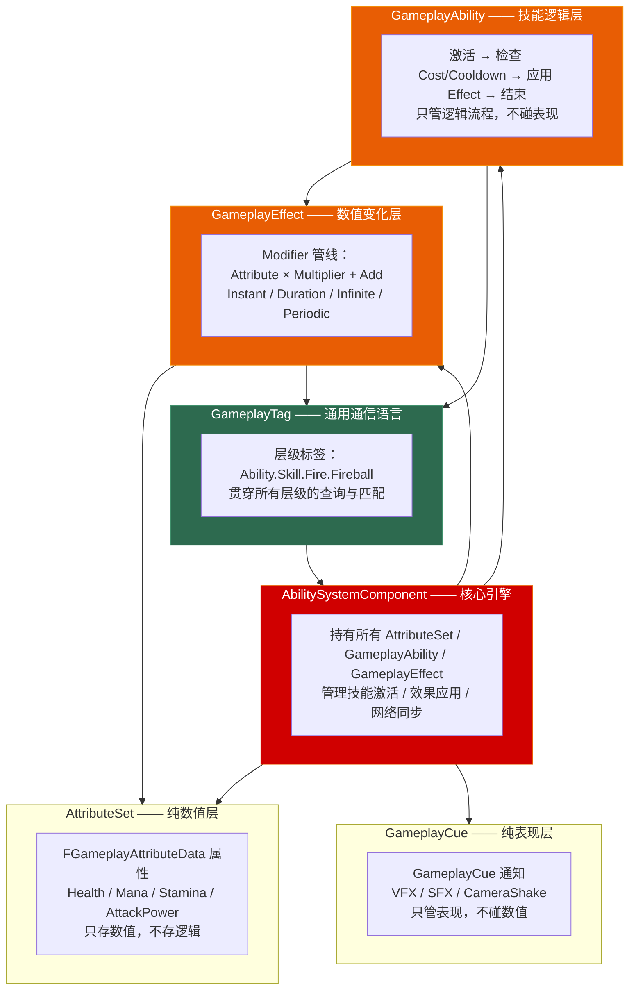
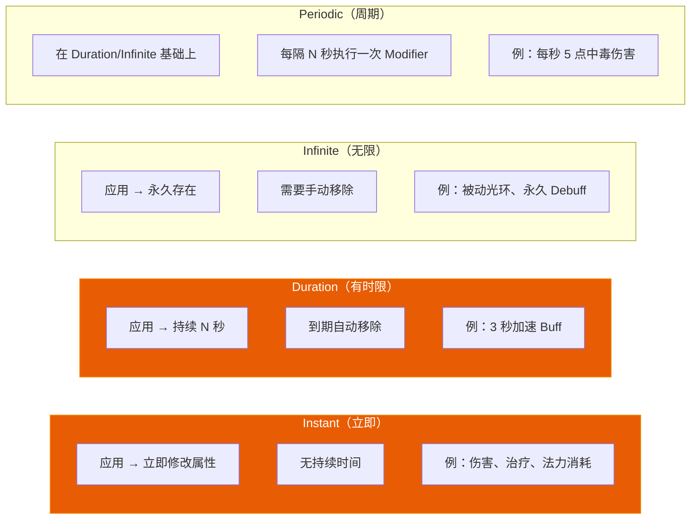

# 第十四章 GAS 技能系统：从架构全景到网络预测

> **一句话理解**：GAS（GameplayAbilitySystem）是 Epic 为《堡垒之夜》开发的技能系统框架——它不是"一个类"，而是 **ASC + AttributeSet + GameplayAbility + GameplayEffect + GameplayCue + GameplayTag** 六层架构的精密协作。这套系统的核心哲学是 **"数据驱动 + 表现分离"**：AttributeSet 管数值、GameplayEffect 管变化、GameplayAbility 管逻辑、GameplayCue 管特效——四者互不耦合，通过 GameplayTag 作为通用语言通信。理解这六层各自的分工和它们的协作模式，是 GAS 面试的及格线。

---

## 14.1 概念直觉 —— GAS 为什么长这样？

### 14.1.1 传统技能系统的死亡螺旋

```cpp
// ===== 没有 GAS 时，一个"火球技能"长什么样？ =====

// ✗ 传统做法：所有逻辑塞进一个类
UCLASS()
class AFireballSkill_Bad : public AActor
{
    GENERATED_BODY()

public:
    // ---- 数值逻辑 ----
    float Damage;
    float ManaCost;
    float CooldownTime;

    // ---- 表现逻辑 ----
    UPROPERTY()
    TObjectPtr<UParticleSystem> VFX;

    UPROPERTY()
    TObjectPtr<USoundCue> SFX;

    // ---- 状态管理 ----
    bool bIsOnCooldown;
    float CooldownRemaining;

    // ---- 网络同步 ----
    UPROPERTY(Replicated)
    bool bIsActive;

    void Cast()
    {
        // 检查法力 → 扣除法力 → 造成伤害 → 播放特效 → 进入冷却
        // 300 行代码全在一个函数里——策划改伤害值要改 C++！
    }
};
// 问题：
// - 数值（Damage/ManaCost）散落在代码里，策划改不了
// - 表现（VFX/SFX）和逻辑（伤害计算）硬耦合——换个特效要改技能类
// - 冷却逻辑每个技能都要重新实现
// - 网络同步靠手写 Replicated + RPC——极易出错
```

### 14.1.2 GAS 六层架构全景



```cpp
// ===== GAS 六层架构一句话总结 =====
//
// GameplayTag —— "技能系统的 HTTP 协议"——所有通信都通过标签
//   → 用层级命名（Ability.Skill.Fire.Fireball）建立全局命名空间
//   → 任何组件可以通过标签查询/匹配，无需知道对方的具体类型
//
// AbilitySystemComponent —— "技能系统的 CPU"
//   → 每个需要技能的 Actor 挂一个 ASC（通常在 PlayerState 或 Character 上）
//   → 管理 Ability 的激活/取消、Effect 的应用/移除、网络复制
//
// AttributeSet —— "技能系统的内存"
//   → 存所有数值：Health、Mana、Stamina、AttackPower、Speed...
//   → 不包含行为——数值如何变化由 GameplayEffect 决定
//
// GameplayEffect —— "数值变化的配方"
//   → 定义一个"数值变化"：哪个属性、怎么变、持续多久
//   → 四种类型：Instant（立即）/ Duration（持续）/ Infinite（永久）/ Periodic（周期）
//
// GameplayAbility —— "技能的执行流程"
//   → 激活时检查 Cost/Cooldown → 应用 Effect → 结束或持续
//   → 只管逻辑流程：检查条件 → 消耗资源 → 产生效果
//   → 不碰表现层——VFX/SFX 通过 GameplayCue 解耦
//
// GameplayCue —— "技能的表现层"
//   → 接收 GameplayCue 通知 → 播放 VFX、SFX、CameraShake
//   → 完全与数值逻辑解耦——换个特效不需要改技能代码
```

---

## 14.2 AbilitySystemComponent —— 技能系统的 CPU

### 14.2.1 ASC 应该放在哪？

```cpp
// ===== ASC 的归属决策 =====
//
// 这是 GAS 的第一个架构决策——ASC 挂在哪里？
//
// 方案 A：ASC 在 PlayerState 上（Epic 官方推荐）
//   ✓ 网络复制天然正确——PlayerState 跨关卡持久存在
//   ✓ 死亡/重生时数据不丢失（PlayerState 生命周期 = 连接生命周期）
//   ✓ 适合大多数游戏——MOBA、RPG、射击游戏
//
// 方案 B：ASC 在 Character/Pawn 上
//   ✓ 简单直观——技能属于角色
//   ✗ 死亡/重生时可能需要迁移或重建 ASC
//   ✗ 网络复制需要额外处理
//   适合：简单游戏、单机游戏、快速原型
//
// 方案 C：ASC 在 PlayerController 上
//   不推荐——PlayerController 不适合承载属性数据

// ---------- 方案 A 实现（推荐） ----------
UCLASS()
class AMyPlayerState : public APlayerState
{
    GENERATED_BODY()

public:
    AMyPlayerState()
    {
        // PlayerState 上创建 ASC
        AbilitySystem = CreateDefaultSubobject<UAbilitySystemComponent>(
            TEXT("AbilitySystem"));
        AbilitySystem->SetIsReplicated(true);        // 开启网络复制
        AbilitySystem->SetReplicationMode(           // 设置复制模式
            EGameplayEffectReplicationMode::Mixed);   // Mixed = 推荐
    }

    // 注意：在 PlayerState 上时，ASC 的 Owner 和 Avatar 需要正确设置
    // Owner = PlayerState（拥有者）
    // Avatar = Character（物理化身——执行动画、显示特效的实际 Actor）

    UPROPERTY(VisibleAnywhere, BlueprintReadOnly)
    TObjectPtr<UAbilitySystemComponent> AbilitySystem;
};

// ---------- 角色侧：访问 ASC ----------
UCLASS()
class AMyCharacter : public ACharacter, public IAbilitySystemInterface
{
    GENERATED_BODY()

public:
    // 实现 IAbilitySystemInterface —— GAS 标准接口
    virtual UAbilitySystemComponent* GetAbilitySystemComponent() const override
    {
        if (AMyPlayerState* PS = GetPlayerState<AMyPlayerState>())
        {
            return PS->AbilitySystem;
        }
        return nullptr;
    }
};
```

### 14.2.2 ASC 核心 API 速查

```cpp
// ===== ASC 的核心操作 =====

// ① 授予技能（Give Ability）
void GiveAbility(TSubclassOf<UGameplayAbility> AbilityClass)
{
    if (UAbilitySystemComponent* ASC = GetAbilitySystemComponent())
    {
        // 创建一个 GameplayAbilitySpec —— 技能的"实例描述"
        FGameplayAbilitySpecHandle Handle = ASC->GiveAbility(
            FGameplayAbilitySpec(
                AbilityClass,           // 技能类
                1,                      // 等级
                INDEX_NONE,             // InputID（-1 = 不绑定输入）
                this                    // SourceObject
            )
        );
    }
}

// ② 激活技能
bool TryActivateAbility(FGameplayAbilitySpecHandle Handle)
{
    if (UAbilitySystemComponent* ASC = GetAbilitySystemComponent())
    {
        return ASC->TryActivateAbility(Handle);
    }
    return false;
}

// ③ 按标签激活
bool TryActivateAbilityByTag(FGameplayTagContainer AbilityTags)
{
    if (UAbilitySystemComponent* ASC = GetAbilitySystemComponent())
    {
        return ASC->TryActivateAbilityByTag(AbilityTags);
    }
    return false;
}

// ④ 应用 GameplayEffect
void ApplyEffect(TSubclassOf<UGameplayEffect> EffectClass, float Level = 1.0f)
{
    if (UAbilitySystemComponent* ASC = GetAbilitySystemComponent())
    {
        FGameplayEffectContextHandle Context = ASC->MakeEffectContext();
        Context.AddSourceObject(this);

        FGameplayEffectSpecHandle Spec = ASC->MakeOutgoingSpec(
            EffectClass, Level, Context);

        if (Spec.IsValid())
        {
            ASC->ApplyGameplayEffectSpecToSelf(*Spec.Data.Get());
        }
    }
}

// ⑤ 获取属性值
float GetAttributeValue(FGameplayAttribute Attribute) const
{
    if (const UAbilitySystemComponent* ASC = GetAbilitySystemComponent())
    {
        return ASC->GetNumericAttribute(Attribute);
    }
    return 0.0f;
}
```

---

## 14.3 GameplayTag —— GAS 的通用通信语言

### 14.3.1 标签层级体系

```cpp
// ===== GameplayTag：层级命名 + 模糊匹配 =====
//
// GameplayTag 不是枚举！它是以 "." 分隔的层级字符串：
//
// Ability.Skill.Fire.Fireball      ← 最具体
// Ability.Skill.Fire               ← 父标签（匹配所有火系技能）
// Ability.Skill                    ← 更上级
// Ability                          ← 最上级
//
// 核心能力：RequestGameplayTagChildren / MatchesTag ——
//   "给我所有火系技能" → 查询 Ability.Skill.Fire 的子标签

// ---------- 定义 GameplayTag ----------
// 方法 1：在 DefaultGameplayTags.ini 中定义（推荐）
// [/Script/GameplayTags.GameplayTagsSettings]
// +GameplayTagList=(Tag="Ability.Skill.Fire.Fireball",DevComment="火球术")

// 方法 2：C++ 中注册
namespace MyGameplayTags
{
    // 在 .cpp 中定义
    UE_DEFINE_GAMEPLAY_TAG(TAG_Ability_Fire_Fireball, "Ability.Skill.Fire.Fireball");
    UE_DEFINE_GAMEPLAY_TAG(TAG_State_Debuff_Burning, "State.Debuff.Burning");
    UE_DEFINE_GAMEPLAY_TAG(TAG_State_Cooldown_Fire,  "State.Cooldown.Fire");
    UE_DEFINE_GAMEPLAY_TAG(TAG_Event_Damage_Fire,     "Event.Damage.Fire");

    // 在 .h 中声明
    extern UE_DECLARE_GAMEPLAY_TAG_EXTERN(TAG_Ability_Fire_Fireball);
    extern UE_DECLARE_GAMEPLAY_TAG_EXTERN(TAG_State_Debuff_Burning);
    extern UE_DECLARE_GAMEPLAY_TAG_EXTERN(TAG_State_Cooldown_Fire);
    extern UE_DECLARE_GAMEPLAY_TAG_EXTERN(TAG_Event_Damage_Fire);
}

// ---------- GameplayTag 的核心操作 ----------
void GameplayTagOperations()
{
    FGameplayTag FireballTag = MyGameplayTags::TAG_Ability_Fire_Fireball;
    FGameplayTag FireTag    = FGameplayTag::RequestGameplayTag(
        TEXT("Ability.Skill.Fire"));
    FGameplayTag DebuffTag  = MyGameplayTags::TAG_State_Debuff_Burning;

    // ① 精确匹配
    bool bIsFireball = FireballTag.MatchesTagExact(
        FGameplayTag::RequestGameplayTag(TEXT("Ability.Skill.Fire.Fireball")));

    // ② 模糊匹配——Fireball 也是 Fire 的一种
    bool bIsFireSkill = FireballTag.MatchesTag(FireTag);  // true！

    // ③ 查询子标签
    FGameplayTagContainer AllFireSkills;
    AllFireSkills.AddTag(FireTag);
    // 然后用 HasAny / HasAll 匹配

    // ④ GameplayTagContainer
    FGameplayTagContainer MyTags;
    MyTags.AddTag(FireballTag);
    MyTags.AddTag(DebuffTag);

    // 有没有火系标签？
    bool bHasFire = MyTags.HasTag(FireTag);  // true（Fireball 匹配 Fire）
}

// ---------- GameplayTag 的最佳命名规范 ----------
// Ability.Skill.{Element}.{Name}    —— 技能标签
// State.Buff.{Name}                 —— Buff 状态
// State.Debuff.{Name}               —— Debuff 状态
// State.Cooldown.{Name}             —— 冷却状态
// Event.Damage.{Type}               —— 伤害事件
// GameplayCue.{Name}                —— 表现触发
//
// 规范不是强制——但让你的团队能快速理解标签的含义
```

---

## 14.4 AttributeSet —— 纯数值层

### 14.4.1 属性定义与初始化

```cpp
// ===== AttributeSet 的定义 =====
UCLASS()
class UMyAttributeSet : public UAttributeSet
{
    GENERATED_BODY()

public:
    // ---------- 基础属性 ----------
    UPROPERTY(BlueprintReadOnly, ReplicatedUsing = OnRep_Health,
              Category = "Vital")
    FGameplayAttributeData Health;
    ATTRIBUTE_ACCESSORS(UMyAttributeSet, Health)  // ← 自动生成 Get/Set/Init

    UPROPERTY(BlueprintReadOnly, ReplicatedUsing = OnRep_MaxHealth,
              Category = "Vital")
    FGameplayAttributeData MaxHealth;
    ATTRIBUTE_ACCESSORS(UMyAttributeSet, MaxHealth)

    UPROPERTY(BlueprintReadOnly, ReplicatedUsing = OnRep_Mana,
              Category = "Vital")
    FGameplayAttributeData Mana;
    ATTRIBUTE_ACCESSORS(UMyAttributeSet, Mana)

    UPROPERTY(BlueprintReadOnly, ReplicatedUsing = OnRep_MaxMana,
              Category = "Vital")
    FGameplayAttributeData MaxMana;
    ATTRIBUTE_ACCESSORS(UMyAttributeSet, MaxMana)

    // ---------- 战斗属性 ----------
    UPROPERTY(BlueprintReadOnly, ReplicatedUsing = OnRep_AttackPower,
              Category = "Combat")
    FGameplayAttributeData AttackPower;
    ATTRIBUTE_ACCESSORS(UMyAttributeSet, AttackPower)

    UPROPERTY(BlueprintReadOnly, ReplicatedUsing = OnRep_Defense,
              Category = "Combat")
    FGameplayAttributeData Defense;
    ATTRIBUTE_ACCESSORS(UMyAttributeSet, Defense)

    UPROPERTY(BlueprintReadOnly, ReplicatedUsing = OnRep_MoveSpeed,
              Category = "Combat")
    FGameplayAttributeData MoveSpeed;
    ATTRIBUTE_ACCESSORS(UMyAttributeSet, MoveSpeed)

    // ---------- ReplicatedUsing 回调 ----------
    UFUNCTION()
    void OnRep_Health(const FGameplayAttributeData& OldValue)
    {
        GAMEPLAYATTRIBUTE_REPNOTIFY(UMyAttributeSet, Health, OldValue);
    }

    UFUNCTION()
    void OnRep_MaxHealth(const FGameplayAttributeData& OldValue)
    {
        GAMEPLAYATTRIBUTE_REPNOTIFY(UMyAttributeSet, MaxHealth, OldValue);
    }

    UFUNCTION()
    void OnRep_Mana(const FGameplayAttributeData& OldValue)
    {
        GAMEPLAYATTRIBUTE_REPNOTIFY(UMyAttributeSet, Mana, OldValue);
    }

    UFUNCTION()
    void OnRep_MaxMana(const FGameplayAttributeData& OldValue)
    {
        GAMEPLAYATTRIBUTE_REPNOTIFY(UMyAttributeSet, MaxMana, OldValue);
    }

    UFUNCTION()
    void OnRep_AttackPower(const FGameplayAttributeData& OldValue)
    {
        GAMEPLAYATTRIBUTE_REPNOTIFY(UMyAttributeSet, AttackPower, OldValue);
    }

    UFUNCTION()
    void OnRep_Defense(const FGameplayAttributeData& OldValue)
    {
        GAMEPLAYATTRIBUTE_REPNOTIFY(UMyAttributeSet, Defense, OldValue);
    }

    UFUNCTION()
    void OnRep_MoveSpeed(const FGameplayAttributeData& OldValue)
    {
        GAMEPLAYATTRIBUTE_REPNOTIFY(UMyAttributeSet, MoveSpeed, OldValue);
    }

    // ---------- 网络复制注册 ----------
    virtual void GetLifetimeReplicatedProps(
        TArray<FLifetimeProperty>& OutLifetimeProps) const override
    {
        Super::GetLifetimeReplicatedProps(OutLifetimeProps);

        DOREPLIFETIME_CONDITION_NOTIFY(UMyAttributeSet, Health,
            COND_None, REPNOTIFY_Always);
        DOREPLIFETIME_CONDITION_NOTIFY(UMyAttributeSet, MaxHealth,
            COND_None, REPNOTIFY_Always);
        DOREPLIFETIME_CONDITION_NOTIFY(UMyAttributeSet, Mana,
            COND_None, REPNOTIFY_Always);
        DOREPLIFETIME_CONDITION_NOTIFY(UMyAttributeSet, MaxMana,
            COND_None, REPNOTIFY_Always);
        DOREPLIFETIME_CONDITION_NOTIFY(UMyAttributeSet, AttackPower,
            COND_None, REPNOTIFY_Always);
        DOREPLIFETIME_CONDITION_NOTIFY(UMyAttributeSet, Defense,
            COND_None, REPNOTIFY_Always);
        DOREPLIFETIME_CONDITION_NOTIFY(UMyAttributeSet, MoveSpeed,
            COND_None, REPNOTIFY_Always);
    }
};
```

### 14.4.2 Clamping —— 属性值的约束

```cpp
// ===== PreAttributeChange vs PreAttributeBaseChange vs PostGameplayEffectExecute =====
//
// 这是 GAS 最易混淆的三个回调——很多人把 Clamping 放在错误的地方导致数据溢出：
//
// PreAttributeBaseChange：
//   - 在属性的**基础值（Base Value）**被修改之前调用
//   - 用于对基础值做 Clamping——例如装备变动导致 Base MaxHealth 变更时
//   - 只拦截直接修改 Base Value 的操作（如 Instant GE 以 Override 方式设置 Base）
//
// PreAttributeChange：
//   - 在属性的**当前值（Current Value）**被修改之前调用
//   - ⚠️ 致命误区：Duration/Infinite GE 的 Modifier 修改的是 Current Value，
//     但这些临时 Modifier 会**完全绕过** PreAttributeChange！
//     在 PreAttributeChange 中 Clamp 持续性 Buff 的溢出——根本拦截不到！
//   - ⚠️ 更致命的时序漏洞：当 MaxHealth 因 Buff 变化时，
//     Health 的 PreAttributeChange **不会被触发**——如果 MaxHealth 瞬间暴跌，
//     当前 Health 卡在超过上限的非法值，产生恶性 Bug！
//
// PostGameplayEffectExecute：
//   - 在 GameplayEffect **执行完毕**后调用
//   - **这里才是做 Current Value 最终钳制的正确位置**（针对 Instant/Periodic GE）
//   - 同时触发游戏逻辑——死亡检测、UI 更新
//   - 持续性的 Duration/Infinite GE 的 Current Value 约束，
//     需要通过重写属性的计算通道或自定义 MMC 来动态钳制
//
// ✓ 现代 UE5 正确分层：
//   PreAttributeBaseChange  → 基础值 Clamping（装备/等级变动）
//   PostGameplayEffectExecute → Instant GE 的最终值钳制 + 游戏逻辑触发

void UMyAttributeSet::PreAttributeBaseChange(const FGameplayAttribute& Attribute,
                                               float& NewBaseValue) const
{
    Super::PreAttributeBaseChange(Attribute, NewBaseValue);

    // 基础值的 Clamping —— 装备/等级变动导致的 Base Value 变更
    if (Attribute == GetHealthAttribute())
    {
        NewBaseValue = FMath::Clamp(NewBaseValue, 0.0f, GetMaxHealth());
    }
    else if (Attribute == GetMaxHealthAttribute())
    {
        NewBaseValue = FMath::Max(NewBaseValue, 1.0f);  // MaxHealth 不能为 0
    }
}

void UMyAttributeSet::PreAttributeChange(const FGameplayAttribute& Attribute,
                                          float& NewValue)
{
    Super::PreAttributeChange(Attribute, NewValue);

    // ⚠️ PreAttributeChange 对 Duration/Infinite GE 的 Modifier 完全无效
    //    这里的 Clamp 只在 Base Value 的直接修改时才触发
    //    大多数情况下这个回调几乎不做事——Clamp 逻辑已移到 PostGameplayEffectExecute
}

void UMyAttributeSet::PostGameplayEffectExecute(
    const FGameplayEffectModCallbackData& Data)
{
    Super::PostGameplayEffectExecute(Data);

    // Data.EvaluatedData.Attribute — 被修改的属性
    // Data.EvaluatedData.Magnitude — 修改的量值

    if (Data.EvaluatedData.Attribute == GetHealthAttribute())
    {
        // ✓ 在这里做 Instant GE 的 Current Value 最终钳制
        //   因为 Duration/Infinite GE 的 Modifier 会绕过 PreAttributeChange
        //   PostGameplayEffectExecute 是拦截 Instant GE 导致超限的最后防线
        float ClampedHealth = FMath::Clamp(GetHealth(), 0.0f, GetMaxHealth());
        if (ClampedHealth != GetHealth())
        {
            SetHealth(ClampedHealth);  // 强制修正到合法范围
        }

        // 触发游戏逻辑——健康值变化后的处理
        if (GetHealth() <= 0.0f)
        {
            // 角色死亡——通知 GameMode 或 Ability
            OnCharacterDeath();

            // 移除所有 Buff/Debuff
            if (UAbilitySystemComponent* ASC = Data.Target.GetOwner()
                ? Data.Target.GetOwner()->FindComponentByClass<
                      UAbilitySystemComponent>()
                : nullptr)
            {
                // 移除所有 GameplayEffect
            }
        }

        // 更新 HUD
        OnHealthChangedDelegate.Broadcast(GetHealth(), GetMaxHealth());
    }
    else if (Data.EvaluatedData.Attribute == GetManaAttribute())
    {
        OnManaChangedDelegate.Broadcast(GetMana(), GetMaxMana());
    }
}

// 事件委托——供 UI 绑定
DECLARE_MULTICAST_DELEGATE_TwoParams(FOnAttributeChanged, float, float);
FOnAttributeChanged OnHealthChangedDelegate;
FOnAttributeChanged OnManaChangedDelegate;
```

### 14.4.3 AttributeSet 的初始化 — Meta Attribute

```cpp
// ===== Meta Attribute —— 不持久化、不网络复制的"临时属性" =====
//
// 场景：伤害计算需要"本次攻击的暴击率"——但这个值不是角色的永久属性
// 解决：用 Meta Attribute——只在当前 GE 执行期间存在的临时变量

UCLASS()
class UMyAttributeSet : public UAttributeSet
{
public:
    // ---- 正常属性（持久化 + 网络复制） ----
    UPROPERTY(BlueprintReadOnly, ReplicatedUsing = OnRep_Health)
    FGameplayAttributeData Health;
    ATTRIBUTE_ACCESSORS(UMyAttributeSet, Health)

    // ---- Meta Attribute（临时属性——不复制，不持久化） ----
    UPROPERTY(BlueprintReadOnly)
    FGameplayAttributeData IncomingDamage;   // 本次受到的原始伤害
    ATTRIBUTE_ACCESSORS(UMyAttributeSet, IncomingDamage)

    UPROPERTY(BlueprintReadOnly)
    FGameplayAttributeData CritChance;       // 本次攻击的暴击率
    ATTRIBUTE_ACCESSORS(UMyAttributeSet, CritChance)
};

// GE 执行流程中使用 Meta Attribute：
// 1. GE Modifier 计算 IncomingDamage = BaseDamage × CritMultiplier
// 2. PostGameplayEffectExecute 中读取 IncomingDamage
// 3. 应用护甲减免 → 最终 Damage → 修改 Health
// 4. IncomingDamage 在下一帧被重置（不持久化）
```

---

## 14.5 GameplayEffect —— 数值变化的核心管线

### 14.5.1 四种 GE 类型对比



```cpp
// ===== GameplayEffect 的数据结构（蓝图中配置，C++ 中定义） =====
//
// GE 不是 C++ 类——而是蓝图 DataAsset！
// 你在 C++ 中定义的是 AttributeSet 和 Ability，
// GE 则在编辑器中通过蓝图编辑器的表单配置：
//
// ┌─────────────────────────────────────────────────┐
// │ GameplayEffect 蓝图编辑器 - FireDamage           │
// ├─────────────────────────────────────────────────┤
// │ Duration Policy: Instant                        │
// │                                                 │
// │ Modifiers:                                      │
// │   [0] Attribute: UMyAttributeSet.Health          │
// │       ModifierOp: Add                            │
// │       Magnitude: -25.0  (Scalable Float)         │
// │       SourceTags: Require (None)                 │
// │       TargetTags: Require (None)                 │
// │                                                 │
// │ GameplayEffect Tags:                             │
// │   AssetTags: Effect.Damage.Fire                  │
// │   GrantedTags: State.OnFire (Duration GE 专用)   │
// │                                                 │
// │ Stacking:                                       │
// │   StackingType: AggregateByTarget                │
// │   StackLimitCount: 3                             │
// │   StackDurationRefreshPolicy: RefreshOnSuccess   │
// │                                                 │
// │ Overflow (溢出效果):                             │
// │   OverflowEffects: [HealOverflowEffect]          │
// │   (如果血量已被扣到 <=0，溢出的伤害转为治疗)       │
// │                                                 │
// │ Execution:                                      │
// │   CalculationClass: UMyDamageCalculation          │
// │   (自定义 C++ 计算类——见下文)                     │
// └─────────────────────────────────────────────────┘
```

### 14.5.2 Modifier 计算管线：ModifierOp + Magnitude

```cpp
// ===== Modifier 的类型与计算 =====
//
// GE 的核心是 Modifier —— 描述"哪个属性、怎么变、变多少"
//
// ModifierOp（操作类型）：
//   Add           → Attribute += Magnitude
//   Multiply      → Attribute *= Magnitude
//   Override      → Attribute  = Magnitude（直接覆盖）
//   Divide        → Attribute /= Magnitude
//
// Magnitude（量值来源）：
//   ScalableFloat        → 固定值（如 25.0 伤害）
//   AttributeBased       → 基于另一个属性的值（如 AttackPower × 1.5）
//   CustomCalculationClass → 自定义 C++ 计算类
//   SetByCaller          → 运行时传入的值（最灵活）
//

// ---------- 自定义 Calculation 类（MMC） ----------
UCLASS()
class UDamageCalculation : public UGameplayModMagnitudeCalculation
{
    GENERATED_BODY()

public:
    // 捕获属性——从 Source 和目标获取
    FGameplayEffectAttributeCaptureDefinition AttackPowerDef;

    UDamageCalculation()
    {
        // 捕获来源的攻击力
        AttackPowerDef.AttributeToCapture =
            UMyAttributeSet::GetAttackPowerAttribute();
        AttackPowerDef.AttributeSource =
            EGameplayEffectAttributeCaptureSource::Source;
        AttackPowerDef.bSnapshot = false;  // 不快照——实时读取

        RelevantAttributesToCapture.Add(AttackPowerDef);
    }

    virtual float CalculateBaseMagnitude_Implementation(
        const FGameplayEffectSpec& Spec) const override
    {
        // 获取捕获的属性值
        FAggregatorEvaluateParameters EvalParams;
        EvalParams.SourceTags = Spec.CapturedSourceTags.GetAggregatedTags();
        EvalParams.TargetTags = Spec.CapturedTargetTags.GetAggregatedTags();

        float AttackPower = 0.0f;
        GetCapturedAttributeMagnitude(AttackPowerDef, Spec, EvalParams, AttackPower);

        // 自定义计算：伤害 = 攻击力 × 技能倍率 × 暴击倍率
        float SkillMultiplier = Spec.GetSetByCallerMagnitude(
            FGameplayTag::RequestGameplayTag(TEXT("Data.SkillMultiplier")),
            false, 1.0f);

        float CritMultiplier = Spec.GetSetByCallerMagnitude(
            FGameplayTag::RequestGameplayTag(TEXT("Data.CritMultiplier")),
            false, 1.0f);

        return AttackPower * SkillMultiplier * CritMultiplier;
    }
};

// ---------- SetByCaller —— 运行时动态传参 ----------
void ApplyDamageWithSetByCaller(float BaseDamage, float CritChance)
{
    FGameplayEffectSpecHandle Spec = ASC->MakeOutgoingSpec(
        DamageGEClass, 1.0f, ASC->MakeEffectContext());

    // 运行时设置 Magnitude —— 策划可以在技能中动态计算
    Spec.Data->SetSetByCallerMagnitude(
        FGameplayTag::RequestGameplayTag(TEXT("Data.SkillMultiplier")),
        BaseDamage);
    Spec.Data->SetSetByCallerMagnitude(
        FGameplayTag::RequestGameplayTag(TEXT("Data.CritMultiplier")),
        FMath::FRand() < CritChance ? 2.0f : 1.0f);

    ASC->ApplyGameplayEffectSpecToSelf(*Spec.Data.Get());
}
```

### 14.5.3 Stacking（堆叠）与 Overflow（溢出）

```cpp
// ===== GE 堆叠机制 =====
//
// 场景：同一个中毒效果可以堆叠 3 层——每层每秒 5 伤害
//
// StackingType：
//   None                       → 不堆叠——每个 GE 独立
//   AggregateBySource          → 同一来源的效果堆叠
//   AggregateByTarget          → 同一目标上的效果堆叠（最常用）
//
// StackDurationRefreshPolicy：
//   RefreshOnSuccess           → 堆叠成功时刷新持续时间
//   NeverRefresh               → 不刷新——每层独立倒计时

// ===== Overflow 机制 —— 效果过载时触发其他效果 =====
//
// 场景：血量低于 25% → 治疗效果翻倍
//      中毒层数达到 3 → 触发爆发伤害

// 在 GE 蓝图中配置：
// OverflowEffects: 添加一个 ExecuteOnOverflow GE
// StackLimitCount: 3（堆到 3 层时触发溢出效果）
```

---

## 14.6 GameplayAbility —— 技能逻辑层

### 14.6.1 技能的定义与激活流程

```cpp
// ===== GameplayAbility 的最小定义 =====
UCLASS()
class UFireballAbility : public UGameplayAbility
{
    GENERATED_BODY()

public:
    UFireballAbility()
    {
        // 技能的网络执行策略
        // LocalPredicted —— 本地预测（客户端先行，服务器校验）
        // LocalOnly       —— 纯本地（单机技能）
        // ServerInitiated —— 仅服务器发起
        // ServerOnly      —— 仅服务器执行
        InstancingPolicy = EGameplayAbilityInstancingPolicy::InstancedPerActor;

        // 网络执行策略
        NetExecutionPolicy = EGameplayAbilityNetExecutionPolicy::LocalPredicted;

        // 输入按键绑定
        AbilityTags.AddTag(
            FGameplayTag::RequestGameplayTag(TEXT("Ability.Skill.Fire.Fireball")));

        // 激活时自身会被添加的标签（用于其他系统检测）
        ActivationOwnedTags.AddTag(
            FGameplayTag::RequestGameplayTag(TEXT("State.Casting.Fireball")));

        // 激活期间阻止的标签
        BlockAbilitiesWithTag.AddTag(
            FGameplayTag::RequestGameplayTag(TEXT("State.Stunned")));
        BlockAbilitiesWithTag.AddTag(
            FGameplayTag::RequestGameplayTag(TEXT("State.Dead")));

        // 激活时取消的技能
        CancelAbilitiesWithTag.AddTag(
            FGameplayTag::RequestGameplayTag(TEXT("State.Casting")));
    }

    // 技能激活
    virtual void ActivateAbility(
        const FGameplayAbilitySpecHandle Handle,
        const FGameplayAbilityActorInfo* ActorInfo,
        const FGameplayAbilityActivationInfo ActivationInfo,
        const FGameplayEventData* TriggerEventData) override
    {
        if (!CommitAbility(Handle, ActorInfo, ActivationInfo))
        {
            // Cost 或 Cooldown 检查失败 → 取消激活
            EndAbility(Handle, ActorInfo, ActivationInfo, true, false);
            return;
        }

        // ---- 技能逻辑开始 ----

        // 1. 获取 Actor 信息
        AActor* Avatar = ActorInfo->AvatarActor.Get();
        APlayerController* PC = ActorInfo->PlayerController.Get();

        // 2. 计算目标位置（从玩家视角做射线检测）
        FVector AimLocation;
        if (!GetAimLocation(AimLocation))
        {
            EndAbility(Handle, ActorInfo, ActivationInfo, true, true);
            return;
        }

        // 3. 生成火球投射物
        // ⚠️ 关键！此技能设置了 LocalPredicted → ActivateAbility 会在客户端和服务器各执行一次
        //    如果两边都 SpawnActor → 客户端出现两个重叠火球（预测实体 + 服务器复制实体）
        //    ✓ 正确做法 A：只在服务器生成权威的复制 Actor
        //    ✓ 正确做法 B：使用 UAbilityTask_SpawnActor —— GAS 专用的预测安全生成
        if (HasAuthority())
        {
            FActorSpawnParameters SpawnParams;
            SpawnParams.Owner = Avatar;
            SpawnParams.Instigator = Cast<APawn>(Avatar);

            AFireballProjectile* Projectile = GetWorld()->SpawnActor<AFireballProjectile>(
                FireballClass,
                Avatar->GetActorLocation() + Avatar->GetActorForwardVector() * 100.0f,
                AimLocation.Rotation(),
                SpawnParams);

            if (Projectile)
            {
                // 将 GE Spec 传给投射物——命中时应用
                Projectile->DamageEffectSpec = MakeOutgoingGameplayEffectSpec(
                    DamageGEClass, GetAbilityLevel());
            }
        }

        // 4. 结束技能
        EndAbility(Handle, ActorInfo, ActivationInfo, true, false);
    }

    // 技能结束
    virtual void EndAbility(
        const FGameplayAbilitySpecHandle Handle,
        const FGameplayAbilityActorInfo* ActorInfo,
        const FGameplayAbilityActivationInfo ActivationInfo,
        bool bReplicateEndAbility,
        bool bWasCancelled) override
    {
        // 清理技能状态
        Super::EndAbility(Handle, ActorInfo, ActivationInfo,
                          bReplicateEndAbility, bWasCancelled);
    }

    UPROPERTY(EditDefaultsOnly, Category = "Fireball")
    TSubclassOf<UGameplayEffect> DamageGEClass;

    UPROPERTY(EditDefaultsOnly, Category = "Fireball")
    TSubclassOf<AFireballProjectile> FireballClass;
};
```

### 14.6.2 技能激活五阶段状态机

```cpp
// ===== GameplayAbility 的激活流程（五阶段状态机）=====
//
// ① CanActivateAbility —— 条件检查
//    检查 Cost（法力够不够）、Cooldown（是否冷却中）、Tags（是否被沉默/眩晕）
//    → 失败返回 false，技能不激活
//
// ② PreActivate —— 预激活
//    ASC 锁定技能槽（防止同一技能被重复激活）
//    标记 ActivationOwnedTags（如 "State.Casting.Fireball"）
//
// ③ CommitAbility —— 消耗资源
//    扣除 Cost GE（法力消耗）
//    启动 Cooldown GE（进入冷却）
//    → 失败则取消激活
//
// ④ ActivateAbility —— 核心逻辑
//    你的技能逻辑在这里——生成投射物、应用伤害、播放动画...
//    → 可以在此期间的任何时刻调用 EndAbility
//
// ⑤ EndAbility —— 清理
//    移除 ActivationOwnedTags
//    通知 ASC 技能已结束
//    清理技能内部状态

// ===== 技能之间的交互 =====
//
// 一个技能激活时，可以通过 Tag 策略影响其他技能：
//
// BlockAbilitiesWithTag：  持有 State.Stunned 时 → 阻止所有需要"非眩晕"的技能
// CancelAbilitiesWithTag： 持有 State.Casting 时 → 新技能激活时取消"正在施法"的技能
// ActivationRequiredTags：  必须持有某些标签才能激活（如"装备了法杖"）
// ActivationBlockedTags：   持有某些标签时不能激活（如"被沉默"）
```

### 14.6.3 技能的网络执行策略

```cpp
// ===== NetExecutionPolicy 详解 =====
//
// LocalPredicted（本地预测 —— 首选）：
//   客户端立即执行技能（预测），同时发 Server RPC
//   服务器也执行技能（权威）
//   如果服务器执行结果与客户端预测不同 → 服务器校正
//   适用：大多数伤害技能、移动技能——需要即时反馈
//
// LocalOnly（纯本地）：
//   只在客户端执行，不经过服务器
//   适用：纯表现技能（如本地特效）——不能修改权威数据
//
// ServerInitiated（服务器发起）：
//   只有服务器能激活这个技能
//   适用：AI 技能、环境伤害——客户端不应该主动触发
//
// ServerOnly（仅服务器）：
//   只在服务器上执行，不通知客户端
//   适用：纯服务器逻辑——如全局状态检查

// ===== InstancingPolicy 详解 =====
//
// InstancedPerActor（每个 Actor 一个实例 —— 推荐）：
//   每个 ASC 对此技能只有一个实例
//   技能可以保存状态（例如"持续施法"中的进度）
//
// InstancedPerExecution（每次执行一个新实例）：
//   每次激活创建新的技能实例
//   适用：无状态的瞬间技能（如瞬发伤害）
//
// NonInstanced（无实例 —— 不推荐）：
//   不创建实例——所有调用共享同一个 CDO
//   不能保存任何状态——极易出错
```

---

## 14.7 Cost 与 Cooldown —— 资源消耗与冷却体系

### 14.7.1 Cost 和 Cooldown 也是 GameplayEffect！

```cpp
// ===== GAS 核心设计：Cost 和 Cooldown 就是普通的 GE =====
//
// 这体现了 GAS 的设计哲学——"一切皆 GE"
// 法力消耗 = 一个 Instant GE —— Attribute: Mana, Op: Add, Magnitude: -50
// 冷却时间 = 一个 Duration GE —— 持续 N 秒，添加冷却 Tag 阻止技能激活
//
// 你不需要为每个技能写"消耗法力 + 检查冷却"代码——
// 只需在 Ability 蓝图或 C++ 中配置 Cost GE 和 Cooldown GE 的 Class

UCLASS()
class UFireballAbility : public UGameplayAbility
{
    GENERATED_BODY()

public:
    UFireballAbility()
    {
        // ---- Cost（消耗）----
        // CostGameplayEffectClass：激活时提交的 GE
        // 通常是一个 Instant GE：
        //   Modifier: Mana, Op: Add, Magnitude: -50.0
        //   含义：消耗 50 点法力

        // ---- Cooldown（冷却）----
        // CooldownGameplayEffectClass：激活时应用的 GE
        // 通常是一个 Duration GE：
        //   Duration: 5.0 秒
        //   GrantedTags: State.Cooldown.Fireball
        //   含义：5 秒内无法再次激活（因为 State.Cooldown.Fireball 被标记为
        //         ActivationBlockedTags）
    }

    // 通过 FGameplayAbilitySpec 传入动态 Cost 和 Cooldown
    // 例如：技能升级后，Cost 降低，Cooldown 缩短
};
```

### 14.7.2 冷却的三种实现策略对比

```cpp
// ===== 策略 1：单独 Cooldown GE（最常用） =====
// 每个技能一个独立的 Cooldown GE
// 冷却 Tag = State.Cooldown.{AbilityName}
// 优点：每个技能的冷却独立——互不影响
// 适用：大多数游戏

// ===== 策略 2：共用冷却组（Cooldown Group） =====
// 多个技能共享一个 Cooldown GE
// 冷却 Tag = State.Cooldown.Fire（所有火系技能共享）
// 优点：火球术进入冷却 → 火焰冲击也进入冷却
// 适用：需要 GCD（全局冷却）或技能组冷却的游戏

// ===== 策略 3：动态冷却时长 =====
// 通过 SetByCaller 在运行时决定冷却时长
void ApplyDynamicCooldown(float CooldownSeconds)
{
    FGameplayEffectSpecHandle Spec = ASC->MakeOutgoingSpec(
        CooldownGEClass, 1.0f, ASC->MakeEffectContext());

    Spec.Data->SetSetByCallerMagnitude(
        FGameplayTag::RequestGameplayTag(TEXT("Data.CooldownDuration")),
        CooldownSeconds);

    ASC->ApplyGameplayEffectSpecToSelf(*Spec.Data.Get());
}
```

---

## 14.8 GameplayCue —— 表现层完全解耦

### 14.8.1 GameplayCue 的通知机制

```cpp
// ===== GameplayCue：技能的 VFX/SFX 表现层 =====
//
// 核心理念：技能逻辑（Ability）不应该知道"火球长什么样"
//          — 表现层（Cue）不应该知道"伤害是多少"
// 通信方式：技能通过 ASC 发送 GameplayCue 事件，
//           GameplayCueManager 将事件路由到对应的 GameplayCue 处理器

// ---------- 触发 GameplayCue ----------
void UFireballAbility::ActivateAbility(...)
{
    // ... 技能逻辑 ...

    // 发送 GameplayCue 事件——告知表现层"播放火球施法特效"
    FGameplayCueParameters CueParams;
    CueParams.Location = GetAvatarActorFromActorInfo()->GetActorLocation();
    CueParams.Normal = GetAvatarActorFromActorInfo()->GetActorForwardVector();
    CueParams.EffectCauser = Cast<AActor>(GetAvatarActorFromActorInfo());

    // ⚠️ 不要直接调 K2_ExecuteGameplayCueWithParams —— 那是 UHT 为蓝图生成的胶水层
    //    C++ 原生代码应通过 ASC 的标准接口触发 GameplayCue
    if (UAbilitySystemComponent* ASC = GetAbilitySystemComponentFromActorInfo())
    {
        ASC->ExecuteGameplayCueLocal(
            FGameplayTag::RequestGameplayTag(
                TEXT("GameplayCue.Ability.Fire.Fireball.Cast")),
            CueParams);
    }
}

// ---------- GameplayCue 处理器 ----------
UCLASS()
class UGameplayCue_FireballCast : public UGameplayCueNotify_Static
{
    GENERATED_BODY()

public:
    // 立即执行（一次性效果——如施法闪光）
    virtual bool OnExecute_Implementation(
        AActor* MyTarget,
        const FGameplayCueParameters& Parameters) const override
    {
        // 在 MyTarget 的位置播放施法特效
        UGameplayStatics::SpawnEmitterAtLocation(
            MyTarget->GetWorld(),
            CastVFX,
            Parameters.Location,
            Parameters.Normal.Rotation());

        UGameplayStatics::PlaySoundAtLocation(
            MyTarget->GetWorld(),
            CastSFX,
            Parameters.Location);

        return true;  // 已处理
    }

    UPROPERTY(EditDefaultsOnly)
    TObjectPtr<UParticleSystem> CastVFX;

    UPROPERTY(EditDefaultsOnly)
    TObjectPtr<USoundCue> CastSFX;
};

// ---------- 持续性 GameplayCue（如持续燃烧效果） ----------
UCLASS()
class UGameplayCue_Burning : public UGameplayCueNotify_BurstLatent
{
    GENERATED_BODY()

public:
    // Burst：立即播放一次（着火瞬间的火焰爆发）
    virtual void OnBurst_Implementation(
        AActor* MyTarget,
        const FGameplayCueParameters& Parameters,
        const TArray<TObjectPtr<UParticleSystemComponent>>& ParticleComponents,
        const TArray<TObjectPtr<UAudioComponent>>& AudioComponents) const override
    {
        // 着火爆发特效
    }

    // Latent：持续播放（只要 GE 还在就一直在）
    virtual bool OnActive_Implementation(
        AActor* MyTarget,
        const FGameplayCueParameters& Parameters) const override
    {
        // 在目标上附加火焰粒子 → 随 GE 持续时间存在
        return true;
    }

    // 结束时的清理
    virtual bool OnRemove_Implementation(
        AActor* MyTarget,
        const FGameplayCueParameters& Parameters) const override
    {
        // 移除火焰粒子
        return true;
    }
};

// ===== GameplayCue 的触发方式 =====
//
// 方式 1：通过 GameplayEffect 的 GameplayCue 配置
//   在 GE 蓝图中添加 GameplayCue 标签
//   GE 应用时自动触发 OnExecute / OnActive
//   GE 移除时自动触发 OnRemove
//   → 最常用——"中毒效果 → 中毒表现"完全通过 Tag 自动匹配
//
// 方式 2：在 Ability 中手动触发
//   ASC->ExecuteGameplayCueLocal(Tag, Params) / ASC->AddGameplayCue(Tag, Params)
//   → 灵活——在技能流程的任意时刻触发特效（注意 C++ 中用原生接口，不要调 K2_ 胶水层）
//
// 方式 3：通过 ASC 手动触发
//   ASC->ExecuteGameplayCueLocal(Tag, Params)
```

---

## 14.9 网络预测与回滚 —— GAS 最复杂的部分

### 14.9.1 预测的核心机制

```cpp
// ===== GAS 的本地预测 =====
//
// 当一个技能设置了 NetExecutionPolicy = LocalPredicted：
//
// ① 客户端预测执行：
//    - 客户端立即激活技能（调用 ActivateAbility）
//    - 客户端预测性应用 Cost GE 和 Cooldown GE
//    - 玩家看到即时反馈——无延迟感
//
// ② 服务器权威执行：
//    - 服务器收到 RPC → 激活同样的技能
//    - 服务器执行相同的 Cost/Cooldown/Effect
//    - 如果服务器结果与预测不同 → 发送校正
//
// ③ 预测键（Prediction Key）：
//    - 每次预测生成一个唯一的 Prediction Key
//    - 服务器执行时回传同样的 Key
//    - 客户端用 Key 匹配"这是哪次预测的结果"
//    - 如果服务器拒绝 → 客户端回滚该 Key 对应的所有状态变化

// ===== 预测窗口（Prediction Window） =====
// 客户端在发送 RPC 后等待服务器确认的时间窗口
// 窗口内：继续预测（可以连续发送多次预测——如连击）
// 窗口外：停止预测（防止服务器拒绝后回滚代价太大）
// 默认窗口约等于 RTT × 2
```

### 14.9.2 Prediction Key 与回滚

```cpp
// ===== Prediction Key 的生命周期 =====
//
// ① 生成：客户端调用 TryActivateAbility → ASC 生成 Prediction Key
// ② 附加：Key 被附加到所有由此技能产生的 GE Spec 上
// ③ 发送：Key 随 Server RPC 发送给服务器
// ④ 执行：服务器用同样的 Key 执行技能
//         服务器上的 GE 也携带同样的 Key
// ⑤ 确认：服务器执行完成后，发送确认给客户端
//          确认携带 Key + 服务器执行结果
// ⑥ 匹配：客户端用 Key 找到对应的"预测记录"
//         如果服务器结果和预测一致 → 预测成功，清除记录
//         如果服务器结果和预测不一致 → 回滚该 Key 对应的所有变化
//
// ===== 什么情况下预测会失败？ =====
// 1. 服务器端的条件检查失败（如法力不够——客户端以为够但它算错了）
// 2. 服务器端的碰撞检测不同（如技能被墙壁阻挡——客户端没有准确的碰撞体）
// 3. 服务器端的属性值不同（如客户端以为攻击力 100，实际因 Debuff 只有 80）

// ===== 预测失败后的回滚行为 =====
// - Cost GE：回滚——法力恢复
// - Cooldown GE：回滚——冷却取消
// - Modifier GE：回滚——伤害取消
// - GameplayCue：客户端立即执行 / 回滚由 Tag 决定
//
// "可预测的 GameplayCue"用标签 GameplayCue.NotifyPredictionKey
// 预测失败时这些 Cue 会被移除
```

---

## 14.10 完整实战 —— 多人 RPG 技能系统

### 14.10.1 完整架构搭建

```cpp
// ===== 完整 GAS 架构初始化流程 =====
//
// 步骤 1：PlayerState 上创建 ASC + AttributeSet
// 步骤 2：服务器授予初始技能
// 步骤 3：初始化属性默认值
// 步骤 4：绑定输入到技能
// 步骤 5：绑定 UI 到属性变化的委托

// ---------- 初始化脚本 ----------
UCLASS()
class ARPGGameMode : public AGameModeBase
{
    GENERATED_BODY()

public:
    virtual void OnPostLogin(AController* NewPlayer) override
    {
        Super::OnPostLogin(NewPlayer);

        if (AMyPlayerState* PS = NewPlayer->GetPlayerState<AMyPlayerState>())
        {
            // 授予默认技能
            if (UAbilitySystemComponent* ASC = PS->AbilitySystem)
            {
                // 给所有玩家授予基础攻击技能
                ASC->GiveAbility(FGameplayAbilitySpec(
                    UBasicAttackAbility::StaticClass(), 1, INDEX_NONE, PS));

                // 给所有玩家授予火球技能
                ASC->GiveAbility(FGameplayAbilitySpec(
                    UFireballAbility::StaticClass(), 1, INDEX_NONE, PS));

                // 初始化属性
                if (UMyAttributeSet* AttrSet = ASC->GetAttributeSet<UMyAttributeSet>())
                {
                    // 应用初始化 GE——设置属性的基础值
                    FGameplayEffectContextHandle Context = ASC->MakeEffectContext();
                    FGameplayEffectSpecHandle InitSpec = ASC->MakeOutgoingSpec(
                        DefaultAttributeGEClass, 1.0f, Context);
                    ASC->ApplyGameplayEffectSpecToSelf(*InitSpec.Data.Get());
                }
            }
        }
    }

    UPROPERTY(EditDefaultsOnly)
    TSubclassOf<UGameplayEffect> DefaultAttributeGEClass;
};

// ---------- 绑定输入到技能 ----------
void AMyCharacter::SetupPlayerInputComponent(UInputComponent* PlayerInputComponent)
{
    Super::SetupPlayerInputComponent(PlayerInputComponent);

    if (UAbilitySystemComponent* ASC = GetAbilitySystemComponent())
    {
        // Enhanced Input 绑定到 GAS 技能
        if (UEnhancedInputComponent* EnhancedInput =
            Cast<UEnhancedInputComponent>(PlayerInputComponent))
        {
            // 左键 → 基础攻击
            EnhancedInput->BindAction(AttackAction, ETriggerEvent::Started,
                this, &AMyCharacter::OnAttackPressed);

            // Q 键 → 火球
            EnhancedInput->BindAction(FireballAction, ETriggerEvent::Started,
                this, &AMyCharacter::OnFireballPressed);
        }
    }
}

void AMyCharacter::OnAttackPressed()
{
    if (UAbilitySystemComponent* ASC = GetAbilitySystemComponent())
    {
        ASC->TryActivateAbilityByTag(
            FGameplayTagContainer(
                FGameplayTag::RequestGameplayTag(
                    TEXT("Ability.Skill.Melee.BasicAttack"))));
    }
}

void AMyCharacter::OnFireballPressed()
{
    if (UAbilitySystemComponent* ASC = GetAbilitySystemComponent())
    {
        ASC->TryActivateAbilityByTag(
            FGameplayTagContainer(
                FGameplayTag::RequestGameplayTag(
                    TEXT("Ability.Skill.Fire.Fireball"))));
    }
}

// ---------- UI 绑定属性变化 ----------
void UPlayerHUD::NativeConstruct()
{
    Super::NativeConstruct();

    if (AMyPlayerState* PS = GetOwningPlayerState<AMyPlayerState>())
    {
        if (UMyAttributeSet* AttrSet = PS->AbilitySystem->GetAttributeSet<UMyAttributeSet>())
        {
            // 绑定委托
            AttrSet->OnHealthChangedDelegate.AddUObject(
                this, &UPlayerHUD::OnHealthChanged);
            AttrSet->OnManaChangedDelegate.AddUObject(
                this, &UPlayerHUD::OnManaChanged);

            // ASC 还提供了属性变化的通用委托
            PS->AbilitySystem->GetGameplayAttributeValueChangeDelegate(
                UMyAttributeSet::GetHealthAttribute())
                .AddUObject(this, &UPlayerHUD::OnHealthAttributeChanged);
        }
    }
}
```

### 14.10.2 调试 GAS

```cpp
// ===== GAS 调试三板斧 =====

// ① showdebug abilitysystem —— 控制台命令
//    显示当前选中 Actor 的 ASC 状态：
//    - 所有已授予的 Ability 及其状态（Active / Cooldown / Blocked）
//    - 所有活跃的 GameplayEffect 及其剩余时间 / 堆叠层数
//    - 所有 Attribute 的当前值（含 Modifier 来源）

// ② 日志调试
void DebugAbilitySystem()
{
    if (UAbilitySystemComponent* ASC = GetAbilitySystemComponent())
    {
        // 打印所有属性 —— 遍历 ASC 持有的 AttributeSet
        // ⚠️ ASC 没有 GetAllAttributes() 扁平数组；属性分散在各个 AttributeSet 子类中
        //    正确做法：通过 GetAttributeSet<T>() 获取特定 AttributeSet，直接读其成员
        UE_LOG(LogGAS, Log, TEXT("=== Attributes ==="));
        if (const UMyAttributeSet* AS = ASC->GetAttributeSet<UMyAttributeSet>())
        {
            UE_LOG(LogGAS, Log, TEXT("  Health: %.1f / %.1f"),
                AS->GetHealth(), AS->GetMaxHealth());
            UE_LOG(LogGAS, Log, TEXT("  Mana: %.1f / %.1f"),
                AS->GetMana(), AS->GetMaxMana());
            UE_LOG(LogGAS, Log, TEXT("  AttackPower: %.1f"), AS->GetAttackPower());
        }

        // 打印所有活跃的 GE 句柄
        // ⚠️ ASC 的正确 API 是 GetActiveGameplayEffects()，返回 TArray<FActiveGameplayEffectHandle>
        UE_LOG(LogGAS, Log, TEXT("=== Active Effects ==="));
        FGameplayEffectQuery Query;
        TArray<FActiveGameplayEffectHandle> ActiveEffects =
            ASC->GetActiveGameplayEffects(Query);
        for (const FActiveGameplayEffectHandle& Handle : ActiveEffects)
        {
            if (const FActiveGameplayEffect* ActiveGE =
                ASC->GetActiveGameplayEffect(Handle))
            {
                UE_LOG(LogGAS, Log, TEXT("  %s — Remaining: %.1fs, StackCount: %d"),
                    *ActiveGE->Spec.Def->GetName(),
                    ActiveGE->GetTimeRemaining(),
                    ActiveGE->Spec.StackCount);
            }
        }

        // 打印所有技能状态
        UE_LOG(LogGAS, Log, TEXT("=== Abilities ==="));
        for (const FGameplayAbilitySpec& Spec : ASC->GetActivatableAbilities())
        {
            UE_LOG(LogGAS, Log, TEXT("  %s — Active: %d, Level: %d"),
                *Spec.Ability->GetName(), Spec.IsActive(), Spec.Level);
        }
    }
}

// ③ GameplayAbilitySystem 插件调试工具
// 在编辑器中：Window → Developer Tools → Gameplay Ability System
// 运行时：Window → Gameplay Ability System Debugger
// 显示完整的 GAS 状态树——比 showdebug 更详细

// ④ GAS 相关 console command：
//   abilitysystem.debug.abilityactivation 1    —— 打印技能激活日志
//   abilitysystem.debug.nexttarget              —— 循环切换调试目标
//   abilitysystem.debug.abilityfailure 1        —— 打印技能激活失败原因
```

---

## 14.11 常见陷阱与面试深度追问

### 14.11.1 GAS TOP 10 陷阱

```cpp
// ===== 陷阱 #1：忘记实现 IAbilitySystemInterface =====
class ABadCharacter : public ACharacter  // ✗ 没有 IAbilitySystemInterface！
{
    UPROPERTY()
    TObjectPtr<UAbilitySystemComponent> ASC;  // GAS 的很多系统依赖此接口
    // 引擎的某些 GAS 功能通过 Interface 查找 ASC——
    // 没有实现 → 静默失败，无编译错误，无运行时警告
};

// ===== 陷阱 #2：在 PreAttributeChange 中同时做 Clamping 和触发逻辑 =====
void UBadAttributeSet::PreAttributeChange(const FGameplayAttribute& Attribute,
                                            float& NewValue)
{
    // ✗ 双重错误：
    // ① Duration/Infinite GE 的 Modifier 完全绕过 PreAttributeChange——Clamp 无效
    // ② 触发游戏逻辑应放在 PostGameplayEffectExecute 中
    if (Attribute == GetHealthAttribute() && NewValue <= 0)
    {
        OnCharacterDeath();  // ← 错误！
    }
    // ✓ Base Value 的 Clamping → PreAttributeBaseChange
    // ✓ Current Value 的最终钳制 + 游戏逻辑触发 → PostGameplayEffectExecute
}

// ===== 陷阱 #3：混淆 LocalPredicted 和 LocalOnly =====
// ✗ 把需要服务器校验的伤害技能设为 LocalOnly
//    → 客户端直接扣血——作弊玩家一击秒杀全图
// ✓ 伤害技能必须设为 LocalPredicted 或 ServerOnly

// ===== 陷阱 #4：GE 的 Modifier 属性写错名 =====
// 在 GE 蓝图中：Modifier Attribute 选成了 "UMyAttributeSet.Health"
// 但实际 UPROPERTY 名字是 "HealthPoints" 
// → GE 应用成功但属性不变——没有任何错误提示！

// ===== 陷阱 #5：同时有多个 ASC 修改同一个属性 =====
// 场景：角色身上有一个 ASC，武器上也有一个 ASC
// 两个 ASC 都修改 Health
// → 修正预测冲突——回滚混乱
// ✓ 每个 Actor 只挂一个 ASC

// ===== 陷阱 #6：SetByCaller 的 Tag 不匹配 =====
void ApplyEffect()
{
    FGameplayEffectSpecHandle Spec = ASC->MakeOutgoingSpec(GEClass, 1.0f, Context);
    Spec.Data->SetSetByCallerMagnitude(
        FGameplayTag::RequestGameplayTag(TEXT("Data.Damage")),  // 设置
        100.0f);
    // ✗ GE 蓝图中 SetByCaller Tag 写成了 "Data.DamageAmount"
    // → Magnitude = 0——静默失败
}

// ===== 陷阱 #7：AttributeSet 的网络复制遗漏 =====
// ✗ 属性标记了 ReplicatedUsing 但忘记在 GetLifetimeReplicatedProps 中
//    写 DOREPLIFETIME_CONDITION_NOTIFY
// → 属性在服务器上变了，客户端永远看不到——也不报错

// ===== 陷阱 #8：Cost GE 和 Cooldown GE 没有正确继承 =====
// ✗ Cost 或 Cooldown GE 的 Duration Policy 设错
//    Cost GE 应该是 Instant——立即扣除
//    如果设成 Duration → 法力值会持续减少直到 GE 结束
//    Cooldown GE 应该是 Duration——持续阻止技能
//    如果设成 Instant → 冷却瞬间完成——可以无限连发

// ===== 陷阱 #9：在多人游戏中，GameplayCue 只在服务器播放 =====
// ✗ 在 Ability 的 ActivateAbility 中直接 SpawnEmitter
//    → 特效只在服务器出现——客户端看不到
// ✓ 通过 ASC->ExecuteGameplayCueLocal() 发送 Cue（C++ 原生接口，不是 K2_ 胶水层）
//    → 自动在所有相关客户端上播放

// ===== 陷阱 #10：忽略 AttributeSet 的复制条件 =====
// ✗ 所有属性都用 COND_None（无条件复制）
//    → 100 个属性 × 每秒变化 10 次 = 1000 次复制/秒——带宽爆炸
// ✓ 高频变化的属性（如 Health）用 COND_None
//    低频变化的属性（如 MaxHealth、Level）用 COND_InitialOnly 或降低频率
```

### 14.11.2 面试速记三连

```
Q: "GAS 的六层架构分别是什么？每层负责什么？"
A: ① ASC（引擎——管理所有技能的激活/取消和网络同步）
   ② AttributeSet（内存——存所有数值：Health/Mana/AttackPower）
   ③ GameplayAbility（逻辑——技能的执行流程：检查→消耗→效果→结束）
   ④ GameplayEffect（配方——数值变化：哪个属性？变多少？持续多久？）
   ⑤ GameplayCue（表现——VFX/SFX/CameraShake，与数值逻辑完全解耦）
   ⑥ GameplayTag（语言——层级命名标签，所有层之间的通信协议）
   口诀：ASC 管流程、AttributeSet 管数据、Ability 管逻辑、
   Effect 管变化、Cue 管表现、Tag 管通信。

Q: "Instant GE 和 Duration GE 的区别？什么时候用哪个？"
A: Instant 立即执行一次 Modifier 然后消失——适用伤害、治疗、法力消耗。
   Duration 持续 N 秒——每帧查询其 Modifier 计算最终属性值，
   到期自动移除——适用 Buff/Debuff（加速、中毒、光环）。
   Infinite 永久存在直到手动移除——适用被动技能、装备属性加成。
   Periodic 在 Duration/Infinite 基础上每隔 N 秒触发一次 Modifier——
   适用持续性伤害（每秒 5 点中毒）。

Q: "GAS 的 Cost 和 Cooldown 是怎么实现的？为什么这么设计？"
A: Cost 和 Cooldown 本身就是普通的 GameplayEffect！
   Cost 是一个 Instant GE（Attribute: Mana, Op: Add, Magnitude: -50）。
   Cooldown 是一个 Duration GE（持续 N 秒，GrantedTags: State.Cooldown.XXX）。
   这个设计的精妙之处：你不需要为每个技能手写"检查法力→扣除法力"——
   CommitAbility 自动处理。而且因为 Cost/Cooldown 就是 GE，
   它们天然享受 GE 的所有能力：Modifier 管线、网络预测、回滚。
```

---

## 14.12 30 秒速答

> **面试被问："GAS 的核心组件有哪些？各起到什么作用？"**

六层架构：**ASC** 是大脑（管理激活/取消/网络同步）。**AttributeSet** 是存折（存 Health/Mana/AttackPower——只管数值）。**GameplayAbility** 是动作（技能的完整流程：检查条件→消耗资源→产生效果→结束）。**GameplayEffect** 是配方（描述数值变化：哪个属性、变多少、持续多久——Instant/Duration/Infinite/Periodic）。**GameplayCue** 是皮囊（只管 VFX/SFX——通过 Tag 与逻辑解耦）。**GameplayTag** 是语言（层级命名标签——"Ability.Skill.Fire.Fireball"——所有组件通过它互相查询和匹配）。

> **面试追问："PreAttributeChange 和 PostGameplayEffectExecute 有什么区别？"**

`PreAttributeChange` 在属性当前值被修改前调用——但 **Duration/Infinite GE 的 Modifier 会绕过它**，在这里 Clamp 持续性 Buff 的溢出根本拦截不到。现代 UE5 做法：**PreAttributeBaseChange** 管基础值 Clamping（装备/等级变动），**PostGameplayEffectExecute** 管 Instant GE 的最终值钳制 + 游戏逻辑触发。一句话：BaseChange 管底子，PostExecute 管结果和钳制，PreAttributeChange 在现代工艺中几乎不干重活。

> **面试追问："GAS 的本地预测是怎么工作的？什么情况下会回滚？"**

客户端设置 `NetExecutionPolicy = LocalPredicted` → 客户端立即执行技能（预测）并生成 Prediction Key → 同时发 Server RPC。服务器用同样的 Key 执行 → 如果结果一致，客户端确认预测成功。如果不一致（服务器法力不够、碰撞阻挡、属性不同）→ 客户端回滚该 Key 对应的所有 GE 和 Cost/Cooldown。代价：预测失败时会看到"闪现"——HP 扣了又回来。

> **面试追问："一个技能怎么检查冷却状态？冷却是怎么实现的？"**

冷却不需要你手动检查——在 Ability 的 `ActivationBlockedTags` 中添加冷却 Tag（如 `State.Cooldown.Fireball`）。Cooldown GE 是一个 Duration GE：激活技能时 `CommitAbility` 自动应用它，持续 N 秒，期间 GrantedTags 添加冷却 Tag → 自动阻止技能再次激活。冷却到期后 GE 被移除 → Tag 消失 → 技能恢复可用。全部自动化。

> **面试追问："SetByCaller 是什么？什么时候用它？"**

SetByCaller 是 GE Magnitude 的一种来源类型——允许在 **运行时** 动态传入数值，而不是在 GE 蓝图中写死。例如：伤害 = 攻击力 × 技能倍率——技能倍率（1.5x）在 Ability 运行时计算后，通过 `SetSetByCallerMagnitude(Tag, Value)` 传入 GE。对比：ScalableFloat 是编译期写死，AttributeBased 是从属性读取，CustomCalculation 是写 C++ 计算类——SetByCaller 是最灵活的方式，适合"每发伤害不同"的场景。

---

## 14.13 本章自查清单

- [ ] 能画出 GAS 六层架构图，说出每层的职责
- [ ] 能写一个完整的 AttributeSet 定义（含 ReplicatedUsing + Clamping + PostGameplayEffectExecute）
- [ ] 能区分 Instant / Duration / Infinite / Periodic 四种 GE 的适用场景
- [ ] 能解释 Modifier 的四种操作类型（Add / Multiply / Override / Divide）
- [ ] 能写一个自定义 MMC（ModMagnitudeCalculation）实现伤害计算
- [ ] 能写出 GameplayAbility 的最小定义（InstancingPolicy + NetExecutionPolicy + Tags）
- [ ] 能解释 Cost 和 Cooldown 为什么是 GE 而不是单独的系统
- [ ] 能说明本地预测的工作流程和回滚机制
- [ ] 能说清 PreAttributeBaseChange / PreAttributeChange / PostGameplayEffectExecute 三者的职责分工和时序陷阱
- [ ] 知道 `showdebug abilitysystem` 控制台命令的用法
- [ ] 能解释 SetByCaller vs ScalableFloat vs AttributeBased 三种 Magnitude 来源
- [ ] 能说明 ASC 放在 PlayerState 而不是 Character 上的原因

---

> 📚 **第三部第一章完结。** GAS 是 UE C++ 面试中最具区分度的系统——90% 的候选人只知道"GAS 是技能系统"，只有 10% 能说清六层架构、预测回滚、Cost/Cooldown 的 GE 本质和网络复制策略。接下来进入 Ch15：AI 系统——行为树、Blackboard、EQS 和 AI Perception。

> 💡 **前置依赖提醒**：
> - UObject 反射与 GC → 见 [Ch3：UObject 与 GC 机制](../03_uobject_gc/)
> - 委托系统（AttributeSet 的事件委托） → 见 [Ch6：委托与事件系统](../06_delegates/)
> - 网络复制（ASC 的 ReplicationMode + 属性复制） → 见 [Ch12：序列化与网络复制](../12_serialization_networking/)
> - DataAsset 配置（GE 本质是 DataAsset） → 见 [Ch13：数据驱动与资源管理](../13_data_asset_management/)
> - GameInstance Subsystem（ASC 初始化时机） → 见 [Ch9：Game Framework 与 Subsystem](../09_game_framework_subsystem/)
