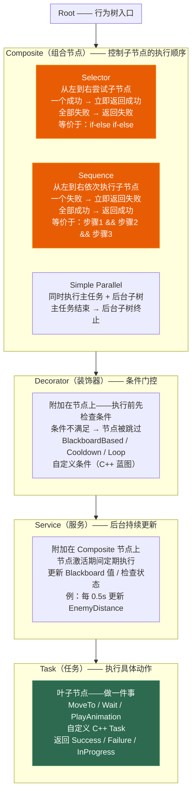

# 第十五章 AI 系统：从行为树到感知体系的完整链路

> **一句话理解**：UE 的 AI 系统由四层架构组成——**AIController** 是大脑载体、**NavMesh** 是空间认知、**Behavior Tree** 是决策引擎、**Perception** 是感官输入。Behavior Tree 不是你手写 if-else 的替代品——它是运行在 AIController 上的可视化状态机，通过 Blackboard 读写记忆，通过 EQS 评估空间环境，通过 Perception 感知玩家存在。理解这四层的协作方式，是 AI 面试的及格线。

---

## 15.1 概念直觉 —— UE AI 系统的四层架构

### 15.1.1 从手写 if-else 到 Behavior Tree

```cpp
// ===== 没有 Behavior Tree 时，AI 决策长什么样？ =====

// ✗ 手写决策逻辑——噩梦
void ABadAIController::Tick(float DeltaTime)
{
    Super::Tick(DeltaTime);

    switch (CurrentState)
    {
        case EAIState::Idle:
            // 随机巡逻...
            // 检测玩家...
            if (CanSeePlayer())
            {
                CurrentState = EAIState::Chase;
                // 忘了重置计时器 → Bug！
            }
            break;
        case EAIState::Chase:
            // 追击逻辑...
            if (IsInAttackRange())
            {
                CurrentState = EAIState::Attack;
            }
            else if (LostSightOfPlayer())
            {
                CurrentState = EAIState::Search;  // 又在三个状态间循环
                // 300 行 switch-case，策划想加个"警戒"状态 → 改 C++ 重编译
            }
            break;
        // ... 8 个状态，每个 50 行，状态切换经常忘写条件
    }
}
// 问题：
// - 状态越多越混乱——12 个状态 × 8 个转换条件 = 96 条边，手写极易遗漏
// - 策划无法参与——"加一个巡逻停顿"要改 C++
// - 每个 AI 都要重新实现一遍"看见玩家→追击"的逻辑
```

### 15.1.2 四层架构全景

```mermaid
flowchart TD
    subgraph Brain["AIController —— AI 的大脑载体"]
        AIC["拥有 Pawn → 运行 Behavior Tree<br/>接收 Perception 信号<br/>通过 MoveTo 执行导航"]
    end

    subgraph Space["NavMesh —— 空间认知"]
        Nav["导航网格：可行走区域 + 障碍物<br/>AIController::MoveTo() 自动寻路<br/>NavLinkProxy / NavModifier 定制"]
    end

    subgraph Decision["Behavior Tree —— 决策引擎"]
        BT["可视化状态机<br/>Selector（选择）/ Sequence（顺序）<br/>Decorator（条件）/ Service（更新）<br/>Task（执行动作）"]
    end

    subgraph Memory["Blackboard —— 记忆系统"]
        BB["键值存储：Key=Value<br/>EnemyActor / TargetLocation / IsAlerted<br/>BT 节点读写黑板，跨节点共享状态"]
    end

    subgraph Sense["AI Perception —— 感官输入"]
        Perc["视觉（AISense_Sight）<br/>听觉（AISense_Hearing）<br/>伤害感知（AISense_Damage）<br/>→ 注入 Blackboard 更新"]
    end

    subgraph SpaceQuery["EQS —— 空间决策"]
        EQS["环境查询系统<br/>"哪个掩体最好？"<br/>Generator 生成候选点<br/>Test 评分筛选"]
    end

    Brain --> Decision
    Brain --> Space
    Decision --> Memory
    Sense --> Memory
    Memory --> Decision
    Decision --> SpaceQuery

    style Brain fill:#d00000,stroke:#e85d04,color:white
    style Decision fill:#e85d04,stroke:#f48c06,color:white
    style Memory fill:#e85d04,stroke:#f48c06,color:white
    style Sense fill:#2d6a4f,stroke:#40916c,color:white
```

---

## 15.2 AIController 与 NavMesh —— AI 的基础设施

### 15.2.1 AIController 的最小定义

```cpp
// ===== AIController：AI 的大脑 =====
//
// AIController 继承自 AController——和 PlayerController 是平级兄弟
// PlayerController 接收玩家输入 → 控制 Pawn
// AIController 接收 BT / EQS / Perception 输出 → 控制 Pawn
//
// 核心职责：
// 1. 运行 Behavior Tree（RunBehaviorTree）
// 2. 执行导航移动（MoveToActor / MoveToLocation）
// 3. 管理 Blackboard 和 Perception 组件
// 4. 持有 AI 专用的 Pawn 引用

UCLASS()
class AMyAIController : public AAIController
{
    GENERATED_BODY()

public:
    AMyAIController()
    {
        // 创建 Perception 组件——AI 的"眼睛和耳朵"
        PerceptionComponent = CreateDefaultSubobject<UAIPerceptionComponent>(
            TEXT("Perception"));
    }

    virtual void BeginPlay() override
    {
        Super::BeginPlay();

        // 运行行为树
        if (BehaviorTreeAsset)
        {
            RunBehaviorTree(BehaviorTreeAsset);
            // 行为树开始执行——AIController 自动与 Blackboard 关联
        }
    }

    virtual void OnPossess(APawn* InPawn) override
    {
        Super::OnPossess(InPawn);

        // 在 Possess 时运行行为树也是一种常见做法
        // 特别是 AI Pawn 通过 SpawnActor 延迟生成时
    }

    // ---------- 导航移动的简单封装 ----------
    void MoveToEnemy(AActor* Enemy)
    {
        // AAIController::MoveToActor —— 自动 NavMesh 寻路
        // 等价于：找到从当前位置到 Enemy 位置的 NavMesh 路径 → 沿路径移动
        MoveToActor(Enemy,           // 目标 Actor
                    50.0f,           // AcceptanceRadius——到达多近算"到了"
                    true,            // bStopOnOverlap——重叠即停
                    true,            // bUsePathfinding——使用寻路（而非直线）
                    false,           // bCanStrafe——是否允许侧移
                    nullptr,         // FilterClass——导航过滤器
                    true             // bAllowPartialPath——允许部分路径
        );
    }

    bool IsAtDestination() const
    {
        // 检查 MoveTo 是否完成
        // ⚠️ AAIController 没有 GetMoveStatus()——正确 API 在 PathFollowingComponent 上
        if (UPathFollowingComponent* PathComp = GetPathFollowingComponent())
        {
            return PathComp->GetStatus() == EPathFollowingStatus::Idle;
        }
        return false;
    }

    // ---------- 聚焦（让 AI 看向目标） ----------
    void FocusOnEnemy(AActor* Enemy)
    {
        SetFocus(Enemy);  // AI 的视线会跟随 Enemy，头部旋转平滑追踪
    }

    void ClearFocus()
    {
        SetFocus(nullptr);
        // 或者用：ClearFocus(EAIFocusPriority::Gameplay);
    }

protected:
    UPROPERTY(EditDefaultsOnly, Category = "AI")
    TObjectPtr<UBehaviorTree> BehaviorTreeAsset;

    UPROPERTY(VisibleAnywhere, Category = "AI")
    TObjectPtr<UAIPerceptionComponent> PerceptionComponent;
};
```

### 15.2.2 NavMesh —— 空间认知

```cpp
// ===== NavMesh（导航网格）：AI 的"可行走地图" =====
//
// NavMesh 是 UE 自动生成的凸多边形网格，覆盖所有可行走表面
// 按 P 键在编辑器中可视化（绿色 = 可行走，红色 = 不可行走）
//
// 核心概念：
// - NavMesh Bounds Volume：定义导航网格的覆盖范围
// - NavModifierVolume：标记区域为不可行走（沼泽、悬崖、水域）
// - NavLinkProxy：创建特殊的导航连接（跳下悬崖、爬梯子、传送门）
// - NavigationSystem：C++ 中的查询接口

// ---------- C++ 中查询 NavMesh ----------
void QueryNavMesh()
{
    UNavigationSystemV1* NavSys = UNavigationSystemV1::GetCurrent(GetWorld());
    if (!NavSys) return;

    // ① 检查一个点是否在 NavMesh 上
    FVector TestLocation = FVector(1000, 0, 100);
    FNavLocation NavLocation;
    bool bOnNavMesh = NavSys->ProjectPointToNavigation(
        TestLocation,      // 待检测的点
        NavLocation,       // 输出：投影到 NavMesh 上的最近点
        FVector(500, 500, 500)  // 搜索范围
    );

    // ② 获取随机可达点
    if (NavSys->GetRandomReachablePointInRadius(
            GetPawn()->GetActorLocation(),
            2000.0f,           // 搜索半径
            NavLocation))
    {
        // NavLocation.Location 是一个随机可达点——可以用于巡逻
        MoveToLocation(NavLocation.Location);
    }

    // ③ 检查两个点之间是否存在 NavMesh 路径
    FPathFindingQuery Query;
    // 构建查询...（一般用 MoveTo 内部自动处理）
}
```

---

## 15.3 Behavior Tree —— 决策引擎

### 15.3.1 节点全景：Composite / Decorator / Service / Task



### 15.3.2 自定义 Task —— C++ 实现

```cpp
// ===== 自定义 BTTask：C++ 实现 AI 动作 =====
//
// BTTask 是 Behavior Tree 的叶子节点——真正"做事"的地方
// 三个核心虚函数：
//   ExecuteTask      —— 任务启动时调用一次
//   TickTask         —— 任务执行期间每帧调用（需 bNotifyTick = true）
//   AbortTask        —— 任务被中断时调用

// ---------- Task 示例 1：寻找最近的掩体 ----------
UCLASS()
class UBTTask_FindCover : public UBTTaskNode
{
    GENERATED_BODY()

public:
    UBTTask_FindCover()
    {
        // 要使用 TickTask，必须开启
        bNotifyTick = false;         // 此任务不需要每帧更新
        bCreateNodeInstance = true;  // 每个使用此 Task 的 BT 节点都创建独立实例
    }

    virtual EBTNodeResult::Type ExecuteTask(
        UBehaviorTreeComponent& OwnerComp, uint8* NodeMemory) override
    {
        // 1. 获取 AIController 和 Pawn
        AAIController* AICon = OwnerComp.GetAIOwner();
        if (!AICon) return EBTNodeResult::Failed;

        APawn* AIPawn = AICon->GetPawn();
        if (!AIPawn) return EBTNodeResult::Failed;

        // 2. 从 Blackboard 读取 Enemy
        UBlackboardComponent* BB = OwnerComp.GetBlackboardComponent();
        AActor* Enemy = Cast<AActor>(
            BB->GetValueAsObject(TEXT("EnemyActor")));

        if (!Enemy) return EBTNodeResult::Failed;

        // 3. 从 Enemy 的反方向寻找掩体
        FVector AwayFromEnemy = AIPawn->GetActorLocation() -
                                Enemy->GetActorLocation();
        AwayFromEnemy.Normalize();

        // 在远离敌人的方向搜索 NavMesh 上的随机点作为掩体
        FVector SearchCenter = AIPawn->GetActorLocation() +
                               AwayFromEnemy * CoverSearchDistance;

        UNavigationSystemV1* NavSys =
            UNavigationSystemV1::GetCurrent(GetWorld());
        FNavLocation NavLoc;
        if (NavSys->GetRandomReachablePointInRadius(
                SearchCenter, 500.0f, NavLoc))
        {
            // 4. 将结果写入 Blackboard
            BB->SetValueAsVector(TEXT("CoverLocation"), NavLoc.Location);
            BB->SetValueAsBool(TEXT("HasCover"), true);
            return EBTNodeResult::Succeeded;
        }

        BB->SetValueAsBool(TEXT("HasCover"), false);
        return EBTNodeResult::Failed;
    }

    UPROPERTY(EditAnywhere, Category = "Cover")
    float CoverSearchDistance = 2000.0f;
};

// ---------- Task 示例 2：等待并持续检查（支持 Tick） ----------
UCLASS()
class UBTTask_WaitWithCheck : public UBTTaskNode
{
    GENERATED_BODY()

public:
    UBTTask_WaitWithCheck()
    {
        bNotifyTick = true;          // 需要 Tick！
        bCreateNodeInstance = true;
    }

    virtual EBTNodeResult::Type ExecuteTask(
        UBehaviorTreeComponent& OwnerComp, uint8* NodeMemory) override
    {
        // 初始化等待计时器——存储在 NodeMemory 中
        // ⚠️ 行为树系统不存在 CastInstanceNodeMemory<T> 模板——NodeMemory 是纯 uint8*
        //    正确做法：标准 C++ reinterpret_cast 强转
        FBTTaskWaitMemory* MyMemory = reinterpret_cast<FBTTaskWaitMemory*>(NodeMemory);
        MyMemory->RemainingWaitTime = WaitTime;
        MyMemory->CheckInterval = CheckInterval;
        MyMemory->TimeSinceLastCheck = 0.0f;

        return EBTNodeResult::InProgress;  // ← 注意！返回 InProgress
        // 任务不会在这一帧结束——它在后台持续 Tick
    }

    virtual void TickTask(UBehaviorTreeComponent& OwnerComp, uint8* NodeMemory,
                          float DeltaSeconds) override
    {
        // ⚠️ 行为树系统不存在 CastInstanceNodeMemory<T> 模板——NodeMemory 是纯 uint8*
        //    正确做法：标准 C++ reinterpret_cast 强转
        FBTTaskWaitMemory* MyMemory = reinterpret_cast<FBTTaskWaitMemory*>(NodeMemory);

        MyMemory->RemainingWaitTime -= DeltaSeconds;

        // 定时检查——不是每帧检查以免浪费
        MyMemory->TimeSinceLastCheck += DeltaSeconds;
        if (MyMemory->TimeSinceLastCheck >= MyMemory->CheckInterval)
        {
            MyMemory->TimeSinceLastCheck = 0.0f;

            // 检查是否应该提前退出等待
            if (ShouldAbortWait(OwnerComp))
            {
                FinishLatentTask(OwnerComp, EBTNodeResult::Failed);
                return;
            }
        }

        // 等待时间到——成功完成
        if (MyMemory->RemainingWaitTime <= 0.0f)
        {
            FinishLatentTask(OwnerComp, EBTNodeResult::Succeeded);
        }
    }

    virtual uint16 GetInstanceMemorySize() const override
    {
        return sizeof(FBTTaskWaitMemory);
    }

protected:
    bool ShouldAbortWait(UBehaviorTreeComponent& OwnerComp) const
    {
        UBlackboardComponent* BB = OwnerComp.GetBlackboardComponent();
        // 如果发现敌人——提前结束等待
        return BB && BB->GetValueAsBool(TEXT("bEnemyDetected"));
    }

    struct FBTTaskWaitMemory
    {
        float RemainingWaitTime;
        float CheckInterval;
        float TimeSinceLastCheck;
    };

    UPROPERTY(EditAnywhere, Category = "Wait")
    float WaitTime = 3.0f;

    UPROPERTY(EditAnywhere, Category = "Wait")
    float CheckInterval = 0.5f;
};
```

### 15.3.3 完整的 Behavior Tree 结构示例

```
Behavior Tree: "BT_Enemy_Default"

Root
└── Selector [优先级从高到低]
    │
    ├── Sequence [战斗序列] ← 优先级最高
    │   ├── Decorator: Blackboard "bHasEnemy" == true  ← 条件：有敌人
    │   ├── Service: "UpdateEnemyDistance" (每 0.3s)   ← 后台更新距离
    │   ├── Selector [攻击或追击]
    │   │   ├── Sequence [近战攻击]
    │   │   │   ├── Decorator: Blackboard "DistanceToEnemy" < 200
    │   │   │   ├── Task: "FocusOnEnemy"
    │   │   │   ├── Task: "PlayAttackAnimation"
    │   │   │   └── Task: "ApplyDamageToEnemy"
    │   │   └── Sequence [追击]
    │   │       ├── Decorator: Blackboard "DistanceToEnemy" >= 200
    │   │       ├── Task: "FocusOnEnemy"
    │   │       └── Task: "MoveToEnemy"
    │   │
    │   ├── Sequence [巡逻序列] ← 没有敌人时
    │       ├── Decorator: Blackboard "bHasEnemy" == false
    │       ├── Service: "UpdatePatrolPath" (每 2.0s)
    │       ├── Task: "GetNextPatrolPoint"
    │       ├── Task: "MoveToPatrolPoint"
    │       └── Task: "WaitAtPatrolPoint"
    │
    └── Task: "Idle" ← 默认行为（极少触发）
```

---

## 15.4 Blackboard —— AI 的记忆系统

### 15.4.1 Blackboard = 键值存储

```cpp
// ===== Blackboard：AI 共享内存 =====
//
// Blackboard 存储 Key-Value 对，格式：FName → 值类型
// 支持的 Value 类型：Bool / Int / Float / String / Vector / Rotator / Object / Class / Enum
//
// 关键设计：Behavior Tree 的所有节点通过 Blackboard 共享状态
// - Service 更新 Blackboard 值（"当前距离敌人 300"）
// - Decorator 读取 Blackboard 值（"距离 < 200？"）
// - Task 读取和写入 Blackboard 值（"前往 CoverLocation"）

// ---------- C++ 中操作 Blackboard ----------
void BlackboardOperations()
{
    // 获取 Blackboard
    UBlackboardComponent* BB = GetBlackboardComponent();

    // ---- 写入 ----
    BB->SetValueAsObject(TEXT("EnemyActor"), DetectedPlayer);
    BB->SetValueAsVector(TEXT("MoveTargetLocation"), PatrolPoint);
    BB->SetValueAsFloat(TEXT("DistanceToEnemy"), 350.0f);
    BB->SetValueAsBool(TEXT("bEnemyDetected"), true);
    BB->SetValueAsInt(TEXT("AlertLevel"), 2);
    BB->SetValueAsEnum(TEXT("AIState"), (uint8)EAIState::Chase);

    // ---- 读取 ----
    AActor* Enemy = Cast<AActor>(BB->GetValueAsObject(TEXT("EnemyActor")));
    FVector Target = BB->GetValueAsVector(TEXT("MoveTargetLocation"));
    float Distance = BB->GetValueAsFloat(TEXT("DistanceToEnemy"));
    bool bDetected = BB->GetValueAsBool(TEXT("bEnemyDetected"));

    // ---- 清除 ----
    BB->ClearValue(TEXT("EnemyActor"));  // 单个清除
    // BB->ClearValue 会重置为此 Key 的默认值（Object → nullptr, Float → 0.0...）
}

// ===== Blackboard Key 的选择与命名 =====
//
// 典型 AI 的 Blackboard：
//
// EnemyActor       (Object)    — 当前敌人引用
// EnemyLocation    (Vector)    — 最后已知的敌人位置
// MoveTarget       (Vector)    — 当前移动目标
// PatrolIndex      (Int)       — 当前巡逻点索引
// DistanceToEnemy  (Float)     — 到敌人的距离（Service 更新）
// bHasLineOfSight  (Bool)      — 是否能看到敌人（Service 更新）
// bIsAlerted       (Bool)      — 是否处于警戒状态
// CoverLocation    (Vector)    — 掩体位置
// AttackCooldown   (Float)     — 攻击冷却剩余时间
//
// 命名原则：用明确的英文名，避免缩写歧义
```

---

## 15.5 EQS 环境查询系统 —— 空间决策

### 15.5.1 EQS 的核心概念

```cpp
// ===== EQS（Environment Query System）：空间智能 =====
//
// EQS 回答空间问题："哪里是最好的掩体？""哪里可以安全撤退？"
//
// 三个核心组件：
// ① Generator（生成器）—— 生成候选位置集合
//    例：在 Self 周围 500 半径内生成 20 个随机点
//
// ② Test（测试/评分）—— 对每个候选位置打分
//    例：掩体测试——"这个点离敌人多远？" → 越远分越高
//    例：视线测试——"从掩体能看到敌人吗？" → 能看到的加分
//    复合多个 Test → 加权总分 → 选出最优位置
//
// ③ Context（上下文）—— 提供参考点
//    例：Context = EnemyActor → "以敌人为参考" / "以自身为参考"

// ===== EQS 查询的 C++ 触发 =====
UCLASS()
class UBTTask_RunEQSQuery : public UBTTaskNode
{
    GENERATED_BODY()

public:
    virtual EBTNodeResult::Type ExecuteTask(
        UBehaviorTreeComponent& OwnerComp, uint8* NodeMemory) override
    {
        AAIController* AICon = OwnerComp.GetAIOwner();
        if (!AICon) return EBTNodeResult::Failed;

        // 获取 EQS 查询模板（在编辑器中创建的 EQS 资产）
        UEnvQuery* QueryTemplate = EQSQueryTemplate;
        if (!QueryTemplate) return EBTNodeResult::Failed;

        // 提交 EQS 查询（异步）→ 回调中获取结果
        // ⚠️ QueryRequest.Execute 不接收 (RunMode, this, &Callback) 三参数形式！
        //    正确做法：用 FEnvQueryFinishedSignature::CreateUObject 封装委托
        //    EQS 完成后会调用 OnQueryFinished

        // 步骤 1：保存 OwnerComp 到成员变量——异步回调中需要用它调 FinishLatentTask
        CachedOwnerComp = &OwnerComp;

        FEnvQueryRequest QueryRequest(QueryTemplate, AICon->GetPawn());
        QueryRequest.Execute(
            EEnvQueryRunMode::SingleResult,
            FEnvQueryFinishedSignature::CreateUObject(
                this, &UBTTask_RunEQSQuery::OnQueryFinished)
        );

        return EBTNodeResult::InProgress;  // 等待异步完成
    }

    void OnQueryFinished(TSharedPtr<FEnvQueryResult> Result)
    {
        // ⚠️ 这是纯异步回调——没有 OwnerComp 参数！
        //    需要通过 ExecuteTask 中存储的 CachedOwnerComp 访问 BB 和 FinishLatentTask
        if (!Result || !Result->IsSuccessful())
        {
            if (CachedOwnerComp)
                FinishLatentTask(*CachedOwnerComp, EBTNodeResult::Failed);
            return;
        }

        // 获取最佳位置
        FVector BestLocation = Result->GetItemAsLocation(0);

        // 获取评分（调试用）
        float BestScore = Result->GetItemScore(0);

        // 写入 Blackboard —— 通过缓存的行为树组件获取
        if (CachedOwnerComp)
        {
            if (UBlackboardComponent* BB = CachedOwnerComp->GetBlackboardComponent())
            {
                BB->SetValueAsVector(TEXT("EQSResultLocation"), BestLocation);
            }

            // 通知 Behavior Tree 任务完成
            FinishLatentTask(*CachedOwnerComp, EBTNodeResult::Succeeded);
        }
    }

    UPROPERTY(EditAnywhere, Category = "EQS")
    TObjectPtr<UEnvQuery> EQSQueryTemplate;

private:
    // 异步回调期间暂存 OwnerComp —— bCreateNodeInstance = true 时此成员安全
    TObjectPtr<UBehaviorTreeComponent> CachedOwnerComp;
};
```

### 15.5.2 EQS 查询的典型配置

```
EQS Query: "EQS_FindBestCover"

Generator: Points On NavMesh (在 Self 周围)
  - Radius: 2000
  - Number of Points: 32
  - Projection: NavMesh Only → 只生成在可行走表面上的点

Tests (按优先级排列):

[1] Test: Distance (Simple)
    - TestMode: 3D Distance
    - DistanceTo: EnemyActor (Context)
    - Scoring: 线性正向 (距离越远分越高)
    - Weight: 3.0 (权重最高——距离是最重要的)

[2] Test: Trace (Line of Sight)
    - TraceFrom: Self
    - TraceTo: Tested Point + Offset(0,0,150) (检查掩体点上方)
    - TraceMode: Visibility
    - Scoring: 布尔值 (能看到敌人 → 加 1.0)
    - Weight: 1.5 (有一定重要性)

[3] Test: Dot Product
    - Direction: (Tested Point - EnemyActor)
    - Reference: (Tested Point - Self)
    - Scoring: 越接近 0 (侧翼) 分越高
    - Weight: 1.0

最终得分 = Distance × 3.0 + LineOfSight × 1.5 + DotProduct × 1.0
选出最高分 → AI 前往该掩体
```

---

## 15.6 AI Perception —— 感官输入

### 15.6.1 三通道感知：视觉 / 听觉 / 伤害

```cpp
// ===== AI Perception 组件：AI 的眼睛、耳朵和痛觉 =====
//
// AI Perception 通过 UAIPerceptionComponent 管理多种感官
// 每种感官是一个 AISense 子类：
//   UAISense_Sight   → 视觉（视野锥 + 距离 + 遮挡检测）
//   UAISense_Hearing → 听觉（声音位置 + 范围 + 衰减）
//   UAISense_Damage  → 伤害感知（谁打了我？伤害多大？）

// ---------- 配置感知 ----------
UCLASS()
class AMyAIController : public AAIController
{
    GENERATED_BODY()

public:
    AMyAIController()
    {
        PerceptionComponent = CreateDefaultSubobject<UAIPerceptionComponent>(
            TEXT("Perception"));

        // ---- 配置视觉 ----
        SightConfig = CreateDefaultSubobject<UAISenseConfig_Sight>(
            TEXT("SightConfig"));
        SightConfig->SightRadius = 3000.0f;        // 最大视距
        SightConfig->LoseSightRadius = 3500.0f;    // 失去视线的距离（略大于视距防止抖动）
        SightConfig->PeripheralVisionAngleDegrees = 90.0f; // 半视角（90° → 180° 视野）
        SightConfig->DetectionByAffiliation.bDetectEnemies = true;
        SightConfig->DetectionByAffiliation.bDetectNeutrals = true;
        SightConfig->DetectionByAffiliation.bDetectFriendlies = false;

        // ---- 配置听觉 ----
        HearingConfig = CreateDefaultSubobject<UAISenseConfig_Hearing>(
            TEXT("HearingConfig"));
        HearingConfig->HearingRange = 2000.0f;     // 听觉范围
        HearingConfig->DetectionByAffiliation.bDetectEnemies = true;

        // ---- 配置伤害感知 ----
        DamageConfig = CreateDefaultSubobject<UAISenseConfig_Damage>(
            TEXT("DamageConfig"));

        // ---- 注册到 Perception 组件 ----
        PerceptionComponent->ConfigureSense(*SightConfig);
        PerceptionComponent->ConfigureSense(*HearingConfig);
        PerceptionComponent->ConfigureSense(*DamageConfig);

        // ---- 绑定感知事件 ----
        PerceptionComponent->OnTargetPerceptionUpdated.AddDynamic(
            this, &AMyAIController::OnPerceptionUpdated);
    }

    // ---------- 感知更新回调 ----------
    UFUNCTION()
    void OnPerceptionUpdated(AActor* Actor, FAIStimulus Stimulus)
    {
        // 被感知到的 Actor + 刺激信息
        // Stimulus.Type —— 是视觉/听觉/伤害？
        // Stimulus.WasSuccessfullySensed() —— 新发现还是丢失了？

        if (Stimulus.WasSuccessfullySensed())
        {
            // 新发现了目标！
            if (Stimulus.Type == UAISense::GetSenseID<UAISense_Sight>())
            {
                UE_LOG(LogAI, Log, TEXT("看到了 %s"), *Actor->GetName());
                OnEnemyDetected(Actor);
            }
            else if (Stimulus.Type == UAISense::GetSenseID<UAISense_Hearing>())
            {
                UE_LOG(LogAI, Log, TEXT("听到了 %s 的声音"), *Actor->GetName());
                // 声音位置可以从 Stimulus.StimulusLocation 获取
                OnHeardNoise(Stimulus.StimulusLocation);
            }
            else if (Stimulus.Type == UAISense::GetSenseID<UAISense_Damage>())
            {
                UE_LOG(LogAI, Log, TEXT("受到了 %s 的伤害"), *Actor->GetName());
                OnTakeDamageFrom(Actor);
            }
        }
        else
        {
            // 丢失了目标！
            if (Stimulus.Type == UAISense::GetSenseID<UAISense_Sight>())
            {
                UE_LOG(LogAI, Log, TEXT("丢失了 %s 的视野"), *Actor->GetName());
                // 注意：不要立刻清除 Enemy——AI 应该去最后看到的位置搜索
            }
        }
    }

    void OnEnemyDetected(AActor* Enemy)
    {
        UBlackboardComponent* BB = GetBlackboardComponent();
        if (BB)
        {
            BB->SetValueAsObject(TEXT("EnemyActor"), Enemy);
            BB->SetValueAsVector(TEXT("EnemyLocation"), Enemy->GetActorLocation());
            BB->SetValueAsBool(TEXT("bEnemyDetected"), true);
        }
    }

    void OnHeardNoise(FVector NoiseLocation)
    {
        UBlackboardComponent* BB = GetBlackboardComponent();
        if (BB)
        {
            BB->SetValueAsVector(TEXT("InvestigateLocation"), NoiseLocation);
            BB->SetValueAsBool(TEXT("bHeardSomething"), true);
        }
    }

    void OnTakeDamageFrom(AActor* Attacker)
    {
        UBlackboardComponent* BB = GetBlackboardComponent();
        if (BB)
        {
            BB->SetValueAsObject(TEXT("EnemyActor"), Attacker);
            BB->SetValueAsBool(TEXT("bEnemyDetected"), true);
            BB->SetValueAsBool(TEXT("bIsAlerted"), true);
        }
    }

protected:
    UPROPERTY(VisibleAnywhere)
    TObjectPtr<UAIPerceptionComponent> PerceptionComponent;

    UPROPERTY()
    TObjectPtr<UAISenseConfig_Sight> SightConfig;

    UPROPERTY()
    TObjectPtr<UAISenseConfig_Hearing> HearingConfig;

    UPROPERTY()
    TObjectPtr<UAISenseConfig_Damage> DamageConfig;
};
```

### 15.6.2 触发听觉刺激 —— 从玩家侧制造噪音

```cpp
// ===== 让 AI "听到"玩家的脚步声/枪声 =====
//
// AI 的听觉是被动的——需要"噪音制造者"主动报告
// 玩家 Pawn 或武器开火时调用：

void AMyCharacter::MakeFootstepNoise()
{
    // 向周围 AI 报告噪音
    UAISense_Hearing::ReportNoiseEvent(
        GetWorld(),
        GetActorLocation(),        // 噪音位置
        1.0f,                      // 响度
        this,                      // 噪音制造者
        500.0f,                    // 最大传播范围（覆盖 HearingRange）
        TEXT("Footstep")           // 噪音标签（AI 可据此判断反应）
    );
}

void AWeapon::MakeGunshotNoise()
{
    UAISense_Hearing::ReportNoiseEvent(
        GetWorld(),
        GetMuzzleLocation(),
        3.0f,                      // 枪声更响——传播更远
        GetOwner(),                // 开火的 Actor
        2000.0f,                   // 枪声传播范围
        TEXT("Gunshot")
    );
}
```

---

## 15.7 完整实战 —— 巡逻→发现→追击→攻击 AI 敌人

### 15.7.1 AIController 完整实现

```cpp
// ===== 完整 AI 敌人：巡逻 + 感知 + 追击 + 攻击 =====

// ---------- AIController ----------
UCLASS()
class AEnemyAIController : public AAIController
{
    GENERATED_BODY()

public:
    AEnemyAIController()
    {
        PerceptionComp = CreateDefaultSubobject<UAIPerceptionComponent>(
            TEXT("Perception"));

        // 配置视觉
        UAISenseConfig_Sight* Sight = CreateDefaultSubobject<UAISenseConfig_Sight>(
            TEXT("Sight"));
        Sight->SightRadius = 2500.0f;
        Sight->LoseSightRadius = 3000.0f;
        Sight->PeripheralVisionAngleDegrees = 60.0f;
        Sight->DetectionByAffiliation.bDetectEnemies = true;
        PerceptionComp->ConfigureSense(*Sight);

        // 配置听觉
        UAISenseConfig_Hearing* Hearing = CreateDefaultSubobject<UAISenseConfig_Hearing>(
            TEXT("Hearing"));
        Hearing->HearingRange = 1500.0f;
        Hearing->DetectionByAffiliation.bDetectEnemies = true;
        PerceptionComp->ConfigureSense(*Hearing);

        // 配置伤害
        PerceptionComp->ConfigureSense(*CreateDefaultSubobject<UAISenseConfig_Damage>(
            TEXT("Damage")));

        PerceptionComp->OnTargetPerceptionUpdated.AddDynamic(
            this, &AEnemyAIController::OnPerceptionUpdated);
    }

    virtual void BeginPlay() override
    {
        Super::BeginPlay();
        if (BehaviorTree)
        {
            RunBehaviorTree(BehaviorTree);
        }
    }

    UFUNCTION()
    void OnPerceptionUpdated(AActor* Actor, FAIStimulus Stimulus)
    {
        UBlackboardComponent* BB = GetBlackboardComponent();
        if (!BB) return;

        if (Stimulus.WasSuccessfullySensed())
        {
            BB->SetValueAsObject(TEXT("EnemyActor"), Actor);
            BB->SetValueAsVector(TEXT("EnemyLastLocation"), Actor->GetActorLocation());
            BB->SetValueAsBool(TEXT("bHasEnemy"), true);

            if (Stimulus.Type == UAISense::GetSenseID<UAISense_Damage>())
            {
                BB->SetValueAsBool(TEXT("bIsAlerted"), true);
            }
        }
        else
        {
            // 视觉丢失 —— 不立刻清除 EnemyActor
            // 让 Behavior Tree 的 Service 处理"丢失后搜索"逻辑
            BB->SetValueAsBool(TEXT("bHasEnemy"), false);
            BB->SetValueAsBool(TEXT("bIsAlerted"), true); // 警戒
        }
    }

protected:
    UPROPERTY(EditDefaultsOnly, Category = "AI")
    TObjectPtr<UBehaviorTree> BehaviorTree;

    UPROPERTY(VisibleAnywhere)
    TObjectPtr<UAIPerceptionComponent> PerceptionComp;
};

// ---------- BTTask：巡逻 ----------
UCLASS()
class UBTTask_Patrol : public UBTTaskNode
{
    GENERATED_BODY()

public:
    virtual EBTNodeResult::Type ExecuteTask(
        UBehaviorTreeComponent& OwnerComp, uint8* NodeMemory) override
    {
        AAIController* AICon = OwnerComp.GetAIOwner();
        UBlackboardComponent* BB = OwnerComp.GetBlackboardComponent();
        if (!AICon || !BB) return EBTNodeResult::Failed;

        // 获取巡逻点列表
        int32 PatrolIndex = BB->GetValueAsInt(TEXT("PatrolIndex"));
        TArray<FVector> PatrolPoints = GetPatrolPoints(AICon);

        if (PatrolPoints.Num() == 0)
        {
            // 没有预设巡逻点——在当前位置周围随机选一个 NavMesh 点
            UNavigationSystemV1* NavSys = UNavigationSystemV1::GetCurrent(GetWorld());
            FNavLocation RandomPt;
            if (NavSys->GetRandomReachablePointInRadius(
                    AICon->GetPawn()->GetActorLocation(), PatrolRadius, RandomPt))
            {
                BB->SetValueAsVector(TEXT("MoveTarget"), RandomPt.Location);
            }
        }
        else
        {
            PatrolIndex = (PatrolIndex + 1) % PatrolPoints.Num();
            BB->SetValueAsInt(TEXT("PatrolIndex"), PatrolIndex);
            BB->SetValueAsVector(TEXT("MoveTarget"), PatrolPoints[PatrolIndex]);
        }

        return EBTNodeResult::Succeeded;
    }

    UPROPERTY(EditAnywhere, Category = "Patrol")
    float PatrolRadius = 1500.0f;

private:
    TArray<FVector> GetPatrolPoints(AAIController* AICon) const
    {
        // 可从 DataAsset 或 WorldSubsystem 读取巡逻路径
        return TArray<FVector>();
    }
};

// ---------- BTTask：攻击 ----------
UCLASS()
class UBTTask_MeleeAttack : public UBTTaskNode
{
    GENERATED_BODY()

public:
    virtual EBTNodeResult::Type ExecuteTask(
        UBehaviorTreeComponent& OwnerComp, uint8* NodeMemory) override
    {
        AAIController* AICon = OwnerComp.GetAIOwner();
        UBlackboardComponent* BB = OwnerComp.GetBlackboardComponent();
        if (!AICon || !BB) return EBTNodeResult::Failed;

        AActor* Enemy = Cast<AActor>(BB->GetValueAsObject(TEXT("EnemyActor")));
        if (!Enemy) return EBTNodeResult::Failed;

        APawn* AIPawn = AICon->GetPawn();
        if (!AIPawn) return EBTNodeResult::Failed;

        // 面向敌人
        FVector DirToEnemy = Enemy->GetActorLocation() - AIPawn->GetActorLocation();
        DirToEnemy.Z = 0;
        AIPawn->SetActorRotation(DirToEnemy.Rotation());

        // 应用伤害（使用 GAS 或简单 Damage）
        UGameplayStatics::ApplyDamage(
            Enemy,
            DamageAmount,
            AICon,
            AIPawn,
            UDamageType::StaticClass()
        );

        // 记录攻击时间——供 Service 检查冷却
        BB->SetValueAsFloat(TEXT("LastAttackTime"),
            GetWorld()->GetTimeSeconds());

        UE_LOG(LogAI, Log, TEXT("AI 对 %s 造成 %.1f 伤害"),
            *Enemy->GetName(), DamageAmount);

        return EBTNodeResult::Succeeded;
    }

    UPROPERTY(EditAnywhere, Category = "Attack")
    float DamageAmount = 15.0f;
};

// ---------- BTService：更新与敌人的距离 ----------
UCLASS()
class UBTService_UpdateEnemyInfo : public UBTService
{
    GENERATED_BODY()

public:
    UBTService_UpdateEnemyInfo()
    {
        Interval = 0.3f;          // 每 0.3 秒更新一次
        RandomDeviation = 0.05f;  // 随机偏移——避免所有 AI 在同一帧更新
        bNotifyBecomeRelevant = true;
        bNotifyCeaseRelevant = true;
    }

    virtual void TickNode(UBehaviorTreeComponent& OwnerComp, uint8* NodeMemory,
                          float DeltaSeconds) override
    {
        Super::TickNode(OwnerComp, NodeMemory, DeltaSeconds);

        AAIController* AICon = OwnerComp.GetAIOwner();
        UBlackboardComponent* BB = OwnerComp.GetBlackboardComponent();
        if (!AICon || !BB) return;

        AActor* Enemy = Cast<AActor>(BB->GetValueAsObject(TEXT("EnemyActor")));
        if (!Enemy) return;

        APawn* AIPawn = AICon->GetPawn();
        if (!AIPawn) return;

        // 更新距离
        float Distance = FVector::Dist(
            AIPawn->GetActorLocation(), Enemy->GetActorLocation());
        BB->SetValueAsFloat(TEXT("DistanceToEnemy"), Distance);

        // 更新敌人位置
        BB->SetValueAsVector(TEXT("EnemyLastLocation"), Enemy->GetActorLocation());

        // 检查攻击冷却
        float LastAttack = BB->GetValueAsFloat(TEXT("LastAttackTime"));
        float TimeSinceAttack = GetWorld()->GetTimeSeconds() - LastAttack;
        BB->SetValueAsBool(TEXT("bCanAttack"),
            TimeSinceAttack >= AttackCooldown);

        // 丢失敌人后的"最后已知位置搜索"
        if (!BB->GetValueAsBool(TEXT("bHasEnemy")))
        {
            // 在最后已知位置周围搜索
            AAIController* AIConOwner = OwnerComp.GetAIOwner();
            if (AIConOwner)
            {
                if (UPathFollowingComponent* PathComp =
                    AIConOwner->GetPathFollowingComponent())
                {
                    if (PathComp->GetStatus() == EPathFollowingStatus::Idle)
                    {
                        // 巡视完成——放弃搜索
                        BB->SetValueAsBool(TEXT("bSearchFinished"), true);
                    }
                }
            }
        }
    }

    UPROPERTY(EditAnywhere, Category = "Combat")
    float AttackCooldown = 1.5f;
};
```

### 15.7.2 用于测试的 AI 调试命令

```
AI 调试命令（控制台输入）：

ai.debug.EnableDebugDraw 1        —— 开启 AI 调试绘制
ai.debug.EnableNavMeshDraw 1      —— 显示 NavMesh 绿色网格
ai.debug.EnablePerception 1       —— 显示感知范围（视野锥 / 听觉圈）
ai.debug.EnableEQS 1              —— 显示 EQS 查询结果
ai.debug.BehaviorTree 1           —— 高亮当前执行的 BT 节点

showdebug ai                      —— 在屏幕上打印当前 AI 的状态
                                     包括：行为树当前节点、黑板值、
                                     感知状态、路径跟随状态

Visual Logger（Window → Developer Tools → Visual Logger）：
  - 录制 AI 的完整决策过程
  - 回放时看：AI 在哪一帧看到了玩家？为什么选择那个掩体？
  - 支持逐帧分析 Behavior Tree 的执行
```

---

## 15.8 常见陷阱与面试深度追问

### 15.8.1 AI TOP 8 陷阱

```cpp
// ===== 陷阱 #1：在 Task 的 ExecuteTask 中做了耗时操作 =====
EBTNodeResult::Type UBTTask_BadHeavyCalculation::ExecuteTask(...)
{
    // ✗ ExecuteTask 运行在 GameThread 上！
    //    遍历 1000 个点做射线检测 → 卡帧 200ms！
    for (int i = 0; i < 1000; ++i)
    {
        // 射线检测...
    }
    return EBTNodeResult::Succeeded;
}
// ✓ 修复：用 EQS 替代手动遍历（EQS 内部有优化），
//    或者返回 InProgress + 分帧执行

// ===== 陷阱 #2：忘记设置 AcceptanceRadius =====
void BadMoveTo()
{
    // ✗ 默认 AcceptanceRadius = 50 —— AI 可能永远"到不了"精确位置
    //    沿路径震荡——靠近 → 超调 → 折返 → 再超调 → 循环
    MoveToActor(Target);
}
// ✓ 根据场景设置合理的 AcceptanceRadius：
//    近战攻击 = 50，远程攻击 = 500，巡逻 = 200

// ===== 陷阱 #3：视觉丢失后立刻清除 Enemy =====
void OnPerceptionLost(AActor* Actor)
{
    // ✗ 丢失视野的瞬间就清除 Enemy
    BB->SetValueAsObject(TEXT("EnemyActor"), nullptr);
    // → AI 立刻"忘了"玩家——站在原地发呆——玩家在墙后探头射击
}
// ✓ 丢失视野后保留 EnemyActor 引用，记录最后已知位置
//    AI 去最后位置搜索——如果一定时间内没找到才放弃

// ===== 陷阱 #4：Service 的 Interval 设得太小 =====
// ✗ Interval = 0.01f —— 每帧更新 20 个 AI × 10 个 Service
//    = 200 次 Blackboard 写入/帧——仅 Service 开销就占 2ms
// ✓ 根据需求设置合理间隔：
//    视野检查 = 0.1~0.2s（人眼分辨不出 0.2s 的延迟）
//    距离更新 = 0.3~0.5s（战斗中足够了）
//    巡逻路径 = 2.0s（移动速度慢，不需要高频更新）

// ===== 陷阱 #5：NavMesh 没有覆盖 AI 的活动区域 =====
// 症状：AI 走到某区域后突然停下不动
// 原因：NavMesh Bounds Volume 没有覆盖到该区域
// 检测：按 P 键 → 如果该区域不是绿色 → NavMesh 没有覆盖
// 修复：扩大 NavMesh Bounds Volume 或添加多个 Volume

// ===== 陷阱 #6：忽略了 AI 之间的互相阻挡 =====
// 场景：5 个近战 AI 追击同一个玩家
// 症状：前面的 AI 堵住路 → 后面的 AI 原地"抖动"
// 修复：
//   - 开启 RVO（Reciprocal Velocity Obstacle）Avoidance
//   - CharacterMovementComponent.bEnableRVOAvoidance = true
//   - AvoidanceWeight = 0.5（AI 互相避让的权重）

// ===== 陷阱 #7：EQS Generator 生成的点在 NavMesh 外 =====
// ✗ Generator 生成了 100 个点 → 只有 30 个在 NavMesh 上
//    → 浪费了 70% 的候选点 → 剩余的掩体质量差
// ✓ 在 Generator 开启 Projection: NavMesh Only
//    → 自动投影到最近的 NavMesh 表面——保证每个候选点都可达

// ===== 陷阱 #8：BT Task 返回 Success/Failure 但忘了清理状态 =====
EBTNodeResult::Type UBTTask_BadNoCleanup::ExecuteTask(...)
{
    // ✗ 启动了某个持续效果（如播放动画）但返回了 Success
    //    → 动画还在播放，BT 已经跳到下一个 Task —— 动作冲突
    PlayAnimMontage(AttackMontage);
    return EBTNodeResult::Succeeded;  // ← 不等待动画完成！
}
// ✓ 如果需要等待——返回 InProgress + 在动画结束回调中 FinishLatentTask
//    如果不需要等待——那这个 Task 的设计就是合理的
```

### 15.8.2 面试速记三连

```
Q: "Selector 和 Sequence 的区别？什么时候用哪个？"
A: Selector 是"或"逻辑——从左到右尝试，一个成功即返回（if-else if-else）。
   Sequence 是"且"逻辑——从左到右依次执行，一个失败即返回（步骤1→2→3）。
   战斗行为 = Selector（攻击或追击或逃跑——选一个能做的）
   攻击序列 = Sequence（面向敌人 → 播放攻击动画 → 造成伤害——必须全部完成）
   口诀：Selector 选一个能做的最好的，Sequence 按顺序做完所有步骤。

Q: "Decorator 和 Service 的区别？"
A: Decorator 是"门禁"——节点执行前检查条件（有敌人吗？距离够近吗？），
   条件不满足 → 节点被跳过。
   Service 是"后台进程"——节点激活期间定期执行（每 0.3s 更新距离、检查视野），
   持续往 Blackboard 里写数据供 Decorator 使用。
   口诀：Decorator 决定"做不做"，Service 决定"知道什么"。

Q: "EQS 的 Generator 和 Test 分别做什么？"
A: Generator 生成候选位置（在 Self 周围 2000 半径生成 32 个随机点）。
   Test 对每个候选位置评分（离敌人多远？掩体后方能否看到敌人？）。
   多个 Test 加权求和 → 选出总分最高的位置。
   类比：Generator = 招聘投简历的人，Test = 面试打分，选出最高分。
```

---

## 15.9 30 秒速答

> **面试被问："UE 的 AI 系统由哪些核心组件组成？"**

四层架构：**AIController**（大脑——运行 Behavior Tree、执行导航移动）。**NavMesh**（空间认知——AI 知道哪里能走）。**Behavior Tree**（决策引擎——Selector/Sequence 控制决策流程，Decorator 做条件门控，Service 持续更新数据，Task 执行动作）。**AI Perception**（感官——视觉/听觉/伤害感知，注入 Blackboard）。辅助系统：**Blackboard**（AI 的记忆——键值存储，BT 节点通过它共享状态）和 **EQS**（环境查询——回答"哪个掩体最好"的空间决策问题）。

> **面试追问："Behavior Tree 和 State Machine 有什么区别？"**

State Machine 的状态和转换是平级的——12 个状态互相跳转 = 144 条可能的边，极易遗漏。Behavior Tree 是层级结构——Selector/Sequence 天然表达优先级和执行顺序。BT 的 Decorator 做条件门控（条件不满足 → 子树直接跳过），不需要显式写状态转换。BT 更可组合——一个子树可以被复用（"移动到目标"可以用在巡逻、追击、撤退三个场景）。一句话：State Machine 描述"我在哪个状态"，Behavior Tree 描述"我现在该做什么"。

> **面试追问："AI 看到玩家后，怎么让 Behavior Tree 立即切换到追击行为？"**

不需要"切换"——Behavior Tree 每帧从 Root 重新评估。Root 下第一个节点通常是 Selector，优先检查"有敌人吗？"（Decorator 读 Blackboard）。AI Perception 组件发现玩家后 → 回调中设置 `BB->SetValueAsObject("EnemyActor", Player)` → 下一帧 BT 重新评估 → Decorator 条件满足 → 战斗子树激活 → 巡逻子树被跳过。这个过程是自动的——你不需要手动"切换状态"。

> **面试追问："AI 失去玩家视野后，为什么应该去最后已知位置搜索而不是原地发呆？"**

如果视野丢失立刻清除 EnemyActor → BT 切换回巡逻 → AI 转身走开。但玩家可能只是躲到了墙后——AI 应该去玩家消失的位置检查。正确做法：Perception 回调中设置 `bHasEnemy = false` 但保留 `EnemyLastLocation` 和 `EnemyActor` 引用 → BT 的搜索子树激活 → MoveTo(EnemyLastLocation) → 到达后原地旋转搜索 → 如果一定时间内没找到 → 清除 EnemyActor → 回到巡逻。

> **面试追问："怎么在 C++ 中自定义一个 Behavior Tree Task？"**

继承 `UBTTaskNode`，重写 `ExecuteTask`。简单任务（不需要等待）→ 返回 `Succeeded` 或 `Failed`。持续任务（如等待动画完成）→ 返回 `InProgress` + 在回调中调 `FinishLatentTask`。需要每帧更新 → 构造函数中 `bNotifyTick = true` + 重写 `TickTask`。需要存储数据 → 重写 `GetInstanceMemorySize` 返回自定义结构体大小，通过 `reinterpret_cast<T*>(NodeMemory)` 访问（引擎底层以纯 uint8* 传递节点内存，标准 C++ 强转是唯一正确做法）。

---

## 15.10 本章自查清单

- [ ] 能画出 UE AI 系统的四层架构图（AIController / NavMesh / Behavior Tree + Blackboard / Perception + EQS）
- [ ] 能说清 Selector（或）和 Sequence（且）的执行逻辑
- [ ] 能区分 Decorator（条件门控）和 Service（后台更新）的职责
- [ ] 能手写一个自定义 BTTaskNode 子类（含 ExecuteTask + TickTask + NodeMemory）
- [ ] 理解 EBTNodeResult::InProgress 的作用——任务可以跨多帧执行
- [ ] 知道 Blackboard 支持哪些数据类型（Object / Vector / Float / Bool / Int / Enum）
- [ ] 能手写 AI Perception 三通道配置（视觉/听觉/伤害）+ 回调处理
- [ ] 知道如何从玩家侧触发听觉刺激（UAISense_Hearing::ReportNoiseEvent）
- [ ] 能解释 EQS 的 Generator / Test / Context 三要素
- [ ] 理解 AcceptanceRadius 对导航移动的影响
- [ ] 知道 RVO Avoidance 解决 AI 互相阻挡的问题
- [ ] 能说出至少 3 个 AI 调试命令

---

> 📚 **第三部第二章完结。** AI 系统是面试中区分"会写 C++"和"会做游戏"的分水岭——Behavior Tree 的层级设计、Perception 的感官注入、EQS 的空间决策，三者协同构成一个完整的 AI 大脑。接下来进入 Ch16：动画系统——AnimBlueprint、状态机、IK、Montage 和 Motion Warping。

> 💡 **前置依赖提醒**：
> - Actor/Component 模型（AIController 本质是 Controller + Component） → 见 [Ch8：Actor 与 Component 模型](../08_actor_component/)
> - Game Framework（Controller 在整个框架中的位置） → 见 [Ch9：Game Framework 与 Subsystem](../09_game_framework_subsystem/)
> - DataAsset 配置（Behavior Tree 和 EQS 都是 DataAsset） → 见 [Ch13：数据驱动与资源管理](../13_data_asset_management/)
> - GAS 技能系统（AI 攻击可以触发 GameplayAbility） → 见 [Ch14：GAS 技能系统](../14_gas_ability_system/)
