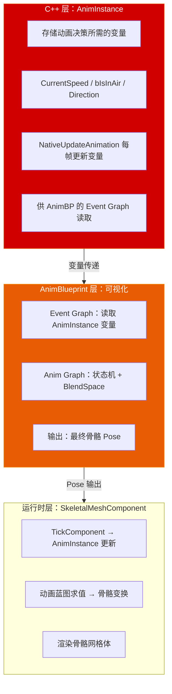

# 第十六章 动画系统：从状态机到 Motion Warping 的完整链路

> **一句话理解**：UE 的动画系统是三层架构——**AnimInstance** 在 C++ 层做逻辑决策（当前速度？是否在空中？），**AnimBlueprint** 在编辑器里做可视化状态机和混合编排，**SkeletalMeshComponent** 在运行时驱动骨骼变形和渲染。Animation Montage 负责组合多个动画片段，IK 负责脚部贴地和手部抓取，Root Motion 让动画驱动角色移动，Motion Warping 让动作自动适应目标位置。理解这三层的分工和交互方式，是动画面试的及格线。

---

## 16.1 概念直觉 —— 动画系统的三层架构

### 16.1.1 从硬编码到动画蓝图



```cpp
// ===== AnimInstance：C++ 动画逻辑的核心 =====
// AnimInstance 是动画蓝图的 C++ 父类
// 它不直接操作骨骼——它只负责为动画蓝图提供"决策数据"

UCLASS()
class UMyAnimInstance : public UAnimInstance
{
    GENERATED_BODY()

public:
    // ---------- 动画蓝图可读取的变量 ----------
    // 这些变量由 C++ 计算，AnimBP 的 Event Graph 读取后驱动状态机

    UPROPERTY(BlueprintReadOnly, Category = "Locomotion")
    float Speed;

    UPROPERTY(BlueprintReadOnly, Category = "Locomotion")
    float Direction;          // 移动方向角度（-180 ~ 180）

    UPROPERTY(BlueprintReadOnly, Category = "Locomotion")
    bool bIsInAir;

    UPROPERTY(BlueprintReadOnly, Category = "Locomotion")
    bool bIsCrouching;

    UPROPERTY(BlueprintReadOnly, Category = "Combat")
    bool bIsAiming;

    UPROPERTY(BlueprintReadOnly, Category = "Combat")
    float AimPitch;           // 瞄准俯仰角——用于 Aim Offset

    // ---------- 核心更新函数 ----------
    // NativeUpdateAnimation：每帧由引擎自动调用（渲染前）
    virtual void NativeUpdateAnimation(float DeltaSeconds) override
    {
        Super::NativeUpdateAnimation(DeltaSeconds);

        // 获取当前 Pawn
        APawn* OwnerPawn = TryGetPawnOwner();
        if (!OwnerPawn) return;

        // 计算速度和方向
        FVector Velocity = OwnerPawn->GetVelocity();
        Speed = Velocity.Size2D();                          // 水平速度
        // ⚠️ 注意函数名——UAnimInstance 基类已有 CalculateDirection()
        //    自定义函数用不同名称避免 shadow 基类的权威数学接口
        Direction = GetMovementDirectionAngle(Velocity, OwnerPawn->GetActorRotation());

        // 状态标志
        ACharacter* Character = Cast<ACharacter>(OwnerPawn);
        if (Character)
        {
            bIsInAir = Character->GetCharacterMovement()->IsFalling();
            bIsCrouching = Character->GetCharacterMovement()->IsCrouching();
        }
    }

    // NativeInitializeAnimation：动画实例初始化时调用一次
    virtual void NativeInitializeAnimation() override
    {
        Super::NativeInitializeAnimation();
        // 初始化外部引用等
    }

    // NativeThreadSafeUpdateAnimation：在工作线程上更新（性能优化）
    virtual void NativeThreadSafeUpdateAnimation(float DeltaSeconds) override
    {
        Super::NativeThreadSafeUpdateAnimation(DeltaSeconds);
        // ⚠️ 这里不能访问 World、Controller、GameMode 等非线程安全的对象！
        // 只做纯数学计算——更新 Speed、Direction 等不涉及 UObject 访问的值
    }

protected:
    // 计算移动方向（相对于角色朝向的角度）
    // ⚠️ 函数名不能叫 CalculateDirection——UAnimInstance 基类已有此函数
    //    同签名会 shadow 引擎内置的权威数学接口，导致运行期调用紊乱
    float GetMovementDirectionAngle(const FVector& Velocity, const FRotator& BaseRotation) const
    {
        if (Velocity.IsNearlyZero()) return 0.0f;

        FMatrix RotMatrix = FRotationMatrix(BaseRotation);
        FVector Forward = RotMatrix.GetScaledAxis(EAxis::X);
        FVector Right = RotMatrix.GetScaledAxis(EAxis::Y);

        float ForwardSpeed = FVector::DotProduct(Velocity, Forward);
        float RightSpeed = FVector::DotProduct(Velocity, Right);

        return FMath::RadiansToDegrees(FMath::Atan2(RightSpeed, ForwardSpeed));
    }
};
```

---

## 16.2 状态机与 BlendSpace —— 动画选择与混合

### 16.2.1 StateMachine（状态机）：条件驱动的动画切换

```cpp
// ===== 状态机：定义动画状态及切换条件 =====
//
// 在 AnimBlueprint 的 AnimGraph 中可视化编辑：
//
// 典型运动状态机：
//
//   [Idle] ←──→ [Walk] ←──→ [Run]
//     ↑            ↑           ↑
//     └──── JumpStart → [Fall] → JumpLand ──┘
//
// 状态切换规则（Transition Rule）：
//   Idle → Walk：  Speed > 10
//   Walk → Run：   Speed > 300
//   Run → Walk：   Speed < 250
//   Walk → Idle：  Speed < 5
//   任意 → Fall：  bIsInAir == true
//
// Transition 的关键属性：
// - BlendDuration：两个动画之间的混合时间（秒）
// - BlendMode：Standard / Inertialization（UE5 新特性）
// - Automatic Rule Based on Sequence Player in State：自动根据动画长度过渡

// ===== C++ 中触发状态切换 =====
void UMyAnimInstance::SetMovementState(EMovementState NewState)
{
    // 直接设置枚举——AnimBP 状态机的 Transition Rule 读取这个值
    CurrentMovementState = NewState;
}
```

### 16.2.2 BlendSpace（混合空间）：参数驱动的动画混合

```cpp
// ===== BlendSpace：基于连续参数的动画混合 =====
//
// BlendSpace 1D：一个参数轴
//   例：Speed(0 → 600) 映射到 Idle → Walk → Run
//   X 轴 = Speed，每个采样点放一个动画：
//     Speed=0   → Idle 动画
//     Speed=150 → Walk 动画
//     Speed=400 → Run 动画
//   Speed=200 时：Walk 和 Run 各 50% 混合
//
// BlendSpace 2D：两个参数轴
//   例：Speed(0→600) × Direction(-180→180)
//   X 轴 = Direction（前后左右），Y 轴 = Speed（快慢）
//   每个格子放一个动画：前向行走、左向行走、后退行走...
//   任意角度和速度自动混合相邻动画
//
// BlendSpace 的关键属性：
// - Target Weight Interpolation Speed Per Second：平滑过渡速度
// - Sample Interpolation：采样点之间的插值方式（Linear / Cubic）
// - Grid Division：将参数空间分成多少格（格子越多越平滑，越多越贵）

// ===== C++ 中设置 BlendSpace 参数 =====
void UMyAnimInstance::UpdateBlendSpaceParams()
{
    // 这些变量直接作为 BlendSpace 的输入参数
    // AnimBP 的 AnimGraph 中会有节点读取它们
    Speed = GetOwnerVelocity2D();
    Direction = GetMovementDirectionAngle();

    // BlendSpace 内部自动根据 (Speed, Direction) 找到最近的采样动画并混合
}
```

### 16.2.3 Aim Offset —— 叠加式 BlendSpace

```cpp
// ===== Aim Offset：在基础动画上叠加瞄准偏移 =====
//
// Aim Offset 是一种特殊的 BlendSpace——叠加式混合
// 基础动画（如步枪持握 Idle） + Aim Offset（上下左右瞄准偏移）
// 结果：角色身体保持 Idle，上半身随瞄准方向旋转

// 典型的 Aim Offset 参数：
//   Pitch：-90°（下）→ 90°（上）
//   Yaw：-90°（左）→ 90°（右）

void UMyAnimInstance::UpdateAimOffset()
{
    if (APlayerController* PC = Cast<APlayerController>(
            TryGetPawnOwner()->GetController()))
    {
        // 从 Controller 的 Aim Rotation 计算 Pitch 和 Yaw
        FRotator AimRot = PC->GetControlRotation();
        FRotator ActorRot = TryGetPawnOwner()->GetActorRotation();

        FRotator Delta = (AimRot - ActorRot).GetNormalized();
        AimPitch = FMath::Clamp(Delta.Pitch, -90.0f, 90.0f);
        AimYaw = FMath::Clamp(Delta.Yaw, -90.0f, 90.0f);
    }
}
```

---

## 16.3 IK（Inverse Kinematics）—— 逆向运动学

### 16.3.1 IK 三剑客：Two Bone / CCD / FABRIK

```cpp
// ===== IK 的本质：从末端位置反算中间关节 =====
//
// Forward Kinematics（FK）：肩 → 肘 → 手（已知关节角度 → 求手在哪）
// Inverse Kinematics（IK）：手在 (x,y,z) → 肩和肘该什么角度？
//
// UE 提供三种 IK 解算器（都在 AnimBP 的 AnimGraph 中使用）：

// ① Two Bone IK —— 最常用（两段骨骼：大腿→小腿→脚）
//    - 给定末端位置（脚底），反算两个关节的角度
//    - 适用：脚部贴地（Foot IK）、手部抓取
//    - 性能：极轻量——解析解，不迭代
//    - 限制：只能处理两段骨骼链

// ② CCD IK（Cyclic Coordinate Descent）—— 多段骨骼
//    - 从末端向根逐段迭代优化
//    - 适用：长骨骼链（尾巴、触手、脖子）
//    - 性能：迭代次数决定精度（通常 5~10 次）
//    - 局限：可能产生不自然的"拧麻花"姿态

// ③ FABRIK（Forward And Backward Reaching IK）—— 自然姿态
//    - 从末端向根 + 从根向末端双向迭代
//    - 适用：全身 IK（手摸墙、身体倾斜）
//    - 性能：双向迭代比 CCD 稍贵
//    - 优势：姿态比 CCD 更自然——没有"拧麻花"问题
```

### 16.3.2 Foot IK —— 脚部贴地

```cpp
// ===== Foot IK：让角色脚部适应不平坦地形 =====
//
// 问题：坡度上，一只脚悬空
// 解决：从脚底向下做射线检测 → 找到地面高度 → IK 将脚移到地面

UCLASS()
class UMyAnimInstance : public UAnimInstance
{
    GENERATED_BODY()

public:
    // ---------- Foot IK 数据 ----------
    UPROPERTY(BlueprintReadOnly, Category = "IK")
    FVector LeftFootIKLocation;     // 左脚 IK 目标位置

    UPROPERTY(BlueprintReadOnly, Category = "IK")
    FRotator LeftFootIKRotation;    // 左脚 IK 目标旋转（匹配地面法线）

    UPROPERTY(BlueprintReadOnly, Category = "IK")
    float LeftFootIKAlpha;          // IK 权重（行走时 ≈1，跳跃时 ≈0）

    UPROPERTY(BlueprintReadOnly, Category = "IK")
    FVector RightFootIKLocation;

    UPROPERTY(BlueprintReadOnly, Category = "IK")
    FRotator RightFootIKRotation;

    UPROPERTY(BlueprintReadOnly, Category = "IK")
    float RightFootIKAlpha;

    // ---------- Update Foot IK ----------
    virtual void NativeUpdateAnimation(float DeltaSeconds) override
    {
        Super::NativeUpdateAnimation(DeltaSeconds);
        UpdateFootIK(DeltaSeconds);
    }

    void UpdateFootIK(float DeltaSeconds)
    {
        ACharacter* Character = Cast<ACharacter>(TryGetPawnOwner());
        if (!Character) return;

        // 获取脚的骨骼位置（FK 位置）
        USkeletalMeshComponent* Mesh = Character->GetMesh();
        FVector LeftFootBone = Mesh->GetSocketLocation(TEXT("foot_l"));
        FVector RightFootBone = Mesh->GetSocketLocation(TEXT("foot_r"));

        // 对每只脚做射线检测——找到地面
        float TraceLength = 60.0f;  // 脚踝以下的最大搜索距离
        FVector TraceStart_L = LeftFootBone + FVector(0, 0, 30);  // 从脚踝上方开始
        FVector TraceEnd_L = LeftFootBone - FVector(0, 0, TraceLength);

        FHitResult Hit_L;
        if (GetWorld()->LineTraceSingleByChannel(Hit_L, TraceStart_L, TraceEnd_L,
                ECC_Visibility))
        {
            // ⚠️ 致命陷阱：Hit_L.Location 是世界绝对坐标！
            //    AnimGraph 的 TwoBoneIK 节点默认接收组件局部空间（Component Space）坐标，
            //    或者相对于脚踝骨骼的位移偏移量。如果直接把世界坐标丢给 IK 节点——
            //    角色离开世界原点后双脚会被拉伸到数万单位外的世界坐标点，产生恐怖畸变！
            // ✓ 标准做法：用 InverseTransformPosition 转回 Mesh 的组件局部空间
            FVector WorldHitLocation = Hit_L.Location;
            LeftFootIKLocation = Mesh->GetComponentTransform()
                                     .InverseTransformPosition(WorldHitLocation);

            // IK 旋转同样需要从世界空间转到组件局部空间
            FRotator WorldNormalRotation = FRotationMatrix::MakeFromZ(
                Hit_L.Normal).Rotator();
            LeftFootIKRotation = (Mesh->GetComponentQuat().Inverse() *
                                  WorldNormalRotation.Quaternion()).Rotator();

            LeftFootIKAlpha = 1.0f;  // 完全启用 IK
        }
        else
        {
            // 脚悬空——禁用 IK（跳跃/下落时）
            LeftFootIKAlpha = 0.0f;
        }

        // 右脚步骤同上...
        FVector TraceStart_R = RightFootBone + FVector(0, 0, 30);
        FVector TraceEnd_R = RightFootBone - FVector(0, 0, TraceLength);
        FHitResult Hit_R;
        if (GetWorld()->LineTraceSingleByChannel(Hit_R, TraceStart_R, TraceEnd_R,
                ECC_Visibility))
        {
            FVector WorldHitLocation = Hit_R.Location;
            RightFootIKLocation = Mesh->GetComponentTransform()
                                      .InverseTransformPosition(WorldHitLocation);

            FRotator WorldNormalRotation = FRotationMatrix::MakeFromZ(
                Hit_R.Normal).Rotator();
            RightFootIKRotation = (Mesh->GetComponentQuat().Inverse() *
                                   WorldNormalRotation.Quaternion()).Rotator();

            RightFootIKAlpha = 1.0f;
        }
        else
        {
            RightFootIKAlpha = 0.0f;
        }

        // 平滑过渡——避免 IK 开关时的"弹跳"
        float IKInterpSpeed = 10.0f;
        LeftFootIKAlpha = FMath::FInterpTo(LeftFootIKAlpha,
            LeftFootIKAlpha > 0.5f ? 1.0f : 0.0f, DeltaSeconds, IKInterpSpeed);
        RightFootIKAlpha = FMath::FInterpTo(RightFootIKAlpha,
            RightFootIKAlpha > 0.5f ? 1.0f : 0.0f, DeltaSeconds, IKInterpSpeed);
    }
};
```

---

## 16.4 Animation Notify 与 NotifyState —— 动画事件系统

### 16.4.1 AnimNotify：一次性事件

```cpp
// ===== AnimNotify：动画播放到特定帧时触发一次 =====
//
// 典型用途：
// - 脚步声：脚落地的那一帧 → 播放脚步声 + 生成脚印贴花
// - 攻击判定：武器挥到最前方的那一帧 → 检测碰撞
// - 投掷物生成：手举到最高点的那一帧 → 生成投掷物
// - 音效触发：武器出鞘的那一帧 → 播放拔剑音效

// ---------- 自定义 AnimNotify（C++） ----------
UCLASS()
class UAnimNotify_Footstep : public UAnimNotify
{
    GENERATED_BODY()

public:
    virtual void Notify(USkeletalMeshComponent* MeshComp,
                        UAnimSequenceBase* Animation,
                        const FAnimNotifyEventReference& EventReference) override
    {
        Super::Notify(MeshComp, Animation, EventReference);

        if (!MeshComp) return;

        AActor* Owner = MeshComp->GetOwner();
        if (!Owner) return;

        // 播放脚步声
        UGameplayStatics::PlaySoundAtLocation(
            Owner->GetWorld(),
            FootstepSound,
            Owner->GetActorLocation());

        // 根据脚下的物理材质选择不同的音效
        // （需要 PhysicalMaterial 系统配合——见 Ch17）
    }

    UPROPERTY(EditAnywhere, Category = "Footstep")
    TObjectPtr<USoundBase> FootstepSound;
};

// ---------- 自定义 AnimNotify：攻击判定 ----------
UCLASS()
class UAnimNotify_MeleeTrace : public UAnimNotify
{
    GENERATED_BODY()

public:
    virtual void Notify(USkeletalMeshComponent* MeshComp,
                        UAnimSequenceBase* Animation,
                        const FAnimNotifyEventReference& EventReference) override
    {
        Super::Notify(MeshComp, Animation, EventReference);

        AActor* Owner = MeshComp->GetOwner();
        if (!Owner) return;

        // 从武器的 Socket 位置做碰撞检测
        FVector TraceStart = MeshComp->GetSocketLocation(TEXT("weapon_tip_start"));
        FVector TraceEnd = MeshComp->GetSocketLocation(TEXT("weapon_tip_end"));

        TArray<FHitResult> Hits;
        FCollisionQueryParams Params;
        Params.AddIgnoredActor(Owner);

        if (Owner->GetWorld()->SweepMultiByChannel(
                Hits, TraceStart, TraceEnd, FQuat::Identity,
                ECC_GameTraceChannel1, FCollisionShape::MakeSphere(20.0f), Params))
        {
            for (const FHitResult& Hit : Hits)
            {
                if (AActor* HitActor = Hit.GetActor())
                {
                    UGameplayStatics::ApplyDamage(HitActor, Damage,
                        Owner->GetInstigatorController(), Owner,
                        UDamageType::StaticClass());
                }
            }
        }
    }

    UPROPERTY(EditAnywhere, Category = "Melee")
    float Damage = 25.0f;
};
```

### 16.4.2 AnimNotifyState：持续事件

```cpp
// ===== AnimNotifyState：有 Begin / Tick / End 的持续事件 =====
//
// 典型用途：
// - 持续攻击判定（武器挥砍的整个弧线期间都检测碰撞）
// - 无敌时间窗口（翻滚动画期间不受伤害）
// - 蒙太奇锁定（技能动画期间禁止移动输入）

UCLASS()
class UAnimNotifyState_InvincibleWindow : public UAnimNotifyState
{
    GENERATED_BODY()

public:
    virtual void NotifyBegin(USkeletalMeshComponent* MeshComp,
        UAnimSequenceBase* Animation, float TotalDuration,
        const FAnimNotifyEventReference& EventReference) override
    {
        // 无敌开始
        if (AActor* Owner = MeshComp->GetOwner())
        {
            // 例如：设置一个 GameplayTag "Status.Invincible"
            UE_LOG(LogAnim, Log, TEXT("%s 进入无敌"), *Owner->GetName());
        }
    }

    virtual void NotifyEnd(USkeletalMeshComponent* MeshComp,
        UAnimSequenceBase* Animation,
        const FAnimNotifyEventReference& EventReference) override
    {
        // 无敌结束
        if (AActor* Owner = MeshComp->GetOwner())
        {
            UE_LOG(LogAnim, Log, TEXT("%s 退出无敌"), *Owner->GetName());
        }
    }

    virtual void NotifyTick(USkeletalMeshComponent* MeshComp,
        UAnimSequenceBase* Animation, float FrameDeltaTime,
        const FAnimNotifyEventReference& EventReference) override
    {
        // 每帧调用——可以在这里做持续碰撞检测
    }
};
```

---

## 16.5 Montage 与 Slot —— 动画组合

### 16.5.1 Animation Montage 的核心概念

```cpp
// ===== Montage：多段动画的组合 + Slot 分层播放 =====
//
// Montage 解决的核心问题：
//   "角色在跑步，但我想播放'左手换弹夹'动画——只影响上半身"
//
// Slot（槽位）：
//   每个 Montage 被分配到特定的 Slot
//   不同 Slot 覆盖不同的骨骼区域：
//     - DefaultSlot：全身（默认——会覆盖基础运动）
//     - UpperBody：上半身（保留下半身的跑步动画）
//     - FullBody：全身（高优先级——覆盖一切）
//
// 典型的 Slot 配置（在 AnimBP 的 AnimGraph 中设置）：
//   DefaultSlot → 全身（运动动画：Idle/Walk/Run）
//   UpperBody  → 脊柱以上（换弹、瞄准偏移、挥手）
//   FullBody   → 全身（技能动画、死亡动画——最高优先级）

// ---------- C++ 播放 Montage ----------
UCLASS()
class UMyAnimInstance : public UAnimInstance
{
    GENERATED_BODY()

public:
    // 播放一次攻击动画
    float PlayAttackMontage(UAnimMontage* Montage)
    {
        if (!Montage) return 0.0f;

        // Montage_Play 的返回值 = Montage 的总时长（秒）
        float Duration = Montage_Play(
            Montage,
            1.0f,                    // PlayRate（1.0 = 正常速度）
            EMontagePlayReturnType::MontageLength,  // 返回总时长
            0.0f,                    // StartingPosition（从头开始）
            true                     // bStopAllMontages（停止其他 Montage）
        );

        return Duration;
    }

    // 播放上半身换弹动画（不影响跑步）
    void PlayReloadMontage_UpperBody(UAnimMontage* Montage)
    {
        if (!Montage) return;

        // 使用 FName Slot 指定到上半身槽位
        Montage_Play(
            Montage,
            1.0f,
            EMontagePlayReturnType::Duration,
            0.0f,
            false  // bStopAllMontages = false —— 不停止下半身的跑步动画
        );
    }

    // 停止 Montage
    void StopCurrentMontage(float BlendOutTime = 0.25f)
    {
        Montage_Stop(BlendOutTime);  // 0.25s 淡出
    }

    // 跳转到 Montage 的特定 Section
    void JumpToMontageSection(FName SectionName)
    {
        Montage_JumpToSection(SectionName);
        // Montage 中的每个 Section 有一个标签：
        // "Start" → "Loop" → "End"
        // 例如：攻击动画的"蓄力"→"挥砍"→"收招"
        // 可以从任意时刻跳转到特定 Section
    }

    // 检查是否正在播放特定 Montage
    bool IsPlayingMontage(UAnimMontage* Montage) const
    {
        return Montage_IsPlaying(Montage);
    }
};
```

### 16.5.2 Montage 的 Section 与 Blend Out

```cpp
// ===== Montage Section：动画的逻辑片段 =====
//
// 一个 Montage 被划分为多个 Section：
//
// [Section: Charge] ──→ [Section: Swing] ──→ [Section: Recovery]
//      蓄力                 挥砍                   收招
//
// 使用场景：
//   - 蓄力攻击：在 Charge 阶段循环 → 按键释放 → JumpTo Swing
//   - 连击：Swing1 → 在特定帧检测输入 → 如果有 → JumpTo Swing2
//   - 受击：正常状态 → 被击中 → JumpTo HitReaction Section

// ===== Blend Out：Montage 的淡出机制 =====
//
// Montage 有两种结束方式：
// 1. 自然结束：播放到最后一帧 → 自动退出
// 2. 提前中断：被打断（受击/死亡）→ Blend Out
//
// Blend Out Trigger Time：在这个时间点之后，Montage 允许被 Blend Out
// Blend Out Time：淡出持续时间（秒）
//   → 例如：攻击 Montage 的 BlendOutTime = 0.15s
//     受击时，手臂不会"瞬间弹回"Idle——而是 0.15s 平滑回到 Idle
```

---

## 16.6 Root Motion —— 动画驱动移动

### 16.6.1 Root Motion 的本质

```cpp
// ===== Root Motion：让动画数据驱动角色移动 =====
//
// 常规移动：代码控制位置 + 动画配合播放
//   → MoveComponent 告诉角色"向前走 100 单位"
//   → 动画系统播放"走路动画"（原地踏步）
//   → 脚部滑动问题需要 Foot IK 补偿
//
// Root Motion：动画数据包含根骨骼的位移
//   → 动画师制作的动画中，根骨骼真正在移动
//   → 引擎提取根骨骼的运动数据
//   → 将这些数据应用到角色的实际位置
//   → 动画和移动完美同步——无脚部滑动

// ---------- 启用 Root Motion ----------
// 步骤 1：在 Montage/Animation 资产中启用 Root Motion
//   资产详情 → Root Motion → Enable Root Motion ✓
//   Root Motion Root Lock → RefPose（推荐）
//
// 步骤 2：在 Character Movement 中处理 Root Motion
//   通常由 ACharacter 的移动组件自动处理

// ---------- C++ 中提取 Root Motion 数据 ----------
void UMyAnimInstance::ExtractRootMotion()
{
    // 获取当前帧的 Root Motion 变换
    if (UCharacterMovementComponent* MoveComp =
            Cast<UCharacterMovementComponent>(
                TryGetPawnOwner()->GetMovementComponent()))
    {
        // bAllowPhysicsRotationDuringAnimRootMotion
        // = true → Root Motion 可以旋转角色（翻滚、转向攻击）
    }
}

// ---------- 常见 Root Motion 使用场景 ----------
// ① 翻滚/闪避：动画中的位移数据精确对应闪避距离
// ② 终结技：动画中的角色会靠近目标——Root Motion 让角色自动移动
// ③ 攀爬翻越：动画包含"手抓墙→身体上翻→站稳"——Root Motion 全部搞定
// ④ 网络友好：Root Motion 位移在服务器上复现——移动数据一致
```

### 16.6.2 Root Motion 的常见问题

```cpp
// ===== Root Motion 陷阱 =====
//
// 问题 1：Root Motion 锁定移动方向
//   动画中的移动方向是固定的（动画师制作的）
//   如果角色朝向不对——Root Motion 会朝着错误方向移动
//   解决：Warping / Motion Warping（见 16.7）
//
// 问题 2：Root Motion 与代码移动的冲突
//   同一帧既有代码移动（AddMovementInput）又有 Root Motion
//   → 移动抖动或位移叠加错误
//   解决：使用 Root Motion 时禁止代码移动输入
//
// 问题 3：网络复制的精度
//   Root Motion 的位移在服务器和客户端可能有微小差异
//   长时间累积 → 位置不一致
//   解决：定期服务器校正 + 使用 Root Motion 源数据而非最终位移
```

---

## 16.7 Motion Warping（UE5）—— 自适应动画

### 16.7.1 Motion Warping 的核心概念

```cpp
// ===== Motion Warping：让动画自动适应目标位置 =====
//
// 传统问题：
//   "翻越掩体"的动画是固定的——从 A 点起跳，B 点落地
//   但掩体高度可能不同——固定的动画会导致手没抓到掩体边缘
//
// Motion Warping 的解决思路：
//   在动画中标记"关键帧"（Warp Target）
//   引擎在运行时将动画"扭曲"——让关键帧精确匹配目标位置
//
// 例：翻越掩体动画
//   Warp Target 1：手抓掩体边缘的那一帧 → 扭曲动画使手精确碰到掩体
//   Warp Target 2：脚落地的帧 → 扭曲使脚精确落到掩体后方地面上
//
// 结果：同一个动画适配所有掩体高度——不需要每种掩体做一个动画！

// ---------- C++ 中触发 Motion Warping ----------
UCLASS()
class AMyCharacter : public ACharacter
{
    GENERATED_BODY()

public:
    // 翻越掩体
    void VaultOverObstacle(FVector ObstacleLocation, float ObstacleHeight)
    {
        if (!VaultMontage) return;

        // ⚠️ 注意：
        // ① FMotionWarpingTarget 内部使用统一的 FTransform——没有独立的 .Location / .Rotation 属性
        // ② 官方 Motion Warping 框架中不存在 UAbilityTask_MotionWarping——
        //    如果需要与 GAS 协同，需自行编写 AbilityTask 封装

        // 设置 Warp Target：使用组件提供的专用工厂 API
        FVector TargetLocation = ObstacleLocation + FVector(0, 0, ObstacleHeight);
        FRotator TargetRotation = GetActorRotation();

        if (UMotionWarpingComponent* WarpComp =
                FindComponentByClass<UMotionWarpingComponent>())
        {
            // ✓ 正确 API：AddOrUpdateWarpTargetFromLocationAndRotation
            //    内部会将 FName + FVector + FRotator 组装为 FTransform 并存入 Warp Target 列表
            WarpComp->AddOrUpdateWarpTargetFromLocationAndRotation(
                FName(TEXT("VaultTarget")),  // 匹配动画中 Notify 的 Warp Target Name
                TargetLocation,
                TargetRotation
            );
        }

        // 播放 Montage（引擎在 Warp Target 对应的帧自动扭曲根骨骼位移）
        PlayAnimMontage(VaultMontage);
    }

protected:
    UPROPERTY(EditDefaultsOnly, Category = "Animation")
    TObjectPtr<UAnimMontage> VaultMontage;
};

// ===== Motion Warping 的关键概念 =====
//
// Warp Target Name：动画中预先定义的关键帧标签
//   动画师在 Montage 中添加 Notify "MotionWarping Target = VaultTarget"
//
// Warp Target 类型：
//   - Location Only：只扭曲位移——适用翻越掩体
//   - Rotation Only：只扭曲旋转——适用转向攻击
//   - Location + Rotation：同时扭曲——适用滑铲
//
// MotionWarpingComponent：
//   挂载在 Character 上的组件
//   管理所有活跃的 Warp Target
//   每帧计算扭曲变换并应用到 Root Motion
```

---

## 16.8 完整实战 —— 角色动画管线的 C++ 架构

### 16.8.1 完整的 AnimInstance 实现

```cpp
// ===== 完整 AnimInstance：运动 + 战斗 + IK + Montage =====
UCLASS()
class UCharacterAnimInstance : public UAnimInstance
{
    GENERATED_BODY()

public:
    // ---------- 运动数据 ----------
    UPROPERTY(BlueprintReadOnly, Category = "Locomotion")
    float Speed;

    UPROPERTY(BlueprintReadOnly, Category = "Locomotion")
    float Direction;

    UPROPERTY(BlueprintReadOnly, Category = "Locomotion")
    bool bIsInAir;

    UPROPERTY(BlueprintReadOnly, Category = "Locomotion")
    bool bIsCrouching;

    UPROPERTY(BlueprintReadOnly, Category = "Locomotion")
    float LeanAmount;  // 转弯时的身体倾斜（通过加速度计算）

    // ---------- 瞄准数据 ----------
    UPROPERTY(BlueprintReadOnly, Category = "Aim")
    float AimPitch;

    UPROPERTY(BlueprintReadOnly, Category = "Aim")
    float AimYaw;

    UPROPERTY(BlueprintReadOnly, Category = "Aim")
    bool bIsAiming;

    // ---------- 战斗数据 ----------
    UPROPERTY(BlueprintReadOnly, Category = "Combat")
    bool bIsAttacking;

    UPROPERTY(BlueprintReadOnly, Category = "Combat")
    EWeaponType CurrentWeaponType;  // Unarmed / Pistol / Rifle / Melee

    // ---------- 核心更新 ----------
    virtual void NativeUpdateAnimation(float DeltaSeconds) override
    {
        Super::NativeUpdateAnimation(DeltaSeconds);

        ACharacter* Character = Cast<ACharacter>(TryGetPawnOwner());
        if (!Character) return;

        // ---- 运动更新 ----
        FVector Velocity = Character->GetVelocity();
        Speed = Velocity.Size2D();
        Direction = GetMovementDirectionAngle(Velocity, Character->GetActorRotation());

        // ✓ 直接赋值给类成员变量——不是声明局部变量！否则 CalculateLean 中的 MoveComp 是 nullptr
        MoveComp = Character->GetCharacterMovement();
        bIsInAir = MoveComp->IsFalling();
        bIsCrouching = MoveComp->IsCrouching();

        // 倾斜计算——加速度方向
        FVector Acceleration = MoveComp->GetCurrentAcceleration();
        if (!Acceleration.IsNearlyZero())
        {
            LeanAmount = FMath::FInterpTo(LeanAmount,
                CalculateLean(Acceleration, Character->GetActorRotation()),
                DeltaSeconds, 5.0f);
        }
        else
        {
            LeanAmount = FMath::FInterpTo(LeanAmount, 0.0f,
                DeltaSeconds, 3.0f);
        }

        // ---- 瞄准更新 ----
        UpdateAimOffset(Character);

        // ---- IK 更新 ----
        UpdateFootIK(DeltaSeconds);
    }

private:
    float CalculateLean(const FVector& Accel, const FRotator& BaseRot) const
    {
        FVector LocalAccel = BaseRot.UnrotateVector(Accel);
        return FMath::Clamp(LocalAccel.Y / MoveComp->GetMaxAcceleration(),
                            -1.0f, 1.0f);
    }

    void UpdateAimOffset(ACharacter* Character)
    {
        if (AController* Controller = Character->GetController())
        {
            FRotator AimRot = Controller->GetControlRotation();
            FRotator ActorRot = Character->GetActorRotation();
            FRotator Delta = (AimRot - ActorRot).GetNormalized();
            AimPitch = Delta.Pitch;
            AimYaw = Delta.Yaw;
        }
    }

    // 其余函数声明（UpdateFootIK / GetMovementDirectionAngle / PlayMontage...）
    void UpdateFootIK(float DeltaSeconds);
    float GetMovementDirectionAngle(const FVector& Velocity, const FRotator& BaseRot) const;

    UCharacterMovementComponent* MoveComp;
};
```

### 16.8.2 动画调试命令

```
动画调试控制台命令：

showdebug animation                  —— 显示当前 AnimInstance 的所有变量值
                                             包括 Speed、bIsInAir、当前状态机状态

a.visbones                           —— 显示骨骼（绿色线条）
a.visanim                            —— 显示动画数据
a.visik                              —— 显示 IK 目标和链
a.vismontage                         —— 显示 Montage 播放进度和 Section

showdebug character                  —— 显示角色移动状态

// 编辑器调试工具：
// Window → Developer Tools → Animation Insights
//   - 性能分析：每个 AnimBP 的求值开销
//   - 状态机可视化：实时查看当前状态 + 切换条件
//   - BlendSpace 可视化：当前混合参数的采样位置
```

---

## 16.9 常见陷阱与面试深度追问

### 16.9.1 动画 TOP 8 陷阱

```cpp
// ===== 陷阱 #1：混淆了 NativeUpdateAnimation 和 NativeThreadSafeUpdateAnimation 的线程模型 =====
void UBadAnimInstance::NativeUpdateAnimation(float DeltaSeconds)
{
    Super::NativeUpdateAnimation(DeltaSeconds);

    // ✓ NativeUpdateAnimation 永远只在 GameThread 上运行——引擎保证！
    //    你在这里访问 GetWorld() / Controller / GameMode 是完全安全的。
    //    真正在工作线程上运行的是 NativeThreadSafeUpdateAnimation！
    AGameModeBase* GM = GetWorld()->GetAuthGameMode();  // ← 这里其实安全！

    // ⚠️ 但如果你把 World 访问写进了 NativeThreadSafeUpdateAnimation —— 那才是真正的崩溃点
}

// ✓ 正确分层：
// NativeThreadSafeUpdateAnimation  → 只做纯数学计算（Speed / Direction 等不涉及 UObject 的变量）
//                                    引擎可能将此函数调度到工作线程并行执行
// NativeUpdateAnimation            → 在 GameThread 上运行——可以安全访问 World / Controller
//                                    用于更新需要访问 UObject 的变量（如获取 Controller 引用）
//
// 如果 AnimBP 的线程设置是 "Use Default"（默认行为）：
//   NativeThreadSafeUpdateAnimation 会在工作线程执行（并行更新多个角色的动画变量）
//   NativeUpdateAnimation 在工作线程更新完成后，回到 GameThread 执行（安全访问所有 UObject）

// ===== 陷阱 #2：Montage_JumpToSection 在无活跃 Montage 时静默失效 =====
void BadMontageUsage()
{
    Montage_Play(SomeMontage);
    // ✗ Montage_Play 可能失败（资产为空/正在播放其他 Montage 被阻止）
    //    Montage_JumpToSection 内部有空指针保护——不会崩溃，但会静默 no-op
    //    → Section 没有跳转——动画停在原地，逻辑错乱但无报错，极难排查！
    Montage_JumpToSection(TEXT("Attack"));
}

// ✓ 正确：JumpToSection 不会崩溃但会无效——检查活跃状态确保逻辑正确
if (Montage_IsPlaying(SomeMontage))
{
    Montage_JumpToSection(TEXT("Attack"));
}

// ===== 陷阱 #3：AnimNotify 中的逻辑没有 Authority 检查 =====
void UAnimNotify_ApplyDamage::Notify(...)
{
    // ✗ 在客户端上触发了伤害！
    //    Montage 在所有客户端上播放 → Notify 在所有客户端上触发
    //    如果在 Notify 里直接 ApplyDamage → 客户端也在扣血！
    UGameplayStatics::ApplyDamage(Target, 25.0f, ...);  // ← 作弊漏洞！
}
// ✓ Notify 中只做本地表现（音效、VFX），伤害逻辑发 Server RPC
//   或者在 Notify 中先检查 HasAuthority()

// ===== 陷阱 #4：忘记设置 BlendSpace 的 Interpolation Time =====
// ✗ BlendSpace 默认插值时间 = 0.0
//    → Speed 从 0 跳到 600 → 动画瞬间从 Idle 切到 Run
//    → 无过渡——看起来像"抽搐"
// ✓ 设置 Target Weight Interp Speed = 5.0~10.0
//    → 动画参数平滑过渡——Idle → Walk → Run 有自然的混合过程

// ===== 陷阱 #5：Root Motion 驱动移动时仍在代码中 AddMovementInput =====
void ABadCharacter::Tick(float DeltaTime)
{
    Super::Tick(DeltaTime);

    if (bIsPlayingRootMotionMontage)
    {
        // ✗ Root Motion 已经驱动了移动——再加 AddMovementInput 导致双倍位移！
        AddMovementInput(GetActorForwardVector(), 1.0f);
    }
}
// ✓ Root Motion 播放期间禁止代码移动输入（或完全由 Montage 控制）

// ===== 陷阱 #6：IK Alpha 在跳跃时没有平滑过渡 =====
void UBadIK::UpdateFootIK()
{
    if (bIsInAir) LeftFootIKAlpha = 0.0f;
    else LeftFootIKAlpha = 1.0f;
    // ✗ 着陆瞬间 IK 从 0 跳到 1 → 脚部"弹跳"到地面位置
}
// ✓ 用 FMath::FInterpTo 平滑过渡（见 16.3.2 代码）

// ===== 陷阱 #7：Montage 的 Blend Out Time 设得太短 =====
// ✗ BlendOutTime = 0.0
//    → 攻击 Montage 被打断 → 手臂瞬间弹回 Idle 位置
//    → 看起来像"机器人"——极其不自然
// ✓ 设置 BlendOutTime ≥ 0.15s

// ===== 陷阱 #8：在 Construction Script 中访问 AnimInstance =====
// AnimInstance 在 BeginPlay 前可能未初始化
// 不要在构造函数或 Construction Script 中调用 GetAnimInstance()
```

### 16.9.2 面试速记三连

```
Q: "AnimInstance 和 AnimBlueprint 的关系是什么？各自负责什么？"
A: AnimInstance（C++ 父类）负责数据——每帧计算 Speed、bIsInAir、Direction，
   供动画蓝图使用。AnimBlueprint（蓝图）负责表现——Event Graph 读取 C++ 变量，
   Anim Graph 通过状态机和 BlendSpace 选择最终骨骼姿态。
   一句话：C++ 管"现在是什么状态"，蓝图管"这个状态该播什么动画"。

Q: "Montage 的 Slot 机制是怎么实现上下半身分离的？"
A: 在 AnimBP 的 AnimGraph 中，骨骼链被分配到不同的 Slot 节点。
   DefaultSlot 管全身运动（Idle/Walk/Run），UpperBody Slot 管脊柱以上。
   换弹 Montage 分配到 UpperBody Slot 播放 → 覆盖上半身 → 下半身继续走路。
   本质上：Slot 节点在骨骼层级上做"后层覆盖前层"的混合。

Q: "Root Motion 和 Motion Warping 的区别？"
A: Root Motion 让动画中的根骨骼位移驱动角色移动（翻滚的位移来自动画数据）。
   Motion Warping 是 Root Motion 的增强——在运行时"扭曲"动画，
   让特定的关键帧精确匹配目标位置（不同高度的掩体用同一个翻越动画）。
   关系：Warping 修改动画的 Root Motion 数据，然后修改后的 Root Motion 再驱动角色。
```

---

## 16.10 30 秒速答

> **面试被问："UE 的动画系统由哪些核心组件组成？"**

三层架构：**AnimInstance**（C++ 逻辑层——每帧计算 Speed/bIsInAir/Direction 等决策数据）。**AnimBlueprint**（可视化编排层——Event Graph 读 C++ 变量，Anim Graph 通过状态机 + BlendSpace 输出骨骼姿态）。**SkeletalMeshComponent**（运行时驱动——求值 AnimBP → 计算骨骼变换 → 渲染）。辅助系统：**Montage**（动画组合——Section 分段 + Slot 分层）、**IK**（逆向运动学——脚贴地、手抓取）、**AnimNotify**（动画事件——某一帧触发脚步声/攻击判定）、**Root Motion**（动画驱动移动）、**Motion Warping**（动画自适应目标位置）。

> **面试追问："Two Bone IK 和 FABRIK 有什么区别？什么时候用哪个？"**

Two Bone IK 是解析解——只处理两段骨骼（大腿→小腿→脚），不迭代，极快，适用脚部贴地和简单手部抓取。FABRIK 是迭代解——处理任意长度骨骼链（尾巴、触手、全身），双向迭代，姿态比 CCD 自然，但性能稍贵。如果骨骼链超过 2 段 → 用 FABRIK；如果只有 2 段且需要极致性能 → 用 Two Bone IK。

> **面试追问："AnimNotify 和 AnimNotifyState 的区别？"**

AnimNotify 在动画的某一帧触发一次（脚步声、投掷物生成）。AnimNotifyState 有 Begin/Tick/End——在动画的一个时间段内持续生效（武器挥砍的整个弧线都检测碰撞、翻滚期间无敌）。简单事件用 Notify，持续效果用 NotifyState。

> **面试追问："Montage 的 Section 是什么？怎么用它做连击？"**

Section 是 Montage 内的逻辑片段（蓄力→挥砍→收招）。连击实现：在 Attack1 的特定时间窗口检测输入 → 如果有输入 → `Montage_JumpToSection("Attack2")` 跳到下一个 Section → 形成连击链。关键是在 AnimNotify 中检测输入缓冲，在时间窗口内允许跳转。

> **面试追问："Motion Warping 的原理是什么？和普通的 Root Motion 有什么区别？"**

Motion Warping 在动画播放时实时"扭曲"根骨骼的位移和旋转，让预定关键帧（Warp Target）精确对齐到目标位置。普通 Root Motion 播放固定的位移数据（动画师做好的），如果掩体高度变了就需要新动画。Motion Warping 让同一个动画适配所有掩体——引擎在 Warp Target 帧自动缩放/旋转位移。本质：Root Motion = 动画师决定位移，Motion Warping = 运行时引擎修正位移。

---

## 16.11 本章自查清单

- [ ] 能画出 AnimInstance（C++ 数据）→ AnimBlueprint（可视化编排）→ SkeletalMeshComponent（运行时驱动）的三层架构
- [ ] 能手写一个 AnimInstance 子类，实现 NativeUpdateAnimation 中的 Speed/Direction/State 计算
- [ ] 理解 BlendSpace 1D/2D 的参数驱动混合原理和 Grid Division 的作用
- [ ] 能区分 Two Bone IK / CCD / FABRIK 的适用场景和性能特征
- [ ] 能手写一个 Foot IK 实现（射线检测 + 位置/旋转 IK + Alpha 平滑）
- [ ] 能写自定义 AnimNotify（一次性）和 AnimNotifyState（持续性）
- [ ] 理解 Montage 的 Section（逻辑片段）和 Slot（骨骼分层）机制
- [ ] 能手写 Montage_Play / Montage_JumpToSection / Montage_Stop 的 C++ 调用
- [ ] 能解释 Root Motion 的位移来源和网络同步策略
- [ ] 理解 Motion Warping 的 Warp Target 机制——运行时扭曲动画适应目标
- [ ] 知道至少 3 个动画调试命令
- [ ] 能说清 NativeUpdateAnimation（GameThread 安全）和 NativeThreadSafeUpdateAnimation（工作线程，只做数学）的线程模型区别

---

> 📚 **第三部第三章完结。** 动画系统是游戏开发的"面子"——AnimInstance 做逻辑、AnimBlueprint 做编排、Montage 做组合、IK 做适应、Motion Warping 做自适应。接下来进入 Ch17：物理与碰撞系统——从 Chaos 物理引擎到碰撞通道与 Trace 实战。

> 💡 **前置依赖提醒**：
> - UObject 反射体系（AnimInstance 是 UObject） → 见 [Ch2：UHT 反射系统深入](../02_uht_reflection/)
> - Actor/Component 模型（SkeletalMeshComponent 的附着与更新） → 见 [Ch8：Actor 与 Component 模型](../08_actor_component/)
> - GAS 技能系统（Montage 配合 Ability 播放技能动画） → 见 [Ch14：GAS 技能系统](../14_gas_ability_system/)
> - 网络复制（Root Motion 的网络同步） → 见 [Ch12：序列化与网络复制](../12_serialization_networking/)
