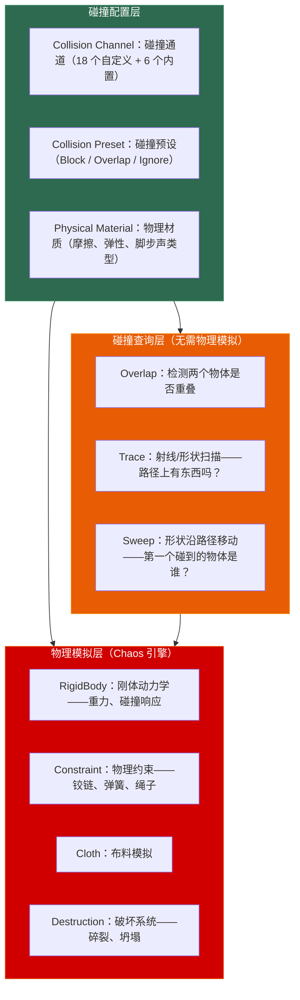

# 第十七章 物理与碰撞：从 Chaos 引擎到 Trace 实战体系

> **一句话理解**：UE5 的物理系统由两层组成——**碰撞查询层**（Overlap / Trace / Sweep）负责"检测这个世界里有什么"，**物理模拟层**（Chaos）负责"对象在这个世界里怎么运动"。碰撞通道（Collision Channel）和预设（Collision Preset）决定了"谁和谁会碰撞/重叠/忽略"，四种 Trace（Line / Sphere / Box / Capsule）覆盖了从子弹射线到近战挥砍的所有检测需求。理解碰撞配置矩阵和 Trace API 的选择，是物理面试的及格线。

---

## 17.1 概念直觉 —— 碰撞查询 vs 物理模拟

### 17.1.1 两层架构



```cpp
// ===== 碰撞查询 vs 物理模拟：核心区别 =====
//
// 碰撞查询（Collision Query）：
//   - 不依赖物理引擎的动力学模拟
//   - 实时执行：问"这个位置有什么？" → 立即返回结果
//   - 典型应用：子弹射线检测、近战攻击判定、脚部IK地面检测
//   - API：LineTrace / SphereTrace / OverlapMulti / SweepMulti
//   - 开销：单次检测 ~0.01ms（取决于碰撞体复杂度）
//
// 物理模拟（Physics Simulation）：
//   - 依赖 Chaos 引擎的帧间动力学积分
//   - 持续运行：每帧推进物体运动 → 检测碰撞 → 求解响应
//   - 典型应用：掉落的武器、破碎的墙壁、布料飘动
//   - API：UPrimitiveComponent::SetSimulatePhysics(true)
//   - 开销：每个模拟物体 ~0.1~1ms/帧
```

---

## 17.2 碰撞通道与预设 —— 碰撞配置矩阵

### 17.2.1 Collision Channel：定义"我是谁"和"我关心谁"

```cpp
// ===== 碰撞通道体系 =====
//
// UE 的碰撞检测基于"通道对通道"的响应矩阵：
//
// 每个物体有一个 ObjectType（"我是什么类型"）
// 物体的碰撞预设定义了"我对每种 Trace Channel 的响应"
//
// ┌────────────────┬──────────────────────────────────┐
// │ Object Channel  │ 物体自身所属的碰撞通道（你是谁）    │
// │ Trace Channel   │ 查询时使用的通道（你想检测什么）    │
// └────────────────┴──────────────────────────────────┘
//
// 内置 Object Channel（可在 Project Settings → Collision 中扩展）：
//   ECC_WorldStatic    —— 静态世界几何体（墙壁、地面）
//   ECC_WorldDynamic   —— 动态世界几何体（可移动平台）
//   ECC_Pawn           —— Pawn 角色
//   ECC_PhysicsBody    —— 物理模拟中的物体
//   ECC_Vehicle        —— 载具
//   ECC_Destructible   —— 可破坏物体
//
// 内置 Trace Channel（射线检测时指定"我想检测什么通道"）：
//   ECC_Visibility     —— 视线检测（子弹、AI视野、Mouse Picking）
//   ECC_Camera         —— 相机穿透检测

// ---------- C++ 中设置碰撞属性 ----------
void ConfigureCollision()
{
    // ① 设置碰撞启用状态
    UPrimitiveComponent* Comp = GetComponentByClass<UPrimitiveComponent>();
    if (!Comp) return;

    // 完全禁用碰撞（不参与任何碰撞检测）
    Comp->SetCollisionEnabled(ECollisionEnabled::NoCollision);

    // 仅查询（不产生物理碰撞响应——但可以被 Trace 检测到）
    Comp->SetCollisionEnabled(ECollisionEnabled::QueryOnly);

    // 仅物理（参与物理模拟——但不能被 Trace 检测到）
    Comp->SetCollisionEnabled(ECollisionEnabled::PhysicsOnly);

    // 查询 + 物理（同时参与两者）
    Comp->SetCollisionEnabled(ECollisionEnabled::QueryAndPhysics);

    // ② 设置 Object Type（"我是什么"）
    Comp->SetCollisionObjectType(ECC_Pawn);

    // ③ 设置对特定通道的响应
    Comp->SetCollisionResponseToChannel(ECC_Visibility, ECR_Block);   // 阻挡视线
    Comp->SetCollisionResponseToChannel(ECC_Camera, ECR_Ignore);      // 不阻挡相机
    Comp->SetCollisionResponseToChannel(ECC_Pawn, ECR_Overlap);       // 与角色重叠

    // ④ 批量设置——对所有通道的默认响应
    Comp->SetCollisionResponseToAllChannels(ECR_Block);  // 挡住一切
    // 然后单独放行某些通道
    Comp->SetCollisionResponseToChannel(ECC_Visibility, ECR_Ignore);
}

// ===== ECR 响应类型 =====
// ECR_Ignore    → 完全无视——不阻挡、不重叠、不产生事件
// ECR_Overlap   → 重叠——产生 Overlap 事件，但不阻挡移动
// ECR_Block     → 阻挡——物理/移动被拦截 + 产生 Hit 事件
```

### 17.2.2 Collision Preset：预设组合

```cpp
// ===== Collision Preset：碰撞预设 =====
//
// 在编辑器中（或 C++）为每个 Component 选择预设：
//
// NoCollision        → 完全无碰撞
// BlockAll           → 阻挡一切
// BlockAllDynamic    → 阻挡所有动态物体
// OverlapAll         → 与一切重叠（不阻挡）
// OverlapAllDynamic  → 与动态物体重叠
// Custom             → 自定义（手动配置每个通道的响应）
//
// 预设本质上是一组"对所有通道的默认响应 + 特定通道的覆盖"的快捷方式
// 编译后存在 CDO 中，运行时可通过 C++ 修改

// C++ 中设置预设：
void SetCollisionPreset(UPrimitiveComponent* Comp)
{
    // 方法 1：直接设置预设名（引擎内置或项目自定义）
    Comp->SetCollisionProfileName(TEXT("BlockAll"));

    // 方法 2：运行时覆盖特定通道
    Comp->SetCollisionEnabled(ECollisionEnabled::QueryAndPhysics);
    Comp->SetCollisionObjectType(ECC_Pawn);
    Comp->SetCollisionResponseToAllChannels(ECR_Ignore);   // 默认忽略一切
    Comp->SetCollisionResponseToChannel(ECC_WorldStatic, ECR_Block);  // 只挡墙壁
    Comp->SetCollisionResponseToChannel(ECC_Pawn, ECR_Overlap);       // 与角色重叠
}
```

---

## 17.3 Trace 实战 —— 四种形状的碰撞检测

### 17.3.1 Trace 家族速查

```cpp
// ===== Trace 四种形状与使用场景 =====
//
// LineTrace（射线）：沿一条直线检测
//   → 子弹、AI 视野、鼠标拾取（Mouse Picking）
//   → 最轻量——只有起点和终点
//
// SphereTrace（球形）：沿路径移动一个球体
//   → 近战"爆炸式"攻击判定、手部抓取检测
//   → 在半径方向上更宽容——不要求精确命中
//
// BoxTrace（盒形）：沿路径移动一个长方体
//   → 近战"扇形"攻击判定——覆盖一个矩形区域
//   → 例如："前方 200×100×50 的盒子"模拟剑的挥砍范围
//
// CapsuleTrace（胶囊形）：沿路径移动一个胶囊体
//   → 角色移动的"推开"检测、蹲下检测
//   → 没有棱角——不会卡在楼梯或门槛上

// ---------- ① LineTrace：最基础的射线检测 ----------
void LineTraceExample()
{
    FVector Start = GetActorLocation();
    FVector End = Start + GetActorForwardVector() * 5000.0f;  // 前方 50 米

    FHitResult Hit;
    FCollisionQueryParams Params;
    Params.AddIgnoredActor(this);     // 忽略自己
    Params.bTraceComplex = false;     // 使用简化碰撞体（性能更好）
    Params.bReturnPhysicalMaterial = true;  // 返回物理材质

    bool bHit = GetWorld()->LineTraceSingleByChannel(
        Hit,
        Start,
        End,
        ECC_Visibility,   // 使用 Visibility 通道
        Params
    );

    if (bHit)
    {
        AActor* HitActor = Hit.GetActor();
        FVector HitPoint = Hit.Location;
        FVector HitNormal = Hit.ImpactNormal;
        UPhysicalMaterial* PhysMat = Hit.PhysMaterial.Get();  // 物理材质

        // 画调试线
        DrawDebugLine(GetWorld(), Start, HitPoint, FColor::Red,
            false, 2.0f, 0, 2.0f);

        UE_LOG(LogPhysics, Log, TEXT("命中: %s at %s"),
            *HitActor->GetName(), *HitPoint.ToString());
    }
}

// ---------- ② SphereTrace：球形扫描 ----------
void SphereTraceExample()
{
    FVector Start = GetActorLocation();
    FVector End = Start + GetActorForwardVector() * 300.0f;
    float Radius = 50.0f;

    TArray<FHitResult> Hits;
    FCollisionQueryParams Params;
    Params.AddIgnoredActor(this);

    // SphereMulti：返回所有被扫到的物体（不是第一个）
    bool bHit = GetWorld()->SweepMultiByChannel(
        Hits,
        Start,
        End,
        FQuat::Identity,
        ECC_GameTraceChannel1,  // 自定义通道（项目设置中定义）
        FCollisionShape::MakeSphere(Radius),
        Params
    );

    for (const FHitResult& Hit : Hits)
    {
        if (AActor* HitActor = Hit.GetActor())
        {
            // 近战攻击判定——对每个被扫到的敌人造成伤害
            UGameplayStatics::ApplyDamage(HitActor, 25.0f,
                GetInstigatorController(), this, UDamageType::StaticClass());
        }
    }
}

// ---------- ③ BoxTrace：盒形扫描（扇形攻击） ----------
void BoxTraceExample()
{
    FVector Start = GetActorLocation();
    FVector End = Start + GetActorForwardVector() * 200.0f;
    FVector3f HalfSize = FVector3f(100.f, 50.f, 50.f);  // 宽 200 × 深 100 × 高 100（LWC 后必须使用 FVector3f）

    // 因为盒子有朝向，需要传入旋转
    FQuat Rotation = GetActorQuat();

    TArray<FHitResult> Hits;
    FCollisionQueryParams Params;
    Params.AddIgnoredActor(this);

    bool bHit = GetWorld()->SweepMultiByChannel(
        Hits,
        Start,
        End,
        Rotation,
        ECC_GameTraceChannel1,
        FCollisionShape::MakeBox(HalfSize),
        Params
    );

    // 可视化调试
    DrawDebugBox(GetWorld(), (Start + End) * 0.5f, HalfSize,
        Rotation, bHit ? FColor::Red : FColor::Green, false, 1.0f);
}

// ---------- ④ CapsuleTrace：胶囊扫描 ----------
void CapsuleTraceExample()
{
    FVector Start = GetActorLocation();
    FVector End = Start + FVector(0, 0, -200.0f);  // 向下检测
    float Radius = 34.0f;  // 角色胶囊体半径
    float HalfHeight = 88.0f;

    FHitResult Hit;
    FCollisionQueryParams Params;
    Params.AddIgnoredActor(this);

    GetWorld()->SweepSingleByChannel(
        Hit,
        Start,
        End,
        FQuat::Identity,
        ECC_Visibility,
        FCollisionShape::MakeCapsule(Radius, HalfHeight),
        Params
    );
}
```

### 17.3.2 Overlap 检测

```cpp
// ===== Overlap：检测"当前这个区域内有什么" =====
//
// Overlap 不沿路径移动——它在固定位置检测重叠

void OverlapExample()
{
    // 检测角色周围 500 半径内所有 Pawn
    TArray<FOverlapResult> Overlaps;
    FCollisionQueryParams Params;
    Params.AddIgnoredActor(this);

    bool bHasOverlaps = GetWorld()->OverlapMultiByObjectType(
        Overlaps,
        GetActorLocation(),
        FQuat::Identity,
        FCollisionObjectQueryParams(ECC_Pawn),  // 只关心 Pawn 类型
        FCollisionShape::MakeSphere(500.0f),
        Params
    );

    for (const FOverlapResult& Result : Overlaps)
    {
        if (APawn* NearbyPawn = Cast<APawn>(Result.GetActor()))
        {
            UE_LOG(LogPhysics, Log, TEXT("附近角色: %s"),
                *NearbyPawn->GetName());
        }
    }
}

// ===== Single vs Multi 的选择 =====
//
// Single：只返回第一个碰撞结果（最近的那个）
//   → 性能更好——引擎在找到第一个碰撞后立即返回，不继续检测
//   适用：子弹射线（打到第一个目标就停）、地面检测
//
// Multi：返回所有碰撞结果
//   → 引擎检测完整路径上的所有碰撞体
//   适用：近战攻击判定（一个挥砍可能打到多个敌人）、穿透弹
//
// 经验法则：如果你只需要最近的那个 → 用 Single 省性能
//           如果一颗子弹应该穿透多个目标 → 用 Multi
```

### 17.3.3 碰撞通道自定义

```cpp
// ===== 在 Project Settings → Engine → Collision 中配置 =====
//
// 自定义 Object Channel（最多 18 个）：
//   Projectile     —— 投射物
//   Pickup         —— 可拾取物品
//   Enemy          —— 敌人
//   Interactable   —— 可交互物体
//
// 自定义 Trace Channel（最多 18 个）：
//   WeaponTrace    —— 武器碰撞线
//   InteractionRay —— 交互射线
//   FootIK         —— 脚部 IK 地面检测
//
// 在 C++ 中使用自定义通道：
//   ECC_GameTraceChannel1  对应第一个自定义 Trace Channel
//   ECC_GameTraceChannel2  对应第二个
//   ...
//   ECC_GameTraceChannel18 对应第十八个
//
//   推荐做法：在项目的头文件中定义别名
//   #define ECC_WeaponTrace ECC_GameTraceChannel1
//   #define ECC_InteractionRay ECC_GameTraceChannel2
```

---

## 17.4 Physical Material —— 物理表面的属性

### 17.4.1 物理材质定义与使用

```cpp
// ===== Physical Material：表面属性数据 =====
//
// 每个碰撞体（Collision Shape）可以关联一个 UPhysicalMaterial
// 物理材质存储了该表面的物理属性：
//   - Friction（摩擦系数）：影响滑动物体的减速
//   - Restitution（弹性系数）：影响弹跳——0=完全非弹性，1=完全弹性
//   - Density（密度）：影响浮力
//   - SurfaceType（表面类型）：用于脚步声/粒子特效切换

// ---------- 获取碰撞表面的 Physical Material ----------
void CheckSurfaceType(const FHitResult& Hit)
{
    // 从 Hit 结果中获取物理材质
    UPhysicalMaterial* PhysMat = Hit.PhysMaterial.Get();

    if (PhysMat)
    {
        // 获取表面类型
        EPhysicalSurface SurfaceType = PhysMat->SurfaceType;

        switch (SurfaceType)
        {
            case EPhysicalSurface::SurfaceType_Default:
                UE_LOG(LogTemp, Log, TEXT("默认表面"));
                break;
            case SurfaceType1:   // 自定义表面——如 "Concrete"
                UE_LOG(LogTemp, Log, TEXT("混凝土"));
                break;
            case SurfaceType2:   // 如 "Wood"
                UE_LOG(LogTemp, Log, TEXT("木头"));
                break;
            case SurfaceType3:   // 如 "Metal"
                UE_LOG(LogTemp, Log, TEXT("金属"));
                break;
        }

        // 结合此信息——播放不同的脚步声
        PlayFootstepSound(SurfaceType);
    }
}

void PlayFootstepSound(EPhysicalSurface SurfaceType)
{
    USoundBase* SoundToPlay = nullptr;
    switch (SurfaceType)
    {
        case SurfaceType1: SoundToPlay = ConcreteFootstep; break;
        case SurfaceType2: SoundToPlay = WoodFootstep; break;
        case SurfaceType3: SoundToPlay = MetalFootstep; break;
        default: SoundToPlay = DefaultFootstep; break;
    }

    if (SoundToPlay)
    {
        UGameplayStatics::PlaySoundAtLocation(GetWorld(), SoundToPlay,
            GetActorLocation());
    }
}

UPROPERTY(EditDefaultsOnly) TObjectPtr<USoundBase> ConcreteFootstep;
UPROPERTY(EditDefaultsOnly) TObjectPtr<USoundBase> WoodFootstep;
UPROPERTY(EditDefaultsOnly) TObjectPtr<USoundBase> MetalFootstep;
UPROPERTY(EditDefaultsOnly) TObjectPtr<USoundBase> DefaultFootstep;
```

---

## 17.5 Physics Constraint —— 物理约束

### 17.5.1 Constraint 的类型与 C++ 控制

```cpp
// ===== PhysicsConstraint：连接两个物理体 =====
//
// Constraint 模拟物理世界中"物体之间的连接限制"：
//   铰链（门轴）、弹簧（悬挂）、球窝关节（肩膀）、滑轨（电梯）
//
// 核心参数：
//   - Linear Limits：限制线性运动的范围（X/Y/Z 各轴）
//   - Angular Limits：限制旋转运动的范围（Swing1/Swing2/Twist）
//   - Linear Motor：驱动线性运动（如自动门）
//   - Angular Motor：驱动旋转运动（如旋转风扇）

// ---------- C++ 中创建和配置 Constraint ----------
UCLASS()
class APhysicsDoor : public AActor
{
    GENERATED_BODY()

public:
    APhysicsDoor()
    {
        RootComponent = CreateDefaultSubobject<USceneComponent>(TEXT("Root"));

        // 门框（静态）
        DoorFrame = CreateDefaultSubobject<UStaticMeshComponent>(TEXT("Frame"));
        DoorFrame->SetupAttachment(RootComponent);

        // 门扇（物理模拟）
        DoorPanel = CreateDefaultSubobject<UStaticMeshComponent>(TEXT("Door"));
        DoorPanel->SetupAttachment(RootComponent);
        DoorPanel->SetSimulatePhysics(true);  // 开启物理模拟

        // 铰链约束——门只能绕 Z 轴旋转
        HingeConstraint = CreateDefaultSubobject<UPhysicsConstraintComponent>(
            TEXT("Hinge"));
        HingeConstraint->SetupAttachment(RootComponent);

        // ★ 注意：SetConstrainedComponents 和 SetLinearLimits / SetAngularLimits
        //   必须在 BeginPlay() 中调用——构造函数阶段 Chaos 刚体尚未创建，连接无效
    }

    virtual void BeginPlay() override
    {
        Super::BeginPlay();

        // 连接门框和门扇（此时物理世界已就绪）
        HingeConstraint->SetConstrainedComponents(
            DoorFrame, NAME_None,   // 约束到门框（静态）
            DoorPanel, NAME_None    // 被约束的门扇（动态）
        );

        // 锁定位置——门不能平移（三轴合一接口）
        HingeConstraint->SetLinearLimits(
            ELinearConstraintMotion::LCM_Locked,   // X
            ELinearConstraintMotion::LCM_Locked,   // Y
            ELinearConstraintMotion::LCM_Locked,   // Z
            0.0f);                                  // LimitSize（Locked 时忽略）

        // 锁定两个旋转轴——仅释放 Z 轴（铰链轴）
        // ★ SetAngularLimits 的官方签名是交替排列：Motion, Angle, Motion, Angle, Motion, Angle
        HingeConstraint->SetAngularLimits(
            EAngularConstraintMotion::ACM_Locked, 0.0f,   // Swing1
            EAngularConstraintMotion::ACM_Locked, 0.0f,   // Swing2
            EAngularConstraintMotion::ACM_Free,   0.0f);  // Twist
    }

protected:
    UPROPERTY(VisibleAnywhere)
    TObjectPtr<UStaticMeshComponent> DoorFrame;

    UPROPERTY(VisibleAnywhere)
    TObjectPtr<UStaticMeshComponent> DoorPanel;

    UPROPERTY(VisibleAnywhere)
    TObjectPtr<UPhysicsConstraintComponent> HingeConstraint;
};

// ===== Constraint 的常见类型 =====
//
// 铰链（Hinge）：
//   锁定所有平移 + 锁定两个旋转轴 → 只留一个旋转轴
//   应用：门、旋转桥、摆锤
//
// 球窝（Ball-and-Socket）：
//   锁定所有平移 + 全部旋转自由
//   应用：肩膀关节、项链的珠子连接
//
// 滑轨（Slider / Prismatic）：
//   锁定两个平移轴 + 锁定所有旋转 → 只留一个滑动轴
//   应用：电梯、抽屉
//
// 弹簧（Spring）：
//   在限定范围内施加弹性力
//   应用：悬挂系统、软绳
```

---

## 17.6 Chaos Destruction —— 破坏系统概览

### 17.6.1 破坏系统的核心概念

```cpp
// ===== Chaos Destruction：UE5 的破坏与碎裂系统 =====
//
// 核心流程：
// ① 在编辑器中对 Static Mesh 做 Voronoi 碎裂（Geometry Collection）
// ② 将 Geometry Collection 拖入场景（自动成为 Chaos 模拟物体）
// ③ 受到伤害/撞击时触发碎裂
// ④ Chaos 引擎接管碎片运动

// ---------- C++ 中触发破坏 ----------
UCLASS()
class ADestructibleWall : public AActor
{
    GENERATED_BODY()

public:
    // 受到伤害时触发破碎
    virtual float TakeDamage(float DamageAmount, FDamageEvent const& DamageEvent,
        AController* EventInstigator, AActor* DamageCauser) override
    {
        float ActualDamage = Super::TakeDamage(
            DamageAmount, DamageEvent, EventInstigator, DamageCauser);

        // 在伤害点施加 Chaos 破碎力
        ApplyDestructionForce(DamageEvent);

        return ActualDamage;
    }

    void ApplyDestructionForce(const FDamageEvent& DamageEvent)
    {
        if (DamageEvent.IsOfType(FPointDamageEvent::ClassID))
        {
            const FPointDamageEvent* PointDamage =
                static_cast<const FPointDamageEvent*>(&DamageEvent);

            // 对 Geometry Collection 的特定碎片施加力
            // 实际实现依赖 Chaos 的 Field System 或 GeometryCollectionComponent API
            FVector HitLocation = PointDamage->HitInfo.Location;
            FVector Impulse = PointDamage->ShotDirection * DestructionForce;

            // UE5 完整 API 略——核心是 GeometryCollectionComponent::ApplyExternalStrain
            // 或通过 RadialForce 组件施加 Chaos Field
        }
    }

    UPROPERTY(EditAnywhere, Category = "Destruction")
    float DestructionForce = 5000.0f;
};

// ===== Chaos 关键概念速记 =====
//
// Geometry Collection：
//   - 替代传统的 StaticMesh——专为可破坏物体设计
//   - 内部存储 Voronoi 碎片信息和 Cluster 层级
//   - 创建方式：右键 StaticMesh → Create Geometry Collection
//
// Cluster：
//   - 碎片的层级分组——顶层是大块碎片，底层是小碎片
//   - 小的撞击只触发上层 Cluster 碎裂——大块掉落
//   - 大的撞击触发深层碎裂——全部碎成小块
//
// Chaos Field System：
//   - 施加空间力场——不依赖逐个接触
//   - RadialFalloff：中心向外递减的力量场（爆炸）
//   - UniformVector：统一方向力（重力反转）
//   - AnchorField：将某些碎片锚定（不移动）
//
// Cache System：
//   - 录制破坏模拟结果——多人游戏中所有客户端看到一致的破坏
//   - 播放时零物理开销——纯动画回放
```

---

## 17.7 常见陷阱与面试深度追问

### 17.7.1 物理 TOP 8 陷阱

```cpp
// ===== 陷阱 #1：Trace 时忘记忽略自己 =====
void BadTrace()
{
    FHitResult Hit;
    GetWorld()->LineTraceSingleByChannel(Hit,
        GetActorLocation(),
        GetActorLocation() + GetActorForwardVector() * 1000,
        ECC_Visibility);
    // ✗ 射线从自己内部发出——第一个命中的就是自己！
    //    结果：永远打到自己的碰撞体
}
// ✓ FCollisionQueryParams Params; Params.AddIgnoredActor(this);

// ===== 陷阱 #2：Trace 起点在碰撞体内部 =====
void BadTraceStart()
{
    // ✗ 起点在角色的胶囊体内部
    FVector Start = GetActorLocation();
    // → 射线立即与自己的胶囊体重叠——Hit.bStartPenetrating = true
    //   但 Hit.GetActor() 可能是自己（已忽略）或 nullptr
}
// ✓ 起点向前偏移到碰撞体外部：
// FVector Start = GetActorLocation() + GetActorForwardVector() * 50.0f;

// ===== 陷阱 #3：在 Tick 中做大量 Trace 没有缓存 =====
void ABadEnemy::Tick(float DeltaTime)
{
    // ✗ 10 个敌人 × 每帧 5 条射线检测 = 50 条射线/帧
    //    在移动端可能占用 2~3ms——独占物理线程预算
    for (int i = 0; i < 5; ++i)
        GetWorld()->LineTraceSingleByChannel(...);
}
// ✓ 降低检测频率（每 3 帧检测一次）或使用 Async Trace

// ===== 陷阱 #4：物理模拟的物体没有设置 Sleep 阈值 =====
// ✗ 所有物理物体永远活跃——100 个碎石永远不会 Sleep
//    → 每帧 100 个物体的动力学积分——数 ms 的开销
// ✓ 在 Project Settings → Physics 中设置合理的 Sleep 阈值
//    或者手动：BodyInstance.SetSleepThresholds(...)

// ===== 陷阱 #5：碰撞预设使用 Custom 但没理解默认响应 =====
// ✗ 设置 Collision Profile = Custom → 所有通道默认 "Block"
//    → 角色被所有东西卡住——包括不应该阻挡的 Trigger 体积
// ✓ Custom 预设下必须显式设置每个通道的响应

// ===== 陷阱 #6：Multi Trace 返回的 Hits 已经按距离排序好了 =====
//   UE5 底层 GeomSweepMulti / RaycastMulti 在返回前已强制按 Distance 升序排列。
//   Hits[0] 百分百是距离起点最近的那个碰撞点——严禁画蛇添足手动 Sort，浪费 CPU。

// ===== 陷阱 #7：改变碰撞设置后没有调用 UpdateOverlaps =====
void ChangeCollisionRuntime()
{
    MyComp->SetCollisionResponseToChannel(ECC_Pawn, ECR_Overlap);
    // ✗ 如果此时已经有一个 Pawn 贴着这个组件——
    //    重叠事件不会重新触发！直到 Pawn 离开再回来
}
// ✓ 手动刷新重叠状态：
// MyComp->UpdateOverlaps();

// ===== 陷阱 #8：忘记在多 Trace 时忽略已命中的 Actor =====
void BadMultipleTrace()
{
    // ✗ 第一次 Trace 命中了 EnemyA → 对其应用伤害
    //    第二次 Trace（同一帧）又从 EnemyA 开始——又命中了 EnemyA → 双重伤害！
    // ✓ 累积 AddIgnoredActor：Params.AddIgnoredActor(HitActor);
}
```

### 17.7.2 面试速记三连

```
Q: "Object Channel 和 Trace Channel 的区别？"
A: Object Channel 定义"我是谁"——每个物体的 ObjectType（Pawn/WorldStatic/Vehicle）。
   Trace Channel 定义"我想检测什么"——射线或 Sweep 查询时指定的通道（Visibility/Camera）。
   碰撞响应矩阵是"Object × Trace"——例如"Pawn 对 Visibility 的响应是 Block"，
   意思是"用 Visibility 通道做射线检测时，Pawn 会阻挡射线并被命中"。

Q: "LineTrace 和 Sweep 的区别？"
A: LineTrace 沿一条无限细的直线检测——只返回第一个交点。
   Sweep 沿路径移动一个形状（球/盒/胶囊）——检测整个形状在路径上碰撞到的所有物体。
   Sweep 可以返回"首次阻挡点"（Single）或"所有命中"（Multi）。
   子弹用 LineTrace，近战攻击判定用 SphereSweep 或 BoxSweep。

Q: "什么时候用 Physics Simulation，什么时候用 Trace 查询？"
A: 物理模拟用于持续动力学（掉落/弹跳/碎裂）——依赖帧间积分和碰撞求解。
   Trace 查询用于实时判断（射线检测/攻击判定/地面检测）——不依赖物理引擎的动力学模拟。
   如果你只需要"这个位置有什么"→ 用 Trace。如果你需要"这个物体怎么运动"→ 用 Simulation。
```

---

## 17.8 30 秒速答

> **面试被问："UE 的碰撞系统是怎么配置的？Collision Preset 和 Custom 的区别？"**

UE 碰撞基于"通道对通道"的响应矩阵：每个物体有一个 Object Channel（我是谁），每个 Trace Channel 定义一种查询类型。碰撞预设（Preset）是预配置的组合——BlockAll / OverlapAll / NoCollision 等快捷方式。Custom 模式暴露所有通道的独立响应——你可以精确控制"对 Pawn 阻挡、对 Visibility 忽视、对 Camera 阻挡"。面试中补一句：`SetCollisionResponseToChannel` 是运行时修改碰撞响应的核心 API。

> **面试追问："Trace 返回的 FHitResult 里有哪些关键信息？"**

`Hit.Location`（命中点世界坐标）、`Hit.ImpactNormal`（命中表面法线）、`Hit.Actor`（被命中的 Actor）、`Hit.Component`（被命中的组件）、`Hit.PhysMaterial`（物理材质——表面类型）、`Hit.BoneName`（如果是骨骼网格体，返回被命中的骨骼名——用于爆头判定）、`Hit.Distance`（从起点到命中点的距离）、`Hit.bBlockingHit`（是阻挡命中还是重叠）。

> **面试追问："Multi Trace 返回的 Hits 是按距离排序的吗？"**

是的——UE5 底层管线（`GeomSweepMulti` / `RaycastMulti`）在返回 `TArray<FHitResult>` 之前已经强制按 `Distance` 从小到大严格排序。`Hits[0]` 就是距离起点最近的那个碰撞点，不需要、也不应该手动调用 `Hits.Sort()` 浪费 CPU 算力。但注意：如果你只需要最近的目标，`SweepSingle` 在找到第一个碰撞后立即返回，性能远优于 `SweepMulti`。

> **面试追问："Physical Material 的主要用途是什么？"**

三个核心用途：① 表面类型标识（踩在混凝土/木头/金属上 → 不同脚步声 + 粒子）；② 物理属性（摩擦力影响滑动物体、弹性系数影响弹跳高度）；③ 游戏玩法（某些技能只能释放在地上、爬墙需要特定表面类型）。获取方式：Trace 时设置 `bReturnPhysicalMaterial = true` → Hit.PhysMaterial。

> **面试追问："PhysicsConstraint 的 Linear Limit 和 Angular Limit 是什么意思？"**

Linear Limit 约束两个物体之间的平移自由度——锁死（Locked）/ 限定范围（Limited）/ 自由（Free）。Angular Limit 约束旋转自由度——Swing1（前后摆）、Swing2（左右摆）、Twist（绕轴旋转）。门铰链 = 所有 Linear Locked + Swing1/2 Locked + Twist Free——只留一个旋转轴。弹簧 = 在 Limited 范围内施加弹性力。

---

## 17.9 本章自查清单

- [ ] 能区分碰撞查询（Trace/Overlap）和物理模拟（Chaos 动力学）的适用场景
- [ ] 理解 Object Channel（我是谁）和 Trace Channel（检测什么）的配置矩阵
- [ ] 能写出 LineTrace / SphereTrace / BoxTrace / CapsuleTrace 四种 Trace 的 C++ 代码
- [ ] 知道 Single vs Multi 的选择策略和 Multi 结果已按距离排好序的底层保证
- [ ] 能配置自定义碰撞通道并在 C++ 中使用
- [ ] 理解 Collision Preset 和 Custom 模式的区别
- [ ] 能说出 FHitResult 的至少 6 个关键字段
- [ ] 理解 PhysicsConstraint 的 Linear/Angular Limit 的作用
- [ ] 知道 Physical Material 的三个主要用途
- [ ] 能解释 Chaos Destruction 的 Geometry Collection + Cluster + Field 体系
- [ ] 知道 Trace 时忽略自己、起点偏移、频率控制三个性能/准确性要点
- [ ] 能在碰撞设置修改后调用 UpdateOverlaps 刷新状态

---

> 📚 **第三部第四章完结。** 物理与碰撞系统是游戏交互的"触觉层"——Trace 让你感知世界，Collision Preset 让你配置规则，Physical Material 让你分辨表面，Constraint 让你连接物体。接下来进入 Ch18：音频系统——MetaSounds、SoundCue、Submix 与空间音频。

> 💡 **前置依赖提醒**：
> - Actor/Component 模型（UPrimitiveComponent 的碰撞体） → 见 [Ch8：Actor 与 Component 模型](../08_actor_component/)
> - AI Perception（视野射线检测的配置） → 见 [Ch15：AI 系统](../15_ai_system/)
> - 动画 Notify（AnimNotify 中触发攻击 Trace） → 见 [Ch16：动画系统](../16_animation_system/)
> - 网络复制（物理模拟的服务器同步） → 见 [Ch12：序列化与网络复制](../12_serialization_networking/)
