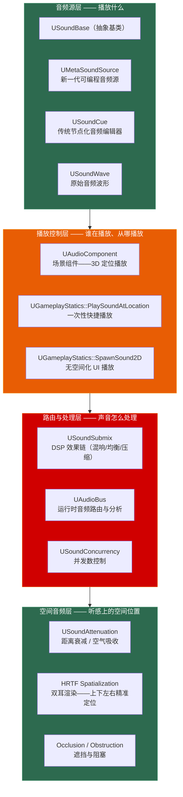

# 第十八章 音频系统：从 MetaSounds 到空间音频的完整链路

> **一句话理解**：UE5 的音频系统是四层架构——**AudioComponent** 负责"谁在播放、从哪播放"（播放/停止/衰减/3D 定位），**SoundBase** 负责"播放什么"（MetaSounds 可编程音频源 vs SoundCue 节点编辑器），**Submix & AudioBus** 负责"声音怎么处理"（DSP 效果链、动态路由、运行时音频分析），**Spatialization** 负责"听感上的空间位置"（Attenuation 距离衰减、HRTF 双耳渲染）。理解这四层的分工和 C++ 控制链路，是音频面试的及格线。

---

## 18.1 概念直觉 —— 音频系统的四层架构



```cpp
// ===== 音频四层架构速记 =====
//
// 音频源层（SoundBase）：
//   MetaSounds —— UE5 新一代，可编程 DSP 图，参数实时控制
//   SoundCue   —— 传统节点编辑器，随机/混合/衰减节点链
//   SoundWave  —— 原始 .wav 数据（一般不直接使用）
//
// 播放控制层（AudioComponent / GameplayStatics）：
//   AudioComponent   —— 挂载在 Actor 上的 3D 音频组件（空间化 + 衰减）
//   PlaySoundAtLocation —— 一次性快捷播放（适合 UI、环境音）
//   SpawnSound2D      —— 无 3D 空间化的 2D 播放（适合 UI 音效）
//
// 路由与处理层（Submix / AudioBus）：
//   Submix   —— 按类别 DSP 处理（Master/SFX/Music/Voice 各自独立的混响/压缩）
//   AudioBus —— 运行时音频路由（将一组音频输出到总线 → 供其他系统分析/可视化）
//
// 空间音频层（Attenuation / HRTF）：
//   Attenuation —— 距离衰减曲线（声音随距离变小 + 空气吸收高频衰减）
//   HRTF         —— 双耳渲染（用头部传递函数模拟声源在 3D 空间的位置）
//   Occlusion    —— 遮挡（声源被墙挡住——声音闷了）
```

---

## 18.2 AudioComponent —— 音频播放的核心 API

### 18.2.1 五种播放方式速查

```cpp
// ===== 五种音频播放方式：从快捷到完全控制 =====

void AudioPlaybackExamples(AActor* ContextActor)
{
    USoundBase* MySound = ...;  // MetaSound 或 SoundCue 或 SoundWave

    // ---------- ① PlaySoundAtLocation：纯快捷——不返回组件 ----------
    // 适用：脚步声、撞击声、环境音——播完即弃
    UGameplayStatics::PlaySoundAtLocation(
        ContextActor->GetWorld(),
        MySound,
        ContextActor->GetActorLocation(),
        FRotator::ZeroRotator,
        1.0f,    // VolumeMultiplier
        1.0f,    // PitchMultiplier
        0.0f,    // StartTime
        nullptr, // AttenuationSettings（nullptr = 使用 Sound 内置设定）
        nullptr  // ConcurrencySettings
    );

    // ---------- ② PlaySound2D：无空间化的 UI 播放 ----------
    // 适用：按钮点击、菜单切换、提示音——不需要 3D 定位
    UGameplayStatics::PlaySound2D(
        ContextActor->GetWorld(),
        MySound,
        1.0f, 1.0f, 0.0f
    );

    // ---------- ③ SpawnSoundAttached：挂载到组件——返回 AudioComponent ----------
    // 适用：角色身上的持续音效（引擎声、心跳声、护盾嗡嗡声）
    UAudioComponent* AttachedComp = UGameplayStatics::SpawnSoundAttached(
        MySound,
        ContextActor->GetRootComponent(),  // AttachToComponent
        NAME_None,                          // AttachPointName（Socket 名）
        FVector::ZeroVector,                // Location（相对偏移）
        FRotator::ZeroRotator,              // Rotation
        EAttachLocation::KeepRelativeOffset,
        false,    // bStopWhenAttachedToDestroyed
        1.0f,     // VolumeMultiplier
        1.0f,     // PitchMultiplier
        0.0f,     // StartTime
        nullptr,  // AttenuationSettings
        nullptr,  // ConcurrencySettings
        true      // bAutoDestroy —— 播放完自动销毁
    );

    // ---------- ④ SpawnSound2D：2D 播放但返回组件——可控制 ----------
    // 适用：需要动态音量/音高控制的 UI 音效
    UAudioComponent* TwoDComp = UGameplayStatics::SpawnSound2D(
        ContextActor->GetWorld(),
        MySound,
        1.0f, 1.0f, 0.0f,
        nullptr,  // ConcurrencySettings
        true,     // bPersistAcrossLevelTransition
        true      // bAutoDestroy
    );

    // ---------- ⑤ 手动创建 UAudioComponent：终极控制 ----------
    // 适用：需要精细控制每一个参数——动态混音、运行时 DSP 切换
    UAudioComponent* ManualComp = NewObject<UAudioComponent>(ContextActor);
    ManualComp->RegisterComponent();                          // ★ 必须注册！
    ManualComp->SetSound(MySound);
    ManualComp->SetVolumeMultiplier(0.8f);
    ManualComp->SetPitchMultiplier(1.2f);
    ManualComp->bAutoDestroy = true;
    ManualComp->Play();
}
```

### 18.2.2 AudioComponent 的完整控制接口

```cpp
// ===== UAudioComponent 核心方法 =====
UCLASS()
class UAudioComponentExample
{
    void FullControl(UAudioComponent* AudioComp)
    {
        // ---------- 播放控制 ----------
        AudioComp->Play();         // 从头播放
        AudioComp->Play(1.5f);     // 从 1.5 秒处开始播放
        AudioComp->Stop();         // 立即停止
        // ★ 没有 StopDelayed —— 延迟停止需用 Timer 或 FadeOut 淡出后 Stop
        AudioComp->SetPaused(true);    // 暂停
        AudioComp->SetPaused(false);   // 继续

        // ---------- 淡入淡出 ----------
        AudioComp->FadeIn(0.5f);                        // 0.5 秒淡入到 1.0
        AudioComp->FadeIn(0.5f, 0.8f);                  // 0.5 秒淡入到 0.8
        AudioComp->FadeOut(1.0f);                       // 1 秒淡出到 0
        AudioComp->FadeOut(1.0f, 0.2f);                 // 1 秒淡出到 0.2（背景弱化）

        // ---------- 音量与音高 ----------
        AudioComp->SetVolumeMultiplier(1.5f);            // 提升 50%
        AudioComp->SetPitchMultiplier(0.9f);             // 降低 10%——模拟慢动作
        // ★ AdjustVolume(Duration, TargetLevel) —— 第一个参数是持续时间，第二个是目标值
        AudioComp->AdjustVolume(0.5f, 0.1f);            // 0.5 秒内将音量调整到 0.1
        AudioComp->AdjustVolume(1.0f, -0.2f);           // 1.0 秒内将音量调整到 -0.2

        // ---------- 空间化设置 ----------
        // ★ 没有 AdjustAttenuation —— 运行时修改衰减需通过 AttenuationOverrides 结构体
        AudioComp->bOverrideAttenuation = true;          // 必须先勾选覆盖
        // AudioComp->AttenuationOverrides.bAttenuate = true;
        // AudioComp->AttenuationOverrides.dBAttenuationAtMax = -60.f;  // 示例：修改最大衰减量
        // ⚠️ UAudioComponent 上没有 SetUISound() 方法！
        //    bIsUISound 是 USoundBase 资产层级的属性，或 FActiveSound 内部标记
        //    想让音效不经过空间化 → 使用 UGameplayStatics::PlaySound2D / SpawnSound2D

        // ---------- 状态查询 ----------
        bool bPlaying = AudioComp->IsPlaying();
        float PlaybackTime = AudioComp->GetPlaybackTime();
        float Duration = AudioComp->GetDuration();
        bool bVirtualized = AudioComp->IsVirtual();      // 是否因距离太远被虚拟化
    }
};
```

### 18.2.3 实战：角色脚步声系统

```cpp
// ===== 完整脚步声系统：物理材质 + 随机音效池 + 冷却 =====
UCLASS()
class UFootstepComponent : public UActorComponent
{
    GENERATED_BODY()

public:
    virtual void BeginPlay() override
    {
        Super::BeginPlay();
        OwnerActor = GetOwner();

        if (OwnerActor)
        {
            // 缓存角色骨骼网格体——获取脚下 Socket 位置
            CachedMesh = OwnerActor->FindComponentByClass<USkeletalMeshComponent>();
        }
    }

    // 由 AnimNotify 调用
    UFUNCTION(BlueprintCallable, Category = "Footstep")
    void PlayFootstep()
    {
        if (!OwnerActor || !CachedMesh) return;

        // ① 脚下射线检测——获取物理表面类型
        FVector FootLocation = CachedMesh->GetSocketLocation(FootSocketName);
        FVector TraceStart = FootLocation + FVector(0, 0, 20.0f);
        FVector TraceEnd   = FootLocation - FVector(0, 0, 50.0f);

        FHitResult Hit;
        FCollisionQueryParams Params;
        Params.AddIgnoredActor(OwnerActor);
        Params.bReturnPhysicalMaterial = true;

        EPhysicalSurface SurfaceType = EPhysicalSurface::SurfaceType_Default;
        if (OwnerActor->GetWorld()->LineTraceSingleByChannel(
                Hit, TraceStart, TraceEnd, ECC_Visibility, Params))
        {
            if (Hit.PhysMaterial.IsValid())
            {
                SurfaceType = Hit.PhysMaterial->SurfaceType;
            }
        }

        // ② 根据表面类型选择音效池
        TArray<USoundBase*>* SoundPool = FootstepMap.Find(SurfaceType);
        if (!SoundPool || SoundPool->Num() == 0) return;

        // ③ 随机选择 + 轻微随机音高（避免重复感）
        int32 Index = FMath::RandRange(0, SoundPool->Num() - 1);
        float RandomPitch = FMath::RandRange(0.95f, 1.05f);

        UGameplayStatics::PlaySoundAtLocation(
            OwnerActor->GetWorld(),
            (*SoundPool)[Index],
            Hit.bBlockingHit ? Hit.Location : OwnerActor->GetActorLocation(),
            FRotator::ZeroRotator,
            1.0f,
            RandomPitch
        );
    }

    UPROPERTY(EditDefaultsOnly, Category = "Footstep")
    FName FootSocketName = TEXT("foot_l");

protected:
    UPROPERTY(EditDefaultsOnly, Category = "Footstep")
    TMap<TEnumAsByte<EPhysicalSurface>, TArray<USoundBase*>> FootstepMap;
    // 键 = SurfaceType_Default / SurfaceType1(Concrete) / SurfaceType2(Wood) ...
    // 值 = 该表面的脚步声变体数组

    TWeakObjectPtr<AActor> OwnerActor;
    TObjectPtr<USkeletalMeshComponent> CachedMesh;
};
```

---

## 18.3 MetaSounds —— UE5 新一代可编程音频源

### 18.3.1 MetaSounds vs SoundCue 核心区别

```cpp
// ===== MetaSounds：UE5 的音频"Material Editor" =====
//
// SoundCue（UE4 遗留）：
//   - 节点数固定（WavePlayer / Random / Mixer / Modulator / Attenuation）
//   - 没有真正的参数系统——只能通过 WaveParameter 等节点做简单映射
//   - 逻辑编排能力弱——无法做条件分支、状态保持
//
// MetaSounds（UE5 新一代）：
//   - 类似 Material Editor 的完整节点图
//   - 内置参数系统：Bool / Float / Int / String / Wave / Trigger
//   - 支持 Input 节点（接收外部参数）和 Output 节点（回传音频数据）
//   - 支持 Generator（振荡器/噪声）——不需要预录音频文件也能合成声音
//   - 支持实时 Parameter 控制——比 SoundCue 灵活一个数量级
//
// 一句话：SoundCue = 音频播放器，MetaSounds = 音频合成器 + 效果器

// ---------- C++ 中动态控制 MetaSounds 参数 ----------
void ControlMetaSound(UAudioComponent* AudioComp)
{
    if (!AudioComp || !AudioComp->GetSound()) return;

    // MetaSounds 参数通过 AudioComponent 的 Set*Parameter 系列方法设置
    // 注意：参数名必须与 MetaSound 图中定义的 Input 节点名称完全匹配

    // 浮点参数——引擎推力、心跳频率
    AudioComp->SetFloatParameter(FName(TEXT("EngineRPM")), 6500.0f);

    // 布尔参数——开关效果器
    AudioComp->SetBoolParameter(FName(TEXT("bUnderwater")), true);

    // 整数参数——选择变体
    AudioComp->SetIntParameter(FName(TEXT("GearIndex")), 3);

    // 字符串参数——切换音色库
    AudioComp->SetStringParameter(FName(TEXT("SurfaceMaterial")), TEXT("Metal"));

    // 触发参数——一次性事件（如"播放碰撞音"）
    AudioComp->SetTriggerParameter(FName(TEXT("OnImpact")));

    // Wave 参数——运行时替换音频波形
    AudioComp->SetWaveParameter(FName(TEXT("ExplosionSample")), ExplosionWave);
}

// ===== MetaSounds 关键 API 速记 =====
//
// UMetaSoundSource：
//   - 继承自 USoundBase——可以用于任何接受 USoundBase* 的地方
//   - 运行时不可编辑——所有修改通过 Set*Parameter 完成
//
// 参数类型与作用：
//   Float   → 连续量（速度、距离、强度）
//   Bool    → 开关（模式切换、效果器激活）
//   Int     → 离散选项（音阶、索引）
//   Trigger → 瞬时事件（碰撞、射击）——触发后自动复位
//   Wave    → 运行时替换音频资源
//   String  → 标签/标识
```

### 18.3.2 实战：动态引擎音效

```cpp
// ===== 动态引擎音效：MetaSounds + 实时 RPM 参数 =====
UCLASS()
class AEngineSoundController : public AActor
{
    GENERATED_BODY()

public:
    virtual void BeginPlay() override
    {
        Super::BeginPlay();

        // 挂载 AudioComponent 到自身
        EngineAudioComp = UGameplayStatics::SpawnSoundAttached(
            EngineSound,          // UMetaSoundSource*
            GetRootComponent(),
            NAME_None,
            FVector::ZeroVector,
            FRotator::ZeroRotator,
            EAttachLocation::KeepRelativeOffset,
            false,                // bStopWhenAttachedToDestroyed
            0.0f,                 // VolumeMultiplier——先静音
            1.0f
        );
    }

    virtual void Tick(float DeltaTime) override
    {
        Super::Tick(DeltaTime);

        if (!EngineAudioComp || !EngineAudioComp->IsPlaying()) return;

        // 从物理组件读取当前发动机转速
        float CurrentRPM = GetEngineRPM();

        // 平滑 RPM 参数——避免突变
        float SmoothedRPM = FMath::FInterpTo(
            CachedRPM, CurrentRPM, DeltaTime, 3.0f);
        CachedRPM = SmoothedRPM;

        // ★ 实时更新 MetaSounds 的浮点参数
        //   MetaSound 图内部用这个参数驱动：振荡器频率 + 滤波器截止 + 音量曲线
        EngineAudioComp->SetFloatParameter(FName(TEXT("EngineRPM")), SmoothedRPM);

        // 引擎负载影响额外谐波强度
        float Load = GetEngineLoad();
        EngineAudioComp->SetFloatParameter(FName(TEXT("EngineLoad")), Load);
    }

    float GetEngineRPM() const
    {
        // 从载具物理或自定义组件中读取
        return 3000.0f;
    }

    float GetEngineLoad() const
    {
        return 0.5f;
    }

protected:
    UPROPERTY(EditDefaultsOnly, Category = "Audio")
    TObjectPtr<USoundBase> EngineSound;  // 指向 UMetaSoundSource 资产

    UPROPERTY()
    TObjectPtr<UAudioComponent> EngineAudioComp;

    float CachedRPM = 0.0f;
};
```

---

## 18.4 SoundCue —— 传统节点化音频编辑器

### 18.4.1 SoundCue 核心节点族

```cpp
// ===== SoundCue：节点编辑器概览 =====
//
// SoundCue 是 UE4 时代的主力音频工具，在 UE5 中依然广泛使用。
// 它通过连线节点图定义"一个音频事件触发后怎么播放”。
//
// 核心节点族：
// ┌────────────────┬──────────────────────────────────────┐
// │ WavePlayer      │ 播放单个 .wav 文件                     │
// │ Random          │ N 个输入中随机选一个（变体不重复感）       │
// │ Mixer           │ 叠加多个输入（同时播放多个波形）          │
// │ Modulator       │ 调制音量/音高（低频振荡器做颤音/震动）    │
// │ Attenuation     │ 覆盖默认的空间衰减行为                   │
// │ Concatenator    │ 串接多个波形（A→B→C 依次播放）           │
// │ Looping         │ 循环播放（引擎声、环境音）               │
// │ Delay           │ 延迟播放（时间差产生空间感）              │
// │ SoundClass      │ 音效分类（SFX/Music/Voice——独立音量控制） │
// └────────────────┴──────────────────────────────────────┘

// ---------- C++ 中使用 SoundCue ----------
void PlayGunshotSound(AActor* Shooter)
{
    // SoundCue 在使用上与 MetaSounds 完全相同——它们都是 USoundBase*
    USoundCue* GunshotCue = LoadObject<USoundCue>(nullptr,
        TEXT("/Game/Audio/Cues/Gunshot_Cue.Gunshot_Cue"));

    if (GunshotCue)
    {
        // 在枪口位置播放——自动应用 SoundCue 中配置的 Attenuation 节点
        UGameplayStatics::PlaySoundAtLocation(
            Shooter->GetWorld(),
            GunshotCue,
            Shooter->GetActorLocation() + Shooter->GetActorForwardVector() * 100.0f
        );
    }
}
```

### 18.4.2 SoundCue vs MetaSounds 决策矩阵

```cpp
// ===== 什么时候用 SoundCue，什么时候用 MetaSounds？ =====
//
// 继续使用 SoundCue：
//   ✓ 项目从 UE4 迁移——已有数百个 SoundCue 资产
//   ✓ 简单的一次性音效——枪声、爆炸、UI 点击
//   ✓ 只需随机变体 + 简单衰减——SoundCue 的 Random + Attenuation 节点足够
//   ✓ 团队还在学习曲线——SoundCue 节点图更简单直观
//
// 切换到 MetaSounds：
//   ✓ 需要运行时参数——引擎 RPM、呼吸频率、动态混响量
//   ✓ 需要音频合成——不需要 .wav 文件，纯算法生成（风声、科幻音效）
//   ✓ 需要条件逻辑——"如果在室内用这个混响，室外用那个"
//   ✓ 需要 Trigger 事件——"碰撞发生的瞬间播放撞击音"
//   ✓ 新项目从零开始——MetaSounds 是 UE5 的推荐方向
//
// 经验法则：
//   简单音效（播一次、不管了） → SoundCue
//   复杂音效（实时参数、音频合成、条件路由） → MetaSounds
```

---

## 18.5 Submix 与 AudioBus —— 音频路由与 DSP 管线

### 18.5.1 Submix：按类别 DSP 效果链

```cpp
// ===== Submix：音频后处理的"Post Process Volume" =====
//
// Submix 将音频分类路线——每一路经过独立的 DSP 效果链：
//
//   Master Submix（主输出）
//   ├── SFX Submix（音效）
//   │   ├── Reverb（混响）→ 枪声在走廊里的回响
//   │   └── EQ（均衡器）→ 削减脚步声的低频，提升清晰度
//   ├── Music Submix（音乐）
//   │   └── Compressor → 动作高潮时自动压缩，不让音乐盖过对话
//   ├── Voice Submix（对话）
//   │   └── EQ + De-esser → 对话更清晰
//   └── Ambient Submix（环境音）
//       └── Reverb + Delay → 风声、虫鸣的空间感
//
// 在 Project Settings → Audio 中配置默认 Submix 层级
// 每个 SoundBase 可指定所属的 SoundClass（→ Submix）

// ---------- C++ 中动态控制 Submix ----------
void ControlSubmix()
{
    // 获取 Submix
    USoundSubmix* SFXSubmix = LoadObject<USoundSubmix>(nullptr,
        TEXT("/Game/Audio/Submixes/SFX_Submix.SFX_Submix"));

    if (SFXSubmix)
    {
        // 动态调整 Submix 的输出音量（主音量 0.0-1.0）
        // UGameplayStatics 提供了直接控制 Submix 的静态方法
    }
}

// ---------- AudioComponent 级别的 Submix Send ----------
void SetupSubmixSend(UAudioComponent* AudioComp, USoundSubmix* ReverbSubmix)
{
    // 将单个 AudioComponent 的输出发送到指定 Submix
    // SendLevel: 0.0 = 不发送，1.0 = 全量发送
    AudioComp->SetSubmixSend(ReverbSubmix, 0.5f);

    // 典型用途：
    // - 特定角色的脚步声额外发送到"洞穴混响"Submix
    // - 关键对话发送到"无线电滤波"Submix（模拟对讲机效果）
}
```

### 18.5.2 AudioBus：运行时音频路由与分析

```cpp
// ===== AudioBus：运行时音频数据总线 =====
//
// AudioBus 是一条"音频数据管道"，但路由拓扑有严格的物理边界：
//
// ① AudioComponent → Submix → AudioBus（正统路径）
//    普通 AudioComponent 只有 SetSubmixSend 权限——不能直接裸连 UAudioBus。
//    音频数据必须流经 USoundSubmix，在 Submix 层级配置 AudioBusSends。
//
// ② USoundSourceBus → AudioBus（直连路径）
//    如果想让一个声源纯粹作为总线输入，使用 USoundSourceBus（继承自 USoundBase），
//    通过 SetSound 直接播放——它本身就是 AudioBus 的声源适配器。
//
// 典型场景：
//   - 音频可视化——Music Submix → AudioBus → EnvelopeAnalyzer → 驱动灯光/UI
//   - 语音聊天混合——多个玩家的语音发送到 Bus → 统一处理后输出
//   - 自定义 DSP——将特定音频路由到 Bus → 音频分析器做 FFT 频谱分析

// ---------- 音频可视化：Submix → AudioBus → 包络分析 ----------
UCLASS()
class UAudioVisualizer : public UActorComponent
{
    GENERATED_BODY()

public:
    void BeginPlay() override
    {
        Super::BeginPlay();

        // 创建 AudioComponent 播放音乐
        MusicComp = UGameplayStatics::SpawnSound2D(
            GetWorld(),
            BackgroundMusic,
            1.0f, 1.0f, 0.0f,
            nullptr,
            true,  // bPersistAcrossLevelTransition
            false  // bAutoDestroy——手动管理生命周期
        );

        // ★ 正统路径：将音频发送到自定义 Submix（而非直接连 AudioBus）
        //   Submix 到 AudioBus 的路由在编辑器中配置（Submix → AudioBusSends）
        if (MusicComp && MusicSubmix)
        {
            MusicComp->SetSubmixSend(MusicSubmix, 1.0f);
        }

        // ★ UE5 正统音频包络分析方式：
        //   使用 UAudioMixerBlueprintLibrary::RegisterSubmixEnvelopeFollowerDelegate
        //   注册回调 → 音频线程异步推送包络数据到 GameThread
        //   或者使用 UEnvelopeFollowerListener（ActorComponent 封装）
        //   ⚠️ 引擎不存在 UAudioBusEnvelopeAnalyzer 这个 UObject 类——
        //     音频包络分析是严格的音频线程异步回调机制，不能在 GameThread 上
        //     通过虚构的对象主动 Pull 变量
        SetupEnvelopeCallback();

        // 启动定时读取（从缓存的包络值）
        GetWorld()->GetTimerManager().SetTimer(
            AnalysisTimerHandle,
            this,
            &UAudioVisualizer::OnEnvelopeUpdate,
            0.05f,   // 每 50ms 更新一次 UI（20Hz 刷新率）
            true
        );
    }

    void SetupEnvelopeCallback()
    {
        // ✓ UE5 正统做法：通过 UAudioMixerBlueprintLibrary 注册包络跟随器
        //   FOnSubmixEnvelopeBP delegate;  // 存储为成员变量
        //   UAudioMixerBlueprintLibrary::RegisterSubmixEnvelopeFollowerDelegate(
        //       GetWorld(), MusicSubmix, delegate);
        //   delegate 被触发时，将包络值缓存到成员变量 CurrentAmplitude 中
    }

    void OnEnvelopeUpdate()
    {
        // 从缓存的包络值中读取（由音频线程回调更新）
        // 驱动 UI / 灯光强度
        UpdateVisuals(CurrentAmplitude);
    }

    UFUNCTION(BlueprintImplementableEvent, Category = "Visualization")
    void UpdateVisuals(float Amplitude);

protected:
    UPROPERTY(EditDefaultsOnly, Category = "Audio")
    TObjectPtr<USoundBase> BackgroundMusic;

    UPROPERTY(EditDefaultsOnly, Category = "Audio")
    TObjectPtr<USoundSubmix> MusicSubmix;    // ★ 音频通过 Submix 路由

    UPROPERTY()
    TObjectPtr<UAudioComponent> MusicComp;

    FTimerHandle AnalysisTimerHandle;

    float CurrentAmplitude = 0.0f;  // 由音频线程回调更新，GameThread 读取
};
```
```

### 18.5.3 SoundConcurrency：并发数控制

```cpp
// ===== SoundConcurrency：防止"音频齐射" =====
//
// 问题：10 个敌人同时死亡 → 10 个死亡音效同时播放 → 音频削波、刺耳
// 解决：USoundConcurrency 限制同一组音频的最大并发数

void SetupConcurrency(USoundBase* DeathSound)
{
    // 方式 1：在编辑器中为 SoundCue / MetaSound 指定 Concurrency 资产
    // 方式 2：在 C++ 播放时动态指定

    USoundConcurrency* DeathConcurrency = LoadObject<USoundConcurrency>(nullptr,
        TEXT("/Game/Audio/Concurrency/Death_Limit_3.Death_Limit_3"));

    // Concurrency 资产配置：
    //   Max Count = 3         → 最多同时播放 3 个
    //   Resolution Rule = Stop Oldest → 超出时停止最早的那个
    //   Volume Scale = 0.8    → 同时播放 3 个时每个降 20%

    UGameplayStatics::PlaySoundAtLocation(
        GetWorld(),
        DeathSound,
        GetActorLocation(),
        FRotator::ZeroRotator,
        1.0f, 1.0f, 0.0f,
        nullptr,           // Attenuation
        DeathConcurrency   // ★ Concurrency
    );
}

// ===== Concurrency 规则速查 =====
//
// Max Count：最大同时播放数
// Resolution Rule（超出时行为）：
//   Stop Oldest         → 停止最早的
//   Stop Farthest       → 停止距离最远的
//   Stop Lowest Priority → 停止优先级最低的
//   Stop Quietest       → 停止音量最小的
//   Prevent New         → 拒绝新播放请求
//
// 常用策略：
//   脚步声 Concurrency = 4, Stop Oldest     → 同一角色最多 4 个脚步同时响
//   死亡音效 Concurrency = 3, Stop Farthest → 只播放最近 3 个死亡音效
```

---

## 18.6 空间音频 —— Attenuation 与 HRTF

### 18.6.1 Attenuation：距离衰减

```cpp
// ===== USoundAttenuation：定义"声音在空间中怎么衰减" =====
//
// 核心设置项：
//   Attenuation Shape：Sphere / Capsule / Box / Cone —— 衰减体的形状
//   Distance Algorithm：Linear / Logarithmic / Inverse / Natural Sound
//   Attenuation Range：Min（全音量半径）→ Max（听不见的半径）
//   Air Absorption：高频随距离衰减——远距离枪声变闷
//   Focus / Azimuth：声源方向性（声音朝前方比朝后方更响）

// ---------- C++ 中动态控制衰减 ----------
void DynamicAttenuationControl(UAudioComponent* AudioComp)
{
    // ① 加载 Attenuation 资产
    USoundAttenuation* LongRangeAttenuation = LoadObject<USoundAttenuation>(nullptr,
        TEXT("/Game/Audio/Attenuation/LongRange_Gunshot.LongRange_Gunshot"));

    USoundAttenuation* ShortRangeAttenuation = LoadObject<USoundAttenuation>(nullptr,
        TEXT("/Game/Audio/Attenuation/ShortRange_Footstep.ShortRange_Footstep"));

    // ② 动态控制衰减——先勾选 Override，再修改 AttenuationOverrides 结构体
    // 注意：没有 AdjustAttenuation() 函数——运行时只能通过 AttenuationOverrides 修改
    // 例如：同一把枪——室内用短衰减（声音被墙反射），室外用长衰减（声音传播远）
    AudioComp->bOverrideAttenuation = true;  // ★ 必须先启用覆盖

    // ③ 修改覆盖参数——例如暴风雨天气下所有音效衰减更快
    AudioComp->SetVolumeMultiplier(0.6f);  // 整体音量降低以模拟远距离
}

// ===== Attenuation 形状选择指南 =====
//
// Sphere    → 全向均匀衰减（爆炸、环境音）
// Capsule   → 垂直方向更长的衰减体（高楼上的声音——上下传播更远）
// Box       → 房间内的声音（走廊、房间）
// Cone      → 方向性声源（NPC 对话——正前方比背后听得远）
```

### 18.6.2 HRTF 空间化：双耳渲染

```cpp
// ===== HRTF（Head-Related Transfer Function）：3D 定位的终极方案 =====
//
// 传统 Stereo：只能分辨左右——无法分辨"前面"还是"后面"
// 传统 5.1/7.1：需要多声道音响——成本高
// HRTF：用一副普通耳机就能分辨上下左右前后——模拟人耳对声波的物理过滤
//
// 原理：声音从不同方向到达双耳时，被头部、耳廓、肩膀遮挡和反射，
//       产生微妙的时间差（ITD）、音量差（ILD）和频谱变化（HRTF 滤波）。
//       引擎实时应用这些滤波 → 大脑"被欺骗"感知到 3D 位置。
//
// 在 Project Settings → Audio → Spatialization Plugin 中启用
// 支持的插件：内置 HRTF / Steam Audio / Oculus Audio / Resonance Audio

// ---------- C++ 中启用 HRTF ----------
void EnableHRTFForSound(USoundBase* Sound)
{
    // HRTF 是一种 Spatialization 方式——在 Attenuation 资产中配置
    // 编辑器中：Attenuation → Spatialization → Enable Spatialization + HRTF
    // C++ 中：通过 USoundAttenuation 的 SpatializationAlgorithm 属性

    // 运行时验证 HRTF 是否可用：
    if (FAudioDevice* AudioDevice = GEngine->GetMainAudioDeviceRaw())
    {
        // AudioDevice 提供了查询当前空间化插件的能力
        // 具体实现依赖插件 API
        UE_LOG(LogAudio, Log, TEXT("HRTF Spatialization enabled"));
    }
}

// ===== 空间音频面试要点速记 =====
//
// Attenuation：
//   声音随距离变小的数学模型（线性 / 对数 / 自然衰减）
//   + 空气吸收（高频衰减 → 远处枪声比近处闷）
//   + 方向性（Focus / Azimuth——声源不是全向等强的）
//
// HRTF：
//   用一对滤波器模拟声波绕过头颅和耳廓的物理路径
//   渲染结果：普通耳机就能听到准确的 3D 定位
//   注意：HRTF 必须用耳机听——扬声器会破坏双耳线索
//
// Occlusion（遮挡）：
//   声源与听者之间有障碍物 → 声音被"闷化"（低通滤波）
//   与 Attenuation 不同——Occlusion 是"有一个墙挡住了"的动态效果
//
// Obstruction（阻塞）：
//   部分遮挡——不是全闷，而是部分频率被阻挡
//   内置音频引擎通过射线检测自动计算 Occlusion/Obstruction
```

### 18.6.3 完整实战：枪声空间音频配置

```cpp
// ===== 枪声的完整空间音频：衰减 + HRTF + 遮挡 + 混响 Send =====
UCLASS()
class AGunAudioController : public AActor
{
    GENERATED_BODY()

public:
    void PlayGunshotAt(const FVector& MuzzleLocation, const FVector& AimDirection)
    {
        if (!GunshotSound) return;

        // ① 生成枪声
        UAudioComponent* GunAudio = UGameplayStatics::SpawnSoundAtLocation(
            GetWorld(),
            GunshotSound,
            MuzzleLocation,
            AimDirection.Rotation(),
            1.0f, 1.0f, 0.0f,
            GunAttenuation,     // ★ 枪声专用衰减（长距离 + Cone 方向性）
            GunConcurrency      // ★ 同一时刻最多 5 个枪声
        );

        if (!GunAudio) return;

        // ② 室内/室外切换混响量
        bool bIsIndoor = CheckIfIndoor(MuzzleLocation);
        if (bIsIndoor && IndoorReverbSubmix)
        {
            GunAudio->SetSubmixSend(IndoorReverbSubmix, 0.4f);  // 室内混响
        }

        // ③ HRTF 由 Attenuation 资产中的配置控制——无需 C++ 额外处理
    }

    bool CheckIfIndoor(const FVector& Location) const
    {
        // 简化检测：向上 Trace 看是否有天花板
        FHitResult Hit;
        return GetWorld()->LineTraceSingleByChannel(
            Hit,
            Location,
            Location + FVector(0, 0, 500.0f),
            ECC_Visibility
        );
    }

protected:
    UPROPERTY(EditDefaultsOnly, Category = "Audio")
    TObjectPtr<USoundBase> GunshotSound;

    UPROPERTY(EditDefaultsOnly, Category = "Audio")
    TObjectPtr<USoundAttenuation> GunAttenuation;

    UPROPERTY(EditDefaultsOnly, Category = "Audio")
    TObjectPtr<USoundConcurrency> GunConcurrency;

    UPROPERTY(EditDefaultsOnly, Category = "Audio")
    TObjectPtr<USoundSubmix> IndoorReverbSubmix;
};
```

---

## 18.7 常见陷阱与面试深度追问

### 18.7.1 音频 TOP 6 陷阱

```cpp
// ===== 陷阱 #1：SpawnSoundAttached 忘了保存返回的 AudioComponent =====
void BadOneShot()
{
    // ✗ 返回的 UAudioComponent* 被丢弃——无法淡出、无法提前停止
    //   如果需要在声音结束前做任何控制，这就是个资源泄漏点
    UGameplayStatics::SpawnSoundAttached(Sound, RootComp);
}
// ✓ 保存引用或使用 PlaySoundAtLocation（如果不需要控制）
// UAudioComponent* Comp = UGameplayStatics::SpawnSoundAttached(...);

// ===== 陷阱 #2：脚步声音效每帧都产生新的 AudioComponent =====
void ABadCharacter::Tick(float DeltaTime)
{
    // ✗ 不检查是否已经在播放——每秒 30 帧 = 30 个脚步声音组件被创建
    //   音频线程崩溃、内存暴涨、超过语音数上限
    UGameplayStatics::PlaySoundAtLocation(GetWorld(), FootstepSound,
        GetActorLocation());
}
// ✓ 由 AnimNotify 按需触发 + Concurrency 限制最大并发数

// ===== 陷阱 #3：2D 和 3D 音效用混了 =====
void BadUISound()
{
    // ✗ PlaySoundAtLocation 对 UI 按钮使用——播放位置在 (0,0,0)
    //   听者与 (0,0,0) 有距离 → UI 点击声随距离变小甚至听不到！
    UGameplayStatics::PlaySoundAtLocation(GetWorld(), UIClickSound,
        FVector::ZeroVector);
}
// ✓ UI 音效用 PlaySound2D——不经过空间化，始终全音量

// ===== 陷阱 #4：忘记 bAutoDestroy = true =====
void BadManualComponent()
{
    UAudioComponent* Comp = NewObject<UAudioComponent>(this);
    Comp->RegisterComponent();
    Comp->SetSound(MySound);
    Comp->Play();
    // ✗ bAutoDestroy = false（默认）→ 播放完毕组件仍在内存中
    //   场景中有 100+ 个"已播放完毕但未销毁"的 AudioComponent —— 内存泄漏
}
// ✓ Comp->bAutoDestroy = true;  // 播放完自动销毁

// ===== 陷阱 #5：MetaSounds 参数名大小写不匹配 =====
void BadMetaSoundParam(UAudioComponent* Comp)
{
    // ✗ MetaSound 图中定义的 Input 节点名是 "EngineRPM"（精确大小写）
    //   但代码中写的是 "engineRPM" 或 "EngineRpm"
    //   → SetFloatParameter 静默失败——参数不生效，无任何警告
    Comp->SetFloatParameter(FName(TEXT("engineRPM")), 5000.0f);
}
// ✓ 参数名必须与 MetaSound Input 节点名称完全一致（包括大小写）
// ✓ 最佳实践：项目中定义 FName 常量统一管理
//   namespace MetaSoundParams { const FName EngineRPM(TEXT("EngineRPM")); }

// ===== 陷阱 #6：Occlusion 阻塞 SoundCue 的 Attenuation 节点 =====
// 当音频 Source 的 Attenuation → Occlusion 设置勾选了
// "Use Complex Collision for Occlusion" 时，如果场景碰撞体是 Complex Mesh
// → 每帧 Occlusion 检测消耗惊人（对 10000 面的 Mesh 做射线检测）
// ✓ 为 Occlusion 射线检测单独设置简单碰撞通道，或关闭 Complex Collision 选项
```

### 18.7.2 面试速记三连

```
Q: "MetaSounds 和 SoundCue 的核心区别？各自适用什么场景？"
A: SoundCue 是传统节点编辑器——通过连线组织 WavePlayer/Random/Mixer 等固定节点，
   做简单的声音播放逻辑。MetaSounds 是 UE5 的新一代可编程音频源——
   有完整的参数系统（Float/Bool/Int/Trigger/Wave/String）、支持 Generator（无 .wav 合成）、
   允许条件分支和运行时实时参数控制。
   简单音效（枪声、UI 点击）用 SoundCue → 简单够用。
   复杂音效（动态引擎声、实时参数驱动的音频合成）用 MetaSounds → 灵活强大。

Q: "Submix 是什么？和 AudioBus 的区别？"
A: Submix 是音频分类的"DSP 后处理管线"——SFX/Music/Voice 各自独立的混响/均衡/压缩链。
   AudioBus 是"运行时音频数据路由管道"——将音频输出重定向到总线，供其他系统（UI 可视化、
   音频分析、自定义 DSP）读取或再处理。
   Submix = 声音按类别做效果（所有枪声加混响）。
   AudioBus = 声音数据流到另一个地方用（音乐包络驱动灯光）。

Q: "HRTF 空间化是什么原理？和普通 Stereo 的区别？"
A: 普通 Stereo 通过左右声道音量差判断方向——只能分辨左右，无法分辨前后上下。
   HRTF 用头部传递函数模拟声波绕过头部和耳廓的物理路径——一对滤波器复现
   时间差（ITD）+ 音量差（ILD）+ 频谱变化 → 大脑被"欺骗"感知到精确 3D 定位。
   一副普通耳机就能听到上下左右前后。但必须在耳机上使用——扬声器会破坏双耳线索。
```

---

## 18.8 30 秒速答

> **面试被问："UE 的音频系统怎么用 C++ 控制？有哪些核心类？"**

四层架构——**音频源**（`USoundBase` → `UMetaSoundSource` / `USoundCue` / `USoundWave`）、**播放控制**（`UAudioComponent` 挂载在 Actor 上做 3D 定位、`UGameplayStatics::PlaySoundAtLocation` 一次性快捷播放、`SpawnSound2D` 无空间化 UI 播放）、**路由处理**（`USoundSubmix` 按 SFX/Music/Voice 分类做独立 DSP 效果链、`UAudioBus` 运行时音频路由供可视化分析、`USoundConcurrency` 限制最大并发数防削波）、**空间音频**（`USoundAttenuation` 距离衰减 + 空气吸收、HRTF 双耳渲染实现耳机 3D 定位、Occlusion 遮挡检测自动低通滤波）。

> **面试追问："AudioComponent 上怎么实时控制 MetaSounds 参数？"**

通过 `SetFloatParameter(FName, float)` / `SetBoolParameter` / `SetIntParameter` / `SetTriggerParameter` / `SetWaveParameter` / `SetStringParameter` 六大方法。参数名必须与 MetaSound 图中定义的 Input 节点名称**完全一致**（包括大小写）——不匹配会静默失败。常用场景：引擎 RPM 驱动振荡器频率和滤波器截止、bUnderwater 切换混响预设、Trigger 触发碰撞音效。

> **面试追问："怎么防止大量音效同时播放导致的音频削波？"**

三个层次——① **SoundConcurrency**：限制同一组音效的最大并发数（`Max Count=3` + `Stop Oldest`），超出时自动停止或拒绝；② **声音优先级**：为重要音效设置高优先级（`SoundBase→Priority`），并发竞争时低优先级先被 Kill；③ **LOD 策略**：通过 Attenuation 距离衰减 + Virtualization（远距离声源不再解算——只占虚拟槽位）减少活跃语音数。

> **面试追问："脚步声系统怎么根据地面类型切换音效？"**

AnimNotify 触发 → `LineTrace` 向下射线检测地面 → 从 `FHitResult::PhysMaterial` 获取 `SurfaceType` → 查表（`TMap<EPhysicalSurface, TArray<USoundBase*>>`）选择对应音效池 → 随机选取变体 + 轻微随机音高（±5%）去重复感。关键：必须在 Trace 时设置 `bReturnPhysicalMaterial = true`，物理材质需要在 Project Settings → Physics → Physical Surface 中配置表面类型映射。

> **面试追问："AudioBus 的典型应用场景是什么？路由拓扑是怎样的？"**

① **音频可视化**：AudioComponent → `SetSubmixSend` 发送到 Music Submix → Submix 在编辑器中配置 AudioBusSends → 通过 `UAudioMixerBlueprintLibrary::RegisterSubmixEnvelopeFollowerDelegate` 注册委托，音频线程异步推送包络数据到 GameThread → 驱动灯光/UI 动画；② **语音聊天混合**：多个玩家的麦克风通过 `USoundSourceBus`（AudioBus 的专用声源适配器）直连总线 → 统一音量平衡和降噪；③ **音频调试**：特定 Submix 输出到 AudioBus → 在 Debug HUD 上实时显示波形和频谱。关键：普通 `UAudioComponent` 不能直接 `SetAudioBusSend`——必须经由 Submix 层级路由，或使用 `USoundSourceBus` 作为声源。

---

## 18.9 本章自查清单

- [ ] 能画出 UE5 音频系统的四层架构（音频源 → 播放控制 → 路由处理 → 空间音频）
- [ ] 能写出 PlaySoundAtLocation / PlaySound2D / SpawnSoundAttached / SpawnSound2D 的使用场景区分
- [ ] 理解 UAudioComponent 的核心方法（Play/Stop/FadeIn/FadeOut/SetVolumeMultiplier/bAutoDestroy）
- [ ] 能手动创建 UAudioComponent 并正确注册（RegisterComponent + bAutoDestroy）
- [ ] 理解 MetaSounds vs SoundCue 的核心区别和决策矩阵
- [ ] 能通过 SetFloatParameter / SetTriggerParameter 实时控制 MetaSounds
- [ ] 理解 Submix 的分类 DSP 管线（Master/SFX/Music/Voice）和 Submix Send 的用途
- [ ] 知道 AudioBus 的三种典型应用场景（可视化 / 语音混合 / 调试）
- [ ] 能说出 Attenuation 的四个核心概念（距离衰减 / 空气吸收 / 方向性 / 衰减形状）
- [ ] 理解 HRTF 的原理（时间差 ITD + 音量差 ILD + 频谱滤波 → 双耳 3D 定位）
- [ ] 知道 Occlusion（遮挡）和 Obstruction（阻塞）的区别
- [ ] 知道至少 4 个音频常见陷阱及解决方案

---

> 📚 **第三部第五章完结。** 音频系统是游戏交互的"听觉层"——AudioComponent 让你在空间中播放声音，MetaSounds 让你实时编程音频行为，Submix 让你按类别处理 DSP 效果链，Attenuation + HRTF 让你的声音有了真实的空间感。接下来进入 Ch19：模块与构建系统——UBT 编译流程、.Build.cs 模块依赖、.uproject 插件描述。

> 💡 **前置依赖提醒**：
> - UObject 反射体系（AudioComponent / SoundBase 的创建与引用） → 见 [Ch2：UHT 反射系统深入](../02_uht_reflection/)
> - Actor/Component 模型（AudioComponent 挂载与生命周期） → 见 [Ch8：Actor 与 Component 模型](../08_actor_component/)
> - 动画 Notify（AnimNotify 中触发脚步声 / 攻击音效） → 见 [Ch16：动画系统](../16_animation_system/)
> - 物理材质（PhysicalMaterial 的 SurfaceType 驱动脚步声切换） → 见 [Ch17：物理与碰撞](../17_physics_collision/)
