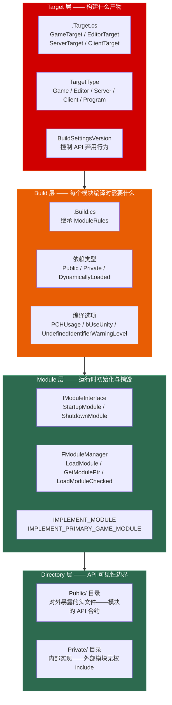

# 第十九章 模块与构建系统：从 UBT 编译流程到模块加载的完整链路

> **一句话理解**：UE 的构建系统是四层架构——**Target 层**（.Target.cs）定义"构建什么产物"（Game / Editor / Server / Client / Program），**Build 层**（.Build.cs）定义"每个模块编译时需要什么"（依赖、头文件路径、预编译宏），**Module 层**（IModuleInterface）定义"运行时怎么初始化与销毁"（StartupModule / ShutdownModule），**Directory 层**（Public/Private）定义"哪些 API 暴露给外部模块"（Public = 合约，Private = 封装）。理解这四层的分工和 UBT 的编译管线，是区分"会写 UE 代码"和"能在团队中交付工业化产品"的关键分水岭。

---

## 19.1 概念直觉 —— 构建系统的四层架构



```cpp
// ===== 构建四层架构速记 =====
//
// Target 层（.Target.cs）：
//   定义构建产物——Game（客户端+独立服务器）/ Editor（编辑器）/
//   Server（专用服务器）/ Client（纯客户端）/ Program（独立工具）。
//   控制：DefaultBuildSettings、bUseLoggingInShipping、bCompileAgainstEngine 等。
//
// Build 层（.Build.cs）：
//   定义模块编译依赖——PublicDependencyModuleNames（暴露给下游）、
//   PrivateDependencyModuleNames（仅内部使用）、
//   DynamicallyLoadedModuleNames（延迟加载、不链接）。
//   控制：PCHUsage（预编译头策略）、bUseUnity（Unity Build 加速）。
//
// Module 层（IModuleInterface）：
//   运行时模块对象——StartupModule（初始化）和 ShutdownModule（清理）。
//   由 FModuleManager 统一管理加载/卸载/查询。
//
// Directory 层（Public / Private）：
//   Public/ 是模块的"API 层"——外部模块可以 include。
//   Private/ 是模块的"实现层"——只在本模块内可见。
//   这是物理目录约定，由 UBT 强制执行。
```

---

## 19.2 .uproject 与 .uplugin —— 项目与插件描述文件

### 19.2.1 .uproject：项目身份文件

```cpp
// ===== .uproject：UE 项目的 JSON 描述文件 =====
//
// 位置：项目根目录 / MyProject.uproject
// 作用：告诉引擎——这个项目叫什么、依赖哪些模块和插件、关联哪个引擎版本
// 类型：纯 JSON——不需要编译，引擎启动时解析

// ---------- 完整的 .uproject 示例 ----------
/*
{
    "FileVersion": 3,
    "EngineAssociation": "5.4",            // 引擎版本——或 "{GUID}" 使用自定义引擎构建
    "Category": "Game",                     // 项目类别
    "Description": "My UE5 Game",

    // ★ 模块列表——项目的 C++ 模块（不含插件）
    "Modules": [
        {
            "Name": "MyProject",            // 模块名——必须与 .Build.cs / 目录名一致
            "Type": "Runtime",              // 模块类型（Runtime / Editor / Developer）
            "LoadingPhase": "Default"       // 加载时机（Default / PostConfigInit / PostEngineInit）
        },
        {
            "Name": "MyProjectEditor",
            "Type": "Editor",
            "LoadingPhase": "Default"
        }
    ],

    // ★ 插件列表——启用的插件
    "Plugins": [
        {
            "Name": "EnhancedInput",
            "Enabled": true
        },
        {
            "Name": "Niagara",
            "Enabled": true
        },
        {
            "Name": "ModelingToolsEditorMode",
            "Enabled": true,
            "SupportedTargetPlatforms": ["Win64"]   // 可选：限制目标平台
        }
    ]
}
*/

// ===== .uproject 关键字段 =====
//
// FileVersion：目前固定为 3
//
// EngineAssociation：
//   "5.4"           → 使用 Launcher 安装的 5.4 版本
//   "{1234-5678}"   → 使用注册表中对应的自定义源码构建
//   ""              → 空白——必须由外部指定（如命令行 -EngineDir=）
//
// Modules[].Type：
//   Runtime              → 随游戏包发布（最常用）
//   RuntimeNoCommandlet  → 运行时加载但不随 Commandlet 加载
//   UncookedOnly         → 仅未烘焙（Uncooked）状态下可用——打包烘焙时自动剥离（最常用的开发期类型）
//   DeveloperTool        → 命令行工具或非编辑器的独立开发期工具
//   Editor               → 仅编辑器加载
//   EditorNoCommandlet   → 编辑器中加载但 Commandlet 不加载
//
// Modules[].LoadingPhase：
//   Default              → 引擎初始化阶段加载（最常用）
//   PostConfigInit       → 配置系统初始化后加载
//   PostSplashScreen     → 启动画面显示后加载
//   PreEarlyLoadingScreen → 早期加载画面之前
//   PostEngineInit       → 引擎完全初始化后加载（适用于依赖引擎服务的模块）
```

### 19.2.2 .uplugin：插件描述文件

```cpp
// ===== .uplugin：UE 插件的 JSON 描述文件 =====
//
// 位置：Plugins/MyPlugin/MyPlugin.uplugin
// 作用：一个插件可以包含多个模块（Runtime + Editor + Developer）

// ---------- 完整的 .uplugin 示例 ----------
/*
{
    "FileVersion": 3,
    "Version": 1,
    "VersionName": "1.0.0",
    "FriendlyName": "My Inventory System",
    "Description": "A reusable inventory system with UI and networking support",
    "Category": "Gameplay",
    "CreatedBy": "My Studio",
    "CanContainContent": true,              // 是否可以包含 .uasset 内容
    "IsBetaVersion": false,
    "IsExperimentalVersion": false,
    "Installed": false,                     // 是否安装在 Engine/Plugins（否则是项目插件）

    // ★ 一个插件可以有多个模块
    "Modules": [
        {
            "Name": "InventorySystem",      // Runtime 模块——随游戏发布
            "Type": "Runtime",
            "LoadingPhase": "Default"
        },
        {
            "Name": "InventorySystemEditor", // Editor 模块——编辑器中扩展
            "Type": "Editor",
            "LoadingPhase": "Default"
        }
    ],

    // 插件依赖——本插件依赖的其他插件
    "Plugins": [
        {
            "Name": "EnhancedInput",
            "Enabled": true
        }
    ]
}
*/

// ===== .uplugin vs .uproject 模块的区别 =====
//
// 相同：都使用相同的 Module 描述结构（Name / Type / LoadingPhase）
//
// 不同：
//   .uproject 的模块属于"项目自身"——只有这个项目能用
//   .uplugin 的模块属于"可复用资产"——任何项目引入插件即可用
//
// 经验法则：
//   - 只在当前项目用的代码 → .uproject Modules
//   - 多个项目复用的代码 → 封装为 .uplugin
//   - 编辑器扩展 → 单独的 Editor 类型模块（放在 .uplugin 内或 .uproject 内）
```

---

## 19.3 .Build.cs —— 模块构建规则

### 19.3.1 ModuleRules 核心属性

```cpp
// ===== .Build.cs：每个模块必须有一个 C# 文件定义编译规则 =====
//
// 位置：Source/MyModule/MyModule.Build.cs
// 继承：ModuleRules（UBT 解析并执行其构造函数）
// 语言：C# —— 因为在编译时由 UBT（一个 C# 程序）加载并执行

// ---------- 标准 .Build.cs 完整示例 ----------
/*
using UnrealBuildTool;

public class MyGameModule : ModuleRules
{
    public MyGameModule(ReadOnlyTargetRules Target) : base(Target)
    {
        // ① 预编译头策略（UE5 推荐 ExplicitOrSharedPCHs）
        PCHUsage = PCHUsageMode.UseExplicitOrSharedPCHs;
        // 可选值：
        //   NoPCHs               → 完全禁用预编译头（编译慢，适合极小模块）
        //   NoSharedPCHs         → 每个 .cpp 独立预编译（编译慢，隔离性好）
        //   UseSharedPCHs        → 使用引擎共享 PCH（UE4 遗留）
        //   UseExplicitOrSharedPCHs → UE5 推荐——显式 include 或使用共享 PCH

        // ② 公共依赖——暴露给下游模块
        // "下游模块如果 include 了本模块的 Public 头文件，
        //  而这些头文件又 include 了 Core / CoreUObject / Engine 的头文件，
        //  那么下游模块也需要能访问这些依赖"
        PublicDependencyModuleNames.AddRange(new string[] {
            "Core",          // FString / TArray / FName / 基础容器
            "CoreUObject",   // UObject / UClass / UProperty —— 对象模型
            "Engine",        // AActor / UWorld / UGameplayStatics
            "InputCore"      // FKey / FInputAction 等输入类型
        });

        // ③ 私有依赖——仅本模块内部使用
        // "下游模块不需要知道这些——你实现细节变了不影响下游"
        PrivateDependencyModuleNames.AddRange(new string[] {
            "Slate",         // UI 框架
            "SlateCore",     // UI 基础
            "EnhancedInput", // Enhanced Input 系统
            "UMG"            // Widget 系统
        });

        // ④ 动态加载依赖——运行时按需加载，不参与静态链接
        // "这个模块我只在特定条件下才需要——编译时不链接，运行时手动 LoadModule"
        DynamicallyLoadedModuleNames.AddRange(new string[] {
            "OnlineSubsystemNull"  // 离线模式在线子系统
        });

        // ⑤ 公开包含路径——外部模块可以 include 的额外目录
        PublicIncludePaths.AddRange(new string[] {
            // 通常不需要——Public/ 目录默认已是公开路径
        });

        // ⑥ 私有包含路径——仅本模块内部 include 的目录
        PrivateIncludePaths.AddRange(new string[] {
            // 通常不需要——Private/ 目录默认已是私有路径
        });

        // ⑦ 预编译宏——在编译本模块时定义
        PublicDefinitions.Add("MY_MODULE_VERSION=1");   // 公开宏——下游模块也可见
        PrivateDefinitions.Add("MY_INTERNAL_FLAG=1");   // 私有宏——仅本模块可见

        // ⑧ 其他常用选项
        bUseUnity = true;                // Unity Build——多个 .cpp 合并编译（加速）
        bUseRTTI = false;                // 禁用 RTTI——UE 默认禁用
        bEnableExceptions = false;       // 禁用 C++ 异常——UE 默认禁用
        // ★ UndefinedIdentifierWarningLevel 属于 .Target.cs 的 TargetRules 全局控制权限
        //   模块层级的 .Build.cs 不具备此属性——不要在此设置
    }
}
*/
```

### 19.3.2 依赖传播规则

```cpp
// ===== Public vs Private 依赖的传播机制 =====
//
// 这是面试中考察"模块化理解"的核心考点。
//
// 场景：模块 A → 模块 B → 模块 C（B 依赖 C）
//
//   PublicDependency（B 公开依赖 C）：
//     B 的 Public 头文件中 include 了 C 的头文件
//     → A 需要能访问 C 的类型才能编译通过
//     → B 必须把 C 放在 PublicDependencyModuleNames 中
//     → UBT 会自动将 C 的 Public 路径和链接传递给 A
//
//   PrivateDependency（B 私有依赖 C）：
//     B 只在 Private/ 目录中使用 C
//     → A 不需要知道 C 的存在
//     → B 把 C 放在 PrivateDependencyModuleNames 中
//     → UBT 不会将 C 暴露给 A——A 编译时看不到 C 的头文件
//
// 经验法则（面试标准答案）：
//   "如果你的 Public 头文件 include 了某个模块的头文件 → 公开依赖它。
//    如果某个模块只在你 Private 实现中用 → 私有依赖它。
//    如果某个模块运行时可选加载 → DynamicallyLoaded。"

// ---------- 依赖传递示意图 ----------
//
//   A.Build.cs:
//     PublicDependencyModuleNames.Add("B");
//
//   B.Build.cs:
//     PublicDependencyModuleNames.Add("C");    // ← 公开依赖
//     PrivateDependencyModuleNames.Add("D");   // ← 私有依赖
//
//   编译 A 时：
//     A 可以看到：B（公开依赖）、C（B 的公开依赖传递）
//     A 看不到：D（B 的私有依赖——不透传）
```

---

## 19.4 .Target.cs —— 构建目标配置

### 19.4.1 TargetRules 核心配置

```cpp
// ===== .Target.cs：定义"构建什么产物" =====
//
// 位置：Source/MyProject.Target.cs（Game） / Source/MyProjectEditor.Target.cs（Editor）
// 继承：TargetRules
// 每个 .Target.cs 对应一个输出——一个游戏项目通常有至少两个 Target

// ---------- Game Target（游戏客户端 + 独立服务器）----------
/*
using UnrealBuildTool;
using System.Collections.Generic;

public class MyProjectTarget : TargetRules
{
    public MyProjectTarget(ReadOnlyTargetRules Target) : base(Target)
    {
        Type = TargetType.Game;              // ★ 核心：定义产物类型

        DefaultBuildSettings = BuildSettingsVersion.V4;  // UE5 推荐 V4
        IncludeOrderVersion = EngineIncludeOrderVersion.Unreal5_4;

        // ★ 列出这个 Target 包含的模块——通常是项目主模块
        ExtraModuleNames.AddRange(new string[] {
            "MyProject"                      // 主游戏模块
        });
    }
}
*/

// ---------- Editor Target（编辑器）----------
/*
public class MyProjectEditorTarget : TargetRules
{
    public MyProjectEditorTarget(ReadOnlyTargetRules Target) : base(Target)
    {
        Type = TargetType.Editor;            // ★ 编辑器构建
        DefaultBuildSettings = BuildSettingsVersion.V4;

        ExtraModuleNames.AddRange(new string[] {
            "MyProject",                     // 主游戏模块
            "MyProjectEditor"                // 编辑器专用扩展模块
        });
    }
}
*/

// ---------- Server Target（专用服务器——不渲染、无客户端逻辑）----------
/*
public class MyProjectServerTarget : TargetRules
{
    public MyProjectServerTarget(ReadOnlyTargetRules Target) : base(Target)
    {
        Type = TargetType.Server;
        DefaultBuildSettings = BuildSettingsVersion.V4;
        bUsesSteam = true;                   // 使用 Steam 网络

        ExtraModuleNames.AddRange(new string[] {
            "MyProject"
        });
    }
}
*/

// ---------- Client Target（纯客户端——不含服务器代码）----------
/*
public class MyProjectClientTarget : TargetRules
{
    public MyProjectClientTarget(ReadOnlyTargetRules Target) : base(Target)
    {
        Type = TargetType.Client;
        DefaultBuildSettings = BuildSettingsVersion.V4;

        ExtraModuleNames.AddRange(new string[] {
            "MyProject"
        });
    }
}
*/
```

### 19.4.2 TargetType 决策矩阵

```cpp
// ===== TargetType：五种构建产物 =====
//
// ┌──────────────┬──────────────────────────────────┬──────────────────────┐
// │ TargetType    │ 用途                              │ 包含内容               │
// ├──────────────┼──────────────────────────────────┼──────────────────────┤
// │ Game          │ 打包发布的游戏 + 独立服务器模式       │ 全部——渲染 + 服务器逻辑  │
// │ Editor        │ 编辑器中开发                      │ 全部 + 编辑器工具       │
// │ Server        │ 专用服务器（Dedicated Server）      │ 仅服务器逻辑——无渲染     │
// │ Client        │ 纯客户端（配合专用服务器使用）         │ 仅客户端——无服务器逻辑   │
// │ Program       │ 独立命令行工具                     │ 精简引擎——无渲染        │
// └──────────────┴──────────────────────────────────┴──────────────────────┘
//
// 面试常见追问："Game vs Server 的区别？"
// 标准答案：
//   Game = 同时包含客户端 + 服务器代码，可以作为 Listen Server。
//   Server = 剥离了所有渲染和客户端逻辑——只保留网络权威代码。
//   专用服务器的二进制体积可以比 Game 小 40%~60%。
//   云部署用 Server Target：更小的磁盘占用、更少的内存开销、更少的攻击面。

// ===== DefaultBuildSettings 版本速查 =====
//
// BuildSettingsVersion.V2 → UE4 遗留行为
// BuildSettingsVersion.V3 → UE5.0~5.2 默认
// BuildSettingsVersion.V4 → UE5.3+ 推荐——包含更多弃用 API 警告和严格检查
//
// 经验法则：新项目一律使用 V4。
```

---

## 19.5 UBT 编译流程 —— 从源码到二进制

### 19.5.1 UBT 编译全管线

```cpp
// ===== UBT（Unreal Build Tool）：编译的总指挥 =====
//
// UBT 是一个 C# 程序（位于 Engine/Binaries/DotNET/UnrealBuildTool/）
// 每次你在 VS/Rider 中编译或运行 Build.bat 时，实际上是在调用 UBT。
//
// 编译全流程（6 步）：
//
// ① 收集 Target：
//    UBT 读取命令行指定的 Target 文件（如 MyProjectEditor.Target.cs）
//    → 确定构建产物类型（Game / Editor / Server / Client / Program）
//
// ② 解析模块依赖图：
//    UBT 递归读取所有 .Build.cs 文件
//    → 构建完整的模块依赖有向无环图（DAG）
//    → 检测循环依赖——报错退出
//
// ③ 调用 UHT（Unreal Header Tool）：
//    UHT 扫描所有头文件中的 UCLASS / USTRUCT / UFUNCTION / UPROPERTY 宏
//    → 为每个带反射的类型生成 .generated.h 和 .gen.cpp
//    → 这是 "UE C++ 平行宇宙" 的入口——见 Ch2
//
// ④ 平台适配：
//    UBT 根据目标平台选择对应的工具链：
//      Windows → Visual C++ (MSVC)
//      Mac/iOS → Xcode / Apple Clang
//      Linux   → Clang
//      Android → NDK（Clang）
//      Console → 对应 SDK 编译器
//
// ⑤ 并行编译：
//    UBT 将编译任务分发到多个工作线程
//    → Unity Build：多个 .cpp 合并成一个大文件编译（减少重复解析头文件）
//    → 增量编译：只重编译修改过的 .cpp 和依赖它的翻译单元
//
// ⑥ 链接：
//    链接器将所有 .obj 和 .lib 合并为最终的二进制文件
//      Game   → MyProject.exe（Windows）/ MyProject（Linux/Mac）
//      Editor → UnrealEditor.dll（模块化——引擎是 DLL）
//      Server → MyProjectServer.exe

// ---------- UBT 关键概念 ----------
//
// Unity Build（加速编译）：
//   将 N 个 .cpp 合并成一个翻译单元 → 只解析一次公共头文件 → 显著加速
//   缺点：修改一个 .cpp → 整个 Unity Bundle 全部重编译
//   关闭：.Build.cs 中 bUseUnity = false
//
// Adaptive Unity Build（自适应联合编译）：
//   只把"不常修改"的 .cpp 打包进 Unity Build
//   "频繁修改"的 .cpp 单独编译——既享受加速，又不增加增量编译成本
//   这是 UE5 的默认行为——通常不需要手动干预
//
// PCH（Precompiled Header——预编译头）：
//   将常用的稳定头文件（CoreMinimal.h 等）预编译为二进制缓存
//   每个 .cpp 编译时直接加载 PCH——跳过解析数十万行稳定代码
//   UE5 推荐 PCHUsageMode.UseExplicitOrSharedPCHs
```

### 19.5.2 常见编译错误与排查

```cpp
// ===== 编译错误排查速查 =====
//
// ① "fatal error C1083: 无法打开包括文件: 'MyModule/MyClass.generated.h'"
//    原因：UHT 未生成 .generated.h——检查 UCLASS/USTRUCT 宏是否正确
//    解决：确保 #include "MyClass.generated.h" 是头文件的最后一个 include
//
// ② "unresolved external symbol"
//    原因：缺少模块依赖——你使用了某个模块的类型但未在 .Build.cs 中声明
//    解决：添加 PublicDependencyModuleNames 或 PrivateDependencyModuleNames
//
// ③ "module 'X' could not be found"
//    原因：模块未在 .uproject / .uplugin 的 Modules 列表中注册
//    解决：在 .uproject 或 .uplugin 中声明该模块
//
// ④ "circular dependency detected"
//    原因：两个模块互相依赖（A→B 且 B→A）
//    解决：重新设计模块边界——提取公共接口到第三个模块 C（A→C, B→C）
//
// ⑤ "PCH file not found"
//    原因：预编译头策略与项目配置不匹配
//    解决：检查 .Build.cs 中 PCHUsage 的值——新建模块用 UseExplicitOrSharedPCHs
```

---

## 19.6 Public / Private 目录规范

### 19.6.1 模块的物理目录结构

```cpp
// ===== UE 模块的目录约定 =====
//
// 标准结构（以 MyModule 为例）：
//
// Source/MyModule/
// ├── MyModule.Build.cs          ← 编译规则（C#）
// ├── Public/                    ← ★ 公开头文件——外部模块可以 include
// │   ├── MyModule.h             ← 模块接口（IModuleInterface 实现）
// │   ├── MyPublicActor.h        ← 对外暴露的类
// │   └── MyPublicTypes.h        ← 对外暴露的类型定义（USTRUCT / UENUM）
// ├── Private/                   ← ★ 私有实现——仅本模块可见
// │   ├── MyModule.cpp           ← IMPLEMENT_MODULE 所在位置
// │   ├── MyPrivateActor.cpp     ← 内部实现
// │   └── Internal/              ← 子目录——进一步组织私有代码
// │       └── DetailHelper.h
//
// UBT 强制执行：
//   - Public/ 目录下的头文件 → 自动加入公开包含路径 → 下游模块可 include
//   - Private/ 目录下的头文件 → 只有本模块可 include → 下游模块无法访问
//   - 根目录（Source/MyModule/）下的文件 → 视同 Private（不推荐在此放头文件）

// ---------- 正确的跨模块 include 方式 ----------
//
// 模块 A 依赖模块 B（B 在模块 A 的 PublicDependencyModuleNames 中）
//
// A 的 Public 头文件中：
//   #include "BModule/SomePublicClass.h"  // ✓ 正确——B 的 Public 头文件
//   // 不需要写完整路径——UBT 已将 B/Public 加入 A 的包含路径
//
// A 的 Private 实现中：
//   #include "BModule/SomePublicClass.h"  // ✓ 同 Public 规则
//   // 你无法 include B 的 Private 头文件——编译器会报"找不到文件"
```

### 19.6.2 大型项目的模块拆分策略

```cpp
// ===== 什么时候应该创建新模块？ =====
//
// 一个游戏项目的代码全部放在主模块中 = 灾难：
//   - 编译时间随代码量线性增长——改一行等 60 秒
//   - 命名空间污染——所有类型在一个模块中
//   - 不能在运行时按需加载/卸载
//
// 模块拆分信号（满足任一即考虑拆分）：
//
//   ① 独立功能集 —— GAS 技能系统 / 背包系统 / 对话系统
//     → 拆分为独立模块：MyGame_AbilitySystem / MyGame_Inventory / MyGame_Dialogue
//
//   ② 不同加载时机 —— 一部分代码在 PostEngineInit 后才需要
//     → 后置模块可以延迟初始化——加速引擎启动
//
//   ③ 独立团队维护 —— 技能组和 UI 组各自维护自己的模块
//     → 模块边界 = 团队边界——减少合并冲突
//
//   ④ 可选功能 —— 某些功能在特定平台/版本中关闭
//     → 独立模块可以在运行时按需加载 (FModuleManager::LoadModule)
//
//   ⑤ 编辑器专用逻辑 —— 编辑器扩展不应该随游戏打包
//     → 拆分为 Editor 类型模块——Shipping 包中不存在

// ---------- 模块拆分实战：MyGame 项目架构 ----------
/*
Source/
├── MyGame.Target.cs                    ← Game Target
├── MyGameEditor.Target.cs              ← Editor Target
│
├── MyGame/                             ← ★ 主模块（Runtime）
│   ├── MyGame.Build.cs
│   ├── Public/
│   │   └── MyGame.h                   ← IMPLEMENT_PRIMARY_GAME_MODULE
│   └── Private/
│       └── MyGame.cpp
│
├── MyGame_AbilitySystem/               ← ★ 能力系统模块（Runtime）
│   ├── MyGame_AbilitySystem.Build.cs
│   │     PublicDependency:  MyGame_Core, GameplayAbilities
│   │     PrivateDependency: GameplayTags, GameplayTasks
│   ├── Public/
│   │   ├── MyGameAbilitySystem.h
│   │   ├── Abilities/                 ← 公开的能力基类
│   │   └── Attributes/                ← 公开的属性集
│   └── Private/
│       ├── MyGameAbilitySystem.cpp
│       └── Abilities/                 ← 具体能力实现
│
├── MyGame_Inventory/                   ← ★ 背包系统模块（Runtime）
│   ├── MyGame_Inventory.Build.cs
│   │     PrivateDependency: MyGame_Core
│   ├── Public/
│   │   ├── MyGameInventory.h
│   │   └── InventoryItem.h
│   └── Private/
│       └── ...
│
├── MyGame_Core/                        ← ★ 共享核心模块（Runtime）
│   ├── MyGame_Core.Build.cs
│   │     PublicDependency: Core, CoreUObject, Engine
│   ├── Public/
│   │   ├── MyGameCore.h
│   │   └── MyGameTypes.h              ← 跨模块共享的类型定义
│   └── Private/
│       └── ...
│
└── MyGameEditor/                       ← ★ 编辑器扩展模块（Editor）
    ├── MyGameEditor.Build.cs
    │     PrivateDependency: MyGame_Core, UnrealEd
    ├── Public/
    │   └── MyGameEditor.h
    └── Private/
        └── ...
*/
```

---

## 19.7 模块加载与卸载

### 19.7.1 IModuleInterface 的生命周期

```cpp
// ===== IModuleInterface：每个模块的 C++ 入口 =====
//
// 每个模块必须有一个实现 IModuleInterface 的类
// 这个类是模块的"生命周期管理者"——引擎在加载/卸载模块时调用它

#include "Modules/ModuleManager.h"

// ---------- 标准模块实现 ----------
// 位置：Source/MyModule/Private/MyModule.cpp

#include "MyModule.h"
#include "Modules/ModuleManager.h"

// ★ 将 FMyModule 注册为模块 "MyModuleName" 的实现类
//   模块名必须与 .uproject / .uplugin 中声明的 Name 一致
IMPLEMENT_MODULE(FMyModule, MyModuleName)

void FMyModule::StartupModule()
{
    // 模块加载时调用——引擎初始化阶段
    // 典型操作：
    //   - 注册全局资产类型（Asset Type）
    //   - 注册控制台命令（IConsoleManager::RegisterConsoleCommand）
    //   - 注册细节面板自定义（FPropertyEditorModule::RegisterCustomClassLayout）
    //   - 初始化模块级单例
    UE_LOG(LogTemp, Log, TEXT("MyModule: StartupModule"));
}

void FMyModule::ShutdownModule()
{
    // 模块卸载时调用——引擎关闭或手动 UnloadModule
    // 典型操作：
    //   - 注销控制台命令
    //   - 注销编辑器扩展
    //   - 销毁模块级单例
    UE_LOG(LogTemp, Log, TEXT("MyModule: ShutdownModule"));
}
```

### 19.7.2 FModuleManager：模块管理器

```cpp
// ===== FModuleManager：运行时模块管理 =====
//
// FModuleManager 是全局的模块注册表和加载器
// 它在引擎启动时读取所有 .uproject / .uplugin 的 Modules 列表
// 按 LoadingPhase 和依赖图决定加载顺序

#include "Modules/ModuleManager.h"

class FMyModuleUser
{
public:
    void DynamicModuleAccess()
    {
        // ---------- ① 检查模块是否已加载 ----------
        if (FModuleManager::Get().IsModuleLoaded("MyModule"))
        {
            UE_LOG(LogTemp, Log, TEXT("MyModule 已加载"));
        }

        // ---------- ② 强制加载模块 ----------
        // 如果模块尚未加载——触发加载（调用 StartupModule）
        // 如果已加载——直接返回
        // 如果模块不存在——触发断言（在 Development/Debug 构建中）
        IModuleInterface* Module = FModuleManager::Get().LoadModuleChecked("MyModule");

        // ---------- ③ 安全加载——返回 nullptr 而非崩溃 ----------
        IModuleInterface* ModulePtr = FModuleManager::Get().LoadModule("MyModule");
        if (ModulePtr)
        {
            // 模块存在并加载成功
        }

        // ---------- ④ 按接口获取模块指针 ----------
        // 典型模式：你的模块实现了一个自定义接口
        // 其他模块通过接口访问——不依赖具体类型
        IMyModuleInterface* MyInterface =
            FModuleManager::Get().LoadModuleChecked<IMyModuleInterface>("MyModule");
        MyInterface->DoSomething();
    }
};

// ===== 模块接口模式：对外暴露 API =====
// 位置：Source/MyModule/Public/IMyModuleInterface.h

#include "Modules/ModuleInterface.h"

class IMyModuleInterface : public IModuleInterface
{
public:
    // 纯虚接口——供外部模块调用
    virtual void DoSomething() = 0;
    virtual int32 GetSomeValue() const = 0;
};

// 在 MyModule.cpp 中实现：
#include "IMyModuleInterface.h"

class FMyModule : public IMyModuleInterface
{
public:
    virtual void StartupModule() override { /* ... */ }
    virtual void ShutdownModule() override { /* ... */ }

    // 实现自定义接口
    virtual void DoSomething() override
    {
        UE_LOG(LogTemp, Log, TEXT("Module API called"));
    }

    virtual int32 GetSomeValue() const override { return 42; }
};

// 注意：IMPLEMENT_MODULE 不直接支持接口类型检查
// 外部模块通过 GetModulePtr 获取指针后 static_cast 或使用 LoadModuleChecked
```

### 19.7.3 模块加载顺序与 LoadingPhase

```cpp
// ===== LoadingPhase：控制模块的初始化时机 =====
//
// 加载顺序（由早到晚）：
//
//   EarliestPossible    → 尽可能早——引擎最基础的设施
//   PostConfigInit      → 配置系统初始化后（可读取 .ini 配置）
//   PostSplashScreen    → 启动画面显示后（UI 模块可以开始初始化）
//   PreEarlyLoadingScreen
//   PreLoadingScreen    → 加载画面之前
//   PreDefault          → Default 之前——确保依赖链上前置模块先初始化
//   Default             → 默认加载阶段（80% 的模块用这个）
//   PostDefault         → Default 之后
//   PostEngineInit      → 引擎完全初始化后（所有引擎服务已就绪）
//
// 经验法则：
//   - Runtime 模块 99% 使用 Default
//   - 依赖 GameInstance 的模块 → PostEngineInit
//   - UI 模块在编辑器启动时就需要 → PostSplashScreen 或 Default
//   - 控制台命令注册 → PostConfigInit（尽早可用）
```

---

## 19.8 常见陷阱与面试深度追问

### 19.8.1 构建系统 TOP 6 陷阱

```cpp
// ===== 陷阱 #1：Public 头文件中 include 了未声明为 PublicDependency 的模块 =====
// ✗ 模块 A 的 Public 头文件中 #include "SomeModule/SomeClass.h"
//   但 SomeModule 只写在 PrivateDependencyModuleNames 中
//   → 下游模块编译时报 "fatal error: 无法打开包括文件"
// ✓ 规则：任何在 Public 头文件中被 include 的模块 → 必须放在 PublicDependencyModuleNames

// ===== 陷阱 #2：循环模块依赖 =====
// ✗ 模块 A 的 .Build.cs：PublicDependencyModuleNames.Add("B")
//   模块 B 的 .Build.cs：PublicDependencyModuleNames.Add("A")
//   → UBT 直接报错——"circular dependency detected"
// ✓ 创建第三个模块 C：
//   A 和 B 都依赖 C（A→C, B→C）
//   把 A 和 B 共享的类型/接口下沉到 C

// ===== 陷阱 #3：模块未在 .uproject 中注册 =====
// ✗ 创建了新模块 MyNewModule（有 .Build.cs + IMPLEMENT_MODULE）
//   但忘记在 .uproject 的 Modules 数组中添加
//   → UBT 不编译这个模块——运行时 FModuleManager::LoadModule 返回 nullptr
// ✓ 在 .uproject 中添加：{ "Name": "MyNewModule", "Type": "Runtime", "LoadingPhase": "Default" }

// ===== 陷阱 #4：Public/Private 目录不存在 =====
// ✗ 创建了模块但未创建 Public/ 和 Private/ 目录
//   → UBT 能编译，但下游模块 include 头文件时需要写完整相对路径
//   → 破坏了 UE 的模块化约定——其他开发者找不到你的 API
// ✓ 始终创建 Public/（对外 API）和 Private/（内部实现）目录

// ===== 陷阱 #5：滥用 DynamicallyLoadedModuleNames =====
// ✗ 把所有"可能用到"的模块都放 DynamicallyLoaded → 运行时到处 LoadModule
//   → 启动时模块未加载 → 第一次访问时卡顿（加载 DLL + StartupModule）
//   → 模块可能被多次意外加载 —— 线程安全问题
// ✓ 只在真正"可选"且"不频繁使用"的模块上用 Dynamic 加载
//   大多数依赖直接用 PublicDependency 或 PrivateDependency

// ===== 陷阱 #6：Shipping 包中包含了 Editor 模块 =====
// ✗ 打包 Shipping 时 Editor 类型模块仍然被编译和链接
//   → 包体积膨胀 + 不必要的代码暴露 + 潜在的编辑器功能在客户端可用（作弊风险）
// ✓ Editor 模块的 Type 必须设为 "Editor"——UBT 自动排除
//   如果 Editor 逻辑混在 Runtime 模块中 → 用 #if WITH_EDITOR 条件编译隔离
```

### 19.8.2 面试速记三连

```
Q: ".Build.cs 和 .Target.cs 的区别是什么？"
A: .Target.cs 定义"构建什么产物"——一个 .Target.cs 对应一个可执行文件或 DLL
   （Game / Editor / Server / Client / Program）。它描述的是整个构建产物的属性。
   .Build.cs 定义"一个模块怎么编译"——每个模块一个 .Build.cs，描述依赖关系、
   预编译头策略、编译宏等。关系：一个 Target 包含多个 Module，
   Module 通过 .Build.cs 声明"我需要哪些其他模块的头文件和链接库"。

Q: "PublicDependency 和 PrivateDependency 的区别？什么时候用哪个？"
A: PublicDependency：你的 Public 头文件中 include 了该模块的头文件
   → 下游模块也需要能访问该模块才能编译通过 → 必须声明为公开依赖。
   PrivateDependency：该模块只在你的 Private/ 实现中使用
   → 下游模块不需要知道 → 声明为私有依赖即可。
   判断标准：运行"下游模块能否只包含你的 Public 头文件就编译通过？"
   能 → 你的 Public 依赖配置正确。不能 → 缺少 PublicDependency。

Q: "UE 编译为什么这么慢？怎么加速？"
A: UE 编译慢的核心原因：① 巨型头文件链——CoreMinimal.h 展开后数十万行；
   ② 模板——TArray/TMap 等大量模板导致翻译单元膨胀；③ 宏——UHT 宏展开 +
   反射代码生成。加速手段：① Unity Build（多个 .cpp 合并编译）——减少重复解析；
   ② PCH（预编译头）——稳定头文件预编译；③ Incredibuild/FastBuild 分布式编译；
   ④ 合理模块拆分——只重编译修改到的模块；
   ⑤ 关闭不必要的模块依赖——Private 依赖不透传减少包含路径；
   ⑥ LiveCoding（Ctrl+Alt+F11）——运行时热重载 .cpp 修改，无需重启编辑器。
```

---

## 19.9 30 秒速答

> **面试被问："UE 的模块系统是怎么工作的？从创建到加载的完整链路是什么？"**

四层架构——**Target 层**（`.Target.cs` → `TargetType.Game/Editor/Server` 定义构建产物）、**Build 层**（`.Build.cs` → `PublicDependencyModuleNames` / `PrivateDependencyModuleNames` 定义编译依赖）、**Module 层**（`IModuleInterface::StartupModule` / `ShutdownModule` → `IMPLEMENT_MODULE` 注册 → `FModuleManager::LoadModuleChecked` 运行时加载）、**Directory 层**（`Public/` = API 合约对外暴露，`Private/` = 封装仅本模块可见）。完整链路：`.uproject` 声明模块列表 → UBT 解析 `.Build.cs` 构建依赖图 → UHT 生成反射代码 → 编译器生成 `.dll` / `.exe` → 运行时 `FModuleManager` 按 `LoadingPhase` 依次加载 → `StartupModule` 执行初始化。

> **面试追问："一个新模块怎么加到项目中？最少需要创建哪些文件？"**

最少 **4 个文件**：① `Source/MyModule/MyModule.Build.cs`（编译规则 + 依赖声明）；② `Source/MyModule/Public/MyModule.h`（模块头文件——IModuleInterface 子类声明）；③ `Source/MyModule/Private/MyModule.cpp`（`IMPLEMENT_MODULE` + `StartupModule` / `ShutdownModule` 实现）；④ 在 `.uproject` 的 `"Modules"` 数组中添加条目 `{"Name": "MyModule", "Type": "Runtime", "LoadingPhase": "Default"}`。如果模块需要依赖其他模块——在 `PublicDependencyModuleNames` 或 `PrivateDependencyModuleNames` 中声明。

> **面试追问："Unity Build 是什么？有什么优缺点？"**

Unity Build 将多个 `.cpp` 合并成一个大的翻译单元一起编译——避免每个 `.cpp` 单独解析一遍公共头文件（`CoreMinimal.h` 展开 ~几十万行）。优点：全量编译速度提升 2~4 倍。缺点：① 修改一个 `.cpp` → 整个 Unity Bundle 全部重编译（增量编译变慢）；② 匿名命名空间冲突——两个 `.cpp` 中同名的匿名函数/变量会冲突；③ 静态函数/全局变量冲突。UE5 的 Adaptive Unity Build 折中——只把不常修改的 `.cpp` 打包，频繁修改的单独编译。

> **面试追问："循环模块依赖怎么解决？"**

提取公共接口到第三个模块——A 和 B 互相依赖 → 创建 C，把 A 和 B 共享的类型/接口下沉到 C，A→C、B→C。如果 A 和 B 需在运行时互相通信 → 使用接口模式（`IModuleInterface` 虚函数）或 Observer 模式——模块 A 调用 C 的接口注册、模块 B 调用 C 的接口通知——通过 C 解耦。

> **面试追问："怎么在运行时按需加载一个模块？"**

使用 `FModuleManager::Get().LoadModule("ModuleName")` 安全加载（返回 `nullptr` 不崩溃）或 `LoadModuleChecked("ModuleName")` 强制加载（模块不存在时触发断言）。注意：模块必须在 `.uproject` / `.uplugin` 中注册——`FModuleManager` 只知道已注册的模块。动态加载的模块必须在 `.Build.cs` 的 `DynamicallyLoadedModuleNames` 中声明——告诉 UBT 不要静态链接该模块。

---

## 19.10 本章自查清单

- [ ] 能画出 UE 构建系统的四层架构（Target → Build → Module → Directory）
- [ ] 能区分 .Target.cs（构建产物）和 .Build.cs（编译规则）的职责
- [ ] 理解 TargetType 的五种类型（Game / Editor / Server / Client / Program）和各自用途
- [ ] 能解释 PublicDependency / PrivateDependency / DynamicallyLoaded 的区别和传播规则
- [ ] 能写出标准的 .uproject 和 .uplugin JSON 结构
- [ ] 理解 UBT 编译全流程（收集 Target → 解析依赖图 → UHT → 平台适配 → 并行编译 → 链接）
- [ ] 知道 Unity Build 和 PCH 的加速原理和各自的取舍
- [ ] 能写出 IMPLEMENT_MODULE 的标准用法和 StartupModule / ShutdownModule 的典型操作
- [ ] 理解 FModuleManager 的 LoadModule / LoadModuleChecked / IsModuleLoaded 的使用场景
- [ ] 知道 Public/ 和 Private/ 目录的物理约定和 UBT 强制执行机制
- [ ] 掌握循环模块依赖的解决方案（提取公共接口到第三个模块）
- [ ] 能说出至少 5 个编译错误的排查方法

---

> 📚 **第四部第一章完结。** 构建系统是工程实践的基石——Target 定义产物、Build 定义依赖、Module 定义生命周期、Directory 定义 API 边界。掌握这四层，你就能在大型项目中设计模块架构、排查编译错误、加速构建管道。接下来进入 Ch20：Epic 编码规范与最佳实践——命名前缀体系、`check`/`ensure`/`verify` 错误处理、`Cast<T>` 类型安全转换。

> 💡 **前置依赖提醒**：
> - UHT 反射体系（UHT 是 UBT 编译流程的核心阶段——生成 .generated.h） → 见 [Ch2：UHT 反射系统深入](../02_uht_reflection/)
> - 智能指针与分配器（模块级内存管理） → 见 [Ch5：智能指针与内存分配](../05_smart_pointers/)
> - C++ 全景对比（UE 不使用 C++ 异常/RTTI——与 UBT 的 bEnableExceptions / bUseRTTI 对应） → 见 [Ch1：全景对比](../01_core_differences/)
