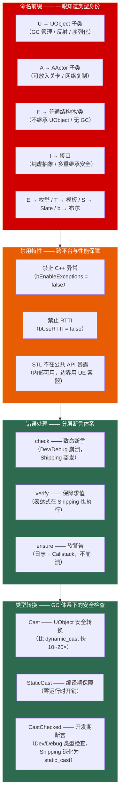

# 第二十章 Epic 编码规范与最佳实践：从命名前缀到错误处理的完整体系

> **一句话理解**：UE 的编码规范不是一个"风格指南"——它是引擎底层技术的直接映射。**命名前缀**（U/A/F/I/E/T/S/b）让你一眼知道一个类型的内存模型和继承链，**禁用特性**（异常/RTTI/STL 公共 API）是跨平台编译和性能的核心保障，**`check`/`ensure`/`verify`** 是区分"开发期快速定位崩溃"和"Shipping 包零开销"的错误处理分层，**`Cast<T>`** 是 GC 体系下的类型安全转换（`Cast<APawn>` 比 `dynamic_cast` 快 10~20 倍）。理解这些规范背后的"为什么"，是面试中区分"用过 UE"和"理解 UE 引擎内核"的关键分水岭。

---

## 20.1 概念直觉 —— 编码规范的"为什么"



```cpp
// ===== 编码规范四大支柱速记 =====
//
// 命名前缀（Naming Convention）：
//   每个字母对应一种类型身份——U = UObject 反射体系，
//   A = Actor 关卡可见，F = 普通值类型，I = 接口纯虚。
//   这是 UE 的"类型雷达"——一眼看出内存模型和生命周期。
//
// 禁用特性（Disabled Features）：
//   C++ 异常被关闭——UE 使用返回值和错误码。
//   RTTI 被关闭——UE 用 UHT 生成的反射数据替代。
//   公共 API 不暴露 STL 类型——使用 TArray / TMap / FString。
//
// 错误处理（Error Handling）：
//   三层断言体系——check（崩溃）→ verify（求值+崩溃）→ ensure（仅警告）。
//   Shipping 包中 check 被编译移除——零开销。
//
// 类型转换（Casting）：
//   Cast<T>(UObject*) —— UObject 的安全转换，利用反射数据。
//   StaticCast<T>() —— 标准 static_cast 的 UE 封装。
//   绝对不要对 UObject 使用 dynamic_cast —— 慢且需要 RTTI（已禁用）。
```

---

## 20.2 命名前缀体系 —— 一眼知道类型身份

### 20.2.1 八大前缀速查矩阵

```cpp
// ===== Epic 命名前缀：每一个字母背后都是技术约束 =====
//
// ┌────────┬──────────────────────┬──────────────────────────────────┐
// │ 前缀    │ 继承自                │ 关键特征                           │
// ├────────┼──────────────────────┼──────────────────────────────────┤
// │ U      │ UObject               │ GC 管理 / 反射 / 序列化 / 蓝图可见   │
// │ A      │ AActor → UObject      │ 可放入关卡 / 网络复制 / Tick        │
// │ F      │ 无（普通 C++ 类/结构体）│ 无 GC / 栈或堆分配 / 值语义          │
// │ I      │ 无（纯虚 C++ 接口）    │ 多重继承安全 / 必须用 UINTERFACE 配对 │
// │ E      │ uint8 枚举底层         │ UENUM 宏标记反射                   │
// │ T      │ 模板类                 │ TArray / TMap / TSharedPtr          │
// │ S      │ SWidget                │ Slate UI 控件                      │
// │ b      │ bool 变量               │ 布尔成员/局部变量——非类型前缀         │
// │ C      │ Concept（C++20）       │ 模板约束——UE5 中后期引入              │
// └────────┴──────────────────────┴──────────────────────────────────┘

// ---------- 前缀实战示例 ----------
// U —— UObject 子类
UCLASS()
class UMyObject : public UObject { /* ... */ };    // 可被 GC 追踪

// A —— AActor 子类（AActor 从 UObject 继承）
UCLASS()
class AMyActor : public AActor { /* ... */ };       // 可放入关卡

// F —— 普通结构体（不继承 UObject）
USTRUCT()
struct FMyStruct                             // 值类型——通常栈分配
{
    GENERATED_BODY()
    int32 Value;
};

// I —— 接口（纯虚 C++ 类）
class IMyInterface                            // 不加 UCLASS —— 这是原生 C++ 接口
{
public:
    virtual void DoSomething() = 0;
};

// E —— 枚举
UENUM()
enum class EMyState : uint8
{
    Idle, Running, Dead
};

// T —— 模板类
TArray<int32> Numbers;                        // 模板容器
TSharedPtr<FMyStruct> Ptr;                    // 智能指针

// S —— Slate 控件
class SMyButton : public SCompoundWidget { /* ... */ };

// b —— 布尔变量（注意：这是变量前缀，不是类型前缀）
bool bIsAlive = true;
bool bHasWeapon = false;
```

### 20.2.2 前缀背后的技术约束

```cpp
// ===== 为什么 U / A / F 的区分如此重要？ =====
//
// 面试高频考点："UObject 和 F 开头的结构体有什么区别？"
//
// UObject（U 前缀）：
//   ✓ 由 GC 自动管理生命周期——你不需要手动 delete
//   ✓ 拥有反射数据——UFUNCTION / UPROPERTY 可被蓝图访问
//   ✓ 支持序列化——SaveGame / 网络复制
//   ✓ 必须通过 NewObject<T>() 创建——不能用 new
//   ✓ 使用 IsValid() 判定存活——现代 UE5 已彻底移除 IsPendingKill()
//   ✗ 创建和销毁开销大——GC 扫描 + 反射元数据
//
// AActor（A 前缀）：
//   ✓ 继承 UObject 的所有特性
//   ✓ 可通过 SpawnActor<T>() 放入关卡世界
//   ✓ 支持 Tick / BeginPlay / EndPlay 生命周期
//   ✓ 支持网络复制（RPC / 属性同步）
//   ✗ 比普通 UObject 更重——Actor 注册 + 世界管理
//
// 普通结构体（F 前缀）：
//   ✓ 零反射开销——纯 C++ 性能
//   ✓ 可栈分配——创建销毁极快
//   ✓ 可在 USTRUCT 宏标记后获得有限反射（序列化/蓝图暴露）
//   ✗ 没有 GC——必须手动管理生命周期（或用 TSharedPtr）
//   ✗ 不支持网络复制（除非包装在 UObject 的 UPROPERTY 中）
//
// 经验法则：
//   "如果数据需要被 GC 追踪、蓝图访问、或网络复制 → U 前缀（UObject）
//    如果只是纯数据载体，在函数间传递 → F 前缀（普通结构体）
//    如果需要出现在关卡世界中 → A 前缀（AActor）"

// ---------- 命名前缀编译强制执行 ----------
//
// UE 的命名前缀不是"建议"——UBT 在编译时会检查：
//   - UObject 子类必须以 U 开头 → 否则编译警告
//   - AActor 子类必须以 A 开头 → 否则编译警告
//   - UEnum 必须以 E 开头 → 否则编译警告
//   - 布尔变量以 b 开头 → 部分检查（编辑器 lint）
//
// 可通过 .Build.cs 中 bEnforceIWYU = true 启用更严格的前缀检查
```

---

## 20.3 禁用特性 —— 跨平台与性能的工程决策

### 20.3.1 为什么禁止 C++ 异常和 RTTI

```cpp
// ===== 三大禁用特性：不是随意选择，是硬件级工程原因 =====
//
// ① C++ 异常（Execeptions）—— 默认关闭
//
// 原因：
//   - 二进制体积：异常处理表（EH Tables）使每个函数的代码膨胀 15%~30%
//   - 性能：即使不 throw，异常处理框架也有 ~3% 的运行时开销
//   - 跨平台一致：游戏主机（Console）编译器对异常的支持不完全一致
//   - 确定性：异常展开栈的过程在实时游戏循环中不可预测
//
// UE 替代方案：返回值 + 错误码 + check/ensure
//   函数返回 bool 表示成功/失败
//   关键路径用 check() 崩溃（开发期立即定位问题）
//   非关键路径用 ensure() 记录警告（不崩溃，收集数据）

// ② RTTI（Run-Time Type Information）—— 默认关闭
//
// 原因：
//   - 内存开销：每个多态类型维护一个 type_info 结构
//   - dynamic_cast 开销：遍历继承链的字符串比较
//   - UE 有更好的替代方案：UHT 反射数据比 RTTI 更丰富
//
// UE 替代方案：
//   Cast<T>(UObject*) —— 利用 UHT 生成的反射数据做类型检查
//     比 dynamic_cast 快 10~20 倍——使用整数 ID 而非字符串比较
//   IsA(UClass*) —— 运行时判断类型
//   StaticClass() —— 获取 UClass（替代 typeid）

// ③ STL 不在模块公共 API 中暴露
//
// 原因：
//   - ABI 兼容性：不同平台的 STL 实现不同——暴露 STL 类型到 API 边界
//     意味着你的 DLL 和调用方的 STL 实现必须完全一致
//   - 内存控制：UE 有自定义分配器——STL 的 new/delete 绕过 GMalloc
//   - 命名风险：std::vector<bool> 的特化行为与常规容器完全不同
//
// UE 替代方案：
//   std::vector<T>     → TArray<T>
//   std::map<K,V>       → TMap<K,V>
//   std::set<T>         → TSet<T>
//   std::string         → FString / FName / FText
//   std::shared_ptr<T>  → TSharedPtr<T>（仅用于非 UObject）
//   std::function<…>    → TFunction<…> 或 UE 委托

// ---------- 正确写法 vs 错误写法 ----------
// ✗ 在公共 API 中使用 STL
class BAD_API FMyPublicClass
{
public:
    std::vector<int> GetValues() const;   // ✗ STL 在 API 边界
    std::string GetName() const;          // ✗ std::string
};

// ✓ 使用 UE 等价类型
class GOOD_API FMyPublicClass
{
public:
    TArray<int32> GetValues() const;       // ✓ TArray
    FString GetName() const;              // ✓ FString
};

// ✓ STL 在内部实现中使用是可以的
void FMyPublicClass::InternalHelper()
{
    std::unordered_map<int, float> LookupTable;  // ✓ 内部使用 OK
}
```

### 20.3.2 内存分配的规范

```cpp
// ===== new / delete 的使用边界 =====
//
// UObject 子类：绝对不能用 new / delete
//   → 必须用 NewObject<T>() 创建
//   → 由 GC 自动销毁——不要手动 delete
//
// 非 UObject（F 前缀类）：可以使用 new / delete
//   → 但推荐 UE 分配器（GMalloc 系列）
//   → 或使用智能指针（TSharedPtr / TUniquePtr）
//
// 数组分配：使用 UE 内存函数
//   → FMemory::Malloc / FMemory::Free
//   → 或直接使用 TArray（推荐——自动管理内存）

// ---------- 正确写法 vs 错误写法 ----------
// ✗ 对 UObject 使用 new
UMyObject* Bad1 = new UMyObject();            // ✗ 绕过 GC——永远不会被回收
delete Bad1;                                   // ✗ GC 可能仍持有引用→二次释放崩溃

// ✓ 使用 NewObject
UMyObject* Good1 = NewObject<UMyObject>();     // ✓ GC 追踪，自动回收

// ✗ 对 Actor 使用 new
AMyActor* Bad2 = new AMyActor();              // ✗ 不在世界管理范围内

// ✓ 使用 SpawnActor
AMyActor* Good2 = GetWorld()->SpawnActor<AMyActor>();  // ✓ 世界管理生命周期
```

---

## 20.4 check / ensure / verify —— 三层错误处理体系

### 20.4.1 三种断言的选择矩阵

```cpp
// ===== 错误处理分层：开发期崩溃 vs Shipping 零开销 vs 运行期监控 =====
//
// ┌──────────┬────────────────────┬──────────────────┬──────────────────┐
// │ 断言类型   │ 行为                 │ Shipping 包行为    │ 使用场景           │
// ├──────────┼────────────────────┼──────────────────┼──────────────────┤
// │ check    │ 条件为 false → 崩溃   │ 表达式+崩溃代码蒸发 │ "绝不应该发生"      │
// │ checkf   │ check + 格式化消息    │ 同上               │ 需要上下文信息的崩溃  │
// │ verify   │ 同 check             │ 表达式依然执行，     │ "函数调用必须发生"   │
// │          │                      │ 但崩溃代码蒸发       │ （如返回值的函数）    │
// │ verifyf  │ verify + 格式化消息   │ 同上               │ verify + 上下文     │
// │ ensure   │ 首次 false → 日志+    │ ★ 默认 Shipping(DO_CHECK=0) │ "不该发生但别崩"     │
// │          │ Callstack，不崩溃     │ 表达式退化为裸求值——    │ （Dev 期收集 Bug 数据）│
// │          │                      │ 无日志/无栈/零开销      │                      │
// │ ensureMsgf│ ensure + 格式化消息   │ 同上——仅 Dev/Debug 有效 │ ensure + 上下文       │
// │ ensureAlways│ 每次都记日志+栈      │ 同上——仅 Dev/Debug 有效 │ 高频路径监控（Dev 期）  │
// └──────────┴────────────────────┴──────────────────┴──────────────────┘

// ---------- check：致命断言——"这不应该发生，发生了就崩" ----------
void CheckExamples(AActor* Actor)
{
    // 基础 check
    check(Actor != nullptr);             // Actor 为空 → 立即崩溃
    check(Actor->IsValidLowLevel());     // 检查 UObject 底层内存是否有效

    // checkf：带格式化消息
    checkf(Actor->GetWorld(), TEXT("Actor %s has no World!"), *Actor->GetName());

    // checkNoEntry：标记"永远不该执行到这里"的代码路径
    switch (State)
    {
        case EState::Idle:    HandleIdle(); return;
        case EState::Running: HandleRunning(); return;
        default:
            checkNoEntry();              // 未知状态 → 崩溃！
    }

    // unimplemented：标记"还未实现"的虚函数调用
    // 等价于 checkf(false, TEXT("Function not implemented"))
}

// ---------- verify：保障表达式求值（函数有副作用或返回值时使用） ----------
void VerifyExamples()
{
    // verify：表达式在 Shipping 中也会执行
    // 区别：check(expr) —— Shipping 中 expr 和崩溃代码都蒸发
    //       verify(expr) —— Shipping 中 expr 依然执行，只有崩溃蒸发
    verify(GEngine != nullptr);          // 获取引擎单例——获取操作必须发生

    // 典型场景：函数返回值被用于错误检查
    int32 Result = SomeFunctionThatMustRun();
    verify(Result >= 0);                 // SomeFunctionThatMustRun 在 Shipping 中也执行

    // verifyf：带消息
    verifyf(World != nullptr, TEXT("World is null during initialization"));
}

// ensure：软警告——"不正常但不要死" ----------
void EnsureExamples(AActor* Actor)
{
    // ensure：仅在 Development/Debug 中首次失败时记录日志 + 调用栈，不崩溃
    // ★ 标准 Shipping（DO_CHECK=0）下：ensure 被预处理器彻底剥离——
    //   展开为裸表达式求值 (expr)，无日志、无栈、无分支检查——完全零开销。
    //   如果在 Shipping 中也需要 ensure，必须在 .Target.cs 中显式设置
    //   bUseLoggingInShipping = true 并手动启用 DO_CHECK。
    if (!ensure(Actor != nullptr))
    {
        return;  // 优雅降级——继续执行但跳过该逻辑（仅 Dev/Debug 生效）
    }

    // ensureMsgf：带消息
    ensureMsgf(Actor->GetComponentByClass<UPrimitiveComponent>(),
        TEXT("Actor %s has no collision component!"), *Actor->GetName());

    // ensureAlways：每次都记录（即使是第 100 次触发）
    // 使用场景：高频路径上的监控——需要统计发生次数
    ensureAlways(Actor->GetVelocity().Size() < MaxSpeed);
}

// ---------- Shipping 包中的行为差异（面试高频考点） ----------
//
// check()     → Dev/Debug：崩溃并打印消息。
//               Shipping：表达式和崩溃代码都蒸发——零 CPU 开销。
//
// verify()    → Dev/Debug：同 check。
//               Shipping：表达式依然执行（因为可能有副作用），但崩溃代码蒸发。
//
// ensure()    → Dev/Debug：首次失败记日志+栈，不崩溃。
//               默认 Shipping（DO_CHECK=0）：表达式被预处理器展开为裸求值——
//               ★ 没有日志、没有栈、没有检查逻辑——彻底零开销。
//               如果你需要在 Shipping 中保留 ensure → 在 .Target.cs 中设置
//               bUseLoggingInShipping = true 且手动启用 DO_CHECK。
//
// 面试标准答案：
//   "check 是'绝不应该发生'——开发期帮你立即定位 Bug，Shipping 零开销。
//    verify 是'这个函数调用必须发生'——即使 Shipping 也要执行表达式。
//    ensure 是'不正常但别崩'——但仅在非 Shipping（或手动启用 DO_CHECK）时有效。
//    默认 Shipping 中 ensure 被完全抹除——不能依赖它收集线上数据。"
```

### 20.4.2 错误处理决策树

```cpp
// ===== 什么时候用哪个断言？决策树 =====
//
// 问题 1：这个条件失败后，继续执行会导致更严重的问题吗？
//   YES → check() 或 verify()
//     → 继续执行可能导致数据损坏、崩溃、安全漏洞
//   NO  → ensure()
//     → 跳过这个功能不影响核心逻辑
//
// 问题 2：条件表达式中的函数调用是否有副作用（必须执行）？
//   YES → verify()  —— 表达式在 Shipping 中也执行
//   NO  → check()   —— 表达式可在 Shipping 中蒸发
//
// 问题 3：这是高频路径吗？需要统计失败频率？
//   YES → ensureAlways()  —— 每次都记录
//   NO  → ensure()         —— 首次记录即可
//
// 实战决策示例：
//
//   check(GEngine)               → 引擎单例——为空后续一切不可用
//   check(Actor->GetWorld())     → World 为空意味着 Actor 不在世界中——继续无意义
//   verify(ModuleLoaded)         → 模块加载函数必须被调用（副作用）
//   ensure(!bIsInInvalidState)   → 状态异常但可以跳过当前 Tick 继续
//   ensureAlways(Speed < Max)    → 需要统计超速频率以定位性能 Bug
```

---

## 20.5 Cast<T> —— 类型安全转换网络

### 20.5.1 四种 UE Cast 的完整对比

```cpp
// ===== UE 类型转换体系：比标准 C++ 更安全、更快 =====
//
// ┌──────────────┬──────────────────────┬──────────────┬──────────────────┐
// │ 转换方式       │ 适用对象               │ 失败行为       │ 运行时开销         │
// ├──────────────┼──────────────────────┼──────────────┼──────────────────┤
// │ Cast<T>       │ UObject 子类           │ 返回 nullptr  │ 中等——反射 ID 比较  │
// │ StaticCast<T>  │ 任何类型               │ 编译期保证     │ 零（编译期）        │
// │ CastChecked<T> │ UObject 子类           │ 失败断言崩溃   │ 开发期：同 Cast    │
// │               │                       │              │ Shipping：同Static │
// │ DynamicCast<T>│ 需要 RTTI 的多态类型    │ 返回 nullptr  │ 高——字符串比较      │
// └──────────────┴──────────────────────┴──────────────┴──────────────────┘

void CastExamples(AActor* UnknownActor)
{
    // ---------- ① Cast<T>：UObject 安全转换（最常用） ----------
    // 利用 UHT 生成的反射数据——比 dynamic_cast 快 10~20 倍
    if (APawn* Pawn = Cast<APawn>(UnknownActor))
    {
        // 转换成功——安全使用 Pawn 特有的 API
        AController* Controller = Pawn->GetController();
        Pawn->GetMovementComponent()->Velocity;
    }
    else
    {
        // 不是 Pawn——优雅处理
    }

    // 连锁 Cast——一次检测多个类型
    if (ACharacter* Character = Cast<ACharacter>(UnknownActor))
    {
        Character->LaunchCharacter(FVector(0, 0, 500), false, false);
    }
    else if (APawn* Pawn = Cast<APawn>(UnknownActor))
    {
        // Character 继承 Pawn——先检测子类，再检测父类
        Pawn->GetController();
    }

    // ---------- ② StaticCast<T>：标准 static_cast 的 UE 封装 ----------
    // 无运行时开销——适用非 UObject 类型间的转换（编译期确定）
    float FloatValue = 3.14f;
    int32 IntValue = StaticCast<int32>(FloatValue);      // 等价于 (int32)FloatValue

    // 父类指针→子类指针——你确定类型正确
    APawn* DefinitelyPawn = StaticCast<APawn>(UnknownActor);
    // ⚠️ 如果 UnknownActor 不是 Pawn → 未定义行为！只在 100% 确定时使用

    // ---------- ③ CastChecked<T>：开发期类型断言 ----------
    // Development/Debug 构建中：行为同 Cast<T>——检查类型，失败则触发 check 断言崩溃
    // Shipping 构建中：退化为 StaticCast<T>——零开销，信任类型正确
    APawn* PawnCheck = CastChecked<APawn>(UnknownActor);
    // 适用于：你确定类型正确，但想在开发期捕捉意外情况

    // ---------- ④ 标准 dynamic_cast：不推荐 ----------
    // ⚠️ UE 默认禁用 RTTI——不能用于 UObject 类型
    // 只能用于启用了 RTTI 的非 UObject 类（极少见）
    // APawn* PawnDyn = dynamic_cast<APawn*>(UnknownActor);  // ✗ 编译错误——RTTI 禁用
}

// ---------- Cast 的底层原理（面试深度追问） ----------
//
// 为什么 Cast<T> 比 dynamic_cast 快得多？
//
// dynamic_cast：
//   遍历完整的继承链 → 做字符串比较（type_info::name()）
//   → 字符串操作 + 多次比较 = 慢
//
// Cast<T>：
//   ① 获取转换目标的 UClass* 静态反射对象（每个 UObject 子类有全局唯一的整数 ID）
//   ② 调用 IsA(TargetClass) → 用整数 ID 比较而非字符串
//   ③ 整数比较 ≈ 1~2 条 CPU 指令 vs 字符串比较 ≈ 数十条 + 内存访问
//
// 结论：Cast<T> 利用 UHT 预生成的反射元数据（编译期已知）替代运行时 RTTI 查询
```

### 20.5.2 Cast 的常见使用模式

```cpp
// ===== Cast 的三种经典使用模式 =====

// ---------- 模式 1：防御式 Cast（推荐） ----------
// 永远检查返回值——优雅处理类型不匹配
void DefensiveCast(AActor* Actor)
{
    if (ACharacter* Character = Cast<ACharacter>(Actor))
    {
        // ✓ 安全使用
        Character->Jump();
    }
    // 不是 Character → 什么都不做，不崩溃
}

// ---------- 模式 2：断言式 Cast ----------
// 类型必须匹配——否则是代码逻辑 Bug
void AssertCast(AActor* Actor)
{
    ACharacter* Character = Cast<ACharacter>(Actor);
    check(Character);  // 不是 Character → 崩溃——这是 Bug，必须修复
    Character->Jump();
}

// ---------- 模式 3：接口查询 Cast ----------
void InterfaceCast(AActor* Actor)
{
    // UE 接口也通过 Cast 查询——利用 UHT 反射
    if (Cast<IInventoryInterface>(Actor))
    {
        // ★ BlueprintNativeEvent / BlueprintImplementableEvent 不能通过接口指针直接调用
        //    必须使用 UHT 生成的 Execute_ 前缀静态包装器
        IInventoryInterface::Execute_AddItem(Actor, Item);
    }

    // 注意：Cast<IXXX> 返回的是指针——用于类型检查
    //      调用接口方法必须用 Execute_{FunctionName}(UObject*, ...)
}

// ---------- 注意：Cast<T> vs IsA<T> ----------
void CastVsIsA(AActor* Actor)
{
    // Cast<T>：检查 + 转换——一步完成
    if (APawn* Pawn = Cast<APawn>(Actor)) { /* ... */ }

    // IsA<T>：仅检查类型——不返回转换后的指针
    if (Actor->IsA<APawn>())  // 返回 bool
    {
        // 需要再手动 Cast 或 StaticCast 才能使用 Pawn 的成员
        APawn* Pawn = StaticCast<APawn>(Actor);
    }

    // 经验法则：需要转换后的指针 → Cast<T>
    //           只需要判断类型   → IsA<T> —— 稍微快一点（不生成转换代码）
}
```

---

## 20.6 接口与多重继承

### 20.6.1 UInterface 的双类模式

```cpp
// ===== UE 接口：两个类一个概念 =====
//
// UE 的接口系统比标准 C++ 多一层——UHT 需要一个 UObject 包装类：
//
//   UMyInterface（UObject 包装）→ 为 UHT 提供反射锚点
//   IMyInterface（C++ 纯虚接口）→ 实际的 C++ 抽象类
//
// 这两者通过 UINTERFACE 宏绑定——名字只有前缀不同（U vs I）

// ---------- 完整的 UE 接口定义 ----------

// ① UObject 包装——为反射系统提供元数据
UINTERFACE(BlueprintType)
class UInventoryInterface : public UInterface
{
    GENERATED_BODY()
};

// ② C++ 实际接口——定义纯虚函数
class IInventoryInterface
{
    GENERATED_BODY()

public:
    // BlueprintNativeEvent：C++ 提供默认实现，蓝图可覆盖
    UFUNCTION(BlueprintNativeEvent, BlueprintCallable, Category = "Inventory")
    bool AddItem(const FName& ItemId);

    // BlueprintImplementableEvent：仅蓝图实现——C++ 不提供默认
    UFUNCTION(BlueprintImplementableEvent, BlueprintCallable, Category = "Inventory")
    void OnItemAdded(const FName& ItemId);

    // 纯 C++ 函数——蓝图不可见
    virtual int32 GetItemCount() const = 0;

    // ★ 接口不能有成员变量——只有纯虚函数
};

// ---------- 实现接口的类 ----------
UCLASS()
class AMyInventoryActor : public AActor, public IInventoryInterface
{
    GENERATED_BODY()

public:
    // 实现 BlueprintNativeEvent 的 C++ 默认版本
    // 注意函数名：AddItem → AddItem_Implementation
    virtual bool AddItem_Implementation(const FName& ItemId) override
    {
        Items.Add(ItemId);
        return true;
    }

    // 实现纯 C++ 接口函数
    virtual int32 GetItemCount() const override
    {
        return Items.Num();
    }

private:
    TArray<FName> Items;
};

// ===== 接口函数类型速查 =====
//
// BlueprintNativeEvent：
//   C++ 提供默认实现 → 蓝图可覆盖
//   实现函数名：{FunctionName}_Implementation
//   调用：直接调用 FunctionName()——引擎自动路由到蓝图或 C++ 实现
//
// BlueprintImplementableEvent：
//   仅蓝图实现——C++ 不提供函数体
//   在 .cpp 中不需要写 _Implementation 函数
//
// 纯 C++ virtual：
//   不加 UFUNCTION——纯 C++ 接口方法
//   蓝图不可见
```

### 20.6.2 多重继承的边界规则

```cpp
// ===== UE 多重继承：仅接口安全 =====
//
// UE 允许的多重继承：
//   ✓ 一个 UObject/AActor 父类 + 多个 IXXX 接口
//   ✓ 接口可以多重继承接口
//
// UE 禁止的多重继承：
//   ✗ 两个 UObject 子类作为父类 → UHT 不支持，编译错误
//   ✗ 菱形继承（两个父类有共同祖先 UObject） → 编译错误
//
// 原因：UHT 生成的反射代码假设单继承链——多重非接口继承会破坏反射元数据

// ---------- 正确 vs 错误 ----------

// ✓ 一个 Actor 父类 + 多个接口
UCLASS()
class AMyCharacter : public ACharacter,                      // 单继承 AActor 链
                     public IDamageable,                      // 接口 1
                     public IInventoryInterface,              // 接口 2
                     public IInteractable                     // 接口 3
{
    GENERATED_BODY()
    // ...
};

// ✓ 接口继承接口
class IAdvancedInventory : public IInventoryInterface
{
public:
    virtual void SortItems() = 0;
};

// ✗ 两个 UObject 子类混用
// class ABadClass : public AActor, public UMyObject  // ✗ 编译错误！
// { ... };

// ✗ 菱形继承（两个父类都继承自同一个 UObject 子类）
// class ABadClass : public ACharacter, public APawn  // ✗ ACharacter 已继承 APawn！
// { ... };
```

---

## 20.7 Asset Naming Convention —— 资源命名规范

```cpp
// ===== 资产命名：工业化生产的基础审计规则 =====
//
// Epic 推荐的资产命名格式：Prefix_BaseName_Variant_Number
//
// 前缀（Prefix）：标识资产类型——一眼看出这是什么
//   基名（BaseName）：描述对象的语义——"这是什么"
//   变体（Variant）：区分同一对象的不同版本
//   编号（Number）：两位数字后缀——变体的量化区分

// ---------- 常用资产前缀速查 ----------
//
// 纹理：
//   T_Grass_BC                → BaseColor（固有色）
//   T_Grass_N                 → Normal（法线贴图）
//   T_Grass_ORM               → Occlusion/Roughness/Metallic 打包
//   T_Grass_D                 → Displacement（置换贴图）
//
// 静态网格 / 骨骼网格：
//   SM_Rock_01                → Static Mesh
//   SK_Character_Body         → Skeletal Mesh
//
// 材质：
//   M_Concrete_Wet            → Material
//   MI_Concrete_Wet           → Material Instance
//   MF_DetailTexture          → Material Function
//
// 蓝图：
//   BP_PlayerController       → Blueprint
//   WBP_MainMenu              → Widget Blueprint
//
// 动画：
//   AM_Hero_Walk              → Animation Montage
//   ABP_Hero                   → Animation Blueprint
//   BS_Hero_Speed             → Blend Space
//
// 音频：
//   A_Explosion_01            → Audio（SoundCue / MetaSound）
//   Atten_Large_Room           → Sound Attenuation
//   Concur_Gunfire             → Sound Concurrency
//
// 数据：
//   DA_Hero_Stats             → Data Asset
//   DT_Enemy_SpawnTable       → Data Table
//   Curve_HealthRegen          → Curve

// ---------- 命名规范在 C++ 中的体现 ----------

// C++ 类名遵循前缀但不遵循资产命名格式
// 资产命名是编辑器中的 .uasset 文件——不是 C++ 类的名字

// ✓ C++ 类（用 UE 类型前缀）：
UCLASS()
class UDA_HeroStats : public UPrimaryDataAsset     // ✓ 类名用 UDA_ 前缀
{
    GENERATED_BODY()

public:
    UPROPERTY(EditAnywhere)
    float MaxHealth = 100.0f;
};

// 这个类在编辑器中创建的 .uasset 也应该命名为 DA_Hero_01 等
// C++ 类名和资产文件名是两个不同的命名层面
```

---

## 20.8 常见陷阱与面试深度追问

### 20.8.1 编码规范 TOP 6 陷阱

```cpp
// ===== 陷阱 #1：对 UObject 使用 new / delete =====
void BadMemoryManagement()
{
    // ✗ UObject 绕过 GC——永远不会被回收
    UMyObject* Obj = new UMyObject();
    delete Obj;  // GC 可能仍持有引用 → 二次释放崩溃
}
// ✓ NewObject<T>() + 让 GC 管理

// ===== 陷阱 #2：check 和 ensure 用反了 =====
void BadAssertUsage(AActor* Actor)
{
    // ✗ 用 ensure 保护必然条件——引擎单例为空意味着后续 100% 崩溃
    ensure(GEngine);  // 应该用 check——引擎基础服务不存在已经没有继续的意义
    GEngine->AddOnScreenDebugMessage(...);  // 如果 GEngine 为空→依然崩溃

    // ✗ 用 check 保护可选功能——物品不存在不应该让游戏崩溃
    check(Item != nullptr);  // 应该用 ensure——物品数据缺失可以跳过，不应崩溃
    Item->Use();             // 如果 check 触发 → 整个游戏崩溃
}
// ✓ 必然条件用 check，可选功能用 ensure

// ===== 陷阱 #3：Cast<T> 不检查返回值 =====
void BadCast(AActor* Actor)
{
    // ✗ Cast 可能返回 nullptr——直接解引用 → 崩溃
    APawn* Pawn = Cast<APawn>(Actor);
    Pawn->GetController();  // 如果 Actor 不是 Pawn → 空指针崩溃
}
// ✓ 总是检查 Cast 返回值

// ===== 陷阱 #4：用 dynamic_cast 替代 Cast<T> =====
void BadDynamicCast(UObject* Obj)
{
    // ✗ dynamic_cast 需要 RTTI —— UE 默认禁用
    //    即使手动启用了 RTTI —— 比 Cast<T> 慢 10~20 倍
    // AActor* Actor = dynamic_cast<AActor*>(Obj);  // 编译错误或极慢
}
// ✓ 始终用 Cast<T> 做 UObject 类型转换

// ===== 陷阱 #5：接口实现函数名写错 =====
// ✗ BlueprintNativeEvent 的实现函数必须命名为 {FunctionName}_Implementation
//    写成别的名字 → 链接器报 "unresolved external symbol"
class BAD_IMPLEMENTATION : public IMyInterface
{
    // ✗ 写了 AddItem 而不是 AddItem_Implementation
    virtual bool AddItem(const FName& ItemId) override;  // 链接错误！
};
// ✓ virtual bool AddItem_Implementation(const FName& ItemId) override;

// ===== 陷阱 #6：在 Shipping 构建中依赖 ensure 来收集数据 =====
void BadShippingBehavior()
{
    // ✗ 默认 Shipping（DO_CHECK=0）中 ensure 被完全抹除——表达式变为裸求值
    //    无日志、无栈、无崩溃——不能依赖它做任何追踪或收集
    //    ImportantSideEffect() 仍在 Shipping 中执行（表达式被保留为裸求值）
    ensure(ImportantSideEffect());
    // ★ 但日志和栈信息在 Shipping 中完全不存在——不要靠 ensure 做线上追踪
}
// ✓ 用专门的遥测系统（Analytics / Crash Reporter）替代 ensure 做 Shipping 数据收集
```

### 20.8.2 面试速记三连

```
Q: "UE 的命名前缀（U/A/F/I/E/T/S/b）分别代表什么？为什么要这么严格？"
A: U = UObject（GC + 反射 + 序列化），A = AActor（关卡可见 + 网络复制），
   F = 普通结构体（纯 C++ 无 GC），I = 接口（纯虚、多重继承安全），
   E = 枚举，T = 模板类，S = Slate 控件，b = 布尔变量。
   严格性的原因：① 一看前缀就知道内存模型（栈 vs GC 堆？需不需要 IsValid？）；
   ② UBT 编译期检查——以 U 开头的类必须是 UObject 子类否则警告；
   ③ 团队效率——新成员不需要查继承链就知道怎么用。

Q: "check、verify、ensure 的区别？Shipping 包中怎么变化？"
A: check —— 致命断言，条件失败立即崩溃，Shipping 中表达式和崩溃代码都蒸发（零开销）。
   verify —— 同 check，但表达式在 Shipping 中也会执行（因为有副作用的函数调用需要求值）。
   ensure —— 软警告，仅在 Dev/Debug 中记录日志+栈，不崩溃。
   ★ 默认 Shipping（DO_CHECK=0）中 ensure 被预处理器完全抹除——无日志、无栈、无检查。
   关键区别：check = "Bug——崩"，verify = "副作用必须发生"，ensure = "Dev 期监控——Shipping 不存在"。
   一句话：check 是"代码 BUG"，verify 是"必须发生的副作用"，ensure 是"意外但可以继续"。

Q: "Cast<T> 和 dynamic_cast 的区别？为什么 UE 用 Cast？"
A: ① Cast<T> 利用 UHT 生成的反射数据（整数 ID 比较），dynamic_cast 依赖 RTTI（字符串比较）。
   ② Cast 比 dynamic_cast 快 10~20 倍——整数比较 vs 遍历继承链 + type_info::name() 字符串。
   ③ UE 默认关闭 RTTI——dynamic_cast 甚至无法编译用于 UObject。
   ④ Cast 返回 nullptr（安全），dynamic_cast 对指针同样返回 nullptr 但对引用抛异常（UE 不用异常）。
```

---

## 20.9 30 秒速答

> **面试被问："UE C++ 和标准 C++ 最大的编码规范差异是什么？"**

四大核心差异——**命名前缀**：每个类型有强制前缀（U/A/F/I/E/T/S/b）→ 一眼知道内存模型和生命周期；**禁用异常和 RTTI**：编译器开关 `bEnableExceptions=false` / `bUseRTTI=false` → 用返回值 + check/ensure 替代异常，用 Cast<T> 反射 ID 比较替代 dynamic_cast；**禁止 new/delete UObject**：必须用 `NewObject<T>()` / `SpawnActor<T>()` → GC 体系不允许裸指针管理；**STL 不在 API 边界暴露**：公共头文件用 TArray/TMap/FString 而非 std::vector/std::map/std::string → 保证跨平台 ABI 兼容。

> **面试追问："Cast<T> 的底层实现原理是什么？为什么比 dynamic_cast 快？"**

`Cast<T>` 调用 `UObject::GetClass()` 获取对象运行时类型（`UClass*`），然后调用 `UClass::IsChildOf(TargetClass)` 做整数 ID 比较——每个 `UClass` 在 UHT 阶段被分配了全局唯一的整数 ID。相比之下 `dynamic_cast` 需要遍历完整继承链并用 `type_info::name()` 做字符串比较。整数比较 = 1 条 CMP 指令，字符串比较 = 数十条 + 内存访问。

> **面试追问："check 和 ensure 什么时候该用哪个？决策标准是什么？"**

决策标准——**继续执行会出事吗？** 会 → `check()`（崩溃比数据损坏好）。不会 → Dev 阶段用 `ensure()`（收集 Bug 数据但不崩）。具体：GEngine 为空 → check（引擎没了继续无意义）。装备数据缺失 → ensure + 跳过装备逻辑（不影响核心游戏）。★ 注意：默认 Shipping 中 ensure 被完全抹除——线上数据收集必须用 Analytics / Crash Reporter 等遥测系统。物理碰撞查询等高概率路径用 `ensureAlways` 仅在 Dev 期有效——Shipping 中同样蒸发。

> **面试追问："UInterface 为什么需要两个类（U 前缀 + I 前缀）？"**

`UMyInterface`（继承 `UInterface`）→ 为 UHT 提供反射元数据锚点（`UCLASS` 宏）。`IMyInterface`（纯虚 C++ 类）→ 实际的接口定义（纯虚函数）。UHT 只认识 `UCLASS`——它需要一个 UObject 类型的载体来生成反射代码。但 C++ 侧的多重继承需要的是纯虚类——所以分裂成两个。使用方式：`class AMyActor : public AActor, public IMyInterface {}`。

> **面试追问："UE 为什么禁用 C++ 异常？替代方案是什么？"**

三个工程原因——**二进制体积**：异常处理表（EH Tables）使每个函数膨胀 15%~30%，对移动端/主机影响巨大；**性能**：即使不 throw，异常框架也有 ~3% 隐性开销；**确定性**：异常展开栈的路径在实时游戏循环中不可预测——可能导致帧率抖动。替代方案：函数返回 `bool` / `EResult` 错误码 + 多层 `check/verify/ensure` 断言体系 + 编辑器中的 Crash Reporter 收集线上崩溃栈。

---

## 20.10 本章自查清单

- [ ] 能说出八大命名前缀（U/A/F/I/E/T/S/b）各自的技术含义和使用场景
- [ ] 理解 UObject / AActor / F 结构体在内存管理和生命周期上的根本区别
- [ ] 知道 UE 禁用了哪些 C++ 特性（异常/RTTI/STL 公共 API）及各自的工程原因
- [ ] 能写 check / checkf / verify / ensure / ensureMsgf / ensureAlways 的正确用法
- [ ] 能解释 check vs verify vs ensure 在 Shipping 包中的行为差异
- [ ] 能写出 Cast<T> 的正确用法和返回值检查模式
- [ ] 理解 Cast<T> 比 dynamic_cast 快的原因（反射整数 ID vs RTTI 字符串）
- [ ] 能区分 Cast<T> / StaticCast<T> / CastChecked<T> 的适用场景
- [ ] 能写出 UInterface 的双类模式（U 前缀反射载体 + I 前缀 C++ 接口）
- [ ] 理解 UE 多重继承的边界（允许多接口，禁止多 UObject 父类）
- [ ] 知道 BlueprintNativeEvent 和 BlueprintImplementableEvent 的区别
- [ ] 能说清 check vs ensure 的决策标准

---

> 📚 **第四部第二章完结。** 编码规范是工业化生产的纪律——命名前缀让你一眼看懂内存模型，check/ensure/verify 让你精准控制错误边界，Cast<T> 让你在 GC 体系中安全穿越类型层级。掌握这些规则，你的代码才有了"Epic 品质"的基因。接下来进入 Ch21：性能分析与优化——Unreal Insights 指标排查、stat 命令族、迭代优化方法论。

> 💡 **前置依赖提醒**：
> - UHT 反射体系（Cast<T> 依赖 UHT 生成的反射数据做类型 ID 比较） → 见 [Ch2：UHT 反射系统深入](../02_uht_reflection/)
> - UObject 与 GC（Cast<T> 专门为 UObject 继承链设计——理解 GC 体系才能理解为什么不能 new/delete） → 见 [Ch3：UObject 与 GC 机制](../03_uobject_gc/)
> - 容器与字符串（TArray/TMap/FString 替代 STL 公共 API） → 见 [Ch4：容器与字符串体系](../04_containers_strings/)
> - 模块与构建系统（bEnableExceptions / bUseRTTI 在 .Build.cs 中控制） → 见 [Ch19：模块与构建系统](../19_build_system/)
