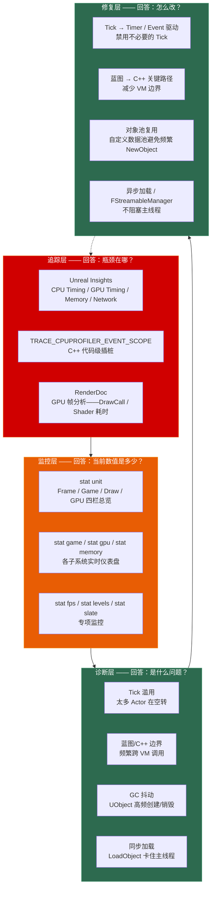

# 第二十一章 性能分析与优化：从 Insights 追踪到迭代优化的完整链路

> **一句话理解**：UE 的性能优化是一个四层迭代闭环——**Insights 追踪**（CPU/GPU/Memory 全通道 trace 数据）告诉你"瓶颈在哪"，**stat 命令族**（`stat unit/game/gpu/memory`）给你"实时仪表盘"，**常见陷阱排查**（Tick 滥用/蓝图边界/GC 抖动/同步加载）告诉你"修复什么"，**迭代验证**（优化前 → 优化后对比）告诉你"改好了没有"。理解这个闭环并掌握每一层的工具，是性能面试的及格线。

---

## 21.1 概念直觉 —— 性能优化的四层金字塔



```cpp
// ===== 性能优化四层闭环速记 =====
//
// 追踪层（Tools）：
//   Unreal Insights —— 事后分析（trace 文件回放）
//   RenderDoc —— GPU 帧捕获（逐 DrawCall 分析）
//   CSV Profiler —— 自动化性能测试数据导出
//
// 监控层（Console）：
//   stat unit —— 一眼看到瓶颈在哪个线程（Game/Draw/GPU）
//   stat game —— GameThread 细分耗时
//   stat scenerendering —— RenderThread 细分耗时
//
// 诊断层（Patterns）：
//   不是靠直觉猜——是用数据驱动的模式匹配
//   "Frame > 33ms + stat game 显示 Tick 占 40%" → Tick 滥用
//   "stat memory 显示 UObject 数量暴涨" → GC 抖动
//
// 修复层（Solutions）：
//   每个诊断有对应的标准修复方案——见 21.5 节
//   修复后必须回到追踪层验证——闭环！
```

---

## 21.2 Unreal Insights —— 性能分析的第一工具

### 21.2.1 Insights 的四大通道

```cpp
// ===== Unreal Insights：UE5 官方性能追踪系统 =====
//
// 启动方式：Engine/Binaries/Win64/UnrealInsights.exe
// 录制方式：
//   ① 编辑器：底部控制台输入 `trace.start` → 运行场景 → `trace.stop`
//   ② 命令行：-trace=cpu,gpu,memory,frame -tracefile=MyTrace.utrace
//   ③ C++ 代码：FTraceAuxiliary::Start/Stop 控制录制起止
//
// 四大追踪通道：
//   CPU Timing   → 每个函数/事件的开始时间和耗时
//   GPU Timing   → 每个渲染 Pass 的 GPU 耗时
//   Memory       → 内存分配/释放的时间线和堆栈
//   Network      → 网络包收发时间线
//
// 关键概念：
//   Trace Channel：CPU / GPU / Memory / Network / Frame / Bookmark
//   Trace Event：一个被追踪的代码区间（函数调用 / 自定义作用域）
//   Trace Bookmark：时间线上的标签——标记"这一刻发生了什么"

// ---------- C++ 代码中插入 Trace 插桩 ----------
#include "ProfilingDebugging/CpuProfilerTrace.h"

void MyPerformanceCriticalFunction()
{
    // ★ 方式 1：TRACE_CPUPROFILER_EVENT_SCOPE —— 追踪整个作用域
    TRACE_CPUPROFILER_EVENT_SCOPE(MyPerformanceCriticalFunction);
    // 进入函数时自动记录开始时间，离开作用域时记录结束时间
    // 在 Insights 的 CPU Timing 视图中显示为"MyPerformanceCriticalFunction"

    // 耗时操作...
    for (int i = 0; i < 1000; ++i)
    {
        // ★ 方式 2：动态名称——运行时拼接 FString
        //    使用 TRACE_CPUPROFILER_EVENT_SCOPE_STR —— 底层接收 const TCHAR*
        //    必须对 FString 解引用（*）以显式暴露宽字符指针，直接传 FString 在部分平台编译失败
        TRACE_CPUPROFILER_EVENT_SCOPE_STR(*FString::Printf(TEXT("Loop_%d"), i));
        DoWork(i);
    }
}

void BookmarkExample()
{
    // ★ 方式 3：时间线书签——标记关键时刻
    // 在 Insights 时间线上显示为橙色菱形标记
    TRACE_BOOKMARK(TEXT("PlayerSpawned"));

    // 典型用途：
    // - "玩家死亡" "Boss 技能释放" "场景加载完成"
    // - 与 CPU 耗时对照——"这个卡顿是哪个游戏事件触发的？"
}
```

### 21.2.2 Insights CPU Timing 视图解读

```cpp
// ===== CPU Timing 视图：最常用的分析入口 =====
//
// 打开 .utrace 文件后，左侧选择 "Timing Insights" → CPU Timing 面板：
//
// ① 顶部时间线：缩略图——整个 trace 文件的时间跨度
// ② 主时间线区域：
//    每一行 = 一个 CPU 核心（物理线程）
//    每个色块 = 一个 Trace Event（函数调用或自定义作用域）
//    色块长度 = 函数耗时（越长越慢）
//    色块颜色 = Timer 分组（同组同色）
//
// ③ 下方聚合面板：
//    "Timers" 标签页 → 按函数聚合的总耗时排序
//    "Calls" 列   → 调用次数——判断"单次慢"还是"调用太多"
//    "Incl" 列    → Inclusive Time（含子函数）——函数总耗时
//    "Excl" 列    → Exclusive Time（不含子函数）——函数自身逻辑耗时
//
// 分析工作流：
//   1. 按 Exclusive Time 排序 → 找到自身最慢的函数
//   2. 按 Inclusive Time 排序 → 找到调用链中最"重"的函数
//   3. 点击色块 → 查看调用栈 → 定位到具体代码行
//
// 面试标准答案：
//   "找到瓶颈 → 按 Excl 找自身慢的函数，按 Incl 找调用子树重的函数。
//    Excl 高 = 这个函数内部逻辑慢——要优化算法。
//    Incl 高但 Excl 低 = 它调用的子函数慢——顺着调用链往下找。"

// ---------- 编辑器中的快速 Trace ----------
//
// 不需要启动 Insights.exe——编辑器内置了简化的 Trace 控制：
//
// 控制台命令：
//   trace.start  default     → 开始录制（CPU+GPU+Frame）
//   trace.start  cpu,gpu,memory → 指定通道
//   trace.stop               → 停止录制，自动打开 .utrace 文件
//   trace.file               → 查看当前录制文件路径
//
// 快捷键：编辑器右下角 "Trace" 按钮 → Start / Stop
```

---

## 21.3 stat 命令族 —— 运行时性能仪表盘

### 21.3.1 stat unit —— 一屏定位瓶颈线程

```cpp
// ===== stat unit：性能分析的第一条命令 =====
//
// 在控制台（~）输入 `stat unit`，屏幕右上角显示四栏：
//
// ┌─────────────────────────────────────────────────────────┐
// │ Frame: 16.67ms   Game: 8.2ms   Draw: 5.1ms   GPU: 12.3ms │
// └─────────────────────────────────────────────────────────┘
//
// Frame：上一帧的总耗时（目标：16.67ms = 60fps / 33.33ms = 30fps）
// Game ：GameThread 耗时——逻辑脚本/AI/物理/动画
// Draw ：RenderThread 耗时——剔除/合批/生成渲染命令
// GPU  ：GPU 实际执行渲染命令的耗时（异步于 CPU）
//
// 瓶颈判断法则：
//   Game > Draw+GPU  → CPU 瓶颈（GameThread 绑死）
//   Draw > Game+GPU  → RenderThread 瓶颈（DrawCall 太多）
//   GPU  > Game+Draw → GPU 瓶颈（Shader 太复杂/分辨率太高）
//
// 面试标准答案：
//   "stat unit 的四栏分别对应三个线程：GameThread（逻辑）、
//    RenderThread（生成渲染命令）、GPU（执行渲染）。
//    最大的一栏就是当前瓶颈——优化它才能提升帧率。"

// ---------- stat unit 的变体 ----------
// stat unitgraph → 显示更详细的历史曲线图——看帧率趋势
```

### 21.3.2 stat 命令族速查

```cpp
// ===== stat 命令族：每个子系统都有专属监控 =====
//
// ┌─────────────────────┬────────────────────────────────────────┐
// │ 命令                  │ 显示内容                                  │
// ├─────────────────────┼────────────────────────────────────────┤
// │ stat unit            │ Frame / Game / Draw / GPU 四栏总览         │
// │ stat game            │ GameThread 细分——Tick/动画/物理/脚本耗时     │
// │ stat scenerendering  │ RenderThread 细分——剔除/合批/阴影/RHI       │
// │ stat gpu             │ GPU 各 Pass 耗时——BasePass/Shadow/Lighting │
// │ stat memory          │ 内存总览——Physical/OS/Streaming Pool        │
// │ stat fps             │ 帧率计数器                                  │
// │ stat levels          │ 关卡流送——当前加载了哪些 Level                │
// │ stat streaming       │ 资源流送——纹理/网格加载状态                  │
// │ stat slate           │ Slate UI 性能——Invalidation/Widget 数量     │
// │ stat engine          │ 引擎循环——World Tick / Network Tick         │
// │ stat physics         │ 物理模拟——活跃刚体数量/Chaos 耗时            │
// │ stat anim            │ 动画系统——AnimInstance 更新耗时              │
// │ stat ai              │ AI 系统——行为树/EQS 执行耗时                 │
// │ stat particles       │ 粒子系统——活跃粒子数                         │
// │ stat startfile       │ 开始录制 stat 数据到 .csv 文件                │
// │ stat stopfile        │ 停止录制                                    │
// └─────────────────────┴────────────────────────────────────────┘
//
// 实战工作流：
//   ① stat unit → 确定瓶颈线程（Game / Draw / GPU）
//   ② 瓶颈在 Game → stat game → 看 Tick/Anim/Physics 谁占最多
//   ③ 瓶颈在 GPU → stat gpu → 看哪个 Pass 最重
//   ④ stat startfile → 录制数据 → 导入 Excel/脚本做量化分析

// ---------- 编辑器中的快捷性能面板 ----------
//
// Ctrl+Shift+,  → 打开/关闭 GPU 可视化（GPU Visualizer）
// Ctrl+Shift+H  → 打开/关闭 Stat FPS
// 编辑器顶部 "Performance" 菜单 → 各类 stat 快捷开关
```

---

## 21.4 迭代优化方法论 —— 测量 → 定位 → 修复 → 验证

### 21.4.1 优化的铁律

```cpp
// ===== 性能优化的四条铁律 =====
//
// 铁律 1：先测量，后优化
//   ✗ "这个函数看起来慢，优化一下" → 浪费时间去优化没有瓶颈的代码
//   ✓ Insights trace → 按 Exclusive Time 排序 → 只优化前 5 个
//   经验：80/20 法则——80% 的耗时由 20% 的代码产生
//
// 铁律 2：一次只改一个变量
//   ✗ "同时改了对象池 + 异步加载 + 减少 Tick" → 不知道哪个有效果
//   ✓ 只做一处修改 → 对比 trace → 记录变化 → 再改下一个
//
// 铁律 3：用数据说话，不用直觉
//   ✗ "我觉得 Tick 太慢了" → 可能 Tick 只占 5%
//   ✓ "stat game 显示 Tick_Actor 占 42%，Incl Time 8.3ms"
//
// 铁律 4：Dev 测准，Shipping 验证
//   ✗ 只在编辑器（PIE）中测性能——编辑器额外开销（Stats/Editor UI）误导结论
//   ✓ 最终验证必须在 Development 或 Test 构建中进行
//   ✓ Development 构建保留 stat 命令但去掉编辑器开销

// ---------- 基准测试代码模板 ----------
void BenchmarkOptimization()
{
    // ① 优化前——记录基线
    double BeforeTime = FPlatformTime::Seconds();

    // ... 需要测量的代码逻辑 ...

    double ElapsedMs = (FPlatformTime::Seconds() - BeforeTime) * 1000.0;
    UE_LOG(LogTemp, Log, TEXT("Elapsed: %.2f ms"), ElapsedMs);

    // ② 应用优化 → 重新运行 → 对比
    // ③ 用 Insights trace 确认不仅这段代码变快了，
    //    而且没有引入新的瓶颈（比如 GC 时间增加）
}
```

### 21.4.2 性能预算

```cpp
// ===== 60fps 性能预算（16.67ms/帧）=====
//
// 典型分配（AAA 游戏参考）：
//   GameThread  : ~8ms   (逻辑 / Tick / AI / 物理 / 动画)
//   RenderThread: ~5ms   (剔除 / 提交 DrawCall)
//   GPU         : ~12ms  (渲染执行——与 CPU 并行)
//   余量         : ~3ms   (应对突发——爆炸/场景切换)
//
// 30fps 性能预算（33.33ms/帧）：
//   同上比例 × 2——但通常 GPU 是主要瓶颈（光照/阴影/后处理）
//
// 关键认知：GameThread 和 RenderThread 是串行的——
//   Game 8ms + Draw 5ms = CPU 侧总耗时 13ms，留给 GPU 只有 3.67ms
//   但 GPU 渲染与 CPU 并行的——CPU 送命令到命令队列后继续下一帧
//   GPU 慢 → CPU 等（GPU 绑死）→ Frame 时间 = GPU 时间
```

---

## 21.5 七大常见性能陷阱

### 21.5.1 陷阱 #1：Tick 滥用

```cpp
// ===== 陷阱 #1：Tick 滥用 —— 最多的性能杀手 =====
//
// 症状：stat game 显示 Tick 占 40%+
// 根因：太多 Actor 每帧执行 Tick，但绝大多数帧什么都不需要做

// ✗ 坏模式——所有逻辑都在 Tick 里
class ABadTickActor : public AActor
{
    virtual void Tick(float DeltaTime) override
    {
        Super::Tick(DeltaTime);

        // 每帧检查——但距离 99.99% 的帧中玩家都在 1000 米外
        float Distance = FVector::Dist(GetActorLocation(), Player->GetActorLocation());
        if (Distance < 200.0f)
        {
            Activate();
        }
    }
};

// ✓ 好模式 1：用 Timer 替代高频 Tick
class AGoodTimerActor : public AActor
{
    virtual void BeginPlay() override
    {
        Super::BeginPlay();
        // 每 0.5 秒检查一次——而非每帧（60 次/秒 → 2 次/秒）
        GetWorldTimerManager().SetTimer(
            CheckTimer,
            this,
            &AGoodTimerActor::CheckDistance,
            0.5f,
            true   // 循环
        );
    }

    void CheckDistance()
    {
        // 和上面相同的逻辑——但调用频率降低了 30 倍
    }

    FTimerHandle CheckTimer;
};

// ✓ 好模式 2：用 Trigger 体积替代距离检测
// 不需要任何 Tick——引擎碰撞系统自动检测进入/离开。
// 在 BeginOverlap / EndOverlap 中处理逻辑。

// ✓ 好模式 3：完全禁用不必要 Tick 的组件
void DisableUnusedTicks()
{
    // 静态网格体——不需要 Tick
    StaticMeshComp->SetComponentTickEnabled(false);

    // 减少 Tick 频率——每 5 帧执行一次
    MovementComp->SetComponentTickInterval(5.0f / 60.0f);

    // Actor 级别禁用
    SetActorTickEnabled(false);
    // 需要时重新启用：SetActorTickEnabled(true);
}
```

### 21.5.2 陷阱 #2：蓝图与 C++ 边界开销

```cpp
// ===== 陷阱 #2：蓝图/C++ 边界 —— 跨 VM 调用的隐藏成本 =====
//
// 症状：stat game 中 Blueprint VM 占比异常高
// 根因：蓝图每帧调用 C++ 函数，或 C++ 每帧调用蓝图事件
// 开销：每次跨 VM 调用 ~0.001~0.01ms（参数编排 + 虚拟机栈操作）
//       单独看不严重——但 1000 次/帧 × 0.005ms = 5ms = 帧率从 60 → 46

// ✗ 坏模式——C++ 每帧调用蓝图函数
class ABadBoundary : public AActor
{
    virtual void Tick(float DeltaTime) override
    {
        // 每帧调用 BlueprintImplementableEvent——频繁跨 VM
        OnTick_BP();  // ★ 每次调用都在穿越蓝图虚拟机边界
    }

    UFUNCTION(BlueprintImplementableEvent)
    void OnTick_BP();  // 蓝图实现——C++ → 蓝图调用
};

// ✓ 好模式 1——把循环逻辑全部搬到 C++ 侧
class AGoodBoundary : public AActor
{
    virtual void Tick(float DeltaTime) override
    {
        // C++ 中做完所有计算
        CalculateTransform(DeltaTime);

        // 只在状态变化时通知蓝图——而非每帧
        if (bStateChanged)
        {
            OnStateChanged_BP();
            bStateChanged = false;
        }
    }

    void CalculateTransform(float DeltaTime)
    {
        // 纯 C++——零 VM 开销
    }
};

// ✓ 好模式 2——蓝图用 Event 驱动，不用 Tick
// 蓝图侧：用 Event Dispatcher / Custom Event 替代 Event Tick
// C++ 侧：只在必要时调用蓝图——见上面代码
```

### 21.5.3 陷阱 #3：GC 抖动

```cpp
// ===== 陷阱 #3：GC 抖动 —— UObject 高频创建/销毁 =====
//
// 症状：stat memory 中 UObject 数量剧烈波动，每几秒一次 GC 卡顿
// 根因：在 Tick / 循环中创建临时 UObject，GC 频繁触发清扫
// 开销：一次完整的 GC 清扫可能耗时 5~50ms——在 60fps 下就是 1~3 帧的卡顿

// ✗ 坏模式——每帧创建 UObject
class ABadGCActor : public AActor
{
    virtual void Tick(float DeltaTime) override
    {
        // 每帧创建新的 UObject → GC 压力爆炸
        UMyDataObject* TempData = NewObject<UMyDataObject>();
        TempData->Process();
        // TempData 离开作用域 → 成为垃圾 → 等 GC 回收
        // 1000 个这样的对象/帧 → GC 每 10 秒触发一次完整清扫
    }
};

// ✓ 好模式 1：用 F 结构体替代（值类型——无 GC）
struct FMyData  // ★ F 前缀——纯 C++ 结构体，不参与 GC
{
    int32 Value;
    float Time;

    void Process() const { /* ... */ }
};

class AGoodNoGC : public AActor
{
    virtual void Tick(float DeltaTime) override
    {
        FMyData TempData;  // 栈分配——零 GC 开销
        TempData.Process();
    }
};

// ✓ 好模式 2：对象池——复用 UObject
class UObjectPool
{
    TArray<UMyDataObject*> Pool;

    UMyDataObject* Acquire()
    {
        if (Pool.Num() > 0)
            return Pool.Pop();      // 复用已存在的对象
        return NewObject<UMyDataObject>();  // 池耗尽——才创建新的
    }

    void Release(UMyDataObject* Obj)
    {
        Obj->Reset();
        Pool.Add(Obj);  // 归还到池——不销毁
    }
};

// ✓ 好模式 3：用 TWeakObjectPtr + 定期清理——减少 GC 根集
```

### 21.5.4 陷阱 #4~7

```cpp
// ===== 陷阱 #4：构造脚本（Construction Script）中做重操作 =====
// ✗ 在构造函数或 Construction Script 中同步加载资源
// → 编辑器每次移动 Actor 都会触发 Construction Script
// → 编辑器卡死
// ✓ Construction Script 应该极轻——只做参数计算的视觉效果更新

// ===== 陷阱 #5：同步加载——LoadObject 卡主线程 =====
// ✗ 在 Tick 或 BeginPlay 中同步加载
void BadSyncLoad()
{
    USkeletalMesh* Mesh = LoadObject<USkeletalMesh>(
        nullptr, TEXT("/Game/Characters/Boss.Boss"));
    // 这个 Mesh 的依赖链可能有数百个对象 → 卡住主线程 100~500ms
}
// ✓ 使用 FStreamableManager 异步加载
void GoodAsyncLoad()
{
    FStreamableManager& Streamable = UAssetManager::GetStreamableManager();
    Streamable.RequestAsyncLoad(
        FSoftObjectPath(TEXT("/Game/Characters/Boss.Boss")),
        FStreamableDelegate::CreateUObject(this, &AMyActor::OnMeshLoaded)
    );
    // 主线程不阻塞——加载完成后回调 OnMeshLoaded
}

// ===== 陷阱 #6：属性网络复制过载 =====
// ✗ 把所有属性标记为 Replicated，且没有条件过滤
// → 每帧网络带宽被无关属性变化占满
// ✓ 使用 DOREPLIFETIME_CONDITION(ClassName, Property, COND_OwnerOnly)
//   或自定义 Replication Condition

// ===== 陷阱 #7：每帧重建 Widget =====
// ✗ 在 Tick 中 AddToViewport / RemoveFromParent 或完全重建 UI
// → Slate 层每帧 Layout → Paint → 大量 Invalidation
// ✓ 用数据绑定更新现有 Widget 的属性——而非重建整个控件树
```

---

## 21.6 Slate 性能 —— UI 层的常见瓶颈

### 21.6.1 无效化（Invalidation）机制

```cpp
// ===== Slate 性能：理解 Invalidation 是核心 =====
//
// Slate 的渲染流程：
//   ① 每帧：比较新旧 Widget 状态 → 标记"脏"区域（Invalidation）
//   ② 只重绘脏区域——其余部分复用上一帧的缓存
//
// 性能问题的根源：
//   太多 Widget 每帧都在"变脏" → Invalidation 区域覆盖全屏 → 等同于全屏重绘
//
// 常见触发 Invalidation 的操作：
//   - 修改 Widget 的 Visibility
//   - 修改 Text 的值（即使没变化也触发）
//   - 改变 Brushes 的颜色
//   - AddToViewport / RemoveFromParent

// ---------- Slate 优化 checklist ----------
//
// ✓ 使用 SInvalidationPanel 包裹频繁更新的区域
//   SInvalidationPanel 将子控件缓存在单独的 RenderTarget 中
//   只有子控件真正变化时才重新绘制——其余帧直接复用缓存
//
// ✓ 使用事件驱动（Event-Driven）替代轮询——现代 UE UI 唯一正统规范
//   ★ 绝对禁止 .Text_Lambda() / .Text_UObject() 等动态绑定轮询！
//     原理：Lambda 绑定会在每帧强制 UI 线程执行表达式去嗅探数值是否改变，
//     几百个 Lambda = UI 线程卡死；更致命的是，动态绑定会彻底瘫痪
//     SInvalidationPanel 的缓存——引擎无法预测 Lambda 结果何时变化，
//     只能每帧将该区域判定为脏区 → 全屏重绘风暴（Invalidation Flood）。
//   ✓ 正确做法：控件始终保持静止（Volatile = false），
//     数据层在数值真正改变时派发事件 → 显式、主动调用一次 SetText() 精准刷新
//
// ✓ 批量修改属性——合并多次连续修改为一次
//   Widget->SetVisibility(...) → 每次调用触发一次 Invalidation
//   如果需要在同一帧中修改多个属性 → 批量修改并手动调用 Invalidate
//
// ✓ 避免在 ScrollBox 中创建大量子 Widget
//   使用 SListView / STreeView —— 它们虚拟化（只创建可见行的 Widget）
//
// ✓ 离线 Pre-Construct 复杂 Widget
//   在非关键帧构建 Widget 树——而非在玩家交互的瞬间
```

---

## 21.7 RenderDoc —— GPU 帧分析

### 21.7.1 RenderDoc 基础使用

```cpp
// ===== RenderDoc：GPU 逐帧剖析的工业级工具 =====
//
// 用途：捕获一帧的所有 GPU 命令——逐 DrawCall 查看
// 下载：https://renderdoc.org/（免费开源）
// 集成：UE 编辑器 → Plugins → RenderDoc → Enabled
//
// 基本工作流：
//   ① 启动编辑器 → RenderDoc 自动附加
//   ② 在 RenderDoc 界面点击 "Capture" → 回到编辑器 → 渲染一帧 → F12
//   ③ 回到 RenderDoc → 分析捕获的帧
//
// 关键分析面板：
//   Event Browser：列出所有 DrawCall + Dispatch（按提交顺序）
//   Texture Viewer：查看任何中间渲染目标的内容
//   Pipeline State：查看某个 DrawCall 的完整管线状态
//   Mesh Viewer：查看某个 DrawCall 的几何体
//
// GPU 耗时分析：
//   展开 Event Browser → 找一个耗时长的 DrawCall
//   → 查看用了哪个 Shader（Shader Complexity 高不高？）
//   → 查看 Render Target 是不是超大分辨率（全屏 Pass 还是小范围？）
//   → 查看 Mesh 是不是面数爆炸（一个 DrawCall 画了 100 万三角面？）

// ---------- RenderDoc 与 stat gpu 的配合 ----------
//
// stat gpu → 找到哪个 Pass 最重 → RenderDoc 中定位该 Pass
// stat scenerendering → 找到哪个 Mesh/材质 DrawCall 数量异常
// 结合 Insights CPU trace → 确认瓶颈在 GPU 而非 CPU 提交
```

---

## 21.8 常见陷阱与面试深度追问

### 21.8.1 性能优化 TOP 6 陷阱

```cpp
// ===== 陷阱 #1：在没有性能数据的情况下"优化" =====
// ✗ "我觉得这里慢了" → 优化了一个只占 2% 帧时间的代码
// ✓ Insights trace → 按 Excl Time 排序 → 只碰前 5 个

// ===== 陷阱 #2：在 PIE（Play In Editor）中做性能结论 =====
// ✗ PIE 中有编辑器开销（Stats 面板/Editor UI/蓝图调试器）
//   → 实际 Shipping 包的帧率可能快 20~40%
// ✓ 用 Standalone Game 模式或 Development 构建做最终验证

// ===== 陷阱 #3：用 FPS 代替帧时间做性能指标 =====
// ✗ "优化后 FPS 从 60 涨到 65" → 看起来只提升了 8%
//   实际上：16.67ms → 15.38ms = 节省了 1.29ms——在 60fps 以下影响巨大
// ✓ 永远用帧时间（ms）做性能度量——不要用 FPS

// ===== 陷阱 #4：关闭了 Tick 但没关闭 Component Tick =====
// ✗ SetActorTickEnabled(false) —— 但子组件仍然在 Tick
//   → UActorComponent::TickComponent 每帧都在执行
// ✓ 逐组件检查：Comp->SetComponentTickEnabled(false)

// ===== 陷阱 #5：在 Shipping 中保留 stat 命令的调试代码 =====
// ✗ #if !UE_BUILD_SHIPPING 作用域外的性能统计代码
//   → 即使不显示 UI，代码仍在执行
// ✓ 所有 SCOPE_CYCLE_COUNTER / stat 相关代码放在条件编译中

// ===== 陷阱 #6：用 ensure 做高频路径的性能监控 =====
// ✗ 每帧调用 ensure() —— 即使不失败，表达式求值 + 条件分支也有开销
//   尤其是 ensureAlways——每次都记录日志
// ✓ 高频路径用计数器 + 定期上报——而非每次都走断言分支
```

### 21.8.2 面试速记三连

```
Q: "游戏卡顿了，你怎么排查？完整的工作流是什么？"
A: ① stat unit → 确认瓶颈线程（Game/Draw/GPU 谁最大）。
   ② Insights trace → 录制关键场景的 utrace 文件 → 按 Excl Time 排序定位具体函数。
   ③ 如果 GPU 瓶颈 → stat gpu + RenderDoc 捕获一帧 → 找最重的 DrawCall/Pass。
   ④ 如果内存波动 → stat memory → 检查 UObject 数量是否持续增长（GC 抖动）。
   ⑤ 定位到具体代码 → 套用对应修复方案（Tick→Timer、对象池、异步加载…）。
   ⑥ 修复后重新 trace → 对比优化前后的 Exclusive Time → 确认有效。

Q: "Tick 太多了怎么办？有哪些替代方案？"
A: ① Timer：SetTimer 替代高频轮询——0.5s 检查一次而非每帧。
   ② Event 驱动：Trigger 体积 / 委托 / GameplayEvent——只在事件发生时响应。
   ③ 降频：SetComponentTickInterval(0.1f) → 每秒 10 次而非 60 次。
   ④ 禁用不活动的 Actor：SetActorTickEnabled(false) + 距离/可见性判断。
   ⑤ 蓝图→C++：关键路径上用 C++ 实现——避免蓝图虚拟机开销。
   ⑥ LOD：远处 Actor 完全禁用 Tick。

Q: "GC 卡顿怎么排查和优化？"
A: 排查：stat memory → 看 UObject 数量是否剧烈波动。
   根因：每帧创建/销毁大量 UObject → GC 频繁触发完整清扫。
   优化：① 用 F 前缀结构体替代临时 UObject（栈分配——零 GC）。
   ② 对象池（ObjectPool）——复用而非新建。
   ③ TWeakObjectPtr——不增加 GC 根集引用计数。
   ④ 减少 UPROPERTY 标记的引用——每个都增加 GC 扫描负担。
   ⑤ GC 参数调优——Project Settings → Engine → Garbage Collection 中的
    //   Maximum Number of Objects 等核心配置项（对应 ini 中的 gc.MaxObjects）；
    //   ⚠️ "gc.MaxObjectsInEditor" / "gc.MaxObjectsInGame" 是虚构的幻觉 CVar——不存在。
   // ★ gc. 是 GC 系统前缀——不是 r.（渲染器）或 s.（仿真系统）
```

---

## 21.9 30 秒速答

> **面试被问："UE 里怎么分析性能瓶颈？有哪些核心工具？"**

三层工具——**Insights**（事后深度分析——CPU/GPU/Memory 全通道 trace，按 Excl Time 排序定位最慢函数，`TRACE_CPUPROFILER_EVENT_SCOPE` 做代码级插桩）、**stat 命令族**（运行时实时仪表盘——`stat unit` 一眼看哪个线程瓶颈，`stat game` / `stat gpu` 往下钻取子系统）、**RenderDoc**（GPU 帧捕获——逐 DrawCall 查看 Shader/纹理/几何体，配合 `stat gpu` 定位渲染瓶颈）。

> **面试追问："stat unit 四栏分别代表什么？怎么判断瓶颈？"**

Frame = 当前帧总耗时，Game = GameThread（逻辑/Tick/AI/动画），Draw = RenderThread（提交渲染命令），GPU = GPU 执行耗时。判断：Game > Draw+GPU → CPU 瓶颈（逻辑层优化），GPU > Game+Draw → GPU 瓶颈（Shader/分辨率优化），Draw 单独高 → DrawCall 太多或合批失败（RenderThread 瓶颈）。

> **面试追问："怎么减少 Tick 的数量？"**

六种手段——**Timer 替代**（`SetTimer` 降低检查频率）、**Event 驱动**（Trigger 体积/委托替代轮询）、**降频**（`SetComponentTickInterval`）、**条件禁用**（距离/可见性判断后 `SetActorTickEnabled(false)`）、**蓝图→C++**（关键路径移入 C++ 降低 VM 开销）、**LOD 策略**（远处 Actor 完全停止逻辑 Tick）。

> **面试追问："为什么在 PIE 中测的性能不准？"**

PIE 中有编辑器额外开销——**Stats 面板渲染**（`stat` 信息每帧刷新）、**蓝图调试器钩子**（每帧检查断点）、**编辑器 UI 系统**（Slate 编辑器窗口与游戏 UI 并存）、**GC 频率不同**（编辑器中 GC 参数与 Shipping 不同）。实测 PIE 帧率可能比 Shipping 低 20~40%。最终验证必须在 Standalone Game 或 Development 构建中进行。

> **面试追问："怎么避免 GC 导致的卡顿？"**

四层策略——**减少 UObject 创建**（用 F 结构体替代临时数据——栈分配零 GC）、**对象池复用**（自研固定大小数据池循环使用——而非高频 NewObject/销毁）、**异步加载 + 预加载**（`FStreamableManager` 提前加载——不在关键时刻触发 GC）、**弱引用**（`TWeakObjectPtr` 不增加 GC 根集扫描负担）。

---

## 21.10 本章自查清单

- [ ] 能画出性能优化的四层闭环（Insights 追踪 → stat 监控 → 模式诊断 → 方案修复 → 验证）
- [ ] 能使用 `TRACE_CPUPROFILER_EVENT_SCOPE` 和 `TRACE_BOOKMARK` 做 C++ 插桩
- [ ] 能解读 Insights CPU Timing 视图（Excl Time / Incl Time / Calls / 调用栈）
- [ ] 能靠 `stat unit` 四栏数据判断当前瓶颈在哪个线程
- [ ] 能使用 `stat game` / `stat scenerendering` / `stat gpu` / `stat memory` 做子系统钻取
- [ ] 理解性能优化的四条铁律（先测量/单变量/用数据/Dev 测 Shipping 验）
- [ ] 能识别并修复 Tick 滥用（Timer 替代 / Event 驱动 / 降频 / 条件禁用）
- [ ] 理解蓝图/C++ 边界开销的原因和解决方案（关键路径移入 C++）
- [ ] 能识别 GC 抖动（stat memory + UObject 数量监控）并应用修复（F 结构体/对象池/弱引用）
- [ ] 理解 Slate Invalidation 机制和 SInvalidationPanel 的用途
- [ ] 能使用 RenderDoc 做 GPU 帧捕获和逐 DrawCall 分析
- [ ] 知道为什么不能用 PIE 的帧率做最终性能结论

---

> 📚 **第四部第三章完结。** 性能优化是工业级开发的"最后一公里"——Insights 给你显微镜、stat 给你仪表盘、RenderDoc 给你 X 光、四大铁律给你方法论。掌握这个闭环，你就能从"凭直觉优化"升级为"数据驱动的性能工程师"。接下来进入 Ch22：编辑器扩展——Details Panel 自定义、Asset Factory 导入、编辑器菜单与工具栏。

> 💡 **前置依赖提醒**：
> - 多线程与异步（GameThread 铁律 + FRunnable/AsyncTask——理解性能瓶颈的线程归属） → 见 [Ch7：多线程与异步编程](../07_concurrency/)
> - UObject 与 GC（GC 抖动根因 + 对象池——本章优化的底层机制） → 见 [Ch3：UObject 与 GC 机制](../03_uobject_gc/)
> - 模块与构建系统（Development vs Shipping 构建配置——性能测试的环境差异） → 见 [Ch19：模块与构建系统](../19_build_system/)
> - 编码规范（check/ensure 在性能关键路径上的开销） → 见 [Ch20：Epic 编码规范与最佳实践](../20_coding_standards/)
