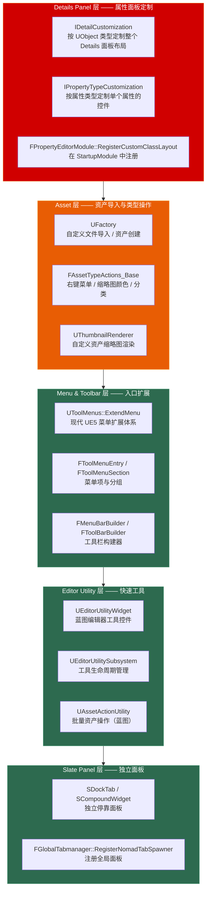

# 第二十二章 编辑器扩展：从 Details Panel 到自定义 Asset 的完整链路

> **一句话理解**：UE 的编辑器扩展是一套五层可插拔架构——**Details Panel 层**（`IDetailCustomization` / `IPropertyTypeCustomization`）让你自定义属性面板的布局和控件，**Asset Factory 层**（`UFactory`）让你定义自定义文件格式的导入逻辑，**Menu & Toolbar 层**（`UToolMenus`）让你扩展菜单和工具栏入口，**Editor Utility 层**（`UEditorUtilityWidget`）让你用蓝图快速搭建编辑器工具，**Slate Panel 层**（`SDockTab`）让你创建独立的编辑器面板窗口。理解这五层的注册机制和模块边界，是编辑器扩展面试的及格线。

---

## 22.1 概念直觉 —— 编辑器扩展的五层架构



```cpp
// ===== 编辑器扩展五层速记 =====
//
// Details Panel 层：
//   定制"选中一个对象后，Details 面板显示什么、怎么显示"。
//   类型级：IDetailCustomization —— 定制 UMyClass 的整个 Details 布局。
//   属性级：IPropertyTypeCustomization —— 定制 FMyStruct 类型属性的控件。
//
// Asset 层：
//   定义"你的自定义资产类型在编辑器中怎么表现"。
//   UFactory → 导入文件的逻辑 / 右键 New → 创建资产。
//   FAssetTypeActions → 右键菜单 / 缩略图颜色 / 资产分类。
//   UThumbnailRenderer → 在 Content Browser 中渲染自定义缩略图。
//
// Menu & Toolbar 层（UToolMenus）：
//   在编辑器菜单栏、工具栏、Content Browser 右键菜单中添加按钮/菜单项。
//   现代 UE5 使用 UToolMenus 注册系统——替代旧版 FExtender。
//
// Editor Utility 层：
//   用蓝图快速创建编辑器工具——无需 C++ 编译即可迭代。
//   适合小型工具——批量重命名 / 关卡检查 / 资产处理。
//
// Slate Panel 层（SDockTab）：
//   创建完全自定义的编辑器面板窗口——与 Details / WorldOutliner 同级。
//   需要 C++ 编写 Slate UI + 注册 Tab Spawner。
```

---

## 22.2 Details Panel 自定义

### 22.2.1 IDetailCustomization —— 按类型定制面板

```cpp
// ===== IDetailCustomization：定制整个 UObject 类型的 Details 面板 =====
//
// 适用场景：
//   - 隐藏或重新排列属性
//   - 在属性之间插入自定义 Slate 控件（按钮/图像/文本）
//   - 按条件显示/隐藏属性分组
//   - 添加自定义"一键设置"按钮

// ---------- ① 定义 Details 定制类 ----------
#include "IDetailCustomization.h"
#include "DetailLayoutBuilder.h"
#include "DetailCategoryBuilder.h"
#include "DetailWidgetRow.h"

class FMyActorDetails : public IDetailCustomization
{
public:
    // ★ 工厂静态方法——FPropertyEditorModule 通过此方法创建实例
    static TSharedRef<IDetailCustomization> MakeInstance()
    {
        return MakeShared<FMyActorDetails>();
    }

    // ★ 核心接口：CustomizeDetails
    virtual void CustomizeDetails(IDetailLayoutBuilder& DetailBuilder) override
    {
        // ① 获取目标对象（可同时选中多个——用数组遍历）
        TArray<TWeakObjectPtr<UObject>> Objects;
        DetailBuilder.GetObjectsBeingCustomized(Objects);

        // ② 隐藏属性
        DetailBuilder.HideProperty(DetailBuilder.GetProperty(
            GET_MEMBER_NAME_CHECKED(AMyActor, InternalDebugValue)));

        // ③ 获取或创建分类（Category）
        IDetailCategoryBuilder& MyCategory = DetailBuilder.EditCategory(
            "MyCustomSettings",
            FText::FromString(TEXT("自定义设置")),
            ECategoryPriority::Important
        );

        // ④ 在分类中添加自定义行——插入自定义 Slate 控件
        MyCategory.AddCustomRow(FText::FromString(TEXT("快速操作")))
            .NameContent()
            [
                SNew(STextBlock)
                    .Text(FText::FromString(TEXT("一键初始化")))
            ]
            .ValueContent()
            [
                SNew(SButton)
                    .Text(FText::FromString(TEXT("执行")))
                    .OnClicked_Lambda([Objects]()
                    {
                        for (const TWeakObjectPtr<UObject>& Obj : Objects)
                        {
                            if (AMyActor* Actor = Cast<AMyActor>(Obj.Get()))
                            {
                                Actor->ResetToDefaults();
                            }
                        }
                        return FReply::Handled();
                    })
            ];

        // ⑤ 强制排序分类显示顺序
        DetailBuilder.SortCategories(FMySortOrder);
    }
};

// ---------- ② 在模块中注册 ----------
void FMyEditorModule::StartupModule()
{
    FPropertyEditorModule& PropertyModule =
        FModuleManager::LoadModuleChecked<FPropertyEditorModule>("PropertyEditor");

    // 注册——当用户在编辑器中选中 AMyActor 时自动触发
    PropertyModule.RegisterCustomClassLayout(
        AMyActor::StaticClass()->GetFName(),
        FOnGetDetailCustomizationInstance::CreateStatic(
            &FMyActorDetails::MakeInstance)
    );
}

void FMyEditorModule::ShutdownModule()
{
    if (FModuleManager::Get().IsModuleLoaded("PropertyEditor"))
    {
        FPropertyEditorModule& PropertyModule =
            FModuleManager::GetModuleChecked<FPropertyEditorModule>("PropertyEditor");

        PropertyModule.UnregisterCustomClassLayout(AMyActor::StaticClass()->GetFName());
    }
}
```

### 22.2.2 IPropertyTypeCustomization —— 按属性类型定制控件

```cpp
// ===== IPropertyTypeCustomization：定制某个属性类型的显示控件 =====
//
// 与 IDetailCustomization 的区别：
//   IDetailCustomization → 定制"选中 AMyActor 时整个面板"
//   IPropertyTypeCustomization → 定制"所有 FMyStruct 类型属性的控件"
//
// 适用场景：
//   - 自定义 FMyStruct 的编辑器控件（而非默认的子属性展开）
//   - 颜色选择器 / 曲线编辑器 / 自定义下拉框替代数值输入

#include "IPropertyTypeCustomization.h"
#include "PropertyHandle.h"

class FMyRangeCustomization : public IPropertyTypeCustomization
{
public:
    static TSharedRef<IPropertyTypeCustomization> MakeInstance()
    {
        return MakeShared<FMyRangeCustomization>();
    }

    // ★ 定制属性的头部——显示在属性名右侧
    // ⚠️ GET_MEMBER_NAME_CHECKED 要求第一个参数是 USTRUCT/UCLASS 类型——必须有反射元数据！
    //    如果 FMyRange 是纯 C++ 结构体（无 USTRUCT），必须退化为 TEXT("Min") 静态字符串
    virtual void CustomizeHeader(
        TSharedRef<IPropertyHandle> PropertyHandle,
        FDetailWidgetRow& HeaderRow,
        IPropertyTypeCustomizationUtils& CustomizationUtils) override
    {
        // 获取子属性句柄
        TSharedPtr<IPropertyHandle> MinHandle =
            PropertyHandle->GetChildHandle(GET_MEMBER_NAME_CHECKED(FMyRange, Min));
        TSharedPtr<IPropertyHandle> MaxHandle =
            PropertyHandle->GetChildHandle(GET_MEMBER_NAME_CHECKED(FMyRange, Max));

        HeaderRow
            .NameContent()
            [
                PropertyHandle->CreatePropertyNameWidget()
            ]
            .ValueContent()
            [
                SNew(SHorizontalBox)
                + SHorizontalBox::Slot()
                .AutoWidth()
                [
                    MinHandle->CreatePropertyValueWidget()  // Min 输入框
                ]
                + SHorizontalBox::Slot()
                .AutoWidth()
                .Padding(4, 0)
                [
                    SNew(STextBlock).Text(FText::FromString(TEXT("~")))
                ]
                + SHorizontalBox::Slot()
                .AutoWidth()
                [
                    MaxHandle->CreatePropertyValueWidget()  // Max 输入框
                ]
            ];
    }

    // ★ 定制属性的子内容——显示在属性下方（展开时）
    virtual void CustomizeChildren(
        TSharedRef<IPropertyHandle> PropertyHandle,
        IDetailChildrenBuilder& ChildBuilder,
        IPropertyTypeCustomizationUtils& CustomizationUtils) override
    {
        // 不需要子内容——留空
    }
};

// ---------- 注册方式（与 IDetailCustomization 不同） ----------
void FMyEditorModule::StartupModule()
{
    FPropertyEditorModule& PropertyModule =
        FModuleManager::LoadModuleChecked<FPropertyEditorModule>("PropertyEditor");

    // ★ RegisterCustomPropertyTypeLayout —— 按类型名注册，而非按类名
    PropertyModule.RegisterCustomPropertyTypeLayout(
        FMyRange::StaticStruct()->GetFName(),
        FOnGetPropertyTypeCustomizationInstance::CreateStatic(
            &FMyRangeCustomization::MakeInstance)
    );
}
```

---

## 22.3 Asset Factory —— 自定义资产导入

### 22.3.1 UFactory 核心 API

```cpp
// ===== UFactory：控制资产创建与导入 =====
//
// 两种模式：
//   ① FactoryCreateNew —— 右键 Content Browser → New → 创建空白资产
//   ② FactoryCreateFile —— 拖入外部文件 → 导入为 UE 资产

// ---------- ① 自定义文件导入 Factory ----------
#include "Factories/Factory.h"
#include "MyDataAsset.h"

UCLASS()
class UMyDataAssetFactory : public UFactory
{
    GENERATED_BODY()

public:
    UMyDataAssetFactory()
    {
        // ★ 核心配置——这四个属性决定了编辑器的导入行为
        bCreateNew = false;                      // 不支持"创建空白"
        bEditAfterNew = true;                    // 创建后自动打开编辑器
        bEditorOnly = true;                      // 仅在编辑器构建中存在
        SupportedClass = UMyDataAsset::StaticClass(); // 产出的资产类型

        // 支持的文件扩展名——多个用分号分隔
        Formats.Add(TEXT("mydata;My Custom Data File"));

        // 导入优先级——数值越高优先级越高（决定"拖入 .json 时用哪个 Factory"）
        // ★ UFactory 没有 ImportPriority 成员变量——必须覆写虚函数
    }

    // ★ 覆写虚函数返回优先级——控制同格式多 Factory 的冲突
    virtual int32 GetImportPriority() const override { return 100; }

    // ★ 核心接口：从文件创建
    virtual UObject* FactoryCreateFile(
        UClass* InClass,
        UObject* InParent,
        FName InName,
        EObjectFlags Flags,
        const FString& Filename,
        const TCHAR* Parms,
        FFeedbackContext* Warn,
        bool& bOutOperationCanceled) override
    {
        // ① 读取文件内容
        FString FileContent;
        if (!FFileHelper::LoadFileToString(FileContent, *Filename))
        {
            Warn->Logf(ELogVerbosity::Error, TEXT("Failed to load file: %s"), *Filename);
            return nullptr;
        }

        // ② 创建目标资产
        UMyDataAsset* NewAsset = NewObject<UMyDataAsset>(InParent, InClass, InName, Flags);
        if (!NewAsset) return nullptr;

        // ③ 解析数据填充到资产（示例——实际按你的文件格式来）
        NewAsset->ParseFromJson(FileContent);

        // ④ 标记为已修改——编辑器提示保存
        NewAsset->MarkPackageDirty();

        return NewAsset;
    }
};

// ---------- ② 创建空白资产 Factory ----------
UCLASS()
class UMyDataAssetNewFactory : public UFactory
{
    GENERATED_BODY()

public:
    UMyDataAssetNewFactory()
    {
        bCreateNew = true;                       // ★ 支持"创建空白"
        bEditAfterNew = true;
        SupportedClass = UMyDataAsset::StaticClass();
    }

    virtual UObject* FactoryCreateNew(
        UClass* InClass,
        UObject* InParent,
        FName InName,
        EObjectFlags Flags,
        UObject* Context,
        FFeedbackContext* Warn) override
    {
        return NewObject<UMyDataAsset>(InParent, InClass, InName, Flags);
    }
};
```

### 22.3.2 FAssetTypeActions —— 资产右键菜单与分类

```cpp
// ===== FAssetTypeActions_Base：扩展资产在 Content Browser 中的行为 =====
//
// 控制：
//   - 资产在 Content Browser 中的分类（在哪里创建）
//   - 资产的右键菜单（自定义操作）
//   - 资产缩略图的背景颜色
//   - 双击编辑器的打开行为

#include "AssetTypeActions_Base.h"
#include "IAssetTools.h"

class FAssetTypeActions_MyData : public FAssetTypeActions_Base
{
public:
    // ① 资产显示名称
    virtual FText GetName() const override
    {
        return FText::FromString(TEXT("My Custom Data"));
    }

    // ② 资产分类颜色（Content Browser 中缩略图底部的色条）
    virtual FColor GetTypeColor() const override
    {
        return FColor(255, 128, 64);  // 橙色
    }

    // ③ 资产所属的 UClass
    virtual UClass* GetSupportedClass() const override
    {
        return UMyDataAsset::StaticClass();
    }

    // ④ Content Browser 中"Add / Import"菜单下的分类路径
    virtual uint32 GetCategories() override
    {
        return EAssetTypeCategories::Gameplay;  // 或自定义分类
    }

    // ⑤ 双击资产时的行为（打开自定义编辑器窗口——高级主题）
    virtual void OpenAssetEditor(
        const TArray<UObject*>& InObjects,
        TSharedPtr<IToolkitHost> EditWithinLevelEditor) override
    {
        // 简单处理：打开默认属性编辑器
        FSimpleAssetEditor::CreateEditor(EToolkitMode::Standalone, EditWithinLevelEditor, InObjects);
    }
};

// ---------- 注册 AssetTypeActions ----------
void FMyEditorModule::StartupModule()
{
    IAssetTools& AssetTools = FModuleManager::LoadModuleChecked<FAssetToolsModule>("AssetTools").Get();

    // 创建并注册
    TSharedRef<IAssetTypeActions> MyDataActions = MakeShared<FAssetTypeActions_MyData>();
    AssetTools.RegisterAssetTypeActions(MyDataActions);

    // 保存引用——ShutdownModule 中注销
    RegisteredAssetTypeActions.Add(MyDataActions);
}

// 在模块头部声明：
// TArray<TSharedPtr<IAssetTypeActions>> RegisteredAssetTypeActions;
```

---

## 22.4 菜单与工具栏扩展 —— UToolMenus

### 22.4.1 现代 UE5 菜单扩展体系

```cpp
// ===== UToolMenus：UE5 的菜单注册系统（替代旧版 FExtender） =====
//
// UToolMenus 使用注册-回调模式：
//   ① 在 StartupModule 中调用 RegisterMenuEntry / ExtendMenu
//   ② 引擎在菜单显示前回调你的代码——动态生成菜单项
//   ③ 比旧版 FExtender 更简洁、支持多轮扩展

#include "ToolMenus.h"
#include "ToolMenuSection.h"
#include "ToolMenuEntry.h"

void SetupMenuExtensions()
{
    UToolMenus* ToolMenus = UToolMenus::Get();
    if (!ToolMenus) return;

    // ---------- ① 在 Content Browser 右键菜单中添加选项 ----------
    // ★ 正统 UE5 菜单路径：ContentBrowser.ContextMenu
    //    在回调内部通过 Context.FindSelectedAsset<T>() 嗅探具体类型
    ToolMenus->ExtendMenu("ContentBrowser.ContextMenu")
        ->AddDynamicSection("MyDynamicSection",
            FNewToolMenuDelegate::CreateLambda([](UToolMenu* Menu)
            {
                FToolMenuSection& Section = Menu->FindOrAddSection("MySection");

                Section.AddMenuEntry(
                    "MyCustomAction",
                    FText::FromString(TEXT("我的自定义操作")),
                    FText::FromString(TEXT("对这个资产执行自定义处理")),
                    FSlateIcon(),
                    FToolMenuExecuteAction::CreateLambda([](const FToolMenuContext& Context)
                    {
                        // 获取选中的资产
                        if (UMyDataAsset* Asset = Context.FindSelectedAsset<UMyDataAsset>())
                        {
                            Asset->DoCustomProcess();
                        }
                    })
                );
            })
        );

    // ---------- ② 在主菜单栏添加菜单 ----------
    ToolMenus->ExtendMenu("LevelEditor.MainMenu")
        ->AddSubMenu("LevelEditor.MainMenu", "MainFrame", "MyTools",
            FText::FromString(TEXT("我的工具")),
            FText::FromString(TEXT("团队自定义工具集")))
        ->AddMenuEntry("MyTool_CheckLevel",
            FText::FromString(TEXT("检查关卡")),
            FText::FromString(TEXT("运行关卡规范检查")),
            FSlateIcon(),
            FToolMenuExecuteAction::CreateLambda([](const FToolMenuContext&)
            {
                // 执行关卡检查逻辑
            })
        );

    // ---------- ③ 在工具栏添加按钮 ----------
    ToolMenus->ExtendMenu("LevelEditor.LevelEditorToolBar.PlayToolBar")
        ->AddMenuEntry("MyToolBarButton",
            FText::FromString(TEXT("快速检查")),
            FText::FromString(TEXT("一键运行项目规范检查")),
            FSlateIcon(FAppStyle::GetAppStyleSetName(), "Icons.Warning"),
            FToolMenuExecuteAction::CreateLambda([](const FToolMenuContext&)
            {
                // 执行检查
            })
        );
}
```

---

## 22.5 Editor Utility Widget / Blueprint —— 蓝图编辑器工具

### 22.5.1 UEditorUtilityWidget 基础

```cpp
// ===== Editor Utility Widget：用蓝图快速搭建编辑器工具 =====
//
// 特点：
//   ✓ 无需 C++ 编译——蓝图直接迭代
//   ✓ 可以像普通 UMG Widget 一样拖拽 UI 控件
//   ✓ 在编辑器中以独立标签页运行
//   ✗ 不能做太底层的操作（需要 C++ 暴露 Editor Utility 函数）
//
// 创建方式：
//   ① Content Browser → 右键 → Editor Utilities → Editor Utility Widget
//   ② 选择父类：UEditorUtilityWidget
//   ③ 像做 UMG Widget 一样设计 UI
//   ④ 右键 .uasset → Run Editor Utility Widget → 在编辑器中运行

// ---------- C++ 中提供供蓝图调用的编辑器工具函数 ----------
#include "EditorUtilityLibrary.h"
#include "EditorAssetLibrary.h"

UCLASS(BlueprintType)
class UMyEditorUtilityFunctions : public UBlueprintFunctionLibrary
{
    GENERATED_BODY()

public:
    // ★ 蓝图可调用的编辑器工具函数——供 Editor Utility Widget 使用
    UFUNCTION(BlueprintCallable, Category = "Editor Utility")
    static void BatchRenameAssets(const FString& Prefix)
    {
        // 获取 Content Browser 中选中的所有资产
        TArray<UObject*> SelectedAssets =
            UEditorUtilityLibrary::GetSelectedAssets();

        for (UObject* Asset : SelectedAssets)
        {
            FString OldName = Asset->GetName();
            FString NewName = Prefix + TEXT("_") + OldName;
            UEditorAssetLibrary::RenameAsset(Asset->GetPathName(), NewName);
        }

        // 保存所有修改过的资产
        UEditorAssetLibrary::SaveLoadedAssets(SelectedAssets);
    }

    UFUNCTION(BlueprintCallable, Category = "Editor Utility")
    static TArray<FString> GetAllActorNamesInLevel()
    {
        TArray<FString> Names;
        for (TActorIterator<AActor> It(GWorld); It; ++It)
        {
            Names.Add(It->GetName());
        }
        return Names;
    }
};
```

---

## 22.6 自定义缩略图 —— UThumbnailRenderer

```cpp
// ===== UThumbnailRenderer：在 Content Browser 中渲染自定义缩略图 =====
//
// 适用场景：你的自定义资产类型在 Content Browser 中显示的是
//           默认的"文档"图标——用 ThumbnailRenderer 渲染实际内容预览

#include "ThumbnailRendering/DefaultSizedThumbnailRenderer.h"

UCLASS()
class UMyDataAssetThumbnailRenderer : public UDefaultSizedThumbnailRenderer
{
    GENERATED_BODY()

public:
    // ★ 核心接口：绘制缩略图
    virtual void Draw(
        UObject* Object,
        int32 X,
        int32 Y,
        uint32 Width,
        uint32 Height,
        FRenderTarget* RenderTarget,
        FCanvas* Canvas,
        bool bAdditionalViewFamily) override
    {
        UMyDataAsset* DataAsset = Cast<UMyDataAsset>(Object);
        if (!DataAsset) return;

        // 在 RenderTarget 上绘制——使用 FCanvas 的绘图 API
        // 可以绘制文本、形状、或渲染一个场景快照
        FCanvasTextItem TextItem(
            FVector2D(10, 10),
            FText::FromString(DataAsset->GetName()),
            GEngine->GetSmallFont(),
            FLinearColor::White
        );
        Canvas->DrawItem(TextItem);

        // 对于 3D 资产的缩略图——使用 UThumbnailRenderer（而非 DefaultSized）
        // 它可以渲染mesh/texture到缩略图中
    }
};

// 注册方式：
// ★ 必须手动注册——不存在"自动发现"机制！
//    在编辑器模块的 StartupModule 中显式调用：
//
//   UThumbnailManager::Get().RegisterCustomRenderer(
//       UMyDataAsset::StaticClass(),
//       UMyDataAssetThumbnailRenderer::StaticClass());
//
//   并在 ShutdownModule 中注销：
//   UThumbnailManager::Get().UnregisterCustomRenderer(UMyDataAsset::StaticClass());
```

---

## 22.7 Slate 编辑器面板 —— 独立停靠窗口

### 22.7.1 SDockTab + FGlobalTabmanager

```cpp
// ===== 注册独立的编辑器面板（与 Details / WorldOutliner 同级） =====
//
// 工作流：
//   ① 创建 Slate Widget（SCompoundWidget）——面板的 UI 内容
//   ② 在 StartupModule 中注册 Tab Spawner
//   ③ 在 Window → 菜单中出现你的面板入口

#include "Widgets/Docking/SDockTab.h"
#include "Framework/Docking/TabManager.h"
#include "WorkspaceMenuStructure.h"
#include "WorkspaceMenuStructureModule.h"

// ---------- ① 定义面板内容 Widget ----------
class SMyToolPanel : public SCompoundWidget
{
    SLATE_BEGIN_ARGS(SMyToolPanel) {}
    SLATE_END_ARGS()

    void Construct(const FArguments& InArgs)
    {
        ChildSlot
        [
            SNew(SVerticalBox)
            + SVerticalBox::Slot()
            .AutoHeight()
            .Padding(10)
            [
                SNew(STextBlock)
                    .Text(FText::FromString(TEXT("我的自定义工具面板")))
                    .Font(FCoreStyle::GetDefaultFontStyle("Bold", 14))
            ]
            + SVerticalBox::Slot()
            .FillHeight(1.0f)
            .Padding(10)
            [
                SNew(SButton)
                    .Text(FText::FromString(TEXT("执行检查")))
                    .OnClicked_Lambda([]()
                    {
                        // 执行工具逻辑
                        return FReply::Handled();
                    })
            ]
        ];
    }
};

// ---------- ② 在模块中注册面板 ----------
void FMyEditorModule::StartupModule()
{
    // ★ 注册 Nomad Tab（可以自由停靠/浮动的面板）
    FGlobalTabmanager::Get()->RegisterNomadTabSpawner(
        "MyToolPanel",  // Tab ID——唯一标识
        FOnSpawnTab::CreateLambda([](const FSpawnTabArgs& Args) -> TSharedRef<SDockTab>
        {
            return SNew(SDockTab)
                .TabRole(ETabRole::NomadTab)  // 可自由停靠/浮动
                .Label(FText::FromString(TEXT("我的工具")))
                [
                    SNew(SMyToolPanel)
                ];
        })
    )
    .SetDisplayName(FText::FromString(TEXT("我的工具")))
    .SetTooltipText(FText::FromString(TEXT("团队自定义的关卡检查工具")))
    .SetGroup(WorkspaceMenu::GetMenuStructure().GetDeveloperToolsMiscCategory());
    // ★ 在 Window → Developer Tools 菜单下出现入口
}

void FMyEditorModule::ShutdownModule()
{
    // 注销面板
    FGlobalTabmanager::Get()->UnregisterNomadTabSpawner("MyToolPanel");
}
```

---

## 22.8 常见陷阱与面试深度追问

### 22.8.1 编辑器扩展 TOP 5 陷阱

```cpp
// ===== 陷阱 #1：忘记在 ShutdownModule 中注销注册 =====
// ✗ StartupModule 中注册了 DetailCustomization / AssetTypeActions / TabSpawner
//   但 ShutdownModule 中没有配套的 Unregister
//   → 热重载（LiveCoding）时编辑器崩溃——旧的注册指向已卸载的 DLL 代码
// ✓ 所有 Register 都有对应的 Unregister——保存在成员变量中供 Shutdown 使用

// ===== 陷阱 #2：编辑器模块没有设为 Editor 类型 =====
// ✗ 把编辑器扩展写在 Runtime 模块中
//   → Shipping 包中包含了编辑器代码——体积膨胀 + 潜在的作弊入口
// ✓ 编辑器扩展必须放在 Type = "Editor" 的模块中——打包时自动排除
//   项目结构：MyProject（Runtime）+ MyProjectEditor（Editor）

// ===== 陷阱 #3：IDetailCustomization 的 CustomizeDetails 做耗时操作 =====
// ✗ 在 CustomizeDetails 中做资源加载、文件读取、网络请求
//   → 每次用户点击不同 Actor → Details 面板卡死 → 编辑器体验极差
// ✓ CustomizeDetails 只做 UI 构建——数据获取用异步或缓存

// ===== 陷阱 #4：在 FAssetTypeActions 中使用同步加载 =====
// ✗ OpenAssetEditor 中同步 LoadObject 大量资产
//   → 双击资产 → 编辑器冻结 5 秒 → 体验灾难
// ✓ 使用 FStreamableManager 异步预加载编辑器资源

// ===== 陷阱 #5：过度依赖 Editor Utility Widget 做复杂工具 =====
// ✗ 用蓝图 Editor Utility Widget 做大项目的整个资源管线
//   → 蓝图调试困难、版本控制不友好、团队协作差
// ✓ Editor Utility Widget 适合小型工具（<100 个蓝图节点）
//   复杂管线用 C++ Slate 面板——可测试、可调试、可团队协作
```

### 22.8.2 面试速记三连

```
Q: "IDetailCustomization 和 IPropertyTypeCustomization 的区别？"
A: IDetailCustomization 按 UObject 类型工作——"选中 AMyActor 时面板怎么显示"。
   注册方式：RegisterCustomClassLayout(ClassName)。
   IPropertyTypeCustomization 按属性类型工作——"所有 FMyStruct 类型属性怎么显示"。
   注册方式：RegisterCustomPropertyTypeLayout(StructName)。
   一句话：ClassLayout = 整个对象的布局，PropertyTypeLayout = 单个属性类型的控件。

Q: "怎么给自定义资产类型添加 Content Browser 右键菜单？"
A: ① 创建 FAssetTypeActions_Base 子类——重写 GetName/GetColor/GetSupportedClass。
   ② 在 IAssetTools::RegisterAssetTypeActions 中注册。
   ③ 如需额外的右键菜单项——在 UToolMenus::ExtendMenu("ContentBrowser.ContextMenu") 中注册回调，回调内部用 Context.FindSelectedAsset<T>() 嗅探目标类型后动态添加菜单项。
   ④ 别忘了在 ShutdownModule 中 UnregisterAssetTypeActions。

Q: "UToolMenus 和旧版 FExtender 的区别？为什么 UE5 换了？"
A: FExtender 是 UE4 时代的菜单扩展方式——使用委托链，需要在构造时构建完整的扩展对象，
   多轮扩展时委托链难以调试。UToolMenus 是 UE5 的新一代注册系统——
   使用注册-回调模式，菜单显示时才回调生成菜单项，支持多轮动态扩展。
   UToolMenus 还支持菜单的持久化配置（用户自定义快捷键绑定）。
```

---

## 22.9 30 秒速答

> **面试被问："UE 编辑器怎么扩展？有哪些主要的扩展点？"**

五大扩展点——**Details Panel**（`IDetailCustomization` 定制属性面板布局，`IPropertyTypeCustomization` 定制单个属性控件，在 `StartupModule` 中向 `FPropertyEditorModule` 注册）、**Asset 导入**（`UFactory` 子类定义文件导入逻辑和资产创建，`FAssetTypeActions_Base` 定义 Content Browser 中的分类/右键菜单/缩略图颜色，`IAssetTools::RegisterAssetTypeActions` 注册）、**菜单与工具栏**（`UToolMenus::ExtendMenu` 动态添加菜单项——现代 UE5 体系替代旧版 `FExtender`）、**Editor Utility Widget**（蓝图快速搭建编辑器实用工具——无需 C++ 编译即可迭代）、**独立面板**（`SDockTab` + `FGlobalTabmanager::RegisterNomadTabSpawner` 创建与 Details 同级的停靠面板）。

> **面试追问："怎么把编辑器扩展隔离到独立的模块中？"**

创建 Editor 类型模块——`.uproject` 中声明 `{"Name": "MyProjectEditor", "Type": "Editor"}`，`.Build.cs` 中依赖 `UnrealEd` / `PropertyEditor` / `AssetTools` 等编辑器专用模块。所有扩展代码放在该模块的 `Private/` 中。模块在 `StartupModule` 中注册所有扩展，在 `ShutdownModule` 中注销。Shipping 打包时 Editor 类型模块自动排除——零额外体积。

> **面试追问："怎么让自定义资产在 Content Browser 中显示自定义缩略图？"**

继承 `UThumbnailRenderer`（3D 资产）或 `UDefaultSizedThumbnailRenderer`（2D 预览），重写 `Draw()` 方法——在 `FCanvas` 上绘制自定义预览。★ 必须在 `StartupModule` 中通过 `UThumbnailManager::Get().RegisterCustomRenderer()` 显式注册——不存在"自动发现"机制。对于简单预览：可以直接在 `FAssetTypeActions::GetThumbnailBrush()` 中返回自定义笔刷图片。

---

## 22.10 本章自查清单

- [ ] 能画出编辑器扩展的五层架构（Details Panel / Asset / Menu / Utility / Slate Panel）
- [ ] 能区分 IDetailCustomization（按类型）和 IPropertyTypeCustomization（按属性）的使用场景
- [ ] 能写出 CustomizeDetails 的完整注册和注销代码
- [ ] 理解 UFactory 的 bCreateNew / bEditorOnly / SupportedClass / Formats 配置
- [ ] 能创建 FAssetTypeActions_Base 子类并注册到 IAssetTools
- [ ] 能使用 UToolMenus::ExtendMenu 添加自定义菜单项
- [ ] 理解 Editor Utility Widget 的适用边界（小型工具 vs 复杂管线）
- [ ] 能写出 RegisterNomadTabSpawner + SDockTab 的独立面板注册代码
- [ ] 知道为什么编辑器扩展必须放在 Editor 类型模块中
- [ ] 知道至少 3 个编辑器扩展的常见陷阱及解决方案

---

> 📚 **第四部第四章完结。** 编辑器扩展是工业化生产的工作流基石——Details 定制让你精确控制属性面板，Asset Factory 让你支持自定义文件格式，菜单扩展让你的工具入口触手可及。接下来进入全系列终章 Ch23：自动化测试——从 Unit Test 到 Gauntlet 的完整测试体系。

> 💡 **前置依赖提醒**：
> - 模块与构建系统（Editor 类型模块的配置和加载） → 见 [Ch19：模块与构建系统](../19_build_system/)
> - Slate 与 UMG（SDockTab / SCompoundWidget 的 UI 构建） → 见 [Ch11：Slate 与 UMG](../11_slate_umg/)
> - 编码规范（编辑器代码同样遵循前缀和命名规范） → 见 [Ch20：Epic 编码规范与最佳实践](../20_coding_standards/)
> - 数据驱动与资源管理（AssetTools 与 AssetManager 的关系） → 见 [Ch13：数据驱动与资源管理](../13_data_asset_management/)
