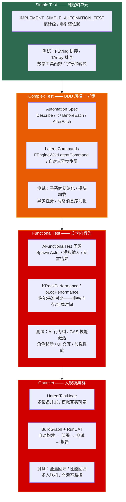

# 第二十三章 自动化测试：从 Unit Test 到 Gauntlet 的完整测试体系

> **一句话理解**：UE 的自动化测试是四层金字塔——**Simple Test**（纯 C++ 逻辑单元——毫秒级、零依赖）验证算法和工具函数，**Complex Test**（Automation Spec——BDD 风格、Latent Commands 支持异步）验证跨帧行为和子系统交互，**Functional Test**（关卡内行为——Spawn Actor、模拟玩家输入、验证 Gameplay 结果）验证完整的游戏功能链路，**Gauntlet**（大规模集群——多设备并发、性能回归、崩溃监控）验证产品的整体质量。这四层构成了"提交前跑 Simple → PR 前跑 Complex → Nightly 跑 Functional → Release 跑 Gauntlet"的完整质量门禁——是工业级 UE 开发的"最后一道防线"。

---

## 23.1 概念直觉 —— 测试体系的四层金字塔



```cpp
// ===== 测试四层速记 =====
//
// Simple Test（纯逻辑）：
//   不依赖 World / Actor / Component——只测纯 C++ 函数和算法。
//   零启动时间——适合 TDD（测试驱动开发），提交前跑一次。
//
// Complex Test（模块集成）：
//   可以加载模块、创建 UObject（通过 NewObject）、模拟帧推进。
//   支持 Latent Commands——"等 3 帧，然后检查状态"。
//
// Functional Test（关卡内）：
//   需要完整的 Game World——加载关卡、Spawn Actor、模拟输入。
//   测试完整的 Gameplay 链路——"按下攻击键 → 技能激活 → 敌人受伤"。
//
// Gauntlet（工业化）：
//   在 CI 服务器上自动构建 → 部署到多台设备 → 运行预定义测试流程。
//   主要用于性能回归和崩溃率监控——不是日常开发工具。
```

---

## 23.2 Simple Test —— IMPLEMENT_SIMPLE_AUTOMATION_TEST

### 23.2.1 最简单的单元测试

```cpp
// ===== IMPLEMENT_SIMPLE_AUTOMATION_TEST：零依赖的纯逻辑测试 =====
//
// 特点：
//   ✓ 不创建 World / Actor / Component——纯 C++ 逻辑
//   ✓ 毫秒级执行——适合 TDD
//   ✓ 可在命令行运行——适合 CI
//   ✗ 不能做需要 UObject / World 的事情

#include "Misc/AutomationTest.h"

// ---------- 测试 1：工具函数单元测试 ----------
IMPLEMENT_SIMPLE_AUTOMATION_TEST(
    FMyMathTest,                                     // 测试类名——全局唯一
    "MyGame.Core.Math.Addition",                     // ★ 测试路径——用 . 分隔层级
    EAutomationTestFlags::ApplicationContextMask |    // 在编辑器或命令行运行
    EAutomationTestFlags::ProductFilter               // 归类为"产品质量测试"
)

bool FMyMathTest::RunTest(const FString& Parameters)
{
    // 测试加法
    int32 Result = 2 + 3;
    TestEqual(TEXT("2 + 3 should equal 5"), Result, 5);

    // 测试浮点近似相等
    float FloatResult = 1.0f / 3.0f;
    TestNearlyEqual(TEXT("1/3 ≈ 0.333"), FloatResult, 0.333f, 0.001f);

    // 测试布尔条件
    TestTrue(TEXT("5 > 3"), 5 > 3);
    TestFalse(TEXT("5 < 3 is false"), 5 < 3);

    // 测试空指针
    int32* NullPtr = nullptr;
    TestNull(TEXT("ptr should be null"), NullPtr);

    return true;  // 所有断言通过
}

// ---------- 测试 2：FString 操作 ----------
IMPLEMENT_SIMPLE_AUTOMATION_TEST(
    FStringTest,
    "MyGame.Core.String.Concatenation",
    EAutomationTestFlags::ApplicationContextMask | EAutomationTestFlags::ProductFilter
)

bool FStringTest::RunTest(const FString& Parameters)
{
    FString Result = FString::Printf(TEXT("Hello %s"), TEXT("World"));
    TestEqual(TEXT("Printf result"), Result, FString(TEXT("Hello World")));

    FString Trimmed = FString(TEXT("  spaced  ")).TrimStartAndEnd();
    TestEqual(TEXT("Trim result"), Trimmed, FString(TEXT("spaced")));

    return true;
}

// ---------- 测试 3：TArray 操作 ----------
IMPLEMENT_SIMPLE_AUTOMATION_TEST(
    FTArraySortTest,
    "MyGame.Core.Containers.Sort",
    EAutomationTestFlags::ApplicationContextMask | EAutomationTestFlags::ProductFilter
)

bool FTArraySortTest::RunTest(const FString& Parameters)
{
    TArray<int32> Numbers = { 5, 2, 8, 1, 9 };
    Numbers.Sort();

    TestEqual(TEXT("First element after sort"), Numbers[0], 1);
    TestEqual(TEXT("Last element after sort"), Numbers.Last(), 9);

    // 模板类型测试
    TArray<FString> Names = { TEXT("Zoe"), TEXT("Alice"), TEXT("Bob") };
    Names.Sort();
    TestEqual(TEXT("First name after sort"), Names[0], FString(TEXT("Alice")));

    return true;
}
```

### 23.2.2 AutomationTestFlags 速查

```cpp
// ===== EAutomationTestFlags：控制测试的运行环境与行为 =====
//
// ┌────────────────────────────────┬──────────────────────────────────┐
// │ Flag                            │ 含义                               │
// ├────────────────────────────────┼──────────────────────────────────┤
// │ ApplicationContextMask          │ 编辑器和命令行都运行（最常用）        │
// │ EditorContext                   │ 仅在编辑器中运行                    │
// │ CommandletContext               │ 仅在命令行/CI 中运行                 │
// │ ProductFilter                   │ 产品测试——显示在 Session Frontend 中 │
// │ SmokeFilter                     │ 冒烟测试——构建后快速验证              │
// │ StressFilter                    │ 压力测试——长时间运行                   │
// │ PerfFilter                      │ 性能测试——需要记录性能数据              │
// │ Disabled                        │ 禁用——当前跳过                        │
// └────────────────────────────────┴──────────────────────────────────┘

// ---------- 测试路径命名规范 ----------
//
// 路径用 . 分隔，按层级组织：
//   "Project.System.Feature.TestCase"
//
// 示例：
//   "MyGame.Inventory.AddItem.Success"
//   "MyGame.Inventory.AddItem.FullInventory"
//   "MyGame.Combat.Damage.Normal"
//   "MyGame.Combat.Damage.Critical"
//
// 这样在 Session Frontend 中可以按层级勾选要运行的测试
```

---

## 23.3 Automation Spec —— BDD 风格 + 异步测试

### 23.3.1 Describe / It 结构

```cpp
// ===== Automation Spec：BDD（行为驱动开发）风格的测试 =====
//
// 与 Simple Test 的区别：
//   Simple → 一个类一个测试
//   Spec   → 一个类可包含多个 Describe / It 块——更好的组织结构
//
// 语法对照：
//   BDD 术语          Automation Spec
//   ────────          ────────────────
//   Describe          Describe("场景描述")
//   It                It("行为描述", [this](){ ... })
//   BeforeEach        BeforeEach([this](){ ... })
//   AfterEach         AfterEach([this](){ ... })

#include "Misc/AutomationTest.h"

BEGIN_DEFINE_SPEC(
    FInventorySpec,                                  // Spec 类名
    "MyGame.Inventory",                              // 测试路径
    EAutomationTestFlags::ApplicationContextMask |
    EAutomationTestFlags::ProductFilter
)
    // ★ 成员变量——在 BeforeEach 中初始化，在 It 中使用
    TArray<FString> Inventory;
    const int32 MaxSlots = 10;

END_DEFINE_SPEC(FInventorySpec)

void FInventorySpec::Define()
{
    // ★ Describe 块——一组相关的测试场景
    Describe("AddItem", [this]()
    {
        // ★ BeforeEach —— 每个 It 之前运行
        BeforeEach([this]()
        {
            Inventory.Reset();
            Inventory.Reserve(MaxSlots);
        });

        // ★ AfterEach —— 每个 It 之后运行
        AfterEach([this]()
        {
            Inventory.Reset();
        });

        // ★ It —— 单个测试用例
        It("should add item to empty inventory", [this]()
        {
            Inventory.Add(TEXT("Sword"));
            TestEqual(TEXT("Inventory count"), Inventory.Num(), 1);
            TestEqual(TEXT("First item"), Inventory[0], FString(TEXT("Sword")));
        });

        It("should reject item when inventory is full", [this]()
        {
            // 填满背包
            for (int32 i = 0; i < MaxSlots; ++i)
            {
                Inventory.Add(FString::Printf(TEXT("Item_%d"), i));
            }

            // 验证无法添加
            TestEqual(TEXT("Inventory is full"), Inventory.Num(), MaxSlots);
            TestTrue(TEXT("Cannot add more"), Inventory.Num() >= MaxSlots);
        });

        It("should not add duplicate items", [this]()
        {
            Inventory.Add(TEXT("Sword"));
            // 假设去重逻辑在此
            TestEqual(TEXT("Only one Sword"), Inventory.Num(), 1);
        });
    });

    Describe("RemoveItem", [this]()
    {
        BeforeEach([this]()
        {
            Inventory = { TEXT("Sword"), TEXT("Shield"), TEXT("Potion") };
        });

        It("should remove existing item", [this]()
        {
            Inventory.Remove(TEXT("Shield"));
            TestEqual(TEXT("Count after remove"), Inventory.Num(), 2);
            TestFalse(TEXT("Shield not in inventory"),
                Inventory.Contains(TEXT("Shield")));
        });

        It("should do nothing when removing non-existent item", [this]()
        {
            Inventory.Remove(TEXT("NonExistent"));
            TestEqual(TEXT("Count unchanged"), Inventory.Num(), 3);
        });
    });
}
```

### 23.3.2 Latent Commands —— 异步步骤测试

```cpp
// ===== Latent Commands：测试需要"等待帧"的逻辑 =====
//
// 适用场景：
//   - 测试异步加载（等待 FStreamableManager 回调）
//   - 测试多帧动画（等待动画 Blueprint 状态机切换）
//   - 测试网络消息（等待 RPC 往返）
//   - 测试延迟生成（等待 SpawnActor 的 BeginPlay 完成）
//
// 原理：
//   Latent Command 是一个队列——引擎逐帧执行队列中的每个 Command。
//   每个 Command 的 Update() 返回 true → 推进到下一个 Command。
//   每个 Command 的 Update() 返回 false → 下一帧继续执行该 Command。

#include "Tests/AutomationCommon.h"
#include "Misc/AutomationTest.h"

// ---------- ① 使用内置 Latent Command ----------
IMPLEMENT_SIMPLE_AUTOMATION_TEST(
    FLatentWaitTest,
    "MyGame.Core.Latent.WaitFrames",
    EAutomationTestFlags::ApplicationContextMask | EAutomationTestFlags::ProductFilter
)

bool FLatentWaitTest::RunTest(const FString& Parameters)
{
    int32 FrameCount = 0;

    // ★ 等待 5 帧——每帧 FrameCount 递增
    ADD_LATENT_AUTOMATION_COMMAND(FEngineWaitLatentCommand(0.1f));  // 等待 0.1 秒

    // 自定义逻辑——检查 World 是否就绪
    // ⚠️ Latent Command 跨帧异步执行——不能引用捕获局部变量（会变成悬空引用）！
    //    必须使用 TSharedPtr 等智能指针保持生命周期
    TSharedPtr<int32> FrameCount = MakeShared<int32>(0);
    ADD_LATENT_AUTOMATION_COMMAND(FFunctionLatentCommand([FrameCount]()
    {
        (*FrameCount)++;
        // 返回 true → 推进到下一个 Command
        // 返回 false → 下一帧重新执行（用于等待异步操作）
        return *FrameCount >= 3;  // 执行 3 帧后推进
    }));

    // 最终验证
    ADD_LATENT_AUTOMATION_COMMAND(FFunctionLatentCommand([this, FrameCount]()
    {
        TestTrue(TEXT("At least 3 frames elapsed"), *FrameCount >= 3);
        return true;  // 测试完成
    }));

    return true;
}

// ---------- ② 自定义 Latent Command 类 ----------
// 适用：可复用的异步等待逻辑
class FWaitForConditionCommand : public IAutomationLatentCommand
{
public:
    TFunction<bool()> Condition;
    float TimeoutSeconds;
    double StartTime;

    FWaitForConditionCommand(TFunction<bool()> InCondition, float InTimeout = 5.0f)
        : Condition(InCondition)
        , TimeoutSeconds(InTimeout)
        , StartTime(FPlatformTime::Seconds())
    {
    }

    virtual bool Update() override
    {
        // 条件满足 → 推进
        if (Condition())
        {
            return true;
        }

        // 超时 → 强制推进（避免永久卡住测试）
        double Elapsed = FPlatformTime::Seconds() - StartTime;
        if (Elapsed > TimeoutSeconds)
        {
            UE_LOG(LogTemp, Error, TEXT("Latent Command timed out after %.1f seconds"), Elapsed);
            return true;  // 超时也推进——让后续断言检测到失败
        }

        return false;  // 下一帧继续
    }
};

// 使用示例：
void UseCustomLatentCommand()
{
    // ★ 使用 TSharedPtr 安全捕获——Latent Command 跨帧异步，局部变量栈已销毁
    TSharedPtr<bool> bAsyncDone = MakeShared<bool>(false);

    // 启动异步操作
    AsyncTask(ENamedThreads::AnyThread, [bAsyncDone]()
    {
        FPlatformProcess::Sleep(0.1f);
        *bAsyncDone = true;
    });

    // 等待异步完成（最多 5 秒超时）
    ADD_LATENT_AUTOMATION_COMMAND(
        FWaitForConditionCommand([bAsyncDone]() { return *bAsyncDone; }, 5.0f)
    );
}
```

---

## 23.4 Functional Test —— 关卡内行为测试

### 23.4.1 AFunctionalTest 完整实战

```cpp
// ===== AFunctionalTest：在真实关卡中测试 Gameplay 行为 =====
//
// 特点：
//   ✓ 拥有完整的 Game World——可以 Spawn Actor、触发输入、运行 Gameplay
//   ✓ 在关卡中放置 AFunctionalTest Actor → 运行 → 自动断言
//   ✓ 支持 Latent 步骤——等待动画/粒子/AI 行为完成
//   ✗ 比 Simple/Complex Test 慢得多——需要加载关卡和资源
//
// 使用方式：
//   ① 创建一个继承 AFunctionalTest 的蓝图或 C++ 类
//   ② 在关卡中放置该 Actor
//   ③ Session Frontend → Automation → 找到你的测试 → 运行

#include "FunctionalTest.h"
#include "AITestsCommon.h"

UCLASS()
class AMyCombatFunctionalTest : public AFunctionalTest
{
    GENERATED_BODY()

public:
    virtual void StartTest() override
    {
        Super::StartTest();

        // ① 在测试起点生成敌人
        FActorSpawnParameters SpawnParams;
        SpawnParams.SpawnCollisionHandlingOverride =
            ESpawnActorCollisionHandlingMethod::AlwaysSpawn;

        EnemyActor = GetWorld()->SpawnActor<AMyEnemy>(
            AMyEnemy::StaticClass(),
            GetTransform(),    // 使用测试 Actor 的位置
            SpawnParams
        );

        if (!EnemyActor)
        {
            FinishTest(EFunctionalTestResult::Error,
                TEXT("Failed to spawn enemy"));
            return;
        }

        // ② 初始化敌人属性
        EnemyActor->Health = 100.0f;

        // ③ ★ AFunctionalTest 没有 AddCommand —— 它是普通 AActor，非 FAutomationTestBase
        //   多步异步测试通过 FTimerHandle 状态机驱动——每步定时触发下一步
        TestStep = 0;
        GetWorld()->GetTimerManager().SetTimer(
            TestStepTimer,
            this,
            &AMyCombatFunctionalTest::ExecuteTestStep,
            0.1f,   // 每 0.1s 推进一步——给 World 一帧时间稳定
            true    // 循环——在 ExecuteTestStep 中按 TestStep 分发
        );
    }

    void ExecuteTestStep()
    {
        switch (TestStep)
        {
            case 0:  // 第 1 步：模拟攻击
                ApplyDamageToEnemy(30.0f);
                TestStep++;
                break;

            case 1:  // 步骤 2：验证血量
                if (EnemyActor->Health != 70.0f)
                {
                    FinishTest(EFunctionalTestResult::Error,
                        FString::Printf(TEXT("Expected health 70, got %.1f"),
                            EnemyActor->Health));
                    GetWorldTimerManager().ClearTimer(TestStepTimer);
                    return;
                }
                TestStep++;
                break;

            case 2:  // 步骤 3：暴击伤害
                ApplyDamageToEnemy(100.0f);
                TestStep++;
                break;

            case 3:  // 步骤 4：验证死亡
                if (!EnemyActor->IsDead())
                {
                    FinishTest(EFunctionalTestResult::Error,
                        TEXT("Enemy should be dead"));
                }
                else
                {
                    FinishTest(EFunctionalTestResult::True,
                        TEXT("Combat test passed!"));
                }
                GetWorldTimerManager().ClearTimer(TestStepTimer);
                break;
        }
    }

    void ApplyDamageToEnemy(float Damage)
    {
        if (EnemyActor)
        {
            EnemyActor->Health -= Damage;
            if (EnemyActor->Health <= 0.0f)
            {
                EnemyActor->OnDeath();
            }
        }
    }

protected:
    UPROPERTY()
    TObjectPtr<AMyEnemy> EnemyActor;

    int32 TestStep = 0;
    FTimerHandle TestStepTimer;
};
```

### 23.4.2 性能基准测试

```cpp
// ===== 用 Functional Test 做性能基准 =====
//
// AFunctionalTest 内置了性能监控——设置期望的帧率/内存阈值
// 测试运行时自动记录性能数据——超标则标记为失败

UCLASS()
class AMyPerformanceTest : public AFunctionalTest
{
    GENERATED_BODY()

public:
    AMyPerformanceTest()
    {
        // ★ 性能基准——通过 bTrackPerformance / bLogPerformance 开启官方追踪
        //   AFunctionalTest 上不存在 AutomationPerfMonitor —— 这是幻觉 API
        //   bTrackPerformance = true  → 自动记录帧率/内存/加载时间到日志
    }

    virtual void StartTest() override
    {
        Super::StartTest();

        // 生成大量 AI 来压测
        SpawnStressTestActors();

        // 用 Timer 驱动性能采样——第 60 次 Tick 后检查帧率
        PerformanceFrameCount = 0;
        GetWorld()->GetTimerManager().SetTimer(
            PerformanceTimer,
            [this]()
            {
                PerformanceFrameCount++;

                // 等场景稳定——第 60 帧后检查性能
                if (PerformanceFrameCount < 60) return;

                GetWorldTimerManager().ClearTimer(PerformanceTimer);

                float FrameTimeMs = FApp::GetDeltaTime() * 1000.0f;
                float TargetFrameTimeMs = 1000.0f / 30.0f;  // 30fps target

                if (FrameTimeMs > TargetFrameTimeMs)
                {
                    FinishTest(EFunctionalTestResult::Error,
                        FString::Printf(TEXT("Frame time %.2fms exceeds target %.2fms (30fps)"),
                            FrameTimeMs, TargetFrameTimeMs));
                }
                else
                {
                    FinishTest(EFunctionalTestResult::True,
                        FString::Printf(TEXT("Performance OK: %.2fms (%.0f fps)"),
                            FrameTimeMs, 1000.0f / FrameTimeMs));
                }
            },
            0.05f,  // 每 50ms 采样一次
            true    // 循环
        );
    }

    void SpawnStressTestActors()
    {
        for (int32 i = 0; i < 50; ++i)
        {
            FVector RandomLoc = FVector(
                FMath::RandRange(-1000, 1000),
                FMath::RandRange(-1000, 1000),
                0
            );
            GetWorld()->SpawnActor<AMyEnemy>(AMyEnemy::StaticClass(),
                FTransform(RandomLoc));
        }
    }
};
```

---

## 23.5 Gauntlet 框架概览 —— 大规模工业化测试

### 23.5.1 Gauntlet 是什么

```cpp
// ===== Gauntlet：UE 的大规模自动化测试框架 =====
//
// 定位：不是日常开发工具——是 CI/CD 管线中的"最终质量门禁"。
//
// 核心能力：
//   ① 自动构建 → 自动部署到集群设备 → 自动运行测试 → 自动收集报告
//   ② 支持多设备并发——同时测试 PC + Console + Mobile
//   ③ 模拟真实玩家行为——Controller 驱动的输入回放
//   ④ 长期稳定性测试——连续运行 24 小时检测内存泄漏和性能退化
//
// Gauntlet 的工作流：
//   Build（UBT 编译）→ Deploy（部署到测试设备）→ Test（运行测试）→ Report（生成报告）
//
// 关键组件：
//   UnrealTestNode   → 测试节点的控制器——管理单台设备的测试流程
//   Gauntlet.Config  → JSON 配置文件——定义构建/部署/测试参数
//   BuildGraph       → 构建脚本——定义完整的 CI 流水线步骤
//   RunUAT           → 命令行入口——启动 Gauntlet 测试

// ===== Gauntlet 简化配置文件示例（JSON） =====
/*
{
    "ClientTest": {
        "MapName": "TestMap_Main",
        "TestList": [
            "MyGame.Functional.Combat.MeleeAttack",
            "MyGame.Functional.Movement.SprintAndJump",
            "MyGame.Performance.MainMenu_30fps"
        ],
        "NumClients": 2,
        "MaxDuration": 3600,
        "ExpectedFPS": 30,
        "MaxMemoryMB": 4000,
        "bCaptureTraceOnFailure": true
    }
}
*/
```

---

## 23.6 CI/CD 集成 —— 在自动化流水线中跑测试

### 23.6.1 命令行运行测试

```cpp
// ===== 在 CI 中运行自动化测试 =====
//
// 三种运行方式——按复杂度递增：

// ---------- ① 编辑器内运行（开发期） ----------
// UE5Editor.exe MyProject.uproject
//   -ExecCmds="Automation RunTests MyGame.Core"
//   -NullRHI          ← 无渲染——纯逻辑测试不需要 GPU
//   -Unattended       ← 无人值守——不弹对话框
//   -Log              ← 输出日志到文件

// ---------- ② Development 构建运行 ----------
// MyProject.exe
//   -RunAutomationTests="MyGame.Core.Math;MyGame.Core.String"
//   -TestExit="Automation Test Queue Empty"
//   -NullRHI
//   -Unattended
//   -Log=TestResults.log

// ---------- ③ RunUAT 运行 Gauntlet 测试 ----------
// RunUAT.bat BuildGraph
//   -Script=Engine/Build/InstalledEngineBuild.xml
//   -Target=Submit Test
//   -Set:WithClient=true
//   -Set:WithServer=false

// ---------- 测试退出码 ----------
// 0 → 所有测试通过
// 1 → 至少一个测试失败
// 其他 → 引擎启动失败 / 崩溃
```

### 23.6.2 Session Frontend —— 编辑器测试面板

```cpp
// ===== Session Frontend：编辑器中的测试管理界面 =====
//
// 打开方式：Window → Developer Tools → Session Frontend
//           → 切换到 "Automation" 标签页
//
// 功能：
//   ✓ 按层级树浏览所有测试（Simple / Complex / Functional）
//   ✓ 勾选要运行的测试 → 点击 "Start Tests"
//   ✓ 实时查看每个测试的状态（Running / Passed / Failed）
//   ✓ 查看失败测试的日志和断言详情
//   ✓ 导出测试报告
//
// 快捷键：
//   Ctrl+Shift+F5 → 运行当前关卡中放置的所有 Functional Test
```

---

## 23.7 常见陷阱与面试深度追问

### 23.7.1 自动化测试 TOP 5 陷阱

```cpp
// ===== 陷阱 #1：测试依赖执行顺序 =====
// ✗ 假设测试按字母顺序执行——TestA 创建的资源 TestB 继续使用
//   → 实际执行顺序不可控——TestB 可能在 TestA 之前运行
// ✓ 每个测试独立创建所需状态——BeforeEach / 构造函数初始化

// ===== 陷阱 #2：在 Simple Test 中创建 World / Actor =====
// ✗ IMPLEMENT_SIMPLE_AUTOMATION_TEST 中调用 GetWorld() / SpawnActor
//   → Simple Test 没有 Game World——空指针崩溃
// ✓ Simple Test 只做纯逻辑；需要 World 用 Functional Test

// ===== 陷阱 #3：Latent Command 忘记超时机制 =====
// ✗ FFunctionLatentCommand 中永远返回 false——等待一个永不满足的条件
//   → 测试永久挂起——CI 超时（通常 30 分钟后才被 Kill）
// ✓ 每个循环等待的 Latent Command 必须有超时——超时后返回 true + 标记失败

// ===== 陷阱 #4：Functional Test 用错了异步机制 =====
// ✗ 试图在 AFunctionalTest 中调用 AddCommand / FFunctionalTestLatentCommand
//   → AFunctionalTest 是普通 AActor——没有 AddCommand 接口，编译硬错
// ✓ AFunctionalTest 的多步异步通过 FTimerHandle 状态机驱动——
//   每步在 Tick/Timer 回调中执行，测试结束时调用 FinishTest()

// ===== 陷阱 #5：不写测试——"代码很简单不需要测试" =====
// ✗ "这个函数太简单了" → 然后 6 个月后重构出 Bug
//   → 没有测试 = 没有安全网 = 重构恐惧症
// ✓ Simple Test 写一个只需 30 秒——投资回报率 ∞
```

### 23.7.2 面试速记三连

```
Q: "UE 的自动化测试分几层？每层适用什么场景？"
A: 四层——① Simple Test（IMPLEMENT_SIMPLE_AUTOMATION_TEST）：纯 C++ 逻辑、
   毫秒级、零引擎依赖——测算法和工具函数。② Complex Test（Automation Spec +
   Latent Commands）：BDD 风格、支持异步等待——测模块初始化和子系统交互。
   ③ Functional Test（AFunctionalTest）：关卡内行为——测完整 Gameplay 链路
   （战斗/移动/UI 交互）。④ Gauntlet：大规模 CI 集群——多设备并发、性能回归、崩溃监控。

Q: "Latent Command 是什么？什么时候用？"
A: Latent Command 是测试中的异步步骤队列——引擎逐帧执行每个 Command 的 Update()。
   Update 返回 true → 推进到下一步，返回 false → 下一帧继续执行。
   适用：等待异步加载完成、等待动画播放、等待网络 RPC、等待帧稳定后测性能。
   内置：FEngineWaitLatentCommand（按时间等待）、FFunctionLatentCommand（自定义条件）。
   自定义：继承 IAutomationLatentCommand 并覆写 Update()。

Q: "怎么把 UE 的自动化测试集成到 CI/CD 流水线中？"
A: ① 命令行运行：-RunAutomationTests="TestGroup" + -NullRHI -Unattended
   -TestExit 退出码 0=通过 1=失败。② BuildGraph 脚本编排：Build → Deploy
   → Test → Report。③ Gauntlet 框架做大规模回归——自动构建+部署+测试+报告。
   ④ Jenkins/GitHub Actions 调用 RunUAT BuildGraph 触发整个流水线。
```

---

## 23.8 30 秒速答

> **面试被问："你写过 UE 的自动化测试吗？项目里怎么做的？"**

四层体系——**Simple Test**：`IMPLEMENT_SIMPLE_AUTOMATION_TEST` 测所有纯 C++ 工具函数（数学/字符串/容器），每次提交前本地跑，30 秒内完成。**Complex Test**：`BEGIN_DEFINE_SPEC` + `Describe/It` BDD 风格测模块集成（背包系统/属性计算），PR 时 CI 跑。**Functional Test**：`AFunctionalTest` 子类在关卡中测完整 Gameplay（AI 行为树/技能激活），Nightly 构建跑。**Gauntlet**：大规模 CI 集群做性能回归和崩溃监控，Release 前跑全量。

> **面试追问："Simple Test 和 Complex Spec Test 的区别？什么时候用哪个？"**

Simple Test（`IMPLEMENT_SIMPLE_AUTOMATION_TEST`）：一个类一个测试——适合单一职责的纯逻辑测试（`FMath::Clamp` 边界值）。Spec Test（`BEGIN_DEFINE_SPEC` + `Describe/It`）：一个类包含多个场景——适合有状态的模块测试（背包系统的增删查改），`BeforeEach` 在每个 `It` 之前重置状态。规则：单一函数测 Simple，多场景模块测 Spec。

> **面试追问："Functional Test 怎么模拟玩家输入？"**

`AFunctionalTest` 运行在完整 Game World 中——在 `StartTest()` 中通过 `FTimerHandle` 分步驱动：Spawn Actor → 用 `APlayerController::InputKey(FKey("LeftMouseButton"), IE_Pressed)` 模拟按键 → `SetControlRotation()` 模拟视角 → 定时器回调中逐帧检查关键状态变更（血量/Montage/AI 行为树节点）。所有步骤走完后调用 `FinishTest(EFunctionalTestResult::Succeeded)`。★ 注意：`AFunctionalTest` 没有 `AddCommand`——那是 Spec Test 的接口。

> **面试追问："怎么在 CI 中跑 UE 测试并获取结果？"**

命令行：`MyProject.exe -RunAutomationTests="MyGame." -NullRHI -Unattended -TestExit="Automation Test Queue Empty" -Log=TestResults.log`。进程退出码：0 = 全过，1 = 有失败。CI 脚本（Jenkins/GitHub Actions）解析 `TestResults.log` 或退出码判断通过/失败。进阶：用 BuildGraph XML 脚本编排完整的 Build → Cook → Test → Report 流水线。

> **面试追问："测试驱动开发（TDD）在 UE 中可行吗？怎么实践？"**

可行且推荐——但适用范围有边界。**TDD 适用**：纯 C++ 工具函数（数学库/容器扩展/序列化）→ Simple Test 先写 → 秒级反馈。**TDD 不适用**：需要 Game World 的 Gameplay 逻辑 → 测试启动成本太高（加载关卡 + 资源），不适合秒级迭代。实践策略：工具层 TDD（Simple Test），Gameplay 层先实现再补 Functional Test。

---

## 23.9 本章自查清单

- [ ] 能画出 UE 测试体系的四层金字塔（Simple → Complex → Functional → Gauntlet）
- [ ] 能手写 IMPLEMENT_SIMPLE_AUTOMATION_TEST 并选择正确的 AutomationTestFlags
- [ ] 能写出 BEGIN_DEFINE_SPEC / Describe / It / BeforeEach 的完整 BDD 风格测试
- [ ] 理解 Latent Command 的执行模型（Update 返回 true=推进, false=等待）
- [ ] 能手写自定义 Latent Command（继承 IAutomationLatentCommand + Update 超时机制）
- [ ] 能写出 AFunctionalTest 子类的 StartTest + Timer 异步步骤 + FinishTest
- [ ] 理解 Gauntlet 的定位（大规模 CI 集群——不是日常开发工具）
- [ ] 能写出在 CI 中运行测试的命令行参数（-RunAutomationTests / -NullRHI / -Unattended / -TestExit）
- [ ] 知道 Session Frontend 的测试管理功能
- [ ] 理解 TDD 在 UE 中的适用边界（工具层 TDD，Gameplay 层先实现后补测试）

---

> 📚 **第四部第五章完结 · 全系列终章。** 自动化测试是工业化开发的最后一道防线——Simple Test 守住代码质量，Complex Spec 守住模块契约，Functional Test 守住 Gameplay 行为，Gauntlet 守住产品底线。最好的测试不是"上线前补"，而是"写代码时就跟着写"——每写一个函数，花 30 秒加一个 Simple Test，你就在为自己 6 个月后的重构买下最便宜的保险。

> 🏁 **全系列 23 章完结。** 
> 从第一部 UE C++ 语言体系（Ch1-Ch7：类型系统/反射/GC/容器/智能指针/委托/多线程），
> 到第二部引擎核心框架（Ch8-Ch13：Actor/GameFramework/输入/UI/网络/数据驱动），
> 到第三部工业化核心子系统（Ch14-Ch18：GAS/AI/动画/物理/音频），
> 到第四部工程实践（Ch19-Ch23：构建系统/编码规范/性能优化/编辑器扩展/自动化测试），
> 这套笔记覆盖了从"会写 UE C++"到"能在团队中交付工业化产品"的全部核心知识。
>
> **下一步**：把这 23 章的内容转化为你自己的项目实践——每学一章，在你的个人项目中实现对应功能。知识的真正内化不在阅读，在于亲手写出能跑、能测、能交付的代码。🚀

> 💡 **前置依赖提醒**：
> - 构建系统（CI 中编译项目的 UBT 流程） → 见 [Ch19：模块与构建系统](../19_build_system/)
> - 编码规范（check/ensure 在测试中的使用） → 见 [Ch20：Epic 编码规范与最佳实践](../20_coding_standards/)
> - GAS 技能系统（Functional Test 验证技能激活链路） → 见 [Ch14：GAS 技能系统](../14_gas_ability_system/)
> - 数据驱动与资源管理（DataAsset 的 Simple Test 验证） → 见 [Ch13：数据驱动与资源管理](../13_data_asset_management/)
