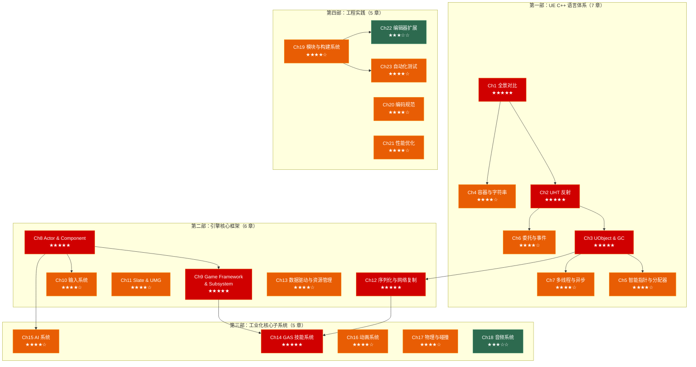

# UE C++ 深入：从 Modern C++ 到就业级 Unreal 开发

> 面向**已有 Modern C++ 基础**的游戏开发者。本系列假设你已了解 C++11~20 核心特性（智能指针、移动语义、Lambda、STL），重点解释 **UE 的世界里一切为什么长这样、怎么用、以及用到工作中不出事**。

---

## 前置知识

本系列是 [C++ 面试突击系列](../cpp_deep_dive/) 的平行续篇。建议先掌握：

- **C++ 内存模型** — 栈/堆/对象布局 → 理解 UE 的 GC 和分配器
- **C++ 智能指针** — `shared_ptr`/`unique_ptr`/`weak_ptr` → 映射到 TSharedPtr/TWeakObjectPtr
- **C++ 多态与虚函数** — vtable 机制 → 理解 UE 反射的本质
- **C++ 模板基础** — UE 容器和算法大量使用模板
- **C++ 移动语义** — UE 的 TArray 和 FString 支持移动

---

## 系列全景



---

## 第一部：UE C++ 语言体系（理解"平行宇宙"）

> **目标**：建立标准 C++ → UE C++ 的心智映射。读完这 7 章，你能看懂任何 UE C++ 代码，知道每个 `F`/`T`/`U`/`A` 前缀意味着什么。

| 章节 | 主题 | 重要度 | 核心内容 |
|------|------|--------|---------|
| [**Ch1**](01_core_differences.md) | 全景对比：UE C++ vs Modern C++ | ★★★★★ | 历史原因、架构全景图、类型映射速查表、从 `std::` 到 Epic 体系的思维转换 |
| **Ch2** | UHT 反射系统深入 | ★★★★★ | UHT 编译流程、四大宏（UCLASS/USTRUCT/UPROPERTY/UFUNCTION）展开原理、`.generated.h` 内容解析、蓝图互操作原理、UFUNCTION 说明符详解 |
| **Ch3** | UObject 与 GC 机制 | ★★★★★ | 标记-清扫 GC 全流程、UObject 生命周期、`NewObject`/`SpawnActor`/`CreateDefaultSubobject` 的区别、`IsValid()` vs `nullptr`、GC 簇与性能优化、`TWeakObjectPtr`/`FObjectPtr` |
| **Ch4** | 容器与字符串体系 | ★★★★☆ | TArray/TMap/TSet API 对照 STL、TInlineAllocator/TMemStackAllocator 策略、FString vs FName vs FText 决策树、字符串编码与转换（TCHAR/UTF-8/UTF-16） |
| **Ch5** | 智能指针与内存分配 | ★★★★☆ | TSharedPtr/TUniquePtr/TWeakPtr vs STL 对比、UObject 为什么不能用智能指针、GMalloc 分配器体系、帧分配器与对象池、内存统计与泄漏检测 |
| **Ch6** | 委托与事件系统 | ★★★★☆ | 单播/多播/动态委托的选择矩阵、DECLARE 宏族详解、委托绑定（BindUObject/BindLambda/BindRaw）、与 `std::function` 的性能对比、蓝图事件绑定 |
| **Ch7** | 多线程与异步编程 | ★★★★☆ | GameThread 铁律与原理、FRunnable/AsyncTask/ParallelFor 使用场景、TaskGraph 系统、`FCriticalSection`/`FScopeLock`/`TAtomic`、渲染线程与游戏线程交互、`FRenderCommand`、▶ 进阶延伸：RDG（Render Dependency Graph）概览与 Niagara 数据传递 |

---

## 第二部：引擎核心框架（理解游戏世界的骨架）

> **目标**：掌握 UE 的架构设计——Actor/Component 模型、Game Framework + Subsystem、输入、UI、网络复制和数据驱动开发。读完能独立搭建一个完整的游戏项目框架。

| 章节 | 主题 | 重要度 | 核心内容 |
|------|------|--------|---------|
| [**Ch8**](08_actor_component.md) | Actor 与 Component 模型 | ★★★★★ | Actor 生命周期（BeginPlay/Tick/EndPlay）、Component 类型（Scene/Actor/ChildActor）、RootComponent、组件附着与层级、ECS 思想在 UE 中的体现 |
| [**Ch9**](09_game_framework_subsystem.md) | Game Framework 与 Subsystem 体系 | ★★★★★ | **Game Framework**：GameMode/GameState/PlayerController/Pawn/PlayerState/HUD/GameInstance 各司其职、游戏流程控制、关卡切换与 Seamless Travel；**Subsystem（UE5 核心模式）**：`UGameInstanceSubsystem` / `UWorldSubsystem` / `ULocalPlayerSubsystem` / `UEditorSubsystem` 的使用场景、生命周期、与传统 GameMode 解耦的实战对比、Subsystem 依赖链与初始化顺序 |
| [**Ch10**](10_input_system.md) | 输入系统 | ★★★★☆ | Enhanced Input 架构（InputAction/InputMappingContext/Modifier/Trigger）、旧版 Axis/Action 映射、输入优先级与消费、触屏与手柄适配 |
| [**Ch11**](11_slate_umg.md) | Slate 与 UMG | ★★★★☆ | Slate 底层声明式语法、UMG Widget 体系、Widget Reflector 调试、ListView/TreeView 数据驱动、UI 动画与材质、本地化（FText 与 StringTable） |
| **Ch12** | 序列化与网络复制 | ★★★★★ | FArchive 序列化体系、UPROPERTY 序列化条件、SaveGame 实战、网络复制基础（Replicated/ReplicatedUsing/NetMulticast）、RPC（Server/Client/NetMulticast）、网络角色与相关性、属性复制条件 |
| **Ch13** | 数据驱动与资源管理 | ★★★★☆ | **DataAsset**：`UPrimaryDataAsset` / `UDataAsset` 替代硬编码、编辑器配置工作流；**DataTable**：`FTableRowBase`、`UDataTable` 的 C++ 读取、Composite DataTable、Curve Table；**软引用最佳实践**：`TSoftObjectPtr` / `FSoftObjectPath` 在大规模数据中的内存策略、同步 vs 异步加载；**Asset Manager**：Primary Asset 标签体系、`StreamableManager`、Level Streaming |

---

## 第三部：工业化核心子系统（理解"开箱即用"的轮子）

> **目标**：掌握 UE 提供的关键子系统——GAS 技能、AI 行为树、动画蓝图、物理和音频。这些是面试和实际项目的高频考点。

| 章节 | 主题 | 重要度 | 核心内容 |
|------|------|--------|---------|
| **Ch14** | Gameplay Ability System | ★★★★★ | GAS 架构全景（ASC/AttributeSet/GameplayAbility/GameplayEffect/GameplayCue/GameplayTag）、Attribute 变化与 Modifier、Ability 激活与取消、Cost 与 Cooldown、网络预测与回滚、GAS 调试 |
| **Ch15** | AI 系统 | ★★★★☆ | Behavior Tree 节点类型（Selector/Sequence/Decorator/Service/Task）、Blackboard、EQS 环境查询、AI Perception（视觉/听觉/伤害感知）、AIController 与 NavMesh |
| **Ch16** | 动画系统 | ★★★★☆ | AnimBlueprint 与 AnimInstance C++ 交互、状态机与 BlendSpace、IK（Two Bone/CCD/FABRIK）、Animation Notify/NotifyState、Montage 与 Slot、Root Motion、Motion Warping |
| **Ch17** | 物理与碰撞 | ★★★★☆ | Chaos 物理引擎基础、碰撞通道与 Preset、Trace（Line/Sphere/Box/Capsule）实战、PhysicsConstraint、物理材质、破坏系统概览 |
| **Ch18** | 音频系统 | ★★★☆☆ | MetaSounds 基础、AudioComponent、SoundCue 节点编辑、Submix 与 Audio Bus、空间音频（Attenuation/HRTF） |

---

## 第四部：工程实践（从写代码到做产品）

> **目标**：掌握真实项目中的工程技能——模块架构、构建系统、编码规范、性能优化、编辑器工具和自动化测试。这些是区分"会写 UE 代码"和"能在团队中交付产品"的关键。

| 章节 | 主题 | 重要度 | 核心内容 |
|------|------|--------|---------|
| **Ch19** | 模块与构建系统 | ★★★★☆ | .Build.cs 与模块依赖、.Target.cs 与构建配置、.uproject 与插件描述、UBT 编译流程、Public/Private 目录规范、模块加载与卸载 |
| **Ch20** | Epic 编码规范与最佳实践 | ★★★★☆ | 命名前缀体系（U/A/F/I/E/T/S/b）、禁用特性（异常/RTTI/STL 公共 API）、`check`/`ensure`/`verify` 错误处理、`Cast<T>` 类型安全转换、接口与多重继承、Asset Naming Convention |
| **Ch21** | 性能分析与优化 | ★★★★☆ | Unreal Insights 使用、stat 命令族（stat unit/game/scenerendering/memory）、迭代优化方法论、常见性能陷阱（Tick 滥用/蓝图与 C++ 边界/GC 抖动）、Slate 性能、RenderDoc 基础 |
| **Ch22** | 编辑器扩展 | ★★★☆☆ | Details Panel 自定义（IDetailCustomization）、Asset Factory 自定义导入、菜单与工具栏扩展、Editor Utility Widget/Blueprint、Asset Action 与 Thumbnail、Slate 编辑器面板 |
| **Ch23** | 自动化测试 | ★★★★☆ | Automation Spec 编写 C++ 单元测试、Latent Commands（异步/延迟测试）、Functional Test（关卡内行为测试）、Gauntlet 框架概览、测试驱动开发在 UE 中的实践、如何在 CI 中跑 UE 测试 |

---

## 推荐阅读路线

### 🚀 快速上手（2 天）

> 明天就开始写 UE C++？先建立心智模型 + 避开常见坑：

```
Day 1: Ch1 全景对比 → Ch20 编码规范 → Ch4 容器与字符串
Day 2: Ch8 Actor & Component → Ch9 Game Framework & Subsystem → 可以开始写东西了
```

### 📚 系统掌握（4 周 · 核心 16 章）

> 覆盖面试和日常工作所需的核心知识：

| 周 | 章节 | 要点 |
|----|------|------|
| Week 1 | Ch1 → Ch2 → Ch3 → Ch4 → Ch5 | 语言基础：反射、GC、容器、内存 |
| Week 2 | Ch6 → Ch7 → Ch8 → Ch9 | 委托、多线程、Actor 模型、GameFramework + Subsystem |
| Week 3 | Ch10 → Ch11 → Ch12 → Ch13 | 输入、UI、网络、数据驱动与资源管理 |
| Week 4 | Ch14 → Ch15 → Ch16 → Ch19 → Ch20 | GAS、AI、动画、构建系统、编码规范 |

### 🎯 就业突击（7 天 · 高频考点）

> 为面试做准备，按考点权重排序：

```
Day 1: Ch1 全景对比 + Ch2 UHT 反射
Day 2: Ch3 UObject & GC + Ch5 智能指针
Day 3: Ch8 Actor & Component + Ch9 Game Framework & Subsystem
Day 4: Ch12 网络复制 + Ch14 GAS
Day 5: Ch7 多线程 + Ch13 数据驱动（DataAsset/DataTable/软引用）
Day 6: Ch6 委托 + Ch11 UMG + Ch10 输入
Day 7: Ch19 构建系统 + Ch20 编码规范 + Ch21 性能优化 + Ch23 自动化测试
```

### 🏆 就业全覆盖（6 周 · 全部 23 章）

> 按 4 部顺序完整阅读 + 手写代码验证 + 搭建个人项目。

| 周 | 章节 | 里程碑 |
|----|------|--------|
| Week 1-2 | 第一部 Ch1–Ch7 | 能读懂任何 UE C++ 代码 |
| Week 3-4 | 第二部 Ch8–Ch13 | 能搭建完整游戏项目框架 |
| Week 5 | 第三部 Ch14–Ch18 | 能使用引擎核心子系统 |
| Week 6 | 第四部 Ch19–Ch23 | 能交付工业化产品 |

---

## 各章面试考点速查

| 章节 | 高频面试问题 |
|------|------------|
| **Ch1** | "UE C++ 和你学的标准 C++ 最大的区别是什么？" |
| **Ch2** | "UPROPERTY 宏到底做了什么？不加会怎样？" |
| **Ch3** | "UE 的 GC 是怎么工作的？怎么防止一个 UObject 被 GC 误删？" |
| **Ch4** | "FName 和 FString 的区别？什么场景该用哪个？" |
| **Ch5** | "UObject 能用 TSharedPtr 吗？为什么？" |
| **Ch6** | "动态委托和普通委托的区别？蓝图怎么绑定 C++ 委托？" |
| **Ch7** | "为什么 UObject 只能在 GameThread 访问？AsyncTask 怎么回到主线程？" |
| **Ch8** | "Actor 和 Component 的关系？什么时候用 Component 而不是继承 Actor？" |
| **Ch9** | "Subsystem 和 GameMode 的区别？什么场景用 UWorldSubsystem？" |
| **Ch12** | "一个属性怎么让它网络同步？Server RPC 和 NetMulticast RPC 的区别？" |
| **Ch13** | "DataAsset 和 DataTable 分别适合什么场景？大规模数据怎么避免内存常驻？" |
| **Ch14** | "GAS 的核心组件有哪些？GameplayEffect 的 Modifier 是怎么计算的？" |
| **Ch21** | "游戏卡顿了，你怎么排查？用过哪些性能分析工具？" |
| **Ch23** | "你写过 UE 的自动化测试吗？Automation Spec 和 Functional Test 有什么区别？" |

---

## 系列特色

- 🔄 **双向对比**：每个概念同时展示标准 C++ 和 UE C++ 写法，从已知映射到未知
- 📊 **图解原理**：Mermaid 图解 UHT 流程、GC 标记清扫、委托绑定链、GAS 架构、网络复制时序、Subsystem 依赖图
- ⚠️ **陷阱速查**：每章收录最常见的崩溃/异常场景及排查方法
- 🎮 **实战驱动**：所有示例来自真实游戏场景（受伤系统、背包系统、技能系统、AI 行为树、网络对战、自动化测试流水线）
- 🔗 **交叉引用**：与 C++ 面试突击系列深度关联；章节间标注前置依赖
- 🗣️ **30 秒速答**：每章结尾可直接用于面试口述的简洁答案
- 🧪 **测试先行**：Ch23 专门讲 UE 自动化测试——大多数初中级开发者不会的技能，面试加分利器
